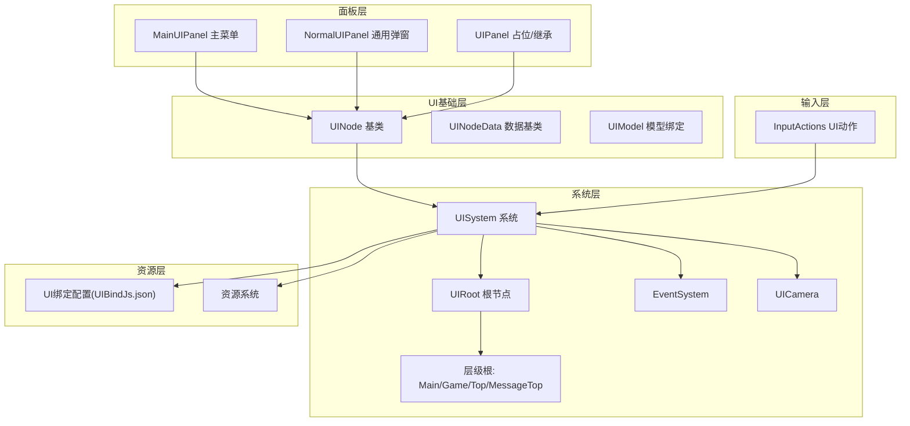
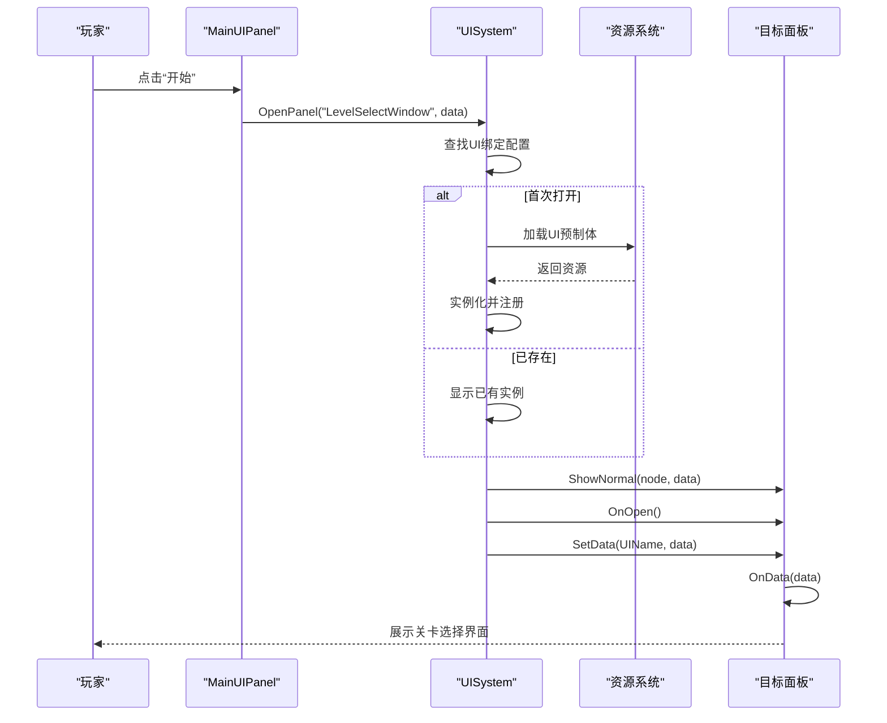
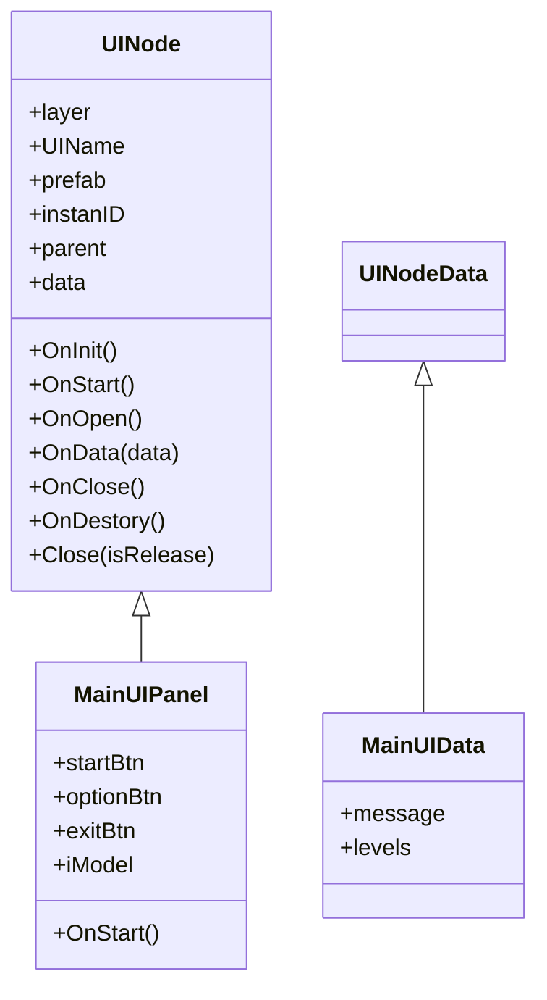
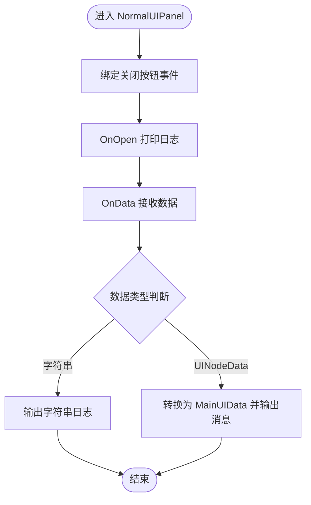
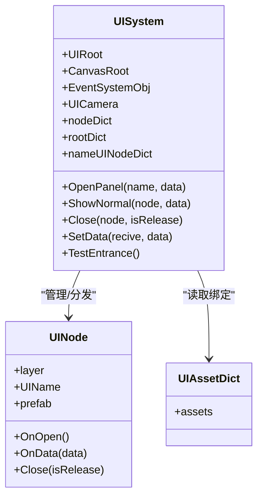
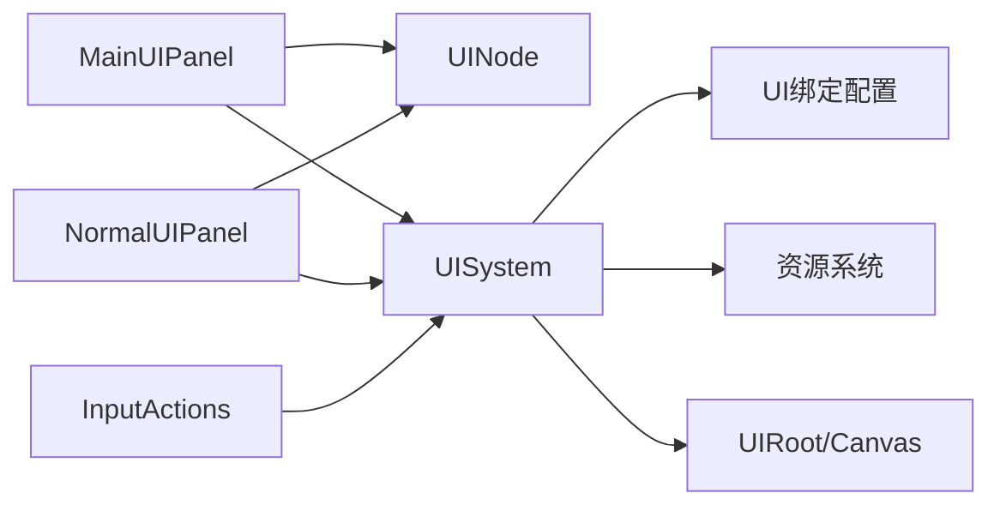

# 主界面系统

<cite>
**本文引用的文件**
- [MainUIPanel.cs](file://Assets/Scripts/UI/MainUI/MainUIPanel.cs)
- [UINode.cs](file://Assets/Scripts/UI/UINode.cs)
- [NormalUIPanel.cs](file://Assets/Scripts/UI/NormalUIPanel.cs)
- [UIPanel.cs](file://Assets/Scripts/UI/UIPanel.cs)
- [UISystem.cs](file://Assets/Scripts/Systems/Implement/UISystem/UISystem.cs)
- [UIModel.cs](file://Assets/Scripts/UI/UIModel.cs)
- [InputActions.cs](file://Assets/Common/InputActions.cs)
</cite>

## 目录
1. [简介](#简介)
2. [项目结构](#项目结构)
3. [核心组件](#核心组件)
4. [架构总览](#架构总览)
5. [详细组件分析](#详细组件分析)
6. [依赖关系分析](#依赖关系分析)
7. [性能考虑](#性能考虑)
8. [故障排查指南](#故障排查指南)
9. [结论](#结论)
10. [附录：扩展开发指南](#附录扩展开发指南)

## 简介
本文件面向ProjectR项目的主界面系统，聚焦于主菜单面板的创建、初始化与管理机制，详解MainUIPanel的核心能力（如游戏启动、场景切换、设置打开）以及UI绑定、事件处理与动画联动的实现路径。同时提供扩展开发指南，帮助开发者新增菜单项、调整界面布局与定制视觉效果；并总结性能优化策略与用户体验设计原则。

## 项目结构
主界面系统采用分层与模块化组织：
- UI基础层：UINode作为所有UI面板的基类，提供生命周期回调、数据传递与关闭释放接口。
- 面板层：MainUIPanel负责主菜单交互；NormalUIPanel用于通用弹窗/窗口的关闭逻辑；UIPanel作为占位或继承基类。
- 系统层：UISystem负责UI根画布、层级根节点、事件系统、相机、资源加载与面板打开/关闭/数据分发。
- 资源层：通过UI绑定配置文件进行UI资源与面板名的映射，支持延迟加载与实例复用。
- 输入层：InputActions提供统一的UI输入动作映射，便于键盘/手柄/鼠标在UI上的导航与提交。

图表来源
- [UINode.cs:1-107](file://Assets/Scripts/UI/UINode.cs#L1-L107)
- [MainUIPanel.cs:1-39](file://Assets/Scripts/UI/MainUI/MainUIPanel.cs#L1-L39)
- [NormalUIPanel.cs:1-34](file://Assets/Scripts/UI/NormalUIPanel.cs#L1-L34)
- [UIPanel.cs:1-9](file://Assets/Scripts/UI/UIPanel.cs#L1-L9)
- [UISystem.cs:1-280](file://Assets/Scripts/Systems/Implement/UISystem/UISystem.cs#L1-L280)
- [InputActions.cs:967-994](file://Assets/Common/InputActions.cs#L967-L994)

章节来源
- [UINode.cs:1-107](file://Assets/Scripts/UI/UINode.cs#L1-L107)
- [UISystem.cs:1-280](file://Assets/Scripts/Systems/Implement/UISystem/UISystem.cs#L1-L280)

## 核心组件
- UINode：定义UI面板的生命周期（OnInit/OnStart/OnOpen/OnData/OnClose/OnDestory）、实例ID、父节点、数据承载与关闭接口。提供Close方法委托给UISystem执行。
- MainUIPanel：主菜单面板，持有开始、选项、退出按钮引用，绑定点击事件；通过UISystem打开“LevelSelectWindow”和“OptionWindowPanel”，并通过UIModel监听模型加载完成事件。
- NormalUIPanel：通用弹窗面板，绑定关闭按钮，调用Close(true)释放实例；OnData中演示如何接收字符串与MainUIData类型数据。
- UISystem：全局UI系统，负责创建UIRoot、Canvas、EventSystem、UICamera；按层级生成根节点；管理面板的加载、显示、隐藏与销毁；通过UI绑定配置进行资源加载与实例复用；提供SetData进行数据分发。
- UIModel：模型绑定组件，提供onLoadDone事件供UI订阅模型加载完成后的回调。
- InputActions：统一的UI输入动作集合，支持导航、提交、取消、点击、滚轮等，便于在UI层进行一致的交互体验。

章节来源
- [UINode.cs:1-107](file://Assets/Scripts/UI/UINode.cs#L1-L107)
- [MainUIPanel.cs:1-39](file://Assets/Scripts/UI/MainUI/MainUIPanel.cs#L1-L39)
- [NormalUIPanel.cs:1-34](file://Assets/Scripts/UI/NormalUIPanel.cs#L1-L34)
- [UISystem.cs:1-280](file://Assets/Scripts/Systems/Implement/UISystem/UISystem.cs#L1-L280)
- [UIModel.cs](file://Assets/Scripts/UI/UIModel.cs)
- [InputActions.cs:967-994](file://Assets/Common/InputActions.cs#L967-L994)

## 架构总览
主界面系统采用“系统驱动+资源绑定+层级管理”的架构：
- 系统初始化阶段：UISystem创建Canvas、EventSystem、UICamera与各层级根节点；随后自动打开“MainPanel”作为入口。
- 面板生命周期：UINode提供统一的生命周期回调；UISystem在加载完成后调用OnOpen与OnData，确保面板可见且具备初始数据。
- 事件与数据流：MainUIPanel通过按钮事件触发UISystem.OpenPanel打开新面板；UISystem根据UI绑定配置加载资源并实例化；通过SetData将数据传递到目标面板。
- 关闭与释放：NormalUIPanel调用Close(true)释放实例；UISystem在isRelease=true时销毁GameObject并从字典移除，避免内存泄漏。

图表来源
- [MainUIPanel.cs:14-30](file://Assets/Scripts/UI/MainUI/MainUIPanel.cs#L14-L30)
- [UISystem.cs:161-178](file://Assets/Scripts/Systems/Implement/UISystem/UISystem.cs#L161-L178)
- [UISystem.cs:115-143](file://Assets/Scripts/Systems/Implement/UISystem/UISystem.cs#L115-L143)
- [UISystem.cs:252-264](file://Assets/Scripts/Systems/Implement/UISystem/UISystem.cs#L252-L264)

## 详细组件分析

### MainUIPanel 分析
- 角色定位：主菜单面板，负责游戏启动、设置打开与模型加载完成事件监听。
- 初始化与事件绑定：在OnStart中绑定按钮点击事件；开始按钮创建MainUIData并通过UISystem.OpenPanel打开“LevelSelectWindow”；选项按钮打开“OptionWindowPanel”。
- 数据传递：MainUIData继承UINodeData，可携带消息与关卡列表等信息。
- 模型加载：通过UIModel.onLoadDone监听模型加载完成事件，便于在主界面展示动态内容或触发后续流程。

图表来源
- [UINode.cs:9-57](file://Assets/Scripts/UI/UINode.cs#L9-L57)
- [MainUIPanel.cs:8-36](file://Assets/Scripts/UI/MainUI/MainUIPanel.cs#L8-L36)

章节来源
- [MainUIPanel.cs:1-39](file://Assets/Scripts/UI/MainUI/MainUIPanel.cs#L1-L39)
- [UINode.cs:1-107](file://Assets/Scripts/UI/UINode.cs#L1-L107)

### NormalUIPanel 分析
- 角色定位：通用弹窗/窗口的关闭逻辑封装，提供统一的关闭入口。
- 生命周期：OnStart中绑定关闭按钮；OnOpen打印日志；OnData中演示对字符串与MainUIData类型的处理。
- 关闭策略：Close(true)会释放实例，适合一次性弹窗；若仅隐藏则传入false。

图表来源
- [NormalUIPanel.cs:9-30](file://Assets/Scripts/UI/NormalUIPanel.cs#L9-L30)

章节来源
- [NormalUIPanel.cs:1-34](file://Assets/Scripts/UI/NormalUIPanel.cs#L1-L34)

### UISystem 分析
- 根节点与层级：创建UIRoot与Canvas，生成Main/Game/Top/MessageTop四层根节点，按深度排列，确保层级正确渲染。
- 事件系统与相机：创建EventSystem与UICamera，设置正交投影与裁剪掩码，保证UI渲染独立于主场景。
- 面板管理：OpenPanel根据UI绑定配置查找并加载/显示面板；ShowNormal负责同一层级下仅激活当前面板；Close支持隐藏或释放实例。
- 数据分发：SetData将数据写入目标面板并触发OnData回调，实现松耦合的数据传递。
- 资源加载：通过资源系统异步加载UI预制体，实例化后注册到对应层级字典，支持重复使用与快速显示。

图表来源
- [UISystem.cs:14-48](file://Assets/Scripts/Systems/Implement/UISystem/UISystem.cs#L14-L48)
- [UISystem.cs:161-246](file://Assets/Scripts/Systems/Implement/UISystem/UISystem.cs#L161-L246)
- [UINode.cs:9-57](file://Assets/Scripts/UI/UINode.cs#L9-L57)

章节来源
- [UISystem.cs:1-280](file://Assets/Scripts/Systems/Implement/UISystem/UISystem.cs#L1-L280)

### UINode 与数据模型
- UINode：提供统一的生命周期与关闭接口；OnInit设置实例ID；OnStart默认将RectTransform居中；OnData支持父节点注入。
- UINodeData：数据基类，MainUIData继承该类以承载业务数据。
- UIModel：提供onLoadDone事件，供UI订阅模型加载完成后的回调，便于在主界面展示动态内容。

章节来源
- [UINode.cs:1-107](file://Assets/Scripts/UI/UINode.cs#L1-L107)
- [MainUIPanel.cs:32-36](file://Assets/Scripts/UI/MainUI/MainUIPanel.cs#L32-L36)
- [UIModel.cs](file://Assets/Scripts/UI/UIModel.cs)

## 依赖关系分析
- MainUIPanel依赖UINode与UISystem；通过按钮事件触发面板切换。
- NormalUIPanel依赖UINode与UISystem；通过Close(true)释放自身。
- UISystem依赖UI绑定配置、资源系统与UI根节点；管理所有面板的生命周期与数据分发。
- InputActions为UI层提供统一输入动作，便于在不同面板中复用一致的交互行为。

图表来源
- [MainUIPanel.cs:14-30](file://Assets/Scripts/UI/MainUI/MainUIPanel.cs#L14-L30)
- [NormalUIPanel.cs:12](file://Assets/Scripts/UI/NormalUIPanel.cs#L12)
- [UISystem.cs:161-246](file://Assets/Scripts/Systems/Implement/UISystem/UISystem.cs#L161-L246)
- [InputActions.cs:967-994](file://Assets/Common/InputActions.cs#L967-L994)

章节来源
- [MainUIPanel.cs:1-39](file://Assets/Scripts/UI/MainUI/MainUIPanel.cs#L1-L39)
- [NormalUIPanel.cs:1-34](file://Assets/Scripts/UI/NormalUIPanel.cs#L1-L34)
- [UISystem.cs:1-280](file://Assets/Scripts/Systems/Implement/UISystem/UISystem.cs#L1-L280)
- [InputActions.cs:967-994](file://Assets/Common/InputActions.cs#L967-L994)

## 性能考虑
- 面板复用：通过nameUINodeDict缓存已加载面板，避免重复实例化，提升打开速度。
- 异步加载：UI资源通过资源系统异步加载，减少主线程阻塞。
- 层级管理：按深度排列层级根节点，减少渲染遮挡与不必要的绘制。
- 事件系统：集中管理EventSystem，避免重复创建导致的性能损耗。
- 内存释放：Close(isRelease=true)彻底销毁实例并从字典移除，防止内存泄漏。

## 故障排查指南
- 打开面板失败：检查UI绑定配置中是否存在目标面板名；确认资源路径有效。
- 面板不显示：确认ShowNormal是否被调用；检查同层级其他面板是否仍处于激活状态。
- 数据未到达：确认SetData的目标UIName是否与面板UIName一致；检查OnData是否正确接收数据类型。
- 关闭异常：确认Close参数；isRelease=true会销毁实例，需谨慎使用。
- 输入无响应：检查InputActions是否启用；确认EventSystem存在且正常工作。

章节来源
- [UISystem.cs:161-178](file://Assets/Scripts/Systems/Implement/UISystem/UISystem.cs#L161-L178)
- [UISystem.cs:252-264](file://Assets/Scripts/Systems/Implement/UISystem/UISystem.cs#L252-L264)
- [InputActions.cs:967-994](file://Assets/Common/InputActions.cs#L967-L994)

## 结论
ProjectR的主界面系统以UINode为核心抽象，结合UISystem的资源绑定与层级管理，实现了主菜单面板的创建、初始化与交互闭环。通过清晰的生命周期与数据分发机制，系统既保证了扩展性，又兼顾了性能与可维护性。建议在扩展新菜单项或界面布局时遵循现有模式，确保与系统解耦与一致性。

## 附录：扩展开发指南
- 新增菜单项
  - 在MainUIPanel中添加按钮引用与点击事件，调用UISystem.OpenPanel打开目标面板。
  - 若目标面板需要数据，构造对应数据类（继承UINodeData），并在OpenPanel时传入。
- 修改界面布局
  - 在UI绑定配置中更新目标面板的prefab路径，或新增面板名与prefab的映射。
  - 调整UINode的OnStart/OnOpen以适配新的布局需求。
- 定制视觉效果
  - 使用UIModel监听模型加载完成事件，在回调中触发动画或特效。
  - 通过层级根节点的深度设置控制前后遮挡关系。
- 用户体验设计原则
  - 保持输入一致性：统一使用InputActions的UI动作，确保导航、提交、取消等行为一致。
  - 数据驱动：通过SetData进行数据分发，避免硬编码状态。
  - 渐进式反馈：在OnOpen与OnData中增加日志或提示，帮助调试与用户感知。

章节来源
- [MainUIPanel.cs:14-30](file://Assets/Scripts/UI/MainUI/MainUIPanel.cs#L14-L30)
- [UISystem.cs:161-246](file://Assets/Scripts/Systems/Implement/UISystem/UISystem.cs#L161-L246)
- [InputActions.cs:967-994](file://Assets/Common/InputActions.cs#L967-L994)