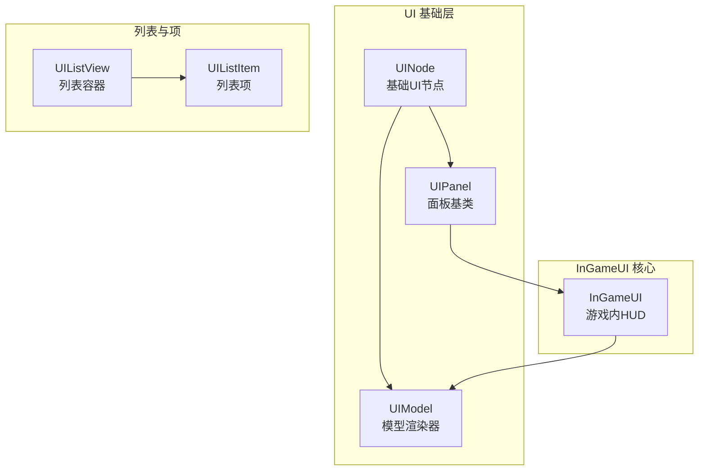
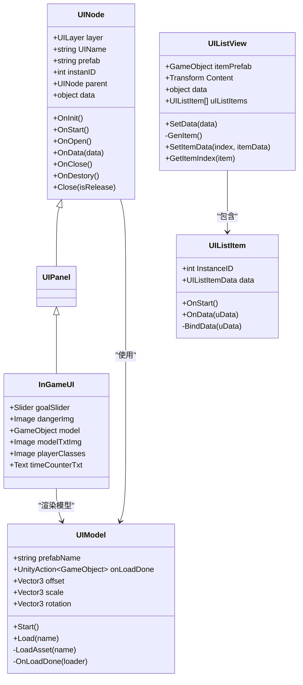
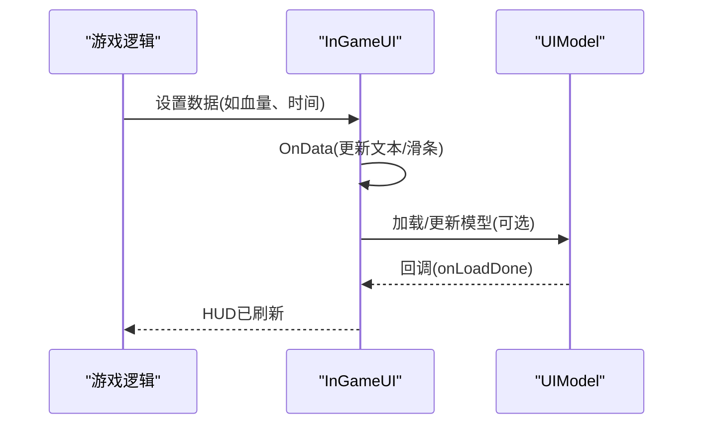
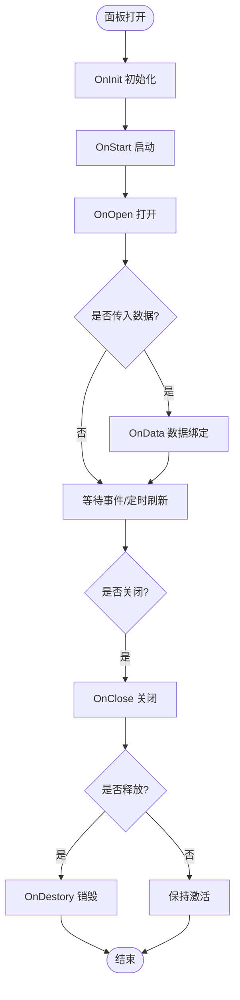
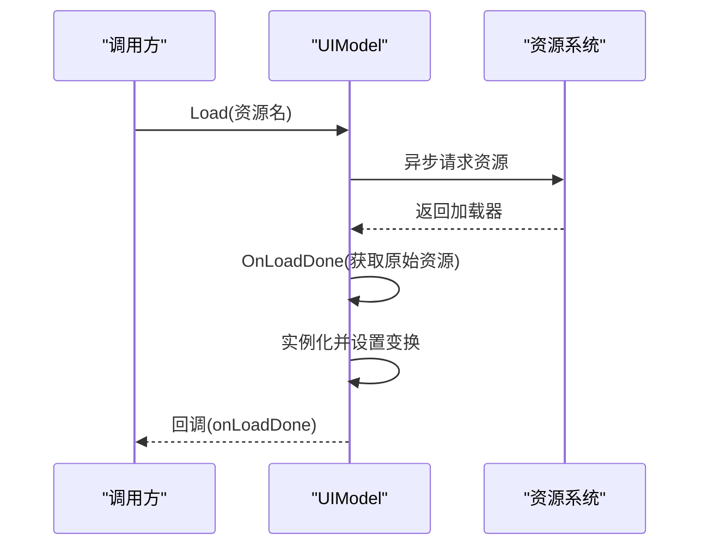
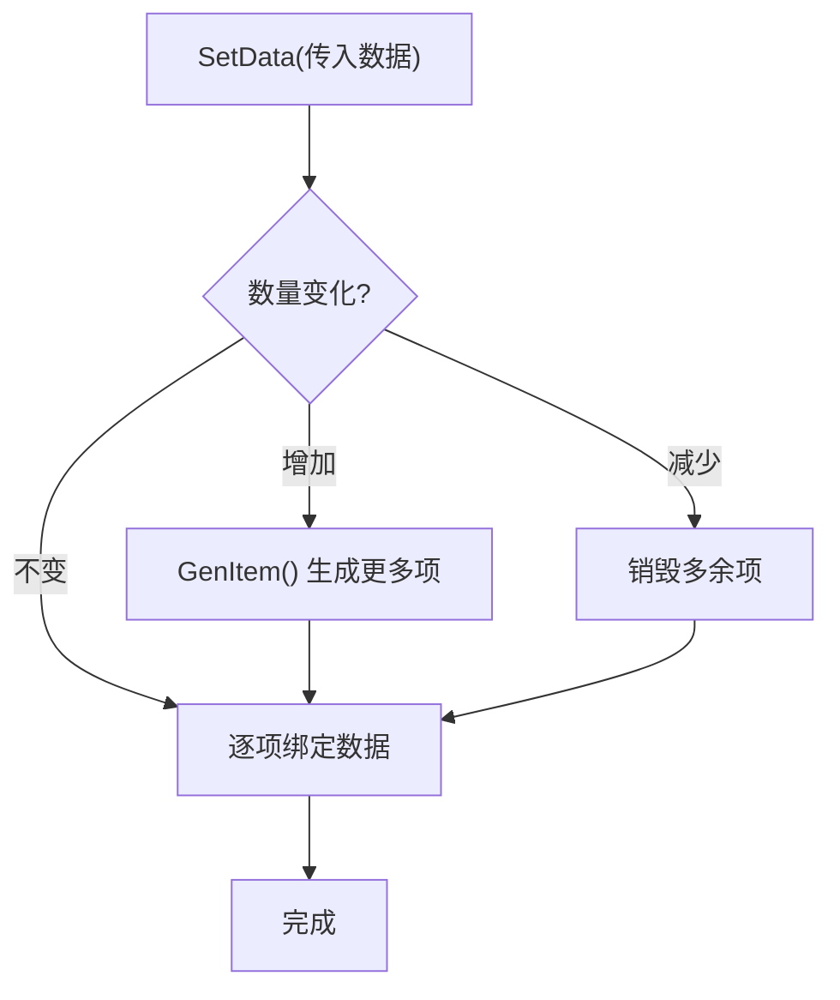
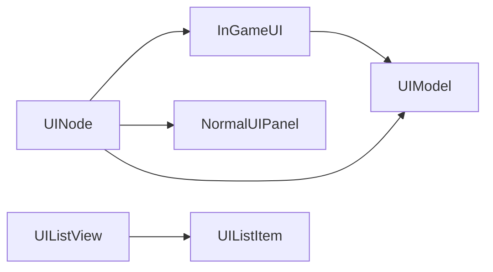

# 游戏内界面系统

<cite>
**本文引用的文件**
- [InGameUI.cs](file://Assets/Scripts/UI/InGameUI/InGameUI.cs)
- [UINode.cs](file://Assets/Scripts/UI/UINode.cs)
- [UIModel.cs](file://Assets/Scripts/UI/UIModel.cs)
- [UIListItem.cs](file://Assets/Scripts/UI/UIListItem.cs)
- [UIListView.cs](file://Assets/Scripts/UI/UIListView.cs)
- [NormalUIPanel.cs](file://Assets/Scripts/UI/NormalUIPanel.cs)
- [UIPanel.cs](file://Assets/Scripts/UI/UIPanel.cs)
</cite>

## 目录
1. [简介](#简介)
2. [项目结构](#项目结构)
3. [核心组件](#核心组件)
4. [架构总览](#架构总览)
5. [详细组件分析](#详细组件分析)
6. [依赖关系分析](#依赖关系分析)
7. [性能考量](#性能考量)
8. [故障排查指南](#故障排查指南)
9. [结论](#结论)
10. [附录：扩展开发指南](#附录扩展开发指南)

## 简介
本文件面向ProjectR项目的“游戏内界面系统（InGameUI）”，系统性梳理并说明游戏运行时的HUD组件设计与实现，包括血条、蓝条、道具栏、计分板等实时显示元素的组织方式、数据绑定机制、动态更新策略与性能优化建议。同时提供扩展开发指南，帮助开发者新增HUD元素、调整界面布局以及实现跨平台适配。

## 项目结构
UI系统采用“节点化”架构，以UINode为基础抽象，派生出不同类型的UI面板与列表项，配合资源异步加载与数据驱动绑定，形成可扩展、可维护的界面体系。

图表来源
- [UINode.cs:1-107](file://Assets/Scripts/UI/UINode.cs#L1-L107)
- [UIPanel.cs:1-9](file://Assets/Scripts/UI/UIPanel.cs#L1-L9)
- [InGameUI.cs:1-18](file://Assets/Scripts/UI/InGameUI/InGameUI.cs#L1-L18)
- [UIModel.cs:1-63](file://Assets/Scripts/UI/UIModel.cs#L1-L63)
- [UIListView.cs:1-101](file://Assets/Scripts/UI/UIListView.cs#L1-L101)
- [UIListItem.cs:1-50](file://Assets/Scripts/UI/UIListItem.cs#L1-L50)

章节来源
- [UINode.cs:1-107](file://Assets/Scripts/UI/UINode.cs#L1-L107)
- [UIPanel.cs:1-9](file://Assets/Scripts/UI/UIPanel.cs#L1-L9)
- [InGameUI.cs:1-18](file://Assets/Scripts/UI/InGameUI/InGameUI.cs#L1-L18)
- [UIModel.cs:1-63](file://Assets/Scripts/UI/UIModel.cs#L1-L63)
- [UIListView.cs:1-101](file://Assets/Scripts/UI/UIListView.cs#L1-L101)
- [UIListItem.cs:1-50](file://Assets/Scripts/UI/UIListItem.cs#L1-L50)

## 核心组件
- InGameUI：游戏内HUD容器，挂载血条、危险提示、时间计数器等控件，作为运行时界面的根节点之一。
- UINode：所有UI节点的基类，提供生命周期回调（OnInit/OnStart/OnOpen/OnData/OnClose/OnDestory）、父子关系管理与关闭接口。
- UIModel：负责异步加载并实例化UI模型资源，支持位置、缩放、旋转与层级设置。
- UIListView/UIListItem：列表容器与列表项，支持动态生成、复用与数据绑定，适合道具栏、任务列表等场景。
- NormalUIPanel：示例面板，演示按钮事件绑定与数据接收流程。

章节来源
- [InGameUI.cs:1-18](file://Assets/Scripts/UI/InGameUI/InGameUI.cs#L1-L18)
- [UINode.cs:1-107](file://Assets/Scripts/UI/UINode.cs#L1-L107)
- [UIModel.cs:1-63](file://Assets/Scripts/UI/UIModel.cs#L1-L63)
- [UIListView.cs:1-101](file://Assets/Scripts/UI/UIListView.cs#L1-L101)
- [UIListItem.cs:1-50](file://Assets/Scripts/UI/UIListItem.cs#L1-L50)
- [NormalUIPanel.cs:1-34](file://Assets/Scripts/UI/NormalUIPanel.cs#L1-L34)

## 架构总览
下图展示了InGameUI与其子组件、资源加载与数据流的关系：

图表来源
- [UINode.cs:1-107](file://Assets/Scripts/UI/UINode.cs#L1-L107)
- [UIPanel.cs:1-9](file://Assets/Scripts/UI/UIPanel.cs#L1-L9)
- [InGameUI.cs:1-18](file://Assets/Scripts/UI/InGameUI/InGameUI.cs#L1-L18)
- [UIModel.cs:1-63](file://Assets/Scripts/UI/UIModel.cs#L1-L63)
- [UIListView.cs:1-101](file://Assets/Scripts/UI/UIListView.cs#L1-L101)
- [UIListItem.cs:1-50](file://Assets/Scripts/UI/UIListItem.cs#L1-L50)

## 详细组件分析

### InGameUI 组件分析
- 职责：承载游戏内HUD控件，如目标血条、危险提示、时间计数器等；可与UIModel结合用于在HUD中展示角色或物品模型。
- 数据绑定：通过OnData接收外部数据对象，按需更新控件状态。
- 生命周期：继承自UINode，遵循统一的初始化与打开流程。

图表来源
- [InGameUI.cs:1-18](file://Assets/Scripts/UI/InGameUI/InGameUI.cs#L1-L18)
- [UIModel.cs:1-63](file://Assets/Scripts/UI/UIModel.cs#L1-L63)

章节来源
- [InGameUI.cs:1-18](file://Assets/Scripts/UI/InGameUI/InGameUI.cs#L1-L18)

### UINode 与面板体系
- UINode提供统一的生命周期与数据通道，确保所有UI节点具备一致的行为契约。
- UIPanel作为UINode的特化类型，便于按面板维度进行扩展。
- NormalUIPanel展示了典型的数据接收与按钮事件绑定模式，可作为新面板的模板。

图表来源
- [UINode.cs:1-107](file://Assets/Scripts/UI/UINode.cs#L1-L107)
- [NormalUIPanel.cs:1-34](file://Assets/Scripts/UI/NormalUIPanel.cs#L1-L34)

章节来源
- [UINode.cs:1-107](file://Assets/Scripts/UI/UINode.cs#L1-L107)
- [NormalUIPanel.cs:1-34](file://Assets/Scripts/UI/NormalUIPanel.cs#L1-L34)

### UIModel 动态模型加载
- 异步加载：通过协程与资源系统异步加载指定名称的UI模型资源。
- 实例化与变换：在加载完成后实例化到当前节点下，并应用偏移、缩放、旋转与层级设置。
- 回调通知：加载完成时触发回调，供上层继续处理（如绑定事件、动画播放）。

图表来源
- [UIModel.cs:1-63](file://Assets/Scripts/UI/UIModel.cs#L1-L63)

章节来源
- [UIModel.cs:1-63](file://Assets/Scripts/UI/UIModel.cs#L1-L63)

### UIListView 与 UIListItem 列表体系
- UIListView负责根据数据源动态生成或回收UIListItem，维持列表内容与数据的一致性。
- UIListItem提供数据绑定入口，支持键值对形式的灵活数据存储与访问。
- 适用于道具栏、任务列表、聊天消息等需要频繁增删改的场景。

图表来源
- [UIListView.cs:1-101](file://Assets/Scripts/UI/UIListView.cs#L1-L101)
- [UIListItem.cs:1-50](file://Assets/Scripts/UI/UIListItem.cs#L1-L50)

章节来源
- [UIListView.cs:1-101](file://Assets/Scripts/UI/UIListView.cs#L1-L101)
- [UIListItem.cs:1-50](file://Assets/Scripts/UI/UIListItem.cs#L1-L50)

## 依赖关系分析
- InGameUI依赖UINode提供的生命周期与关闭机制，同时可组合UIModel进行模型渲染。
- UIListView与UIListItem之间存在强依赖关系，前者负责容器与生命周期管理，后者负责单项渲染与数据绑定。
- NormalUIPanel作为示例面板，示范了UINode的使用方式与数据传递路径。

图表来源
- [UINode.cs:1-107](file://Assets/Scripts/UI/UINode.cs#L1-L107)
- [InGameUI.cs:1-18](file://Assets/Scripts/UI/InGameUI/InGameUI.cs#L1-L18)
- [UIModel.cs:1-63](file://Assets/Scripts/UI/UIModel.cs#L1-L63)
- [UIListView.cs:1-101](file://Assets/Scripts/UI/UIListView.cs#L1-L101)
- [UIListItem.cs:1-50](file://Assets/Scripts/UI/UIListItem.cs#L1-L50)
- [NormalUIPanel.cs:1-34](file://Assets/Scripts/UI/NormalUIPanel.cs#L1-L34)

章节来源
- [UINode.cs:1-107](file://Assets/Scripts/UI/UINode.cs#L1-L107)
- [InGameUI.cs:1-18](file://Assets/Scripts/UI/InGameUI/InGameUI.cs#L1-L18)
- [UIModel.cs:1-63](file://Assets/Scripts/UI/UIModel.cs#L1-L63)
- [UIListView.cs:1-101](file://Assets/Scripts/UI/UIListView.cs#L1-L101)
- [UIListItem.cs:1-50](file://Assets/Scripts/UI/UIListItem.cs#L1-L50)
- [NormalUIPanel.cs:1-34](file://Assets/Scripts/UI/NormalUIPanel.cs#L1-L34)

## 性能考量
- 资源异步加载：UIModel通过协程异步加载资源，避免阻塞主线程，降低首帧卡顿风险。
- 列表项复用：UIListView仅在数量变化时生成或销毁项，其余情况复用现有项，减少GC与Instantiate开销。
- 层级与渲染：UIModel在实例化后统一设置层级，有助于减少不必要的渲染计算。
- 数据绑定最小化：UIListItem内部使用键值对存储数据，避免复杂对象拷贝，提高绑定效率。

## 故障排查指南
- UIModel加载失败：检查资源名与路径是否正确，确认资源系统返回的加载器不为空；查看日志输出定位问题。
- 列表项数据错位：确认SetData传入的数据列表长度与UIListView当前项数匹配，避免索引越界。
- 面板事件无效：检查NormalUIPanel中的按钮事件绑定是否在OnStart中注册，确保面板处于激活状态。
- 关闭与释放：使用UINode.Close触发关闭流程，必要时传入释放参数以彻底销毁资源。

章节来源
- [UIModel.cs:1-63](file://Assets/Scripts/UI/UIModel.cs#L1-L63)
- [UIListView.cs:1-101](file://Assets/Scripts/UI/UIListView.cs#L1-L101)
- [NormalUIPanel.cs:1-34](file://Assets/Scripts/UI/NormalUIPanel.cs#L1-L34)
- [UINode.cs:1-107](file://Assets/Scripts/UI/UINode.cs#L1-L107)

## 结论
ProjectR的InGameUI系统以UINode为核心，结合UIModel与UIListView/Item，构建了可扩展、可维护且性能友好的游戏内界面框架。通过明确的生命周期与数据绑定机制，能够高效地实现血条、蓝条、道具栏、计分板等HUD组件，并为后续扩展提供清晰的开发路径。

## 附录：扩展开发指南
- 新增HUD元素
  - 在InGameUI中添加对应控件字段，并在OnData中实现更新逻辑。
  - 若涉及模型展示，可使用UIModel加载并实例化模型，设置变换与回调。
- 调整界面布局
  - 使用UINode的RectTransform初始化逻辑，确保面板居中或按需定位。
  - 对于列表型HUD（如道具栏），优先使用UIListView与UIListItem，减少手动管理。
- 实时数据展示
  - 在数据变更处调用OnData或直接更新控件属性，确保UI与业务状态同步。
  - 对高频更新的数值（如血量、时间），考虑节流或缓存策略，避免过度刷新。
- 动画与过渡
  - 可在OnOpen/OnClose中接入动画播放逻辑，提升交互体验。
  - 对UIModel加载完成后的回调，可用于触发动画或特效。
- 跨平台适配
  - 控件尺寸与间距建议使用相对单位或Canvas Scaler，保证在不同分辨率下的一致性。
  - 字体与图标资源应提供多分辨率版本，避免模糊或拉伸。

章节来源
- [InGameUI.cs:1-18](file://Assets/Scripts/UI/InGameUI/InGameUI.cs#L1-L18)
- [UINode.cs:1-107](file://Assets/Scripts/UI/UINode.cs#L1-L107)
- [UIModel.cs:1-63](file://Assets/Scripts/UI/UIModel.cs#L1-L63)
- [UIListView.cs:1-101](file://Assets/Scripts/UI/UIListView.cs#L1-L101)
- [UIListItem.cs:1-50](file://Assets/Scripts/UI/UIListItem.cs#L1-L50)
- [NormalUIPanel.cs:1-34](file://Assets/Scripts/UI/NormalUIPanel.cs#L1-L34)