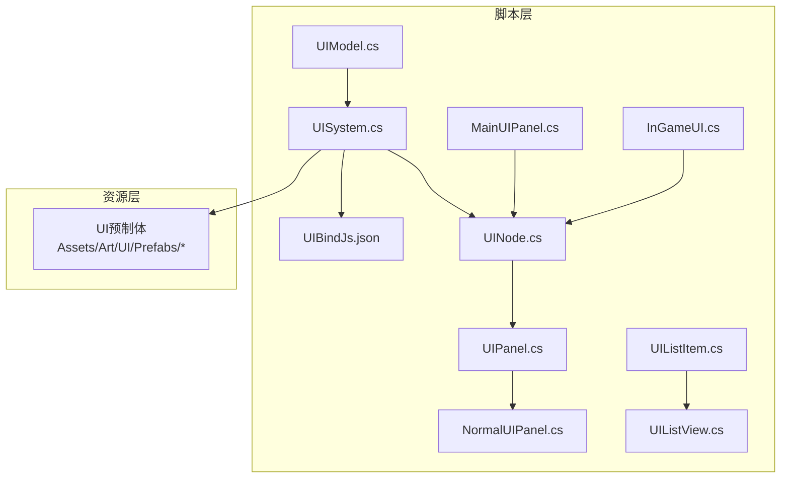
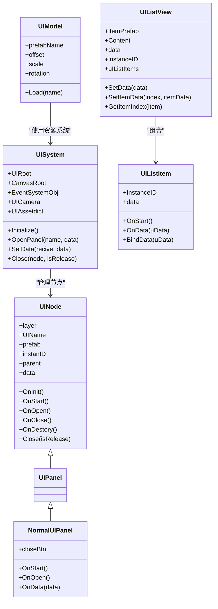
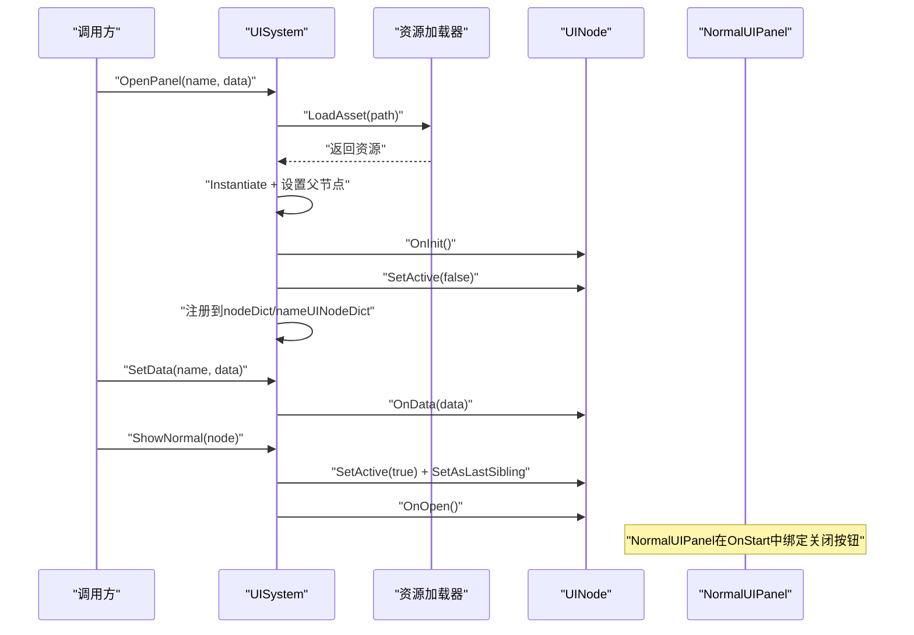
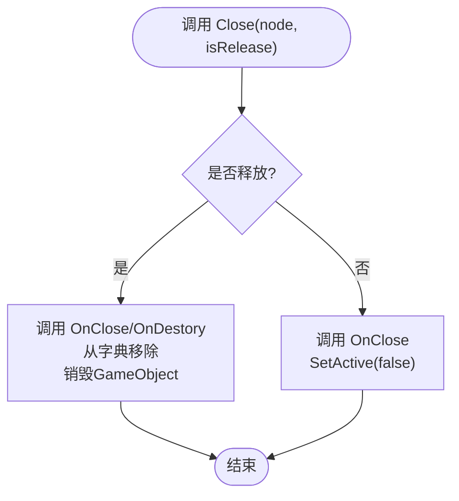
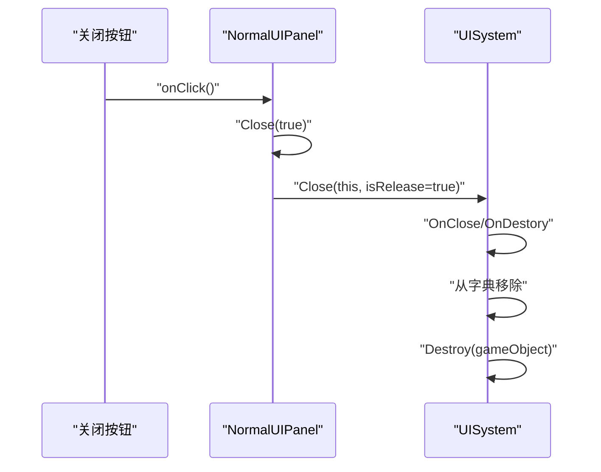
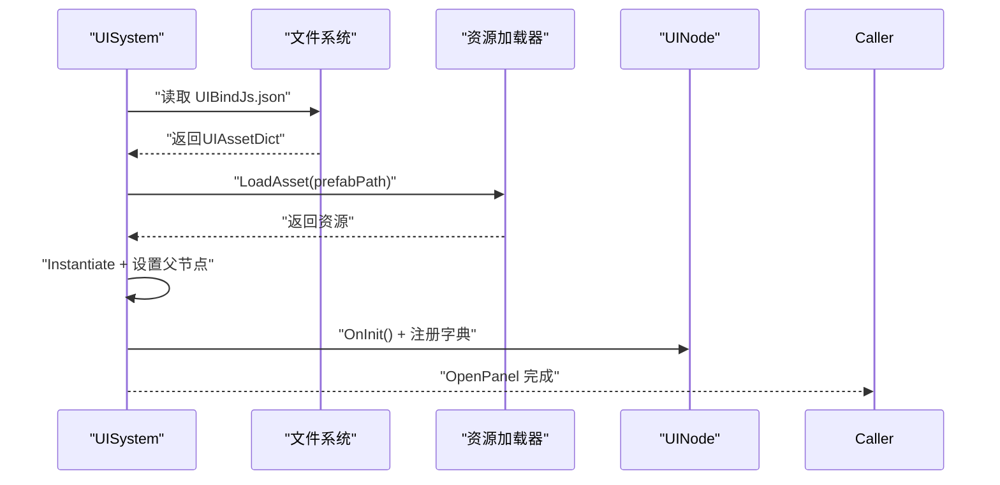
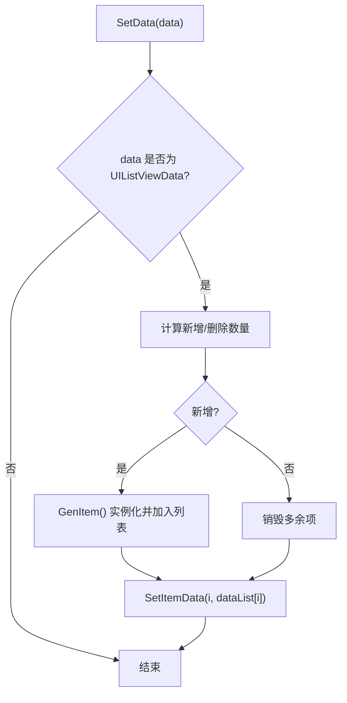
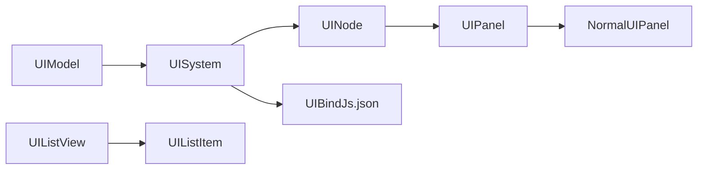

# 用户界面模块

<cite>
**本文引用的文件**
- [UINode.cs](file://Assets/Scripts/UI/UINode.cs)
- [UIPanel.cs](file://Assets/Scripts/UI/UIPanel.cs)
- [NormalUIPanel.cs](file://Assets/Scripts/UI/NormalUIPanel.cs)
- [UIModel.cs](file://Assets/Scripts/UI/UIModel.cs)
- [UIListItem.cs](file://Assets/Scripts/UI/UIListItem.cs)
- [UIListView.cs](file://Assets/Scripts/UI/UIListView.cs)
- [UISystem.cs](file://Assets/Scripts/Systems/Implement/UISystem/UISystem.cs)
- [UIBindJs.json](file://Assets/Scripts/UI/UIBindJs.json)
- [MainUIPanel.cs](file://Assets/Scripts/UI/MainUI/MainUIPanel.cs)
- [InGameUI.cs](file://Assets/Scripts/UI/InGameUI/InGameUI.cs)
</cite>

## 目录
1. [简介](#简介)
2. [项目结构](#项目结构)
3. [核心组件](#核心组件)
4. [架构总览](#架构总览)
5. [详细组件分析](#详细组件分析)
6. [依赖关系分析](#依赖关系分析)
7. [性能考虑](#性能考虑)
8. [故障排查指南](#故障排查指南)
9. [结论](#结论)
10. [附录](#附录)

## 简介
本文件面向ProjectR项目的用户界面模块，系统性阐述UI系统的架构与实现，覆盖主界面、窗口界面、游戏内界面等多类型UI的管理机制；详解UI节点系统、面板管理、事件处理与资源加载；解释UI绑定机制、UI资源管理与布局适配；并提供扩展开发指南（自定义UI面板创建与样式定制）、性能优化策略与响应式设计原则。文中所有技术细节均基于仓库中实际源码进行分析，并通过图示与“章节来源”标注具体文件位置。

## 项目结构
UI模块位于Assets/Scripts/UI下，包含基础节点与列表组件、系统层的UI管理器以及UI资源绑定配置；同时在Assets/Art/UI/Prefabs中存放各类UI预制体，分别对应主界面、窗口界面与游戏内界面等场景。

**图表来源**
- [UISystem.cs:38-48](file://Assets/Scripts/Systems/Implement/UISystem/UISystem.cs#L38-L48)
- [UINode.cs:9-57](file://Assets/Scripts/UI/UINode.cs#L9-L57)
- [UIPanel.cs:3-6](file://Assets/Scripts/UI/UIPanel.cs#L3-L6)
- [NormalUIPanel.cs:6-31](file://Assets/Scripts/UI/NormalUIPanel.cs#L6-L31)
- [UIListItem.cs:6-24](file://Assets/Scripts/UI/UIListItem.cs#L6-L24)
- [UIListView.cs:8-68](file://Assets/Scripts/UI/UIListView.cs#L8-L68)
- [UIBindJs.json:1-32](file://Assets/Scripts/UI/UIBindJs.json#L1-L32)

**章节来源**
- [UISystem.cs:38-48](file://Assets/Scripts/Systems/Implement/UISystem/UISystem.cs#L38-L48)
- [UIBindJs.json:1-32](file://Assets/Scripts/UI/UIBindJs.json#L1-L32)

## 核心组件
- UI节点系统：UINode作为所有UI节点的基类，提供生命周期回调（初始化、启动、打开、关闭、销毁），支持父子节点关系与数据传递。
- 面板类型：UIPanel派生自UINode；NormalUIPanel为通用面板示例，内置关闭按钮事件绑定。
- 列表系统：UIListItem与UIListView构成可复用的列表渲染框架，支持动态生成、数据绑定与索引定位。
- 资源模型：UIModel负责异步加载UI预制体并实例化，支持偏移、缩放、旋转与层级设置。
- UI系统：UISystem负责Canvas根节点、事件系统、UI相机、分层根节点、面板打开/关闭、资源加载与数据分发。
- 绑定配置：UIBindJs.json提供UI名称到预制体路径的映射，供UISystem在运行时解析与加载。

**章节来源**
- [UINode.cs:9-57](file://Assets/Scripts/UI/UINode.cs#L9-L57)
- [UIPanel.cs:3-6](file://Assets/Scripts/UI/UIPanel.cs#L3-L6)
- [NormalUIPanel.cs:6-31](file://Assets/Scripts/UI/NormalUIPanel.cs#L6-L31)
- [UIListItem.cs:6-24](file://Assets/Scripts/UI/UIListItem.cs#L6-L24)
- [UIListView.cs:8-68](file://Assets/Scripts/UI/UIListView.cs#L8-L68)
- [UIModel.cs:9-61](file://Assets/Scripts/UI/UIModel.cs#L9-L61)
- [UISystem.cs:21-48](file://Assets/Scripts/Systems/Implement/UISystem/UISystem.cs#L21-L48)
- [UIBindJs.json:1-32](file://Assets/Scripts/UI/UIBindJs.json#L1-L32)

## 架构总览
UI系统采用分层架构：系统层（UISystem）负责全局管理（Canvas、事件系统、相机、分层根节点、资源加载、面板生命周期）；节点层（UINode及其派生）负责单个UI的生命周期与数据；列表层（UIListView/Item）负责列表渲染；资源层（UIBindJs.json与预制体）负责UI资产绑定与加载。

**图表来源**
- [UISystem.cs:21-265](file://Assets/Scripts/Systems/Implement/UISystem/UISystem.cs#L21-L265)
- [UINode.cs:9-57](file://Assets/Scripts/UI/UINode.cs#L9-L57)
- [UIPanel.cs:3-6](file://Assets/Scripts/UI/UIPanel.cs#L3-L6)
- [NormalUIPanel.cs:6-31](file://Assets/Scripts/UI/NormalUIPanel.cs#L6-L31)
- [UIListItem.cs:6-24](file://Assets/Scripts/UI/UIListItem.cs#L6-L24)
- [UIListView.cs:8-68](file://Assets/Scripts/UI/UIListView.cs#L8-L68)
- [UIModel.cs:9-61](file://Assets/Scripts/UI/UIModel.cs#L9-L61)

## 详细组件分析

### UI节点系统与生命周期
- 基类UINode提供统一的生命周期：OnInit（初始化实例ID）、OnStart（默认将RectTransform本地坐标归零）、OnOpen/OnClose/OnDestory（空实现，供子类覆盖）。
- 支持父子节点关系：OnData可接收父节点UINode，形成树形结构。
- NormalUIPanel示例展示了如何在OnStart中绑定关闭按钮事件，并在OnOpen/OnData中输出调试信息，便于扩展业务逻辑。

**图表来源**
- [UISystem.cs:161-246](file://Assets/Scripts/Systems/Implement/UISystem/UISystem.cs#L161-L246)
- [NormalUIPanel.cs:9-13](file://Assets/Scripts/UI/NormalUIPanel.cs#L9-L13)

**章节来源**
- [UINode.cs:25-57](file://Assets/Scripts/UI/UINode.cs#L25-L57)
- [NormalUIPanel.cs:9-31](file://Assets/Scripts/UI/NormalUIPanel.cs#L9-L31)

### 面板管理与分层
- 分层枚举：Main（全屏界面）、Game（游戏中界面）、Top（弹窗）、MessageTop（最顶级）。
- 根节点：每个层级一个Transform根节点，按屏幕尺寸锚定，Z轴按层级递减以保证渲染顺序。
- 打开流程：若未实例化则先加载预制体并加入对应层级根节点；若已存在则仅激活并置顶。
- 关闭流程：支持释放（销毁GameObject）与隐藏（SetActive(false)）两种模式。

**图表来源**
- [UISystem.cs:145-160](file://Assets/Scripts/Systems/Implement/UISystem/UISystem.cs#L145-L160)

**章节来源**
- [UISystem.cs:14-20](file://Assets/Scripts/Systems/Implement/UISystem/UISystem.cs#L14-L20)
- [UISystem.cs:49-114](file://Assets/Scripts/Systems/Implement/UISystem/UISystem.cs#L49-L114)
- [UISystem.cs:145-160](file://Assets/Scripts/Systems/Implement/UISystem/UISystem.cs#L145-L160)

### UI事件处理与交互
- 事件系统：UISystem在初始化时创建EventSystem对象，确保UGUI事件正常工作。
- 关闭按钮：NormalUIPanel在OnStart中为关闭按钮添加点击监听，触发Close(true)释放面板。
- 数据分发：UISystem.SetData根据面板名称查找目标节点，设置data并调用OnData(data)。

**图表来源**
- [NormalUIPanel.cs:8-12](file://Assets/Scripts/UI/NormalUIPanel.cs#L8-L12)
- [UISystem.cs:145-160](file://Assets/Scripts/Systems/Implement/UISystem/UISystem.cs#L145-L160)

**章节来源**
- [UISystem.cs:64-72](file://Assets/Scripts/Systems/Implement/UISystem/UISystem.cs#L64-L72)
- [NormalUIPanel.cs:9-13](file://Assets/Scripts/UI/NormalUIPanel.cs#L9-L13)
- [UISystem.cs:252-264](file://Assets/Scripts/Systems/Implement/UISystem/UISystem.cs#L252-L264)

### UI资源管理与绑定
- 绑定配置：UIBindJs.json提供UI名称到预制体路径的映射，UISystem在初始化时读取该配置。
- 加载流程：UISystem通过ResourceSystem异步加载预制体，实例化后设置父节点、锚点与尺寸，并注册到节点字典。
- UIModel：独立的UIModel组件用于加载并实例化任意UI预制体，支持偏移、缩放、旋转与层级设置，适用于需要动态挂载UI模型的场景。

**图表来源**
- [UISystem.cs:38-48](file://Assets/Scripts/Systems/Implement/UISystem/UISystem.cs#L38-L48)
- [UISystem.cs:179-246](file://Assets/Scripts/Systems/Implement/UISystem/UISystem.cs#L179-L246)
- [UIBindJs.json:1-32](file://Assets/Scripts/UI/UIBindJs.json#L1-L32)

**章节来源**
- [UISystem.cs:38-48](file://Assets/Scripts/Systems/Implement/UISystem/UISystem.cs#L38-L48)
- [UISystem.cs:179-246](file://Assets/Scripts/Systems/Implement/UISystem/UISystem.cs#L179-L246)
- [UIBindJs.json:1-32](file://Assets/Scripts/UI/UIBindJs.json#L1-L32)
- [UIModel.cs:20-59](file://Assets/Scripts/UI/UIModel.cs#L20-L59)

### UI列表系统
- UIListView：持有itemPrefab与Content容器，根据传入的UIListViewData动态增删UIListItem并绑定数据。
- UIListItem：持有InstanceID与UIListItemData，提供OnStart与OnData钩子，支持数据存取。
- 动态适配：当数据列表长度变化时，自动增删item以匹配数据量。

**图表来源**
- [UIListView.cs:18-45](file://Assets/Scripts/UI/UIListView.cs#L18-L45)
- [UIListView.cs:50-63](file://Assets/Scripts/UI/UIListView.cs#L50-L63)

**章节来源**
- [UIListView.cs:8-68](file://Assets/Scripts/UI/UIListView.cs#L8-L68)
- [UIListItem.cs:6-24](file://Assets/Scripts/UI/UIListItem.cs#L6-L24)

### 主界面与游戏内界面
- MainUIPanel：作为主界面面板，继承UINode，可在OnStart/OnOpen/OnData中接入主界面业务逻辑。
- InGameUI：作为游戏内界面的承载类，可结合UINode体系实现游戏内HUD或提示面板。

**章节来源**
- [MainUIPanel.cs](file://Assets/Scripts/UI/MainUI/MainUIPanel.cs)
- [InGameUI.cs](file://Assets/Scripts/UI/InGameUI/InGameUI.cs)

## 依赖关系分析
- UISystem对UINode具有强依赖：注册、激活、关闭、销毁均围绕UINode展开。
- UINode对UI资源绑定配置（UIBindJs.json）间接依赖：通过UISystem加载时解析。
- UIListView与UIListItem为组合关系，UIModel独立于UISystem，但可通过资源系统加载UI预制体。
- 事件系统由UISystem创建，确保UGUI交互可用。

**图表来源**
- [UISystem.cs:21-48](file://Assets/Scripts/Systems/Implement/UISystem/UISystem.cs#L21-L48)
- [UINode.cs:9-57](file://Assets/Scripts/UI/UINode.cs#L9-L57)
- [UIListView.cs:8-68](file://Assets/Scripts/UI/UIListView.cs#L8-L68)
- [UIListItem.cs:6-24](file://Assets/Scripts/UI/UIListItem.cs#L6-L24)
- [UIModel.cs:9-61](file://Assets/Scripts/UI/UIModel.cs#L9-L61)

**章节来源**
- [UISystem.cs:21-48](file://Assets/Scripts/Systems/Implement/UISystem/UISystem.cs#L21-L48)
- [UINode.cs:9-57](file://Assets/Scripts/UI/UINode.cs#L9-L57)
- [UIListView.cs:8-68](file://Assets/Scripts/UI/UIListView.cs#L8-L68)
- [UIListItem.cs:6-24](file://Assets/Scripts/UI/UIListItem.cs#L6-L24)
- [UIModel.cs:9-61](file://Assets/Scripts/UI/UIModel.cs#L9-L61)

## 性能考虑
- 异步加载：UIModel与UISystem均采用协程异步加载资源，避免主线程阻塞。
- 对象池化：建议在UISystem中引入UINode实例池，减少频繁Instantiate/Destroy带来的GC压力（扩展建议）。
- 屏幕适配：Canvas使用Screen.width/height与锚点适配，确保不同分辨率下布局一致（已在代码中体现）。
- 渲染优化：UICamera仅渲染UI层（layer 5），并使用正交投影，降低深度比较与裁剪成本。
- 事件系统：集中创建EventSystem，避免重复实例化导致的性能损耗。

[本节为通用性能指导，不直接分析具体文件]

## 故障排查指南
- UI未显示：检查UISystem是否正确创建Canvas、EventSystem与UICamera；确认UIBindJs.json中是否存在目标面板名称；确认OpenPanel调用参数正确。
- 面板无法关闭：检查NormalUIPanel的关闭按钮事件绑定是否生效；确认Close(true)是否被调用。
- 数据未更新：确认SetData调用的目标面板名称与UIName一致；检查OnData(data)是否被正确调用。
- 资源加载失败：检查UIModel/UISystem的LoadAsset返回值与错误日志；确认预制体路径与资源名一致。

**章节来源**
- [UISystem.cs:179-246](file://Assets/Scripts/Systems/Implement/UISystem/UISystem.cs#L179-L246)
- [NormalUIPanel.cs:9-13](file://Assets/Scripts/UI/NormalUIPanel.cs#L9-L13)
- [UIModel.cs:20-59](file://Assets/Scripts/UI/UIModel.cs#L20-L59)

## 结论
ProjectR的UI模块以UINode为核心，配合UISystem实现分层管理、资源绑定与生命周期控制；UIListView/Item提供高效的列表渲染能力；UIModel支持动态加载UI模型。整体架构清晰、职责明确，具备良好的扩展性与可维护性。建议后续引入实例池、更完善的事件路由与样式系统，以进一步提升性能与开发效率。

[本节为总结性内容，不直接分析具体文件]

## 附录

### UI扩展开发指南
- 创建自定义UI面板
  - 新建脚本继承UINode（或UIPanel），在OnStart中初始化控件，在OnOpen/OnData中接入业务逻辑。
  - 在UIBindJs.json中注册新面板名称与预制体路径。
  - 通过UISystem.OpenPanel("你的面板名")打开面板；如需传参，使用UISystem.SetData("你的面板名", data)。
- 定制UI样式
  - 使用UGUI组件（Image/Button/Text等）在预制体中布局。
  - 如需动态挂载UI模型，可使用UIModel组件加载指定预制体并设置偏移/缩放/旋转。
- 列表渲染
  - 准备UIListItemData与UIListItem，将UIListItem拖入UIListView的itemPrefab字段。
  - 通过UIListView.SetData传入UIListViewData，系统会自动增删item并绑定数据。

**章节来源**
- [UINode.cs:25-57](file://Assets/Scripts/UI/UINode.cs#L25-L57)
- [UIBindJs.json:1-32](file://Assets/Scripts/UI/UIBindJs.json#L1-L32)
- [UISystem.cs:161-246](file://Assets/Scripts/Systems/Implement/UISystem/UISystem.cs#L161-L246)
- [UIModel.cs:20-59](file://Assets/Scripts/UI/UIModel.cs#L20-L59)
- [UIListView.cs:18-63](file://Assets/Scripts/UI/UIListView.cs#L18-L63)