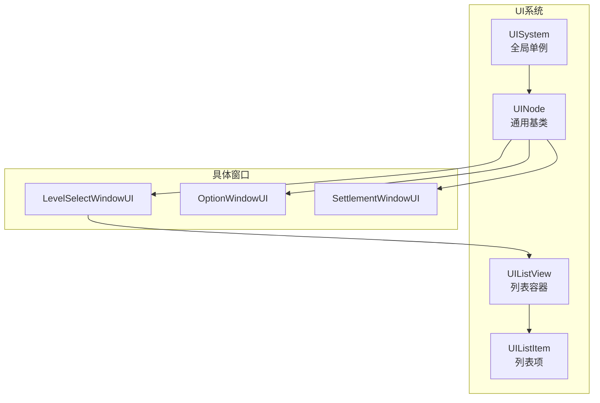
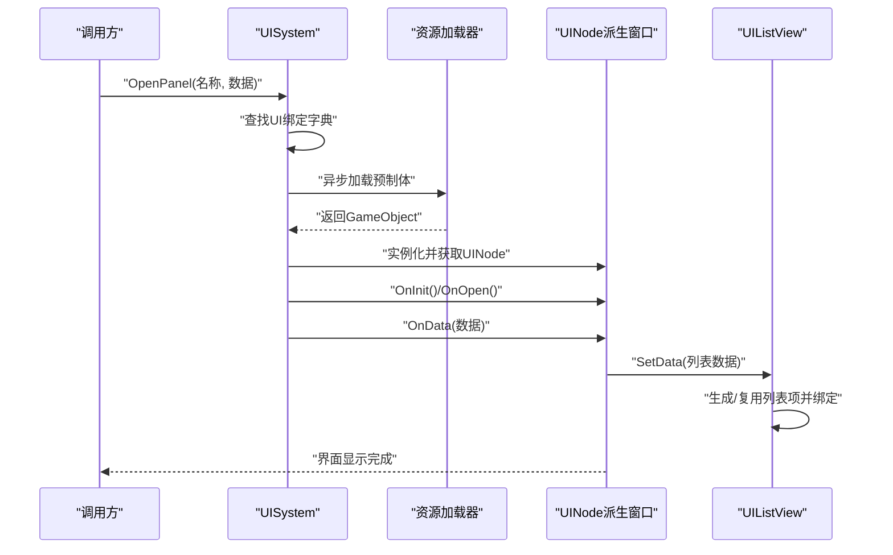
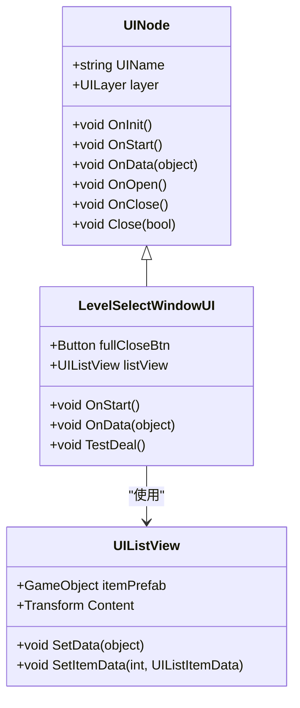
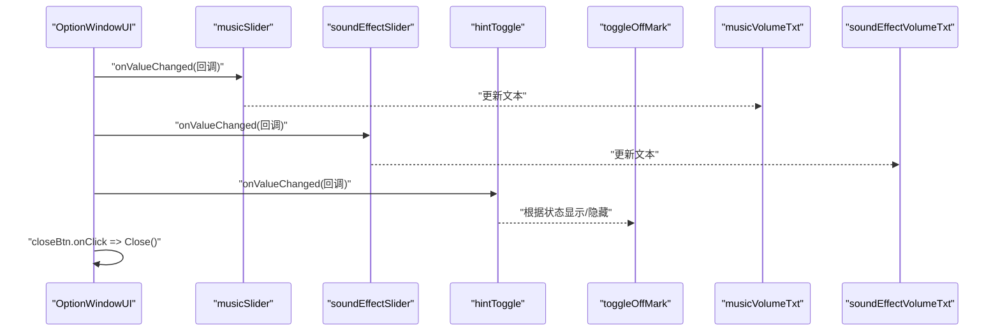
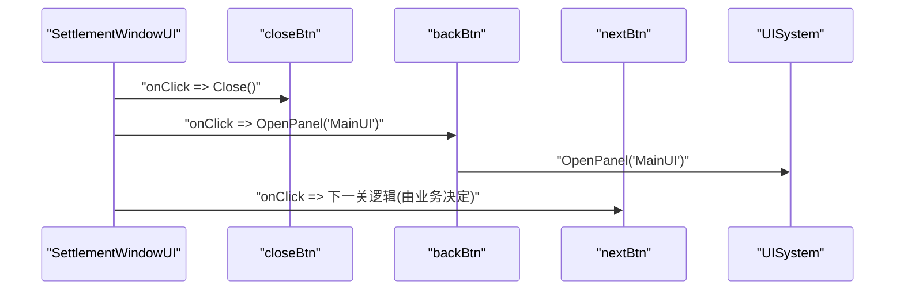
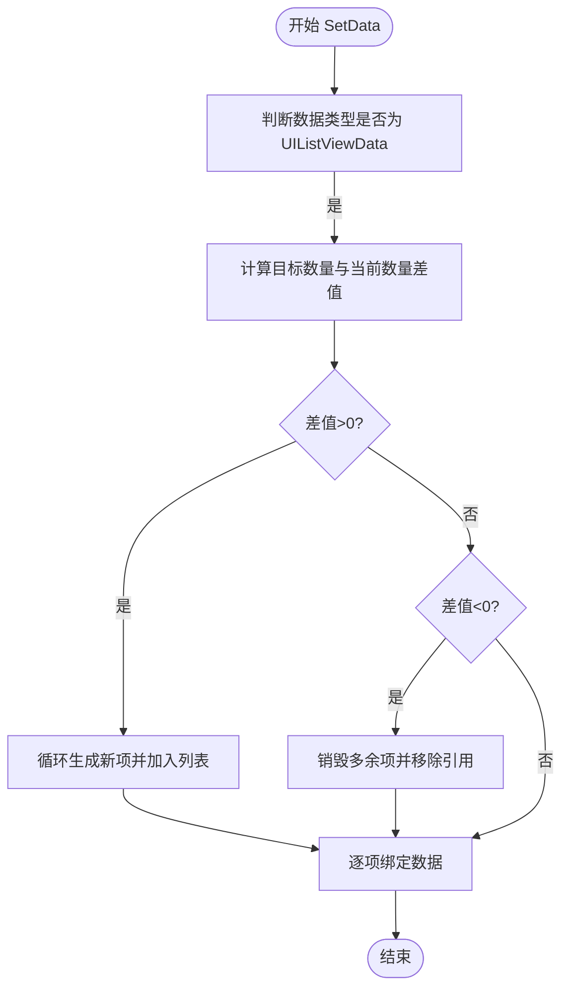
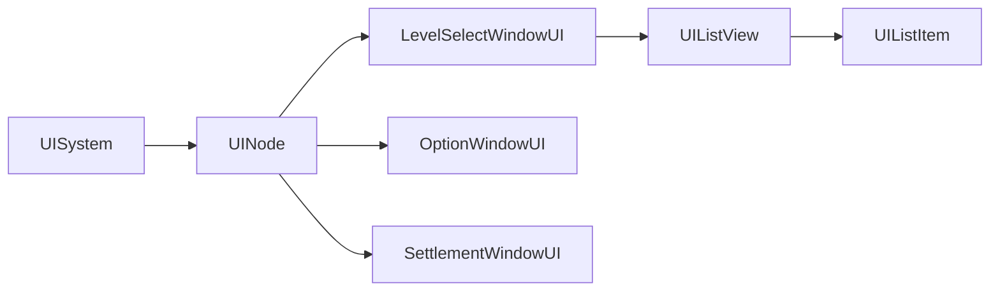

# 窗口界面系统

<cite>
**本文引用的文件**
- [LevelSelectWindowUI.cs](file://Assets/Scripts/UI/Window/LevelSelectWindowUI.cs)
- [OptionWindowUI.cs](file://Assets/Scripts/UI/Window/OptionWindowUI.cs)
- [SettlementWindowUI.cs](file://Assets/Scripts/UI/Window/SettlementWindowUI.cs)
- [UINode.cs](file://Assets/Scripts/UI/UINode.cs)
- [UISystem.cs](file://Assets/Scripts/Systems/Implement/UISystem/UISystem.cs)
- [UIListView.cs](file://Assets/Scripts/UI/UIListView.cs)
- [UIListItem.cs](file://Assets/Scripts/UI/UIListItem.cs)
</cite>

## 目录
1. [简介](#简介)
2. [项目结构](#项目结构)
3. [核心组件](#核心组件)
4. [架构总览](#架构总览)
5. [详细组件分析](#详细组件分析)
6. [依赖关系分析](#依赖关系分析)
7. [性能考虑](#性能考虑)
8. [故障排查指南](#故障排查指南)
9. [结论](#结论)
10. [附录：扩展开发指南](#附录扩展开发指南)

## 简介
本文件面向ProjectR项目的窗口界面系统，围绕关卡选择窗口、选项设置窗口、结算窗口等UI模块进行深入解析。重点涵盖：
- LevelSelectWindowUI的关卡列表管理、关卡预览与选择逻辑
- OptionWindowUI的设置项管理与参数调整
- SettlementWindowUI的结算界面与奖励展示
- 窗口界面的通用基类设计、窗口切换机制与数据传递方式
- 扩展开发指南（自定义窗口类型、窗口布局定制、交互逻辑实现）

## 项目结构
UI系统采用“节点化”与“分层容器”相结合的架构：
- 基类UINode负责生命周期回调（初始化、启动、打开、关闭、销毁）与通用行为（关闭调用UISystem）
- UISystem作为全局单例，负责UI画布、层级根节点、事件系统、相机、资源加载与面板打开/关闭
- 列表组件UIListView与UIListItem提供可复用的列表渲染与数据绑定能力
- 具体窗口（LevelSelectWindowUI、OptionWindowUI、SettlementWindowUI）继承UINode并实现各自业务逻辑

图表来源
- [UINode.cs:1-107](file://Assets/Scripts/UI/UINode.cs#L1-L107)
- [UISystem.cs:1-280](file://Assets/Scripts/Systems/Implement/UISystem/UISystem.cs#L1-L280)
- [UIListView.cs:1-101](file://Assets/Scripts/UI/UIListView.cs#L1-L101)
- [UIListItem.cs:1-50](file://Assets/Scripts/UI/UIListItem.cs#L1-L50)
- [LevelSelectWindowUI.cs:1-50](file://Assets/Scripts/UI/Window/LevelSelectWindowUI.cs#L1-L50)
- [OptionWindowUI.cs:1-29](file://Assets/Scripts/UI/Window/OptionWindowUI.cs#L1-L29)
- [SettlementWindowUI.cs:1-24](file://Assets/Scripts/UI/Window/SettlementWindowUI.cs#L1-L24)

章节来源
- [UINode.cs:1-107](file://Assets/Scripts/UI/UINode.cs#L1-L107)
- [UISystem.cs:1-280](file://Assets/Scripts/Systems/Implement/UISystem/UISystem.cs#L1-L280)
- [UIListView.cs:1-101](file://Assets/Scripts/UI/UIListView.cs#L1-L101)
- [UIListItem.cs:1-50](file://Assets/Scripts/UI/UIListItem.cs#L1-L50)
- [LevelSelectWindowUI.cs:1-50](file://Assets/Scripts/UI/Window/LevelSelectWindowUI.cs#L1-L50)
- [OptionWindowUI.cs:1-29](file://Assets/Scripts/UI/Window/OptionWindowUI.cs#L1-L29)
- [SettlementWindowUI.cs:1-24](file://Assets/Scripts/UI/Window/SettlementWindowUI.cs#L1-L24)

## 核心组件
- UINode：所有UI窗口的基类，提供统一的生命周期回调与关闭入口，内部通过UISystem执行关闭操作
- UISystem：全局UI系统，负责画布、层级根节点、事件系统、相机、资源加载与面板打开/关闭
- UIListView/UIListItem：列表容器与列表项，支持动态生成、复用与数据绑定
- LevelSelectWindowUI：关卡选择窗口，负责列表数据填充与交互
- OptionWindowUI：选项设置窗口，负责音量滑条与提示开关的联动
- SettlementWindowUI：结算窗口，负责关闭、返回主界面等交互

章节来源
- [UINode.cs:1-107](file://Assets/Scripts/UI/UINode.cs#L1-L107)
- [UISystem.cs:1-280](file://Assets/Scripts/Systems/Implement/UISystem/UISystem.cs#L1-L280)
- [UIListView.cs:1-101](file://Assets/Scripts/UI/UIListView.cs#L1-L101)
- [UIListItem.cs:1-50](file://Assets/Scripts/UI/UIListItem.cs#L1-L50)
- [LevelSelectWindowUI.cs:1-50](file://Assets/Scripts/UI/Window/LevelSelectWindowUI.cs#L1-L50)
- [OptionWindowUI.cs:1-29](file://Assets/Scripts/UI/Window/OptionWindowUI.cs#L1-L29)
- [SettlementWindowUI.cs:1-24](file://Assets/Scripts/UI/Window/SettlementWindowUI.cs#L1-L24)

## 架构总览
下图展示了从打开面板到数据绑定与交互的关键流程：

图表来源
- [UISystem.cs:161-264](file://Assets/Scripts/Systems/Implement/UISystem/UISystem.cs#L161-L264)
- [UINode.cs:25-55](file://Assets/Scripts/UI/UINode.cs#L25-L55)
- [UIListView.cs:18-67](file://Assets/Scripts/UI/UIListView.cs#L18-L67)

章节来源
- [UISystem.cs:161-264](file://Assets/Scripts/Systems/Implement/UISystem/UISystem.cs#L161-L264)
- [UINode.cs:25-55](file://Assets/Scripts/UI/UINode.cs#L25-L55)
- [UIListView.cs:18-67](file://Assets/Scripts/UI/UIListView.cs#L18-L67)

## 详细组件分析

### LevelSelectWindowUI 关卡选择窗口
- 职责与特性
  - 提供“全关闭按钮”，点击后调用基类Close方法
  - 接收OnData数据（如MainUIData），并在控制台输出message
  - 内置TestDeal方法用于演示列表数据填充：构造多个UIListItemData，封装为UIListViewData，并调用listView.SetData
- 关键交互
  - OnStart中注册按钮事件
  - OnData中处理传入数据并触发列表更新
- 列表管理
  - 通过UIListView与UIListItemData配合，实现列表项的动态生成与数据绑定
  - 列表项数据使用键值对存储，支持level、islock、bestTime等字段

图表来源
- [LevelSelectWindowUI.cs:7-46](file://Assets/Scripts/UI/Window/LevelSelectWindowUI.cs#L7-L46)
- [UINode.cs:9-57](file://Assets/Scripts/UI/UINode.cs#L9-L57)
- [UIListView.cs:8-67](file://Assets/Scripts/UI/UIListView.cs#L8-L67)

章节来源
- [LevelSelectWindowUI.cs:1-50](file://Assets/Scripts/UI/Window/LevelSelectWindowUI.cs#L1-L50)
- [UINode.cs:1-107](file://Assets/Scripts/UI/UINode.cs#L1-L107)
- [UIListView.cs:1-101](file://Assets/Scripts/UI/UIListView.cs#L1-L101)

### OptionWindowUI 选项设置窗口
- 职责与特性
  - 提供音乐音量、音效音量两个Slider，以及提示Toggle
  - 关闭按钮点击后调用基类Close
  - 切换提示Toggle时，根据状态显示/隐藏“关闭标记”
  - 实时同步Slider数值到对应文本显示
- 参数调整流程
  - OnStart中初始化事件监听
  - Slider变化时更新对应文本
  - Toggle变化时控制标记显隐

图表来源
- [OptionWindowUI.cs:14-26](file://Assets/Scripts/UI/Window/OptionWindowUI.cs#L14-L26)

章节来源
- [OptionWindowUI.cs:1-29](file://Assets/Scripts/UI/Window/OptionWindowUI.cs#L1-L29)

### SettlementWindowUI 结算窗口
- 职责与特性
  - 提供关闭、下一关、返回主界面三个按钮
  - OnStart中注册按钮事件
  - 返回主界面时调用UISystem.OpenPanel("MainUI")
- 奖励展示
  - 提供clearTimeTxt、killBossTimeTxt、jugeTxt、bestTimeTxt等文本控件，用于展示结算信息
  - newRecordImg用于标识新纪录

图表来源
- [SettlementWindowUI.cs:16-21](file://Assets/Scripts/UI/Window/SettlementWindowUI.cs#L16-L21)

章节来源
- [SettlementWindowUI.cs:1-24](file://Assets/Scripts/UI/Window/SettlementWindowUI.cs#L1-L24)

### 列表组件：UIListView 与 UIListItem
- UIListView
  - 通过itemPrefab在Content下动态生成UIListItem
  - SetData根据传入的UIListViewData动态增删列表项，并逐项绑定数据
  - 支持根据数据数量自动扩容或收缩
- UIListItem
  - 通过OnData接收UIListItemData并绑定到自身
  - UIListItemData以键值对存储字段，提供SetData与GetData接口

图表来源
- [UIListView.cs:18-67](file://Assets/Scripts/UI/UIListView.cs#L18-L67)
- [UIListItem.cs:10-23](file://Assets/Scripts/UI/UIListItem.cs#L10-L23)

章节来源
- [UIListView.cs:1-101](file://Assets/Scripts/UI/UIListView.cs#L1-L101)
- [UIListItem.cs:1-50](file://Assets/Scripts/UI/UIListItem.cs#L1-L50)

## 依赖关系分析
- 组件耦合
  - LevelSelectWindowUI依赖UIListView与UIListItemData进行列表渲染
  - OptionWindowUI与SettlementWindowUI仅依赖UINode提供的通用生命周期与关闭机制
  - UISystem贯穿面板加载、实例化、数据传递与关闭释放
- 层级与根节点
  - UISystem按UILayer(Main/Game/Top/MessageTop)维护独立根节点，确保层级深度与渲染顺序
- 数据流
  - OpenPanel携带的数据经UISystem转交给目标UINode的OnData
  - 列表数据通过UIListViewData与UIListItemData进行解耦传递

图表来源
- [UISystem.cs:21-48](file://Assets/Scripts/Systems/Implement/UISystem/UISystem.cs#L21-L48)
- [UINode.cs:9-57](file://Assets/Scripts/UI/UINode.cs#L9-L57)
- [LevelSelectWindowUI.cs:7-14](file://Assets/Scripts/UI/Window/LevelSelectWindowUI.cs#L7-L14)
- [UIListView.cs:8-17](file://Assets/Scripts/UI/UIListView.cs#L8-L17)
- [UIListItem.cs:6-23](file://Assets/Scripts/UI/UIListItem.cs#L6-L23)

章节来源
- [UISystem.cs:1-280](file://Assets/Scripts/Systems/Implement/UISystem/UISystem.cs#L1-L280)
- [UINode.cs:1-107](file://Assets/Scripts/UI/UINode.cs#L1-L107)
- [UIListView.cs:1-101](file://Assets/Scripts/UI/UIListView.cs#L1-L101)
- [UIListItem.cs:1-50](file://Assets/Scripts/UI/UIListItem.cs#L1-L50)
- [LevelSelectWindowUI.cs:1-50](file://Assets/Scripts/UI/Window/LevelSelectWindowUI.cs#L1-L50)
- [OptionWindowUI.cs:1-29](file://Assets/Scripts/UI/Window/OptionWindowUI.cs#L1-L29)
- [SettlementWindowUI.cs:1-24](file://Assets/Scripts/UI/Window/SettlementWindowUI.cs#L1-L24)

## 性能考虑
- 列表渲染优化
  - UIListView通过复用现有列表项而非频繁Instantiate/Destroy，降低GC压力
  - 动态增删项时仅对差异部分进行操作，避免全量重建
- 资源加载
  - UISystem使用异步加载资源，避免阻塞主线程
  - 面板实例化后按层级挂载至对应根节点，减少Canvas层级复杂度
- 事件绑定
  - 建议在OnStart中集中注册事件，在OnClose中统一注销，防止重复绑定与内存泄漏

## 故障排查指南
- 打开面板失败
  - 现象：日志报错“不存在名称xxx的UIPanel”
  - 原因：UI绑定字典中缺少该名称
  - 处理：检查UI绑定配置文件，确认名称与预制体路径一致
- 面板无法显示
  - 现象：面板实例化但不显示
  - 原因：未调用ShowNormal或未正确设置激活状态
  - 处理：确认OpenPanel流程已进入ShowNormal分支并设置激活
- 列表不更新
  - 现象：SetData后列表无变化
  - 原因：数据类型不匹配或itemPrefab未设置
  - 处理：确保传入UIListViewData且itemPrefab有效
- 关闭异常
  - 现象：Close后资源未释放
  - 原因：未传入isRelease或未正确注销事件
  - 处理：在需要彻底释放时调用Close(isRelease=true)，并在OnClose中清理事件

章节来源
- [UISystem.cs:174-178](file://Assets/Scripts/Systems/Implement/UISystem/UISystem.cs#L174-L178)
- [UISystem.cs:145-160](file://Assets/Scripts/Systems/Implement/UISystem/UISystem.cs#L145-L160)
- [UIListView.cs:18-44](file://Assets/Scripts/UI/UIListView.cs#L18-L44)
- [UINode.cs:52-55](file://Assets/Scripts/UI/UINode.cs#L52-L55)

## 结论
ProjectR的窗口界面系统以UINode为基类，结合UISystem的统一面板管理与UIListView的高效列表渲染，形成了清晰、可扩展的UI架构。LevelSelectWindowUI、OptionWindowUI、SettlementWindowUI分别覆盖了关卡选择、设置调整与结算展示等核心场景，具备良好的可维护性与扩展性。

## 附录：扩展开发指南
- 自定义窗口类型
  - 新建类继承UINode，命名遵循“XxxWindowUI.cs”，在OnStart中注册事件
  - 在UI绑定配置中添加名称与预制体路径映射
  - 使用UISystem.OpenPanel("你的窗口名")打开
- 窗口布局定制
  - 将UINode.UIName设置为唯一标识，便于数据路由与调试
  - 通过UINode.layer选择合适的层级（Main/Game/Top/MessageTop）
- 交互逻辑实现
  - 在OnData中接收并处理传入数据，必要时调用列表组件SetData
  - 在OnStart中注册按钮、滑条、Toggle等事件；在OnClose中统一注销
  - 使用UINode.Close()关闭窗口；若需彻底释放资源，传入isRelease=true

章节来源
- [UINode.cs:11-57](file://Assets/Scripts/UI/UINode.cs#L11-L57)
- [UISystem.cs:161-178](file://Assets/Scripts/Systems/Implement/UISystem/UISystem.cs#L161-L178)
- [UIListView.cs:18-44](file://Assets/Scripts/UI/UIListView.cs#L18-L44)