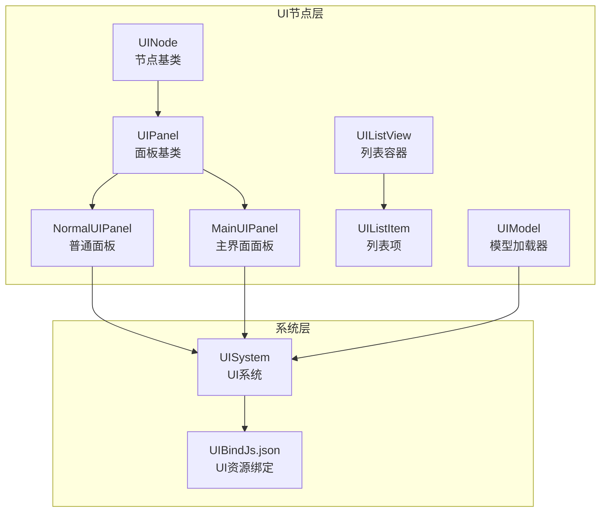
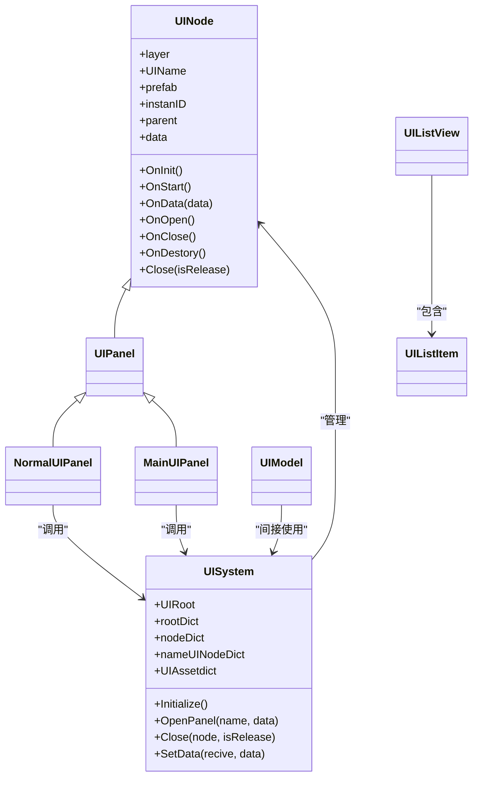
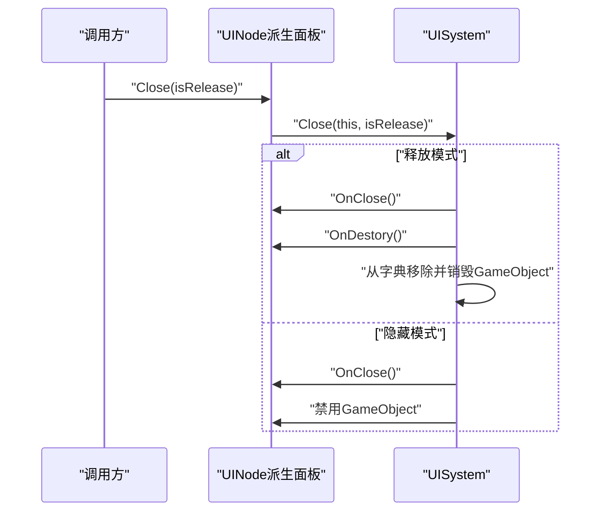
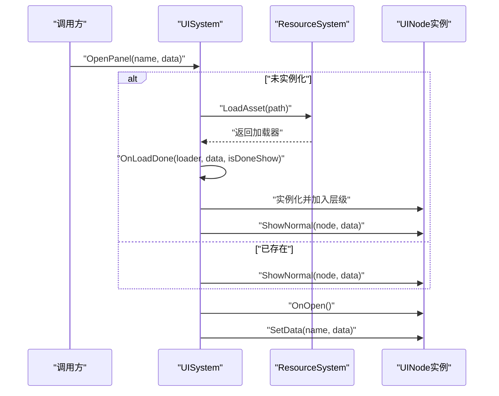
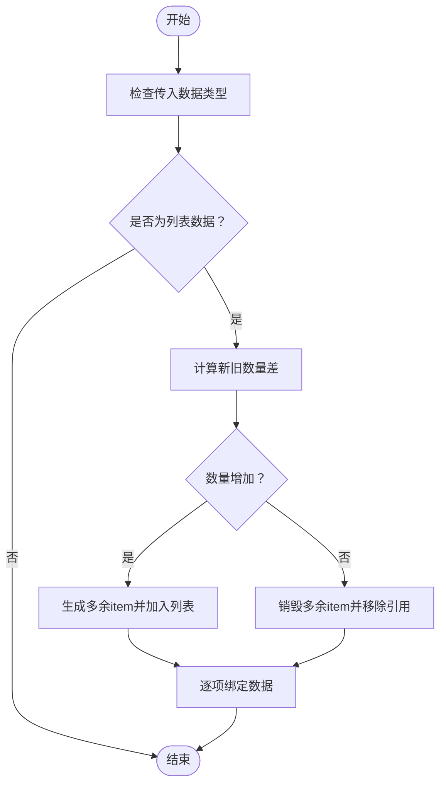
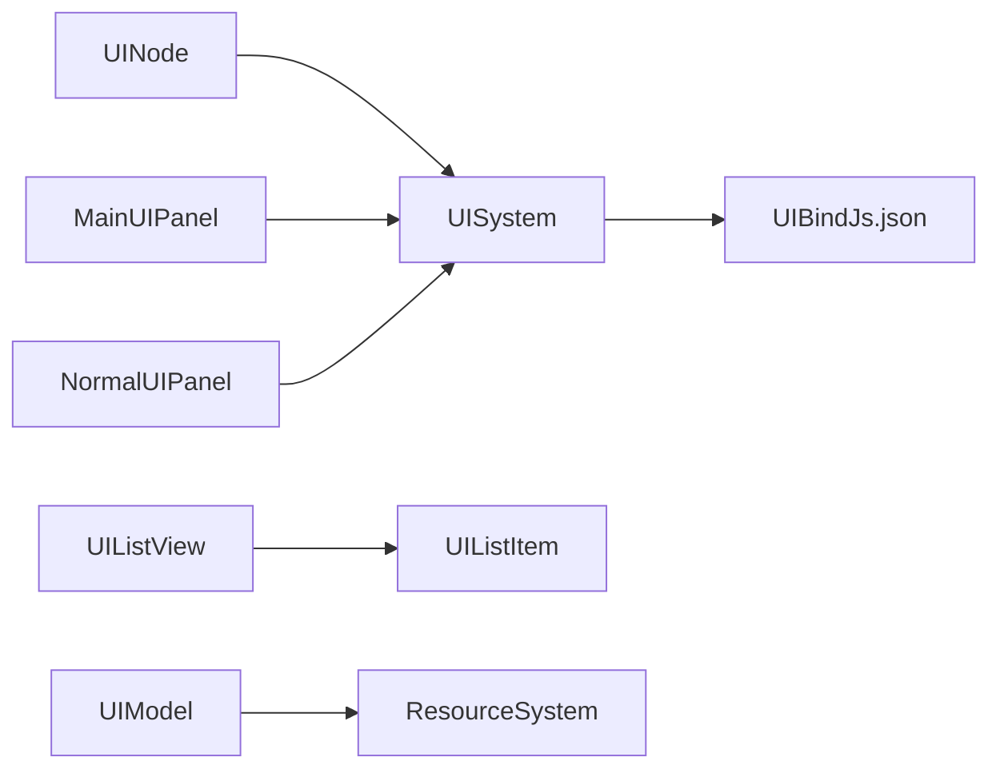

# UI系统

<cite>
**本文引用的文件**
- [UINode.cs](file://Assets/Scripts/UI/UINode.cs)
- [UIPanel.cs](file://Assets/Scripts/UI/UIPanel.cs)
- [NormalUIPanel.cs](file://Assets/Scripts/UI/NormalUIPanel.cs)
- [MainUIPanel.cs](file://Assets/Scripts/UI/MainUI/MainUIPanel.cs)
- [UIModel.cs](file://Assets/Scripts/UI/UIModel.cs)
- [UIListItem.cs](file://Assets/Scripts/UI/UIListItem.cs)
- [UIListView.cs](file://Assets/Scripts/UI/UIListView.cs)
- [UISystem.cs](file://Assets/Scripts/Systems/Implement/UISystem/UISystem.cs)
- [UIBindJs.json](file://Assets/Scripts/Modules/UI/UIBindJs.json)
</cite>

## 目录
1. [简介](#简介)
2. [项目结构](#项目结构)
3. [核心组件](#核心组件)
4. [架构总览](#架构总览)
5. [详细组件分析](#详细组件分析)
6. [依赖关系分析](#依赖关系分析)
7. [性能考虑](#性能考虑)
8. [故障排查指南](#故障排查指南)
9. [结论](#结论)
10. [附录](#附录)

## 简介
本文件面向ProjectR项目的UI系统，系统性阐述其分层架构、节点管理、面板生命周期与事件处理机制，并给出数据驱动的UI更新、状态管理、创建/显示/隐藏流程示例、性能优化建议、扩展指南以及调试与常见问题解决方案。UI系统采用“节点树+分层画布+资源绑定”的设计，通过统一的系统进行实例化、显示、隐藏与销毁，支持主界面、游戏内界面与弹窗等多层级UI。

## 项目结构
UI相关代码主要分布在以下位置：
- 节点与列表：Assets/Scripts/UI/UINode.cs、UIPanel.cs、NormalUIPanel.cs、UIListItem.cs、UIListView.cs
- 主界面：Assets/Scripts/UI/MainUI/MainUIPanel.cs
- UI模型加载：Assets/Scripts/UI/UIModel.cs
- UI系统：Assets/Scripts/Systems/Implement/UISystem/UISystem.cs
- UI资源绑定：Assets/Scripts/Modules/UI/UIBindJs.json

图表来源
- [UINode.cs:1-107](file://Assets/Scripts/UI/UINode.cs#L1-L107)
- [UIPanel.cs:1-9](file://Assets/Scripts/UI/UIPanel.cs#L1-L9)
- [NormalUIPanel.cs:1-34](file://Assets/Scripts/UI/NormalUIPanel.cs#L1-L34)
- [MainUIPanel.cs:1-39](file://Assets/Scripts/UI/MainUI/MainUIPanel.cs#L1-L39)
- [UIListItem.cs:1-50](file://Assets/Scripts/UI/UIListItem.cs#L1-L50)
- [UIListView.cs:1-101](file://Assets/Scripts/UI/UIListView.cs#L1-L101)
- [UIModel.cs:1-63](file://Assets/Scripts/UI/UIModel.cs#L1-L63)
- [UISystem.cs:1-279](file://Assets/Scripts/Systems/Implement/UISystem/UISystem.cs#L1-L279)
- [UIBindJs.json](file://Assets/Scripts/Modules/UI/UIBindJs.json)

章节来源
- [UINode.cs:1-107](file://Assets/Scripts/UI/UINode.cs#L1-L107)
- [UIPanel.cs:1-9](file://Assets/Scripts/UI/UIPanel.cs#L1-L9)
- [NormalUIPanel.cs:1-34](file://Assets/Scripts/UI/NormalUIPanel.cs#L1-L34)
- [MainUIPanel.cs:1-39](file://Assets/Scripts/UI/MainUI/MainUIPanel.cs#L1-L39)
- [UIListItem.cs:1-50](file://Assets/Scripts/UI/UIListItem.cs#L1-L50)
- [UIListView.cs:1-101](file://Assets/Scripts/UI/UIListView.cs#L1-L101)
- [UIModel.cs:1-63](file://Assets/Scripts/UI/UIModel.cs#L1-L63)
- [UISystem.cs:1-279](file://Assets/Scripts/Systems/Implement/UISystem/UISystem.cs#L1-L279)
- [UIBindJs.json](file://Assets/Scripts/Modules/UI/UIBindJs.json)

## 核心组件
- UINode：所有UI节点的基类，负责生命周期回调（初始化、启动、打开、关闭、销毁）、父子关系、数据传递与关闭请求转发至UISystem。
- UIPanel：UINode的特化类型，作为面板基类使用。
- NormalUIPanel：普通面板示例，演示按钮事件与OnData数据接收。
- MainUIPanel：主界面面板，演示按钮事件、打开其他面板及UIModel加载回调。
- UIListItem/UIListView：列表项与列表容器，支持动态生成、复用与数据绑定。
- UIModel：异步加载UI模型并设置层级、位置、缩放与旋转。
- UISystem：UI系统核心，负责画布与事件系统初始化、分层根节点、相机配置、面板加载/显示/隐藏/销毁、数据分发与资源绑定解析。
- UIBindJs.json：UI资源绑定配置，将UI名称映射到预制路径。

章节来源
- [UINode.cs:1-107](file://Assets/Scripts/UI/UINode.cs#L1-L107)
- [UIPanel.cs:1-9](file://Assets/Scripts/UI/UIPanel.cs#L1-L9)
- [NormalUIPanel.cs:1-34](file://Assets/Scripts/UI/NormalUIPanel.cs#L1-L34)
- [MainUIPanel.cs:1-39](file://Assets/Scripts/UI/MainUI/MainUIPanel.cs#L1-L39)
- [UIListItem.cs:1-50](file://Assets/Scripts/UI/UIListItem.cs#L1-L50)
- [UIListView.cs:1-101](file://Assets/Scripts/UI/UIListView.cs#L1-L101)
- [UIModel.cs:1-63](file://Assets/Scripts/UI/UIModel.cs#L1-L63)
- [UISystem.cs:1-279](file://Assets/Scripts/Systems/Implement/UISystem/UISystem.cs#L1-L279)
- [UIBindJs.json](file://Assets/Scripts/Modules/UI/UIBindJs.json)

## 架构总览
UI系统采用分层画布与节点树相结合的架构：
- 分层画布：Main（全屏界面）、Game（游戏中界面）、Top（弹窗）、MessageTop（最顶级）四层，通过深度值区分前后关系。
- 节点树：每个UINode拥有唯一实例ID与可选父节点，支持父子数据传递。
- 统一系统：UISystem集中管理节点注册、显示/隐藏、销毁、数据分发与资源加载。
- 数据驱动：通过SetData按名称向目标面板推送数据，触发OnData回调。
- 资源绑定：UIBindJs.json提供UI名称到预制路径的映射，由UISystem在初始化时加载。

图表来源
- [UINode.cs:1-107](file://Assets/Scripts/UI/UINode.cs#L1-L107)
- [UIPanel.cs:1-9](file://Assets/Scripts/UI/UIPanel.cs#L1-L9)
- [NormalUIPanel.cs:1-34](file://Assets/Scripts/UI/NormalUIPanel.cs#L1-L34)
- [MainUIPanel.cs:1-39](file://Assets/Scripts/UI/MainUI/MainUIPanel.cs#L1-L39)
- [UIListItem.cs:1-50](file://Assets/Scripts/UI/UIListItem.cs#L1-L50)
- [UIListView.cs:1-101](file://Assets/Scripts/UI/UIListView.cs#L1-L101)
- [UIModel.cs:1-63](file://Assets/Scripts/UI/UIModel.cs#L1-L63)
- [UISystem.cs:1-279](file://Assets/Scripts/Systems/Implement/UISystem/UISystem.cs#L1-L279)

## 详细组件分析

### UINode与面板生命周期
- 生命周期回调：OnInit（初始化实例ID）、OnStart（默认重置局部坐标）、OnOpen/OnClose/OnDestory（空实现，子类可覆盖）。
- 关闭流程：Close(isRelease)将请求转发给UISystem，释放模式下会销毁节点与GameObject；否则仅隐藏。
- 数据传递：OnData支持接收任意对象，可进行类型判断与处理；可通过UISystem.SetData按名称推送数据。

图表来源
- [UINode.cs:40-55](file://Assets/Scripts/UI/UINode.cs#L40-L55)
- [UISystem.cs:145-160](file://Assets/Scripts/Systems/Implement/UISystem/UISystem.cs#L145-L160)

章节来源
- [UINode.cs:1-107](file://Assets/Scripts/UI/UINode.cs#L1-L107)
- [UISystem.cs:145-160](file://Assets/Scripts/Systems/Implement/UISystem/UISystem.cs#L145-L160)

### UISystem：分层管理与资源加载
- 初始化：创建Canvas、EventSystem、UICamera；生成四层根节点；加载UI资源绑定；测试入口打开主面板。
- 打开面板：根据UI名称查找绑定路径，若未实例化则异步加载预制并实例化，随后加入对应层级并显示；若已存在则直接显示。
- 显示逻辑：隐藏同层其他节点，激活当前节点，触发OnOpen；如传入数据则通过SetData分发。
- 关闭逻辑：根据是否释放执行隐藏或销毁。
- 数据分发：SetData按名称定位节点，设置data并调用OnData。

图表来源
- [UISystem.cs:161-246](file://Assets/Scripts/Systems/Implement/UISystem/UISystem.cs#L161-L246)

章节来源
- [UISystem.cs:1-279](file://Assets/Scripts/Systems/Implement/UISystem/UISystem.cs#L1-L279)
- [UIBindJs.json](file://Assets/Scripts/Modules/UI/UIBindJs.json)

### UI资源绑定与数据驱动更新
- 资源绑定：UIBindJs.json中以字典形式存储UI名称到预制路径的映射，UISystem初始化时读取该字典。
- 数据驱动：SetData通过面板名称定位节点，设置data并调用OnData，实现数据驱动的UI更新。

章节来源
- [UISystem.cs:266-277](file://Assets/Scripts/Systems/Implement/UISystem/UISystem.cs#L266-L277)
- [UIBindJs.json](file://Assets/Scripts/Modules/UI/UIBindJs.json)

### 列表组件：UIListView与UIListItem
- UIListView：持有itemPrefab与Content容器，根据数据列表动态增删改UIListItem，支持按索引设置数据。
- UIListItem：持有InstanceID与UIListItemData，提供OnStart与OnData接口，用于绑定与初始化。

图表来源
- [UIListView.cs:18-63](file://Assets/Scripts/UI/UIListView.cs#L18-L63)

章节来源
- [UIListView.cs:1-101](file://Assets/Scripts/UI/UIListView.cs#L1-L101)
- [UIListItem.cs:1-50](file://Assets/Scripts/UI/UIListItem.cs#L1-L50)

### UI模型加载器：UIModel
- 异步加载：通过ResourceSystem异步加载指定名称的预制，完成后实例化并设置层级、位置、缩放与旋转。
- 回调通知：加载完成后触发onLoadDone回调，便于上层进行后续操作。

章节来源
- [UIModel.cs:1-63](file://Assets/Scripts/UI/UIModel.cs#L1-L63)

### 示例：主界面与普通面板
- MainUIPanel：绑定开始、选项、退出按钮，点击后打开其他面板或打印消息；订阅UIModel加载完成回调。
- NormalUIPanel：绑定关闭按钮，点击后调用Close(true)释放面板；OnData接收字符串与UINodeData并打印。

章节来源
- [MainUIPanel.cs:1-39](file://Assets/Scripts/UI/MainUI/MainUIPanel.cs#L1-L39)
- [NormalUIPanel.cs:1-34](file://Assets/Scripts/UI/NormalUIPanel.cs#L1-L34)

## 依赖关系分析
- UINode依赖UISystem进行关闭操作。
- UISystem依赖UIBindJs.json提供的资源绑定字典。
- MainUIPanel与NormalUIPanel均依赖UISystem进行面板打开与数据分发。
- UIModel依赖ResourceSystem进行异步加载。
- UIListView依赖UIListItem进行数据绑定与显示。

图表来源
- [UINode.cs:52-55](file://Assets/Scripts/UI/UINode.cs#L52-L55)
- [UISystem.cs:1-279](file://Assets/Scripts/Systems/Implement/UISystem/UISystem.cs#L1-L279)
- [MainUIPanel.cs:1-39](file://Assets/Scripts/UI/MainUI/MainUIPanel.cs#L1-L39)
- [NormalUIPanel.cs:1-34](file://Assets/Scripts/UI/NormalUIPanel.cs#L1-L34)
- [UIListView.cs:1-101](file://Assets/Scripts/UI/UIListView.cs#L1-L101)
- [UIListItem.cs:1-50](file://Assets/Scripts/UI/UIListItem.cs#L1-L50)
- [UIModel.cs:1-63](file://Assets/Scripts/UI/UIModel.cs#L1-L63)
- [UIBindJs.json](file://Assets/Scripts/Modules/UI/UIBindJs.json)

## 性能考虑
- 对象池与复用：UIListView已具备动态增删item的能力，建议结合对象池进一步减少频繁Instantiate/Destory带来的GC压力。
- 批量渲染：将同一层的UI尽量合并到同一个Canvas下，减少DrawCall；避免每帧大量UI元素的布局重算。
- 内存管理：关闭面板时优先使用隐藏模式（isRelease=false），保留实例以便复用；仅在不再需要时才释放。
- 异步加载：UIModel与UISystem的资源加载均为协程异步，避免阻塞主线程；建议在场景切换或进入战斗前预热关键UI资源。
- 事件系统：确保EventSystem常驻，避免重复创建导致的性能损耗。

## 故障排查指南
- 打开面板失败：确认UI名称已在UIBindJs.json中正确绑定；检查资源路径是否存在；查看日志中关于资源加载失败的错误信息。
- 面板不显示：检查目标层级的根节点是否创建；确认ShowNormal流程是否被调用；核对同层节点的隐藏逻辑。
- 数据未更新：确认SetData的接收面板名称是否正确；检查OnData的类型判断与赋值逻辑。
- 关闭异常：区分isRelease参数，释放模式会销毁GameObject；隐藏模式仅禁用，适合复用。
- UI模型加载失败：检查UIModel的prefabName与ResourceSystem的加载路径；确认加载完成后回调是否触发。

章节来源
- [UISystem.cs:183-204](file://Assets/Scripts/Systems/Implement/UISystem/UISystem.cs#L183-L204)
- [UIModel.cs:24-59](file://Assets/Scripts/UI/UIModel.cs#L24-L59)
- [NormalUIPanel.cs:12-12](file://Assets/Scripts/UI/NormalUIPanel.cs#L12-L12)

## 结论
ProjectR的UI系统通过UINode抽象出统一的节点模型，结合UISystem的分层画布与资源绑定，实现了清晰的生命周期管理与数据驱动更新。列表组件与模型加载器提供了良好的扩展基础。建议在实际工程中配合对象池、批量渲染与预加载策略，持续优化UI性能与体验。

## 附录

### UI面板创建、显示、隐藏流程示例
- 创建与显示
  - 在UIBindJs.json中为面板命名并绑定预制路径。
  - 调用OpenPanel(name, data)打开面板；如未实例化则异步加载并实例化，随后加入对应层级并显示。
- 隐藏与释放
  - 面板内部调用Close(false)隐藏；调用Close(true)释放并销毁。
- 数据更新
  - 使用SetData(recive, data)向目标面板推送数据，触发OnData回调。

章节来源
- [UISystem.cs:161-246](file://Assets/Scripts/Systems/Implement/UISystem/UISystem.cs#L161-L246)
- [UINode.cs:52-55](file://Assets/Scripts/UI/UINode.cs#L52-L55)

### 扩展指南：自定义UI面板与交互
- 新建面板
  - 继承UINode或UIPanel，实现OnStart/OnOpen/OnData等生命周期方法。
  - 在UIBindJs.json中新增UI名称与预制路径的映射。
- 添加交互
  - 在OnStart中注册Button等UI事件，调用UISystem.OpenPanel打开其他面板或调用Close进行自身关闭。
- 列表扩展
  - 基于UIListView与UIListItem实现复杂列表，注意数据变更时的增删与绑定。

章节来源
- [MainUIPanel.cs:1-39](file://Assets/Scripts/UI/MainUI/MainUIPanel.cs#L1-L39)
- [NormalUIPanel.cs:1-34](file://Assets/Scripts/UI/NormalUIPanel.cs#L1-L34)
- [UIListView.cs:1-101](file://Assets/Scripts/UI/UIListView.cs#L1-L101)
- [UIListItem.cs:1-50](file://Assets/Scripts/UI/UIListItem.cs#L1-L50)
- [UIBindJs.json](file://Assets/Scripts/Modules/UI/UIBindJs.json)