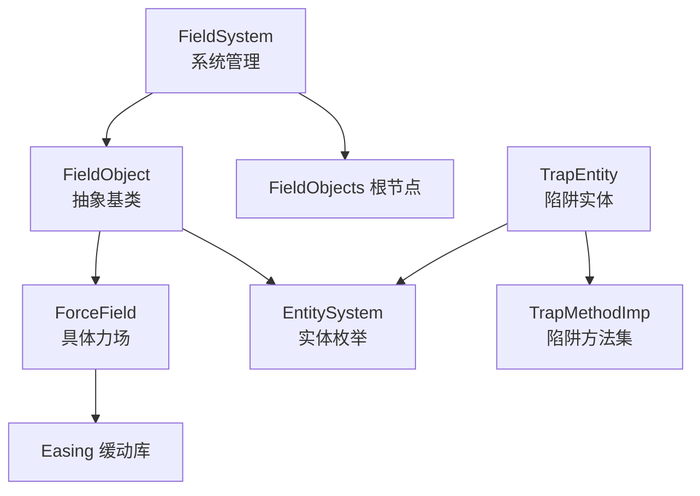
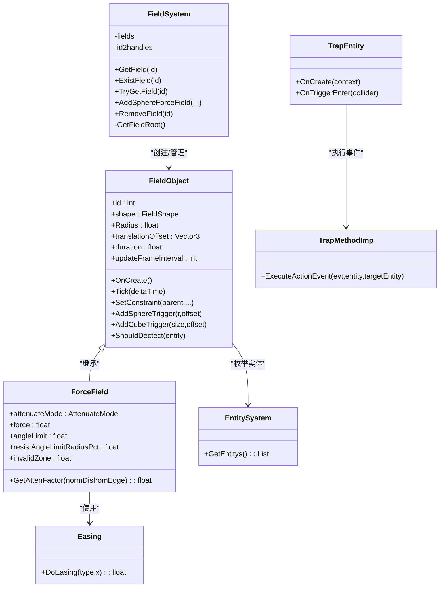
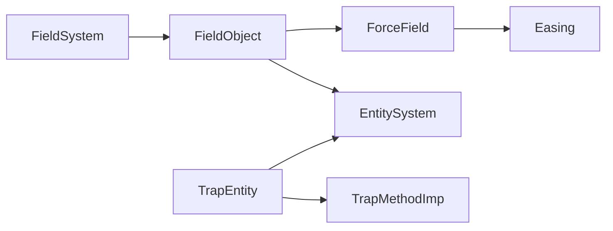

# 力场系统

<cite>
**本文引用的文件**
- [FieldSystem.cs](file://Assets/Scripts/Systems/Implement/ForceFieldSystem/FieldSystem.cs)
- [FieldSystem.Force.cs](file://Assets/Scripts/Systems/Implement/ForceFieldSystem/FieldSystem.Force.cs)
- [FieldObject.cs](file://Assets/Scripts/Systems/Implement/ForceFieldSystem/FieldObject.cs)
- [ForceField.cs](file://Assets/Scripts/Systems/Implement/ForceFieldSystem/FieldObjects/ForceField.cs)
- [Easing.cs](file://Assets/Scripts/Core/NumericalControl/Easing.cs)
- [EntitySystem.cs](file://Assets/Scripts/Systems/Implement/EntitySystem/EntitySystem.cs)
- [EntitySystem.Logic.cs](file://Assets/Scripts/Systems/Implement/EntitySystem/EntitySystem.Logic.cs)
- [TrapEntity.cs](file://Assets/Scripts/Modules/Traps/TrapEntity.cs)
- [TrapMethodImp.cs](file://Assets/Scripts/Modules/Traps/TrapMethodImp.cs)
- [TrapConfig_RollingStone.asset](file://Assets/Dev/Assets_/TrapConfig_RollingStone.asset)
- [TrapConfig_SpeedUp.asset](file://Assets/Dev/Assets_/TrapConfig_SpeedUp.asset)
</cite>

## 目录
1. [引言](#引言)
2. [项目结构](#项目结构)
3. [核心组件](#核心组件)
4. [架构总览](#架构总览)
5. [详细组件分析](#详细组件分析)
6. [依赖关系分析](#依赖关系分析)
7. [性能考量](#性能考量)
8. [故障排查指南](#故障排查指南)
9. [结论](#结论)
10. [附录](#附录)

## 引言
本文件面向ProjectR项目的“力场系统”，系统性阐述其架构设计、实现原理与使用方法，重点覆盖以下方面：
- 力场区域管理：创建、生命周期、父子约束、碰撞检测接口
- 力场效果计算：衰减模式、角度限制、无效区、施力接口
- 碰撞检测机制：基于Unity触发器的实体检测与状态维护
- 不同类型力场：死亡区域、重力场、推拉力场等的物理模拟与效果实现
- 与物理系统的集成：与Entity/Phys系统、陷阱系统的联动
- 力场触发器工作原理：通过配置驱动的事件执行
- 创建流程、参数配置与效果测试：从创建到可视化的完整流程
- 性能优化策略：区域检测优化与物理计算简化
- 扩展开发指南：新增力场类型与自定义行为
- 调试工具与可视化验证：编辑器调试与可视化辅助

## 项目结构
力场系统位于“Systems/Implement/ForceFieldSystem”目录下，采用“系统+对象”的分层组织：
- 系统层：FieldSystem负责全局管理、生命周期与根节点挂载
- 对象层：FieldObject抽象基类提供区域、碰撞、约束等通用能力；ForceField继承实现具体力场逻辑
- 配置与联动：EntitySystem提供实体枚举；Easing提供曲线/缓动支持；Traps模块提供事件与触发器联动

图示来源
- [FieldSystem.cs:1-95](file://Assets/Scripts/Systems/Implement/ForceFieldSystem/FieldSystem.cs#L1-L95)
- [FieldObject.cs:1-308](file://Assets/Scripts/Systems/Implement/ForceFieldSystem/FieldObject.cs#L1-L308)
- [ForceField.cs:1-161](file://Assets/Scripts/Systems/Implement/ForceFieldSystem/FieldObjects/ForceField.cs#L1-L161)
- [Easing.cs:119-318](file://Assets/Scripts/Core/NumericalControl/Easing.cs#L119-L318)
- [EntitySystem.cs:1-41](file://Assets/Scripts/Systems/Implement/EntitySystem/EntitySystem.cs#L1-L41)
- [TrapEntity.cs:1-41](file://Assets/Scripts/Modules/Traps/TrapEntity.cs#L1-L41)
- [TrapMethodImp.cs:1-148](file://Assets/Scripts/Modules/Traps/TrapMethodImp.cs#L1-L148)

章节来源
- [FieldSystem.cs:1-95](file://Assets/Scripts/Systems/Implement/ForceFieldSystem/FieldSystem.cs#L1-L95)
- [FieldObject.cs:1-308](file://Assets/Scripts/Systems/Implement/ForceFieldSystem/FieldObject.cs#L1-L308)
- [ForceField.cs:1-161](file://Assets/Scripts/Systems/Implement/ForceFieldSystem/FieldObjects/ForceField.cs#L1-L161)
- [EntitySystem.cs:1-41](file://Assets/Scripts/Systems/Implement/EntitySystem/EntitySystem.cs#L1-L41)
- [EntitySystem.Logic.cs:1-44](file://Assets/Scripts/Systems/Implement/EntitySystem/EntitySystem.Logic.cs#L1-L44)
- [Easing.cs:119-318](file://Assets/Scripts/Core/NumericalControl/Easing.cs#L119-L318)
- [TrapEntity.cs:1-41](file://Assets/Scripts/Modules/Traps/TrapEntity.cs#L1-L41)
- [TrapMethodImp.cs:1-148](file://Assets/Scripts/Modules/Traps/TrapMethodImp.cs#L1-L148)

## 核心组件
- FieldSystem：单例系统，负责力场对象的创建、注册、销毁与根节点管理；当前Tick为空实现，预留后续按帧更新
- FieldObject：抽象基类，提供区域形状、半径、持续时间、更新频率、父约束、碰撞检测集合、触发器构建等通用能力
- ForceField：具体力场实现，支持多种衰减模式（常量、曲线、多类缓动）、角度限制、无效区、施力接口
- Easing：提供丰富的缓动函数，用于力场强度随距离/时间的平滑变化
- EntitySystem：提供实体枚举接口，供力场检测范围内实体使用
- TrapEntity/TrapMethodImp：陷阱实体与方法集，展示与力场系统可协同的事件执行路径

章节来源
- [FieldSystem.cs:1-95](file://Assets/Scripts/Systems/Implement/ForceFieldSystem/FieldSystem.cs#L1-L95)
- [FieldObject.cs:1-308](file://Assets/Scripts/Systems/Implement/ForceFieldSystem/FieldObject.cs#L1-L308)
- [ForceField.cs:1-161](file://Assets/Scripts/Systems/Implement/ForceFieldSystem/FieldObjects/ForceField.cs#L1-L161)
- [Easing.cs:119-318](file://Assets/Scripts/Core/NumericalControl/Easing.cs#L119-L318)
- [EntitySystem.cs:1-41](file://Assets/Scripts/Systems/Implement/EntitySystem/EntitySystem.cs#L1-L41)
- [EntitySystem.Logic.cs:1-44](file://Assets/Scripts/Systems/Implement/EntitySystem/EntitySystem.Logic.cs#L1-L44)
- [TrapEntity.cs:1-41](file://Assets/Scripts/Modules/Traps/TrapEntity.cs#L1-L41)
- [TrapMethodImp.cs:1-148](file://Assets/Scripts/Modules/Traps/TrapMethodImp.cs#L1-L148)

## 架构总览
力场系统采用“系统-对象-配置-事件”的分层架构：
- 系统层：FieldSystem集中管理所有力场对象，统一生命周期与根节点
- 对象层：FieldObject提供通用区域与碰撞能力；ForceField聚焦力场效果计算
- 配置层：通过配置资产与方法类定义事件与行为（如陷阱）
- 事件层：实体进入/离开触发器后，由配置驱动执行相应动作（如施加力、状态改变）

图示来源
- [FieldSystem.cs:1-95](file://Assets/Scripts/Systems/Implement/ForceFieldSystem/FieldSystem.cs#L1-L95)
- [FieldObject.cs:1-308](file://Assets/Scripts/Systems/Implement/ForceFieldSystem/FieldObject.cs#L1-L308)
- [ForceField.cs:1-161](file://Assets/Scripts/Systems/Implement/ForceFieldSystem/FieldObjects/ForceField.cs#L1-L161)
- [Easing.cs:119-318](file://Assets/Scripts/Core/NumericalControl/Easing.cs#L119-L318)
- [EntitySystem.cs:1-41](file://Assets/Scripts/Systems/Implement/EntitySystem/EntitySystem.cs#L1-L41)
- [TrapEntity.cs:1-41](file://Assets/Scripts/Modules/Traps/TrapEntity.cs#L1-L41)
- [TrapMethodImp.cs:1-148](file://Assets/Scripts/Modules/Traps/TrapMethodImp.cs#L1-L148)

## 详细组件分析

### FieldSystem：系统管理与生命周期
- 负责创建/注册/销毁力场对象，并将对象挂载到系统根节点下，便于场景管理
- 提供按ID查询、存在性检查与移除接口
- 当前Tick为空实现，预留后续按帧更新逻辑

章节来源
- [FieldSystem.cs:1-95](file://Assets/Scripts/Systems/Implement/ForceFieldSystem/FieldSystem.cs#L1-L95)

### FieldObject：区域与碰撞基础
- 区域与参数：支持球形区域，提供半径、中心偏移、持续时间、更新频率等
- 碰撞检测：维护“忽略实体”和“已检测实体”集合，提供ShouldDectect判定
- 触发器：动态添加球形/矩形触发器，支持isTrigger与半径同步
- 约束：提供ParentConstraint设置，使力场跟随父对象移动/旋转
- 生命周期：IsActive根据持续时间判断是否仍有效

章节来源
- [FieldObject.cs:1-308](file://Assets/Scripts/Systems/Implement/ForceFieldSystem/FieldObject.cs#L1-L308)

### ForceField：力场效果计算
- 衰减模式：支持常量、曲线与多种缓动（线性、正弦、指数、圆周、弹性、回弹、弹跳、闪烁等）
- 角度限制：限定在扇形范围内的作用方向，提供“无视角度限制的半径比例”
- 无效区：靠近中心的无效半径，避免过强或异常力
- 施力接口：定义ForceAppliable接口，供外部施加力
- 编辑器调试：提供Editor_OnDebug与Tick占位，便于可视化与调试

章节来源
- [ForceField.cs:1-161](file://Assets/Scripts/Systems/Implement/ForceFieldSystem/FieldObjects/ForceField.cs#L1-L161)
- [Easing.cs:119-318](file://Assets/Scripts/Core/NumericalControl/Easing.cs#L119-L318)

### 与物理系统的集成
- 实体枚举：FieldObject.CheckIncludedEntity注释中提到遍历EntitySystem实体进行范围检测
- 陷阱联动：TrapEntity通过onTriggerEnter回调，调用配置资产的事件，实现触发器驱动的行为（如施加力、状态改变）

章节来源
- [FieldObject.cs:100-116](file://Assets/Scripts/Systems/Implement/ForceFieldSystem/FieldObject.cs#L100-L116)
- [EntitySystem.cs:1-41](file://Assets/Scripts/Systems/Implement/EntitySystem/EntitySystem.cs#L1-L41)
- [TrapEntity.cs:1-41](file://Assets/Scripts/Modules/Traps/TrapEntity.cs#L1-L41)

### 力场触发器工作原理
- 触发器：通过AddSphereTrigger/AddCubeTrigger创建isTrigger触发器
- 事件：当实体进入触发器时，由配置驱动执行相应动作（如施加力、加速、眩晕等）
- 示例：RollingStone与SpeedUp配置资产展示了事件绑定与参数化行为

章节来源
- [FieldObject.cs:251-268](file://Assets/Scripts/Systems/Implement/ForceFieldSystem/FieldObject.cs#L251-L268)
- [TrapEntity.cs:26-31](file://Assets/Scripts/Modules/Traps/TrapEntity.cs#L26-L31)
- [TrapConfig_RollingStone.asset:1-31](file://Assets/Dev/Assets_/TrapConfig_RollingStone.asset#L1-L31)
- [TrapConfig_SpeedUp.asset:1-31](file://Assets/Dev/Assets_/TrapConfig_SpeedUp.asset#L1-L31)

### 不同类型力场的实现方式
- 死亡区域：可通过无效区与持续时间实现；结合状态机可实现“死亡”效果
- 重力场：通过衰减模式与施力接口实现向心/离心力；可配合角度限制实现单向吸引
- 推拉力场：通过方向与力大小控制；结合缓动实现渐进式施加

章节来源
- [ForceField.cs:54-93](file://Assets/Scripts/Systems/Implement/ForceFieldSystem/FieldObjects/ForceField.cs#L54-L93)
- [ForceField.cs:100-129](file://Assets/Scripts/Systems/Implement/ForceFieldSystem/FieldObjects/ForceField.cs#L100-L129)

### 力场区域创建、参数配置与效果测试流程
- 创建：通过FieldSystem.AddSphereForceField创建球形力场，设置衰减模式、半径、偏移、持续时间
- 参数配置：在ForceField上调整force、angleLimit、resistAngleLimitRadiusPct、invalidZone等
- 效果测试：在编辑器中运行，观察可视化调试输出；通过陷阱触发器验证交互效果

章节来源
- [FieldSystem.Force.cs:23-61](file://Assets/Scripts/Systems/Implement/ForceFieldSystem/FieldSystem.Force.cs#L23-L61)
- [ForceField.cs:54-93](file://Assets/Scripts/Systems/Implement/ForceFieldSystem/FieldObjects/ForceField.cs#L54-L93)
- [FieldObject.cs:295-301](file://Assets/Scripts/Systems/Implement/ForceFieldSystem/FieldObject.cs#L295-L301)

## 依赖关系分析
- FieldSystem依赖FieldObject/ForceField进行对象管理
- FieldObject依赖EntitySystem进行实体枚举（注释中体现）
- ForceField依赖Easing进行衰减计算
- TrapEntity与TrapMethodImp通过配置资产驱动事件执行

图示来源
- [FieldSystem.cs:1-95](file://Assets/Scripts/Systems/Implement/ForceFieldSystem/FieldSystem.cs#L1-L95)
- [FieldObject.cs:1-308](file://Assets/Scripts/Systems/Implement/ForceFieldSystem/FieldObject.cs#L1-L308)
- [ForceField.cs:1-161](file://Assets/Scripts/Systems/Implement/ForceFieldSystem/FieldObjects/ForceField.cs#L1-L161)
- [Easing.cs:119-318](file://Assets/Scripts/Core/NumericalControl/Easing.cs#L119-L318)
- [EntitySystem.cs:1-41](file://Assets/Scripts/Systems/Implement/EntitySystem/EntitySystem.cs#L1-L41)
- [TrapEntity.cs:1-41](file://Assets/Scripts/Modules/Traps/TrapEntity.cs#L1-L41)
- [TrapMethodImp.cs:1-148](file://Assets/Scripts/Modules/Traps/TrapMethodImp.cs#L1-L148)

## 性能考量
- 区域检测优化
  - 使用向量点积替代开方距离（sqrMagnitude）以减少开销
  - 建议引入空间分区（如四叉树/八叉树）或按场景网格划分，避免对全量实体逐帧扫描
  - 将实体检测放入Job系统（注释中已有提示），减少主线程压力
- 物理计算简化
  - 合理设置updateFrameInterval，降低更新频率
  - 对无效区与角度限制进行快速分支判断，提前返回
  - 使用缓动表预计算或缓存中间结果（如衰减值）
- 内存与对象池
  - 力场对象创建/销毁频繁时，建议引入对象池减少GC

章节来源
- [FieldObject.cs:33-37](file://Assets/Scripts/Systems/Implement/ForceFieldSystem/FieldObject.cs#L33-L37)
- [FieldObject.cs:72-84](file://Assets/Scripts/Systems/Implement/ForceFieldSystem/FieldObject.cs#L72-L84)
- [FieldObject.cs:103-116](file://Assets/Scripts/Systems/Implement/ForceFieldSystem/FieldObject.cs#L103-L116)
- [FieldSystem.Force.cs:25-26](file://Assets/Scripts/Systems/Implement/ForceFieldSystem/FieldSystem.Force.cs#L25-L26)

## 故障排查指南
- 力场不生效
  - 检查半径与中心偏移是否正确；确认触发器isTrigger已启用
  - 确认实体未被加入ignoreEntities；检查ShouldDectect判定
- 角度限制异常
  - 核对angleLimit与resistAngleLimitRadiusPct设置；确认无效区比例合理
- 衰减曲线不符合预期
  - 检查AttenuateMode与曲线参数；必要时切换为常量或缓动模式
- 事件未触发
  - 确认陷阱配置资产中的事件绑定；检查TrapEntity的onTriggerEnter回调是否正常

章节来源
- [FieldObject.cs:175-236](file://Assets/Scripts/Systems/Implement/ForceFieldSystem/FieldObject.cs#L175-L236)
- [ForceField.cs:84-93](file://Assets/Scripts/Systems/Implement/ForceFieldSystem/FieldObjects/ForceField.cs#L84-L93)
- [TrapEntity.cs:26-31](file://Assets/Scripts/Modules/Traps/TrapEntity.cs#L26-L31)

## 结论
力场系统以“系统-对象-配置-事件”为核心，具备良好的扩展性与可配置性。通过触发器与配置资产的组合，可快速实现多样化的力场效果。建议在实际项目中结合空间分区与Job系统进一步优化性能，并完善调试可视化工具以提升开发效率。

## 附录

### API与参数一览
- FieldSystem
  - AddSphereForceField(attenuateMode, radius, translationOffset, duration)
  - GetField(id)/ExistField(id)/TryGetField(id)
  - RemoveField(id)/RemoveField(FieldObject)
- FieldObject
  - OnCreate()/Tick(deltaTime)
  - AddSphereTrigger(r, offset)/AddCubeTrigger(size, offset)
  - SetConstraint(parent, posOffset, rotOffset)
  - ShouldDectect(entity)
- ForceField
  - GetAttenFactor(normDisfromEdge)
  - force/angleLimit/resistAngleLimitRadiusPct/invalidZone
- Easing
  - DoEasing(easeType, x)

章节来源
- [FieldSystem.cs:15-66](file://Assets/Scripts/Systems/Implement/ForceFieldSystem/FieldSystem.cs#L15-L66)
- [FieldSystem.Force.cs:23-61](file://Assets/Scripts/Systems/Implement/ForceFieldSystem/FieldSystem.Force.cs#L23-L61)
- [FieldObject.cs:119-173](file://Assets/Scripts/Systems/Implement/ForceFieldSystem/FieldObject.cs#L119-L173)
- [FieldObject.cs:183-236](file://Assets/Scripts/Systems/Implement/ForceFieldSystem/FieldObject.cs#L183-L236)
- [ForceField.cs:84-93](file://Assets/Scripts/Systems/Implement/ForceFieldSystem/FieldObjects/ForceField.cs#L84-L93)
- [Easing.cs:245-316](file://Assets/Scripts/Core/NumericalControl/Easing.cs#L245-L316)