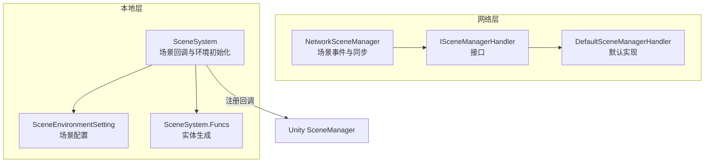
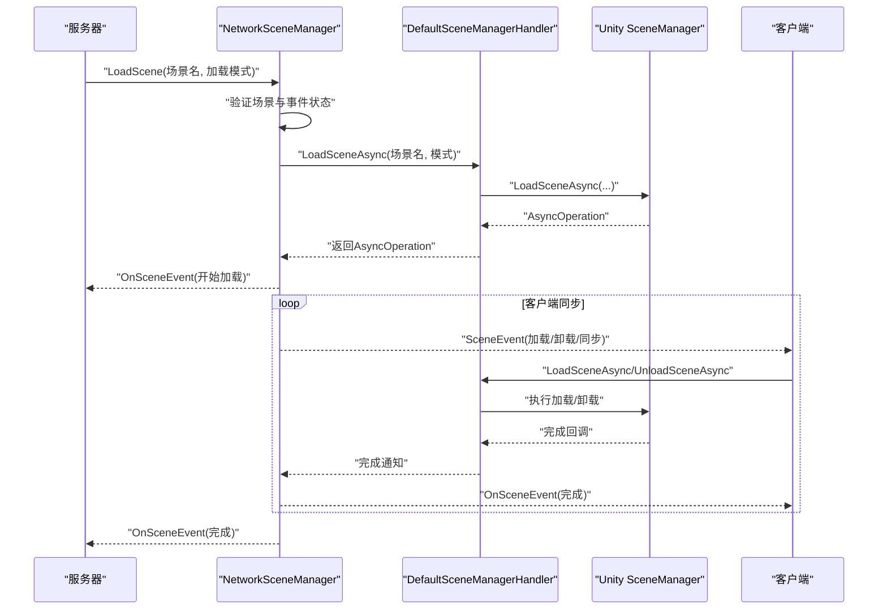
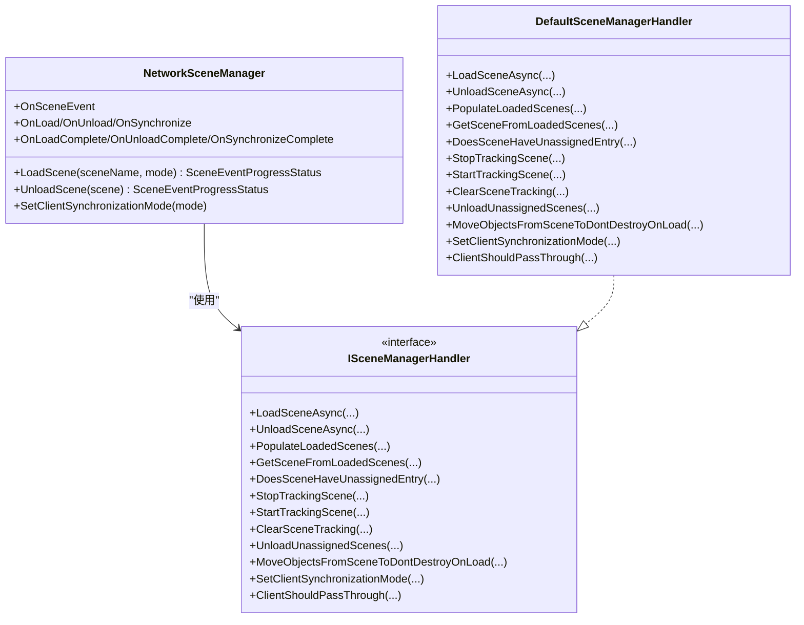
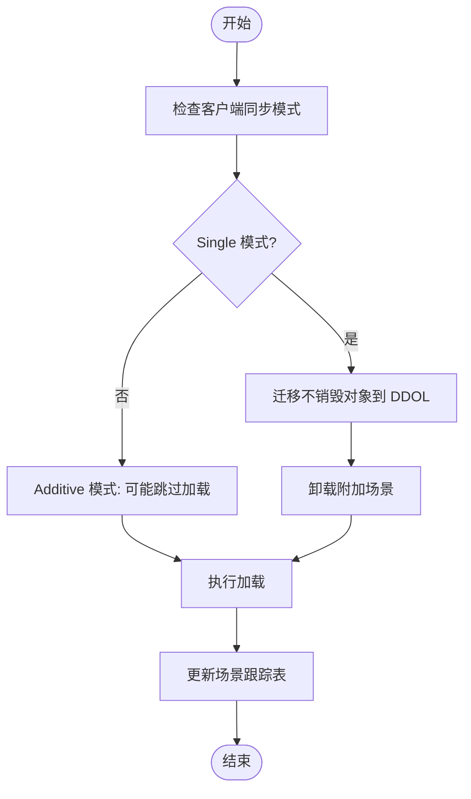
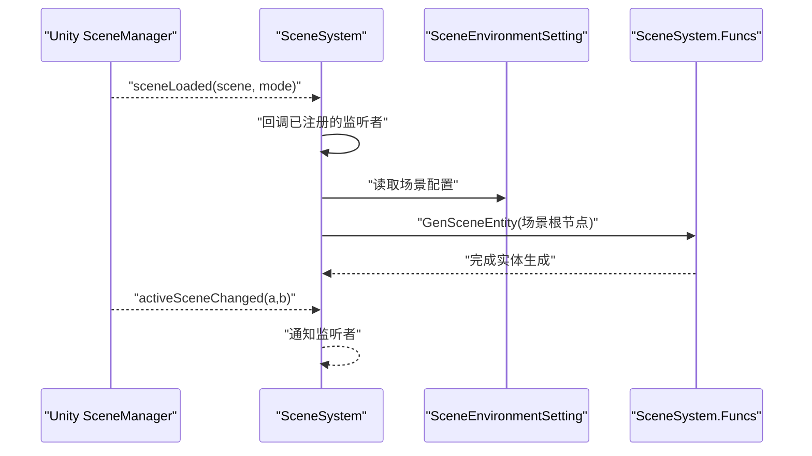

# 场景系统

<cite>
**本文引用的文件**
- [NetworkSceneManager.cs](file://LocalPackages/com.unity.netcode.gameobjects@1.14.1/Runtime/SceneManagement/NetworkSceneManager.cs)
- [ISceneManagerHandler.cs](file://LocalPackages/com.unity.netcode.gameobjects@1.14.1/Runtime/SceneManagement/ISceneManagerHandler.cs)
- [DefaultSceneManagerHandler.cs](file://LocalPackages/com.unity.netcode.gameobjects@1.14.1/Runtime/SceneManagement/DefaultSceneManagerHandler.cs)
- [SceneSystem.cs](file://Assets/Scripts/Systems/Implement/SceneSystem/SceneSystem.cs)
- [SceneSystem.Funcs.cs](file://Assets/Scripts/Systems/Implement/SceneSystem/SceneSystem.Funcs.cs)
- [SceneEnvironmentSetting.cs](file://Assets/Scripts/Systems/Implement/SceneSystem/SceneEnvironmentSetting.cs)
- [reconnecting-mid-game.md](file://LocalPackages/com.unity.netcode.gameobjects@1.14.1/Documentation~/advanced-topics/reconnecting-mid-game.md)
</cite>

## 目录
1. [简介](#简介)
2. [项目结构](#项目结构)
3. [核心组件](#核心组件)
4. [架构总览](#架构总览)
5. [详细组件分析](#详细组件分析)
6. [依赖关系分析](#依赖关系分析)
7. [性能考量](#性能考量)
8. [故障排查指南](#故障排查指南)
9. [结论](#结论)
10. [附录](#附录)

## 简介
本文件面向 ProjectR 的场景系统，系统性梳理其架构设计与实现原理，覆盖以下主题：
- 场景加载、切换与卸载机制
- 异步加载策略、场景预加载与场景缓存管理
- 与 Unity SceneManager 的集成方式与自定义场景管理器实现
- 场景切换、场景参数传递与场景状态保存的完整流程示例
- 性能优化技巧（延迟加载与内存回收）
- 扩展开发指南（新增场景类型与自定义加载器）
- 调试工具与场景加载进度监控方法

## 项目结构
ProjectR 的场景系统由两部分组成：
- 基于 Unity Netcode 的网络化场景管理：负责跨端同步、事件广播与一致性保障
- 基于 Unity SceneManager 的本地场景系统：负责场景进入时的环境初始化与实体生成



图示来源
- [NetworkSceneManager.cs](file://LocalPackages/com.unity.netcode.gameobjects@1.14.1/Runtime/SceneManagement/NetworkSceneManager.cs)
- [ISceneManagerHandler.cs](file://LocalPackages/com.unity.netcode.gameobjects@1.14.1/Runtime/SceneManagement/ISceneManagerHandler.cs)
- [DefaultSceneManagerHandler.cs](file://LocalPackages/com.unity.netcode.gameobjects@1.14.1/Runtime/SceneManagement/DefaultSceneManagerHandler.cs)
- [SceneSystem.cs](file://Assets/Scripts/Systems/Implement/SceneSystem/SceneSystem.cs)
- [SceneSystem.Funcs.cs](file://Assets/Scripts/Systems/Implement/SceneSystem/SceneSystem.Funcs.cs)
- [SceneEnvironmentSetting.cs](file://Assets/Scripts/Systems/Implement/SceneSystem/SceneEnvironmentSetting.cs)

章节来源
- [NetworkSceneManager.cs](file://LocalPackages/com.unity.netcode.gameobjects@1.14.1/Runtime/SceneManagement/NetworkSceneManager.cs)
- [ISceneManagerHandler.cs](file://LocalPackages/com.unity.netcode.gameobjects@1.14.1/Runtime/SceneManagement/ISceneManagerHandler.cs)
- [DefaultSceneManagerHandler.cs](file://LocalPackages/com.unity.netcode.gameobjects@1.14.1/Runtime/SceneManagement/DefaultSceneManagerHandler.cs)
- [SceneSystem.cs](file://Assets/Scripts/Systems/Implement/SceneSystem/SceneSystem.cs)
- [SceneSystem.Funcs.cs](file://Assets/Scripts/Systems/Implement/SceneSystem/SceneSystem.Funcs.cs)
- [SceneEnvironmentSetting.cs](file://Assets/Scripts/Systems/Implement/SceneSystem/SceneEnvironmentSetting.cs)

## 核心组件
- NetworkSceneManager：网络场景管理核心，封装场景加载/卸载/同步事件，提供跨端一致的场景生命周期通知
- ISceneManagerHandler/DefaultSceneManagerHandler：抽象与默认实现，桥接 Unity SceneManager 并提供场景跟踪、复用与清理能力
- SceneSystem：本地场景系统，订阅 Unity SceneManager 的回调，完成场景进入后的环境初始化与实体生成
- SceneEnvironmentSetting：场景环境配置，控制是否在进入场景时生成怪物、陷阱、物品等
- SceneSystem.Funcs：场景实体生成逻辑，按配置从场景根节点提取子树并创建对应实体

章节来源
- [NetworkSceneManager.cs](file://LocalPackages/com.unity.netcode.gameobjects@1.14.1/Runtime/SceneManagement/NetworkSceneManager.cs)
- [ISceneManagerHandler.cs](file://LocalPackages/com.unity.netcode.gameobjects@1.14.1/Runtime/SceneManagement/ISceneManagerHandler.cs)
- [DefaultSceneManagerHandler.cs](file://LocalPackages/com.unity.netcode.gameobjects@1.14.1/Runtime/SceneManagement/DefaultSceneManagerHandler.cs)
- [SceneSystem.cs](file://Assets/Scripts/Systems/Implement/SceneSystem/SceneSystem.cs)
- [SceneSystem.Funcs.cs](file://Assets/Scripts/Systems/Implement/SceneSystem/SceneSystem.Funcs.cs)
- [SceneEnvironmentSetting.cs](file://Assets/Scripts/Systems/Implement/SceneSystem/SceneEnvironmentSetting.cs)

## 架构总览
下图展示从“服务器发起场景切换”到“客户端完成同步”的端到端流程。



图示来源
- [NetworkSceneManager.cs](file://LocalPackages/com.unity.netcode.gameobjects@1.14.1/Runtime/SceneManagement/NetworkSceneManager.cs)
- [DefaultSceneManagerHandler.cs](file://LocalPackages/com.unity.netcode.gameobjects@1.14.1/Runtime/SceneManagement/DefaultSceneManagerHandler.cs)

## 详细组件分析

### 组件一：NetworkSceneManager（网络场景管理）
职责与特性
- 负责场景事件的发起、广播与完成确认，确保服务器与客户端对场景状态达成一致
- 支持单场景加载（Single）与附加场景加载（Additive），并在切换时处理对象迁移与销毁
- 提供场景事件回调（加载、卸载、同步、完成等），便于上层系统感知生命周期
- 内置场景哈希表与构建索引映射，保证场景名/路径与构建列表的一致性

关键流程
- 场景加载
  - 服务器侧校验场景有效性与事件状态，构造场景事件数据，调用处理器执行异步加载，并广播事件
  - 客户端侧接收事件后，根据加载模式决定是否迁移对象或直接加载
- 场景卸载
  - 仅支持附加场景卸载；服务器侧迁移不销毁的对象至“不销毁场景”，完成后迁移回当前活动场景
- 同步与重连
  - 支持活动场景变更同步与客户端重连时的场景同步；可配置客户端同步模式（Single/Additive）



图示来源
- [NetworkSceneManager.cs](file://LocalPackages/com.unity.netcode.gameobjects@1.14.1/Runtime/SceneManagement/NetworkSceneManager.cs)
- [ISceneManagerHandler.cs](file://LocalPackages/com.unity.netcode.gameobjects@1.14.1/Runtime/SceneManagement/ISceneManagerHandler.cs)
- [DefaultSceneManagerHandler.cs](file://LocalPackages/com.unity.netcode.gameobjects@1.14.1/Runtime/SceneManagement/DefaultSceneManagerHandler.cs)

章节来源
- [NetworkSceneManager.cs](file://LocalPackages/com.unity.netcode.gameobjects@1.14.1/Runtime/SceneManagement/NetworkSceneManager.cs)
- [ISceneManagerHandler.cs](file://LocalPackages/com.unity.netcode.gameobjects@1.14.1/Runtime/SceneManagement/ISceneManagerHandler.cs)
- [DefaultSceneManagerHandler.cs](file://LocalPackages/com.unity.netcode.gameobjects@1.14.1/Runtime/SceneManagement/DefaultSceneManagerHandler.cs)

### 组件二：DefaultSceneManagerHandler（场景处理器）
职责与特性
- 封装 Unity SceneManager 的异步加载/卸载，统一返回 AsyncOperation 以便进度追踪
- 维护“场景名称→句柄→场景实例”的映射表，支持场景复用与未分配场景清理
- 在 Additive 模式下，提供“跳过重复加载”与“卸载未分配场景”的能力
- 提供对象迁移（不销毁对象）与客户端同步模式设置



图示来源
- [DefaultSceneManagerHandler.cs](file://LocalPackages/com.unity.netcode.gameobjects@1.14.1/Runtime/SceneManagement/DefaultSceneManagerHandler.cs)

章节来源
- [DefaultSceneManagerHandler.cs](file://LocalPackages/com.unity.netcode.gameobjects@1.14.1/Runtime/SceneManagement/DefaultSceneManagerHandler.cs)

### 组件三：SceneSystem（本地场景系统）
职责与特性
- 订阅 Unity SceneManager 的场景加载/卸载/活动场景变更事件
- 提供静态注册接口，供上层模块订阅场景生命周期
- 场景进入时，解析场景根节点与环境配置，生成怪物、陷阱、物品等实体



图示来源
- [SceneSystem.cs](file://Assets/Scripts/Systems/Implement/SceneSystem/SceneSystem.cs)
- [SceneSystem.Funcs.cs](file://Assets/Scripts/Systems/Implement/SceneSystem/SceneSystem.Funcs.cs)
- [SceneEnvironmentSetting.cs](file://Assets/Scripts/Systems/Implement/SceneSystem/SceneEnvironmentSetting.cs)

章节来源
- [SceneSystem.cs](file://Assets/Scripts/Systems/Implement/SceneSystem/SceneSystem.cs)
- [SceneSystem.Funcs.cs](file://Assets/Scripts/Systems/Implement/SceneSystem/SceneSystem.Funcs.cs)
- [SceneEnvironmentSetting.cs](file://Assets/Scripts/Systems/Implement/SceneSystem/SceneEnvironmentSetting.cs)

## 依赖关系分析
- NetworkSceneManager 依赖 ISceneManagerHandler 接口以解耦 Unity SceneManager 的具体实现
- DefaultSceneManagerHandler 实现 ISceneManagerHandler，默认桥接 Unity 的异步加载/卸载
- SceneSystem 依赖 Unity SceneManager 的回调，作为本地层的场景生命周期观察者
- 两者通过事件与回调协作，形成“网络层同步 + 本地层初始化”的双层架构

```mermaid
graph LR
UnitySM["Unity SceneManager"] <- --> DSH["DefaultSceneManagerHandler"]
DSH --> NSM["NetworkSceneManager"]
UnitySM --> SS["SceneSystem"]
SS --> ENV["SceneEnvironmentSetting"]
SS --> FUNC["SceneSystem.Funcs"]
```

图示来源
- [NetworkSceneManager.cs](file://LocalPackages/com.unity.netcode.gameobjects@1.14.1/Runtime/SceneManagement/NetworkSceneManager.cs)
- [DefaultSceneManagerHandler.cs](file://LocalPackages/com.unity.netcode.gameobjects@1.14.1/Runtime/SceneManagement/DefaultSceneManagerHandler.cs)
- [SceneSystem.cs](file://Assets/Scripts/Systems/Implement/SceneSystem/SceneSystem.cs)
- [SceneSystem.Funcs.cs](file://Assets/Scripts/Systems/Implement/SceneSystem/SceneSystem.Funcs.cs)
- [SceneEnvironmentSetting.cs](file://Assets/Scripts/Systems/Implement/SceneSystem/SceneEnvironmentSetting.cs)

章节来源
- [NetworkSceneManager.cs](file://LocalPackages/com.unity.netcode.gameobjects@1.14.1/Runtime/SceneManagement/NetworkSceneManager.cs)
- [DefaultSceneManagerHandler.cs](file://LocalPackages/com.unity.netcode.gameobjects@1.14.1/Runtime/SceneManagement/DefaultSceneManagerHandler.cs)
- [SceneSystem.cs](file://Assets/Scripts/Systems/Implement/SceneSystem/SceneSystem.cs)
- [SceneSystem.Funcs.cs](file://Assets/Scripts/Systems/Implement/SceneSystem/SceneSystem.Funcs.cs)
- [SceneEnvironmentSetting.cs](file://Assets/Scripts/Systems/Implement/SceneSystem/SceneEnvironmentSetting.cs)

## 性能考量
- 异步加载与进度追踪
  - 使用 AsyncOperation 返回值进行进度上报，避免阻塞主线程
  - 在单场景加载期间，延迟创建新对象，减少不必要的对象销毁/重建
- 场景复用与缓存
  - Additive 模式下，优先复用已加载但未分配的场景实例，避免重复加载
  - 未分配场景在同步完成后自动卸载，释放内存
- 对象迁移与内存回收
  - 不随场景销毁的对象迁移至“不销毁场景”，加载完成后迁回当前场景
  - 单场景切换前清理场景内对象，降低切换开销
- 建议
  - 大型场景采用附加加载，配合预加载与复用策略
  - 使用场景哈希与构建索引，避免运行时路径解析开销

章节来源
- [NetworkSceneManager.cs](file://LocalPackages/com.unity.netcode.gameobjects@1.14.1/Runtime/SceneManagement/NetworkSceneManager.cs)
- [DefaultSceneManagerHandler.cs](file://LocalPackages/com.unity.netcode.gameobjects@1.14.1/Runtime/SceneManagement/DefaultSceneManagerHandler.cs)

## 故障排查指南
常见问题与定位要点
- 场景未在构建列表中
  - 现象：加载失败，返回无效场景名
  - 处理：将目标场景加入构建列表，并确保场景名正确
- 客户端重连导致重复场景
  - 现象：客户端重连后附加场景重复加载
  - 处理：在断开/重连时选择不同主场景或主动卸载附加场景
- 同步模式配置不当
  - 现象：Additive 模式下未正确复用场景，或切换后残留旧场景
  - 处理：根据需求设置客户端同步模式，并在必要时启用“同步后卸载未分配场景”
- 对象丢失或异常销毁
  - 现象：切换后对象消失或报错
  - 处理：确认“不随场景销毁”的对象已迁移至 DDOL，并在加载完成后迁回

章节来源
- [reconnecting-mid-game.md](file://LocalPackages/com.unity.netcode.gameobjects@1.14.1/Documentation~/advanced-topics/reconnecting-mid-game.md)
- [NetworkSceneManager.cs](file://LocalPackages/com.unity.netcode.gameobjects@1.14.1/Runtime/SceneManagement/NetworkSceneManager.cs)
- [DefaultSceneManagerHandler.cs](file://LocalPackages/com.unity.netcode.gameobjects@1.14.1/Runtime/SceneManagement/DefaultSceneManagerHandler.cs)

## 结论
ProjectR 的场景系统通过“网络层同步 + 本地层初始化”的双层架构，实现了跨端一致的场景切换与生命周期管理。NetworkSceneManager 提供了完善的事件模型与一致性保障，DefaultSceneManagerHandler 则将 Unity 的异步加载能力与场景复用、对象迁移等策略结合，显著提升了切换性能与稳定性。SceneSystem 则专注于场景进入后的环境初始化与实体生成，使业务逻辑与场景管理解耦。整体方案具备良好的扩展性与可维护性。

## 附录

### 场景切换、参数传递与状态保存流程示例
- 场景切换
  - 服务器调用 LoadScene(场景名, 加载模式)，广播场景事件
  - 客户端收到事件后执行加载，完成后发送完成确认
- 场景参数传递
  - 通过场景事件携带场景名/路径与加载模式；如需更复杂参数，可在场景加载完成后由 SceneSystem 读取 SceneEnvironmentSetting 或其他配置组件
- 状态保存
  - 对象迁移至 DDOL 以保留状态；切换完成后迁移回当前场景
  - 场景进入时按配置生成实体，避免重复生成

章节来源
- [NetworkSceneManager.cs](file://LocalPackages/com.unity.netcode.gameobjects@1.14.1/Runtime/SceneManagement/NetworkSceneManager.cs)
- [SceneSystem.cs](file://Assets/Scripts/Systems/Implement/SceneSystem/SceneSystem.cs)
- [SceneSystem.Funcs.cs](file://Assets/Scripts/Systems/Implement/SceneSystem/SceneSystem.Funcs.cs)
- [SceneEnvironmentSetting.cs](file://Assets/Scripts/Systems/Implement/SceneSystem/SceneEnvironmentSetting.cs)

### 自定义场景加载器与扩展开发指南
- 自定义 ISceneManagerHandler
  - 通过实现 ISceneManagerHandler 接口，替换默认的加载/卸载行为与场景跟踪策略
  - 适用于需要接入 Addressable/AssetBundle 或自定义预加载策略的场景
- 新增场景类型
  - 在构建列表中添加新场景，并在场景事件中传递场景名/路径
  - 如需特殊加载策略，可在自定义处理器中实现
- 调试与监控
  - 使用 NetworkSceneManager 的事件回调与日志输出监控加载进度
  - 通过 SceneSystem 的回调链路验证场景进入后的初始化流程

章节来源
- [ISceneManagerHandler.cs](file://LocalPackages/com.unity.netcode.gameobjects@1.14.1/Runtime/SceneManagement/ISceneManagerHandler.cs)
- [DefaultSceneManagerHandler.cs](file://LocalPackages/com.unity.netcode.gameobjects@1.14.1/Runtime/SceneManagement/DefaultSceneManagerHandler.cs)
- [NetworkSceneManager.cs](file://LocalPackages/com.unity.netcode.gameobjects@1.14.1/Runtime/SceneManagement/NetworkSceneManager.cs)
- [SceneSystem.cs](file://Assets/Scripts/Systems/Implement/SceneSystem/SceneSystem.cs)