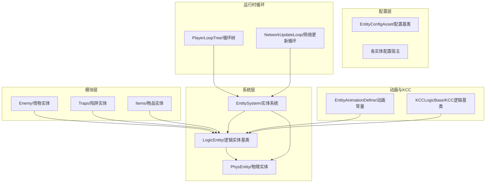
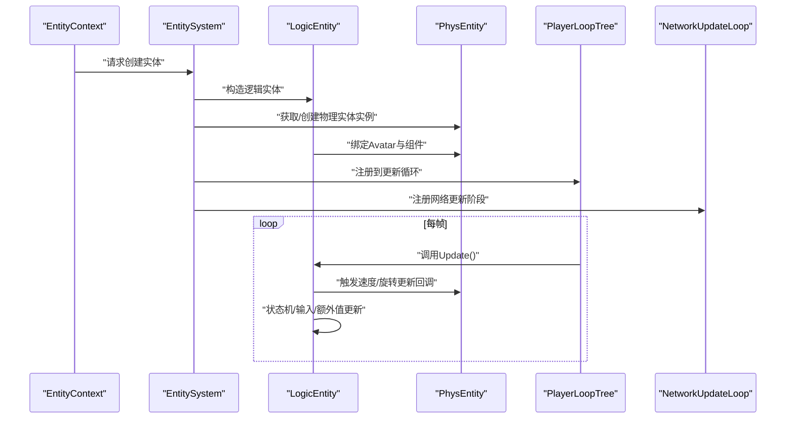
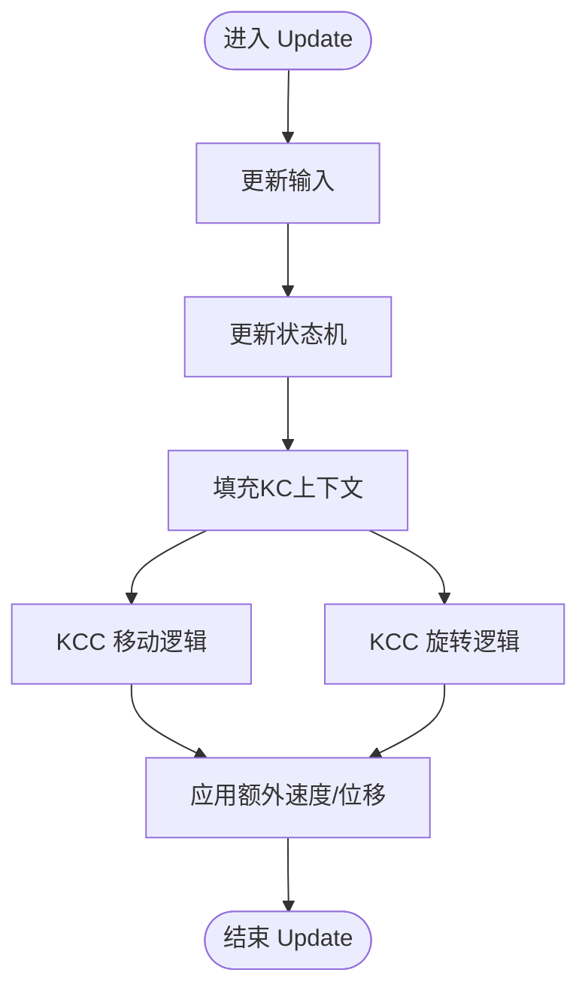
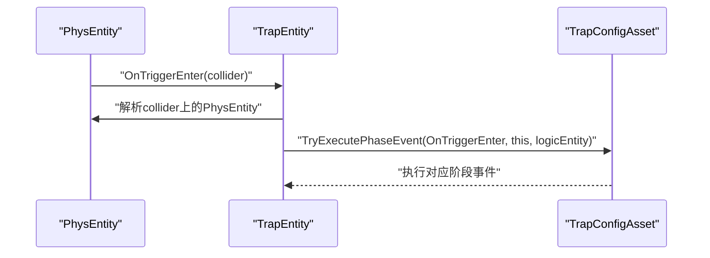
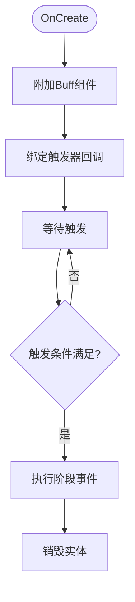
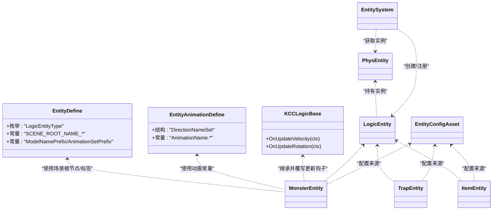

# 实体系统

<cite>
**本文引用的文件**
- [EntityDefine.cs](file://Assets/Scripts/Modules/Entity/EntityDefine.cs)
- [EntityAnimationDefine.cs](file://Assets/Scripts/Modules/Entity/EntityAnimationDefine.cs)
- [KCCLogicBase.cs](file://Assets/Scripts/Modules/Entity/KCC/KCCLogicBase.cs)
- [MonsterEntity.cs](file://Assets/Scripts/Modules/Enemy/MonsterEntity.cs)
- [TrapEntity.cs](file://Assets/Scripts/Modules/Traps/TrapEntity.cs)
- [ItemEntity.cs](file://Assets/Scripts/Modules/Items/ItemEntity.cs)
- [EntityConfigAsset.cs](file://Assets/Scripts/Config/Entity/EntityConfigAsset.cs)
- [PlayerEntity.cs](file://Assets/Scripts/Systems/Implement/EntitySystem/LogicEntity/PlayerEntity/PlayerEntity.cs)
- [LogicEntity.cs](file://Assets/Scripts/Systems/Implement/EntitySystem/LogicEntity/LogicEntity.cs)
- [PhysEntity.cs](file://Assets/Scripts/Systems/Implement/EntitySystem/PhysEntity/PhysEntity.cs)
- [EntitySystem.cs](file://Assets/Scripts/Systems/Implement/EntitySystem/EntitySystem.cs)
- [PlayerLoopTree.cs](file://Assets/Scripts/Core/PlayerLoopAgent/PlayerLoopTree.cs)
- [NetworkUpdateLoop.cs](file://LocalPackages/com.unity.netcode.gameobjects@1.14.1/Runtime/Core/NetworkUpdateLoop.cs)
</cite>

## 目录
1. [简介](#简介)
2. [项目结构](#项目结构)
3. [核心组件](#核心组件)
4. [架构总览](#架构总览)
5. [详细组件分析](#详细组件分析)
6. [依赖关系分析](#依赖关系分析)
7. [性能考量](#性能考量)
8. [故障排查指南](#故障排查指南)
9. [结论](#结论)
10. [附录：扩展开发指南](#附录扩展开发指南)

## 简介
本文件系统性梳理 ProjectR 的实体系统，覆盖实体生命周期管理、实体工厂模式、实体注册机制与实体更新循环；并针对不同实体类型（玩家实体、怪物实体、陷阱实体、物品实体）给出实现差异与特殊处理逻辑说明。同时阐述实体系统与物理系统、动画系统、AI/状态机系统的集成方式，提供实体创建、销毁与状态同步的流程图与参考路径，并总结性能优化策略、内存管理与并发安全注意事项，最后给出扩展新实体类型的开发指南。

## 项目结构
实体系统在工程中的组织采用“模块化+分层”的方式：
- 模块层：分别在 Modules 下的 Enemy、Traps、Items 等目录中定义具体实体类型及其配置宿主。
- 配置层：Config/Entity 下存放实体配置资源与宿主，支持运行时加载与生成实体。
- 系统层：Systems/Implement/EntitySystem 提供逻辑实体、物理实体与实体系统的核心基础设施。
- 动画与KCC：Modules/Entity 下的 Animation 与 KCC 子模块负责动画与角色碰撞控制器逻辑。
- 运行时循环：Core/PlayerLoopAgent 与 Netcode 的 NetworkUpdateLoop 负责更新循环的注入与调度。

图表来源
- [PlayerEntity.cs](file://Assets/Scripts/Systems/Implement/EntitySystem/LogicEntity/PlayerEntity/PlayerEntity.cs)
- [LogicEntity.cs](file://Assets/Scripts/Systems/Implement/EntitySystem/LogicEntity/LogicEntity.cs)
- [PhysEntity.cs](file://Assets/Scripts/Systems/Implement/EntitySystem/PhysEntity/PhysEntity.cs)
- [EntitySystem.cs](file://Assets/Scripts/Systems/Implement/EntitySystem/EntitySystem.cs)
- [EntityAnimationDefine.cs](file://Assets/Scripts/Modules/Entity/EntityAnimationDefine.cs)
- [KCCLogicBase.cs](file://Assets/Scripts/Modules/Entity/KCC/KCCLogicBase.cs)
- [PlayerLoopTree.cs](file://Assets/Scripts/Core/PlayerLoopAgent/PlayerLoopTree.cs)
- [NetworkUpdateLoop.cs](file://LocalPackages/com.unity.netcode.gameobjects@1.14.1/Runtime/Core/NetworkUpdateLoop.cs)

章节来源
- [EntityDefine.cs:1-64](file://Assets/Scripts/Modules/Entity/EntityDefine.cs#L1-L64)
- [EntityAnimationDefine.cs:1-67](file://Assets/Scripts/Modules/Entity/EntityAnimationDefine.cs#L1-L67)
- [KCCLogicBase.cs:1-9](file://Assets/Scripts/Modules/Entity/KCC/KCCLogicBase.cs#L1-L9)
- [PlayerLoopTree.cs:187-206](file://Assets/Scripts/Core/PlayerLoopAgent/PlayerLoopTree.cs#L187-L206)
- [NetworkUpdateLoop.cs:376-406](file://LocalPackages/com.unity.netcode.gameobjects@1.14.1/Runtime/Core/NetworkUpdateLoop.cs#L376-L406)

## 核心组件
- 实体类型枚举与场景根节点命名：用于统一标识实体类型与场景层级组织。
- 动画常量与方向集：提供标准化的动画名称与八方向映射，便于状态机与动画层协同。
- KCC 逻辑基类：抽象出速度与旋转更新钩子，作为角色移动与转向的扩展点。
- 具体实体类型：
  - 怪物实体：继承状态机实体，绑定输入与KCC逻辑，驱动移动与旋转。
  - 陷阱实体：基于逻辑实体，订阅触发器事件并执行配置的阶段事件。
  - 物品实体：基于逻辑实体，附加Buff组件，处理拾取与再生等交互。
- 配置基类：提供可序列化配置基类与“是否运动”标记，支持运行时生成实体。
- 逻辑实体与物理实体：逻辑实体持有物理实体实例，二者通过回调与组件协作。
- 实体系统：负责实体实例获取、生命周期管理与更新循环调度。
- 运行时循环：通过 PlayerLoop 注入与 Netcode 更新循环结合，确保实体按帧更新。

章节来源
- [EntityDefine.cs:7-63](file://Assets/Scripts/Modules/Entity/EntityDefine.cs#L7-L63)
- [EntityAnimationDefine.cs:7-65](file://Assets/Scripts/Modules/Entity/EntityAnimationDefine.cs#L7-L65)
- [KCCLogicBase.cs:3-8](file://Assets/Scripts/Modules/Entity/KCC/KCCLogicBase.cs#L3-L8)
- [MonsterEntity.cs:4-82](file://Assets/Scripts/Modules/Enemy/MonsterEntity.cs#L4-L82)
- [TrapEntity.cs:6-42](file://Assets/Scripts/Modules/Traps/TrapEntity.cs#L6-L42)
- [ItemEntity.cs:7-44](file://Assets/Scripts/Modules/Items/ItemEntity.cs#L7-L44)
- [EntityConfigAsset.cs:8-18](file://Assets/Scripts/Config/Entity/EntityConfigAsset.cs#L8-L18)
- [LogicEntity.cs](file://Assets/Scripts/Systems/Implement/EntitySystem/LogicEntity/LogicEntity.cs)
- [PhysEntity.cs](file://Assets/Scripts/Systems/Implement/EntitySystem/PhysEntity/PhysEntity.cs)
- [EntitySystem.cs](file://Assets/Scripts/Systems/Implement/EntitySystem/EntitySystem.cs)

## 架构总览
实体系统以“逻辑实体 + 物理实体 + 配置资源 + 运行时循环”为核心，形成如下闭环：
- 配置层：通过配置资源与宿主定义实体属性与行为。
- 工厂与注册：实体系统根据上下文创建逻辑实体与物理实体实例，并注册到运行时循环。
- 生命周期：实体在 OnCreate 初始化后进入 Update 循环，处理输入、状态与物理更新。
- 集成：动画系统通过动画常量与状态机协作；KCC 逻辑通过基类钩子参与速度/旋转更新；AI/状态机通过状态机实体驱动行为。

图表来源
- [EntitySystem.cs](file://Assets/Scripts/Systems/Implement/EntitySystem/EntitySystem.cs)
- [LogicEntity.cs](file://Assets/Scripts/Systems/Implement/EntitySystem/LogicEntity/LogicEntity.cs)
- [PhysEntity.cs](file://Assets/Scripts/Systems/Implement/EntitySystem/PhysEntity/PhysEntity.cs)
- [PlayerLoopTree.cs:187-206](file://Assets/Scripts/Core/PlayerLoopAgent/PlayerLoopTree.cs#L187-L206)
- [NetworkUpdateLoop.cs:376-406](file://LocalPackages/com.unity.netcode.gameobjects@1.14.1/Runtime/Core/NetworkUpdateLoop.cs#L376-L406)

## 详细组件分析

### 实体类型与场景组织
- 类型枚举：统一标识 Empty、Player、Trap、Item、Enemy，便于系统识别与路由。
- 场景根节点命名：敌人、陷阱、物品、重置点、死区等节点名，保证场景层级清晰。
- 动画与模型前缀：Avatar 与 ClipTransitionSet 前缀及格式化字符串，便于资源加载与匹配。

章节来源
- [EntityDefine.cs:7-26](file://Assets/Scripts/Modules/Entity/EntityDefine.cs#L7-L26)
- [EntityDefine.cs:30-63](file://Assets/Scripts/Modules/Entity/EntityDefine.cs#L30-L63)

### 动画系统集成
- 动画名称集合：包含 Idle、Jump、Walk/Dash 八方向等名称，配合状态机进行播放与过渡。
- 方向集封装：DirectionNameSet 将六个方向映射为字符串，便于根据朝向选择对应动画。

章节来源
- [EntityAnimationDefine.cs:7-65](file://Assets/Scripts/Modules/Entity/EntityAnimationDefine.cs#L7-L65)

### KCC 逻辑基类
- 抽象钩子：OnUpdateVelocity 与 OnUpdateRotation 提供扩展点，由具体实体在更新循环中填充上下文并执行逻辑。

章节来源
- [KCCLogicBase.cs:3-8](file://Assets/Scripts/Modules/Entity/KCC/KCCLogicBase.cs#L3-L8)

### 怪物实体（StateMachineEntity）
- 输入与状态初始化：注册输入处理器，绑定物理实体的速度/旋转回调。
- 更新流程：每帧更新输入与状态机，结合 KCC 逻辑执行移动与转向。
- 额外值与位移：在速度更新中应用额外速度与上浮力，影响地面判定。

图表来源
- [MonsterEntity.cs:44-82](file://Assets/Scripts/Modules/Enemy/MonsterEntity.cs#L44-L82)

章节来源
- [MonsterEntity.cs:4-82](file://Assets/Scripts/Modules/Enemy/MonsterEntity.cs#L4-L82)

### 陷阱实体（TrapEntity）
- 触发器事件：订阅 OnTriggerEnter，当检测到逻辑实体时，按配置执行阶段事件。
- 物理绘制：在 OnDrawGizmos 中可视化碰撞体积。

图表来源
- [TrapEntity.cs:26-31](file://Assets/Scripts/Modules/Traps/TrapEntity.cs#L26-L31)

章节来源
- [TrapEntity.cs:6-42](file://Assets/Scripts/Modules/Traps/TrapEntity.cs#L6-L42)

### 物品实体（ItemEntity）
- 组件附加：创建物理实体后附加 Buff 组件，配置再生次数与间隔。
- 触发器事件：OnTriggerEnter/Stay 触发拾取或持续效果，按配置执行阶段事件。
- 销毁：实现 Destroy 以销毁对象。

图表来源
- [ItemEntity.cs:12-44](file://Assets/Scripts/Modules/Items/ItemEntity.cs#L12-L44)

章节来源
- [ItemEntity.cs:7-44](file://Assets/Scripts/Modules/Items/ItemEntity.cs#L7-L44)

### 配置基类与生成
- 可序列化配置基类：提供 isPhysics 标记与生成接口，支持运行时生成实体。
- 宿主：各实体配置宿主负责加载与分发配置。

章节来源
- [EntityConfigAsset.cs:8-18](file://Assets/Scripts/Config/Entity/EntityConfigAsset.cs#L8-L18)

### 逻辑实体与物理实体
- 逻辑实体职责：持有物理实体实例，绑定 Avatar 与组件，处理输入、状态与事件。
- 物理实体职责：承载碰撞器、刚体等物理组件，提供速度/旋转更新回调。

章节来源
- [LogicEntity.cs](file://Assets/Scripts/Systems/Implement/EntitySystem/LogicEntity/LogicEntity.cs)
- [PhysEntity.cs](file://Assets/Scripts/Systems/Implement/EntitySystem/PhysEntity/PhysEntity.cs)

### 实体系统与运行时循环
- 实体系统：负责实体实例获取、生命周期管理与更新循环调度。
- PlayerLoop 注入：通过 PlayerLoopTree 构建循环树，将系统插入合适阶段。
- Netcode 更新：NetworkUpdateLoop 注册系统，确保网络同步阶段正确执行。

章节来源
- [EntitySystem.cs](file://Assets/Scripts/Systems/Implement/EntitySystem/EntitySystem.cs)
- [PlayerLoopTree.cs:187-206](file://Assets/Scripts/Core/PlayerLoopAgent/PlayerLoopTree.cs#L187-L206)
- [NetworkUpdateLoop.cs:376-406](file://LocalPackages/com.unity.netcode.gameobjects@1.14.1/Runtime/Core/NetworkUpdateLoop.cs#L376-L406)

## 依赖关系分析
- 实体类型对系统层的依赖：怪物、陷阱、物品均依赖 LogicEntity/PhysEntity 与实体系统。
- 动画与KCC：怪物实体依赖动画常量与KCC逻辑基类，实现移动与旋转。
- 配置层：所有实体类型依赖配置基类与宿主，实现行为参数化。
- 运行时循环：实体系统依赖 PlayerLoop 与 Netcode 更新循环，确保稳定更新。

图表来源
- [EntityDefine.cs:7-63](file://Assets/Scripts/Modules/Entity/EntityDefine.cs#L7-L63)
- [EntityAnimationDefine.cs:7-65](file://Assets/Scripts/Modules/Entity/EntityAnimationDefine.cs#L7-L65)
- [KCCLogicBase.cs:3-8](file://Assets/Scripts/Modules/Entity/KCC/KCCLogicBase.cs#L3-L8)
- [LogicEntity.cs](file://Assets/Scripts/Systems/Implement/EntitySystem/LogicEntity/LogicEntity.cs)
- [PhysEntity.cs](file://Assets/Scripts/Systems/Implement/EntitySystem/PhysEntity/PhysEntity.cs)
- [EntitySystem.cs](file://Assets/Scripts/Systems/Implement/EntitySystem/EntitySystem.cs)
- [MonsterEntity.cs:4-82](file://Assets/Scripts/Modules/Enemy/MonsterEntity.cs#L4-L82)
- [TrapEntity.cs:6-42](file://Assets/Scripts/Modules/Traps/TrapEntity.cs#L6-L42)
- [ItemEntity.cs:7-44](file://Assets/Scripts/Modules/Items/ItemEntity.cs#L7-L44)
- [EntityConfigAsset.cs:8-18](file://Assets/Scripts/Config/Entity/EntityConfigAsset.cs#L8-L18)

## 性能考量
- 对象池与复用：优先使用对象池减少 GC 压力，尤其在陷阱与物品实体频繁生成销毁场景。
- 回调与事件：避免在每帧回调中做重型计算，将复杂逻辑放入状态机或独立系统。
- 触发器过滤：在 OnTriggerEnter/Stay 中尽早判断目标有效性，减少无效分支。
- 动画与KCC：合并动画过渡与KCC更新，避免重复计算同一帧的状态。
- 运行时循环：合理安排实体更新顺序，避免长帧阻塞后续系统。
- 网络同步：利用 Netcode 的更新阶段，将脏数据收集与发送分离，降低抖动。

## 故障排查指南
- 实体创建失败：检查实体系统是否成功获取物理实体实例，确认配置资源加载路径与名称。
- 触发器无响应：确认物理实体已创建 Avatar 并挂载碰撞器，检查 OnTriggerEnter 回调绑定。
- 动画不生效：核对动画名称与哈希常量是否一致，确认状态机与动画层连接正常。
- KCC 异常：检查 KCC 逻辑钩子是否被覆写，确认上下文填充与额外速度叠加逻辑。
- 运行时循环异常：验证 PlayerLoop 注入位置与 Netcode 更新阶段注册是否正确。

章节来源
- [TrapEntity.cs:13-24](file://Assets/Scripts/Modules/Traps/TrapEntity.cs#L13-L24)
- [ItemEntity.cs:14-30](file://Assets/Scripts/Modules/Items/ItemEntity.cs#L14-L30)
- [EntitySystem.cs](file://Assets/Scripts/Systems/Implement/EntitySystem/EntitySystem.cs)
- [PlayerLoopTree.cs:187-206](file://Assets/Scripts/Core/PlayerLoopAgent/PlayerLoopTree.cs#L187-L206)
- [NetworkUpdateLoop.cs:376-406](file://LocalPackages/com.unity.netcode.gameobjects@1.14.1/Runtime/Core/NetworkUpdateLoop.cs#L376-L406)

## 结论
ProjectR 的实体系统通过清晰的模块划分与分层设计，实现了配置驱动、可扩展且易于维护的实体框架。逻辑实体与物理实体解耦、动画与KCC可插拔、运行时循环与网络同步融合，使得系统具备良好的性能与扩展性。建议在实际开发中遵循对象池、事件过滤与运行时循环优化的最佳实践，以获得更稳定的帧率与更低的内存占用。

## 附录：扩展开发指南
- 新增实体类型步骤
  1) 在 Modules 下创建新实体目录与实体类，继承 LogicEntity 或其子类（如怪物可继承状态机实体）。
  2) 在 Config/Entity 下新增配置资产与宿主，实现配置加载与行为参数化。
  3) 在实体 OnCreate 中创建物理实体实例并绑定 Avatar 与组件。
  4) 在 Update 中接入输入、状态机与 KCC 逻辑钩子。
  5) 如需动画，使用动画常量与状态机进行播放控制。
  6) 在实体系统中注册实体类型与创建工厂，确保运行时循环与网络同步阶段正确执行。
- 自定义实体行为
  - 通过覆写 KCC 逻辑钩子实现自定义移动/旋转。
  - 使用配置资产的阶段事件扩展交互逻辑（如触发器、拾取、再生等）。
  - 利用额外值系统实现临时状态（如无敌、加速）与叠加效果。
- 并发与线程安全
  - 仅在主线程访问 Unity 对象与组件。
  - 将网络相关状态同步放入 Netcode 的同步阶段，避免跨线程直接修改。
  - 使用对象池与轻量级数据结构减少锁竞争。

章节来源
- [EntityConfigAsset.cs:8-18](file://Assets/Scripts/Config/Entity/EntityConfigAsset.cs#L8-L18)
- [EntitySystem.cs](file://Assets/Scripts/Systems/Implement/EntitySystem/EntitySystem.cs)
- [EntityAnimationDefine.cs:7-65](file://Assets/Scripts/Modules/Entity/EntityAnimationDefine.cs#L7-L65)
- [KCCLogicBase.cs:3-8](file://Assets/Scripts/Modules/Entity/KCC/KCCLogicBase.cs#L3-L8)
- [PlayerLoopTree.cs:187-206](file://Assets/Scripts/Core/PlayerLoopAgent/PlayerLoopTree.cs#L187-L206)
- [NetworkUpdateLoop.cs:376-406](file://LocalPackages/com.unity.netcode.gameobjects@1.14.1/Runtime/Core/NetworkUpdateLoop.cs#L376-L406)