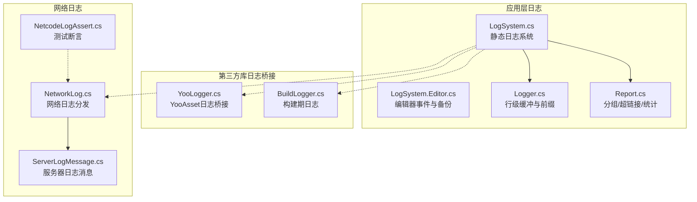
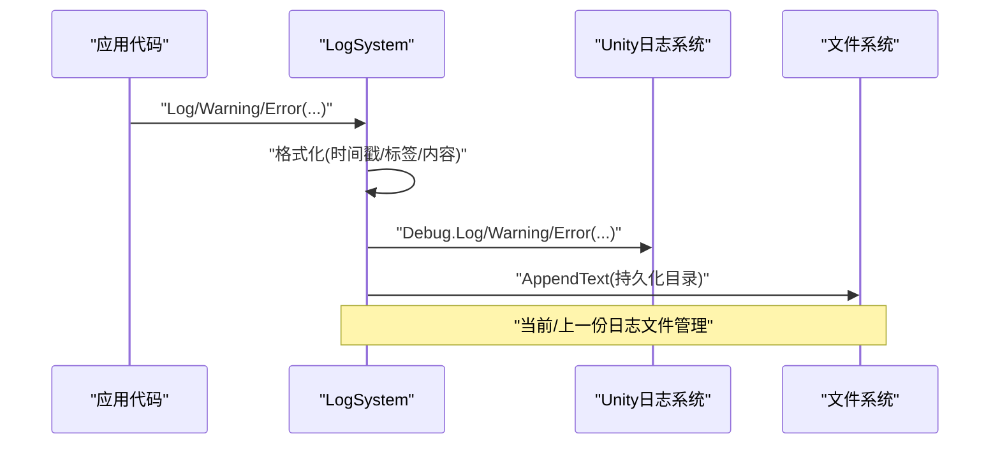
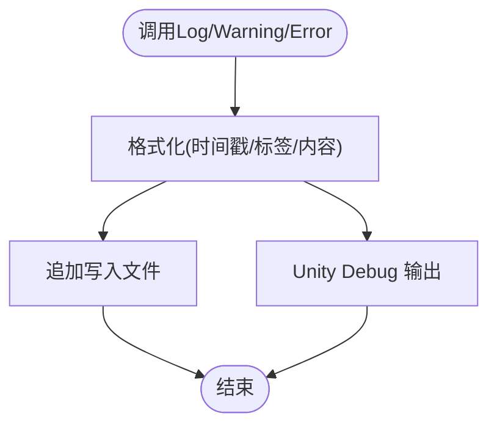
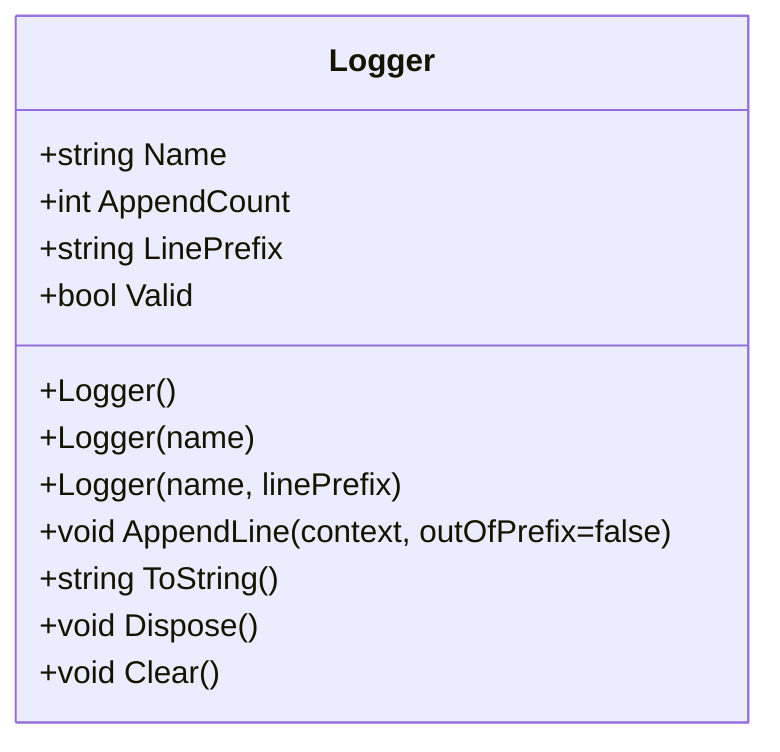
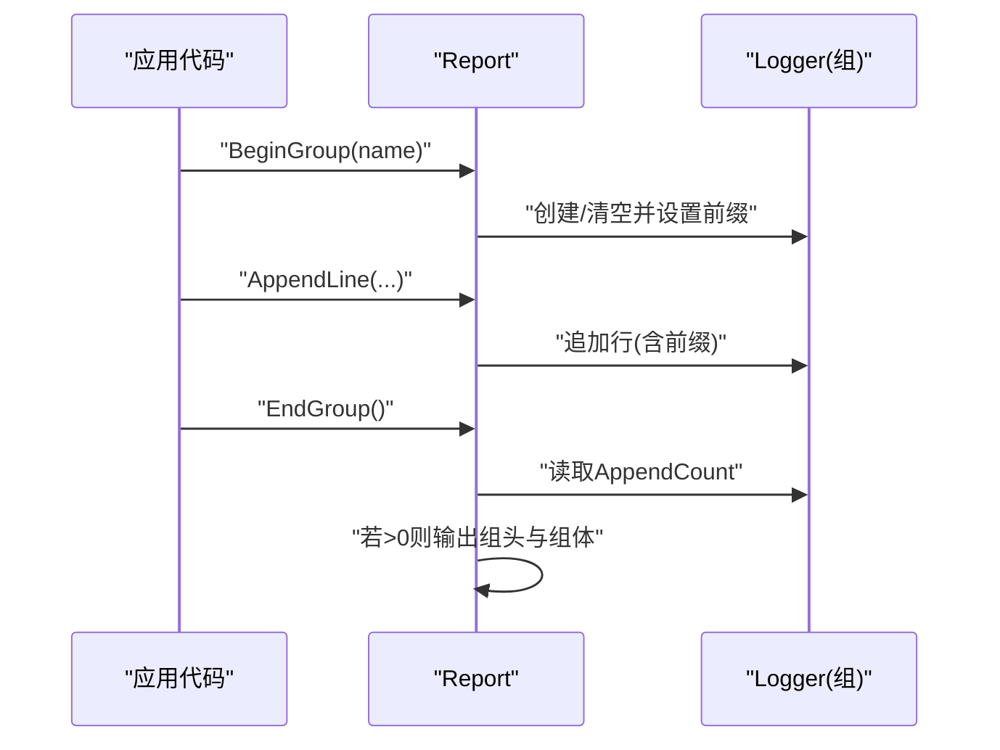
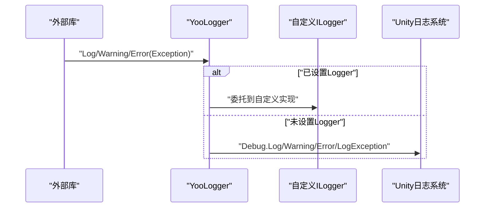
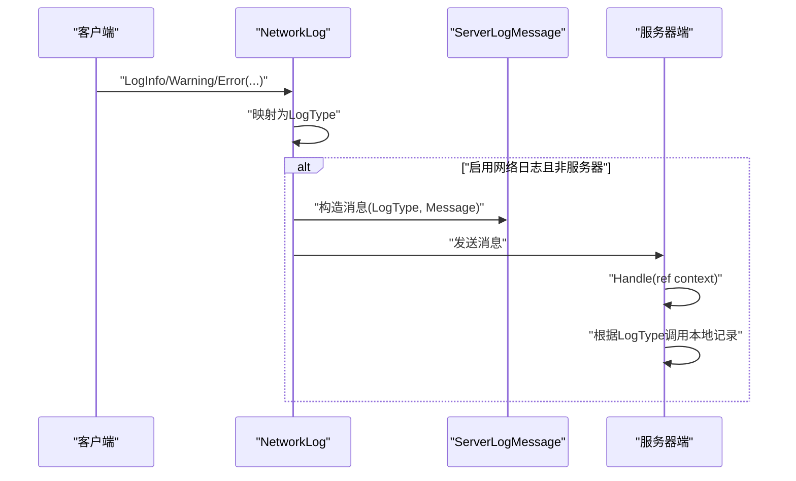
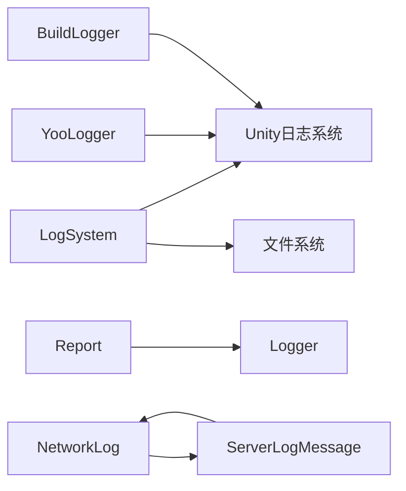

# 日志系统

<cite>
**本文引用的文件**
- [LogSystem.cs](file://Assets/Scripts/Systems/Implement/LogSystem/LogSystem.cs)
- [LogSystem.Editor.cs](file://Assets/Scripts/Systems/Implement/LogSystem/LogSystem.Editor.cs)
- [Logger.cs](file://Assets/Scripts/Systems/Implement/LogSystem/Logger.cs)
- [Report.cs](file://Assets/Scripts/Systems/Implement/LogSystem/Report.cs)
- [YooLogger.cs](file://Assets/Plugins/com.tuyoogame.yooasset@2.1.2/Runtime/Utility/YooLogger.cs)
- [BuildLogger.cs](file://Assets/Plugins/com.tuyoogame.yooasset@2.1.2/Editor/AssetBundleBuilder/BuildSystem/BuildLogger.cs)
- [NetworkLog.cs](file://LocalPackages/com.unity.netcode.gameobjects@1.14.1/Runtime/Logging/NetworkLog.cs)
- [ServerLogMessage.cs](file://LocalPackages/com.unity.netcode.gameobjects@1.14.1/Runtime/Messaging/Messages/ServerLogMessage.cs)
- [NetcodeLogAssert.cs](file://LocalPackages/com.unity.netcode.gameobjects@1.14.1/TestHelpers/Runtime/NetcodeLogAssert.cs)
</cite>

## 目录
1. [简介](#简介)
2. [项目结构](#项目结构)
3. [核心组件](#核心组件)
4. [架构总览](#架构总览)
5. [详细组件分析](#详细组件分析)
6. [依赖关系分析](#依赖关系分析)
7. [性能考量](#性能考量)
8. [故障排查指南](#故障排查指南)
9. [结论](#结论)
10. [附录](#附录)

## 简介
本文件面向ProjectR项目的日志系统，系统性阐述其架构与实现原理，覆盖以下主题：
- 日志级别管理与标签体系
- 多目标输出：控制台、文件与网络日志
- 日志文件管理与轮转
- 性能优化策略：同步/异步写入、缓冲与轮转
- 配置、过滤与格式化
- 调试与可视化：日志查看、编辑器菜单、实时监控
- 扩展开发：新增输出目标与自定义处理器
- 生产环境最佳实践

## 项目结构
ProjectR的日志系统由“应用层日志”“报告与分组日志”“第三方库日志桥接”“网络日志”四部分组成，并通过静态系统统一入口进行注册与使用。

图表来源
- [LogSystem.cs:1-156](file://Assets/Scripts/Systems/Implement/LogSystem/LogSystem.cs#L1-L156)
- [LogSystem.Editor.cs:1-115](file://Assets/Scripts/Systems/Implement/LogSystem/LogSystem.Editor.cs#L1-L115)
- [Logger.cs:1-78](file://Assets/Scripts/Systems/Implement/LogSystem/Logger.cs#L1-L78)
- [Report.cs:1-276](file://Assets/Scripts/Systems/Implement/LogSystem/Report.cs#L1-L276)
- [YooLogger.cs:1-81](file://Assets/Plugins/com.tuyoogame.yooasset@2.1.2/Runtime/Utility/YooLogger.cs#L1-L81)
- [BuildLogger.cs:1-38](file://Assets/Plugins/com.tuyoogame.yooasset@2.1.2/Editor/AssetBundleBuilder/BuildSystem/BuildLogger.cs#L1-L38)
- [NetworkLog.cs:62-102](file://LocalPackages/com.unity.netcode.gameobjects@1.14.1/Runtime/Logging/NetworkLog.cs#L62-L102)
- [ServerLogMessage.cs:30-56](file://LocalPackages/com.unity.netcode.gameobjects@1.14.1/Runtime/Messaging/Messages/ServerLogMessage.cs#L30-L56)
- [NetcodeLogAssert.cs:92-186](file://LocalPackages/com.unity.netcode.gameobjects@1.14.1/TestHelpers/Runtime/NetcodeLogAssert.cs#L92-L186)

章节来源
- [LogSystem.cs:1-156](file://Assets/Scripts/Systems/Implement/LogSystem/LogSystem.cs#L1-L156)
- [LogSystem.Editor.cs:1-115](file://Assets/Scripts/Systems/Implement/LogSystem/LogSystem.Editor.cs#L1-L115)
- [Logger.cs:1-78](file://Assets/Scripts/Systems/Implement/LogSystem/Logger.cs#L1-L78)
- [Report.cs:1-276](file://Assets/Scripts/Systems/Implement/LogSystem/Report.cs#L1-L276)
- [YooLogger.cs:1-81](file://Assets/Plugins/com.tuyoogame.yooasset@2.1.2/Runtime/Utility/YooLogger.cs#L1-L81)
- [BuildLogger.cs:1-38](file://Assets/Plugins/com.tuyoogame.yooasset@2.1.2/Editor/AssetBundleBuilder/BuildSystem/BuildLogger.cs#L1-L38)
- [NetworkLog.cs:62-102](file://LocalPackages/com.unity.netcode.gameobjects@1.14.1/Runtime/Logging/NetworkLog.cs#L62-L102)
- [ServerLogMessage.cs:30-56](file://LocalPackages/com.unity.netcode.gameobjects@1.14.1/Runtime/Messaging/Messages/ServerLogMessage.cs#L30-L56)
- [NetcodeLogAssert.cs:92-186](file://LocalPackages/com.unity.netcode.gameobjects@1.14.1/TestHelpers/Runtime/NetcodeLogAssert.cs#L92-L186)

## 核心组件
- 静态日志系统（LogSystem）
  - 提供统一的日志入口，支持时间戳、标签、帧号等格式化输出。
  - 支持将日志写入持久化目录文件，具备当前/上一份日志文件管理能力。
  - 编辑器模式下自动注册Unity日志回调，捕获并转换为统一格式。
- 行级缓冲与前缀（Logger）
  - 基于StringBuilder的行级缓冲，支持每行前缀与追加计数。
  - 提供清理与释放，避免内存泄漏。
- 报告与分组（Report）
  - 支持嵌套分组、超链接、缩进前缀风格、值变更追踪等。
  - 提供作用域式BeginGroup/EndGroup与ReportScope，确保异常安全。
- 第三方库日志桥接（YooLogger、BuildLogger）
  - 将外部库日志统一到UnityEngine.Debug或自定义ILogger接口。
  - 构建期日志可按开关启用/禁用。
- 网络日志（NetworkLog、ServerLogMessage）
  - 将客户端日志类型映射为网络日志类型，必要时通过消息发送至服务器端本地记录。
  - 测试辅助类可断言日志是否被接收。

章节来源
- [LogSystem.cs:35-85](file://Assets/Scripts/Systems/Implement/LogSystem/LogSystem.cs#L35-L85)
- [LogSystem.cs:112-126](file://Assets/Scripts/Systems/Implement/LogSystem/LogSystem.cs#L112-L126)
- [LogSystem.Editor.cs:38-63](file://Assets/Scripts/Systems/Implement/LogSystem/LogSystem.Editor.cs#L38-L63)
- [Logger.cs:6-78](file://Assets/Scripts/Systems/Implement/LogSystem/Logger.cs#L6-L78)
- [Report.cs:10-232](file://Assets/Scripts/Systems/Implement/LogSystem/Report.cs#L10-L232)
- [YooLogger.cs:8-81](file://Assets/Plugins/com.tuyoogame.yooasset@2.1.2/Runtime/Utility/YooLogger.cs#L8-L81)
- [BuildLogger.cs:8-38](file://Assets/Plugins/com.tuyoogame.yooasset@2.1.2/Editor/AssetBundleBuilder/BuildSystem/BuildLogger.cs#L8-L38)
- [NetworkLog.cs:62-102](file://LocalPackages/com.unity.netcode.gameobjects@1.14.1/Runtime/Logging/NetworkLog.cs#L62-L102)
- [ServerLogMessage.cs:30-56](file://LocalPackages/com.unity.netcode.gameobjects@1.14.1/Runtime/Messaging/Messages/ServerLogMessage.cs#L30-L56)

## 架构总览
日志系统采用“静态入口 + 分层组件”的架构：
- 入口层：LogSystem提供统一API（Log/Warning/Error），并负责格式化与落盘。
- 组件层：Logger负责行级缓冲；Report负责分组、超链接与统计。
- 桥接层：YooLogger/BuildLogger将第三方库日志接入统一通道。
- 网络层：NetworkLog将日志类型映射并可转发至服务器端记录。
- 编辑器层：LogSystem.Editor注册Unity日志回调，捕获并转换为统一格式，同时负责日志备份与打开。

图表来源
- [LogSystem.cs:35-85](file://Assets/Scripts/Systems/Implement/LogSystem/LogSystem.cs#L35-L85)
- [LogSystem.cs:112-126](file://Assets/Scripts/Systems/Implement/LogSystem/LogSystem.cs#L112-L126)
- [LogSystem.Editor.cs:38-63](file://Assets/Scripts/Systems/Implement/LogSystem/LogSystem.Editor.cs#L38-L63)

## 详细组件分析

### 静态日志系统（LogSystem）
- 功能要点
  - 统一格式化：时间戳、帧号、标签、内容。
  - 多目标输出：控制台（Unity Debug）+ 文件（持久化目录）。
  - 文件管理：当前日志文件与上一份日志文件，支持清空与备份。
  - 编辑器集成：注册Unity日志回调，捕获并转换为统一格式；批处理模式切换日志文件名。
- 关键流程
  - 日志入口：Log/Warning/Error重载，内部调用LogWithTag。
  - 格式化：拼接时间戳、标签、内容。
  - 写入：AppendLog写入当前日志文件。
  - 编辑器：Application.logMessageReceived回调捕获Unity日志，转换为对应标签。

图表来源
- [LogSystem.cs:35-85](file://Assets/Scripts/Systems/Implement/LogSystem/LogSystem.cs#L35-L85)
- [LogSystem.cs:112-126](file://Assets/Scripts/Systems/Implement/LogSystem/LogSystem.cs#L112-L126)

章节来源
- [LogSystem.cs:10-156](file://Assets/Scripts/Systems/Implement/LogSystem/LogSystem.cs#L10-L156)
- [LogSystem.Editor.cs:14-36](file://Assets/Scripts/Systems/Implement/LogSystem/LogSystem.Editor.cs#L14-L36)
- [LogSystem.Editor.cs:65-75](file://Assets/Scripts/Systems/Implement/LogSystem/LogSystem.Editor.cs#L65-L75)

### 行级缓冲与前缀（Logger）
- 功能要点
  - 使用StringBuilder累积行内容，支持每行前缀与追加计数。
  - 提供Clear/Dispose，避免内存泄漏。
- 适用场景
  - Report中作为分组内的临时缓冲，最后一次性输出。

图表来源
- [Logger.cs:6-78](file://Assets/Scripts/Systems/Implement/LogSystem/Logger.cs#L6-L78)

章节来源
- [Logger.cs:1-78](file://Assets/Scripts/Systems/Implement/LogSystem/Logger.cs#L1-L78)

### 报告与分组（Report）
- 功能要点
  - 分组缩进：支持多种前缀风格，嵌套层级自动缩进。
  - 超链接：支持生成可点击的超链接标记，便于跳转源码位置。
  - 值变更追踪：提供数值增减/倍率/枚举变化等便捷方法。
  - 作用域：GroupScope/ReportScope确保异常安全的Begin/End配对。
- 关键流程
  - BeginGroup/EndGroup维护组栈与计数，仅在有内容时输出组头与组体。
  - AppendLine根据是否带标签拼接相应格式。

图表来源
- [Report.cs:62-103](file://Assets/Scripts/Systems/Implement/LogSystem/Report.cs#L62-L103)
- [Report.cs:104-125](file://Assets/Scripts/Systems/Implement/LogSystem/Report.cs#L104-L125)

章节来源
- [Report.cs:10-232](file://Assets/Scripts/Systems/Implement/LogSystem/Report.cs#L10-L232)

### 第三方库日志桥接（YooLogger、BuildLogger）
- YooLogger
  - 提供ILogger接口，若未设置则回退到UnityEngine.Debug。
  - 条件编译控制，DEBUG条件下的Log走条件分支。
- BuildLogger
  - 构建期日志开关，支持Warning/Error直接输出。

图表来源
- [YooLogger.cs:16-81](file://Assets/Plugins/com.tuyoogame.yooasset@2.1.2/Runtime/Utility/YooLogger.cs#L16-L81)

章节来源
- [YooLogger.cs:8-81](file://Assets/Plugins/com.tuyoogame.yooasset@2.1.2/Runtime/Utility/YooLogger.cs#L8-L81)
- [BuildLogger.cs:8-38](file://Assets/Plugins/com.tuyoogame.yooasset@2.1.2/Editor/AssetBundleBuilder/BuildSystem/BuildLogger.cs#L8-L38)

### 网络日志（NetworkLog、ServerLogMessage）
- 功能要点
  - 客户端将日志类型映射为NetworkLog.LogType，必要时构造ServerLogMessage并通过网络发送。
  - 服务器端收到消息后，调用对应本地记录函数（Info/Warning/Error）。
  - 测试辅助类可断言日志是否被接收及字节长度。

图表来源
- [NetworkLog.cs:62-102](file://LocalPackages/com.unity.netcode.gameobjects@1.14.1/Runtime/Logging/NetworkLog.cs#L62-L102)
- [ServerLogMessage.cs:30-56](file://LocalPackages/com.unity.netcode.gameobjects@1.14.1/Runtime/Messaging/Messages/ServerLogMessage.cs#L30-L56)

章节来源
- [NetworkLog.cs:62-102](file://LocalPackages/com.unity.netcode.gameobjects@1.14.1/Runtime/Logging/NetworkLog.cs#L62-L102)
- [ServerLogMessage.cs:30-56](file://LocalPackages/com.unity.netcode.gameobjects@1.14.1/Runtime/Messaging/Messages/ServerLogMessage.cs#L30-L56)
- [NetcodeLogAssert.cs:92-186](file://LocalPackages/com.unity.netcode.gameobjects@1.14.1/TestHelpers/Runtime/NetcodeLogAssert.cs#L92-L186)

## 依赖关系分析
- 组件耦合
  - LogSystem依赖Unity日志系统与文件系统，是所有日志输出的统一入口。
  - Report依赖Logger进行组内缓冲，二者组合形成“分组报告”能力。
  - YooLogger/BuildLogger作为桥接，降低第三方库对Unity日志的直接依赖。
  - NetworkLog与ServerLogMessage构成网络日志链路，服务器端本地记录。
- 外部依赖
  - Unity日志系统（Debug.Log/Warning/Error/LogException）
  - 文件系统（持久化目录写入）
  - 编辑器事件（PlayMode状态变化）

图表来源
- [LogSystem.cs:35-85](file://Assets/Scripts/Systems/Implement/LogSystem/LogSystem.cs#L35-L85)
- [Report.cs:10-232](file://Assets/Scripts/Systems/Implement/LogSystem/Report.cs#L10-L232)
- [YooLogger.cs:16-81](file://Assets/Plugins/com.tuyoogame.yooasset@2.1.2/Runtime/Utility/YooLogger.cs#L16-L81)
- [BuildLogger.cs:8-38](file://Assets/Plugins/com.tuyoogame.yooasset@2.1.2/Editor/AssetBundleBuilder/BuildSystem/BuildLogger.cs#L8-L38)
- [NetworkLog.cs:62-102](file://LocalPackages/com.unity.netcode.gameobjects@1.14.1/Runtime/Logging/NetworkLog.cs#L62-L102)
- [ServerLogMessage.cs:30-56](file://LocalPackages/com.unity.netcode.gameobjects@1.14.1/Runtime/Messaging/Messages/ServerLogMessage.cs#L30-L56)

章节来源
- [LogSystem.cs:10-156](file://Assets/Scripts/Systems/Implement/LogSystem/LogSystem.cs#L10-L156)
- [Report.cs:10-232](file://Assets/Scripts/Systems/Implement/LogSystem/Report.cs#L10-L232)
- [YooLogger.cs:8-81](file://Assets/Plugins/com.tuyoogame.yooasset@2.1.2/Runtime/Utility/YooLogger.cs#L8-L81)
- [BuildLogger.cs:8-38](file://Assets/Plugins/com.tuyoogame.yooasset@2.1.2/Editor/AssetBundleBuilder/BuildSystem/BuildLogger.cs#L8-L38)
- [NetworkLog.cs:62-102](file://LocalPackages/com.unity.netcode.gameobjects@1.14.1/Runtime/Logging/NetworkLog.cs#L62-L102)
- [ServerLogMessage.cs:30-56](file://LocalPackages/com.unity.netcode.gameobjects@1.14.1/Runtime/Messaging/Messages/ServerLogMessage.cs#L30-L56)

## 性能考量
- 同步写盘
  - 当前实现使用同步追加写入文件，简单可靠但可能阻塞主线程。
- 异步写入建议
  - 在高频日志场景，建议引入后台线程或队列异步写盘，避免阻塞。
- 缓冲与批处理
  - 使用StringBuilder减少字符串拼接开销；批量写入可降低IO次数。
- 日志轮转
  - 已具备“当前/上一份”文件管理，建议增加大小阈值轮转与过期清理策略。
- 过滤与采样
  - 对高频信息进行采样或过滤，避免磁盘与网络带宽压力。
- 条件编译
  - DEBUG条件下的日志可按需开启，Release关闭以减少开销。

[本节为通用指导，无需列出章节来源]

## 故障排查指南
- 控制台无日志
  - 检查LogSystem是否正确注册Unity日志回调。
  - 确认编辑器菜单项是否正常打开日志文件。
- 文件未生成或为空
  - 检查持久化目录是否存在，权限是否允许写入。
  - 确认SetCurrentLogFile是否被调用。
- 网络日志未到达服务器
  - 检查EnableNetworkLogs配置与消息序列化。
  - 使用NetcodeLogAssert断言日志是否被接收。
- 循环日志
  - LogSystem在编辑器回调中会过滤包含特定标签的内容，避免循环。

章节来源
- [LogSystem.Editor.cs:34-45](file://Assets/Scripts/Systems/Implement/LogSystem/LogSystem.Editor.cs#L34-L45)
- [LogSystem.cs:112-126](file://Assets/Scripts/Systems/Implement/LogSystem/LogSystem.cs#L112-L126)
- [NetcodeLogAssert.cs:92-186](file://LocalPackages/com.unity.netcode.gameobjects@1.14.1/TestHelpers/Runtime/NetcodeLogAssert.cs#L92-L186)

## 结论
ProjectR的日志系统以LogSystem为核心，结合Report/Logger提供强大的分组与格式化能力，通过YooLogger/BuildLogger桥接第三方库，配合NetworkLog实现跨进程/跨网络的日志采集。系统简洁可靠，适合开发与生产环境使用。建议在高负载场景引入异步写盘与轮转策略，进一步提升稳定性与可维护性。

[本节为总结，无需列出章节来源]

## 附录

### 日志配置与使用示例（路径指引）
- 基础日志
  - 路径：[LogSystem.cs:35-45](file://Assets/Scripts/Systems/Implement/LogSystem/LogSystem.cs#L35-L45)
- 带标签日志
  - 路径：[LogSystem.cs:47-64](file://Assets/Scripts/Systems/Implement/LogSystem/LogSystem.cs#L47-L64)
- 文件路径与轮转
  - 路径：[LogSystem.cs:92-110](file://Assets/Scripts/Systems/Implement/LogSystem/LogSystem.cs#L92-L110)、[LogSystem.cs:133-144](file://Assets/Scripts/Systems/Implement/LogSystem/LogSystem.cs#L133-L144)、[LogSystem.cs:147-153](file://Assets/Scripts/Systems/Implement/LogSystem/LogSystem.cs#L147-L153)
- 编辑器事件与备份
  - 路径：[LogSystem.Editor.cs:18-36](file://Assets/Scripts/Systems/Implement/LogSystem/LogSystem.Editor.cs#L18-L36)、[LogSystem.Editor.cs:65-75](file://Assets/Scripts/Systems/Implement/LogSystem/LogSystem.Editor.cs#L65-L75)
- 分组与超链接
  - 路径：[Report.cs:62-103](file://Assets/Scripts/Systems/Implement/LogSystem/Report.cs#L62-L103)、[Report.cs:233-256](file://Assets/Scripts/Systems/Implement/LogSystem/Report.cs#L233-L256)
- 数值变更追踪
  - 路径：[Report.cs:191-230](file://Assets/Scripts/Systems/Implement/LogSystem/Report.cs#L191-L230)
- 第三方库日志桥接
  - 路径：[YooLogger.cs:16-81](file://Assets/Plugins/com.tuyoogame.yooasset@2.1.2/Runtime/Utility/YooLogger.cs#L16-L81)、[BuildLogger.cs:12-31](file://Assets/Plugins/com.tuyoogame.yooasset@2.1.2/Editor/AssetBundleBuilder/BuildSystem/BuildLogger.cs#L12-L31)
- 网络日志
  - 路径：[NetworkLog.cs:62-102](file://LocalPackages/com.unity.netcode.gameobjects@1.14.1/Runtime/Logging/NetworkLog.cs#L62-L102)、[ServerLogMessage.cs:30-56](file://LocalPackages/com.unity.netcode.gameobjects@1.14.1/Runtime/Messaging/Messages/ServerLogMessage.cs#L30-L56)

### 日志级别与标签
- 级别映射（编辑器回调）
  - 路径：[LogSystem.Editor.cs:46-63](file://Assets/Scripts/Systems/Implement/LogSystem/LogSystem.Editor.cs#L46-L63)
- 标签常量
  - 路径：[LogSystem.cs:22-28](file://Assets/Scripts/Systems/Implement/LogSystem/LogSystem.cs#L22-L28)

### 调试与可视化
- 打开日志文件
  - 路径：[LogSystem.Editor.cs:102-111](file://Assets/Scripts/Systems/Implement/LogSystem/LogSystem.Editor.cs#L102-L111)
- 实时监控
  - 利用Unity控制台与编辑器日志窗口；网络日志可通过断言工具验证。

章节来源
- [LogSystem.Editor.cs:102-111](file://Assets/Scripts/Systems/Implement/LogSystem/LogSystem.Editor.cs#L102-L111)
- [NetcodeLogAssert.cs:92-186](file://LocalPackages/com.unity.netcode.gameobjects@1.14.1/TestHelpers/Runtime/NetcodeLogAssert.cs#L92-L186)

### 扩展开发指南
- 新增日志输出目标
  - 在LogSystem中增加新输出目标的写入逻辑（如HTTP/数据库/远程服务）。
  - 参考路径：[LogSystem.cs:112-126](file://Assets/Scripts/Systems/Implement/LogSystem/LogSystem.cs#L112-L126)
- 自定义日志处理器
  - 通过YooLogger的ILogger接口注入自定义处理器，实现统一格式化与路由。
  - 参考路径：[YooLogger.cs:8-14](file://Assets/Plugins/com.tuyoogame.yooasset@2.1.2/Runtime/Utility/YooLogger.cs#L8-L14)、[YooLogger.cs:16-81](file://Assets/Plugins/com.tuyoogame.yooasset@2.1.2/Runtime/Utility/YooLogger.cs#L16-L81)
- 网络日志扩展
  - 在NetworkLog中扩展日志类型与消息体，或在ServerLogMessage中扩展处理逻辑。
  - 参考路径：[NetworkLog.cs:62-102](file://LocalPackages/com.unity.netcode.gameobjects@1.14.1/Runtime/Logging/NetworkLog.cs#L62-L102)、[ServerLogMessage.cs:30-56](file://LocalPackages/com.unity.netcode.gameobjects@1.14.1/Runtime/Messaging/Messages/ServerLogMessage.cs#L30-L56)

章节来源
- [LogSystem.cs:112-126](file://Assets/Scripts/Systems/Implement/LogSystem/LogSystem.cs#L112-L126)
- [YooLogger.cs:8-14](file://Assets/Plugins/com.tuyoogame.yooasset@2.1.2/Runtime/Utility/YooLogger.cs#L8-L14)
- [NetworkLog.cs:62-102](file://LocalPackages/com.unity.netcode.gameobjects@1.14.1/Runtime/Logging/NetworkLog.cs#L62-L102)
- [ServerLogMessage.cs:30-56](file://LocalPackages/com.unity.netcode.gameobjects@1.14.1/Runtime/Messaging/Messages/ServerLogMessage.cs#L30-L56)

### 最佳实践
- 开发期
  - 使用Report进行分组与超链接，便于定位问题。
  - 对高频日志进行采样或过滤。
- 发布期
  - 关闭DEBUG日志或限制级别，避免影响性能。
  - 启用文件轮转与过期清理，控制磁盘占用。
- 网络日志
  - 仅在需要时启用，避免带宽压力；使用断言工具验证可靠性。

[本节为通用指导，无需列出章节来源]