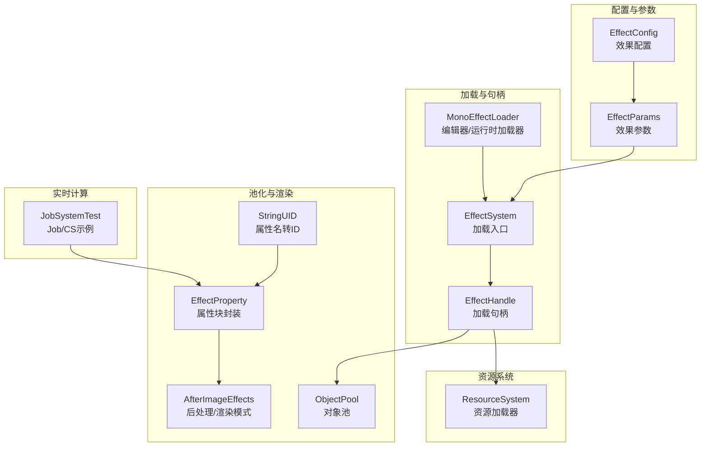
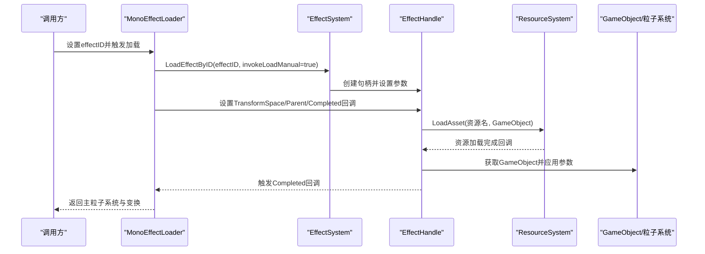
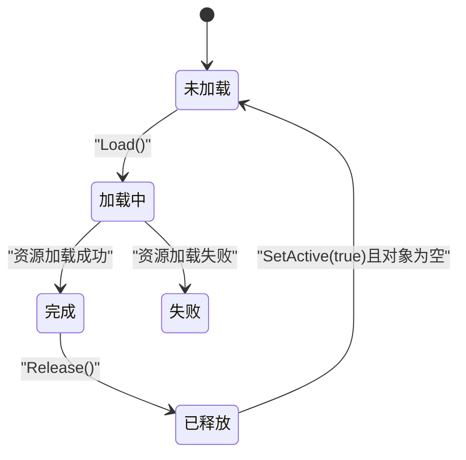
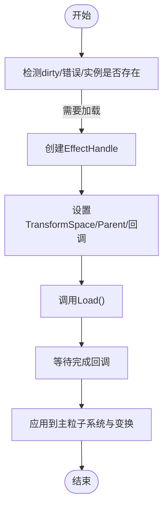
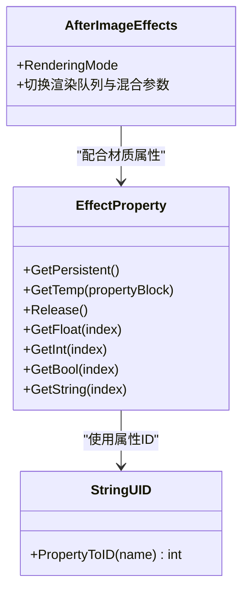
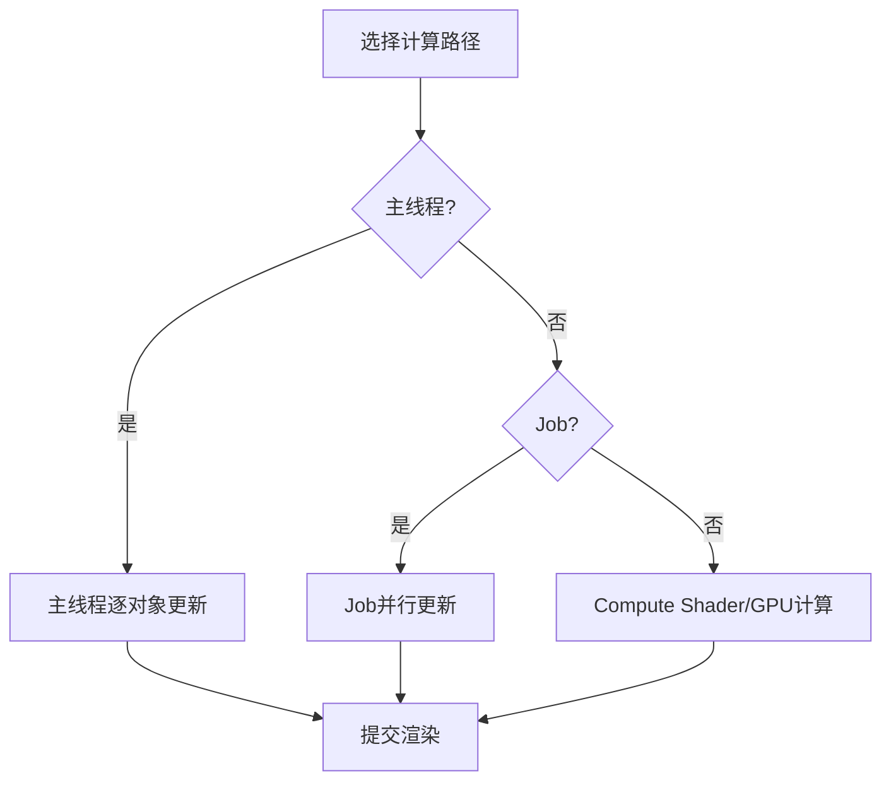
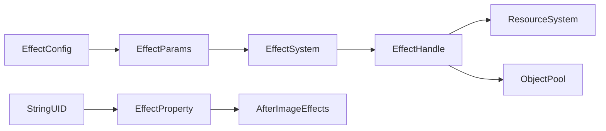

# 特效系统

<cite>
**本文引用的文件**
- [EffectSystem.cs](file://Assets/Scripts/Systems/Implement/EffectSystem/EffectSystem.cs)
- [EffectSystem.Handle.cs](file://Assets/Scripts/Systems/Implement/EffectSystem/EffectSystem.Handle.cs)
- [MonoEffectLoader.cs](file://Assets/Scripts/Systems/Implement/ResourceSystem/Mono/MonoEffectLoader.cs)
- [EffectConfig.cs](file://Assets/Scripts/Systems/Implement/ConfigSystem/JsonConfigImpl/EffectConfig.cs)
- [ObjectPool.cs](file://Assets/Scripts/Core/ObjectPooling/ObjectPool.cs)
- [EffectProperty.cs](file://Assets/Dev/Scripts/Runtime/DataContext/PropertyBlock/EffectProperty.cs)
- [AfterImageEffects.cs](file://Assets/Scripts/Modules/Entity/MeshOperation/AfterImageEffects.cs)
- [StringUID.cs](file://Assets/Scripts/Core/StringUID.cs)
- [JobSystemTest.cs](file://Assets/Dev/Lab/Scripts/JobSystemTest.cs)
</cite>

## 目录
1. [简介](#简介)
2. [项目结构](#项目结构)
3. [核心组件](#核心组件)
4. [架构总览](#架构总览)
5. [详细组件分析](#详细组件分析)
6. [依赖关系分析](#依赖关系分析)
7. [性能考量](#性能考量)
8. [故障排查指南](#故障排查指南)
9. [结论](#结论)
10. [附录](#附录)

## 简介
本文件面向ProjectR项目的特效系统，系统性阐述特效的加载与管理、粒子系统与资源加载、GPU实例化与批处理思路、着色器属性块与后处理集成、以及生命周期与池化策略。文档同时提供粒子特效、爆炸效果、环境特效的实现参考路径，并给出扩展开发与性能优化建议。

## 项目结构
特效系统主要由以下模块构成：
- 效果配置与参数：通过配置表驱动效果资源名与池化参数；参数对象负责变换空间与父子关系应用。
- 加载器与句柄：统一的加载入口与异步加载流程，支持回调与完成事件。
- 资源系统：基于资源系统进行异步加载与生命周期管理。
- 对象池：通用对象池接口与实现，用于特效对象的复用与销毁控制。
- 渲染与后处理：材质渲染模式、属性块与临时持久化封装，以及后处理通道集成点。
- 实时计算：Job与Compute Shader示例，体现GPU侧实时计算思路（可迁移至特效数据更新）。

**图表来源**
- [EffectConfig.cs:1-101](file://Assets/Scripts/Systems/Implement/ConfigSystem/JsonConfigImpl/EffectConfig.cs#L1-L101)
- [EffectSystem.cs:1-91](file://Assets/Scripts/Systems/Implement/EffectSystem/EffectSystem.cs#L1-L91)
- [EffectSystem.Handle.cs:1-279](file://Assets/Scripts/Systems/Implement/EffectSystem/EffectSystem.Handle.cs#L1-L279)
- [MonoEffectLoader.cs:1-153](file://Assets/Scripts/Systems/Implement/ResourceSystem/Mono/MonoEffectLoader.cs#L1-L153)
- [ObjectPool.cs:1-179](file://Assets/Scripts/Core/ObjectPooling/ObjectPool.cs#L1-L179)
- [EffectProperty.cs:36-105](file://Assets/Dev/Scripts/Runtime/DataContext/PropertyBlock/EffectProperty.cs#L36-L105)
- [AfterImageEffects.cs:155-180](file://Assets/Scripts/Modules/Entity/MeshOperation/AfterImageEffects.cs#L155-L180)
- [StringUID.cs:1-30](file://Assets/Scripts/Core/StringUID.cs#L1-L30)
- [JobSystemTest.cs:41-262](file://Assets/Dev/Lab/Scripts/JobSystemTest.cs#L41-L262)

**章节来源**
- [EffectSystem.cs:1-91](file://Assets/Scripts/Systems/Implement/EffectSystem/EffectSystem.cs#L1-L91)
- [EffectSystem.Handle.cs:1-279](file://Assets/Scripts/Systems/Implement/EffectSystem/EffectSystem.Handle.cs#L1-L279)
- [MonoEffectLoader.cs:1-153](file://Assets/Scripts/Systems/Implement/ResourceSystem/Mono/MonoEffectLoader.cs#L1-L153)
- [EffectConfig.cs:1-101](file://Assets/Scripts/Systems/Implement/ConfigSystem/JsonConfigImpl/EffectConfig.cs#L1-L101)
- [ObjectPool.cs:1-179](file://Assets/Scripts/Core/ObjectPooling/ObjectPool.cs#L1-L179)
- [EffectProperty.cs:36-105](file://Assets/Dev/Scripts/Runtime/DataContext/PropertyBlock/EffectProperty.cs#L36-L105)
- [AfterImageEffects.cs:155-180](file://Assets/Scripts/Modules/Entity/MeshOperation/AfterImageEffects.cs#L155-L180)
- [StringUID.cs:1-30](file://Assets/Scripts/Core/StringUID.cs#L1-L30)
- [JobSystemTest.cs:41-262](file://Assets/Dev/Lab/Scripts/JobSystemTest.cs#L41-L262)

## 核心组件
- 效果配置与参数
  - 配置项包含ID、资源名、是否可池化、池大小等字段，提供按ID或资源名查询能力。
  - 参数对象封装变换空间（本地/世界）、父节点、位置/旋转/缩放、回调等，支持ApplyTransform将参数应用到目标对象。
- 加载系统
  - 统一的加载入口支持按ID、名称、配置加载，返回可枚举的句柄，支持手动触发Load与回调。
  - 句柄内部维护状态机（未加载/加载中/完成/释放/失败），并持有GameObject与主粒子系统引用。
- 加载器
  - MonoEffectLoader在编辑器与运行时均可加载特效，支持预览与脏标记刷新，完成后回写主粒子系统与变换。
- 对象池
  - 提供通用对象池接口与实现，支持最大容量、回收检查、销毁回调等，便于特效对象池化。
- 属性块与渲染
  - EffectProperty封装了PropertyBlock的持久化与临时使用方式，配合AfterImageEffects的渲染模式切换，实现透明/不透明/裁剪等渲染队列与混合参数。
- 实时计算
  - JobSystemTest展示了Job与Compute Shader的思路，可用于将粒子数据或特效参数的计算迁移至GPU侧。

**章节来源**
- [EffectConfig.cs:10-33](file://Assets/Scripts/Systems/Implement/ConfigSystem/JsonConfigImpl/EffectConfig.cs#L10-L33)
- [EffectSystem.Handle.cs:10-44](file://Assets/Scripts/Systems/Implement/EffectSystem/EffectSystem.Handle.cs#L10-L44)
- [EffectSystem.Handle.cs:174-277](file://Assets/Scripts/Systems/Implement/EffectSystem/EffectSystem.Handle.cs#L174-L277)
- [MonoEffectLoader.cs:12-106](file://Assets/Scripts/Systems/Implement/ResourceSystem/Mono/MonoEffectLoader.cs#L12-L106)
- [ObjectPool.cs:88-179](file://Assets/Scripts/Core/ObjectPooling/ObjectPool.cs#L88-L179)
- [EffectProperty.cs:36-105](file://Assets/Dev/Scripts/Runtime/DataContext/PropertyBlock/EffectProperty.cs#L36-L105)
- [AfterImageEffects.cs:155-180](file://Assets/Scripts/Modules/Entity/MeshOperation/AfterImageEffects.cs#L155-L180)
- [JobSystemTest.cs:41-262](file://Assets/Dev/Lab/Scripts/JobSystemTest.cs#L41-L262)

## 架构总览
特效系统采用“配置驱动 + 句柄式加载 + 资源系统 + 池化”的分层架构。加载器负责将配置转换为句柄，句柄通过资源系统异步加载特效资源，完成后回调上层逻辑；渲染阶段通过属性块与材质参数实现动态控制；后处理与渲染模式在模块中提供集成点。

**图表来源**
- [MonoEffectLoader.cs:66-106](file://Assets/Scripts/Systems/Implement/ResourceSystem/Mono/MonoEffectLoader.cs#L66-L106)
- [EffectSystem.cs:14-39](file://Assets/Scripts/Systems/Implement/EffectSystem/EffectSystem.cs#L14-L39)
- [EffectSystem.Handle.cs:79-100](file://Assets/Scripts/Systems/Implement/EffectSystem/EffectSystem.Handle.cs#L79-L100)

## 详细组件分析

### 效果系统与句柄
- 句柄状态机：None → Loading → Done/Released/Failed，支持IsDone判断与作为IEnumerator的MoveNext。
- 参数应用：ApplyTransform根据TransformSpace将父节点、位置、旋转、缩放应用到目标对象。
- 生命周期：SetParent/transformSpace/position/rotation/scale等属性变更会即时应用到对象；Release会释放句柄持有的对象引用。

**图表来源**
- [EffectSystem.Handle.cs:13-21](file://Assets/Scripts/Systems/Implement/EffectSystem/EffectSystem.Handle.cs#L13-L21)
- [EffectSystem.Handle.cs:139-158](file://Assets/Scripts/Systems/Implement/EffectSystem/EffectSystem.Handle.cs#L139-L158)

**章节来源**
- [EffectSystem.Handle.cs:10-173](file://Assets/Scripts/Systems/Implement/EffectSystem/EffectSystem.Handle.cs#L10-L173)

### 加载器与配置
- 加载器职责：接收effectID，创建EffectHandle，设置TransformSpace与父节点，注册完成回调，触发Load。
- 预览与编辑器支持：在编辑器下生成预览实例并模拟粒子系统播放。
- 配置解析：通过EffectConfig按ID获取配置项，包含资源名、池化开关与池大小。

**图表来源**
- [MonoEffectLoader.cs:56-106](file://Assets/Scripts/Systems/Implement/ResourceSystem/Mono/MonoEffectLoader.cs#L56-L106)
- [EffectConfig.cs:79-98](file://Assets/Scripts/Systems/Implement/ConfigSystem/JsonConfigImpl/EffectConfig.cs#L79-L98)

**章节来源**
- [MonoEffectLoader.cs:12-153](file://Assets/Scripts/Systems/Implement/ResourceSystem/Mono/MonoEffectLoader.cs#L12-L153)
- [EffectConfig.cs:10-33](file://Assets/Scripts/Systems/Implement/ConfigSystem/JsonConfigImpl/EffectConfig.cs#L10-L33)

### 渲染管线与后处理集成
- 材质渲染模式：AfterImageEffects通过切换混合参数与渲染队列实现不透明、裁剪、淡入、透明等渲染模式。
- 属性块：EffectProperty封装了PropertyBlock的持久化与临时使用，支持Get/Set Float/Int/Bool/String，便于在运行时动态修改材质属性。
- 属性名到ID映射：StringUID提供字符串属性名到唯一ID的映射，减少重复查找开销。

**图表来源**
- [EffectProperty.cs:36-105](file://Assets/Dev/Scripts/Runtime/DataContext/PropertyBlock/EffectProperty.cs#L36-L105)
- [AfterImageEffects.cs:155-180](file://Assets/Scripts/Modules/Entity/MeshOperation/AfterImageEffects.cs#L155-L180)
- [StringUID.cs:14-28](file://Assets/Scripts/Core/StringUID.cs#L14-L28)

**章节来源**
- [EffectProperty.cs:36-105](file://Assets/Dev/Scripts/Runtime/DataContext/PropertyBlock/EffectProperty.cs#L36-L105)
- [AfterImageEffects.cs:155-180](file://Assets/Scripts/Modules/Entity/MeshOperation/AfterImageEffects.cs#L155-L180)
- [StringUID.cs:14-28](file://Assets/Scripts/Core/StringUID.cs#L14-L28)

### 实时计算与GPU实例化思路
- Job与Compute Shader：JobSystemTest展示了在主线程、Job与Compute Shader之间切换的思路，可用于将粒子或特效参数的计算迁移至GPU侧，降低CPU压力。
- GPU实例化：当前仓库未直接出现GPU Instancing的特效实现，但可通过属性块与批处理渲染思路结合，将大量相似特效合并绘制；若需实例化，可在着色器中使用实例属性并通过批处理提交。

**图表来源**
- [JobSystemTest.cs:57-82](file://Assets/Dev/Lab/Scripts/JobSystemTest.cs#L57-L82)
- [JobSystemTest.cs:257-262](file://Assets/Dev/Lab/Scripts/JobSystemTest.cs#L257-L262)

**章节来源**
- [JobSystemTest.cs:41-262](file://Assets/Dev/Lab/Scripts/JobSystemTest.cs#L41-L262)

## 依赖关系分析
- 配置依赖：EffectParams.Config依赖EffectConfig按ID或名称解析配置项。
- 加载依赖：EffectHandle依赖ResourceSystem进行异步加载，完成后回调上层。
- 渲染依赖：AfterImageEffects与EffectProperty共同决定材质渲染模式与属性传递。
- 池化依赖：ObjectPool提供对象池化能力，可与EffectHandle结合实现特效对象复用。

**图表来源**
- [EffectConfig.cs:79-98](file://Assets/Scripts/Systems/Implement/ConfigSystem/JsonConfigImpl/EffectConfig.cs#L79-L98)
- [EffectSystem.Handle.cs:41-50](file://Assets/Scripts/Systems/Implement/EffectSystem/EffectSystem.Handle.cs#L41-L50)
- [EffectProperty.cs:68-86](file://Assets/Dev/Scripts/Runtime/DataContext/PropertyBlock/EffectProperty.cs#L68-L86)
- [AfterImageEffects.cs:155-180](file://Assets/Scripts/Modules/Entity/MeshOperation/AfterImageEffects.cs#L155-L180)
- [StringUID.cs:14-28](file://Assets/Scripts/Core/StringUID.cs#L14-L28)

**章节来源**
- [EffectConfig.cs:79-98](file://Assets/Scripts/Systems/Implement/ConfigSystem/JsonConfigImpl/EffectConfig.cs#L79-L98)
- [EffectSystem.Handle.cs:41-50](file://Assets/Scripts/Systems/Implement/EffectSystem/EffectSystem.Handle.cs#L41-L50)
- [EffectProperty.cs:68-86](file://Assets/Dev/Scripts/Runtime/DataContext/PropertyBlock/EffectProperty.cs#L68-L86)
- [AfterImageEffects.cs:155-180](file://Assets/Scripts/Modules/Entity/MeshOperation/AfterImageEffects.cs#L155-L180)
- [StringUID.cs:14-28](file://Assets/Scripts/Core/StringUID.cs#L14-L28)

## 性能考量
- 异步加载与回调：通过EffectHandle的异步加载与回调机制，避免阻塞主线程，提升启动与切换特效时的流畅度。
- 对象池化：利用ObjectPool限制特效对象数量，避免频繁GC；结合EffectConfig中的PoolSize与Poolable字段，合理配置池大小。
- 属性块与批处理：通过EffectProperty集中管理材质属性，减少材质切换；在着色器端尽量使用属性块与批处理渲染，降低Draw Call。
- 渲染模式：AfterImageEffects提供了多种渲染模式与队列设置，应根据特效需求选择合适的混合与Z写策略，避免不必要的深度/混合开销。
- 实时计算：JobSystemTest展示了将计算迁移至GPU的思路，可考虑将粒子生命周期、位移、缩放等计算放入Compute Shader，进一步降低CPU负载。

[本节为通用性能指导，无需特定文件引用]

## 故障排查指南
- 加载失败
  - 现象：EffectHandle状态为Failed，错误信息输出。
  - 排查：确认EffectConfig中是否存在对应ID的配置；检查资源名是否正确；查看ResourceSystem加载日志。
- 回调异常
  - 现象：完成回调抛出异常。
  - 排查：检查EffectHandle内部对回调的捕获与日志输出，定位具体异常位置。
- 编辑器预览问题
  - 现象：编辑器下预览不更新或重置。
  - 排查：确认MonoEffectLoader的Editor_Update中是否正确调用Simulate；检查Editor_GenPreviewInstance是否生成了子粒子系统。

**章节来源**
- [EffectSystem.Handle.cs:45-76](file://Assets/Scripts/Systems/Implement/EffectSystem/EffectSystem.Handle.cs#L45-L76)
- [MonoEffectLoader.cs:108-150](file://Assets/Scripts/Systems/Implement/ResourceSystem/Mono/MonoEffectLoader.cs#L108-L150)

## 结论
ProjectR特效系统以配置驱动与句柄式加载为核心，结合资源系统与对象池，实现了特效的异步加载、生命周期管理与渲染集成。通过属性块与后处理模块，系统具备良好的动态控制与渲染灵活性。未来可在GPU实例化、批处理渲染与实时计算方面进一步优化，以满足更高性能需求。

[本节为总结性内容，无需特定文件引用]

## 附录

### 实现示例参考路径
- 粒子特效
  - 加载入口：[EffectSystem.cs:14-39](file://Assets/Scripts/Systems/Implement/EffectSystem/EffectSystem.cs#L14-L39)
  - 句柄加载与回调：[EffectSystem.Handle.cs:79-100](file://Assets/Scripts/Systems/Implement/EffectSystem/EffectSystem.Handle.cs#L79-L100)
  - 加载器使用：[MonoEffectLoader.cs:66-106](file://Assets/Scripts/Systems/Implement/ResourceSystem/Mono/MonoEffectLoader.cs#L66-L106)
- 爆炸效果
  - 可参考粒子系统参数与属性块设置，结合AfterImageEffects的渲染模式实现不同阶段的视觉表现。
  - 属性块持久化/临时使用：[EffectProperty.cs:68-86](file://Assets/Dev/Scripts/Runtime/DataContext/PropertyBlock/EffectProperty.cs#L68-L86)
- 环境特效
  - 可通过EffectConfig配置池化参数，结合ObjectPool实现环境特效的批量复用与回收。
  - 对象池接口与实现：[ObjectPool.cs:88-179](file://Assets/Scripts/Core/ObjectPooling/ObjectPool.cs#L88-L179)

### 扩展开发指南
- 添加新特效类型
  - 在EffectConfig中新增配置项，填写ID、资源名、池化开关与池大小。
  - 在场景中使用MonoEffectLoader挂载新特效，设置effectID即可加载。
- 自定义着色器效果
  - 使用EffectProperty封装材质属性，通过StringUID获取属性ID，减少查找成本。
  - 在AfterImageEffects中选择合适的渲染模式与队列，确保与特效视觉一致。
- 性能优化建议
  - 合理设置池大小与回收策略，避免频繁创建销毁。
  - 将计算密集型逻辑迁移至Job或Compute Shader，减少每帧CPU占用。
  - 使用属性块与批处理渲染，减少材质切换与Draw Call。

**章节来源**
- [EffectConfig.cs:10-33](file://Assets/Scripts/Systems/Implement/ConfigSystem/JsonConfigImpl/EffectConfig.cs#L10-L33)
- [MonoEffectLoader.cs:12-106](file://Assets/Scripts/Systems/Implement/ResourceSystem/Mono/MonoEffectLoader.cs#L12-L106)
- [EffectProperty.cs:68-105](file://Assets/Dev/Scripts/Runtime/DataContext/PropertyBlock/EffectProperty.cs#L68-L105)
- [AfterImageEffects.cs:155-180](file://Assets/Scripts/Modules/Entity/MeshOperation/AfterImageEffects.cs#L155-L180)
- [ObjectPool.cs:88-179](file://Assets/Scripts/Core/ObjectPooling/ObjectPool.cs#L88-L179)
- [StringUID.cs:14-28](file://Assets/Scripts/Core/StringUID.cs#L14-L28)
- [JobSystemTest.cs:41-262](file://Assets/Dev/Lab/Scripts/JobSystemTest.cs#L41-L262)