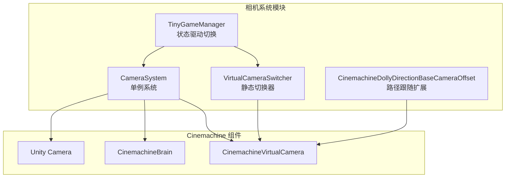
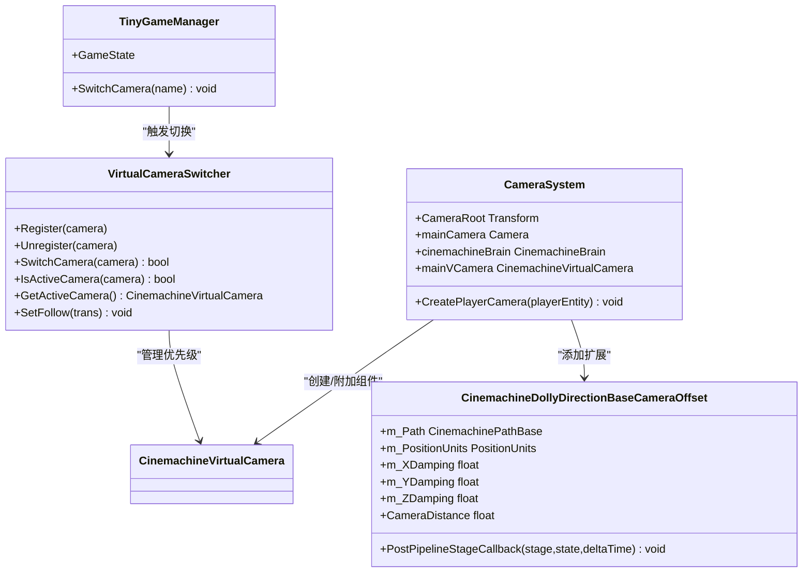
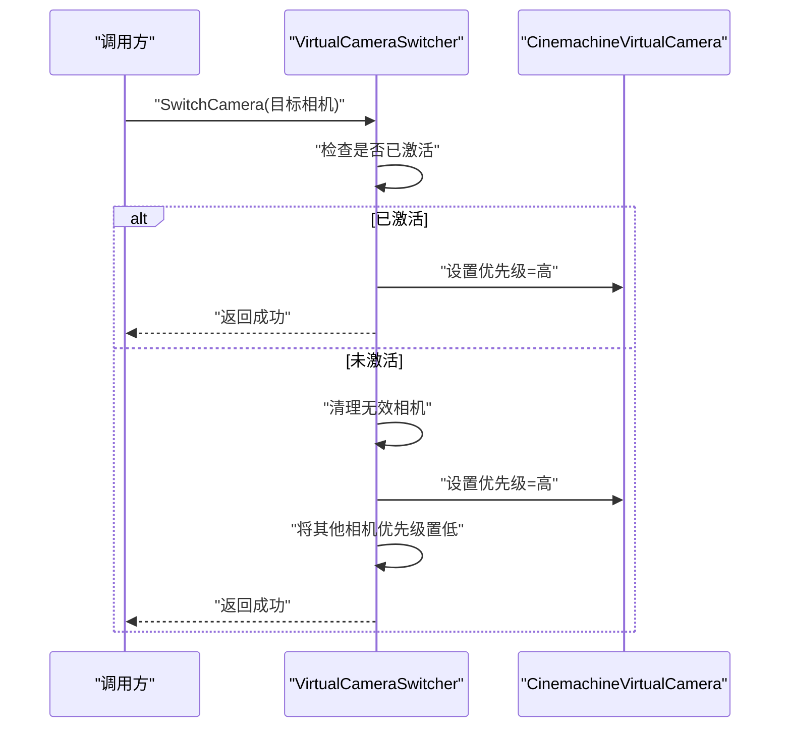
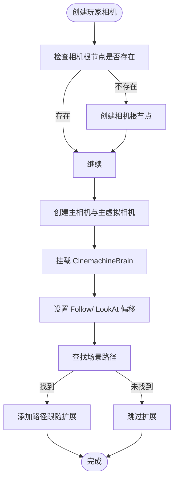
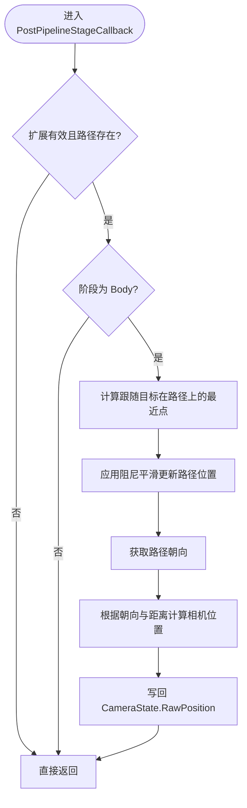
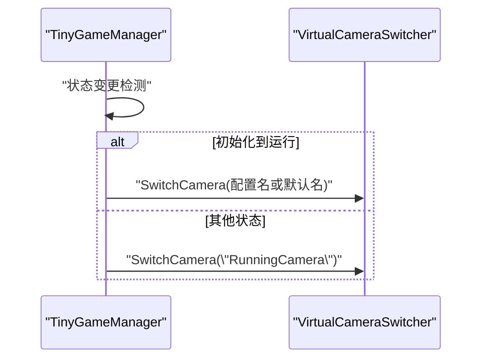
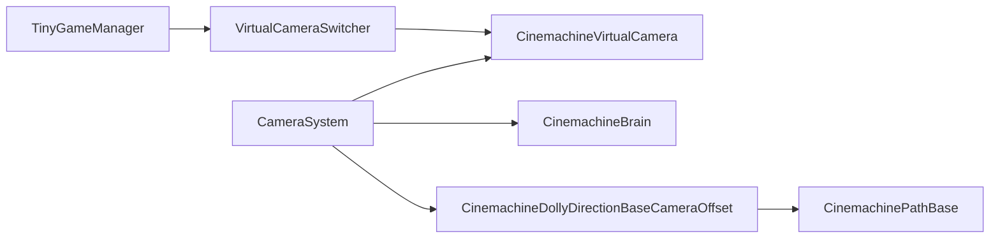

# 相机系统

<cite>
**本文引用的文件**
- [VirtualCameraSwitcher.cs](file://Assets/Scripts/Camera/VirtualCameraSwitcher.cs)
- [CameraSystem.cs](file://Assets/Scripts/Systems/Implement/CameraSystem/CameraSystem.cs)
- [CameraSystem.Funcs.cs](file://Assets/Scripts/Systems/Implement/CameraSystem/CameraSystem.Funcs.cs)
- [ConemachineTrackDirectionBaseCameraOffset.cs](file://Assets/Scripts/Camera/CinemachineExtension/ConemachineTrackDirectionBaseCameraOffset.cs)
- [TinyGameManager.cs](file://Assets/Scripts/Game/Manager/TinyGameManager.cs)
</cite>

## 目录
1. [简介](#简介)
2. [项目结构](#项目结构)
3. [核心组件](#核心组件)
4. [架构总览](#架构总览)
5. [详细组件分析](#详细组件分析)
6. [依赖关系分析](#依赖关系分析)
7. [性能考虑](#性能考虑)
8. [故障排查指南](#故障排查指南)
9. [结论](#结论)
10. [附录：扩展与实践指南](#附录扩展与实践指南)

## 简介
本文件面向 ProjectR 的相机系统，系统基于 Cinemachine 虚拟相机框架构建，提供虚拟相机注册与切换、跟随目标统一设置、路径跟随扩展以及运行时相机状态管理能力。本文将从架构设计、实现原理、数据流与处理逻辑入手，逐步展开到多相机切换策略、平滑过渡思路、性能优化建议、扩展开发指南与调试可视化要点。

## 项目结构
围绕相机系统的关键代码分布如下：
- 相机切换与跟随管理：Assets/Scripts/Camera/VirtualCameraSwitcher.cs
- 相机系统单例与功能扩展：Assets/Scripts/Systems/Implement/CameraSystem/
  - 相机系统主类：Assets/Scripts/Systems/Implement/CameraSystem/CameraSystem.cs
  - 相机创建与挂载：Assets/Scripts/Systems/Implement/CameraSystem/CameraSystem.Funcs.cs
- 自定义 Cinemachine 扩展：Assets/Scripts/Camera/CinemachineExtension/ConemachineTrackDirectionBaseCameraOffset.cs
- 运行时相机切换触发：Assets/Scripts/Game/Manager/TinyGameManager.cs

图表来源
- [VirtualCameraSwitcher.cs:1-74](file://Assets/Scripts/Camera/VirtualCameraSwitcher.cs#L1-L74)
- [CameraSystem.cs:1-82](file://Assets/Scripts/Systems/Implement/CameraSystem/CameraSystem.cs#L1-L82)
- [CameraSystem.Funcs.cs:1-82](file://Assets/Scripts/Systems/Implement/CameraSystem/CameraSystem.Funcs.cs#L1-L82)
- [ConemachineTrackDirectionBaseCameraOffset.cs:1-122](file://Assets/Scripts/Camera/CinemachineExtension/ConemachineTrackDirectionBaseCameraOffset.cs#L1-L122)
- [TinyGameManager.cs:260-335](file://Assets/Scripts/Game/Manager/TinyGameManager.cs#L260-L335)

章节来源
- [VirtualCameraSwitcher.cs:1-74](file://Assets/Scripts/Camera/VirtualCameraSwitcher.cs#L1-L74)
- [CameraSystem.cs:1-82](file://Assets/Scripts/Systems/Implement/CameraSystem/CameraSystem.cs#L1-L82)
- [CameraSystem.Funcs.cs:1-82](file://Assets/Scripts/Systems/Implement/CameraSystem/CameraSystem.Funcs.cs#L1-L82)
- [ConemachineTrackDirectionBaseCameraOffset.cs:1-122](file://Assets/Scripts/Camera/CinemachineExtension/ConemachineTrackDirectionBaseCameraOffset.cs#L1-L122)
- [TinyGameManager.cs:260-335](file://Assets/Scripts/Game/Manager/TinyGameManager.cs#L260-L335)

## 核心组件
- 虚拟相机切换器（VirtualCameraSwitcher）
  - 提供相机注册、注销、激活切换、当前激活相机查询与统一跟随目标设置等能力。
  - 通过优先级控制实现“一强多弱”的相机切换策略。
- 相机系统（CameraSystem）
  - 单例系统，负责创建主相机与主虚拟相机，挂载 CinemachineBrain，并按需附加跟随与构图组件。
  - 提供相机创建流程与相机根节点管理。
- 路径跟随扩展（CinemachineDollyDirectionBaseCameraOffset）
  - 基于路径的相机跟随扩展，计算跟随目标在路径上的最近点并沿路径方向进行阻尼移动，同时根据路径朝向调整相机位置。
- 状态驱动切换（TinyGameManager）
  - 在游戏状态变化时触发相机切换，支持从初始化到运行态的镜头过渡。

章节来源
- [VirtualCameraSwitcher.cs:1-74](file://Assets/Scripts/Camera/VirtualCameraSwitcher.cs#L1-L74)
- [CameraSystem.cs:1-82](file://Assets/Scripts/Systems/Implement/CameraSystem/CameraSystem.cs#L1-L82)
- [CameraSystem.Funcs.cs:1-82](file://Assets/Scripts/Systems/Implement/CameraSystem/CameraSystem.Funcs.cs#L1-L82)
- [ConemachineTrackDirectionBaseCameraOffset.cs:1-122](file://Assets/Scripts/Camera/CinemachineExtension/ConemachineTrackDirectionBaseCameraOffset.cs#L1-L122)
- [TinyGameManager.cs:260-335](file://Assets/Scripts/Game/Manager/TinyGameManager.cs#L260-L335)

## 架构总览
相机系统采用“单例系统 + 静态切换器 + 自定义扩展”的分层设计：
- 单例系统负责相机生命周期与场景内相机装配（创建主相机、主虚拟相机、附加组件、路径跟随扩展）。
- 静态切换器负责多虚拟相机的注册与优先级切换，保证同一帧只有一个激活相机。
- 自定义扩展在 Cinemachine 管线阶段对相机位姿进行修正，实现路径跟随与朝向约束。
- 状态管理器在游戏状态变化时驱动相机切换，形成“状态 → 切换”的闭环。

图表来源
- [VirtualCameraSwitcher.cs:1-74](file://Assets/Scripts/Camera/VirtualCameraSwitcher.cs#L1-L74)
- [CameraSystem.cs:1-82](file://Assets/Scripts/Systems/Implement/CameraSystem/CameraSystem.cs#L1-L82)
- [CameraSystem.Funcs.cs:1-82](file://Assets/Scripts/Systems/Implement/CameraSystem/CameraSystem.Funcs.cs#L1-L82)
- [ConemachineTrackDirectionBaseCameraOffset.cs:1-122](file://Assets/Scripts/Camera/CinemachineExtension/ConemachineTrackDirectionBaseCameraOffset.cs#L1-L122)
- [TinyGameManager.cs:260-335](file://Assets/Scripts/Game/Manager/TinyGameManager.cs#L260-L335)

## 详细组件分析

### 虚拟相机切换器（VirtualCameraSwitcher）
- 注册/注销：维护相机列表，清理无效引用，避免空引用导致异常。
- 切换策略：若目标相机已是激活相机，则提升其优先级；否则将目标相机优先级置高，其他相机优先级置低，确保唯一激活。
- 统一跟随：遍历所有已注册相机，将其 Follow 目标设为同一 Transform，便于全局跟随切换。

图表来源
- [VirtualCameraSwitcher.cs:32-50](file://Assets/Scripts/Camera/VirtualCameraSwitcher.cs#L32-L50)

章节来源
- [VirtualCameraSwitcher.cs:1-74](file://Assets/Scripts/Camera/VirtualCameraSwitcher.cs#L1-L74)

### 相机系统（CameraSystem）
- 创建主相机与主虚拟相机：在场景中生成 Camera 与 CinemachineVirtualCamera，并挂载 CinemachineBrain。
- 跟随与构图：为主虚拟相机绑定跟随与构图组件，设置跟随偏移与跟踪偏移。
- 路径跟随扩展：在场景存在指定路径时，为主虚拟相机附加自定义扩展，使其沿路径移动并保持朝向。
- 相机根节点：统一管理相机对象的父节点，便于场景组织。

图表来源
- [CameraSystem.Funcs.cs:16-65](file://Assets/Scripts/Systems/Implement/CameraSystem/CameraSystem.Funcs.cs#L16-L65)

章节来源
- [CameraSystem.cs:1-82](file://Assets/Scripts/Systems/Implement/CameraSystem/CameraSystem.cs#L1-L82)
- [CameraSystem.Funcs.cs:1-82](file://Assets/Scripts/Systems/Implement/CameraSystem/CameraSystem.Funcs.cs#L1-L82)

### 自定义路径跟随扩展（CinemachineDollyDirectionBaseCameraOffset）
- 功能概述：在 Body 阶段根据跟随目标在路径上的最近点，沿路径方向进行阻尼平滑移动，并依据路径朝向调整相机位置。
- 关键参数：路径、位置单位、搜索半径与分辨率、XYZ 阻尼系数、相机距离等。
- 实现要点：标准化路径单位、处理环形路径的最短路径选择、阻尼平滑更新路径位置，最终修正 CameraState 的 RawPosition。

图表来源
- [ConemachineTrackDirectionBaseCameraOffset.cs:59-120](file://Assets/Scripts/Camera/CinemachineExtension/ConemachineTrackDirectionBaseCameraOffset.cs#L59-L120)

章节来源
- [ConemachineTrackDirectionBaseCameraOffset.cs:1-122](file://Assets/Scripts/Camera/CinemachineExtension/ConemachineTrackDirectionBaseCameraOffset.cs#L1-L122)

### 状态驱动的相机切换（TinyGameManager）
- 触发时机：在游戏状态从 Initialize 变更为 Running 时，根据配置或默认名称切换到指定相机。
- 切换方式：通过字符串名称或索引调用切换器执行切换，确保运行态有合适的镜头。

图表来源
- [TinyGameManager.cs:260-276](file://Assets/Scripts/Game/Manager/TinyGameManager.cs#L260-L276)

章节来源
- [TinyGameManager.cs:260-335](file://Assets/Scripts/Game/Manager/TinyGameManager.cs#L260-L335)

## 依赖关系分析
- VirtualCameraSwitcher 依赖 CinemachineVirtualCamera，通过优先级实现多相机切换。
- CameraSystem 依赖 Unity Camera、CinemachineVirtualCamera、CinemachineBrain 与自定义扩展，负责相机装配与路径绑定。
- ConemachineTrackDirectionBaseCameraOffset 依赖 CinemachinePathBase 与 Damper 工具，参与 Body 阶段管线。
- TinyGameManager 依赖 VirtualCameraSwitcher，作为外部状态驱动源。

图表来源
- [VirtualCameraSwitcher.cs:1-74](file://Assets/Scripts/Camera/VirtualCameraSwitcher.cs#L1-L74)
- [CameraSystem.cs:1-82](file://Assets/Scripts/Systems/Implement/CameraSystem/CameraSystem.cs#L1-L82)
- [CameraSystem.Funcs.cs:1-82](file://Assets/Scripts/Systems/Implement/CameraSystem/CameraSystem.Funcs.cs#L1-L82)
- [ConemachineTrackDirectionBaseCameraOffset.cs:1-122](file://Assets/Scripts/Camera/CinemachineExtension/ConemachineTrackDirectionBaseCameraOffset.cs#L1-L122)
- [TinyGameManager.cs:260-335](file://Assets/Scripts/Game/Manager/TinyGameManager.cs#L260-L335)

章节来源
- [VirtualCameraSwitcher.cs:1-74](file://Assets/Scripts/Camera/VirtualCameraSwitcher.cs#L1-L74)
- [CameraSystem.cs:1-82](file://Assets/Scripts/Systems/Implement/CameraSystem/CameraSystem.cs#L1-L82)
- [CameraSystem.Funcs.cs:1-82](file://Assets/Scripts/Systems/Implement/CameraSystem/CameraSystem.Funcs.cs#L1-L82)
- [ConemachineTrackDirectionBaseCameraOffset.cs:1-122](file://Assets/Scripts/Camera/CinemachineExtension/ConemachineTrackDirectionBaseCameraOffset.cs#L1-L122)
- [TinyGameManager.cs:260-335](file://Assets/Scripts/Game/Manager/TinyGameManager.cs#L260-L335)

## 性能考虑
- 相机裁剪与视锥剔除
  - 使用 Unity Camera 的 cullingMask 与 layer 控制渲染剔除范围，减少无关对象的绘制。
  - 合理设置远近裁剪面，避免不必要的深度缓冲开销。
- 渲染优化
  - 将 UI 相机与游戏相机分离，避免 UI 对游戏相机管线造成额外负担。
  - 在相机切换瞬间对 UI 相机进行一次禁用/启用操作，可缓解某些平台上的渲染抖动问题（见相机系统实现中的相关处理）。
- 路径跟随与阻尼
  - 调整阻尼系数与搜索半径，平衡平滑度与响应速度，避免过度计算导致帧时间上升。
  - 对环形路径的最短路径判断仅在必要时进行，减少重复计算。
- 多相机切换
  - 通过优先级控制确保单一激活相机，避免多相机同时计算带来的性能浪费。
  - 在切换前后清理无效引用，防止列表膨胀影响遍历效率。

## 故障排查指南
- 相机不生效或黑屏
  - 检查主相机与主虚拟相机是否正确创建并挂载 CinemachineBrain。
  - 确认主虚拟相机的 Follow/ LookAt 是否指向有效目标。
- 相机切换无效
  - 确认目标相机已通过切换器注册，且未被清理。
  - 检查切换器是否正确设置目标相机优先级，并将其他相机优先级置低。
- 路径跟随异常
  - 确认场景中存在指定路径，且路径组件有效。
  - 检查扩展参数（阻尼、搜索半径、单位）是否合理。
- UI 相机闪烁
  - 若出现 UI 相机在启动瞬间消失再恢复的情况，可参考相机系统实现中的禁用/启用操作进行修复。

章节来源
- [CameraSystem.Funcs.cs:16-65](file://Assets/Scripts/Systems/Implement/CameraSystem/CameraSystem.Funcs.cs#L16-L65)
- [VirtualCameraSwitcher.cs:32-50](file://Assets/Scripts/Camera/VirtualCameraSwitcher.cs#L32-L50)
- [ConemachineTrackDirectionBaseCameraOffset.cs:59-120](file://Assets/Scripts/Camera/CinemachineExtension/ConemachineTrackDirectionBaseCameraOffset.cs#L59-L120)

## 结论
ProjectR 的相机系统以 Cinemachine 为核心，结合单例系统、静态切换器与自定义扩展，实现了稳定的虚拟相机管理、统一的跟随目标设置与路径跟随能力。通过优先级控制与状态驱动切换，系统在多相机场景下具备良好的可控性与可维护性。配合合理的渲染与路径跟随参数，可在保证视觉质量的同时兼顾性能表现。

## 附录：扩展与实践指南

### 添加新的相机模式
- 新增虚拟相机
  - 在场景中创建 CinemachineVirtualCamera，并为其附加所需组件（跟随、构图、阴影等）。
  - 通过切换器注册该相机，以便参与优先级切换。
- 设计新行为
  - 可在现有扩展基础上新增或组合新的 CinemachineExtension，参与不同管线阶段（Body/ Aim/ Finalize）。
  - 或在 CameraSystem 中扩展创建流程，自动附加新组件。

### 自定义相机行为
- 路径跟随增强
  - 在路径扩展中增加速度曲线、高度偏移、旋转约束等参数，满足不同场景需求。
- 平滑过渡策略
  - 当前切换为瞬时优先级变更。如需平滑过渡，可在切换器中引入混合器或淡入淡出逻辑，结合时间轴或动画曲线实现。
- 锁定目标与自由视角
  - 锁定目标：通过统一设置 Follow/ LookAt，使多个相机共享同一目标。
  - 自由视角：为特定相机禁用跟随组件，手动控制其变换，或在切换器中按需启用/禁用。

### 调试与可视化
- 相机轨迹可视化
  - 在场景中放置路径组件并命名规范（例如“Cameras/RaceCameraPath”），在相机系统中自动识别并绑定。
  - 使用 Unity 的 Scene 视图与 Gizmos 查看路径与相机朝向，辅助定位问题。
- 运行时调试
  - 在切换器中输出当前激活相机与优先级状态，便于快速定位切换异常。
  - 在路径扩展中临时开启日志输出，观察最近点计算与阻尼更新过程。