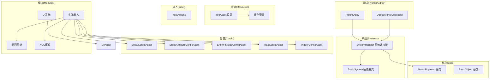
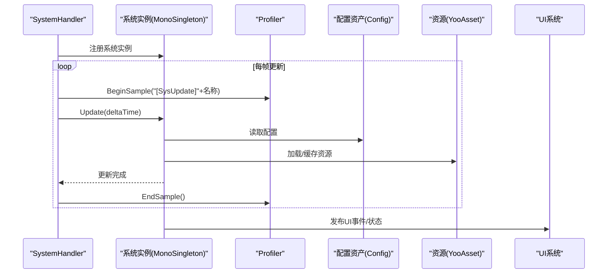
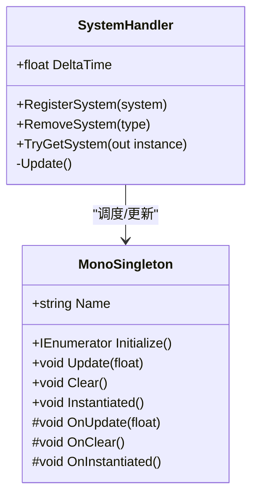
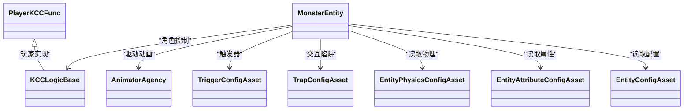
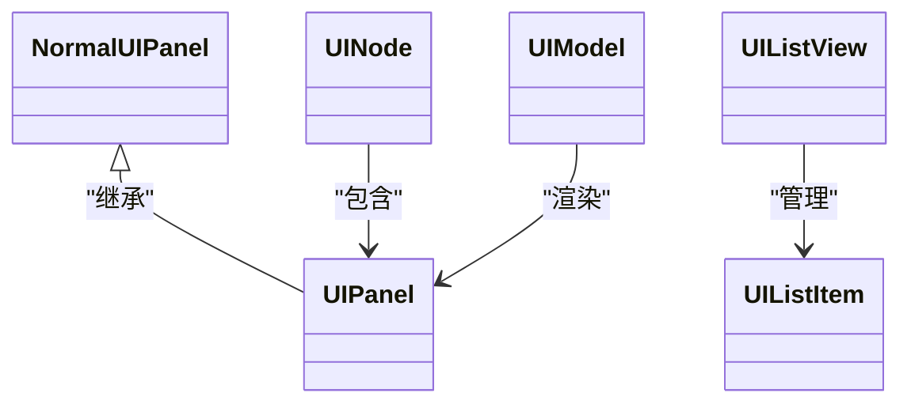
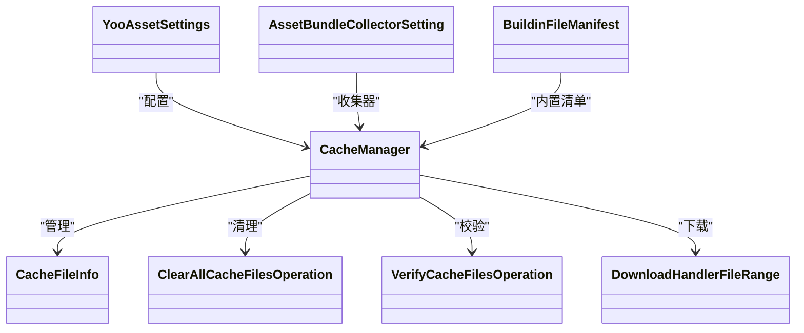
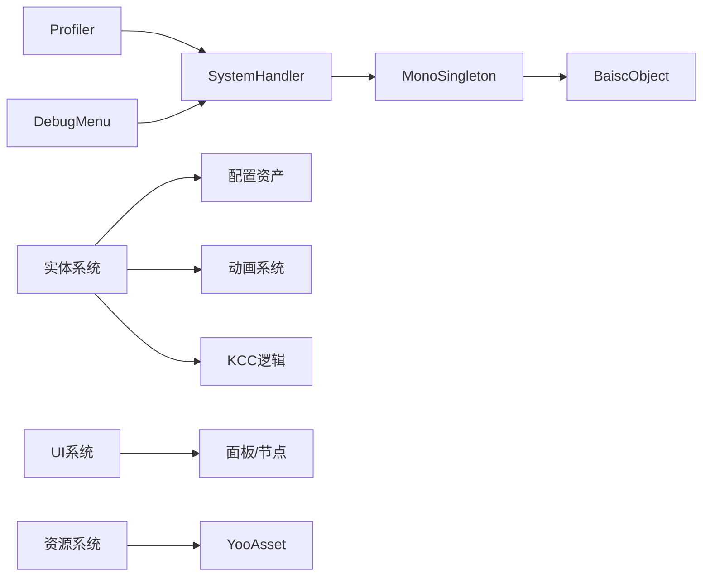

# 系统模块

<cite>
**本文引用的文件**   
- [SystemHandler.cs](file://Assets/Scripts/Systems/SystemHandler.cs)
- [MonoSingleton.cs](file://Assets/Scripts/Core/MonoSingleton.cs)
- [BaiscObject.cs](file://Assets/Scripts/Core/BaiscObject.cs)
- [StaticSystem.cs](file://Assets/Scripts/Systems/StaticSystem.cs)
- [EntityConfigAsset.cs](file://Assets/Scripts/Config/Entity/EntityConfigAsset.cs)
- [EntityAttributeConfigAsset.cs](file://Assets/Scripts/Config/Entity/EntityAttributeConfigAsset.cs)
- [EntityPhysicsConfigAsset.cs](file://Assets/Scripts/Config/Entity/EntityPhysicsConfigAsset.cs)
- [TrapConfigAsset.cs](file://Assets/Scripts/Config/Entity/Trap/TrapConfigAsset.cs)
- [TriggerConfigAsset.cs](file://Assets/Scripts/Config/Entity/TriggerConfigAsset.cs)
- [EntityDefine.cs](file://Assets/Scripts/Game/Define/EntityDefine.cs)
- [EntityAnimationDefine.cs](file://Assets/Scripts/Modules/Entity/EntityAnimationDefine.cs)
- [AnimatorAgency.cs](file://Assets/Scripts/Modules/Entity/Animation/AnimatorAgency.cs)
- [KCCLogicBase.cs](file://Assets/Scripts/Modules/Entity/KCC/KCCLogicBase.cs)
- [PlayerKCCFunc.cs](file://Assets/Scripts/Modules/Entity/KCC/PlayerKCCFunc.cs)
- [MonsterEntity.cs](file://Assets/Scripts/Modules/Enemy/MonsterEntity.cs)
- [UIPanel.cs](file://Assets/Scripts/UI/UIPanel.cs)
- [NormalUIPanel.cs](file://Assets/Scripts/UI/NormalUIPanel.cs)
- [UINode.cs](file://Assets/Scripts/UI/UINode.cs)
- [UIModel.cs](file://Assets/Scripts/UI/UIModel.cs)
- [UIListView.cs](file://Assets/Scripts/UI/UIListView.cs)
- [UIListItem.cs](file://Assets/Scripts/UI/UIListItem.cs)
- [ProfileUtility.cs](file://Assets/Scripts/Profiler/ProfileUtility.cs)
- [DebugMenu.cs](file://Assets/Scripts/RuntimeEditor/DebugMenu.cs)
- [DebugUtil.cs](file://Assets/Scripts/RuntimeEditor/DebugUtil.cs)
- [AssetModificationEventHandle.cs](file://Assets/Scripts/RuntimeEditor/AssetModificationEventHandle.cs)
- [EditorEventObserver.cs](file://Assets/Scripts/RuntimeEditor/EditorEventObserver.cs)
- [InputActions.cs](file://Assets/Common/InputActions.cs)
- [YooAssetSettings.asset](file://Assets/Resources/YooAssetSettings.asset)
- [AssetBundleCollectorSetting.asset](file://Assets/Resources/AssetBundleCollectorSetting.asset)
- [BuildinFileManifest.asset](file://Assets/Resources/BuildinFileManifest.asset)
- [CacheManager.cs](file://Assets/Plugins/com.tuyoogame.yooasset@2.1.2/Runtime/CacheSystem/CacheManager.cs)
- [CacheFileInfo.cs](file://Assets/Plugins/com.tuyoogame.yooasset@2.1.2/Runtime/CacheSystem/CacheFileInfo.cs)
- [ClearAllCacheFilesOperation.cs](file://Assets/Plugins/com.tuyoogame.yooasset@2.1.2/Runtime/CacheSystem/Operation/ClearAllCacheFilesOperation.cs)
- [VerifyCacheFilesOperation.cs](file://Assets/Plugins/com.tuyoogame.yooasset@2.1.2/Runtime/CacheSystem/Operation/Internal/VerifyCacheFilesOperation.cs)
- [DownloadHandlerFileRange.cs](file://Assets/Plugins/com.tuyoogame.yooasset@2.1.2/Runtime/DownloadSystem/Requester/DownloadHandlerFileRange.cs)
</cite>

## 目录
1. [引言](#引言)
2. [项目结构](#项目结构)
3. [核心组件](#核心组件)
4. [架构总览](#架构总览)
5. [详细组件分析](#详细组件分析)
6. [依赖关系分析](#依赖关系分析)
7. [性能考虑](#性能考虑)
8. [故障排查指南](#故障排查指南)
9. [结论](#结论)
10. [附录](#附录)

## 引言
本文件面向ProjectR项目的系统模块，系统性梳理并说明游戏引擎基础系统架构与核心模块的实现原理与使用方法，涵盖以下主题：
- 实体系统：实体定义、属性配置、动画与KCC（Kinematic Character Controller）逻辑
- UI系统：面板、节点、列表与模型抽象
- 配置系统：实体与陷阱等配置资产
- 资源系统：YooAsset资源管线与缓存策略
- 输入系统：Unity InputSystem动作绑定
- 场景系统：实体与场景配置宿主
- 系统协作：SystemHandler统一调度、MonoSingleton生命周期与事件更新
- 扩展开发：自定义系统组件创建与系统间通信最佳实践
- 性能监控与调试：Profiler、编辑器调试工具与故障诊断

## 项目结构
ProjectR采用“分层+模块化”的组织方式：
- Core层：通用对象池、单例基类、基础运行时对象
- Systems层：系统调度器SystemHandler与系统基类
- Config层：实体、陷阱、触发器等配置资产
- Modules层：实体、敌人、动画、KCC、UI等业务模块
- Game层：游戏定义与常量
- Profiler与RuntimeEditor：性能与调试工具
- Resources：YooAsset配置与清单

图表来源
- [SystemHandler.cs:1-71](file://Assets/Scripts/Systems/SystemHandler.cs#L1-L71)
- [MonoSingleton.cs:1-70](file://Assets/Scripts/Core/MonoSingleton.cs#L1-L70)
- [BaiscObject.cs:1-167](file://Assets/Scripts/Core/BaiscObject.cs#L1-L167)
- [StaticSystem.cs:1-8](file://Assets/Scripts/Systems/StaticSystem.cs#L1-L8)
- [EntityConfigAsset.cs](file://Assets/Scripts/Config/Entity/EntityConfigAsset.cs)
- [EntityAttributeConfigAsset.cs](file://Assets/Scripts/Config/Entity/EntityAttributeConfigAsset.cs)
- [EntityPhysicsConfigAsset.cs](file://Assets/Scripts/Config/Entity/EntityPhysicsConfigAsset.cs)
- [TrapConfigAsset.cs](file://Assets/Scripts/Config/Entity/Trap/TrapConfigAsset.cs)
- [TriggerConfigAsset.cs](file://Assets/Scripts/Config/Entity/TriggerConfigAsset.cs)
- [UIPanel.cs](file://Assets/Scripts/UI/UIPanel.cs)
- [YooAssetSettings.asset](file://Assets/Resources/YooAssetSettings.asset)
- [CacheManager.cs](file://Assets/Plugins/com.tuyoogame.yooasset@2.1.2/Runtime/CacheSystem/CacheManager.cs)

章节来源
- [SystemHandler.cs:1-71](file://Assets/Scripts/Systems/SystemHandler.cs#L1-L71)
- [MonoSingleton.cs:1-70](file://Assets/Scripts/Core/MonoSingleton.cs#L1-L70)
- [BaiscObject.cs:1-167](file://Assets/Scripts/Core/BaiscObject.cs#L1-L167)
- [StaticSystem.cs:1-8](file://Assets/Scripts/Systems/StaticSystem.cs#L1-L8)

## 核心组件
本节聚焦系统模块的关键基础设施与核心组件。

- MonoSingleton与MonoSingleton<T>
  - 提供全局单例获取、实例化、生命周期钩子（Instantiated/Update/Clear/OnDestroy）
  - 支持运行时DontDestroyOnLoad与编辑器模式下的生命周期管理
  - 通过Initialize提供异步初始化入口

- BaiscObject与BaiscObject<T>
  - 定义对象池化生命周期：Reset → Start → Update → Clear → Release
  - 内置状态机（None/Running/Released），支持生命周期计时
  - 提供泛型对象池封装，简化Get/Release流程

- SystemHandler
  - 统一调度所有注册的MonoSingleton系统实例
  - 编辑器下使用Profiler.BeginSample/EndSample标注系统更新耗时
  - 提供注册、移除、查询系统实例的能力

- StaticSystem
  - 抽象静态系统基类，用于无实例化的纯静态功能模块

章节来源
- [MonoSingleton.cs:1-70](file://Assets/Scripts/Core/MonoSingleton.cs#L1-L70)
- [BaiscObject.cs:1-167](file://Assets/Scripts/Core/BaiscObject.cs#L1-L167)
- [SystemHandler.cs:1-71](file://Assets/Scripts/Systems/SystemHandler.cs#L1-L71)
- [StaticSystem.cs:1-8](file://Assets/Scripts/Systems/StaticSystem.cs#L1-L8)

## 架构总览
系统模块以SystemHandler为中心，统一调度各系统；系统通过MonoSingleton基类获得一致的生命周期；业务模块（实体、UI、动画、KCC）基于配置资产进行构建；资源系统由YooAsset提供加载与缓存能力；输入系统通过InputActions提供动作绑定；调试与性能工具贯穿开发与测试阶段。

图表来源
- [SystemHandler.cs:50-68](file://Assets/Scripts/Systems/SystemHandler.cs#L50-L68)
- [MonoSingleton.cs:46-66](file://Assets/Scripts/Core/MonoSingleton.cs#L46-L66)
- [ProfileUtility.cs](file://Assets/Scripts/Profiler/ProfileUtility.cs)
- [YooAssetSettings.asset](file://Assets/Resources/YooAssetSettings.asset)

## 详细组件分析

### 系统调度器：SystemHandler
- 职责
  - 维护系统实例列表与类型到实例映射
  - 提供注册、移除、查询系统的方法
  - 每帧遍历并调用系统Update，支持编辑器Profiler采样
- 初始化与生命周期
  - 通过MonoSingleton基类的Instantiated/Update/Clear链路接入
  - 编辑器下自动Profiler标注，便于定位耗时系统
- 使用建议
  - 所有系统应继承MonoSingleton并注册到SystemHandler
  - 将昂贵操作拆分为多帧或延迟执行，避免单帧过长

图表来源
- [SystemHandler.cs:14-68](file://Assets/Scripts/Systems/SystemHandler.cs#L14-L68)
- [MonoSingleton.cs:46-66](file://Assets/Scripts/Core/MonoSingleton.cs#L46-L66)

章节来源
- [SystemHandler.cs:1-71](file://Assets/Scripts/Systems/SystemHandler.cs#L1-L71)
- [MonoSingleton.cs:1-70](file://Assets/Scripts/Core/MonoSingleton.cs#L1-L70)

### 单例基类：MonoSingleton与MonoSingleton<T>
- 设计要点
  - 静态属性instance负责首次查找或创建GameObject并挂载组件
  - 运行时使用DontDestroyOnLoad保持跨场景存在
  - 提供Initialize协程用于异步初始化
- 生命周期
  - Instantiated → Initialize → Update → Clear → OnDestroy
- 最佳实践
  - 将系统初始化逻辑放入Initialize，避免在构造函数中做耗时操作
  - 在Clear中释放引用与订阅，防止内存泄漏

章节来源
- [MonoSingleton.cs:1-70](file://Assets/Scripts/Core/MonoSingleton.cs#L1-L70)

### 对象池与基础对象：BaiscObject与BaiscObject<T>
- 生命周期
  - Reset → Start → Update → Clear → Release
  - 内部状态机保障生命周期一致性
- 对象池
  - Pool<T>封装Get/Release，简化复用
  - BaiscObject<T>自动调用Pool<T>.Release(this)，减少重复代码
- 性能建议
  - 大量临时对象优先使用池化
  - 在OnRelease中回收内部引用，避免悬挂闭包

章节来源
- [BaiscObject.cs:1-167](file://Assets/Scripts/Core/BaiscObject.cs#L1-L167)

### 实体系统
- 配置资产
  - 实体配置：EntityConfigAsset
  - 实体属性：EntityAttributeConfigAsset
  - 物理配置：EntityPhysicsConfigAsset
  - 陷阱配置：TrapConfigAsset
  - 触发器配置：TriggerConfigAsset
- 动画与KCC
  - 动画：AnimatorAgency负责动画状态机与过渡
  - KCC：KCCLogicBase与PlayerKCCFunc提供角色移动与碰撞逻辑
- 敌人实体：MonsterEntity作为敌方实体的典型实现
- 使用流程
  - 通过配置资产定义实体行为
  - 在运行时根据配置初始化实体与动画
  - 通过KCC处理物理与移动

图表来源
- [EntityConfigAsset.cs](file://Assets/Scripts/Config/Entity/EntityConfigAsset.cs)
- [EntityAttributeConfigAsset.cs](file://Assets/Scripts/Config/Entity/EntityAttributeConfigAsset.cs)
- [EntityPhysicsConfigAsset.cs](file://Assets/Scripts/Config/Entity/EntityPhysicsConfigAsset.cs)
- [TrapConfigAsset.cs](file://Assets/Scripts/Config/Entity/Trap/TrapConfigAsset.cs)
- [TriggerConfigAsset.cs](file://Assets/Scripts/Config/Entity/TriggerConfigAsset.cs)
- [AnimatorAgency.cs](file://Assets/Scripts/Modules/Entity/Animation/AnimatorAgency.cs)
- [KCCLogicBase.cs](file://Assets/Scripts/Modules/Entity/KCC/KCCLogicBase.cs)
- [PlayerKCCFunc.cs](file://Assets/Scripts/Modules/Entity/KCC/PlayerKCCFunc.cs)
- [MonsterEntity.cs](file://Assets/Scripts/Modules/Enemy/MonsterEntity.cs)

章节来源
- [EntityDefine.cs](file://Assets/Scripts/Game/Define/EntityDefine.cs)
- [EntityAnimationDefine.cs](file://Assets/Scripts/Modules/Entity/EntityAnimationDefine.cs)
- [AnimatorAgency.cs](file://Assets/Scripts/Modules/Entity/Animation/AnimatorAgency.cs)
- [KCCLogicBase.cs](file://Assets/Scripts/Modules/Entity/KCC/KCCLogicBase.cs)
- [PlayerKCCFunc.cs](file://Assets/Scripts/Modules/Entity/KCC/PlayerKCCFunc.cs)
- [MonsterEntity.cs](file://Assets/Scripts/Modules/Enemy/MonsterEntity.cs)

### UI系统
- 面板与节点
  - UIPanel：UI容器基类
  - UINode：UI节点抽象
  - NormalUIPanel：普通面板实现
- 列表与模型
  - UIListView：列表容器
  - UIListItem：列表项
  - UIModel：模型渲染抽象
- 使用建议
  - 面板与节点解耦，通过UIModel承载渲染
  - 列表项按需复用，避免频繁Instantiate

图表来源
- [UIPanel.cs](file://Assets/Scripts/UI/UIPanel.cs)
- [NormalUIPanel.cs](file://Assets/Scripts/UI/NormalUIPanel.cs)
- [UINode.cs](file://Assets/Scripts/UI/UINode.cs)
- [UIListView.cs](file://Assets/Scripts/UI/UIListView.cs)
- [UIListItem.cs](file://Assets/Scripts/UI/UIListItem.cs)
- [UIModel.cs](file://Assets/Scripts/UI/UIModel.cs)

章节来源
- [UIPanel.cs](file://Assets/Scripts/UI/UIPanel.cs)
- [NormalUIPanel.cs](file://Assets/Scripts/UI/NormalUIPanel.cs)
- [UINode.cs](file://Assets/Scripts/UI/UINode.cs)
- [UIListView.cs](file://Assets/Scripts/UI/UIListView.cs)
- [UIListItem.cs](file://Assets/Scripts/UI/UIListItem.cs)
- [UIModel.cs](file://Assets/Scripts/UI/UIModel.cs)

### 配置系统
- 配置资产类型
  - 实体：EntityConfigAsset、EntityAttributeConfigAsset、EntityPhysicsConfigAsset
  - 陷阱：TrapConfigAsset（含触发器相关）
  - 触发器：TriggerConfigAsset
- 使用方式
  - 在运行时通过配置资产读取实体行为参数
  - 与SystemHandler配合，在Initialize阶段完成配置加载

章节来源
- [EntityConfigAsset.cs](file://Assets/Scripts/Config/Entity/EntityConfigAsset.cs)
- [EntityAttributeConfigAsset.cs](file://Assets/Scripts/Config/Entity/EntityAttributeConfigAsset.cs)
- [EntityPhysicsConfigAsset.cs](file://Assets/Scripts/Config/Entity/EntityPhysicsConfigAsset.cs)
- [TrapConfigAsset.cs](file://Assets/Scripts/Config/Entity/Trap/TrapConfigAsset.cs)
- [TriggerConfigAsset.cs](file://Assets/Scripts/Config/Entity/TriggerConfigAsset.cs)

### 资源系统（YooAsset）
- 配置与清单
  - YooAssetSettings.asset：全局设置
  - AssetBundleCollectorSetting.asset：收集器设置
  - BuildinFileManifest.asset：内置清单
- 缓存与校验
  - CacheManager：缓存管理
  - CacheFileInfo：缓存文件信息
  - ClearAllCacheFilesOperation：清理全部缓存
  - VerifyCacheFilesOperation：验证缓存文件
- 下载请求
  - DownloadHandlerFileRange：文件范围下载处理器
- 使用建议
  - 合理设置缓存策略，避免频繁网络请求
  - 在热更新场景中使用VerifyCacheFilesOperation进行完整性校验

图表来源
- [YooAssetSettings.asset](file://Assets/Resources/YooAssetSettings.asset)
- [AssetBundleCollectorSetting.asset](file://Assets/Resources/AssetBundleCollectorSetting.asset)
obody
- [BuildinFileManifest.asset](file://Assets/Resources/BuildinFileManifest.asset)
- [CacheManager.cs](file://Assets/Plugins/com.tuyoogame.yooasset@2.1.2/Runtime/CacheSystem/CacheManager.cs)
- [CacheFileInfo.cs](file://Assets/Plugins/com.tuyoogame.yooasset@2.1.2/Runtime/CacheSystem/CacheFileInfo.cs)
- [ClearAllCacheFilesOperation.cs](file://Assets/Plugins/com.tuyoogame.yooasset@2.1.2/Runtime/CacheSystem/Operation/ClearAllCacheFilesOperation.cs)
- [VerifyCacheFilesOperation.cs](file://Assets/Plugins/com.tuyoogame.yooasset@2.1.2/Runtime/CacheSystem/Operation/Internal/VerifyCacheFilesOperation.cs)
- [DownloadHandlerFileRange.cs](file://Assets/Plugins/com.tuyoogame.yooasset@2.1.2/Runtime/DownloadSystem/Requester/DownloadHandlerFileRange.cs)

章节来源
- [YooAssetSettings.asset](file://Assets/Resources/YooAssetSettings.asset)
- [AssetBundleCollectorSetting.asset](file://Assets/Resources/AssetBundleCollectorSetting.asset)
- [BuildinFileManifest.asset](file://Assets/Resources/BuildinFileManifest.asset)
- [CacheManager.cs](file://Assets/Plugins/com.tuyoogame.yooasset@2.1.2/Runtime/CacheSystem/CacheManager.cs)
- [CacheFileInfo.cs](file://Assets/Plugins/com.tuyoogame.yooasset@2.1.2/Runtime/CacheSystem/CacheFileInfo.cs)
- [ClearAllCacheFilesOperation.cs](file://Assets/Plugins/com.tuyoogame.yooasset@2.1.2/Runtime/CacheSystem/Operation/ClearAllCacheFilesOperation.cs)
- [VerifyCacheFilesOperation.cs](file://Assets/Plugins/com.tuyoogame.yooasset@2.1.2/Runtime/CacheSystem/Operation/Internal/VerifyCacheFilesOperation.cs)
- [DownloadHandlerFileRange.cs](file://Assets/Plugins/com.tuyoogame.yooasset@2.1.2/Runtime/DownloadSystem/Requester/DownloadHandlerFileRange.cs)

### 输入系统
- InputActions：Unity InputSystem动作绑定
- 使用建议
  - 将输入动作与系统更新解耦，通过事件或轮询读取
  - 在SystemHandler的Update中统一消费输入，保证帧同步

章节来源
- [InputActions.cs](file://Assets/Common/InputActions.cs)

### 场景系统
- 场景配置宿主
  - EntityConfigHost：实体配置宿主
  - AssetConfigHost：资源配置宿主
- 作用
  - 将配置与场景对象解耦，便于运行时动态加载与切换

章节来源
- [EntityConfigHost.cs](file://Assets/Scripts/Modules/Entity/Scene/EntityConfigHost.cs)
- [AssetConfigHost.cs](file://Assets/Scripts/Modules/Entity/Scene/AssetConfigHost.cs)

## 依赖关系分析
- 系统层依赖
  - SystemHandler依赖MonoSingleton生命周期
  - 各系统可依赖BaiscObject进行对象池化
- 业务层依赖
  - 实体系统依赖配置资产与动画/KCC模块
  - UI系统依赖面板与列表抽象
- 资源层依赖
  - 配置与实体运行时依赖YooAsset进行资源加载与缓存
- 调试层依赖
  - Profiler与DebugMenu贯穿系统更新与资源加载过程

图表来源
- [SystemHandler.cs:1-71](file://Assets/Scripts/Systems/SystemHandler.cs#L1-L71)
- [MonoSingleton.cs:1-70](file://Assets/Scripts/Core/MonoSingleton.cs#L1-L70)
- [BaiscObject.cs:1-167](file://Assets/Scripts/Core/BaiscObject.cs#L1-L167)
- [YooAssetSettings.asset](file://Assets/Resources/YooAssetSettings.asset)

章节来源
- [SystemHandler.cs:1-71](file://Assets/Scripts/Systems/SystemHandler.cs#L1-L71)
- [MonoSingleton.cs:1-70](file://Assets/Scripts/Core/MonoSingleton.cs#L1-L70)
- [BaiscObject.cs:1-167](file://Assets/Scripts/Core/BaiscObject.cs#L1-L167)

## 性能考虑
- 系统更新
  - 使用SystemHandler统一更新，结合Profiler采样定位热点系统
  - 将耗时任务拆分到多帧，避免单帧卡顿
- 对象池化
  - 优先使用BaiscObject<T>.Pool进行对象复用
  - 在OnRelease中及时清空引用，避免GC压力
- 资源加载
  - 合理设置YooAsset缓存策略，减少重复下载
  - 使用VerifyCacheFilesOperation进行完整性校验，避免加载失败
- UI渲染
  - 列表项按需复用，避免频繁Instantiate
  - 将复杂布局计算延迟到非关键帧

## 故障排查指南
- 性能问题
  - 使用ProfileUtility进行采样，定位SystemHandler中耗时系统
  - 结合DebugMenu查看系统状态与资源占用
- 资源问题
  - 清理缓存：ClearAllCacheFilesOperation
  - 校验缓存：VerifyCacheFilesOperation
  - 查看内置清单：BuildinFileManifest
- 调试工具
  - DebugMenu：运行时菜单，查看系统状态与日志
  - DebugUtil：常用调试辅助方法
  - AssetModificationEventHandle：监听资源修改事件
  - EditorEventObserver：编辑器事件观察器

章节来源
- [ProfileUtility.cs](file://Assets/Scripts/Profiler/ProfileUtility.cs)
- [DebugMenu.cs](file://Assets/Scripts/RuntimeEditor/DebugMenu.cs)
- [DebugUtil.cs](file://Assets/Scripts/RuntimeEditor/DebugUtil.cs)
- [AssetModificationEventHandle.cs](file://Assets/Scripts/RuntimeEditor/AssetModificationEventHandle.cs)
- [EditorEventObserver.cs](file://Assets/Scripts/RuntimeEditor/EditorEventObserver.cs)
- [ClearAllCacheFilesOperation.cs](file://Assets/Plugins/com.tuyoogame.yooasset@2.1.2/Runtime/CacheSystem/Operation/ClearAllCacheFilesOperation.cs)
- [VerifyCacheFilesOperation.cs](file://Assets/Plugins/com.tuyoogame.yooasset@2.1.2/Runtime/CacheSystem/Operation/Internal/VerifyCacheFilesOperation.cs)
- [BuildinFileManifest.asset](file://Assets/Resources/BuildinFileManifest.asset)

## 结论
ProjectR的系统模块以SystemHandler为核心，通过MonoSingleton与BaiscObject提供一致的生命周期与对象池化能力，业务模块围绕配置资产与YooAsset资源管线构建，形成清晰的职责分离与可扩展架构。配合Profiler与调试工具，能够高效定位性能瓶颈并进行故障诊断。

## 附录
- 扩展开发指南
  - 创建自定义系统组件
    - 继承MonoSingleton<T>，在Initialize中完成异步初始化
    - 在Update中处理每帧逻辑，必要时拆分到多帧
    - 在Clear中释放引用与订阅，避免内存泄漏
  - 系统间通信最佳实践
    - 使用事件或消息总线进行松耦合通信
    - 避免直接依赖，通过配置资产与服务接口解耦
  - 资源管理流程示例路径
    - 服务注册：参考SystemHandler.RegisterSystem
    - 事件订阅：在Initialize中订阅事件并在Clear中取消
    - 资源管理：通过YooAsset设置与缓存操作进行加载/清理