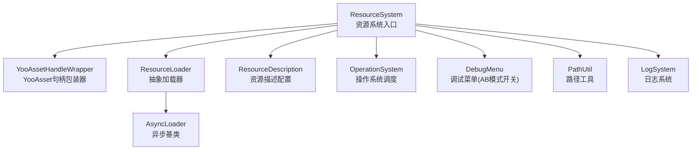
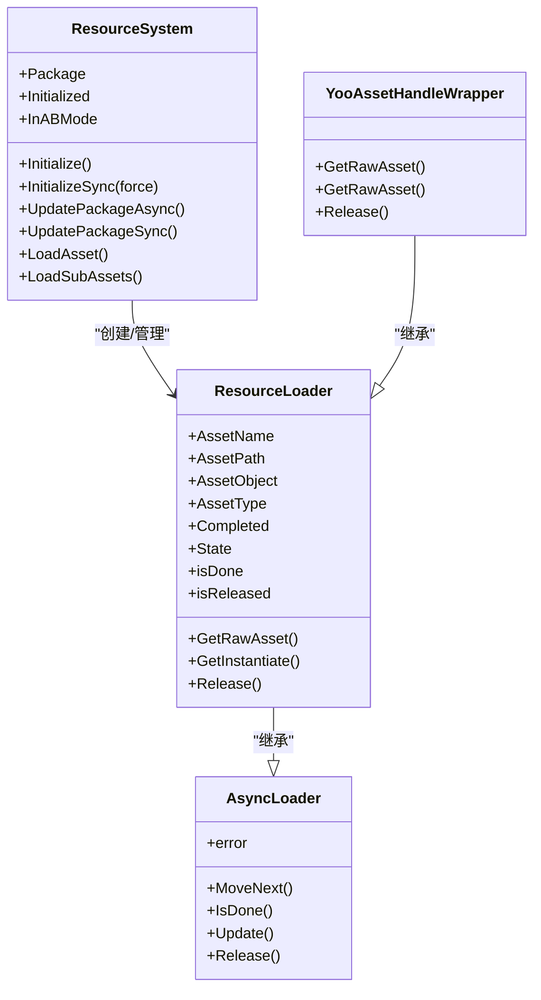
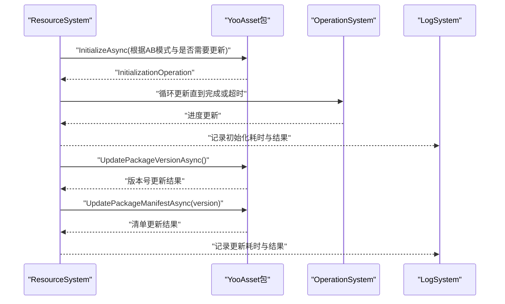
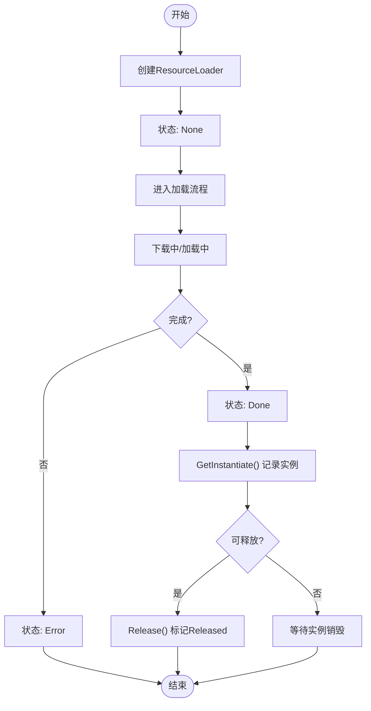
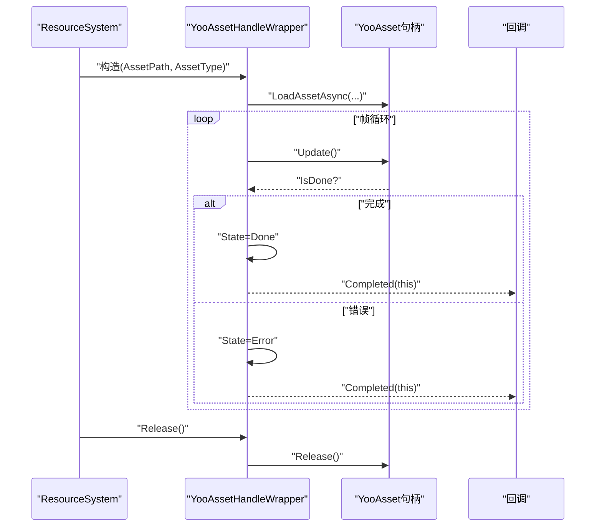
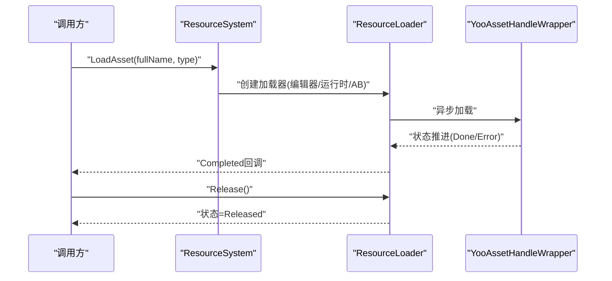
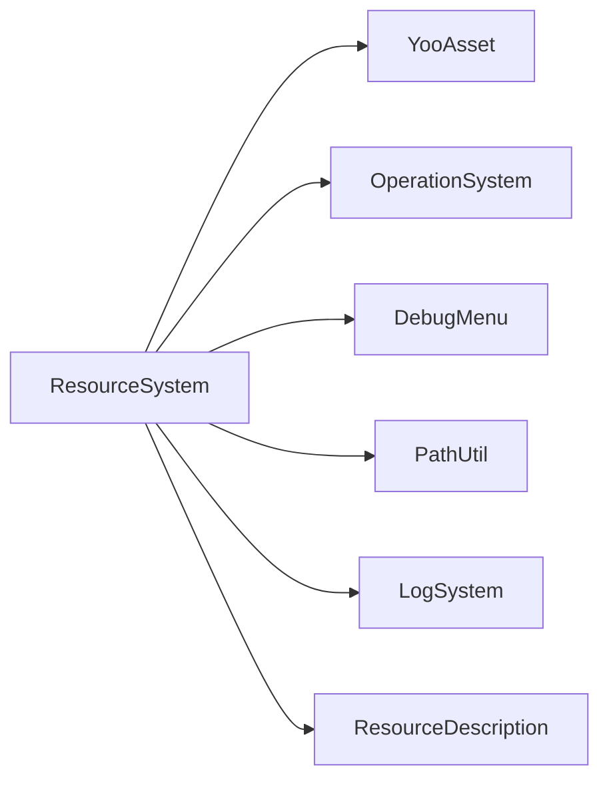

# 资源系统

<cite>
**本文档引用的文件**
- [ResourceSystem.cs](file://Assets/Scripts/Systems/Implement/ResourceSystem/ResourceSystem.cs)
- [ResourceLoader.cs](file://Assets/Scripts/Systems/Implement/ResourceSystem/ResourceLoader.cs)
- [YooAssetHandleWrapper.cs](file://Assets/Scripts/Systems/Implement/ResourceSystem/YooAssetHandleWrapper.cs)
- [ResourceSystem.Func.cs](file://Assets/Scripts/Systems/Implement/ResourceSystem/ResourceSystem.Func.cs)
- [ResourceTest.cs](file://Assets/Dev/Lab/ResourceTest/ResourceTest.cs)
- [ResourceReference.cs](file://Assets/Dev/Lab/Scenes/ResourceReference.cs)
- [DebugMenu.cs](file://Assets/Scripts/RuntimeEditor/DebugMenu.cs)
- [PathUtil.cs](file://Assets/Scripts/Utility/PathUtil.cs)
- [LogSystem.cs](file://Assets/Scripts/Core/LogSystem.cs)
- [OperationSystem.cs](file://Assets/Scripts/Core/OperationSystem.cs)
- [GameQueryServices.cs](file://Assets/Scripts/Systems/Implement/ResourceSystem/GameQueryServices.cs)
- [RemoteServices.cs](file://Assets/Scripts/Systems/Implement/ResourceSystem/RemoteServices.cs)
- [ResourceDescription.cs](file://Assets/Resources/BuildinFileManifest.asset)
</cite>

## 目录
1. [引言](#引言)
2. [项目结构](#项目结构)
3. [核心组件](#核心组件)
4. [架构总览](#架构总览)
5. [详细组件分析](#详细组件分析)
6. [依赖关系分析](#依赖关系分析)
7. [性能考量](#性能考量)
8. [故障排查指南](#故障排查指南)
9. [结论](#结论)
10. [附录](#附录)

## 引言
本文件面向ProjectR项目的资源系统，系统性阐述其架构设计、实现原理与使用方法，覆盖资源加载策略、缓存管理、生命周期控制、异步与批量加载、预加载、类型安全、引用计数与内存管理、热更新流程、性能优化、扩展开发与调试工具等主题。文档以代码为依据，辅以图示帮助不同背景读者快速理解并高效使用该资源系统。

## 项目结构
资源系统位于“Systems/Implement/ResourceSystem”目录下，围绕YooAsset进行封装，提供统一的资源加载入口、状态机与生命周期管理，并通过编辑器模式与运行时AB模式切换，支持离线、在线与回退服务器模式。

图表来源
- [ResourceSystem.cs:77-309](file://Assets/Scripts/Systems/Implement/ResourceSystem/ResourceSystem.cs#L77-L309)
- [ResourceLoader.cs:19-104](file://Assets/Scripts/Systems/Implement/ResourceSystem/ResourceLoader.cs#L19-L104)
- [YooAssetHandleWrapper.cs:59-97](file://Assets/Scripts/Systems/Implement/ResourceSystem/YooAssetHandleWrapper.cs#L59-L97)

章节来源
- [ResourceSystem.cs:14-485](file://Assets/Scripts/Systems/Implement/ResourceSystem/ResourceSystem.cs#L14-L485)
- [ResourceLoader.cs:10-108](file://Assets/Scripts/Systems/Implement/ResourceSystem/ResourceLoader.cs#L10-L108)

## 核心组件
- ResourceSystem：单例系统，负责资源包初始化、版本更新、资源加载入口与全局状态维护。
- ResourceLoader/AsyncLoader：抽象加载器与异步基类，提供状态机、完成回调、实例化与释放接口。
- YooAssetHandleWrapper：对YooAsset加载句柄的封装，桥接系统与YooAsset。
- ResourceDescription：资源描述配置（含远程地址、平台、渠道等），驱动在线/离线模式与热更新。
- OperationSystem/DebugMenu/PathUtil/LogSystem：支撑资源系统运行的基础设施。

章节来源
- [ResourceSystem.cs:14-485](file://Assets/Scripts/Systems/Implement/ResourceSystem/ResourceSystem.cs#L14-L485)
- [ResourceLoader.cs:19-104](file://Assets/Scripts/Systems/Implement/ResourceSystem/ResourceLoader.cs#L19-L104)
- [YooAssetHandleWrapper.cs:59-97](file://Assets/Scripts/Systems/Implement/ResourceSystem/YooAssetHandleWrapper.cs#L59-L97)

## 架构总览
资源系统采用“系统层+加载器层+YooAsset层”的三层架构：
- 系统层：ResourceSystem负责包初始化、版本更新、加载入口与全局状态。
- 加载器层：ResourceLoader族提供统一的加载状态、实例化、引用计数与释放。
- YooAsset层：YooAssetHandleWrapper封装YooAsset的异步加载与句柄释放。

图表来源
- [ResourceSystem.cs:14-485](file://Assets/Scripts/Systems/Implement/ResourceSystem/ResourceSystem.cs#L14-L485)
- [ResourceLoader.cs:19-104](file://Assets/Scripts/Systems/Implement/ResourceSystem/ResourceLoader.cs#L19-L104)
- [YooAssetHandleWrapper.cs:59-97](file://Assets/Scripts/Systems/Implement/ResourceSystem/YooAssetHandleWrapper.cs#L59-L97)

## 详细组件分析

### ResourceSystem：资源系统核心
- 初始化与包管理
  - 支持同步/异步两种初始化方式，自动根据是否处于AB模式与是否需要更新选择离线、在线或回退服务器参数。
  - 提供版本更新流程：先更新版本号，再更新清单，最后持久化版本。
- 资源加载入口
  - 提供按完整资源名加载与按GUID加载子资源的接口，内部根据编辑器/运行时与AB模式动态选择加载器。
- 全局状态
  - 维护资源包实例、资源描述、是否需要更新、AB模式开关等状态。

图表来源
- [ResourceSystem.cs:238-309](file://Assets/Scripts/Systems/Implement/ResourceSystem/ResourceSystem.cs#L238-L309)
- [ResourceSystem.cs:408-445](file://Assets/Scripts/Systems/Implement/ResourceSystem/ResourceSystem.cs#L408-L445)

章节来源
- [ResourceSystem.cs:77-309](file://Assets/Scripts/Systems/Implement/ResourceSystem/ResourceSystem.cs#L77-L309)
- [ResourceSystem.cs:408-445](file://Assets/Scripts/Systems/Implement/ResourceSystem/ResourceSystem.cs#L408-L445)

### ResourceLoader与AsyncLoader：类型安全与生命周期
- 类型安全
  - 通过泛型ResourceLoader<T>与强类型返回值确保资源类型一致性。
- 生命周期
  - 状态机：None → DownloadingAssetBundle → LoadingAssetBundle → LoadindAsset → Done/Released/Error。
  - 完成回调：Completed事件用于通知上层加载完成。
  - 实例化与引用计数：GetInstantiate记录实例列表，Releasable判断是否可释放；ClearNullInstantiate清理无效实例。
- 内存管理
  - Release仅标记状态为Released；具体释放由YooAssetHandleWrapper.Release调用YooAsset句柄释放。

图表来源
- [ResourceLoader.cs:29-93](file://Assets/Scripts/Systems/Implement/ResourceSystem/ResourceLoader.cs#L29-L93)

章节来源
- [ResourceLoader.cs:19-104](file://Assets/Scripts/Systems/Implement/ResourceSystem/ResourceLoader.cs#L19-L104)

### YooAssetHandleWrapper：YooAsset集成
- 将YooAsset的异步加载句柄封装为ResourceLoader，桥接系统与YooAsset。
- 提供GetRawAsset与GetRawAsset<T>获取资源对象。
- 在Release中调用YooAsset句柄释放，确保资源正确回收。

图表来源
- [YooAssetHandleWrapper.cs:59-97](file://Assets/Scripts/Systems/Implement/ResourceSystem/YooAssetHandleWrapper.cs#L59-L97)

章节来源
- [YooAssetHandleWrapper.cs:59-97](file://Assets/Scripts/Systems/Implement/ResourceSystem/YooAssetHandleWrapper.cs#L59-L97)

### 资源加载、卸载与热更新流程
- 加载流程
  - 通过ResourceSystem.LoadAsset或LoadSubAssets发起请求，内部根据环境选择EditorResourceLoader或YooAssetHandleWrapper。
  - 加载器状态推进至Done后触发Completed回调。
- 卸载流程
  - 上层持有ResourceLoader引用，在不再使用时调用Release，标记状态为Released；若存在实例则等待实例销毁后才真正释放。
- 热更新流程
  - 若ResourceDescription指示需要更新，则ResourceSystem在AB模式下执行版本更新与清单更新，随后可继续加载新资源。

图表来源
- [ResourceSystem.Func.cs:109-225](file://Assets/Scripts/Systems/Implement/ResourceSystem/ResourceSystem.Func.cs#L109-L225)
- [ResourceLoader.cs:89-93](file://Assets/Scripts/Systems/Implement/ResourceSystem/ResourceLoader.cs#L89-L93)

章节来源
- [ResourceSystem.Func.cs:109-225](file://Assets/Scripts/Systems/Implement/ResourceSystem/ResourceSystem.Func.cs#L109-L225)
- [ResourceLoader.cs:89-93](file://Assets/Scripts/Systems/Implement/ResourceSystem/ResourceLoader.cs#L89-L93)

### 异步资源加载、批量加载与预加载
- 异步加载
  - ResourceLoader继承AsyncLoader，支持MoveNext/IsDone/Update等异步迭代接口，适合协程或帧循环推进。
- 批量加载
  - 可通过多个LoadAsset/LoadSubAssets并发发起请求，结合Completed回调汇总结果。
- 预加载
  - 建议在场景切换前预先调用LoadAsset，使资源提前进入缓存，减少首帧延迟。

章节来源
- [ResourceLoader.cs:95-104](file://Assets/Scripts/Systems/Implement/ResourceSystem/ResourceLoader.cs#L95-L104)
- [ResourceSystem.Func.cs:109-225](file://Assets/Scripts/Systems/Implement/ResourceSystem/ResourceSystem.Func.cs#L109-L225)

### 类型安全机制、引用计数与内存管理
- 类型安全
  - 泛型ResourceLoader<T>与GetRawAsset<T>确保返回类型一致，避免强制转换风险。
- 引用计数
  - ResourceLoader内部维护实例列表，GetInstantiate记录实例，Releasable检查实例数量决定是否可释放。
- 内存管理
  - Release仅标记状态；YooAssetHandleWrapper在Release中调用YooAsset句柄释放，确保底层资源回收。

章节来源
- [ResourceLoader.cs:49-93](file://Assets/Scripts/Systems/Implement/ResourceSystem/ResourceLoader.cs#L49-L93)
- [YooAssetHandleWrapper.cs:82-88](file://Assets/Scripts/Systems/Implement/ResourceSystem/YooAssetHandleWrapper.cs#L82-L88)

### 资源系统扩展开发指南
- 添加新的资源类型
  - 新建派生自ResourceLoader的加载器，实现特定资源类型的加载逻辑与释放策略。
- 自定义资源加载器
  - 可基于YooAssetHandleWrapper模式，封装第三方或自研加载库，保持与ResourceSystem一致的状态机与回调接口。
- 配置与参数
  - 通过ResourceDescription配置远程地址、平台、渠道等，驱动在线/离线模式与热更新行为。

章节来源
- [ResourceLoader.cs:12-17](file://Assets/Scripts/Systems/Implement/ResourceSystem/ResourceLoader.cs#L12-L17)
- [YooAssetHandleWrapper.cs:59-97](file://Assets/Scripts/Systems/Implement/ResourceSystem/YooAssetHandleWrapper.cs#L59-L97)

## 依赖关系分析
- 外部依赖
  - YooAsset：提供资源包初始化、版本更新、清单更新与异步加载能力。
- 内部依赖
  - OperationSystem：驱动异步操作的帧循环更新。
  - DebugMenu：控制AB模式开关。
  - PathUtil/LogSystem：路径解析与日志输出。
  - ResourceDescription：资源描述配置。

图表来源
- [ResourceSystem.cs:77-309](file://Assets/Scripts/Systems/Implement/ResourceSystem/ResourceSystem.cs#L77-L309)

章节来源
- [ResourceSystem.cs:77-309](file://Assets/Scripts/Systems/Implement/ResourceSystem/ResourceSystem.cs#L77-L309)

## 性能考量
- 资源打包与清单
  - 使用YooAsset的打包与清单机制，减少网络传输与磁盘IO开销。
- 流式加载
  - 利用YooAsset异步加载特性，配合帧循环更新，避免主线程阻塞。
- 预加载策略
  - 在场景切换前预加载常用资源，降低首帧延迟。
- 缓存与复用
  - 通过ResourceLoader的实例列表与状态机，避免重复创建与释放带来的抖动。

[本节为通用性能建议，不直接分析具体文件]

## 故障排查指南
- 初始化失败
  - 检查ResourceSystem初始化流程中的异常日志，确认AB模式与资源描述配置。
- 版本更新失败
  - 观察UpdatePackageVersionAsync与UpdatePackageManifestAsync的返回状态，必要时启用回退服务器。
- 加载错误
  - 查看YooAssetHandleWrapper中的错误信息与状态切换，定位资源缺失或类型不匹配问题。
- 资源泄漏
  - 确认所有实例均被销毁且Releasable返回true后再释放；定期调用ClearNullInstantiate清理无效实例。

章节来源
- [ResourceSystem.cs:156-232](file://Assets/Scripts/Systems/Implement/ResourceSystem/ResourceSystem.cs#L156-L232)
- [YooAssetHandleWrapper.cs:59-71](file://Assets/Scripts/Systems/Implement/ResourceSystem/YooAssetHandleWrapper.cs#L59-L71)
- [ResourceLoader.cs:69-87](file://Assets/Scripts/Systems/Implement/ResourceSystem/ResourceLoader.cs#L69-L87)

## 结论
ProjectR资源系统以YooAsset为核心，结合自研加载器与状态机，实现了类型安全、生命周期可控、可扩展的资源管理体系。通过异步加载、批量加载、预加载与热更新流程，系统在性能与稳定性之间取得良好平衡。建议在实际项目中遵循本文档的加载/卸载/热更新流程与扩展开发指南，持续优化资源加载体验。

[本节为总结性内容，不直接分析具体文件]

## 附录
- 调试工具
  - DebugMenu：切换AB模式，便于测试离线/在线加载差异。
  - LogSystem：集中输出资源系统日志，辅助定位问题。
- 资源依赖分析与使用统计
  - 可结合YooAsset的收集与报告工具，对资源依赖与使用情况进行分析与统计（参考相关编辑器工具）。

章节来源
- [DebugMenu.cs](file://Assets/Scripts/RuntimeEditor/DebugMenu.cs)
- [LogSystem.cs](file://Assets/Scripts/Core/LogSystem.cs)