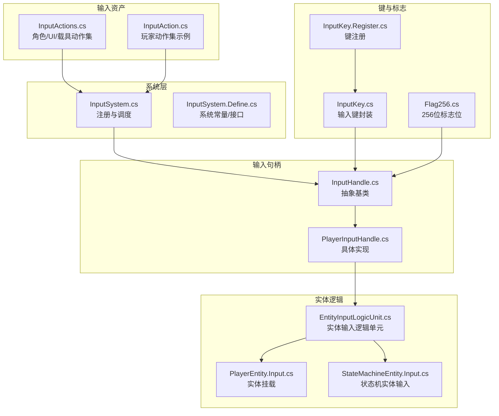
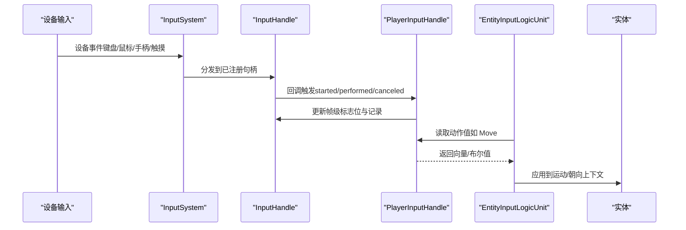
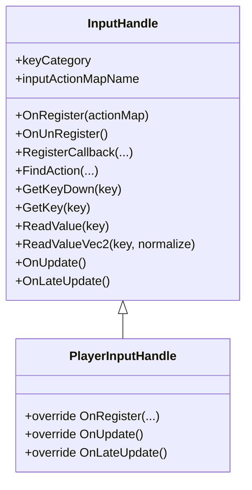
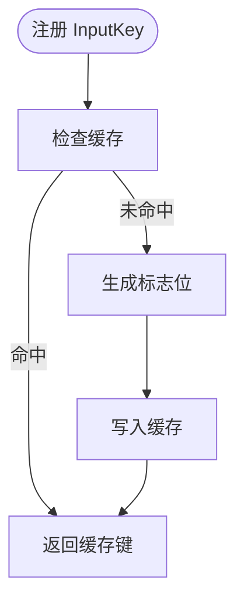
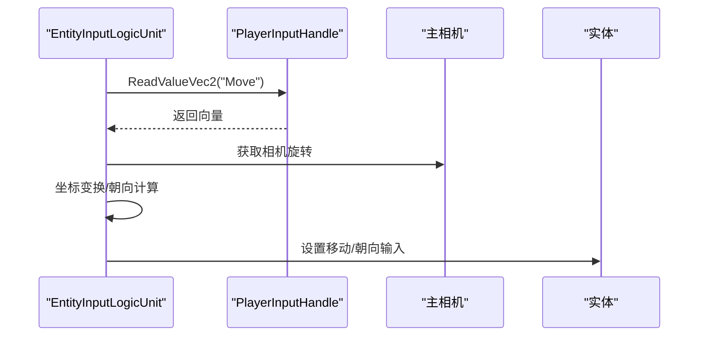
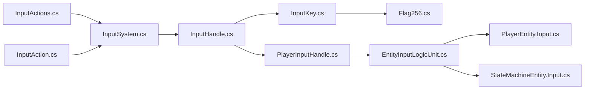

# 输入系统

<cite>
**本文引用的文件**
- [Assets/Common/InputActions.cs](file://Assets/Common/InputActions.cs)
- [Assets/Dev/Prefabs/SystemAssets/InputSystem/InputAction.cs](file://Assets/Dev/Prefabs/SystemAssets/InputSystem/InputAction.cs)
- [Assets/Scripts/Systems/Implement/InputSystem/InputHandle.cs](file://Assets/Scripts/Systems/Implement/InputSystem/InputHandle.cs)
- [Assets/Scripts/Systems/Implement/InputSystem/InputKey.cs](file://Assets/Scripts/Systems/Implement/InputSystem/InputKey.cs)
- [Assets/Scripts/Systems/Implement/InputSystem/InputKey.Register.cs](file://Assets/Scripts/Systems/Implement/InputSystem/InputKey.Register.cs)
- [Assets/Scripts/Systems/Implement/InputSystem/PlayerInputHandle.cs](file://Assets/Scripts/Systems/Implement/InputSystem/PlayerInputHandle.cs)
- [Assets/Scripts/Systems/Implement/InputSystem/InputSystem.cs](file://Assets/Scripts/Systems/Implement/InputSystem/InputSystem.cs)
- [Assets/Scripts/Systems/Implement/InputSystem/InputSystem.Define.cs](file://Assets/Scripts/Systems/Implement/InputSystem/InputSystem.Define.cs)
- [Assets/Scripts/Systems/Implement/EntitySystem/LogicEntity/PlayerEntity/PlayerEntity.Input.cs](file://Assets/Scripts/Systems/Implement/EntitySystem/LogicEntity/PlayerEntity/PlayerEntity.Input.cs)
- [Assets/Scripts/Systems/Implement/EntitySystem/LogicEntity/PlayerEntity/StateMachineEntity.Input.cs](file://Assets/Scripts/Systems/Implement/EntitySystem/LogicEntity/PlayerEntity/StateMachineEntity.Input.cs)
- [Assets/Scripts/Systems/Implement/EntitySystem/LogicEntity/LogicUnits/EntityInputLogicUnit.cs](file://Assets/Scripts/Systems/Implement/EntitySystem/LogicEntity/LogicUnits/EntityInputLogicUnit.cs)
- [Assets/Plugins/PJR/BitwiseFlags/Gen/Flag256.cs](file://Assets/Plugins/PJR/BitwiseFlags/Gen/Flag256.cs)
</cite>

## 目录
1. [简介](#简介)
2. [项目结构](#项目结构)
3. [核心组件](#核心组件)
4. [架构总览](#架构总览)
5. [详细组件分析](#详细组件分析)
6. [依赖关系分析](#依赖关系分析)
7. [性能考量](#性能考量)
8. [故障排查指南](#故障排查指南)
9. [结论](#结论)
10. [附录：扩展开发指南](#附录扩展开发指南)

## 简介
本文件系统性梳理 ProjectR 的输入系统，覆盖输入事件的捕获、处理与分发；Unity Input System 的集成方式与自定义输入动作定义；输入系统的帧同步、输入缓冲与输入预测思路；多设备（键盘、鼠标、手柄、触摸）处理示例；性能优化策略（事件批处理与延迟最小化）；以及扩展开发指南与调试监控方法。目标是帮助开发者快速理解并高效迭代输入系统。

## 项目结构
输入系统由“输入资产（Input Actions）+ 输入句柄（InputHandle）+ 输入键与标志（InputKey/Flag256）+ 实体逻辑单元（EntityInputLogicUnit）”构成，配合系统层的注册与调度，形成从设备到实体行为的完整链路。

图表来源
- [Assets/Common/InputActions.cs:1-1192](file://Assets/Common/InputActions.cs#L1-L1192)
- [Assets/Dev/Prefabs/SystemAssets/InputSystem/InputAction.cs:1-346](file://Assets/Dev/Prefabs/SystemAssets/InputSystem/InputAction.cs#L1-L346)
- [Assets/Scripts/Systems/Implement/InputSystem/InputSystem.cs:1-200](file://Assets/Scripts/Systems/Implement/InputSystem/InputSystem.cs)
- [Assets/Scripts/Systems/Implement/InputSystem/InputSystem.Define.cs:1-200](file://Assets/Scripts/Systems/Implement/InputSystem/InputSystem.Define.cs)
- [Assets/Scripts/Systems/Implement/InputSystem/InputHandle.cs:1-157](file://Assets/Scripts/Systems/Implement/InputSystem/InputHandle.cs#L1-L157)
- [Assets/Scripts/Systems/Implement/InputSystem/PlayerInputHandle.cs:1-200](file://Assets/Scripts/Systems/Implement/InputSystem/PlayerInputHandle.cs)
- [Assets/Scripts/Systems/Implement/InputSystem/InputKey.cs:1-122](file://Assets/Scripts/Systems/Implement/InputSystem/InputKey.cs#L1-L122)
- [Assets/Scripts/Systems/Implement/InputSystem/InputKey.Register.cs:1-17](file://Assets/Scripts/Systems/Implement/InputSystem/InputKey.Register.cs#L1-L17)
- [Assets/Plugins/PJR/BitwiseFlags/Gen/Flag256.cs:1-306](file://Assets/Plugins/PJR/BitwiseFlags/Gen/Flag256.cs#L1-L306)
- [Assets/Scripts/Systems/Implement/EntitySystem/LogicEntity/PlayerEntity/PlayerEntity.Input.cs:1-15](file://Assets/Scripts/Systems/Implement/EntitySystem/LogicEntity/PlayerEntity/PlayerEntity.Input.cs#L1-L15)
- [Assets/Scripts/Systems/Implement/EntitySystem/LogicEntity/PlayerEntity/StateMachineEntity.Input.cs:1-97](file://Assets/Scripts/Systems/Implement/EntitySystem/LogicEntity/PlayerEntity/StateMachineEntity.Input.cs#L1-L97)
- [Assets/Scripts/Systems/Implement/EntitySystem/LogicEntity/LogicUnits/EntityInputLogicUnit.cs:1-75](file://Assets/Scripts/Systems/Implement/EntitySystem/LogicEntity/LogicUnits/EntityInputLogicUnit.cs#L1-L75)

章节来源
- [Assets/Common/InputActions.cs:1-1192](file://Assets/Common/InputActions.cs#L1-L1192)
- [Assets/Dev/Prefabs/SystemAssets/InputSystem/InputAction.cs:1-346](file://Assets/Dev/Prefabs/SystemAssets/InputSystem/InputAction.cs#L1-L346)
- [Assets/Scripts/Systems/Implement/InputSystem/InputSystem.cs:1-200](file://Assets/Scripts/Systems/Implement/InputSystem/InputSystem.cs)
- [Assets/Scripts/Systems/Implement/InputSystem/InputSystem.Define.cs:1-200](file://Assets/Scripts/Systems/Implement/InputSystem/InputSystem.Define.cs)

## 核心组件
- 输入动作资产（InputActions.cs / InputAction.cs）
  - 定义角色、UI、载具等动作映射与绑定路径，支持键盘/鼠标、手柄等多设备。
  - 提供动作集合访问器与控制方案（scheme）索引。
- 输入句柄（InputHandle 抽象类 + PlayerInputHandle 实现）
  - 负责将 InputActionMap 与业务键（InputKey）绑定，提供回调注册、按键查询、向量读取等能力。
  - 内置帧级标志位（Flag256）与字典记录，兼顾性能与可读性。
- 输入键与标志（InputKey + Flag256）
  - InputKey 封装字符串键名、分类、标志位，并提供缓存与查找。
  - Flag256 提供 256 位位图操作，用于快速帧级判定（HasAny/HasAll）。
- 实体输入逻辑单元（EntityInputLogicUnit）
  - 在实体生命周期内注册输入句柄，将输入向量转换为实体运动/朝向上下文。
- 系统层（InputSystem.cs / InputSystem.Define.cs）
  - 统一注册与调度输入句柄，协调输入资产与实体逻辑单元。

章节来源
- [Assets/Scripts/Systems/Implement/InputSystem/InputHandle.cs:1-157](file://Assets/Scripts/Systems/Implement/InputSystem/InputHandle.cs#L1-L157)
- [Assets/Scripts/Systems/Implement/InputSystem/InputKey.cs:1-122](file://Assets/Scripts/Systems/Implement/InputSystem/InputKey.cs#L1-L122)
- [Assets/Scripts/Systems/Implement/InputSystem/InputKey.Register.cs:1-17](file://Assets/Scripts/Systems/Implement/InputSystem/InputKey.Register.cs#L1-L17)
- [Assets/Plugins/PJR/BitwiseFlags/Gen/Flag256.cs:1-306](file://Assets/Plugins/PJR/BitwiseFlags/Gen/Flag256.cs#L1-L306)
- [Assets/Scripts/Systems/Implement/EntitySystem/LogicEntity/LogicUnits/EntityInputLogicUnit.cs:1-75](file://Assets/Scripts/Systems/Implement/EntitySystem/LogicEntity/LogicUnits/EntityInputLogicUnit.cs#L1-L75)

## 架构总览
输入系统采用“动作资产驱动 + 句柄抽象 + 实体逻辑单元”的分层设计。设备输入通过 Input System 转换为动作回调，输入句柄统一接收并记录，实体逻辑单元按需读取并应用到运动/朝向计算。

图表来源
- [Assets/Scripts/Systems/Implement/InputSystem/InputSystem.cs:1-200](file://Assets/Scripts/Systems/Implement/InputSystem/InputSystem.cs)
- [Assets/Scripts/Systems/Implement/InputSystem/InputHandle.cs:1-157](file://Assets/Scripts/Systems/Implement/InputSystem/InputHandle.cs#L1-L157)
- [Assets/Scripts/Systems/Implement/EntitySystem/LogicEntity/LogicUnits/EntityInputLogicUnit.cs:1-75](file://Assets/Scripts/Systems/Implement/EntitySystem/LogicEntity/LogicUnits/EntityInputLogicUnit.cs#L1-L75)

## 详细组件分析

### 输入动作资产与绑定
- 角色动作（CharacterController）：Move/Look/Fire/Jump 等，绑定至手柄左摇杆、键盘 WASD、鼠标移动等。
- UI 动作（UI）：Navigate/Submit/Cancel/Point/Click/ScrollWheel/MiddleClick/RightClick，支持手柄 D-Pad、键盘方向键、鼠标与触摸。
- 载具动作（Vehicle）：Steering/Throttle/Previous/Next/Look，支持手柄与键盘。
- 控制方案（Control Scheme）：Keyboard&Mouse、Gamepad 等，用于在不同设备间切换。

章节来源
- [Assets/Common/InputActions.cs:20-800](file://Assets/Common/InputActions.cs#L20-L800)
- [Assets/Dev/Prefabs/SystemAssets/InputSystem/InputAction.cs:20-200](file://Assets/Dev/Prefabs/SystemAssets/InputSystem/InputAction.cs#L20-L200)

### 输入句柄与回调处理
- InputHandle 抽象类负责：
  - 将 InputActionMap 中的动作与业务键（InputKey）建立映射。
  - 提供回调注册（started/performed/canceled）、按键查询（GetKeyDown/GetKey）、向量读取（ReadValue/ReadValueVec2）。
  - 使用 Flag256 与字典记录双轨记录，兼顾性能与可读性。
- PlayerInputHandle 为具体实现，按需覆写更新逻辑。

图表来源
- [Assets/Scripts/Systems/Implement/InputSystem/InputHandle.cs:10-157](file://Assets/Scripts/Systems/Implement/InputSystem/InputHandle.cs#L10-L157)
- [Assets/Scripts/Systems/Implement/InputSystem/PlayerInputHandle.cs:1-200](file://Assets/Scripts/Systems/Implement/InputSystem/PlayerInputHandle.cs)

章节来源
- [Assets/Scripts/Systems/Implement/InputSystem/InputHandle.cs:1-157](file://Assets/Scripts/Systems/Implement/InputSystem/InputHandle.cs#L1-L157)

### 输入键与标志管理
- InputKey 支持字符串键名与枚举键名两种注册方式，内部维护分类与标志位，并提供缓存以加速查找。
- Flag256 提供 256 位位运算，用于快速判断任意/全部标志位是否存在，适合高频帧级判定。

图表来源
- [Assets/Scripts/Systems/Implement/InputSystem/InputKey.cs:52-122](file://Assets/Scripts/Systems/Implement/InputSystem/InputKey.cs#L52-L122)
- [Assets/Plugins/PJR/BitwiseFlags/Gen/Flag256.cs:33-54](file://Assets/Plugins/PJR/BitwiseFlags/Gen/Flag256.cs#L33-L54)

章节来源
- [Assets/Scripts/Systems/Implement/InputSystem/InputKey.cs:1-122](file://Assets/Scripts/Systems/Implement/InputSystem/InputKey.cs#L1-L122)
- [Assets/Scripts/Systems/Implement/InputSystem/InputKey.Register.cs:1-17](file://Assets/Scripts/Systems/Implement/InputSystem/InputKey.Register.cs#L1-L17)
- [Assets/Plugins/PJR/BitwiseFlags/Gen/Flag256.cs:1-306](file://Assets/Plugins/PJR/BitwiseFlags/Gen/Flag256.cs#L1-L306)

### 实体输入逻辑单元
- EntityInputLogicUnit 在实体初始化时创建并注册 PlayerInputHandle，随后在每帧读取 Move 等动作向量，结合相机平面进行坐标变换，输出给实体运动/朝向使用。
- StateMachineEntity.Input 提供类似的输入上下文构建流程，便于状态机实体复用。

图表来源
- [Assets/Scripts/Systems/Implement/EntitySystem/LogicEntity/LogicUnits/EntityInputLogicUnit.cs:28-72](file://Assets/Scripts/Systems/Implement/EntitySystem/LogicEntity/LogicUnits/EntityInputLogicUnit.cs#L28-L72)
- [Assets/Scripts/Systems/Implement/EntitySystem/LogicEntity/PlayerEntity/StateMachineEntity.Input.cs:30-94](file://Assets/Scripts/Systems/Implement/EntitySystem/LogicEntity/PlayerEntity/StateMachineEntity.Input.cs#L30-L94)

章节来源
- [Assets/Scripts/Systems/Implement/EntitySystem/LogicEntity/LogicUnits/EntityInputLogicUnit.cs:1-75](file://Assets/Scripts/Systems/Implement/EntitySystem/LogicEntity/LogicUnits/EntityInputLogicUnit.cs#L1-L75)
- [Assets/Scripts/Systems/Implement/EntitySystem/LogicEntity/PlayerEntity/StateMachineEntity.Input.cs:1-97](file://Assets/Scripts/Systems/Implement/EntitySystem/LogicEntity/PlayerEntity/StateMachineEntity.Input.cs#L1-L97)

### 多设备输入处理示例
- 键盘/鼠标：WASD、鼠标移动、滚轮、右键等分别映射到角色 Move/Look/Click/ScrollWheel 等动作。
- 手柄：左摇杆映射 Move，右摇杆映射 Look，触发器映射 Fire/Jump，肩键映射 Previous/Next。
- 触摸：触摸屏位置映射 Point，触摸点击映射 Click。

章节来源
- [Assets/Common/InputActions.cs:67-222](file://Assets/Common/InputActions.cs#L67-L222)
- [Assets/Common/InputActions.cs:301-533](file://Assets/Common/InputActions.cs#L301-L533)
- [Assets/Common/InputActions.cs:585-784](file://Assets/Common/InputActions.cs#L585-L784)

## 依赖关系分析
- 输入资产依赖 Unity Input System 的 InputActionAsset 与 InputAction。
- 输入句柄依赖输入键缓存与标志位管理。
- 实体逻辑单元依赖输入句柄提供的动作值与上下文。
- 系统层负责注册与调度，确保输入资产与实体逻辑单元解耦。

图表来源
- [Assets/Common/InputActions.cs:1-1192](file://Assets/Common/InputActions.cs#L1-L1192)
- [Assets/Dev/Prefabs/SystemAssets/InputSystem/InputAction.cs:1-346](file://Assets/Dev/Prefabs/SystemAssets/InputSystem/InputAction.cs#L1-L346)
- [Assets/Scripts/Systems/Implement/InputSystem/InputSystem.cs:1-200](file://Assets/Scripts/Systems/Implement/InputSystem/InputSystem.cs)
- [Assets/Scripts/Systems/Implement/InputSystem/InputHandle.cs:1-157](file://Assets/Scripts/Systems/Implement/InputSystem/InputHandle.cs#L1-L157)
- [Assets/Scripts/Systems/Implement/InputSystem/PlayerInputHandle.cs:1-200](file://Assets/Scripts/Systems/Implement/InputSystem/PlayerInputHandle.cs)
- [Assets/Scripts/Systems/Implement/InputSystem/InputKey.cs:1-122](file://Assets/Scripts/Systems/Implement/InputSystem/InputKey.cs#L1-L122)
- [Assets/Plugins/PJR/BitwiseFlags/Gen/Flag256.cs:1-306](file://Assets/Plugins/PJR/BitwiseFlags/Gen/Flag256.cs#L1-L306)
- [Assets/Scripts/Systems/Implement/EntitySystem/LogicEntity/LogicUnits/EntityInputLogicUnit.cs:1-75](file://Assets/Scripts/Systems/Implement/EntitySystem/LogicEntity/LogicUnits/EntityInputLogicUnit.cs#L1-L75)
- [Assets/Scripts/Systems/Implement/EntitySystem/LogicEntity/PlayerEntity/PlayerEntity.Input.cs:1-15](file://Assets/Scripts/Systems/Implement/EntitySystem/LogicEntity/PlayerEntity/PlayerEntity.Input.cs#L1-L15)
- [Assets/Scripts/Systems/Implement/EntitySystem/LogicEntity/PlayerEntity/StateMachineEntity.Input.cs:1-97](file://Assets/Scripts/Systems/Implement/EntitySystem/LogicEntity/PlayerEntity/StateMachineEntity.Input.cs#L1-L97)

章节来源
- [Assets/Scripts/Systems/Implement/InputSystem/InputSystem.cs:1-200](file://Assets/Scripts/Systems/Implement/InputSystem/InputSystem.cs)
- [Assets/Scripts/Systems/Implement/InputSystem/InputSystem.Define.cs:1-200](file://Assets/Scripts/Systems/Implement/InputSystem/InputSystem.Define.cs)

## 性能考量
- 事件批处理与延迟最小化
  - 使用 Flag256 快速帧级判定，避免频繁字典查找；同时保留字典记录以便调试与复杂条件判断。
  - 通过 InputHandle 的 ReadValueVec2(normalize: true) 对向量归一化，减少后续计算分支。
- 输入缓冲与预测
  - 当前实现以“每帧读取当前帧输入”为主，未见专用输入缓冲/预测模块。可在实体逻辑单元中引入本地时间戳与插值队列，作为未来扩展方向。
- 设备绑定优化
  - 合理配置 Control Scheme 与绑定组，减少无效动作匹配开销；对高频动作（如 Move）尽量使用复合向量或标准化处理。

章节来源
- [Assets/Scripts/Systems/Implement/InputSystem/InputHandle.cs:100-155](file://Assets/Scripts/Systems/Implement/InputSystem/InputHandle.cs#L100-L155)
- [Assets/Plugins/PJR/BitwiseFlags/Gen/Flag256.cs:33-54](file://Assets/Plugins/PJR/BitwiseFlags/Gen/Flag256.cs#L33-L54)

## 故障排查指南
- 动作未触发
  - 检查 InputActionMap 是否正确注册到 InputSystem，确认键名与动作名一致。
  - 确认设备绑定路径有效（如 <Keyboard>/w），并在对应 Control Scheme 下启用。
- 输入值异常
  - 使用 InputHandle.ReadValueVec2 读取前检查动作是否存在；必要时开启 normalize。
  - 若出现方向错乱，检查相机变换与坐标系转换逻辑。
- 性能问题
  - 避免在 Update 中频繁查找动作；优先使用 InputHandle 缓存的动作引用。
  - 减少不必要的回调注册/注销，集中管理生命周期。

章节来源
- [Assets/Scripts/Systems/Implement/InputSystem/InputHandle.cs:115-155](file://Assets/Scripts/Systems/Implement/InputSystem/InputHandle.cs#L115-L155)
- [Assets/Scripts/Systems/Implement/EntitySystem/LogicEntity/LogicUnits/EntityInputLogicUnit.cs:37-72](file://Assets/Scripts/Systems/Implement/EntitySystem/LogicEntity/LogicUnits/EntityInputLogicUnit.cs#L37-L72)

## 结论
ProjectR 的输入系统以 Unity Input System 为基础，通过输入动作资产、输入句柄与实体逻辑单元的清晰分层，实现了对多设备输入的统一接入与高效处理。系统在性能与可读性之间取得平衡，具备良好的扩展性与可维护性。建议在后续版本中引入输入缓冲与预测机制，进一步提升网络同步与响应体验。

## 附录：扩展开发指南

### 添加新的输入动作
- 在输入资产中新增动作与绑定路径（参考角色/UI/载具动作段落），确保动作类型与预期控件匹配。
- 在 RegisterKeys 中注册新键名，以便在代码中统一引用。
- 在实体逻辑单元中读取新动作值，并将其纳入运动/朝向计算。

章节来源
- [Assets/Common/InputActions.cs:20-800](file://Assets/Common/InputActions.cs#L20-L800)
- [Assets/Scripts/Systems/Implement/InputSystem/InputKey.Register.cs:8-16](file://Assets/Scripts/Systems/Implement/InputSystem/InputKey.Register.cs#L8-L16)
- [Assets/Scripts/Systems/Implement/EntitySystem/LogicEntity/LogicUnits/EntityInputLogicUnit.cs:37-72](file://Assets/Scripts/Systems/Implement/EntitySystem/LogicEntity/LogicUnits/EntityInputLogicUnit.cs#L37-L72)

### 自定义输入处理器
- 继承 InputHandle 并实现 OnRegister/OnUpdate/OnLateUpdate 等方法，按需注册回调与读取动作值。
- 在实体初始化阶段创建并注册自定义输入处理器，确保生命周期与实体一致。

章节来源
- [Assets/Scripts/Systems/Implement/InputSystem/InputHandle.cs:10-98](file://Assets/Scripts/Systems/Implement/InputSystem/InputHandle.cs#L10-L98)
- [Assets/Scripts/Systems/Implement/EntitySystem/LogicEntity/LogicUnits/EntityInputLogicUnit.cs:12-26](file://Assets/Scripts/Systems/Implement/EntitySystem/LogicEntity/LogicUnits/EntityInputLogicUnit.cs#L12-L26)

### 调试与可视化监控
- 使用字典记录（InputRecord）观察单帧按键状态变化，辅助定位输入异常。
- 利用 Flag256 的 HasAny/HasAll 快速验证组合条件。
- 在实体逻辑单元中打印输入向量与变换结果，核对相机坐标系转换是否正确。

章节来源
- [Assets/Scripts/Systems/Implement/InputSystem/InputHandle.cs:22-54](file://Assets/Scripts/Systems/Implement/InputSystem/InputHandle.cs#L22-L54)
- [Assets/Scripts/Systems/Implement/EntitySystem/LogicEntity/LogicUnits/EntityInputLogicUnit.cs:37-72](file://Assets/Scripts/Systems/Implement/EntitySystem/LogicEntity/LogicUnits/EntityInputLogicUnit.cs#L37-L72)