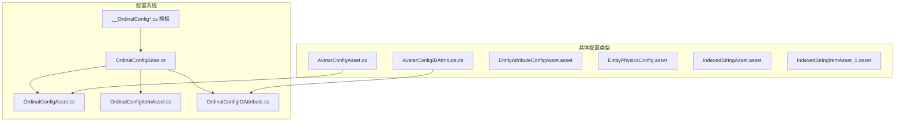
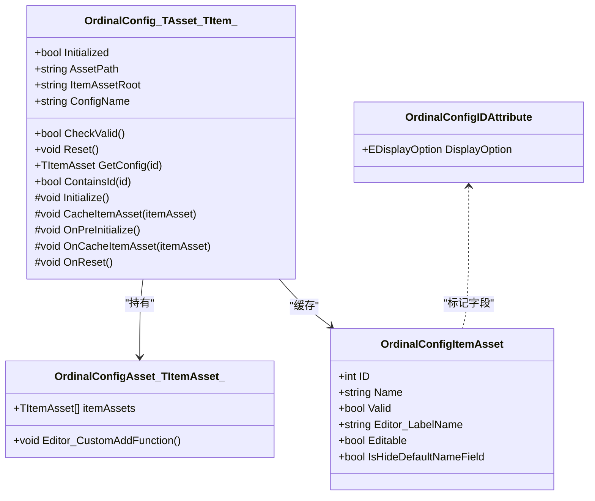
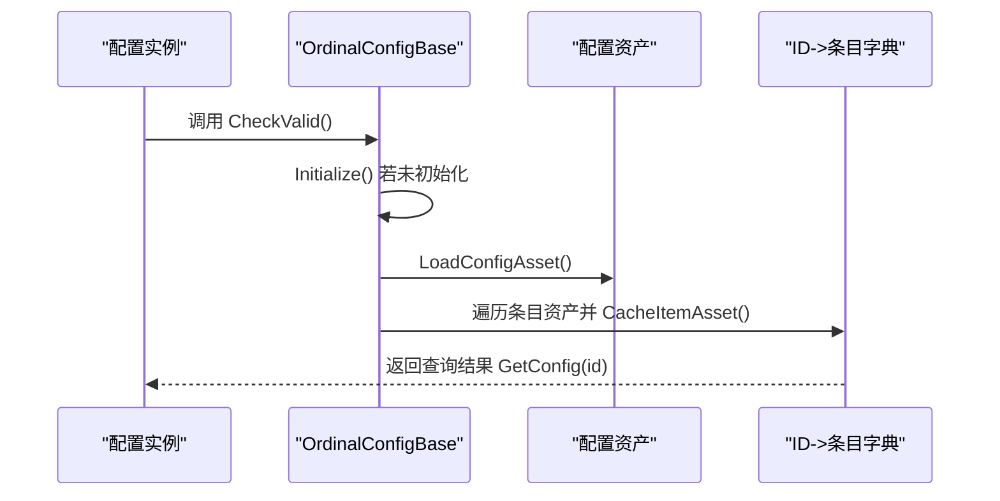
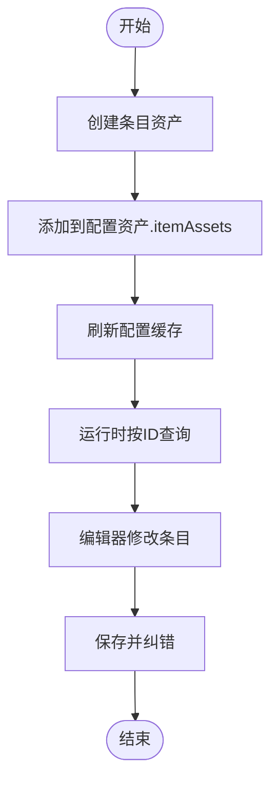
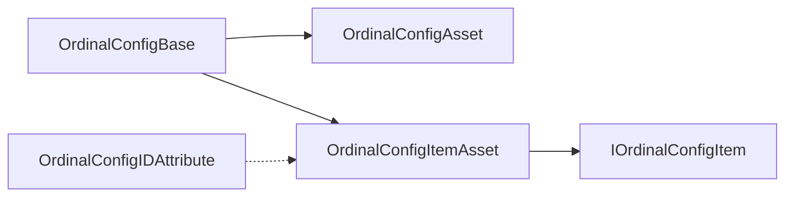

# 配置系统

<cite>
**本文引用的文件**
- [OrdinalConfigBase.cs](file://Assets/Scripts/Systems/Implement/ConfigSystem/OrdinalConfig/OrdinalConfigBase.cs)
- [OrdinalConfigAsset.cs](file://Assets/Scripts/Systems/Implement/ConfigSystem/OrdinalConfig/OrdinalConfigAsset.cs)
- [OrdinalConfigItemAsset.cs](file://Assets/Scripts/Systems/Implement/ConfigSystem/OrdinalConfig/OrdinalConfigItemAsset.cs)
- [OrdinalConfigIDAttribute.cs](file://Assets/Scripts/Systems/Implement/ConfigSystem/OrdinalConfig/OrdinalConfigIDAttribute.cs)
- [__OrdinalConfig.cs](file://Assets/Resources/OrdinalConfigTemplate/__OrdinalConfig.cs)
- [__OrdinalConfigAsset.cs](file://Assets/Resources/OrdinalConfigTemplate/__OrdinalConfigAsset.cs)
- [__OrdinalConfigItemAsset.cs](file://Assets/Resources/OrdinalConfigTemplate/__OrdinalConfigItemAsset.cs)
- [__OrdinalConfigIDAttribute.cs](file://Assets/Resources/OrdinalConfigTemplate/__OrdinalConfigIDAttribute.cs)
- [AvatarConfigAsset.cs](file://Assets/Scripts/Config/AvatarConfig/AvatarConfigAsset.cs)
- [AvatarConfigIDAttribute.cs](file://Assets/Scripts/Config/AvatarConfig/AvatarConfigIDAttribute.cs)
- [EntityAttributeConfigAsset.asset](file://Assets/Dev/Assets_/EntityAttributeConfigAsset.asset)
- [EntityPhysicsConfig.asset](file://Assets/Dev/Assets_/EntityPhysicsConfig.asset)
- [IndexedStringAsset.asset](file://Assets/Dev/Config/IndexedString/IndexedStringAsset.asset)
- [IndexedStringItemAsset_1.asset](file://Assets/Dev/Config/IndexedString/IndexedStringItemAsset_1.asset)
- [OrdinalConfigTest.cs](file://Assets/Dev/Lab/Scripts/OrdinalConfigTest.cs)
</cite>

## 目录
1. [简介](#简介)
2. [项目结构](#项目结构)
3. [核心组件](#核心组件)
4. [架构总览](#架构总览)
5. [详细组件分析](#详细组件分析)
6. [依赖关系分析](#依赖关系分析)
7. [性能考量](#性能考量)
8. [故障排查指南](#故障排查指南)
9. [结论](#结论)
10. [附录](#附录)

## 简介
本文件系统性阐述 ProjectR 的配置系统设计与实现，重点覆盖以下方面：
- 基于资源的配置管理模型：以 Unity 资源（ScriptableObject）为核心载体，按“配置资产 + 条目资产”的分层组织。
- 配置数据的加载与缓存机制：统一的延迟初始化与字典缓存策略，支持编辑器与运行时双态。
- 类型安全与验证：泛型约束、接口契约、属性校验与重复 ID 检测。
- 典型配置类型：角色配置、实体配置、索引字符串配置等的实现与使用场景。
- 扩展开发指南：新增配置类型、自定义验证规则与编辑器工具集成。
- 性能优化：延迟加载、批量加载、内存优化与缓存复用。
- 调试与版本管理：调试工具链、配置纠错与版本化工作流建议。

## 项目结构
配置系统位于“系统实现 -> 配置系统 -> 序号型配置”路径下，采用模板化与泛型抽象，结合 Unity 资源与编辑器工具形成完整的配置生命周期闭环。

图示来源
- [OrdinalConfigBase.cs:1-634](file://Assets/Scripts/Systems/Implement/ConfigSystem/OrdinalConfig/OrdinalConfigBase.cs#L1-L634)
- [OrdinalConfigAsset.cs:1-25](file://Assets/Scripts/Systems/Implement/ConfigSystem/OrdinalConfig/OrdinalConfigAsset.cs#L1-L25)
- [OrdinalConfigItemAsset.cs:1-57](file://Assets/Scripts/Systems/Implement/ConfigSystem/OrdinalConfig/OrdinalConfigItemAsset.cs#L1-L57)
- [OrdinalConfigIDAttribute.cs:1-31](file://Assets/Scripts/Systems/Implement/ConfigSystem/OrdinalConfig/OrdinalConfigIDAttribute.cs#L1-L31)
- [__OrdinalConfig.cs:1-61](file://Assets/Resources/OrdinalConfigTemplate/__OrdinalConfig.cs#L1-L61)
- [AvatarConfigAsset.cs:1-7](file://Assets/Scripts/Config/AvatarConfig/AvatarConfigAsset.cs#L1-L7)
- [AvatarConfigIDAttribute.cs:1-12](file://Assets/Scripts/Config/AvatarConfig/AvatarConfigIDAttribute.cs#L1-L12)
- [EntityAttributeConfigAsset.asset:1-31](file://Assets/Dev/Assets_/EntityAttributeConfigAsset.asset#L1-L31)
- [EntityPhysicsConfig.asset:1-27](file://Assets/Dev/Assets_/EntityPhysicsConfig.asset#L1-L27)
- [IndexedStringAsset.asset](file://Assets/Dev/Config/IndexedString/IndexedStringAsset.asset)
- [IndexedStringItemAsset_1.asset](file://Assets/Dev/Config/IndexedString/IndexedStringItemAsset_1.asset)

章节来源
- [OrdinalConfigBase.cs:1-634](file://Assets/Scripts/Systems/Implement/ConfigSystem/OrdinalConfig/OrdinalConfigBase.cs#L1-L634)
- [OrdinalConfigAsset.cs:1-25](file://Assets/Scripts/Systems/Implement/ConfigSystem/OrdinalConfig/OrdinalConfigAsset.cs#L1-L25)
- [OrdinalConfigItemAsset.cs:1-57](file://Assets/Scripts/Systems/Implement/ConfigSystem/OrdinalConfig/OrdinalConfigItemAsset.cs#L1-L57)
- [OrdinalConfigIDAttribute.cs:1-31](file://Assets/Scripts/Systems/Implement/ConfigSystem/OrdinalConfig/OrdinalConfigIDAttribute.cs#L1-L31)
- [__OrdinalConfig.cs:1-61](file://Assets/Resources/OrdinalConfigTemplate/__OrdinalConfig.cs#L1-L61)
- [AvatarConfigAsset.cs:1-7](file://Assets/Scripts/Config/AvatarConfig/AvatarConfigAsset.cs#L1-L7)
- [AvatarConfigIDAttribute.cs:1-12](file://Assets/Scripts/Config/AvatarConfig/AvatarConfigIDAttribute.cs#L1-L12)
- [EntityAttributeConfigAsset.asset:1-31](file://Assets/Dev/Assets_/EntityAttributeConfigAsset.asset#L1-L31)
- [EntityPhysicsConfig.asset:1-27](file://Assets/Dev/Assets_/EntityPhysicsConfig.asset#L1-L27)
- [IndexedStringAsset.asset](file://Assets/Dev/Config/IndexedString/IndexedStringAsset.asset)
- [IndexedStringItemAsset_1.asset](file://Assets/Dev/Config/IndexedString/IndexedStringItemAsset_1.asset)

## 核心组件
- 序号型配置基类：负责配置资产加载、条目资产缓存、ID 到条目的映射、编辑器工具集成与配置纠错。
- 配置资产：承载条目列表，支持编辑器自定义添加与刷新。
- 条目资产：封装具体配置项，并通过接口暴露 ID、名称、有效性等元信息。
- ID 属性：用于标记字段或属性，控制编辑器 UI 行为（创建、复制、选择、详情）。
- 模板与具体配置类型：通过模板快速生成新配置类型，并可按需覆写编辑器行为与验证规则。

章节来源
- [OrdinalConfigBase.cs:15-145](file://Assets/Scripts/Systems/Implement/ConfigSystem/OrdinalConfig/OrdinalConfigBase.cs#L15-L145)
- [OrdinalConfigAsset.cs:13-23](file://Assets/Scripts/Systems/Implement/ConfigSystem/OrdinalConfig/OrdinalConfigAsset.cs#L13-L23)
- [OrdinalConfigItemAsset.cs:30-55](file://Assets/Scripts/Systems/Implement/ConfigSystem/OrdinalConfig/OrdinalConfigItemAsset.cs#L30-L55)
- [OrdinalConfigIDAttribute.cs:6-29](file://Assets/Scripts/Systems/Implement/ConfigSystem/OrdinalConfig/OrdinalConfigIDAttribute.cs#L6-L29)
- [__OrdinalConfig.cs:8-58](file://Assets/Resources/OrdinalConfigTemplate/__OrdinalConfig.cs#L8-L58)

## 架构总览
配置系统采用“资产驱动 + 字典缓存 + 泛型抽象”的架构，确保类型安全与可扩展性。

图示来源
- [OrdinalConfigBase.cs:15-145](file://Assets/Scripts/Systems/Implement/ConfigSystem/OrdinalConfig/OrdinalConfigBase.cs#L15-L145)
- [OrdinalConfigAsset.cs:13-23](file://Assets/Scripts/Systems/Implement/ConfigSystem/OrdinalConfig/OrdinalConfigAsset.cs#L13-L23)
- [OrdinalConfigItemAsset.cs:30-55](file://Assets/Scripts/Systems/Implement/ConfigSystem/OrdinalConfig/OrdinalConfigItemAsset.cs#L30-L55)
- [OrdinalConfigIDAttribute.cs:6-29](file://Assets/Scripts/Systems/Implement/ConfigSystem/OrdinalConfig/OrdinalConfigIDAttribute.cs#L6-L29)

## 详细组件分析

### 序号型配置基类（OrdinalConfig）
- 加载与初始化
  - 支持编辑器自动创建缺失的配置资产；运行时预留资源系统加载点。
  - 初始化阶段遍历条目资产，建立 ID 到条目的字典缓存。
- 缓存与查询
  - 提供 O(1) 查询能力；ContainsId 与 GetConfig 组合使用保证健壮性。
- 错误处理与校验
  - 无效条目与重复 ID 将触发日志告警；可通过 CheckValid 进行前置校验。
- 编辑器工具链
  - 创建、复制、删除、刷新、纠错、打开脚本、生成唯一 ID 等一整套工具。
  - 支持自定义菜单项与文档链接。

图示来源
- [OrdinalConfigBase.cs:66-145](file://Assets/Scripts/Systems/Implement/ConfigSystem/OrdinalConfig/OrdinalConfigBase.cs#L66-L145)

章节来源
- [OrdinalConfigBase.cs:36-145](file://Assets/Scripts/Systems/Implement/ConfigSystem/OrdinalConfig/OrdinalConfigBase.cs#L36-L145)

### 配置资产（OrdinalConfigAsset）
- 结构
  - itemAssets 列表承载所有条目资产；编辑器侧支持自定义添加函数。
- 使用
  - 作为泛型参数传入配置基类，决定条目资产类型与条目类型。

章节来源
- [OrdinalConfigAsset.cs:13-23](file://Assets/Scripts/Systems/Implement/ConfigSystem/OrdinalConfig/OrdinalConfigAsset.cs#L13-L23)

### 条目资产（OrdinalConfigItemAsset）
- 结构
  - IOrdinalConfigItem 接口定义 ID、Name、Valid、Editor_LabelName 等契约。
  - 支持两种继承路径：直接模板化与泛型包裹。
- 有效性
  - 默认 Valid 要求 ID > 0；可在派生类中覆写以满足业务规则。

章节来源
- [OrdinalConfigItemAsset.cs:30-55](file://Assets/Scripts/Systems/Implement/ConfigSystem/OrdinalConfig/OrdinalConfigItemAsset.cs#L30-L55)

### ID 属性（OrdinalConfigIDAttribute）
- 功能
  - 通过 EDisplayOption 控制编辑器 UI 行为（创建、复制、选择、详情）。
- 应用
  - 在具体配置类型中声明，例如 AvatarConfigIDAttribute。

章节来源
- [OrdinalConfigIDAttribute.cs:6-29](file://Assets/Scripts/Systems/Implement/ConfigSystem/OrdinalConfig/OrdinalConfigIDAttribute.cs#L6-L29)
- [AvatarConfigIDAttribute.cs:5-11](file://Assets/Scripts/Config/AvatarConfig/AvatarConfigIDAttribute.cs#L5-L11)

### 模板与具体配置类型
- 模板
  - __OrdinalConfig.cs 提供编辑器窗口、创建窗口、选择器等完整 UI。
  - __OrdinalConfigAsset.cs、__OrdinalConfigItemAsset.cs、__OrdinalConfigIDAttribute.cs 作为模板骨架。
- 具体类型
  - AvatarConfigAsset.cs、AvatarConfigIDAttribute.cs 展示了角色配置的典型实现。
  - 实体配置示例：EntityAttributeConfigAsset.asset、EntityPhysicsConfig.asset。
  - 索引字符串配置示例：IndexedStringAsset.asset、IndexedStringItemAsset_1.asset。

章节来源
- [__OrdinalConfig.cs:8-58](file://Assets/Resources/OrdinalConfigTemplate/__OrdinalConfig.cs#L8-L58)
- [__OrdinalConfigAsset.cs:4-7](file://Assets/Resources/OrdinalConfigTemplate/__OrdinalConfigAsset.cs#L4-L7)
- [__OrdinalConfigItemAsset.cs:4-6](file://Assets/Resources/OrdinalConfigTemplate/__OrdinalConfigItemAsset.cs#L4-L6)
- [__OrdinalConfigIDAttribute.cs:9-14](file://Assets/Resources/OrdinalConfigTemplate/__OrdinalConfigIDAttribute.cs#L9-L14)
- [AvatarConfigAsset.cs:3-6](file://Assets/Scripts/Config/AvatarConfig/AvatarConfigAsset.cs#L3-L6)
- [AvatarConfigIDAttribute.cs:5-11](file://Assets/Scripts/Config/AvatarConfig/AvatarConfigIDAttribute.cs#L5-L11)
- [EntityAttributeConfigAsset.asset:1-31](file://Assets/Dev/Assets_/EntityAttributeConfigAsset.asset#L1-L31)
- [EntityPhysicsConfig.asset:1-27](file://Assets/Dev/Assets_/EntityPhysicsConfig.asset#L1-L27)
- [IndexedStringAsset.asset](file://Assets/Dev/Config/IndexedString/IndexedStringAsset.asset)
- [IndexedStringItemAsset_1.asset](file://Assets/Dev/Config/IndexedString/IndexedStringItemAsset_1.asset)

### 配置类型与使用场景
- 角色配置（AvatarConfig）
  - 适用角色属性、外观、行为参数等的集中管理。
  - 通过 AvatarConfigIDAttribute 标记字段，配合编辑器工具进行可视化配置。
- 实体配置（Entity*Config）
  - 包括属性与物理参数两类资源，分别以实体属性与物理配置资产形式存在。
  - 适合在运行时按 ID 快速检索实体相关参数。
- 索引字符串配置（IndexedString）
  - 将文本内容以索引化存储，便于本地化与运行时快速访问。
  - 示例资产展示了索引字符串资产与条目资产的组织方式。

章节来源
- [AvatarConfigAsset.cs:3-6](file://Assets/Scripts/Config/AvatarConfig/AvatarConfigAsset.cs#L3-L6)
- [AvatarConfigIDAttribute.cs:5-11](file://Assets/Scripts/Config/AvatarConfig/AvatarConfigIDAttribute.cs#L5-L11)
- [EntityAttributeConfigAsset.asset:1-31](file://Assets/Dev/Assets_/EntityAttributeConfigAsset.asset#L1-L31)
- [EntityPhysicsConfig.asset:1-27](file://Assets/Dev/Assets_/EntityPhysicsConfig.asset#L1-L27)
- [IndexedStringAsset.asset](file://Assets/Dev/Config/IndexedString/IndexedStringAsset.asset)
- [IndexedStringItemAsset_1.asset](file://Assets/Dev/Config/IndexedString/IndexedStringItemAsset_1.asset)

### 类型安全机制与验证
- 泛型约束
  - OrdinalConfig<TAsset, TItemAsset> 限定资产与条目类型，确保编译期类型一致性。
- 接口契约
  - IOrdinalConfigItem 定义最小可用契约，避免运行时类型错误。
- 有效性检查
  - 条目资产默认要求 ID > 0；重复 ID 会在缓存阶段报错，防止逻辑歧义。
- 编辑器校验
  - 新建条目前执行 Editor_IsItemCreatable 校验；复制与添加现有条目时进行重复性与路径检查。

章节来源
- [OrdinalConfigBase.cs:15-145](file://Assets/Scripts/Systems/Implement/ConfigSystem/OrdinalConfig/OrdinalConfigBase.cs#L15-L145)
- [OrdinalConfigItemAsset.cs:30-55](file://Assets/Scripts/Systems/Implement/ConfigSystem/OrdinalConfig/OrdinalConfigItemAsset.cs#L30-L55)
- [OrdinalConfigBase.cs:346-356](file://Assets/Scripts/Systems/Implement/ConfigSystem/OrdinalConfig/OrdinalConfigBase.cs#L346-L356)

### 配置数据的创建、修改与使用流程
- 创建
  - 在编辑器中打开配置窗口，使用“创建”按钮生成条目资产；系统自动生成唯一文件名与 ID。
- 修改
  - 通过编辑器属性树直接修改条目资产；支持复制现有条目并重命名。
- 使用
  - 运行时调用 CheckValid → GetConfig(id) 获取条目资产；若未初始化则自动初始化。
- 纠错
  - 使用“收集+纠错”功能扫描 Item 资源根目录，自动收录遗漏条目并修复 ID 冲突。

图示来源
- [OrdinalConfigBase.cs:188-219](file://Assets/Scripts/Systems/Implement/ConfigSystem/OrdinalConfig/OrdinalConfigBase.cs#L188-L219)
- [OrdinalConfigBase.cs:311-319](file://Assets/Scripts/Systems/Implement/ConfigSystem/OrdinalConfig/OrdinalConfigBase.cs#L311-L319)
- [OrdinalConfigBase.cs:511-567](file://Assets/Scripts/Systems/Implement/ConfigSystem/OrdinalConfig/OrdinalConfigBase.cs#L511-L567)

## 依赖关系分析
- 组件耦合
  - 配置基类依赖资产与条目资产；条目资产依赖接口契约；ID 属性仅在编辑器生效。
- 外部依赖
  - Unity 资源系统（AssetDatabase）、Odin Inspector（编辑器 UI 与属性树）。
- 循环依赖
  - 无直接循环；模板与具体类型通过泛型参数解耦。

图示来源
- [OrdinalConfigBase.cs:15-145](file://Assets/Scripts/Systems/Implement/ConfigSystem/OrdinalConfig/OrdinalConfigBase.cs#L15-L145)
- [OrdinalConfigItemAsset.cs:30-55](file://Assets/Scripts/Systems/Implement/ConfigSystem/OrdinalConfig/OrdinalConfigItemAsset.cs#L30-L55)
- [OrdinalConfigIDAttribute.cs:6-29](file://Assets/Scripts/Systems/Implement/ConfigSystem/OrdinalConfig/OrdinalConfigIDAttribute.cs#L6-L29)

章节来源
- [OrdinalConfigBase.cs:15-145](file://Assets/Scripts/Systems/Implement/ConfigSystem/OrdinalConfig/OrdinalConfigBase.cs#L15-L145)
- [OrdinalConfigItemAsset.cs:30-55](file://Assets/Scripts/Systems/Implement/ConfigSystem/OrdinalConfig/OrdinalConfigItemAsset.cs#L30-L55)
- [OrdinalConfigIDAttribute.cs:6-29](file://Assets/Scripts/Systems/Implement/ConfigSystem/OrdinalConfig/OrdinalConfigIDAttribute.cs#L6-L29)

## 性能考量
- 延迟加载
  - 首次查询时才初始化配置资产与缓存，避免启动开销。
- 字典缓存
  - O(1) 查询时间复杂度；键为 ID，值为条目资产，减少重复解析成本。
- 批量加载
  - 初始化阶段一次性遍历并缓存所有条目资产，降低后续多次 IO。
- 内存优化
  - 仅在编辑器模式下维护属性树缓存；运行时尽量只保留必要引用。
- 运行时资源加载
  - 当前注释预留资源系统同步加载点，未来可替换为异步/批处理加载以进一步优化。

章节来源
- [OrdinalConfigBase.cs:66-113](file://Assets/Scripts/Systems/Implement/ConfigSystem/OrdinalConfig/OrdinalConfigBase.cs#L66-L113)
- [OrdinalConfigBase.cs:36-64](file://Assets/Scripts/Systems/Implement/ConfigSystem/OrdinalConfig/OrdinalConfigBase.cs#L36-L64)

## 故障排查指南
- 常见问题
  - 配置资产缺失：编辑器会提示并自动创建；若路径异常需检查相对路径与资源目录。
  - 重复 ID：缓存阶段会输出错误日志；使用“收集+纠错”修复。
  - 条目资产为空：初始化时跳过空项；检查资产是否正确挂载到 itemAssets。
- 调试工具
  - 打开配置窗口、打开脚本、Ping 资源、文档链接、属性树查看。
  - 使用“收集+纠错”一键修复遗漏与冲突。
- 版本管理建议
  - 将配置资产纳入版本控制；条目资产采用时间戳命名，避免冲突。
  - 对关键配置资产定期备份；变更前先在测试分支验证。

章节来源
- [OrdinalConfigBase.cs:383-405](file://Assets/Scripts/Systems/Implement/ConfigSystem/OrdinalConfig/OrdinalConfigBase.cs#L383-L405)
- [OrdinalConfigBase.cs:511-567](file://Assets/Scripts/Systems/Implement/ConfigSystem/OrdinalConfig/OrdinalConfigBase.cs#L511-L567)
- [OrdinalConfigBase.cs:446-479](file://Assets/Scripts/Systems/Implement/ConfigSystem/OrdinalConfig/OrdinalConfigBase.cs#L446-L479)

## 结论
ProjectR 的配置系统以“序号型配置”为核心范式，通过资产与条目的清晰分离、严格的类型契约与完善的编辑器工具链，实现了高可维护性与强扩展性的配置管理方案。其延迟加载与字典缓存策略兼顾性能与易用性；模板化与泛型抽象降低了新增配置类型的门槛。建议在实际项目中结合资源系统与批处理加载进一步优化运行时性能，并完善配置变更的自动化回归流程。

## 附录

### 扩展开发指南
- 新增配置类型步骤
  - 复制模板文件并重命名为目标配置类型（如 MyConfig），修改命名空间与类名。
  - 定义条目资产与条目类型，实现 IOrdinalConfigItem 契约。
  - 在具体资产类中覆写 Editor_CustomAddFunction 以支持编辑器自定义添加。
  - 如需编辑器 UI 控制，定义对应的 ID 属性类并标注到字段上。
- 自定义验证规则
  - 在条目资产中覆写 Valid 或在配置基类中覆写 Editor_IsItemAssetCorrect 以增加业务校验。
  - 在 CacheItemAsset 前置钩子中加入额外检查逻辑。
- 编辑器工具集成
  - 覆写 Editor_OpenMenuEditorWindow 以接入自定义菜单。
  - 使用 Editor_GetPropertyTreeByID 获取属性树，实现可视化编辑。

章节来源
- [__OrdinalConfig.cs:13-58](file://Assets/Resources/OrdinalConfigTemplate/__OrdinalConfig.cs#L13-L58)
- [OrdinalConfigAsset.cs:19-22](file://Assets/Scripts/Systems/Implement/ConfigSystem/OrdinalConfig/OrdinalConfigAsset.cs#L19-L22)
- [OrdinalConfigItemAsset.cs:30-55](file://Assets/Scripts/Systems/Implement/ConfigSystem/OrdinalConfig/OrdinalConfigItemAsset.cs#L30-L55)
- [OrdinalConfigBase.cs:446-479](file://Assets/Scripts/Systems/Implement/ConfigSystem/OrdinalConfig/OrdinalConfigBase.cs#L446-L479)
- [OrdinalConfigBase.cs:628-631](file://Assets/Scripts/Systems/Implement/ConfigSystem/OrdinalConfig/OrdinalConfigBase.cs#L628-L631)

### 配置数据创建、修改与使用示例（路径指引）
- 创建条目资产
  - 打开配置窗口并使用创建按钮生成条目资产。
  - 参考路径：[OrdinalConfigBase.cs:188-219](file://Assets/Scripts/Systems/Implement/ConfigSystem/OrdinalConfig/OrdinalConfigBase.cs#L188-L219)
- 复制与添加现有条目
  - 使用复制功能生成新条目并重命名；添加现有条目时会生成新 ID 并加入列表。
  - 参考路径：[OrdinalConfigBase.cs:227-309](file://Assets/Scripts/Systems/Implement/ConfigSystem/OrdinalConfig/OrdinalConfigBase.cs#L227-L309)
- 使用配置
  - 运行时调用 CheckValid → GetConfig(id) 获取条目资产。
  - 参考路径：[OrdinalConfigBase.cs:129-145](file://Assets/Scripts/Systems/Implement/ConfigSystem/OrdinalConfig/OrdinalConfigBase.cs#L129-L145)
- 纠错与刷新
  - 使用“收集+纠错”扫描并修复遗漏与冲突；随后刷新配置缓存。
  - 参考路径：[OrdinalConfigBase.cs:511-567](file://Assets/Scripts/Systems/Implement/ConfigSystem/OrdinalConfig/OrdinalConfigBase.cs#L511-L567)

### 调试工具与版本管理
- 调试工具
  - 打开配置窗口、打开脚本、Ping 资源、文档链接、属性树查看。
  - 参考路径：[OrdinalConfigBase.cs:446-479](file://Assets/Scripts/Systems/Implement/ConfigSystem/OrdinalConfig/OrdinalConfigBase.cs#L446-L479)
- 版本管理策略
  - 将配置资产纳入版本控制；条目资产采用时间戳命名；定期备份关键资产。
  - 参考路径：[OrdinalConfigBase.cs:190-209](file://Assets/Scripts/Systems/Implement/ConfigSystem/OrdinalConfig/OrdinalConfigBase.cs#L190-L209)