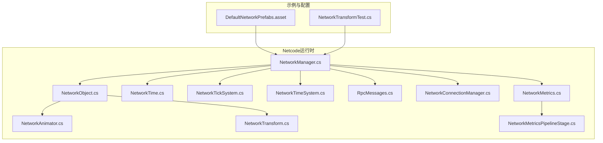
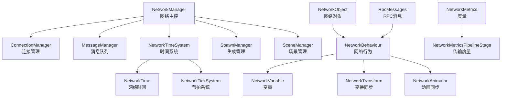
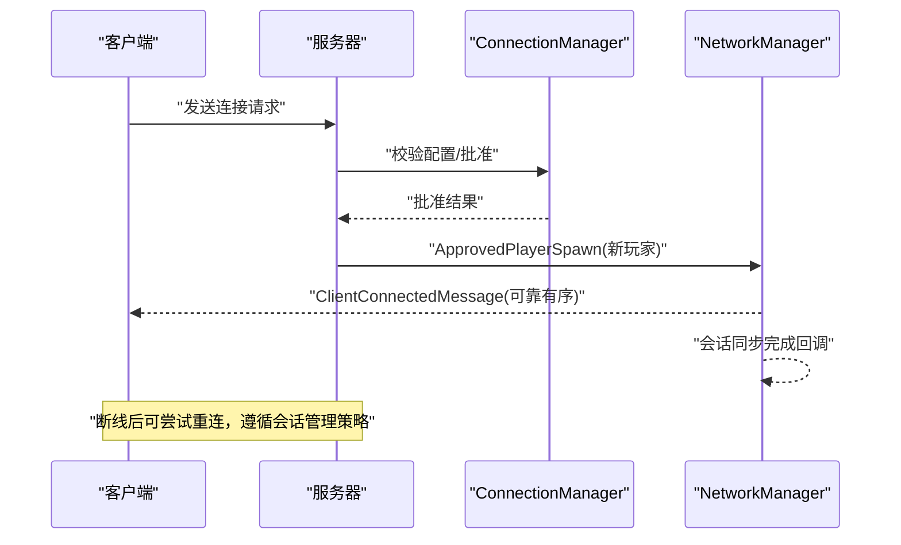
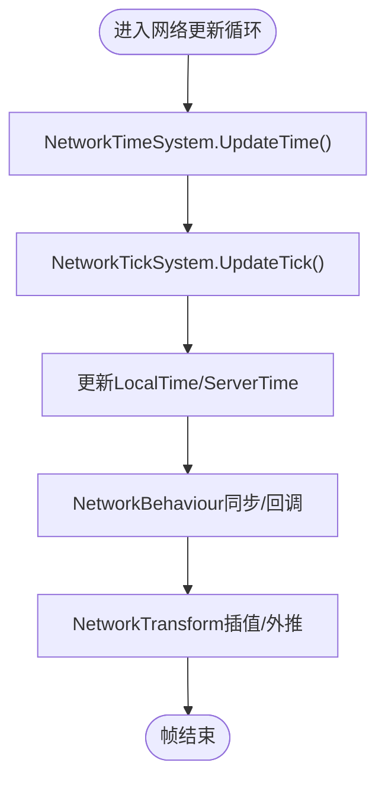
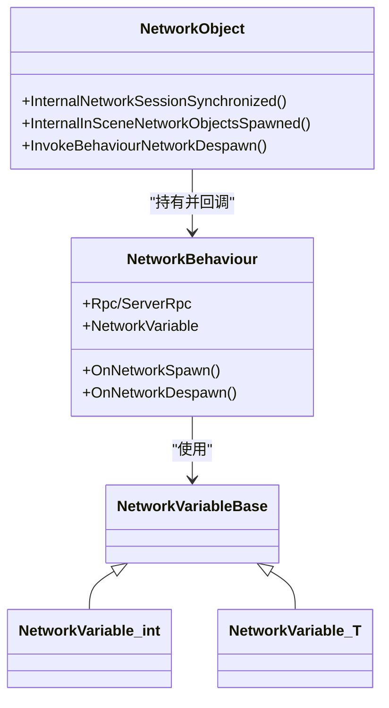
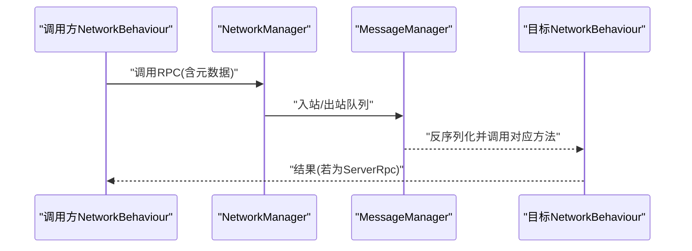
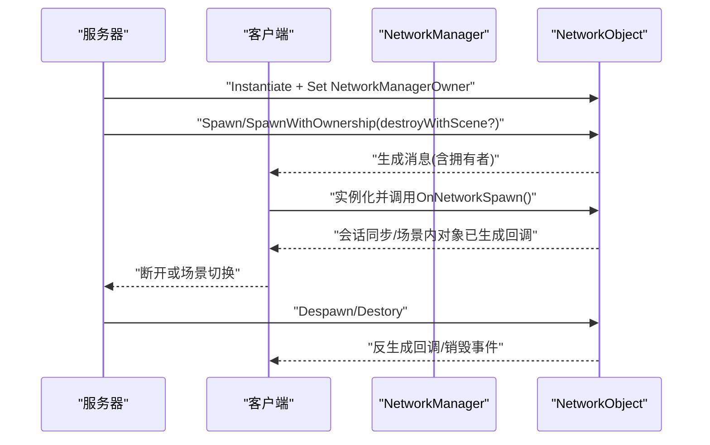
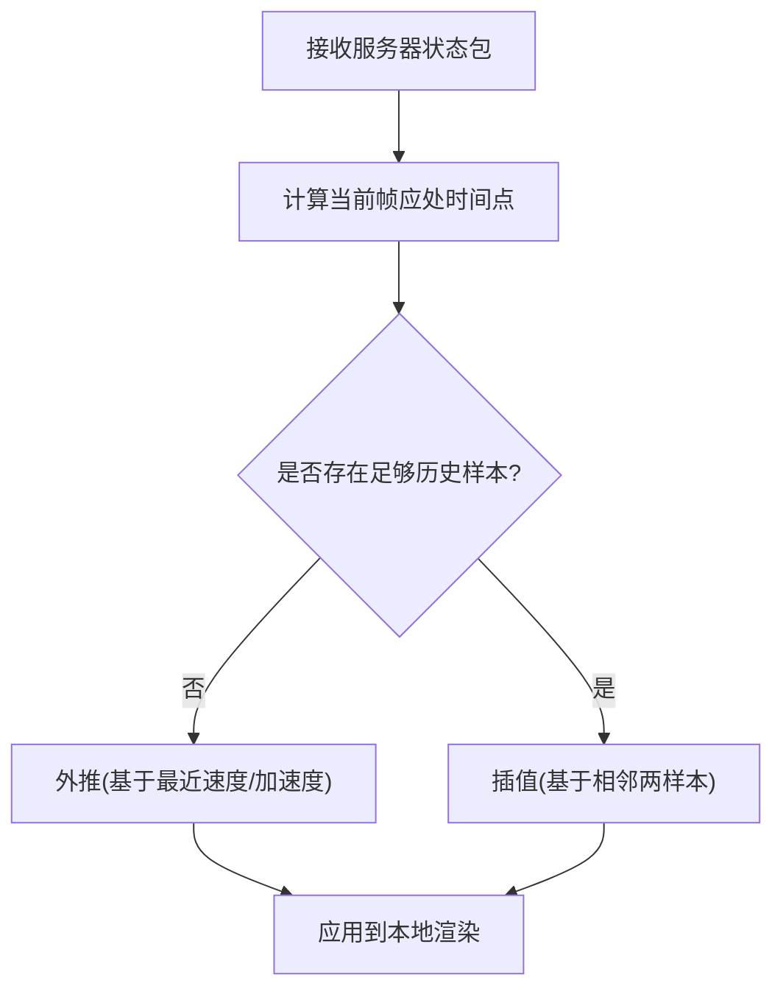
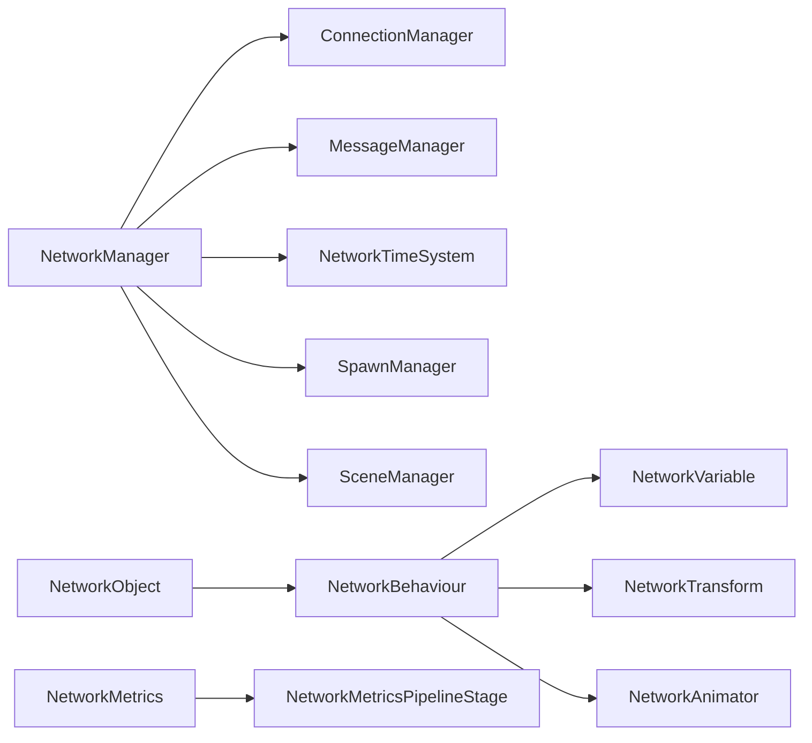

# 网络同步模块

<cite>
**本文引用的文件**
- [NetworkObject.cs](file://LocalPackages/com.unity.netcode.gameobjects@1.14.1/Runtime/Core/NetworkObject.cs)
- [NetworkManager.cs](file://LocalPackages/com.unity.netcode.gameobjects@1.14.1/Runtime/Core/NetworkManager.cs)
- [NetworkTime.cs](file://LocalPackages/com.unity.netcode.gameobjects@1.14.1/Runtime/Timing/NetworkTime.cs)
- [NetworkTickSystem.cs](file://LocalPackages/com.unity.netcode.gameobjects@1.14.1/Runtime/Timing/NetworkTickSystem.cs)
- [NetworkTimeSystem.cs](file://LocalPackages/com.unity.netcode.gameobjects@1.14.1/Runtime/Timing/NetworkTimeSystem.cs)
- [NetworkTransform.cs](file://LocalPackages/com.unity.netcode.gameobjects@1.14.1/Components/NetworkTransform.cs)
- [NetworkAnimator.cs](file://LocalPackages/com.unity.netcode.gameobjects@1.14.1/Components/NetworkAnimator.cs)
- [NetworkVariable.md](file://LocalPackages/com.unity.netcode.gameobjects@1.14.1/Documentation~/basics/networkvariable.md)
- [custom-networkvariables.md](file://LocalPackages/com.unity.netcode.gameobjects@1.14.1/Documentation~/basics/custom-networkvariables.md)
- [dealing-with-latency.md](file://LocalPackages/com.unity.netcode.gameobjects@1.14.1/Documentation~/learn/dealing-with-latency.md)
- [NetworkTransformTest.cs](file://Assets/Dev/NetcodeTest/Scripts/NetworkTransformTest.cs)
- [DefaultNetworkPrefabs.asset](file://Assets/DefaultNetworkPrefabs.asset)
- [RpcMessages.cs](file://LocalPackages/com.unity.netcode.gameobjects@1.14.1/Runtime/Messaging/Messages/RpcMessages.cs)
- [NetworkConnectionManager.cs](file://LocalPackages/com.unity.netcode.gameobjects@1.14.1/Runtime/Connection/NetworkConnectionManager.cs)
- [NetworkMetrics.cs](file://LocalPackages/com.unity.netcode.gameobjects@1.14.1/Runtime/Metrics/NetworkMetrics.cs)
- [NetworkMetricsPipelineStage.cs](file://LocalPackages/com.unity.netcode.gameobjects@1.14.1/Runtime/Transports/UTP/NetworkMetricsPipelineStage.cs)
- [session-management-landing.md](file://LocalPackages/com.unity.netcode.gameobjects@1.14.1/Documentation~/session-management-landing.md)
- [reconnecting-mid-game.md](file://LocalPackages/com.unity.netcode.gameobjects@1.14.1/Documentation~/advanced-topics/reconnecting-mid-game.md)
- [testing_client_connection_management.md](file://LocalPackages/com.unity.netcode.gameobjects@1.14.1/Documentation~/tutorials/testing/testing_client_connection_management.md)
- [RttMetricsTests.cs](file://LocalPackages/com.unity.netcode.gameobjects@1.14.1/Tests/Runtime/Metrics/RttMetricsTests.cs)
</cite>

## 目录
1. [引言](#引言)
2. [项目结构](#项目结构)
3. [核心组件](#核心组件)
4. [架构总览](#架构总览)
5. [详细组件分析](#详细组件分析)
6. [依赖关系分析](#依赖关系分析)
7. [性能考量](#性能考量)
8. [故障排除指南](#故障排除指南)
9. [结论](#结论)
10. [附录](#附录)

## 引言
本文件面向ProjectR项目的网络同步模块，系统化阐述基于Unity Netcode（Netcode for GameObjects）的多人游戏网络架构与实现原理。内容覆盖客户端-服务器通信模式、状态同步机制、消息传输协议、网络时间同步、预测与插值算法，并提供最佳实践（网络优化、延迟处理、断线重连）、具体流程示例（网络对象创建、同步与销毁）以及性能指标与故障排除方法。

## 项目结构
ProjectR仓库中与网络同步直接相关的核心代码位于本地包路径LocalPackages/com.unity.netcode.gameobjects@1.14.1，同时在Assets/Dev/NetcodeTest下提供了示例脚本NetworkTransformTest.cs用于演示NetworkBehaviour的基本用法；默认网络预制体列表由Assets/DefaultNetworkPrefabs.asset定义。

**图表来源**
- [NetworkManager.cs:1-200](file://LocalPackages/com.unity.netcode.gameobjects@1.14.1/Runtime/Core/NetworkManager.cs#L1-L200)
- [NetworkObject.cs:1451-1496](file://LocalPackages/com.unity.netcode.gameobjects@1.14.1/Runtime/Core/NetworkObject.cs#L1451-L1496)
- [NetworkTime.cs:1-208](file://LocalPackages/com.unity.netcode.gameobjects@1.14.1/Runtime/Timing/NetworkTime.cs#L1-L208)
- [NetworkTickSystem.cs:60-90](file://LocalPackages/com.unity.netcode.gameobjects@1.14.1/Runtime/Timing/NetworkTickSystem.cs#L60-L90)
- [NetworkTimeSystem.cs:57-112](file://LocalPackages/com.unity.netcode.gameobjects@1.14.1/Runtime/Timing/NetworkTimeSystem.cs#L57-L112)
- [NetworkAnimator.cs](file://LocalPackages/com.unity.netcode.gameobjects@1.14.1/Components/NetworkAnimator.cs)
- [NetworkTransform.cs](file://LocalPackages/com.unity.netcode.gameobjects@1.14.1/Components/NetworkTransform.cs)
- [RpcMessages.cs:73-113](file://LocalPackages/com.unity.netcode.gameobjects@1.14.1/Runtime/Messaging/Messages/RpcMessages.cs#L73-L113)
- [NetworkConnectionManager.cs:871-1160](file://LocalPackages/com.unity.netcode.gameobjects@1.14.1/Runtime/Connection/NetworkConnectionManager.cs#L871-L1160)
- [NetworkMetrics.cs:52-104](file://LocalPackages/com.unity.netcode.gameobjects@1.14.1/Runtime/Metrics/NetworkMetrics.cs#L52-L104)
- [NetworkMetricsPipelineStage.cs:25-56](file://LocalPackages/com.unity.netcode.gameobjects@1.14.1/Runtime/Transports/UTP/NetworkMetricsPipelineStage.cs#L25-L56)
- [DefaultNetworkPrefabs.asset:1-22](file://Assets/DefaultNetworkPrefabs.asset#L1-L22)
- [NetworkTransformTest.cs:1-16](file://Assets/Dev/NetcodeTest/Scripts/NetworkTransformTest.cs#L1-L16)

**章节来源**
- [NetworkManager.cs:1-200](file://LocalPackages/com.unity.netcode.gameobjects@1.14.1/Runtime/Core/NetworkManager.cs#L1-L200)
- [DefaultNetworkPrefabs.asset:1-22](file://Assets/DefaultNetworkPrefabs.asset#L1-L22)
- [NetworkTransformTest.cs:1-16](file://Assets/Dev/NetcodeTest/Scripts/NetworkTransformTest.cs#L1-L16)

## 核心组件
- NetworkManager：网络系统入口，负责连接管理、消息调度、时间系统更新、场景管理、度量统计等。其NetworkUpdate按阶段驱动整个网络循环。
- NetworkObject：网络对象基类，承载网络生命周期（生成/销毁）、父子关系、观察者可见性、行为回调（如会话同步完成、场景内对象已生成）等。
- NetworkBehaviour：所有网络行为的基类，提供RPC、NetworkVariable、预测与抗延迟特性等能力。
- NetworkVariable：可变状态容器，支持增量/全量序列化，适用于血量、分数、位置等需要跨网络同步的状态。
- NetworkTransform/NetworkAnimator：专门的状态同步组件，提供基于时间戳的插值、外推与抗延迟预测。
- NetworkTime/NetworkTickSystem/NetworkTimeSystem：网络时间模型与节拍系统，统一服务器与客户端的时间基准，支撑同步与插值。
- RPC消息：通过消息系统分发RPC调用，支持服务端/客户端RPC及参数校验。
- 连接与会话：NetworkConnectionManager负责连接建立、断开、批准与玩家生成；会话管理与断线重连由文档与测试用例提供指导。

**章节来源**
- [NetworkManager.cs:48-111](file://LocalPackages/com.unity.netcode.gameobjects@1.14.1/Runtime/Core/NetworkManager.cs#L48-L111)
- [NetworkObject.cs:1451-1496](file://LocalPackages/com.unity.netcode.gameobjects@1.14.1/Runtime/Core/NetworkObject.cs#L1451-L1496)
- [NetworkVariable.md:86-136](file://LocalPackages/com.unity.netcode.gameobjects@1.14.1/Documentation~/basics/networkvariable.md#L86-L136)
- [custom-networkvariables.md:71-232](file://LocalPackages/com.unity.netcode.gameobjects@1.14.1/Documentation~/basics/custom-networkvariables.md#L71-L232)
- [NetworkTransform.cs](file://LocalPackages/com.unity.netcode.gameobjects@1.14.1/Components/NetworkTransform.cs)
- [NetworkAnimator.cs](file://LocalPackages/com.unity.netcode.gameobjects@1.14.1/Components/NetworkAnimator.cs)
- [NetworkTime.cs:1-208](file://LocalPackages/com.unity.netcode.gameobjects@1.14.1/Runtime/Timing/NetworkTime.cs#L1-L208)
- [NetworkTickSystem.cs:60-90](file://LocalPackages/com.unity.netcode.gameobjects@1.14.1/Runtime/Timing/NetworkTickSystem.cs#L60-L90)
- [NetworkTimeSystem.cs:57-112](file://LocalPackages/com.unity.netcode.gameobjects@1.14.1/Runtime/Timing/NetworkTimeSystem.cs#L57-L112)
- [RpcMessages.cs:73-113](file://LocalPackages/com.unity.netcode.gameobjects@1.14.1/Runtime/Messaging/Messages/RpcMessages.cs#L73-L113)
- [NetworkConnectionManager.cs:871-1160](file://LocalPackages/com.unity.netcode.gameobjects@1.14.1/Runtime/Connection/NetworkConnectionManager.cs#L871-L1160)

## 架构总览
下图展示了从NetworkManager到各子系统的交互关系，以及网络时间、消息与对象生命周期的关键节点。

**图表来源**
- [NetworkManager.cs:48-111](file://LocalPackages/com.unity.netcode.gameobjects@1.14.1/Runtime/Core/NetworkManager.cs#L48-L111)
- [NetworkObject.cs:1451-1496](file://LocalPackages/com.unity.netcode.gameobjects@1.14.1/Runtime/Core/NetworkObject.cs#L1451-L1496)
- [NetworkTime.cs:1-208](file://LocalPackages/com.unity.netcode.gameobjects@1.14.1/Runtime/Timing/NetworkTime.cs#L1-L208)
- [NetworkTickSystem.cs:60-90](file://LocalPackages/com.unity.netcode.gameobjects@1.14.1/Runtime/Timing/NetworkTickSystem.cs#L60-L90)
- [NetworkTimeSystem.cs:57-112](file://LocalPackages/com.unity.netcode.gameobjects@1.14.1/Runtime/Timing/NetworkTimeSystem.cs#L57-L112)
- [RpcMessages.cs:73-113](file://LocalPackages/com.unity.netcode.gameobjects@1.14.1/Runtime/Messaging/Messages/RpcMessages.cs#L73-L113)
- [NetworkMetrics.cs:52-104](file://LocalPackages/com.unity.netcode.gameobjects@1.14.1/Runtime/Metrics/NetworkMetrics.cs#L52-L104)
- [NetworkMetricsPipelineStage.cs:25-56](file://LocalPackages/com.unity.netcode.gameobjects@1.14.1/Runtime/Transports/UTP/NetworkMetricsPipelineStage.cs#L25-L56)

## 详细组件分析

### 客户端-服务器通信与会话管理
- 连接建立与批准：客户端发起连接请求，服务器进行配置校验与批准，随后向客户端广播新连接事件并生成玩家对象。
- 会话同步：当会话就绪后，通知所有NetworkBehaviour执行会话同步回调，确保状态一致性。
- 断线与重连：支持在游戏过程中断线重连，需结合会话管理与场景同步策略避免重复加载或状态错配。

**图表来源**
- [NetworkConnectionManager.cs:871-1160](file://LocalPackages/com.unity.netcode.gameobjects@1.14.1/Runtime/Connection/NetworkConnectionManager.cs#L871-L1160)
- [NetworkObject.cs:1458-1478](file://LocalPackages/com.unity.netcode.gameobjects@1.14.1/Runtime/Core/NetworkObject.cs#L1458-L1478)
- [reconnecting-mid-game.md:1-74](file://LocalPackages/com.unity.netcode.gameobjects@1.14.1/Documentation~/advanced-topics/reconnecting-mid-game.md#L1-L74)

**章节来源**
- [NetworkConnectionManager.cs:871-1160](file://LocalPackages/com.unity.netcode.gameobjects@1.14.1/Runtime/Connection/NetworkConnectionManager.cs#L871-L1160)
- [NetworkObject.cs:1458-1478](file://LocalPackages/com.unity.netcode.gameobjects@1.14.1/Runtime/Core/NetworkObject.cs#L1458-L1478)
- [session-management-landing.md:1-8](file://LocalPackages/com.unity.netcode.gameobjects@1.14.1/Documentation~/session-management-landing.md#L1-L8)
- [reconnecting-mid-game.md:1-74](file://LocalPackages/com.unity.netcode.gameobjects@1.14.1/Documentation~/advanced-topics/reconnecting-mid-game.md#L1-L74)

### 网络时间同步、预测与插值
- 网络时间模型：NetworkTime以“整数节拍+小数偏移”的方式表示时间，提供固定时间与固定增量，替代Unity的Time API用于多端确定性。
- 节拍系统：NetworkTickSystem根据本地与服务器时间推进节拍，驱动网络更新循环。
- 时间系统：NetworkTimeSystem维护本地与服务器时间偏移、缓冲区与硬追赶阈值，平滑时间漂移。
- 预测与插值：文档明确输入预测、世界预测与外推的概念；NetworkTransform提供基于节拍的外推与插值，缓解RTT带来的视觉滞后。

**图表来源**
- [NetworkTime.cs:1-208](file://LocalPackages/com.unity.netcode.gameobjects@1.14.1/Runtime/Timing/NetworkTime.cs#L1-L208)
- [NetworkTickSystem.cs:60-90](file://LocalPackages/com.unity.netcode.gameobjects@1.14.1/Runtime/Timing/NetworkTickSystem.cs#L60-L90)
- [NetworkTimeSystem.cs:57-112](file://LocalPackages/com.unity.netcode.gameobjects@1.14.1/Runtime/Timing/NetworkTimeSystem.cs#L57-L112)
- [dealing-with-latency.md:169-187](file://LocalPackages/com.unity.netcode.gameobjects@1.14.1/Documentation~/learn/dealing-with-latency.md#L169-L187)

**章节来源**
- [NetworkTime.cs:1-208](file://LocalPackages/com.unity.netcode.gameobjects@1.14.1/Runtime/Timing/NetworkTime.cs#L1-L208)
- [NetworkTickSystem.cs:60-90](file://LocalPackages/com.unity.netcode.gameobjects@1.14.1/Runtime/Timing/NetworkTickSystem.cs#L60-L90)
- [NetworkTimeSystem.cs:57-112](file://LocalPackages/com.unity.netcode.gameobjects@1.14.1/Runtime/Timing/NetworkTimeSystem.cs#L57-L112)
- [dealing-with-latency.md:169-187](file://LocalPackages/com.unity.netcode.gameobjects@1.14.1/Documentation~/learn/dealing-with-latency.md#L169-L187)

### NetworkObject、NetworkBehaviour与NetworkVariable
- NetworkObject生命周期：包含生成、会话同步、场景内对象已生成、反生成与销毁等回调，确保行为层正确初始化与清理。
- NetworkBehaviour：作为所有网络行为的基类，提供RPC、NetworkVariable、输入预测与抗延迟等能力。
- NetworkVariable：内置多种类型，支持完整状态与增量差异序列化；可扩展自定义类型以满足复杂状态同步需求。

**图表来源**
- [NetworkObject.cs:1451-1496](file://LocalPackages/com.unity.netcode.gameobjects@1.14.1/Runtime/Core/NetworkObject.cs#L1451-L1496)
- [NetworkVariable.md:86-136](file://LocalPackages/com.unity.netcode.gameobjects@1.14.1/Documentation~/basics/networkvariable.md#L86-L136)
- [custom-networkvariables.md:71-232](file://LocalPackages/com.unity.netcode.gameobjects@1.14.1/Documentation~/basics/custom-networkvariables.md#L71-L232)

**章节来源**
- [NetworkObject.cs:1451-1496](file://LocalPackages/com.unity.netcode.gameobjects@1.14.1/Runtime/Core/NetworkObject.cs#L1451-L1496)
- [NetworkVariable.md:86-136](file://LocalPackages/com.unity.netcode.gameobjects@1.14.1/Documentation~/basics/networkvariable.md#L86-L136)
- [custom-networkvariables.md:71-232](file://LocalPackages/com.unity.netcode.gameobjects@1.14.1/Documentation~/basics/custom-networkvariables.md#L71-L232)

### 消息传输协议与RPC
- RPC消息：通过元数据定位目标NetworkBehaviour与方法，序列化参数并通过消息系统投递；异常会被捕获并记录以便调试。
- 消息队列：NetworkManager在不同阶段处理入站/出站消息，保证顺序与可靠性。

**图表来源**
- [RpcMessages.cs:73-113](file://LocalPackages/com.unity.netcode.gameobjects@1.14.1/Runtime/Messaging/Messages/RpcMessages.cs#L73-L113)
- [NetworkManager.cs:48-111](file://LocalPackages/com.unity.netcode.gameobjects@1.14.1/Runtime/Core/NetworkManager.cs#L48-L111)

**章节来源**
- [RpcMessages.cs:73-113](file://LocalPackages/com.unity.netcode.gameobjects@1.14.1/Runtime/Messaging/Messages/RpcMessages.cs#L73-L113)
- [NetworkManager.cs:48-111](file://LocalPackages/com.unity.netcode.gameobjects@1.14.1/Runtime/Core/NetworkManager.cs#L48-L111)

### 网络对象创建、同步与销毁流程示例
以下示例展示如何在服务器上创建网络对象并在客户端上自动同步与销毁：

- 服务器端：实例化NetworkObject并调用Spawn/SpawnWithOwnership，指定拥有者与是否随场景销毁。
- 客户端：当连接建立后，服务器会向客户端广播生成消息，客户端自动实例化并调用OnNetworkSpawn。
- 销毁：调用NetworkObject的Despawn或Destroy，触发反生成回调与销毁事件。

**图表来源**
- [NetcodeIntegrationTest.cs:1664-1708](file://LocalPackages/com.unity.netcode.gameobjects@1.14.1/TestHelpers/Runtime/NetcodeIntegrationTest.cs#L1664-L1708)
- [NetworkObject.cs:1451-1496](file://LocalPackages/com.unity.netcode.gameobjects@1.14.1/Runtime/Core/NetworkObject.cs#L1451-L1496)

**章节来源**
- [NetcodeIntegrationTest.cs:1664-1708](file://LocalPackages/com.unity.netcode.gameobjects@1.14.1/TestHelpers/Runtime/NetcodeIntegrationTest.cs#L1664-L1708)
- [NetworkObject.cs:1451-1496](file://LocalPackages/com.unity.netcode.gameobjects@1.14.1/Runtime/Core/NetworkObject.cs#L1451-L1496)

### NetworkTransform与NetworkAnimator的同步机制
- NetworkTransform：基于时间戳与节拍的外推与插值，减少RTT导致的视觉滞后；适合位置、旋转、缩放等连续状态。
- NetworkAnimator：同步动画状态与参数，配合NetworkTransform实现流畅的角色表现。

**图表来源**
- [dealing-with-latency.md:169-187](file://LocalPackages/com.unity.netcode.gameobjects@1.14.1/Documentation~/learn/dealing-with-latency.md#L169-L187)
- [NetworkTransform.cs](file://LocalPackages/com.unity.netcode.gameobjects@1.14.1/Components/NetworkTransform.cs)

**章节来源**
- [dealing-with-latency.md:169-187](file://LocalPackages/com.unity.netcode.gameobjects@1.14.1/Documentation~/learn/dealing-with-latency.md#L169-L187)
- [NetworkTransform.cs](file://LocalPackages/com.unity.netcode.gameobjects@1.14.1/Components/NetworkTransform.cs)

## 依赖关系分析
- 组件耦合：NetworkManager是中枢，依赖ConnectionManager、MessageManager、TimeSystem、SpawnManager与SceneManager；NetworkObject持有多个NetworkBehaviour并驱动其生命周期回调。
- 外部依赖：传输层（UTP）通过NetworkMetricsPipelineStage注入度量统计；度量系统由NetworkMetrics聚合并上报。
- 循环依赖：核心逻辑避免直接循环依赖，通过消息与回调解耦。

**图表来源**
- [NetworkManager.cs:48-111](file://LocalPackages/com.unity.netcode.gameobjects@1.14.1/Runtime/Core/NetworkManager.cs#L48-L111)
- [NetworkObject.cs:1451-1496](file://LocalPackages/com.unity.netcode.gameobjects@1.14.1/Runtime/Core/NetworkObject.cs#L1451-L1496)
- [NetworkMetrics.cs:52-104](file://LocalPackages/com.unity.netcode.gameobjects@1.14.1/Runtime/Metrics/NetworkMetrics.cs#L52-L104)
- [NetworkMetricsPipelineStage.cs:25-56](file://LocalPackages/com.unity.netcode.gameobjects@1.14.1/Runtime/Transports/UTP/NetworkMetricsPipelineStage.cs#L25-L56)

**章节来源**
- [NetworkManager.cs:48-111](file://LocalPackages/com.unity.netcode.gameobjects@1.14.1/Runtime/Core/NetworkManager.cs#L48-L111)
- [NetworkObject.cs:1451-1496](file://LocalPackages/com.unity.netcode.gameobjects@1.14.1/Runtime/Core/NetworkObject.cs#L1451-L1496)
- [NetworkMetrics.cs:52-104](file://LocalPackages/com.unity.netcode.gameobjects@1.14.1/Runtime/Metrics/NetworkMetrics.cs#L52-L104)
- [NetworkMetricsPipelineStage.cs:25-56](file://LocalPackages/com.unity.netcode.gameobjects@1.14.1/Runtime/Transports/UTP/NetworkMetricsPipelineStage.cs#L25-L56)

## 性能考量
- 更新频率与节拍：合理设置TickRate与缓冲区，避免过度同步导致CPU占用上升。
- 序列化与带宽：优先使用增量NetworkVariable，减少每帧传输量；对大列表状态采用分块或差分策略。
- 插值与外推：适度的插值可提升视觉平滑，但过长的历史窗口会增加内存与计算成本。
- 度量与监控：利用NetworkMetrics与传输层Pipeline Stage统计包数、丢包率与RTT，持续优化网络参数。
- 建议
  - 降低高频率RPC数量，合并状态更新。
  - 使用对象池与预分配缓冲区，减少GC压力。
  - 在弱网环境下启用更保守的缓冲与追赶阈值。

[本节为通用建议，不直接分析具体文件]

## 故障排除指南
- 连接失败与配置不匹配：检查连接请求消息中的配置哈希，确保客户端与服务器配置一致。
- 断线重连：在断开回调中触发重连流程，注意避免非预期重连（如主动退出或被踢）。
- 测试连接管理：覆盖新会话连接、晚加入、重连等场景，验证状态复制与会话数据保持。
- RTT与丢包：通过度量系统确认RTT是否异常，逐步排查传输层与网络拓扑问题。

**章节来源**
- [ConnectionRequestMessage.cs:92-124](file://LocalPackages/com.unity.netcode.gameobjects@1.14.1/Runtime/Messaging/Messages/ConnectionRequestMessage.cs#L92-L124)
- [reconnecting-mid-game.md:33-74](file://LocalPackages/com.unity.netcode.gameobjects@1.14.1/Documentation~/advanced-topics/reconnecting-mid-game.md#L33-L74)
- [testing_client_connection_management.md:1-18](file://LocalPackages/com.unity.netcode.gameobjects@1.14.1/Documentation~/tutorials/testing/testing_client_connection_management.md#L1-L18)
- [RttMetricsTests.cs:65-88](file://LocalPackages/com.unity.netcode.gameobjects@1.14.1/Tests/Runtime/Metrics/RttMetricsTests.cs#L65-L88)

## 结论
ProjectR的网络同步模块以Netcode为核心，围绕NetworkManager构建了完整的客户端-服务器架构：通过NetworkTime/NetworkTickSystem统一时间基准，借助NetworkVariable与NetworkTransform实现高效的状态与视觉同步，配合RPC与消息系统完成命令与事件传递。结合会话管理与断线重连机制，可在复杂网络环境中维持稳定的多人体验。建议在实际项目中结合度量数据持续优化同步策略与网络参数，确保低延迟与高可靠性。

[本节为总结，不直接分析具体文件]

## 附录
- 默认网络预制体：通过DefaultNetworkPrefabs.asset集中管理默认网络预制体，便于统一配置与替换。
- 示例脚本：NetworkTransformTest.cs展示了最简的NetworkBehaviour用法，可用于快速验证网络环境。

**章节来源**
- [DefaultNetworkPrefabs.asset:1-22](file://Assets/DefaultNetworkPrefabs.asset#L1-L22)
- [NetworkTransformTest.cs:1-16](file://Assets/Dev/NetcodeTest/Scripts/NetworkTransformTest.cs#L1-L16)