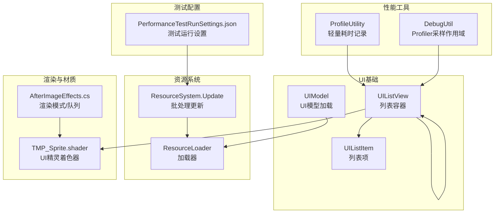
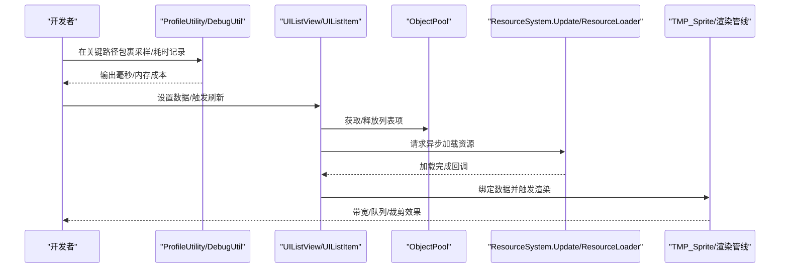
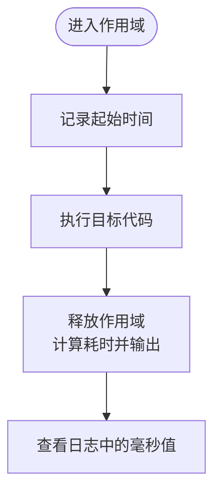
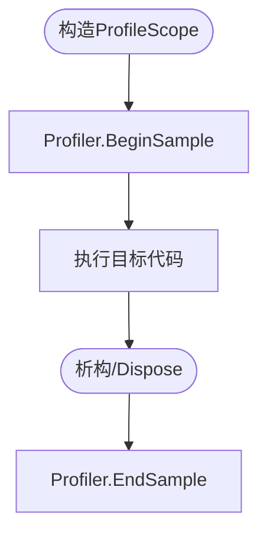
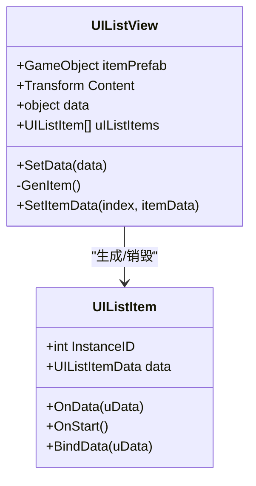
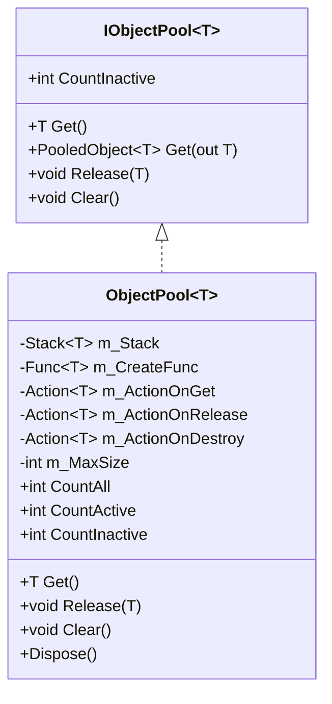
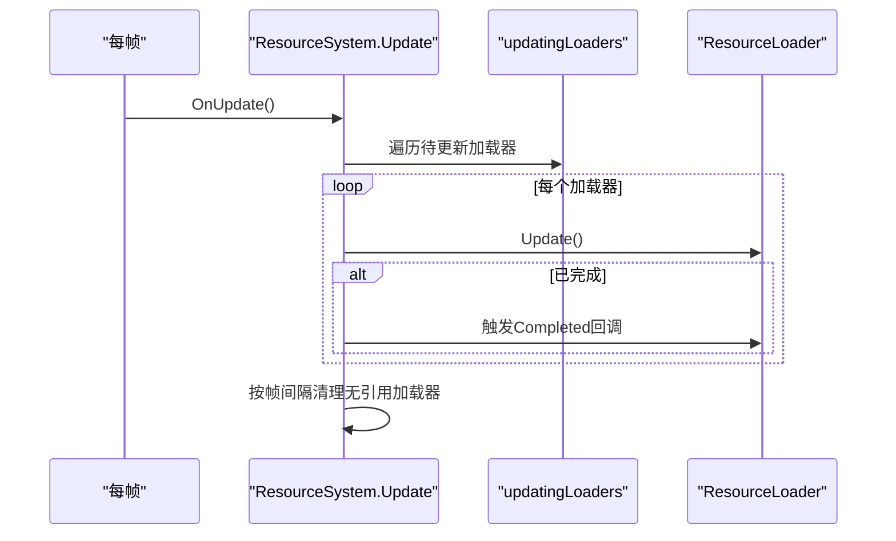
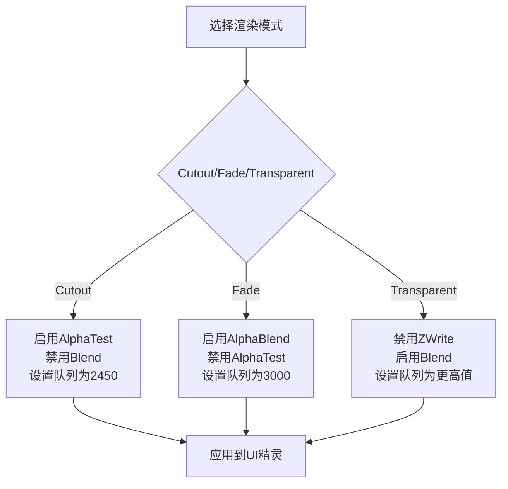
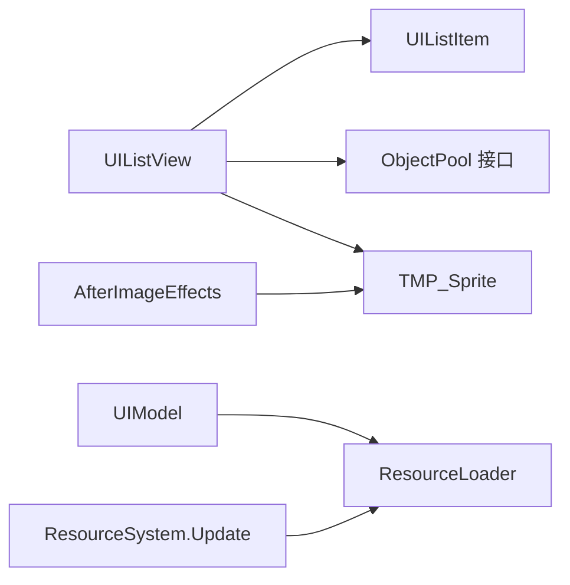

# UI性能优化与管理

<cite>
**本文引用的文件**
- [ProfileUtility.cs](file://Assets/Scripts/Profiler/ProfileUtility.cs)
- [DebugUtil.cs](file://Assets/Scripts/RuntimeEditor/DebugUtil.cs)
- [UIListView.cs](file://Assets/Scripts/UI/UIListView.cs)
- [UIListItem.cs](file://Assets/Scripts/UI/UIListItem.cs)
- [ObjectPool.cs](file://Assets/Scripts/Core/ObjectPooling/ObjectPool.cs)
- [ResourceSystem.Update.cs](file://Assets/Scripts/Systems/Implement/ResourceSystem/ResourceSystem.Update.cs)
- [ResourceLoader.cs](file://Assets/Scripts/Systems/Implement/ResourceSystem/ResourceLoader.cs)
- [UIModel.cs](file://Assets/Scripts/UI/UIModel.cs)
- [TMP_Sprite.shader](file://Assets/TextMesh Pro/Shaders/TMP_Sprite.shader)
- [AfterImageEffects.cs](file://Assets/Scripts/Modules/Entity/MeshOperation/AfterImageEffects.cs)
- [PerformanceTestRunSettings.json](file://Assets/Resources/PerformanceTestRunSettings.json)
</cite>

## 目录
1. [引言](#引言)
2. [项目结构](#项目结构)
3. [核心组件](#核心组件)
4. [架构总览](#架构总览)
5. [详细组件分析](#详细组件分析)
6. [依赖关系分析](#依赖关系分析)
7. [性能考量](#性能考量)
8. [故障排查指南](#故障排查指南)
9. [结论](#结论)
10. [附录](#附录)

## 引言
本文件面向ProjectR项目的UI性能优化与管理，系统性梳理UI系统的性能监控、优化策略与资源管理最佳实践。重点覆盖以下方面：
- 使用ProfileUtility进行性能指标采集与分析
- UI列表组件的实例化与数据绑定策略（非虚拟化）
- 资源加载与释放的批处理更新与帧级回收
- 纹理与渲染状态管理对GPU的影响
- UI组件的懒加载、按需实例化与资源回收
- 性能测试工具、基准测试方法与瓶颈诊断技巧

## 项目结构
围绕UI性能相关的关键代码分布在以下模块：
- Profiler：轻量级耗时记录工具
- RuntimeEditor：基于Unity Profiler的采样作用域
- UI：UI列表与项的基础结构
- Core/ObjectPooling：对象池接口与实现
- Systems/ResourceSystem：资源加载器与批处理更新
- TextMesh Pro：UI渲染着色器
- Modules/Entity：渲染模式与队列控制示例
- Resources：性能测试运行配置

图表来源
- [ProfileUtility.cs:1-28](file://Assets/Scripts/Profiler/ProfileUtility.cs#L1-L28)
- [DebugUtil.cs:1-34](file://Assets/Scripts/RuntimeEditor/DebugUtil.cs#L1-L34)
- [UIListView.cs:1-101](file://Assets/Scripts/UI/UIListView.cs#L1-L101)
- [UIListItem.cs:1-50](file://Assets/Scripts/UI/UIListItem.cs#L1-L50)
- [UIModel.cs:1-45](file://Assets/Scripts/UI/UIModel.cs#L1-L45)
- [ResourceSystem.Update.cs:1-108](file://Assets/Scripts/Systems/Implement/ResourceSystem/ResourceSystem.Update.cs#L1-L108)
- [ResourceLoader.cs:40-76](file://Assets/Scripts/Systems/Implement/ResourceSystem/ResourceLoader.cs#L40-L76)
- [TMP_Sprite.shader:55-116](file://Assets/TextMesh Pro/Shaders/TMP_Sprite.shader#L55-L116)
- [AfterImageEffects.cs:155-180](file://Assets/Scripts/Modules/Entity/MeshOperation/AfterImageEffects.cs#L155-L180)
- [PerformanceTestRunSettings.json:1-1](file://Assets/Resources/PerformanceTestRunSettings.json#L1-L1)

章节来源
- [ProfileUtility.cs:1-28](file://Assets/Scripts/Profiler/ProfileUtility.cs#L1-L28)
- [DebugUtil.cs:1-34](file://Assets/Scripts/RuntimeEditor/DebugUtil.cs#L1-L34)
- [UIListView.cs:1-101](file://Assets/Scripts/UI/UIListView.cs#L1-L101)
- [UIListItem.cs:1-50](file://Assets/Scripts/UI/UIListItem.cs#L1-L50)
- [UIModel.cs:1-45](file://Assets/Scripts/UI/UIModel.cs#L1-L45)
- [ResourceSystem.Update.cs:1-108](file://Assets/Scripts/Systems/Implement/ResourceSystem/ResourceSystem.Update.cs#L1-L108)
- [ResourceLoader.cs:40-76](file://Assets/Scripts/Systems/Implement/ResourceSystem/ResourceLoader.cs#L40-L76)
- [TMP_Sprite.shader:55-116](file://Assets/TextMesh Pro/Shaders/TMP_Sprite.shader#L55-L116)
- [AfterImageEffects.cs:155-180](file://Assets/Scripts/Modules/Entity/MeshOperation/AfterImageEffects.cs#L155-L180)
- [PerformanceTestRunSettings.json:1-1](file://Assets/Resources/PerformanceTestRunSettings.json#L1-L1)

## 核心组件
- ProfileUtility：提供基于时间戳的轻量耗时记录，适合在关键路径上输出毫秒级耗时日志，便于快速定位热点。
- DebugUtil：封装Profiler.BeginSample/EndSample的作用域，便于在编辑器或开发构建中对函数块进行采样统计。
- UIListView/UIListItem：UI列表容器与项的基础结构，负责根据数据集动态增删项并绑定数据。
- ObjectPool：对象池接口与实现，支持最大容量、获取/释放回调与集合重复释放检查，降低GC压力。
- ResourceSystem.Update/ResourceLoader：资源加载器的批处理更新与帧级回收逻辑，避免每帧大量同步阻塞。
- UIModel：UI模型的懒加载流程，通过协程等待加载完成后再实例化。
- TMP_Sprite.shader：UI精灵渲染着色器，支持裁剪与Alpha裁切等特性，影响绘制调用与带宽。
- AfterImageEffects：渲染模式切换与渲染队列设置，直接影响排序与GPU带宽。

章节来源
- [ProfileUtility.cs:1-28](file://Assets/Scripts/Profiler/ProfileUtility.cs#L1-L28)
- [DebugUtil.cs:1-34](file://Assets/Scripts/RuntimeEditor/DebugUtil.cs#L1-L34)
- [UIListView.cs:1-101](file://Assets/Scripts/UI/UIListView.cs#L1-L101)
- [UIListItem.cs:1-50](file://Assets/Scripts/UI/UIListItem.cs#L1-L50)
- [ObjectPool.cs:1-179](file://Assets/Scripts/Core/ObjectPooling/ObjectPool.cs#L1-L179)
- [ResourceSystem.Update.cs:1-108](file://Assets/Scripts/Systems/Implement/ResourceSystem/ResourceSystem.Update.cs#L1-L108)
- [ResourceLoader.cs:40-76](file://Assets/Scripts/Systems/Implement/ResourceSystem/ResourceLoader.cs#L40-L76)
- [UIModel.cs:1-45](file://Assets/Scripts/UI/UIModel.cs#L1-L45)
- [TMP_Sprite.shader:55-116](file://Assets/TextMesh Pro/Shaders/TMP_Sprite.shader#L55-L116)
- [AfterImageEffects.cs:155-180](file://Assets/Scripts/Modules/Entity/MeshOperation/AfterImageEffects.cs#L155-L180)

## 架构总览
UI性能优化涉及“监控—优化—资源管理—渲染—测试”闭环：
- 监控：ProfileUtility与DebugUtil用于采集关键路径耗时与内存成本
- 优化：列表项复用与按需生成、对象池减少分配
- 资源：ResourceSystem批处理更新与帧级回收，避免主线程抖动
- 渲染：合理使用着色器特性与渲染队列，减少Draw Call与带宽
- 测试：通过配置文件控制测试运行参数，结合Profiler进行回归验证

图表来源
- [ProfileUtility.cs:1-28](file://Assets/Scripts/Profiler/ProfileUtility.cs#L1-L28)
- [DebugUtil.cs:1-34](file://Assets/Scripts/RuntimeEditor/DebugUtil.cs#L1-L34)
- [UIListView.cs:1-101](file://Assets/Scripts/UI/UIListView.cs#L1-L101)
- [ObjectPool.cs:1-179](file://Assets/Scripts/Core/ObjectPooling/ObjectPool.cs#L1-L179)
- [ResourceSystem.Update.cs:1-108](file://Assets/Scripts/Systems/Implement/ResourceSystem/ResourceSystem.Update.cs#L1-L108)
- [ResourceLoader.cs:40-76](file://Assets/Scripts/Systems/Implement/ResourceSystem/ResourceLoader.cs#L40-L76)
- [TMP_Sprite.shader:55-116](file://Assets/TextMesh Pro/Shaders/TMP_Sprite.shader#L55-L116)

## 详细组件分析

### ProfileUtility使用与性能指标采集
- 使用方式：在需要测量的代码段外层包裹可释放对象，进入作用域开始计时，退出时输出耗时
- 适用场景：UI事件回调、列表刷新、资源加载完成点等
- 分析技巧：对比不同数据规模下的耗时变化，识别线性/非线性增长点；结合帧率观察是否引发掉帧

图表来源
- [ProfileUtility.cs:1-28](file://Assets/Scripts/Profiler/ProfileUtility.cs#L1-L28)

章节来源
- [ProfileUtility.cs:1-28](file://Assets/Scripts/Profiler/ProfileUtility.cs#L1-L28)

### DebugUtil的Profiler采样作用域
- 使用方式：以结构体形式包裹一段代码，进入时BeginSample，退出时EndSample
- 适用场景：函数级/片段级性能采样，便于在编辑器中查看各函数耗时占比
- 分析技巧：结合Unity Profiler窗口查看各采样区间，定位CPU热点

图表来源
- [DebugUtil.cs:1-34](file://Assets/Scripts/RuntimeEditor/DebugUtil.cs#L1-L34)

章节来源
- [DebugUtil.cs:1-34](file://Assets/Scripts/RuntimeEditor/DebugUtil.cs#L1-L34)

### UI列表组件：实例化与数据绑定
- 列表容器UIListView根据数据集动态增删项，确保项数量与数据一致
- 列表项UIListItem负责绑定数据与生命周期钩子
- 当前实现为按需生成/销毁，未见虚拟化或视口裁剪逻辑

图表来源
- [UIListView.cs:1-101](file://Assets/Scripts/UI/UIListView.cs#L1-L101)
- [UIListItem.cs:1-50](file://Assets/Scripts/UI/UIListItem.cs#L1-L50)

章节来源
- [UIListView.cs:1-101](file://Assets/Scripts/UI/UIListView.cs#L1-L101)
- [UIListItem.cs:1-50](file://Assets/Scripts/UI/UIListItem.cs#L1-L50)

### 对象池：减少分配与GC压力
- ObjectPool提供统一的对象池接口与实现，支持最大容量、获取/释放回调、销毁回调
- 通过集合重复释放检查避免错误回收，提升稳定性
- 建议将UIListItem纳入对象池管理，避免频繁Instantiate/Destroy

图表来源
- [ObjectPool.cs:1-179](file://Assets/Scripts/Core/ObjectPooling/ObjectPool.cs#L1-L179)

章节来源
- [ObjectPool.cs:1-179](file://Assets/Scripts/Core/ObjectPooling/ObjectPool.cs#L1-L179)

### 资源系统：批处理更新与帧级回收
- ResourceSystem.Update在每帧更新所有待更新的加载器，并在特定帧间隔清理无引用的加载器
- ResourceLoader支持实例化缓存与空引用清理，避免泄漏
- UIModel通过协程等待加载完成，实现UI资源的懒加载

图表来源
- [ResourceSystem.Update.cs:1-108](file://Assets/Scripts/Systems/Implement/ResourceSystem/ResourceSystem.Update.cs#L1-L108)
- [ResourceLoader.cs:40-76](file://Assets/Scripts/Systems/Implement/ResourceSystem/ResourceLoader.cs#L40-L76)
- [UIModel.cs:1-45](file://Assets/Scripts/UI/UIModel.cs#L1-L45)

章节来源
- [ResourceSystem.Update.cs:1-108](file://Assets/Scripts/Systems/Implement/ResourceSystem/ResourceSystem.Update.cs#L1-L108)
- [ResourceLoader.cs:40-76](file://Assets/Scripts/Systems/Implement/ResourceSystem/ResourceLoader.cs#L40-L76)
- [UIModel.cs:1-45](file://Assets/Scripts/UI/UIModel.cs#L1-L45)

### UI纹理优化与渲染状态管理
- TMP_Sprite.shader支持UNITY_UI_CLIP_RECT与UNITY_UI_ALPHACLIP，可在UI裁剪与Alpha裁切间权衡
- AfterImageEffects展示了渲染模式与渲染队列的切换，避免透明度与深度写入冲突导致的额外Pass与带宽

图表来源
- [TMP_Sprite.shader:55-116](file://Assets/TextMesh Pro/Shaders/TMP_Sprite.shader#L55-L116)
- [AfterImageEffects.cs:155-180](file://Assets/Scripts/Modules/Entity/MeshOperation/AfterImageEffects.cs#L155-L180)

章节来源
- [TMP_Sprite.shader:55-116](file://Assets/TextMesh Pro/Shaders/TMP_Sprite.shader#L55-L116)
- [AfterImageEffects.cs:155-180](file://Assets/Scripts/Modules/Entity/MeshOperation/AfterImageEffects.cs#L155-L180)

### UI组件懒加载、按需实例化与资源回收
- 懒加载：UIModel在Start后通过协程等待ResourceLoader完成，再进行实例化
- 按需实例化：UIListView按数据量动态生成/销毁项，建议结合对象池进一步优化
- 资源回收：ResourceSystem按帧清理无引用加载器，避免长期持有导致内存膨胀

章节来源
- [UIModel.cs:1-45](file://Assets/Scripts/UI/UIModel.cs#L1-L45)
- [UIListView.cs:1-101](file://Assets/Scripts/UI/UIListView.cs#L1-L101)
- [ResourceSystem.Update.cs:1-108](file://Assets/Scripts/Systems/Implement/ResourceSystem/ResourceSystem.Update.cs#L1-L108)

## 依赖关系分析
- UIListView依赖UIListItem与对象池接口，建议将UIListItem纳入对象池以减少分配
- UIModel依赖ResourceLoader与ResourceSystem，保证异步加载与资源回收
- 渲染管线依赖TMP_Sprite与渲染模式控制，避免不必要队列切换

图表来源
- [UIListView.cs:1-101](file://Assets/Scripts/UI/UIListView.cs#L1-L101)
- [UIListItem.cs:1-50](file://Assets/Scripts/UI/UIListItem.cs#L1-L50)
- [ObjectPool.cs:1-179](file://Assets/Scripts/Core/ObjectPooling/ObjectPool.cs#L1-L179)
- [UIModel.cs:1-45](file://Assets/Scripts/UI/UIModel.cs#L1-L45)
- [ResourceSystem.Update.cs:1-108](file://Assets/Scripts/Systems/Implement/ResourceSystem/ResourceSystem.Update.cs#L1-L108)
- [ResourceLoader.cs:40-76](file://Assets/Scripts/Systems/Implement/ResourceSystem/ResourceLoader.cs#L40-L76)
- [TMP_Sprite.shader:55-116](file://Assets/TextMesh Pro/Shaders/TMP_Sprite.shader#L55-L116)
- [AfterImageEffects.cs:155-180](file://Assets/Scripts/Modules/Entity/MeshOperation/AfterImageEffects.cs#L155-L180)

章节来源
- [UIListView.cs:1-101](file://Assets/Scripts/UI/UIListView.cs#L1-L101)
- [UIListItem.cs:1-50](file://Assets/Scripts/UI/UIListItem.cs#L1-L50)
- [ObjectPool.cs:1-179](file://Assets/Scripts/Core/ObjectPooling/ObjectPool.cs#L1-L179)
- [UIModel.cs:1-45](file://Assets/Scripts/UI/UIModel.cs#L1-L45)
- [ResourceSystem.Update.cs:1-108](file://Assets/Scripts/Systems/Implement/ResourceSystem/ResourceSystem.Update.cs#L1-L108)
- [ResourceLoader.cs:40-76](file://Assets/Scripts/Systems/Implement/ResourceSystem/ResourceLoader.cs#L40-L76)
- [TMP_Sprite.shader:55-116](file://Assets/TextMesh Pro/Shaders/TMP_Sprite.shader#L55-L116)
- [AfterImageEffects.cs:155-180](file://Assets/Scripts/Modules/Entity/MeshOperation/AfterImageEffects.cs#L155-L180)

## 性能考量
- 列表渲染：当前实现为按需生成/销毁，建议引入虚拟化（视口裁剪+池化）以降低节点数量与布局开销
- 内存分配：优先使用对象池复用UIListItem，减少GC压力与分配抖动
- 资源加载：保持ResourceSystem批处理更新与帧级回收策略，避免单帧大量同步操作
- 纹理与渲染：合理选择渲染模式与队列，减少不必要的Alpha混合与深度写入
- 监控与测试：结合ProfileUtility/DebugUtil与Unity Profiler进行持续监控，利用测试配置文件进行回归验证

## 故障排查指南
- 列表卡顿：使用ProfileUtility标注列表刷新路径，观察数据规模与耗时关系；考虑引入虚拟化与对象池
- UI闪烁/错位：检查TMP_Sprite的裁剪与Alpha裁切开关，确认渲染队列设置与透明度混合顺序
- 内存上涨：核查ResourceSystem的帧级回收是否生效，确认ResourceLoader的实例化缓存清理逻辑
- 加载延迟：确认UIModel的协程流程与ResourceLoader完成回调是否正确触发

章节来源
- [ProfileUtility.cs:1-28](file://Assets/Scripts/Profiler/ProfileUtility.cs#L1-L28)
- [DebugUtil.cs:1-34](file://Assets/Scripts/RuntimeEditor/DebugUtil.cs#L1-L34)
- [UIListView.cs:1-101](file://Assets/Scripts/UI/UIListView.cs#L1-L101)
- [TMP_Sprite.shader:55-116](file://Assets/TextMesh Pro/Shaders/TMP_Sprite.shader#L55-L116)
- [ResourceSystem.Update.cs:1-108](file://Assets/Scripts/Systems/Implement/ResourceSystem/ResourceSystem.Update.cs#L1-L108)
- [ResourceLoader.cs:40-76](file://Assets/Scripts/Systems/Implement/ResourceSystem/ResourceLoader.cs#L40-L76)
- [UIModel.cs:1-45](file://Assets/Scripts/UI/UIModel.cs#L1-L45)

## 结论
ProjectR的UI性能优化应围绕“可观测—可优化—可治理”的闭环展开：以ProfileUtility与DebugUtil为观测入口，结合对象池与批处理资源系统，配合合理的渲染状态与纹理策略，最终形成可量化的性能基线与回归保障。

## 附录
- 性能测试运行配置：通过PerformanceTestRunSettings.json控制测试运行参数，建议在CI中集成Profiler导出与回归阈值校验

章节来源
- [PerformanceTestRunSettings.json:1-1](file://Assets/Resources/PerformanceTestRunSettings.json#L1-L1)