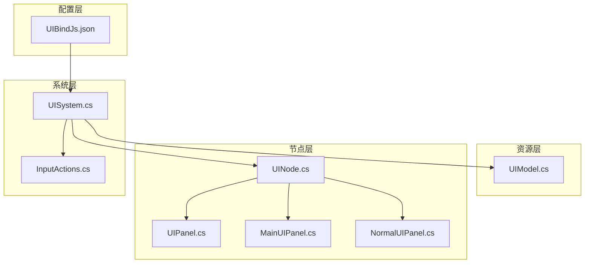
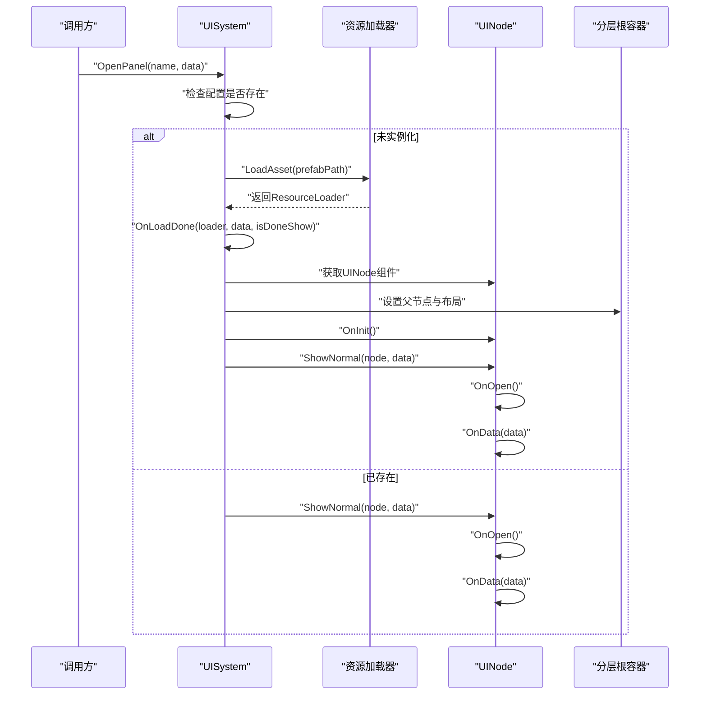
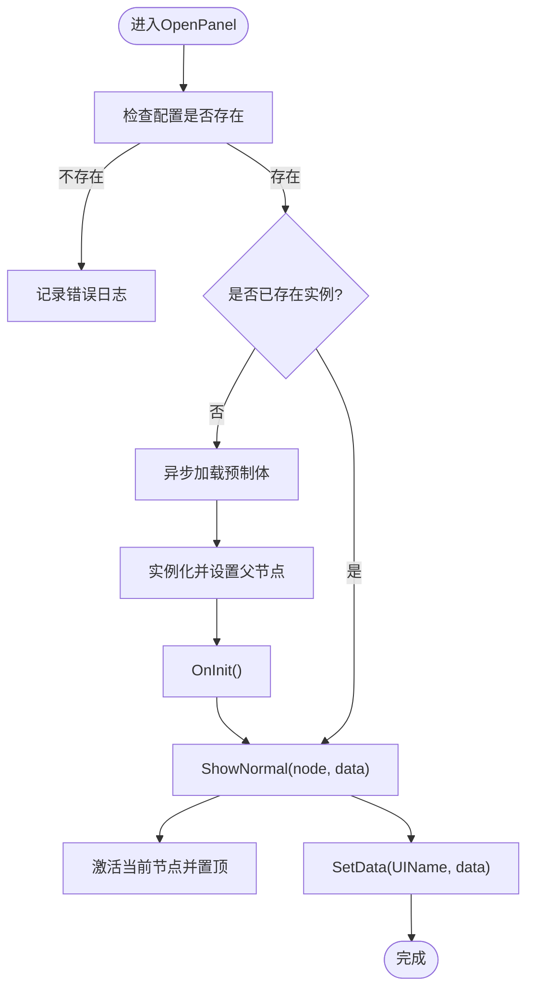
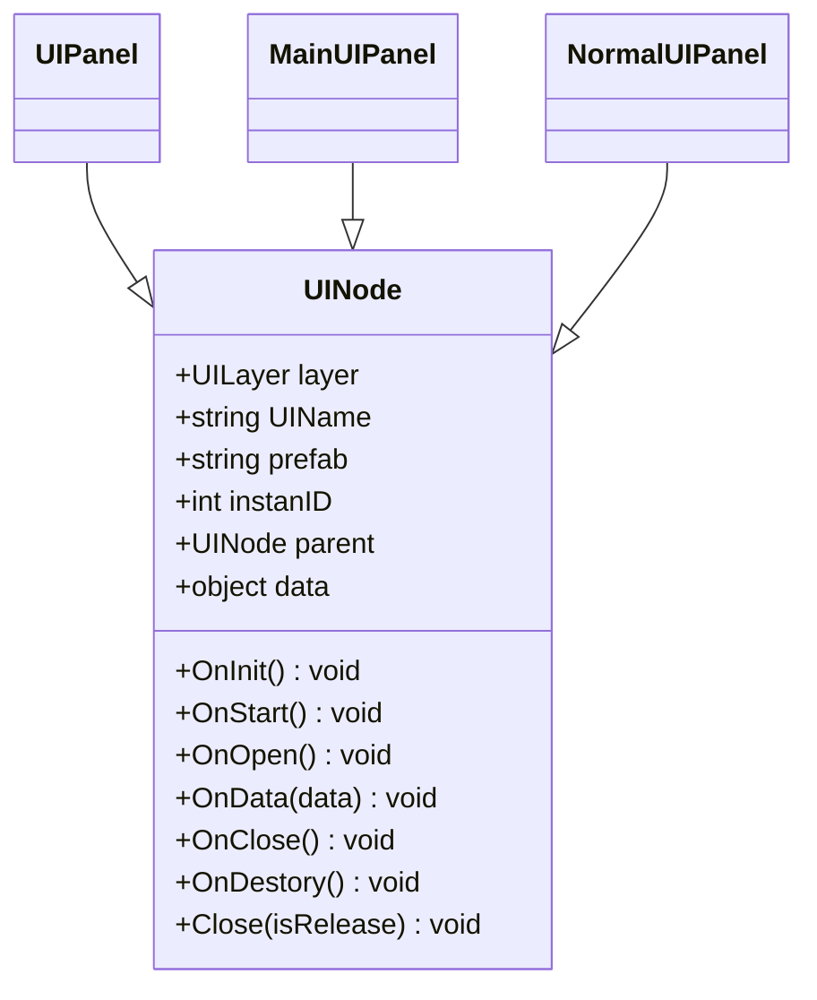
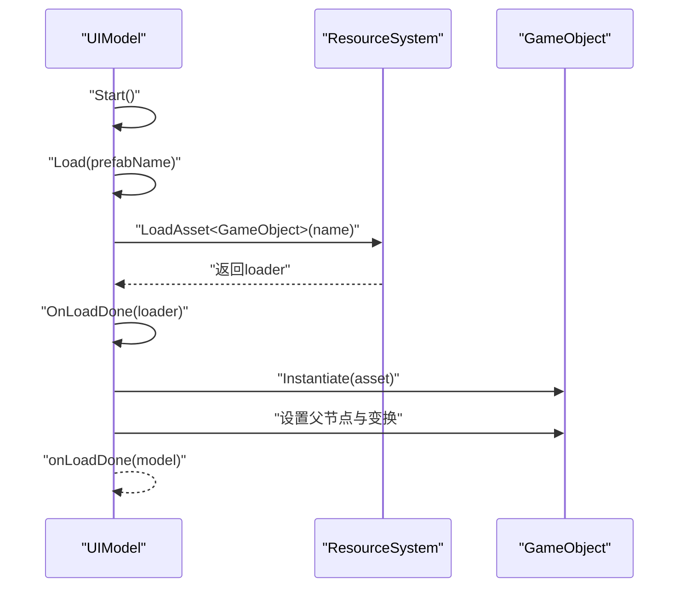
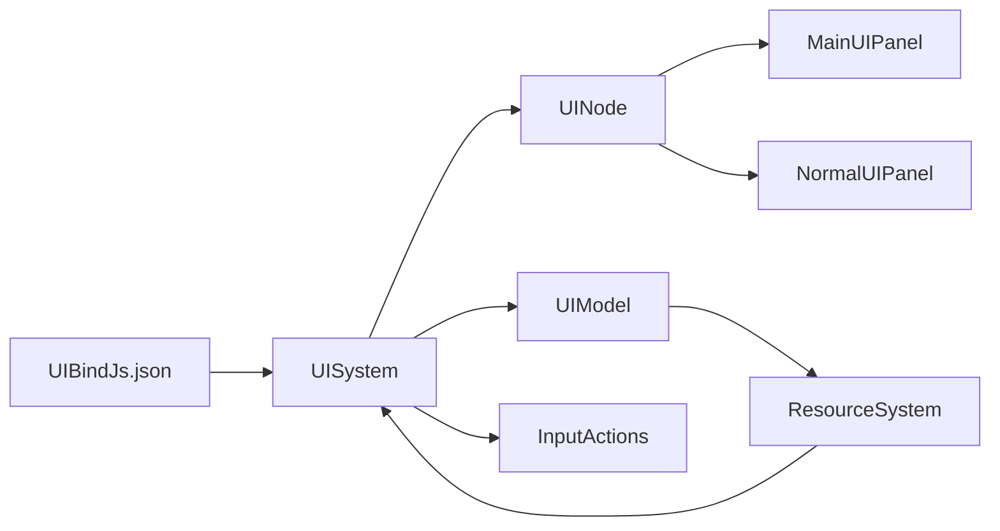

# UI绑定与数据管理

<cite>
**本文引用的文件**
- [UIBindJs.json](file://Assets/Scripts/UI/UIBindJs.json)
- [UIModel.cs](file://Assets/Scripts/UI/UIModel.cs)
- [UINode.cs](file://Assets/Scripts/UI/UINode.cs)
- [UIPanel.cs](file://Assets/Scripts/UI/UIPanel.cs)
- [UISystem.cs](file://Assets/Scripts/Systems/Implement/UISystem/UISystem.cs)
- [MainUIPanel.cs](file://Assets/Scripts/UI/MainUI/MainUIPanel.cs)
- [NormalUIPanel.cs](file://Assets/Scripts/UI/NormalUIPanel.cs)
- [InputActions.cs](file://Assets/Common/InputActions.cs)
</cite>

## 目录
1. [简介](#简介)
2. [项目结构](#项目结构)
3. [核心组件](#核心组件)
4. [架构总览](#架构总览)
5. [详细组件分析](#详细组件分析)
6. [依赖分析](#依赖分析)
7. [性能考虑](#性能考虑)
8. [故障排查指南](#故障排查指南)
9. [结论](#结论)
10. [附录](#附录)

## 简介
本文件面向ProjectR项目的UI绑定与数据管理系统，系统性阐述UI绑定机制的实现原理、数据流与事件传播路径；详解UIBindJs.json配置文件的结构、字段与使用方式；解释UIModel的数据模型设计、数据校验与状态管理；覆盖UINode节点系统的层级结构、父子关系与生命周期管理；并提供最佳实践、性能优化与错误处理策略，以及调试方法、测试技巧与常见问题解决方案。

## 项目结构
UI系统由以下关键模块构成：
- 配置层：UIBindJs.json声明UI资源与预制体映射
- 资源层：UIModel负责异步加载与实例化UI预制体
- 节点层：UINode及其派生类（如UIPanel）承载UI生命周期与数据
- 系统层：UISystem统一管理UI根节点、分层容器、打开/关闭、数据传递与事件系统集成
- 示例层：MainUIPanel、NormalUIPanel等演示典型用法

图示来源
- [UISystem.cs:38-48](file://Assets/Scripts/Systems/Implement/UISystem/UISystem.cs#L38-L48)
- [UINode.cs:9-57](file://Assets/Scripts/UI/UINode.cs#L9-L57)
- [UIPanel.cs:3](file://Assets/Scripts/UI/UIPanel.cs#L3)
- [UIBindJs.json:1-32](file://Assets/Scripts/UI/UIBindJs.json#L1-L32)
- [UIModel.cs:20-37](file://Assets/Scripts/UI/UIModel.cs#L20-L37)
- [InputActions.cs:967-1043](file://Assets/Common/InputActions.cs#L967-L1043)

章节来源
- [UISystem.cs:38-48](file://Assets/Scripts/Systems/Implement/UISystem/UISystem.cs#L38-L48)
- [UIBindJs.json:1-32](file://Assets/Scripts/UI/UIBindJs.json#L1-L32)

## 核心组件
- UISystem：单例系统，负责UI根画布、分层容器、事件系统、相机、UI打开/关闭、数据分发
- UINode：UI节点基类，定义生命周期回调、数据接收、父子关系与关闭接口
- UIPanel：UINode的空壳派生类，用于标识面板类型
- UIModel：UI资源模型，负责异步加载预制体、实例化与变换设置，并通过回调通知加载完成
- UIBindJs.json：UI资源绑定配置，键为UI名称，值包含显示名称与预制体路径

章节来源
- [UISystem.cs:21-48](file://Assets/Scripts/Systems/Implement/UISystem/UISystem.cs#L21-L48)
- [UINode.cs:9-57](file://Assets/Scripts/UI/UINode.cs#L9-L57)
- [UIPanel.cs:3](file://Assets/Scripts/UI/UIPanel.cs#L3)
- [UIModel.cs:9-60](file://Assets/Scripts/UI/UIModel.cs#L9-L60)
- [UIBindJs.json:1-32](file://Assets/Scripts/UI/UIBindJs.json#L1-L32)

## 架构总览
UI系统采用“配置驱动 + 节点生命周期 + 分层容器”的架构：
- 配置驱动：UISystem在初始化时读取UIBindJs.json，建立UI名称到预制体的映射
- 节点生命周期：每个UI节点继承UINode，通过OnInit/OnStart/OnOpen/OnData/OnClose/OnDestory等回调参与生命周期
- 分层容器：Main/Game/Top/MessageTop四层容器，按深度排列，确保层级正确
- 数据与事件：UISystem提供OpenPanel/SetData，UINode提供OnData接收数据；同时集成Unity输入系统

图示来源
- [UISystem.cs:161-178](file://Assets/Scripts/Systems/Implement/UISystem/UISystem.cs#L161-L178)
- [UISystem.cs:179-246](file://Assets/Scripts/Systems/Implement/UISystem/UISystem.cs#L179-L246)
- [UINode.cs:40-55](file://Assets/Scripts/UI/UINode.cs#L40-L55)

章节来源
- [UISystem.cs:161-246](file://Assets/Scripts/Systems/Implement/UISystem/UISystem.cs#L161-L246)
- [UINode.cs:25-55](file://Assets/Scripts/UI/UINode.cs#L25-L55)

## 详细组件分析

### UISystem系统层
- 初始化流程：读取UIBindJs.json、生成Canvas与分层根节点、创建事件系统与UI相机、触发测试入口
- 打开面板：根据UI名称查找配置，若未实例化则异步加载并实例化，随后激活到对应分层根下
- 显示逻辑：同一分层仅激活当前节点，其他节点隐藏；支持在显示时注入数据
- 关闭逻辑：可选择释放对象或仅隐藏；释放时清理字典与销毁GameObject
- 数据分发：SetData通过UI名称定位目标节点，设置data并调用OnData

图示来源
- [UISystem.cs:161-178](file://Assets/Scripts/Systems/Implement/UISystem/UISystem.cs#L161-L178)
- [UISystem.cs:115-143](file://Assets/Scripts/Systems/Implement/UISystem/UISystem.cs#L115-L143)
- [UISystem.cs:252-264](file://Assets/Scripts/Systems/Implement/UISystem/UISystem.cs#L252-L264)

章节来源
- [UISystem.cs:38-48](file://Assets/Scripts/Systems/Implement/UISystem/UISystem.cs#L38-L48)
- [UISystem.cs:115-143](file://Assets/Scripts/Systems/Implement/UISystem/UISystem.cs#L115-L143)
- [UISystem.cs:161-246](file://Assets/Scripts/Systems/Implement/UISystem/UISystem.cs#L161-L246)
- [UISystem.cs:252-264](file://Assets/Scripts/Systems/Implement/UISystem/UISystem.cs#L252-L264)

### UINode节点层
- 属性与职责：layer（分层）、UIName（唯一标识）、prefab（预制体名）、instanID（实例ID）、parent（父节点）、data（数据）
- 生命周期：OnInit（初始化实例ID）、OnStart（初始化RectTransform位置）、OnOpen/OnClose/OnDestory（打开/关闭/销毁）、OnData（接收数据）
- 关闭接口：Close(isRelease)委托给UISystem进行统一管理

图示来源
- [UINode.cs:9-57](file://Assets/Scripts/UI/UINode.cs#L9-L57)
- [UIPanel.cs:3](file://Assets/Scripts/UI/UIPanel.cs#L3)
- [MainUIPanel.cs:8](file://Assets/Scripts/UI/MainUI/MainUIPanel.cs#L8)
- [NormalUIPanel.cs:6](file://Assets/Scripts/UI/NormalUIPanel.cs#L6)

章节来源
- [UINode.cs:9-57](file://Assets/Scripts/UI/UINode.cs#L9-L57)
- [UIPanel.cs:3](file://Assets/Scripts/UI/UIPanel.cs#L3)
- [MainUIPanel.cs:8](file://Assets/Scripts/UI/MainUI/MainUIPanel.cs#L8)
- [NormalUIPanel.cs:6](file://Assets/Scripts/UI/NormalUIPanel.cs#L6)

### UIModel资源模型
- 加载流程：Start中调用Load，内部协程通过ResourceSystem异步加载指定名称的预制体
- 实例化与变换：加载完成后实例化，设置父节点、本地位置、缩放与旋转，并将子节点图层统一设置
- 回调通知：通过UnityAction<GameObject> onLoadDone在加载完成后回调上层

图示来源
- [UIModel.cs:16-19](file://Assets/Scripts/UI/UIModel.cs#L16-L19)
- [UIModel.cs:20-37](file://Assets/Scripts/UI/UIModel.cs#L20-L37)
- [UIModel.cs:38-59](file://Assets/Scripts/UI/UIModel.cs#L38-L59)

章节来源
- [UIModel.cs:16-59](file://Assets/Scripts/UI/UIModel.cs#L16-L59)

### UIBindJs.json配置文件
- 结构：顶层assets为字典，键为UI名称（如GamePanel/MainPanel），值为UIAsset对象
- 字段定义：
  - name：显示名称（用于调试与识别）
  - prefab：资源路径（用于ResourceSystem加载）
- 使用方法：UISystem在Initialize阶段读取该文件，建立UI名称到prefab的映射，供OpenPanel使用

章节来源
- [UIBindJs.json:1-32](file://Assets/Scripts/UI/UIBindJs.json#L1-L32)
- [UISystem.cs:266-277](file://Assets/Scripts/Systems/Implement/UISystem/UISystem.cs#L266-L277)

### 输入系统集成
- UISystem创建Unity事件系统与相机，保证UI交互正常
- InputActions提供UI相关输入动作（Navigate/Submit/Cancel/Point/Click/ScrollWheel/MiddleClick/RightClick），可通过AddCallbacks注册监听

章节来源
- [UISystem.cs:64-92](file://Assets/Scripts/Systems/Implement/UISystem/UISystem.cs#L64-L92)
- [InputActions.cs:967-1043](file://Assets/Common/InputActions.cs#L967-L1043)

## 依赖分析
- UISystem依赖：
  - 配置：UIBindJs.json
  - 资源：ResourceSystem（异步加载）
  - Unity：Canvas/EventSystem/Camera/RectTransform
- UINode依赖：
  - UISystem（Close委托）
  - 子类自定义UI组件（如Button）
- UIModel依赖：
  - ResourceSystem（异步加载）
  - Unity（Instantiate/Transform）

图示来源
- [UISystem.cs:38-48](file://Assets/Scripts/Systems/Implement/UISystem/UISystem.cs#L38-L48)
- [UIModel.cs:20-37](file://Assets/Scripts/UI/UIModel.cs#L20-L37)
- [InputActions.cs:967-1043](file://Assets/Common/InputActions.cs#L967-L1043)

章节来源
- [UISystem.cs:38-48](file://Assets/Scripts/Systems/Implement/UISystem/UISystem.cs#L38-L48)
- [UIModel.cs:20-37](file://Assets/Scripts/UI/UIModel.cs#L20-L37)
- [InputActions.cs:967-1043](file://Assets/Common/InputActions.cs#L967-L1043)

## 性能考虑
- 异步加载与实例化：UIModel与UISystem均采用协程异步加载，避免主线程阻塞
- 对象池与复用：建议对频繁切换的UI节点采用隐藏而非销毁，减少Instantiate/Destroy开销
- 分层渲染：通过UICamera与Canvas分层，合理设置深度，减少不必要的渲染
- 数据传递：尽量传递轻量数据对象，避免大对象频繁序列化
- 事件系统：仅在需要时启用/禁用输入动作映射，降低回调开销

## 故障排查指南
- UI无法打开
  - 检查UIBindJs.json中是否存在该UI名称
  - 检查资源路径是否正确且可被ResourceSystem加载
- 打开后不显示
  - 确认ShowNormal流程是否执行，同层其他节点是否被意外隐藏
  - 检查CanvasRoot与UICamera是否正确设置
- 数据未到达
  - 确认SetData调用时UI名称与节点UIName一致
  - 在UINode.OnData中添加断点确认是否被调用
- 加载失败
  - 查看UIModel/UISystem中的错误日志输出
  - 确认prefab名称与资源路径匹配
- 输入无响应
  - 检查EventSystem与InputActions是否正确初始化与启用

章节来源
- [UISystem.cs:174-177](file://Assets/Scripts/Systems/Implement/UISystem/UISystem.cs#L174-L177)
- [UISystem.cs:190-210](file://Assets/Scripts/Systems/Implement/UISystem/UISystem.cs#L190-L210)
- [UIModel.cs:31-44](file://Assets/Scripts/UI/UIModel.cs#L31-L44)
- [UISystem.cs:252-264](file://Assets/Scripts/Systems/Implement/UISystem/UISystem.cs#L252-L264)

## 结论
ProjectR的UI系统以配置驱动为核心，结合UINode生命周期与UISystem统一管理，形成清晰的UI绑定与数据流。通过UIBindJs.json、UINode、UIModel与UISystem的协同，实现了可扩展、可维护的UI架构。遵循本文的最佳实践与性能建议，可进一步提升系统的稳定性与运行效率。

## 附录

### 最佳实践
- 命名规范：UIName必须唯一，便于SetData与OpenPanel精准定位
- 数据设计：将UI所需数据封装为轻量数据类，继承UINodeData，便于类型安全
- 生命周期：在OnStart中完成UI组件绑定，在OnOpen中处理显示逻辑，在OnClose中清理订阅
- 资源管理：优先复用已实例化的UI节点，必要时再销毁释放

### 测试技巧
- 单元测试：针对UINode的生命周期回调与数据接收进行单元测试
- 场景测试：通过UISystem.TestEntrance快速验证主界面加载
- 日志辅助：利用LogSystem输出关键流程日志，便于定位问题