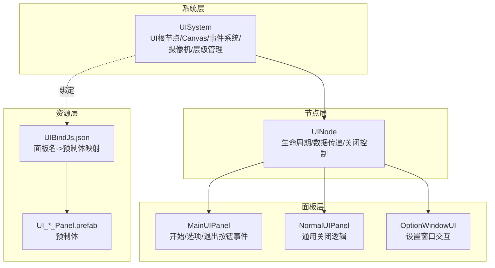
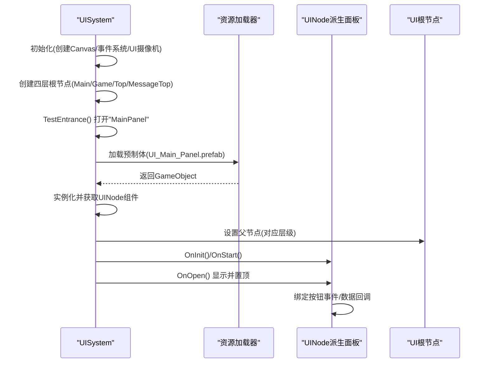
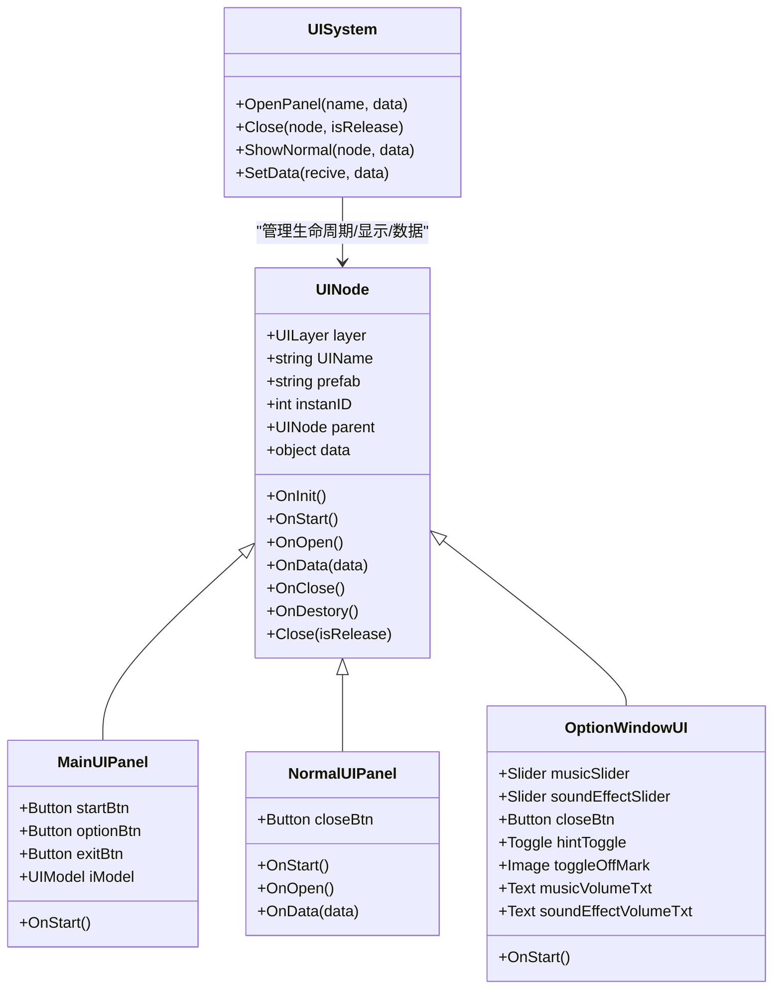
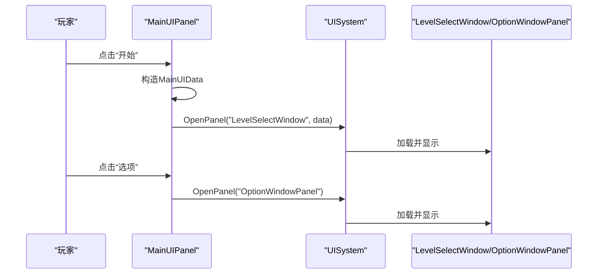
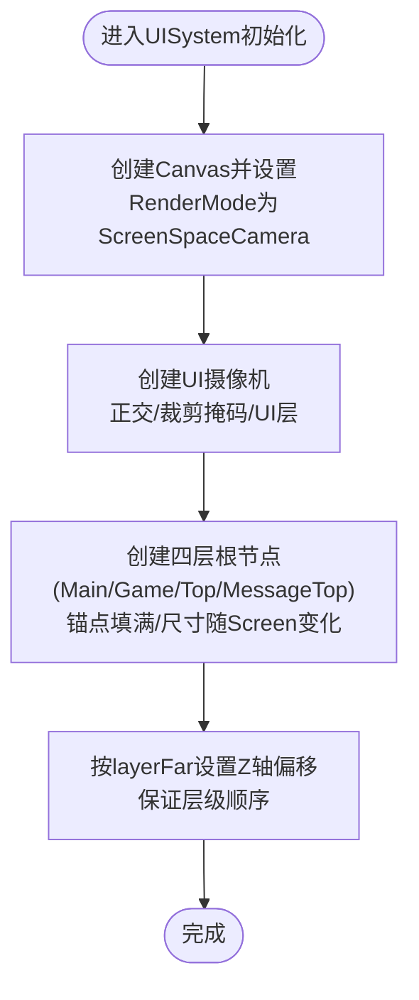
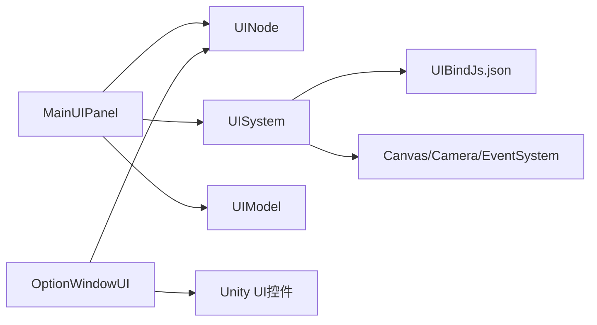

# 主界面系统

<cite>
**本文引用的文件**
- [MainUIPanel.cs](file://Assets/Scripts/UI/MainUI/MainUIPanel.cs)
- [NormalUIPanel.cs](file://Assets/Scripts/UI/NormalUIPanel.cs)
- [UINode.cs](file://Assets/Scripts/UI/UINode.cs)
- [UIPanel.cs](file://Assets/Scripts/UI/UIPanel.cs)
- [UISystem.cs](file://Assets/Scripts/Systems/Implement/UISystem/UISystem.cs)
- [UIBindJs.json](file://Assets/Scripts/UI/UIBindJs.json)
- [UI_Main_Panel.prefab](file://Assets/Art/UI/Prefabs/MainUI/UI_Main_Panel.prefab)
- [OptionWindowUI.cs](file://Assets/Scripts/UI/Window/OptionWindowUI.cs)
- [UI_OptionWindow_Panel.prefab](file://Assets/Art/UI/Prefabs/WindowUI/OptionWindow/UI_OptionWindow_Panel.prefab)
- [InputActions.cs](file://Assets/Common/InputActions.cs)
</cite>

## 目录
1. [简介](#简介)
2. [项目结构](#项目结构)
3. [核心组件](#核心组件)
4. [架构总览](#架构总览)
5. [详细组件分析](#详细组件分析)
6. [依赖关系分析](#依赖关系分析)
7. [性能考虑](#性能考虑)
8. [故障排查指南](#故障排查指南)
9. [结论](#结论)
10. [附录](#附录)

## 简介
本文件面向ProjectR项目的主界面系统，聚焦于主界面布局设计、功能模块与用户交互流程，深入解析MainUIPanel的实现原理、界面元素组织结构与事件处理机制；同时覆盖响应式布局、多分辨率适配与移动端优化策略，以及动画与视觉反馈、用户体验设计要点。文档还提供主界面的自定义扩展方法、组件配置与样式定制指南，并给出调试技巧、性能优化建议与常见问题解决方案。

## 项目结构
主界面系统采用“系统-节点-面板”的分层架构：
- 系统层：UISystem负责UI根节点、Canvas、事件系统、摄像机、层级管理与面板生命周期调度。
- 节点层：UINode作为所有UI面板的基类，统一生命周期与数据传递接口。
- 面板层：MainUIPanel等具体面板承载业务逻辑与交互事件绑定。
- 资源层：通过UIBindJs.json进行UI资源与面板名称的绑定，配合Unity预制体完成实例化。

图表来源
- [UISystem.cs:14-114](file://Assets/Scripts/Systems/Implement/UISystem/UISystem.cs#L14-L114)
- [UINode.cs:9-57](file://Assets/Scripts/UI/UINode.cs#L9-L57)
- [MainUIPanel.cs:8-31](file://Assets/Scripts/UI/MainUI/MainUIPanel.cs#L8-L31)
- [NormalUIPanel.cs:6-31](file://Assets/Scripts/UI/NormalUIPanel.cs#L6-L31)
- [OptionWindowUI.cs:5-27](file://Assets/Scripts/UI/Window/OptionWindowUI.cs#L5-L27)
- [UIBindJs.json:1-32](file://Assets/Scripts/UI/UIBindJs.json#L1-L32)
- [UI_Main_Panel.prefab:211-222](file://Assets/Art/UI/Prefabs/MainUI/UI_Main_Panel.prefab#L211-L222)
- [UI_OptionWindow_Panel.prefab:416-456](file://Assets/Art/UI/Prefabs/WindowUI/OptionWindow/UI_OptionWindow_Panel.prefab#L416-L456)

章节来源
- [UISystem.cs:14-114](file://Assets/Scripts/Systems/Implement/UISystem/UISystem.cs#L14-L114)
- [UINode.cs:9-57](file://Assets/Scripts/UI/UINode.cs#L9-L57)
- [MainUIPanel.cs:8-31](file://Assets/Scripts/UI/MainUI/MainUIPanel.cs#L8-L31)
- [NormalUIPanel.cs:6-31](file://Assets/Scripts/UI/NormalUIPanel.cs#L6-L31)
- [OptionWindowUI.cs:5-27](file://Assets/Scripts/UI/Window/OptionWindowUI.cs#L5-L27)
- [UIBindJs.json:1-32](file://Assets/Scripts/UI/UIBindJs.json#L1-L32)
- [UI_Main_Panel.prefab:211-222](file://Assets/Art/UI/Prefabs/MainUI/UI_Main_Panel.prefab#L211-L222)
- [UI_OptionWindow_Panel.prefab:416-456](file://Assets/Art/UI/Prefabs/WindowUI/OptionWindow/UI_OptionWindow_Panel.prefab#L416-L456)

## 核心组件
- UISystem：全局UI系统，负责创建Canvas、事件系统、UI摄像机与四层UI根节点（Main/Game/Top/MessageTop），并提供OpenPanel、Close、ShowNormal等接口，支持按名称加载与显示面板。
- UINode：所有UI面板的基类，提供OnInit、OnStart、OnOpen、OnData、OnClose、OnDestory等生命周期钩子，以及Close方法委托给UISystem。
- MainUIPanel：主界面面板，持有开始、选项、退出按钮与UIModel，绑定按钮点击事件，打开其他面板或触发模型加载回调。
- NormalUIPanel：通用面板示例，提供关闭按钮事件与数据接收逻辑。
- OptionWindowUI：设置窗口面板，包含音量滑条、提示开关与文本显示联动。
- UIBindJs.json：UI资源绑定表，将面板名映射到预制体路径，供UISystem按名加载。

章节来源
- [UISystem.cs:21-265](file://Assets/Scripts/Systems/Implement/UISystem/UISystem.cs#L21-L265)
- [UINode.cs:9-57](file://Assets/Scripts/UI/UINode.cs#L9-L57)
- [MainUIPanel.cs:8-37](file://Assets/Scripts/UI/MainUI/MainUIPanel.cs#L8-L37)
- [NormalUIPanel.cs:6-31](file://Assets/Scripts/UI/NormalUIPanel.cs#L6-L31)
- [OptionWindowUI.cs:5-27](file://Assets/Scripts/UI/Window/OptionWindowUI.cs#L5-L27)
- [UIBindJs.json:1-32](file://Assets/Scripts/UI/UIBindJs.json#L1-L32)

## 架构总览
主界面系统遵循“单例系统 + 分层节点 + 资源绑定”的模式：
- 单例系统：UISystem在场景初始化时创建UI根、Canvas、事件系统与UI摄像机，并预置四层根节点。
- 分层节点：UINode统一管理面板生命周期与数据，MainUIPanel等具体面板实现业务逻辑。
- 资源绑定：UIBindJs.json将面板名与预制体关联，UISystem按名加载并实例化，设置锚点、尺寸与层级。

图表来源
- [UISystem.cs:38-96](file://Assets/Scripts/Systems/Implement/UISystem/UISystem.cs#L38-L96)
- [UISystem.cs:161-246](file://Assets/Scripts/Systems/Implement/UISystem/UISystem.cs#L161-L246)
- [UINode.cs:21-57](file://Assets/Scripts/UI/UINode.cs#L21-L57)
- [UI_Main_Panel.prefab:211-222](file://Assets/Art/UI/Prefabs/MainUI/UI_Main_Panel.prefab#L211-L222)

章节来源
- [UISystem.cs:38-96](file://Assets/Scripts/Systems/Implement/UISystem/UISystem.cs#L38-L96)
- [UISystem.cs:161-246](file://Assets/Scripts/Systems/Implement/UISystem/UISystem.cs#L161-L246)
- [UINode.cs:21-57](file://Assets/Scripts/UI/UINode.cs#L21-L57)

## 详细组件分析

### MainUIPanel 分析
- 角色定位：主界面入口面板，承载开始游戏、设置与退出等核心交互。
- 关键字段：startBtn、optionBtn、exitBtn、iModel。
- 生命周期与事件：
  - OnStart中注册按钮点击事件：开始按钮创建MainUIData并通过UISystem.OpenPanel打开关卡选择窗口；选项按钮打开设置窗口；UIModel加载完成回调打印日志。
- 数据结构：MainUIData继承UINodeData，包含消息与关卡列表，用于向下游面板传递数据。

图表来源
- [UINode.cs:9-57](file://Assets/Scripts/UI/UINode.cs#L9-L57)
- [MainUIPanel.cs:8-37](file://Assets/Scripts/UI/MainUI/MainUIPanel.cs#L8-L37)
- [NormalUIPanel.cs:6-31](file://Assets/Scripts/UI/NormalUIPanel.cs#L6-L31)
- [OptionWindowUI.cs:5-27](file://Assets/Scripts/UI/Window/OptionWindowUI.cs#L5-L27)
- [UISystem.cs:115-160](file://Assets/Scripts/Systems/Implement/UISystem/UISystem.cs#L115-L160)

章节来源
- [MainUIPanel.cs:8-37](file://Assets/Scripts/UI/MainUI/MainUIPanel.cs#L8-L37)
- [UINode.cs:9-57](file://Assets/Scripts/UI/UINode.cs#L9-L57)
- [NormalUIPanel.cs:6-31](file://Assets/Scripts/UI/NormalUIPanel.cs#L6-L31)
- [OptionWindowUI.cs:5-27](file://Assets/Scripts/UI/Window/OptionWindowUI.cs#L5-L27)
- [UISystem.cs:115-160](file://Assets/Scripts/Systems/Implement/UISystem/UISystem.cs#L115-L160)

### 交互流程（MainUIPanel）
- 开始按钮：创建MainUIData，调用UISystem.OpenPanel("LevelSelectWindow", data)打开关卡选择窗口。
- 选项按钮：调用UISystem.OpenPanel("OptionWindowPanel")打开设置窗口。
- UIModel加载回调：监听onLoadDone，输出模型加载成功日志。

图表来源
- [MainUIPanel.cs:17-25](file://Assets/Scripts/UI/MainUI/MainUIPanel.cs#L17-L25)
- [UISystem.cs:161-178](file://Assets/Scripts/Systems/Implement/UISystem/UISystem.cs#L161-L178)

章节来源
- [MainUIPanel.cs:17-25](file://Assets/Scripts/UI/MainUI/MainUIPanel.cs#L17-L25)
- [UISystem.cs:161-178](file://Assets/Scripts/Systems/Implement/UISystem/UISystem.cs#L161-L178)

### 响应式布局与多分辨率适配
- Canvas与摄像机：UISystem创建Canvas并设置为ScreenSpaceCamera，UI摄像机使用正交投影，裁剪掩码仅渲染UI层，确保屏幕坐标系一致。
- 屏幕适配：四层根节点均使用锚点填满屏幕，尺寸通过SetSizeWithCurrentAnchors按当前Screen.width/height设定，保证不同分辨率下铺满。
- 层级深度：通过layerFar字典为各层级设置z轴偏移，形成Main/Game/Top/MessageTop的前后层次，避免遮挡冲突。

图表来源
- [UISystem.cs:49-114](file://Assets/Scripts/Systems/Implement/UISystem/UISystem.cs#L49-L114)

章节来源
- [UISystem.cs:49-114](file://Assets/Scripts/Systems/Implement/UISystem/UISystem.cs#L49-L114)

### 移动端优化策略
- 输入系统：通过InputActions.cs定义UI动作集（Navigate/Submit/Cancel/Click等），可与UI事件系统结合，提升移动端触控与手柄输入体验。
- 事件系统：UISystem创建StandaloneInputModule与EventSystem，确保按钮、滑条等UI控件在移动设备上的交互稳定。
- UI摄像机：正交投影与固定orthographicSize，减少透视带来的UI缩放误差，便于移动端统一适配。

章节来源
- [InputActions.cs:967-1043](file://Assets/Common/InputActions.cs#L967-L1043)
- [UISystem.cs:64-72](file://Assets/Scripts/Systems/Implement/UISystem/UISystem.cs#L64-L72)
- [UISystem.cs:73-91](file://Assets/Scripts/Systems/Implement/UISystem/UISystem.cs#L73-L91)

### 动画效果、视觉反馈与用户体验
- 预制体驱动：主界面与设置窗口通过预制体定义布局与视觉元素，可通过修改预制体实现动画与过渡效果。
- 文本联动：设置窗口中音量滑条与文本实时联动，提供即时反馈。
- 日志与回调：MainUIPanel对UIModel加载完成进行日志输出，便于调试与状态可视化。

章节来源
- [OptionWindowUI.cs:14-24](file://Assets/Scripts/UI/Window/OptionWindowUI.cs#L14-L24)
- [MainUIPanel.cs:26-29](file://Assets/Scripts/UI/MainUI/MainUIPanel.cs#L26-L29)

### 自定义扩展、组件配置与样式定制
- 新增面板：在UIBindJs.json中添加新面板名与预制体路径，确保UISystem能按名加载。
- 面板脚本：继承UINode，实现OnStart/OnOpen/OnData等生命周期，注册按钮事件与数据处理。
- 预制体定制：在UI_Main_Panel.prefab等预制体中调整控件位置、尺寸与样式，以满足不同分辨率与风格需求。
- 设置窗口扩展：参考OptionWindowUI，在OnStart中注册更多滑条/切换项，并同步更新文本或图标状态。

章节来源
- [UIBindJs.json:1-32](file://Assets/Scripts/UI/UIBindJs.json#L1-L32)
- [UINode.cs:21-57](file://Assets/Scripts/UI/UINode.cs#L21-L57)
- [UI_Main_Panel.prefab:211-222](file://Assets/Art/UI/Prefabs/MainUI/UI_Main_Panel.prefab#L211-L222)
- [OptionWindowUI.cs:14-24](file://Assets/Scripts/UI/Window/OptionWindowUI.cs#L14-L24)

## 依赖关系分析
- MainUIPanel依赖UINode（生命周期）、UISystem（打开面板）、UIModel（加载回调）。
- UISystem依赖UIBindJs.json进行资源绑定，依赖Unity的Canvas、EventSystem、Camera等组件。
- OptionWindowUI依赖UINode与Unity UI控件（Slider/Toggle/Button/Text）。

图表来源
- [MainUIPanel.cs:8-37](file://Assets/Scripts/UI/MainUI/MainUIPanel.cs#L8-L37)
- [UISystem.cs:38-48](file://Assets/Scripts/Systems/Implement/UISystem/UISystem.cs#L38-L48)
- [UIBindJs.json:1-32](file://Assets/Scripts/UI/UIBindJs.json#L1-L32)
- [OptionWindowUI.cs:5-27](file://Assets/Scripts/UI/Window/OptionWindowUI.cs#L5-L27)

章节来源
- [MainUIPanel.cs:8-37](file://Assets/Scripts/UI/MainUI/MainUIPanel.cs#L8-L37)
- [UISystem.cs:38-48](file://Assets/Scripts/Systems/Implement/UISystem/UISystem.cs#L38-L48)
- [UIBindJs.json:1-32](file://Assets/Scripts/UI/UIBindJs.json#L1-L32)
- [OptionWindowUI.cs:5-27](file://Assets/Scripts/UI/Window/OptionWindowUI.cs#L5-L27)

## 性能考虑
- 面板复用：UISystem通过nameUINodeDict缓存已加载面板，重复打开时直接ShowNormal，避免重复实例化。
- 层级管理：按层设置z轴偏移，减少不必要的渲染与遮挡计算。
- 资源加载：使用协程异步加载预制体，避免主线程阻塞。
- UI摄像机：正交投影与固定参数减少透视计算成本，适合UI场景。

章节来源
- [UISystem.cs:161-178](file://Assets/Scripts/Systems/Implement/UISystem/UISystem.cs#L161-L178)
- [UISystem.cs:115-160](file://Assets/Scripts/Systems/Implement/UISystem/UISystem.cs#L115-L160)
- [UISystem.cs:73-91](file://Assets/Scripts/Systems/Implement/UISystem/UISystem.cs#L73-L91)

## 故障排查指南
- 面板无法打开：检查UIBindJs.json中是否存在该面板名；确认UISystem是否正确加载资源。
- 事件不生效：确认UINode.OnStart中是否正确注册按钮事件；检查UI预制体中的Button引用是否挂载。
- 数据未传递：确认UISystem.SetData调用目标面板名存在；在目标面板OnData中处理数据类型判断。
- 分辨率异常：检查CanvasScaler与根节点锚点设置；确认GenObject中按Screen.width/height设置尺寸。

章节来源
- [UISystem.cs:161-178](file://Assets/Scripts/Systems/Implement/UISystem/UISystem.cs#L161-L178)
- [UISystem.cs:250-264](file://Assets/Scripts/Systems/Implement/UISystem/UISystem.cs#L250-L264)
- [UINode.cs:21-57](file://Assets/Scripts/UI/UINode.cs#L21-L57)
- [UIBindJs.json:1-32](file://Assets/Scripts/UI/UIBindJs.json#L1-L32)

## 结论
主界面系统以UISystem为核心，通过UINode统一生命周期与数据流，配合UIBindJs.json与预制体实现快速扩展与多平台适配。MainUIPanel作为入口面板，承担核心交互与导航职责；OptionWindowUI等面板提供设置与反馈。系统在布局、事件、资源与层级方面具备良好的可维护性与扩展性，适合进一步引入动画、主题与国际化等高级特性。

## 附录
- 面板生命周期参考：OnInit → OnStart → OnOpen → OnData → OnClose → OnDestory
- 常用操作：通过UISystem.OpenPanel按名打开面板；通过UINode.Close关闭当前面板；通过UISystem.SetData向指定面板传递数据