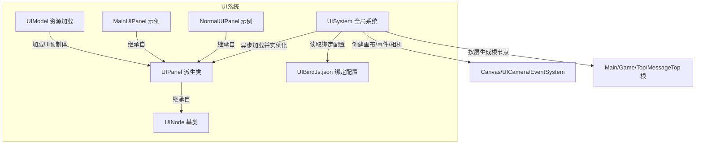
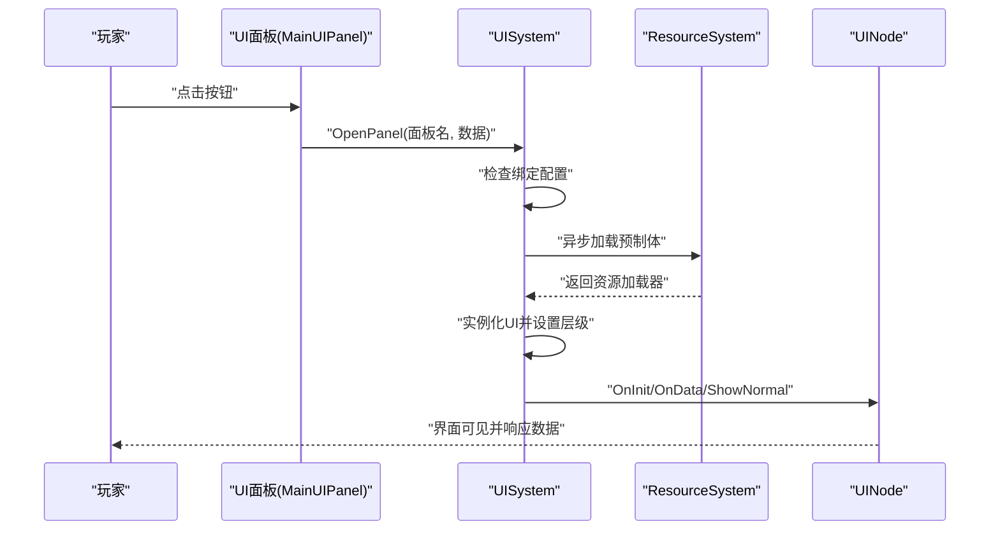
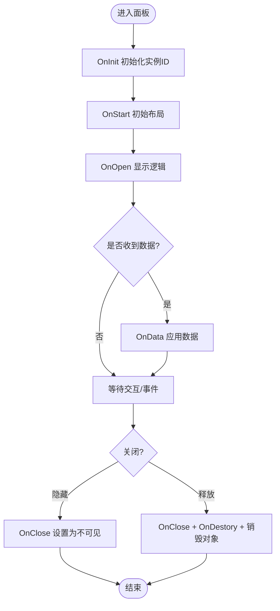
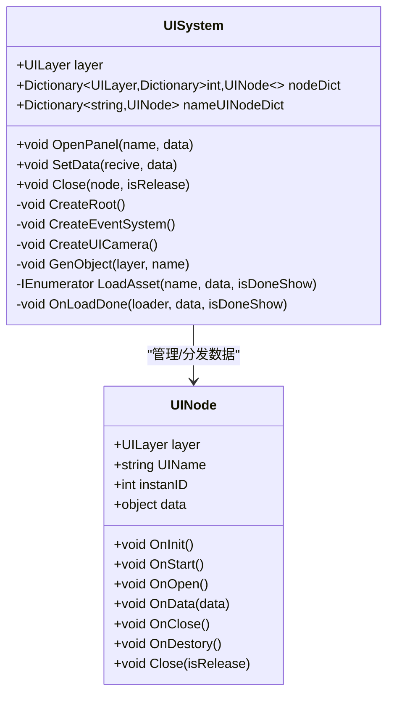
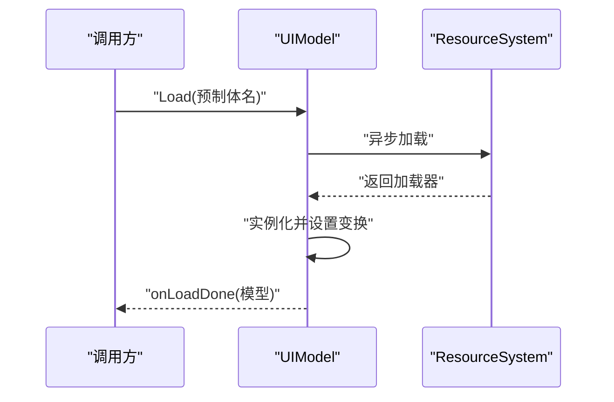
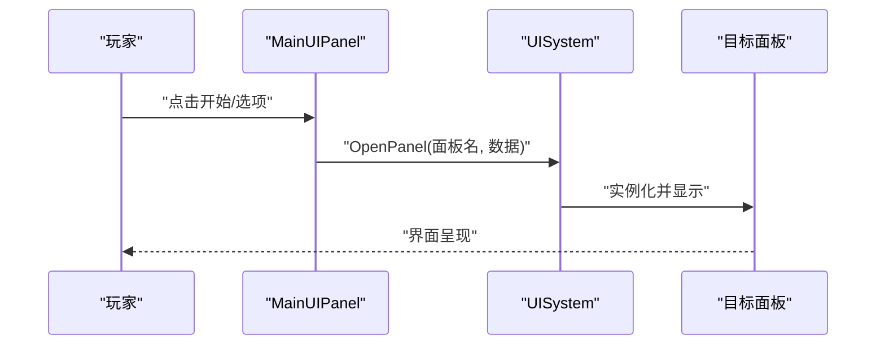
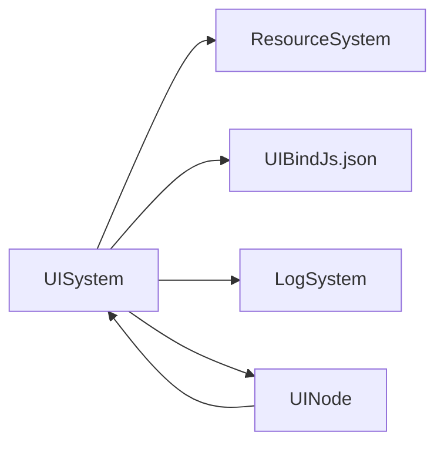

# 游戏内界面系统

<cite>
**本文引用的文件**
- [UINode.cs](file://Assets/Scripts/UI/UINode.cs)
- [NormalUIPanel.cs](file://Assets/Scripts/UI/NormalUIPanel.cs)
- [MainUIPanel.cs](file://Assets/Scripts/UI/MainUI/MainUIPanel.cs)
- [UIModel.cs](file://Assets/Scripts/UI/UIModel.cs)
- [UISystem.cs](file://Assets/Scripts/Systems/Implement/UISystem/UISystem.cs)
- [UIBindJs.json](file://Assets/Scripts/Modules/UI/UIBindJs.json)
</cite>

## 目录
1. [简介](#简介)
2. [项目结构](#项目结构)
3. [核心组件](#核心组件)
4. [架构总览](#架构总览)
5. [详细组件分析](#详细组件分析)
6. [依赖关系分析](#依赖关系分析)
7. [性能考虑](#性能考虑)
8. [故障排查指南](#故障排查指南)
9. [结论](#结论)
10. [附录](#附录)

## 简介
本文件面向ProjectR项目的游戏内界面系统（InGameUI），系统性阐述运行时UI元素与交互组件的组织方式、刷新机制与数据绑定流程。重点覆盖以下方面：
- InGameUI的实现原理与层级管理
- 界面刷新与数据绑定策略
- HUD组件（如血条、能量条、计分板）的设计思路与实现要点
- 实时更新、动画与视觉反馈的集成方式
- 性能优化、渲染与内存管理策略
- 调试工具、测试方法与常见问题处理

## 项目结构
UI系统采用“节点驱动 + 资源装配 + 分层容器”的架构模式：
- UINode：所有UI面板的基类，统一生命周期与数据接口
- UISystem：全局UI系统，负责画布、事件系统、相机、分层容器、资源加载与面板打开/关闭
- UIModel：UI模型加载器，用于异步加载并实例化UI预制体
- MainUIPanel/NormalUIPanel：示例面板，演示按钮交互与数据传递
- UIBindJs.json：UI资源绑定配置，记录面板名称到预制体路径的映射

图表来源
- [UISystem.cs:38-114](file://Assets/Scripts/Systems/Implement/UISystem/UISystem.cs#L38-L114)
- [UINode.cs:9-57](file://Assets/Scripts/UI/UINode.cs#L9-L57)
- [NormalUIPanel.cs:6-31](file://Assets/Scripts/UI/NormalUIPanel.cs#L6-L31)
- [MainUIPanel.cs:8-31](file://Assets/Scripts/UI/MainUI/MainUIPanel.cs#L8-L31)
- [UIModel.cs:9-61](file://Assets/Scripts/UI/UIModel.cs#L9-L61)
- [UIBindJs.json](file://Assets/Scripts/Modules/UI/UIBindJs.json)

章节来源
- [UISystem.cs:38-114](file://Assets/Scripts/Systems/Implement/UISystem/UISystem.cs#L38-L114)
- [UINode.cs:9-57](file://Assets/Scripts/UI/UINode.cs#L9-L57)
- [UIModel.cs:9-61](file://Assets/Scripts/UI/UIModel.cs#L9-L61)
- [MainUIPanel.cs:8-31](file://Assets/Scripts/UI/MainUI/MainUIPanel.cs#L8-L31)
- [NormalUIPanel.cs:6-31](file://Assets/Scripts/UI/NormalUIPanel.cs#L6-L31)
- [UIBindJs.json](file://Assets/Scripts/Modules/UI/UIBindJs.json)

## 核心组件
- UINode：定义UI节点的生命周期（OnInit/OnStart/OnOpen/OnData/OnClose/OnDestory）、父子关系、数据承载与关闭接口；提供统一的面板标识（UIName、instanID）与层级（layer）
- UISystem：全局单例，负责画布初始化、事件系统、UI相机、分层根节点生成、面板打开/关闭、资源加载与数据分发
- UIModel：异步加载UI预制体，实例化后按设定偏移、缩放、旋转放置，并回调加载完成事件
- MainUIPanel/NormalUIPanel：示例面板，展示按钮点击触发、数据传递与日志输出
- UIBindJs.json：UI资源绑定表，将面板名称映射到预制体路径，供UISystem在运行时动态加载

章节来源
- [UINode.cs:9-57](file://Assets/Scripts/UI/UINode.cs#L9-L57)
- [UISystem.cs:21-48](file://Assets/Scripts/Systems/Implement/UISystem/UISystem.cs#L21-L48)
- [UIModel.cs:9-61](file://Assets/Scripts/UI/UIModel.cs#L9-L61)
- [MainUIPanel.cs:8-31](file://Assets/Scripts/UI/MainUI/MainUIPanel.cs#L8-L31)
- [NormalUIPanel.cs:6-31](file://Assets/Scripts/UI/NormalUIPanel.cs#L6-L31)
- [UIBindJs.json](file://Assets/Scripts/Modules/UI/UIBindJs.json)

## 架构总览
下图展示了从用户交互到UI刷新的端到端流程，以及数据如何通过UISystem分发至目标面板。

图表来源
- [MainUIPanel.cs:14-30](file://Assets/Scripts/UI/MainUI/MainUIPanel.cs#L14-L30)
- [UISystem.cs:161-246](file://Assets/Scripts/Systems/Implement/UISystem/UISystem.cs#L161-L246)
- [UINode.cs:25-57](file://Assets/Scripts/UI/UINode.cs#L25-L57)

章节来源
- [MainUIPanel.cs:14-30](file://Assets/Scripts/UI/MainUI/MainUIPanel.cs#L14-L30)
- [UISystem.cs:161-246](file://Assets/Scripts/Systems/Implement/UISystem/UISystem.cs#L161-L246)
- [UINode.cs:25-57](file://Assets/Scripts/UI/UINode.cs#L25-L57)

## 详细组件分析

### UINode 生命周期与数据绑定
- 生命周期钩子：OnInit（初始化实例ID）、OnStart（初始布局）、OnOpen（显示时调用）、OnData（接收数据）、OnClose（隐藏时调用）、OnDestory（销毁时调用）
- 数据绑定：通过UISystem.SetData将对象注入目标面板UIName对应的UINode，随后调用OnData进行处理
- 关闭策略：Close支持释放或隐藏两种模式，委托给UISystem统一处理

图表来源
- [UINode.cs:25-57](file://Assets/Scripts/UI/UINode.cs#L25-L57)
- [UISystem.cs:115-160](file://Assets/Scripts/Systems/Implement/UISystem/UISystem.cs#L115-L160)

章节来源
- [UINode.cs:25-57](file://Assets/Scripts/UI/UINode.cs#L25-L57)
- [UISystem.cs:115-160](file://Assets/Scripts/Systems/Implement/UISystem/UISystem.cs#L115-L160)

### UISystem：画布、事件、相机与分层容器
- 画布与相机：创建Canvas并绑定UICamera，使用正交投影与裁剪掩码隔离UI层
- 事件系统：创建EventSystem以支持UI交互
- 分层容器：按UILayer（Main/Game/Top/MessageTop）生成四层根节点，每层按屏幕尺寸铺满
- 面板打开：根据UIBindJs.json中的映射，异步加载预制体并实例化，设置层级与尺寸，缓存UIName到UINode的映射，最后调用ShowNormal激活显示
- 数据分发：SetData通过UIName定位目标UINode，注入data并触发OnData

图表来源
- [UISystem.cs:21-265](file://Assets/Scripts/Systems/Implement/UISystem/UISystem.cs#L21-L265)
- [UINode.cs:9-57](file://Assets/Scripts/UI/UINode.cs#L9-L57)

章节来源
- [UISystem.cs:38-114](file://Assets/Scripts/Systems/Implement/UISystem/UISystem.cs#L38-L114)
- [UISystem.cs:161-246](file://Assets/Scripts/Systems/Implement/UISystem/UISystem.cs#L161-L246)
- [UINode.cs:9-57](file://Assets/Scripts/UI/UINode.cs#L9-L57)

### UIModel：异步加载与实例化
- 异步加载：通过ResourceSystem异步加载指定名称的UI预制体
- 实例化与变换：实例化后按offset/scale/rotation设置位置与姿态，并将所有子节点图层设置为UI层
- 回调通知：加载完成后触发onLoadDone回调，便于面板进一步处理

图表来源
- [UIModel.cs:20-59](file://Assets/Scripts/UI/UIModel.cs#L20-L59)

章节来源
- [UIModel.cs:20-59](file://Assets/Scripts/UI/UIModel.cs#L20-L59)

### 示例面板：MainUIPanel 与 NormalUIPanel
- MainUIPanel：包含开始、选项、退出按钮，点击后通过UISystem.OpenPanel打开其他面板，并向目标面板传递数据
- NormalUIPanel：包含关闭按钮，点击后调用Close触发隐藏或释放

图表来源
- [MainUIPanel.cs:14-30](file://Assets/Scripts/UI/MainUI/MainUIPanel.cs#L14-L30)
- [NormalUIPanel.cs:9-12](file://Assets/Scripts/UI/NormalUIPanel.cs#L9-L12)
- [UISystem.cs:161-178](file://Assets/Scripts/Systems/Implement/UISystem/UISystem.cs#L161-L178)

章节来源
- [MainUIPanel.cs:14-30](file://Assets/Scripts/UI/MainUI/MainUIPanel.cs#L14-L30)
- [NormalUIPanel.cs:9-12](file://Assets/Scripts/UI/NormalUIPanel.cs#L9-L12)
- [UISystem.cs:161-178](file://Assets/Scripts/Systems/Implement/UISystem/UISystem.cs#L161-L178)

### HUD组件设计与实现要点（血条/能量条/计分板）
- 设计原则
  - 数据驱动：通过UINode.OnData接收实体状态（如生命值、能量值、分数），避免硬编码
  - 组件化：将血条、能量条、计分板拆分为独立UI节点，复用UINode生命周期
  - 层级管理：将HUD置于Game层，确保与主界面、弹窗的Z序正确
- 实现建议
  - 血条/能量条：使用Slider或Image填充方式，依据数值范围线性插值
  - 计分板：使用Text组件，支持格式化与多语言键值映射
  - 动画与反馈：通过协程或DOTween在数值变化时播放过渡动画，配合音效/提示
  - 性能优化：批量更新、延迟刷新、避免每帧重建字符串

（本节为概念性指导，不直接分析具体文件）

## 依赖关系分析
- UISystem依赖：
  - ResourceSystem：用于异步加载UI预制体
  - UIBindJs.json：提供面板名称到预制体路径的映射
  - LogSystem：错误日志输出
- UINode依赖：
  - UISystem：关闭操作委托
  - 面板自身：覆盖生命周期钩子以实现业务逻辑

图表来源
- [UISystem.cs:10-10](file://Assets/Scripts/Systems/Implement/UISystem/UISystem.cs#L10-L10)
- [UINode.cs:3-3](file://Assets/Scripts/UI/UINode.cs#L3-L3)

章节来源
- [UISystem.cs:10-10](file://Assets/Scripts/Systems/Implement/UISystem/UISystem.cs#L10-L10)
- [UINode.cs:3-3](file://Assets/Scripts/UI/UINode.cs#L3-L3)

## 性能考虑
- 资源加载
  - 使用异步加载（协程）避免主线程阻塞
  - 复用已加载的UI预制体，减少重复实例化
- 渲染与层级
  - UI相机使用正交投影与裁剪掩码，避免与场景渲染相互影响
  - 分层容器按需显示，隐藏时禁用GameObject，降低DrawCall
- 内存管理
  - 面板关闭时可选择释放（销毁对象）或隐藏（保留实例），按面板使用频率权衡
  - 及时清理事件订阅与回调，防止内存泄漏
- 更新策略
  - HUD数值变化采用批量更新或帧内合并，避免频繁UI重绘
  - 文本更新使用缓存与延迟刷新，减少GC压力

（本节提供通用指导，不直接分析具体文件）

## 故障排查指南
- 打开面板失败
  - 检查UIBindJs.json中是否存在对应面板名称
  - 查看UISystem日志输出，确认资源加载器是否为空
- 面板无法显示
  - 确认面板层级与分层根节点设置一致
  - 检查ShowNormal逻辑是否正确激活目标面板并置顶
- 数据未生效
  - 确认SetData传入的UIName与面板UIName一致
  - 在UINode.OnData中验证数据类型与赋值逻辑
- 资源加载异常
  - 检查UIModel的onLoadDone回调是否被触发
  - 核对预制体路径与资源包构建配置

章节来源
- [UISystem.cs:161-178](file://Assets/Scripts/Systems/Implement/UISystem/UISystem.cs#L161-L178)
- [UISystem.cs:252-264](file://Assets/Scripts/Systems/Implement/UISystem/UISystem.cs#L252-L264)
- [UIModel.cs:38-59](file://Assets/Scripts/UI/UIModel.cs#L38-L59)

## 结论
ProjectR的UI系统以UINode为核心，结合UISystem的分层容器与异步资源加载，形成清晰的生命周期与数据流。通过UIBindJs.json实现配置驱动的面板装配，既保证了扩展性，也便于维护。针对HUD组件，建议采用数据驱动与组件化设计，配合动画与性能优化策略，实现流畅且可维护的游戏内界面体验。

## 附录
- 配置文件位置：Assets/Scripts/Modules/UI/UIBindJs.json
- 示例面板：MainUIPanel、NormalUIPanel
- 关键类：UINode、UISystem、UIModel