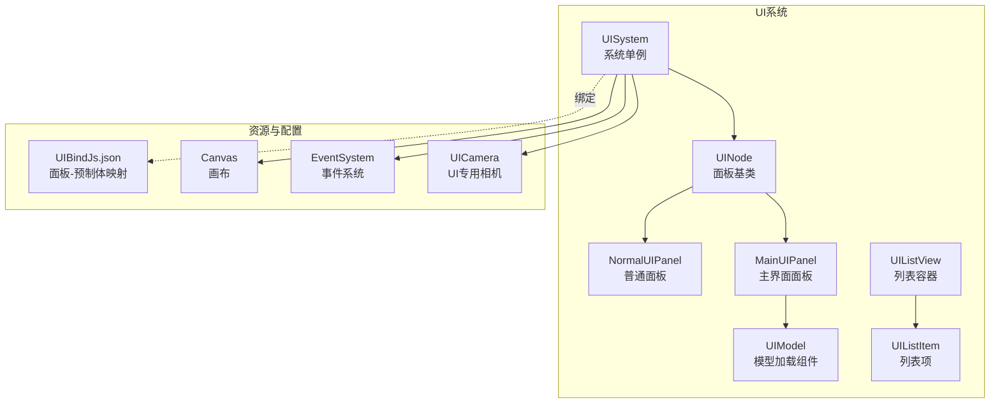
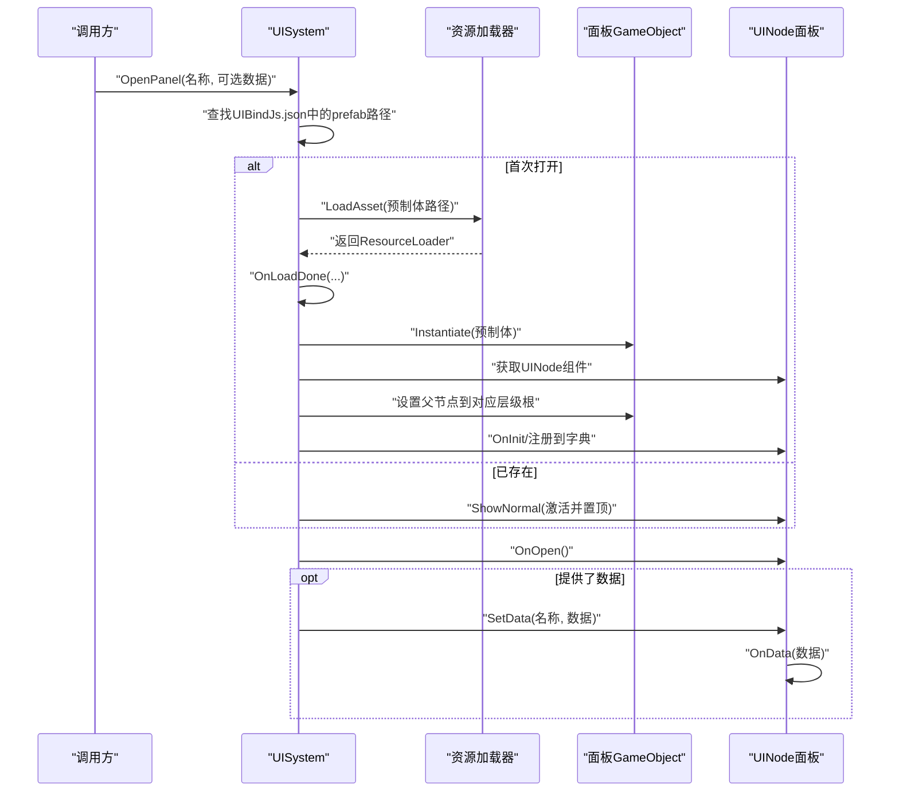
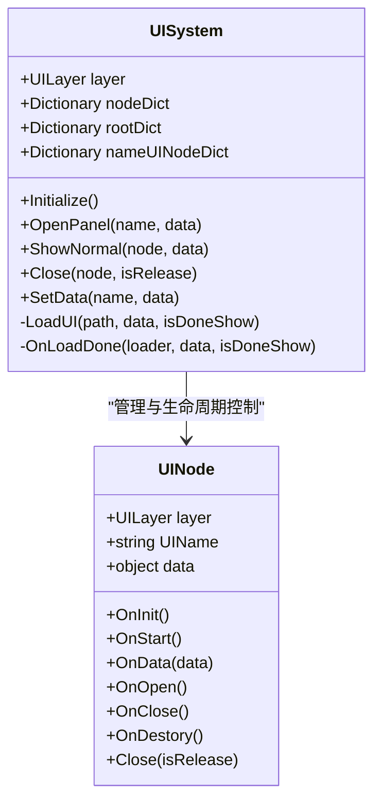
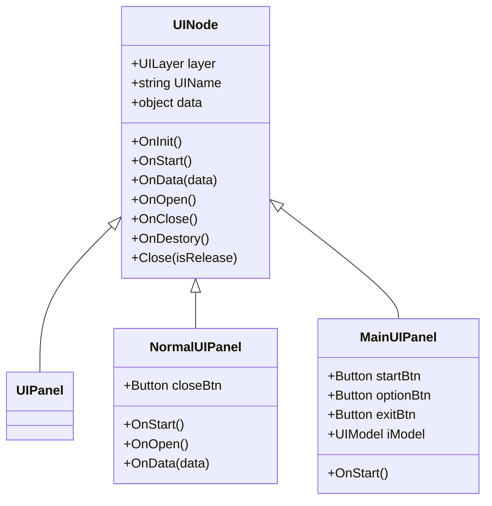
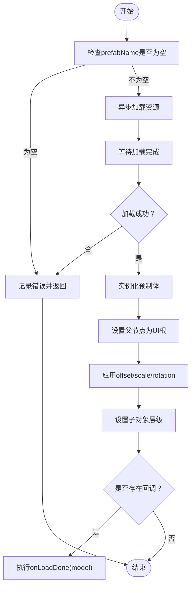
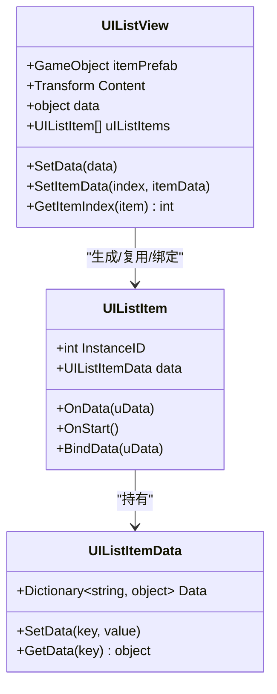
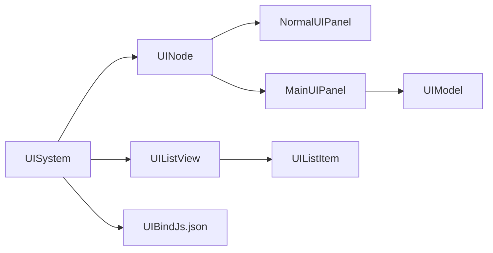

# 用户界面系统

<cite>
**本文引用的文件**
- [Assets/Scripts/Systems/Implement/UISystem/UISystem.cs](file://Assets/Scripts/Systems/Implement/UISystem/UISystem.cs)
- [Assets/Scripts/UI/UINode.cs](file://Assets/Scripts/UI/UINode.cs)
- [Assets/Scripts/UI/UIPanel.cs](file://Assets/Scripts/UI/UIPanel.cs)
- [Assets/Scripts/UI/NormalUIPanel.cs](file://Assets/Scripts/UI/NormalUIPanel.cs)
- [Assets/Scripts/UI/MainUI/MainUIPanel.cs](file://Assets/Scripts/UI/MainUI/MainUIPanel.cs)
- [Assets/Scripts/UI/UIModel.cs](file://Assets/Scripts/UI/UIModel.cs)
- [Assets/Scripts/UI/UIListItem.cs](file://Assets/Scripts/UI/UIListItem.cs)
- [Assets/Scripts/UI/UIListView.cs](file://Assets/Scripts/UI/UIListView.cs)
- [Assets/Scripts/UI/UIBindJs.json](file://Assets/Scripts/UI/UIBindJs.json)
</cite>

## 目录
1. [简介](#简介)
2. [项目结构](#项目结构)
3. [核心组件](#核心组件)
4. [架构总览](#架构总览)
5. [详细组件分析](#详细组件分析)
6. [依赖关系分析](#依赖关系分析)
7. [性能考虑](#性能考虑)
8. [故障排查指南](#故障排查指南)
9. [结论](#结论)
10. [附录](#附录)

## 简介
本文件面向ProjectR项目的用户界面系统，系统性梳理UI层次管理、面板体系与交互机制，覆盖组件使用方法、配置项与扩展方式，解释UI绑定、事件处理与数据传递流程，并给出响应式布局、多分辨率适配与移动端优化建议。同时提供性能优化、渲染与内存管理最佳实践，以及调试工具与常见问题解决方案，最后汇总API接口、组件规范与集成指导。

## 项目结构
UI系统采用“系统单例 + 面板基类 + 列表组件”的分层组织方式：
- 系统层：UISystem负责画布、层级根节点、事件系统、相机、资源加载与面板生命周期管理
- 面板层：UINode为所有面板的基类，派生出NormalUIPanel、MainUIPanel等具体面板
- 资源绑定：通过UIBindJs.json声明UI预制体与面板名称的映射
- 列表组件：UIListView与UIListItem支持动态列表渲染与数据绑定

图表来源
- [Assets/Scripts/Systems/Implement/UISystem/UISystem.cs:14-114](file://Assets/Scripts/Systems/Implement/UISystem/UISystem.cs#L14-L114)
- [Assets/Scripts/UI/UINode.cs:9-57](file://Assets/Scripts/UI/UINode.cs#L9-L57)
- [Assets/Scripts/UI/NormalUIPanel.cs:6-31](file://Assets/Scripts/UI/NormalUIPanel.cs#L6-L31)
- [Assets/Scripts/UI/MainUI/MainUIPanel.cs:8-31](file://Assets/Scripts/UI/MainUI/MainUIPanel.cs#L8-L31)
- [Assets/Scripts/UI/UIModel.cs:9-60](file://Assets/Scripts/UI/UIModel.cs#L9-L60)
- [Assets/Scripts/UI/UIListView.cs:8-68](file://Assets/Scripts/UI/UIListView.cs#L8-L68)
- [Assets/Scripts/UI/UIListItem.cs:6-47](file://Assets/Scripts/UI/UIListItem.cs#L6-L47)
- [Assets/Scripts/UI/UIBindJs.json:1-32](file://Assets/Scripts/UI/UIBindJs.json#L1-L32)

章节来源
- [Assets/Scripts/Systems/Implement/UISystem/UISystem.cs:14-114](file://Assets/Scripts/Systems/Implement/UISystem/UISystem.cs#L14-L114)
- [Assets/Scripts/UI/UINode.cs:9-57](file://Assets/Scripts/UI/UINode.cs#L9-L57)
- [Assets/Scripts/UI/UIBindJs.json:1-32](file://Assets/Scripts/UI/UIBindJs.json#L1-L32)

## 核心组件
- UISystem（系统单例）
  - 职责：创建Canvas、EventSystem、UICamera；按层级生成UI根节点；统一加载与打开面板；管理面板显隐与销毁；提供SetData进行跨面板数据传递
  - 关键字段：UIRoot、CanvasRoot、EventSystemObj、UICamera、UIAssetdict、nodeDict、rootDict、nameUINodeDict
  - 关键方法：Initialize、OpenPanel、ShowNormal、Close、OnLoadDone、SetData
- UINode（面板基类）
  - 职责：定义面板生命周期回调（OnInit、OnStart、OnData、OnOpen、OnClose、OnDestory）、提供Close便捷方法、记录实例ID与父节点、承载data
  - 关键字段：layer、UIName、prefab、instanID、parent、data
- NormalUIPanel（普通面板示例）
  - 职责：演示关闭按钮绑定与OnOpen日志输出
- MainUIPanel（主界面面板）
  - 职责：演示按钮事件绑定、向其他面板传递数据（MainUIData）与UIModel加载回调
- UIModel（模型加载组件）
  - 职责：异步加载UI预制体并实例化，支持偏移、缩放、旋转与层级设置
- UIListView/ UIListItem（列表组件）
  - 职责：动态生成/复用列表项，按数据集更新内容，支持增删改查与索引定位

章节来源
- [Assets/Scripts/Systems/Implement/UISystem/UISystem.cs:14-265](file://Assets/Scripts/Systems/Implement/UISystem/UISystem.cs#L14-L265)
- [Assets/Scripts/UI/UINode.cs:9-57](file://Assets/Scripts/UI/UINode.cs#L9-L57)
- [Assets/Scripts/UI/NormalUIPanel.cs:6-31](file://Assets/Scripts/UI/NormalUIPanel.cs#L6-L31)
- [Assets/Scripts/UI/MainUI/MainUIPanel.cs:8-31](file://Assets/Scripts/UI/MainUI/MainUIPanel.cs#L8-L31)
- [Assets/Scripts/UI/UIModel.cs:9-60](file://Assets/Scripts/UI/UIModel.cs#L9-L60)
- [Assets/Scripts/UI/UIListView.cs:8-101](file://Assets/Scripts/UI/UIListView.cs#L8-L101)
- [Assets/Scripts/UI/UIListItem.cs:6-47](file://Assets/Scripts/UI/UIListItem.cs#L6-L47)

## 架构总览
下图展示从打开面板到显示与数据传递的完整流程，包括资源加载、实例化、层级挂载与生命周期回调。

图表来源
- [Assets/Scripts/Systems/Implement/UISystem/UISystem.cs:161-246](file://Assets/Scripts/Systems/Implement/UISystem/UISystem.cs#L161-L246)
- [Assets/Scripts/UI/UINode.cs:33-43](file://Assets/Scripts/UI/UINode.cs#L33-L43)

章节来源
- [Assets/Scripts/Systems/Implement/UISystem/UISystem.cs:161-246](file://Assets/Scripts/Systems/Implement/UISystem/UISystem.cs#L161-L246)
- [Assets/Scripts/UI/UINode.cs:33-43](file://Assets/Scripts/UI/UINode.cs#L33-L43)

## 详细组件分析

### UISystem（系统单例）
- 层级管理
  - 通过枚举UILayer划分Main、Game、Top、MessageTop四层，每层一个根节点，按z轴深度区分前后遮挡
  - GenObject在Canvas下生成四棵层级树，尺寸随Screen.width/height自适应
- 画布与输入
  - 创建Canvas（ScreenSpace_Camera模式），设置worldCamera为UICamera
  - 创建EventSystem与StandaloneInputModule，确保UGUI交互可用
- 相机与渲染
  - UICamera为正交相机，仅渲染UI层（cullingMask=1<<5），避免与场景相机冲突
- 打开/关闭面板
  - OpenPanel根据UIBindJs.json解析prefab路径，首次打开时异步加载并实例化，随后加入nodeDict与nameUINodeDict
  - ShowNormal激活目标面板并置顶，同时隐藏同层其他面板
  - Close支持释放实例或仅禁用，触发OnClose/OnDestory并清理字典
- 数据传递
  - SetData通过面板名称定位目标UINode，设置其data并触发OnData回调

图表来源
- [Assets/Scripts/Systems/Implement/UISystem/UISystem.cs:14-265](file://Assets/Scripts/Systems/Implement/UISystem/UISystem.cs#L14-L265)
- [Assets/Scripts/UI/UINode.cs:9-57](file://Assets/Scripts/UI/UINode.cs#L9-L57)

章节来源
- [Assets/Scripts/Systems/Implement/UISystem/UISystem.cs:14-265](file://Assets/Scripts/Systems/Implement/UISystem/UISystem.cs#L14-L265)

### UINode与面板体系
- UINode作为所有面板的基类，提供统一的生命周期与数据承载能力
- UIPanel为UINode的占位派生类，便于后续扩展
- NormalUIPanel演示了按钮点击关闭与OnOpen日志输出
- MainUIPanel演示了按钮事件绑定、向其他面板传递数据（MainUIData）与UIModel加载回调

图表来源
- [Assets/Scripts/UI/UINode.cs:9-57](file://Assets/Scripts/UI/UINode.cs#L9-L57)
- [Assets/Scripts/UI/UIPanel.cs:3-6](file://Assets/Scripts/UI/UIPanel.cs#L3-L6)
- [Assets/Scripts/UI/NormalUIPanel.cs:6-31](file://Assets/Scripts/UI/NormalUIPanel.cs#L6-L31)
- [Assets/Scripts/UI/MainUI/MainUIPanel.cs:8-31](file://Assets/Scripts/UI/MainUI/MainUIPanel.cs#L8-L31)

章节来源
- [Assets/Scripts/UI/UINode.cs:9-57](file://Assets/Scripts/UI/UINode.cs#L9-L57)
- [Assets/Scripts/UI/NormalUIPanel.cs:6-31](file://Assets/Scripts/UI/NormalUIPanel.cs#L6-L31)
- [Assets/Scripts/UI/MainUI/MainUIPanel.cs:8-31](file://Assets/Scripts/UI/MainUI/MainUIPanel.cs#L8-L31)

### UIModel（模型加载组件）
- 功能：异步加载指定名称的UI预制体，实例化后设置父子关系、位置/缩放/旋转、层级，并在完成后回调通知
- 使用场景：在面板中嵌入可交互的3D模型或复杂UI元素

图表来源
- [Assets/Scripts/UI/UIModel.cs:20-59](file://Assets/Scripts/UI/UIModel.cs#L20-L59)

章节来源
- [Assets/Scripts/UI/UIModel.cs:9-60](file://Assets/Scripts/UI/UIModel.cs#L9-L60)

### UIListView与UIListItem（列表组件）
- UIListView负责：
  - 接收UIListViewData，按需增删列表项，复用已存在项
  - 将数据绑定到每个UIListItem
- UIListItem负责：
  - 存储自身InstanceID与数据字典
  - 提供OnData与BindData接口，接收并存储数据

图表来源
- [Assets/Scripts/UI/UIListView.cs:8-101](file://Assets/Scripts/UI/UIListView.cs#L8-L101)
- [Assets/Scripts/UI/UIListItem.cs:6-47](file://Assets/Scripts/UI/UIListItem.cs#L6-L47)

章节来源
- [Assets/Scripts/UI/UIListView.cs:8-101](file://Assets/Scripts/UI/UIListView.cs#L8-L101)
- [Assets/Scripts/UI/UIListItem.cs:6-47](file://Assets/Scripts/UI/UIListItem.cs#L6-L47)

### 数据绑定与事件处理
- 绑定机制
  - 通过UIBindJs.json将“面板名称”与“预制体路径”建立映射，UISystem在初始化时读取该字典
  - OpenPanel根据名称查找prefab并加载，实例化后获取UINode并注册到系统字典
- 事件处理
  - 面板在OnStart中注册UGUI事件（如Button.onClick），触发后调用UISystem.OpenPanel或面板内部逻辑
  - 面板可通过Close(isRelease)请求系统关闭自身，支持释放或仅禁用
- 数据传递
  - SetData通过面板名称定位目标UINode，设置其data并触发OnData回调
  - MainUIPanel示例展示了如何构造数据对象（MainUIData）并通过OpenPanel传递给其他面板

章节来源
- [Assets/Scripts/Systems/Implement/UISystem/UISystem.cs:161-264](file://Assets/Scripts/Systems/Implement/UISystem/UISystem.cs#L161-L264)
- [Assets/Scripts/UI/MainUI/MainUIPanel.cs:14-30](file://Assets/Scripts/UI/MainUI/MainUIPanel.cs#L14-L30)
- [Assets/Scripts/UI/UINode.cs:33-55](file://Assets/Scripts/UI/UINode.cs#L33-L55)
- [Assets/Scripts/UI/UIBindJs.json:1-32](file://Assets/Scripts/UI/UIBindJs.json#L1-L32)

## 依赖关系分析
- 组件耦合
  - UISystem对UINode强依赖，负责实例化、挂载、生命周期管理与数据分发
  - 面板对UGUI（Button等）有事件依赖，但通过UINode抽象降低耦合
  - UIModel独立于面板生命周期，仅依赖资源系统
- 外部依赖
  - UGUI（Canvas、EventSystem、GraphicRaycaster、CanvasScaler）
  - 资源系统（ResourceSystem.LoadAsset）
  - JSON解析（Newtonsoft.Json）

图表来源
- [Assets/Scripts/Systems/Implement/UISystem/UISystem.cs:14-265](file://Assets/Scripts/Systems/Implement/UISystem/UISystem.cs#L14-L265)
- [Assets/Scripts/UI/NormalUIPanel.cs:6-31](file://Assets/Scripts/UI/NormalUIPanel.cs#L6-L31)
- [Assets/Scripts/UI/MainUI/MainUIPanel.cs:8-31](file://Assets/Scripts/UI/MainUI/MainUIPanel.cs#L8-L31)
- [Assets/Scripts/UI/UIModel.cs:9-60](file://Assets/Scripts/UI/UIModel.cs#L9-L60)
- [Assets/Scripts/UI/UIListView.cs:8-101](file://Assets/Scripts/UI/UIListView.cs#L8-L101)
- [Assets/Scripts/UI/UIListItem.cs:6-47](file://Assets/Scripts/UI/UIListItem.cs#L6-L47)
- [Assets/Scripts/UI/UIBindJs.json:1-32](file://Assets/Scripts/UI/UIBindJs.json#L1-L32)

章节来源
- [Assets/Scripts/Systems/Implement/UISystem/UISystem.cs:14-265](file://Assets/Scripts/Systems/Implement/UISystem/UISystem.cs#L14-L265)
- [Assets/Scripts/UI/UIBindJs.json:1-32](file://Assets/Scripts/UI/UIBindJs.json#L1-L32)

## 性能考虑
- 渲染与相机
  - 使用UICamera正交投影，限定cullingMask仅渲染UI层，减少不必要的渲染开销
  - Canvas使用ScreenSpace_Camera模式，避免与场景相机深度冲突
- 资源加载
  - UIModel通过协程异步加载，避免阻塞主线程；加载完成后一次性设置TRS与层级，减少多次变换带来的开销
- 面板生命周期
  - Close支持“仅禁用”与“释放实例”，优先使用禁用以复用实例，降低GC压力
  - ShowNormal激活目标面板并置顶，同时隐藏同层其他面板，避免层级过多导致的绘制批次增加
- 列表渲染
  - UIListView按需增删项，尽量复用已有项，减少频繁Instantiate/Destroy
- 建议
  - 对频繁切换的面板，尽量使用禁用而非销毁
  - 合理拆分UI层级，避免同层过多对象
  - 使用CanvasScaler配合UGUI锚点与轴对齐，减少运行时计算

[本节为通用性能建议，无需列出章节来源]

## 故障排查指南
- 打开面板失败
  - 现象：日志提示“不存在名称xxx的UIPanel”
  - 排查：确认UIBindJs.json中是否存在该名称，且prefab路径正确
- 资源加载失败
  - 现象：日志提示“Failure to load UI asset”或“Failure to instantiate UI”
  - 排查：检查prefab是否存在于资源包中，名称大小写是否一致
- 事件无响应
  - 现象：按钮点击无效
  - 排查：确认EventSystem存在且未被禁用；确认UINode.OnStart中已注册事件；确认按钮引用有效
- 数据未到达
  - 现象：目标面板未收到OnData
  - 排查：确认SetData传入的名称与目标面板UIName一致；确认面板已实例化并注册到nameUINodeDict
- 列表项错乱
  - 现象：列表滚动后数据错位
  - 排查：确认UIListView.SetData正确调用；确认UIListItem.OnData中仅使用当前数据，避免旧数据残留

章节来源
- [Assets/Scripts/Systems/Implement/UISystem/UISystem.cs:174-177](file://Assets/Scripts/Systems/Implement/UISystem/UISystem.cs#L174-L177)
- [Assets/Scripts/Systems/Implement/UISystem/UISystem.cs:187-211](file://Assets/Scripts/Systems/Implement/UISystem/UISystem.cs#L187-L211)
- [Assets/Scripts/Systems/Implement/UISystem/UISystem.cs:252-264](file://Assets/Scripts/Systems/Implement/UISystem/UISystem.cs#L252-L264)
- [Assets/Scripts/UI/UIListView.cs:18-45](file://Assets/Scripts/UI/UIListView.cs#L18-L45)

## 结论
ProjectR的UI系统以UISystem为核心，结合UINode基类与UIBindJs.json实现清晰的面板生命周期管理与资源绑定。通过层级根节点与UICamera隔离UI渲染，配合UGUI事件与数据分发机制，形成可扩展、易维护的UI框架。建议在实际开发中遵循“禁用复用优先、异步加载、合理拆层”的原则，持续优化列表渲染与事件绑定，确保在多分辨率与移动端上的稳定表现。

[本节为总结性内容，无需列出章节来源]

## 附录

### API接口与组件规范
- UISystem
  - Initialize(): 初始化画布、事件系统、UI相机与层级根节点
  - OpenPanel(name, data): 打开面板（首次加载并实例化，或直接激活）
  - ShowNormal(node, data): 激活目标面板并置顶，隐藏同层其他面板
  - Close(node, isRelease): 关闭面板（可选择释放实例）
  - SetData(name, data): 通过面板名称设置数据并触发OnData
  - OnLoadDone(loader, data, isDoneShow): 加载完成后的实例化与挂载逻辑
- UINode
  - 生命周期：OnInit、OnStart、OnData、OnOpen、OnClose、OnDestory
  - Close(isRelease): 请求系统关闭面板
- UIModel
  - Load(prefabName): 异步加载并实例化
  - onLoadDone回调：加载完成后通知
- UIListView/UIListItem
  - SetData(data): 设置数据并刷新列表
  - SetItemData(index, itemData): 更新单项数据
  - GetItemIndex(item): 获取列表项索引

章节来源
- [Assets/Scripts/Systems/Implement/UISystem/UISystem.cs:38-246](file://Assets/Scripts/Systems/Implement/UISystem/UISystem.cs#L38-L246)
- [Assets/Scripts/UI/UINode.cs:25-55](file://Assets/Scripts/UI/UINode.cs#L25-L55)
- [Assets/Scripts/UI/UIModel.cs:16-59](file://Assets/Scripts/UI/UIModel.cs#L16-L59)
- [Assets/Scripts/UI/UIListView.cs:18-67](file://Assets/Scripts/UI/UIListView.cs#L18-L67)
- [Assets/Scripts/UI/UIListItem.cs:10-23](file://Assets/Scripts/UI/UIListItem.cs#L10-L23)

### 响应式设计与多分辨率适配
- 画布与锚点
  - Canvas使用ScreenSpace_Camera模式，层级根节点anchorMin/anchorMax均为(0,0)/(1,1)，尺寸随Screen.width/height变化
- 缩放策略
  - 建议在面板中使用CanvasScaler（Scale With Screen Size），设置合适的参考分辨率
- 移动端优化
  - 使用StandaloneInputModule适配触摸输入
  - 控制UI元素间距与点击热区，避免过小目标
  - 在UICamera中保持合理的orthographicSize与裁剪面，避免遮挡

章节来源
- [Assets/Scripts/Systems/Implement/UISystem/UISystem.cs:52-114](file://Assets/Scripts/Systems/Implement/UISystem/UISystem.cs#L52-L114)
- [Assets/Scripts/Systems/Implement/UISystem/UISystem.cs:73-92](file://Assets/Scripts/Systems/Implement/UISystem/UISystem.cs#L73-L92)

### 集成指导
- 新建面板步骤
  - 在UIBindJs.json中添加“面板名称”到“预制体路径”的映射
  - 在场景中创建对应预制体，挂载UINode派生类脚本，设置UIName与layer
  - 在面板脚本中实现OnStart/OnOpen/OnData等生命周期方法
  - 如需加载外部模型，使用UIModel组件并注册onLoadDone回调
- 事件与数据
  - 在OnStart中注册UGUI事件，通过UISystem.OpenPanel或面板内部逻辑处理
  - 使用SetData进行跨面板数据传递，确保名称与UIName一致

章节来源
- [Assets/Scripts/UI/UIBindJs.json:1-32](file://Assets/Scripts/UI/UIBindJs.json#L1-L32)
- [Assets/Scripts/Systems/Implement/UISystem/UISystem.cs:161-264](file://Assets/Scripts/Systems/Implement/UISystem/UISystem.cs#L161-L264)
- [Assets/Scripts/UI/MainUI/MainUIPanel.cs:14-30](file://Assets/Scripts/UI/MainUI/MainUIPanel.cs#L14-L30)