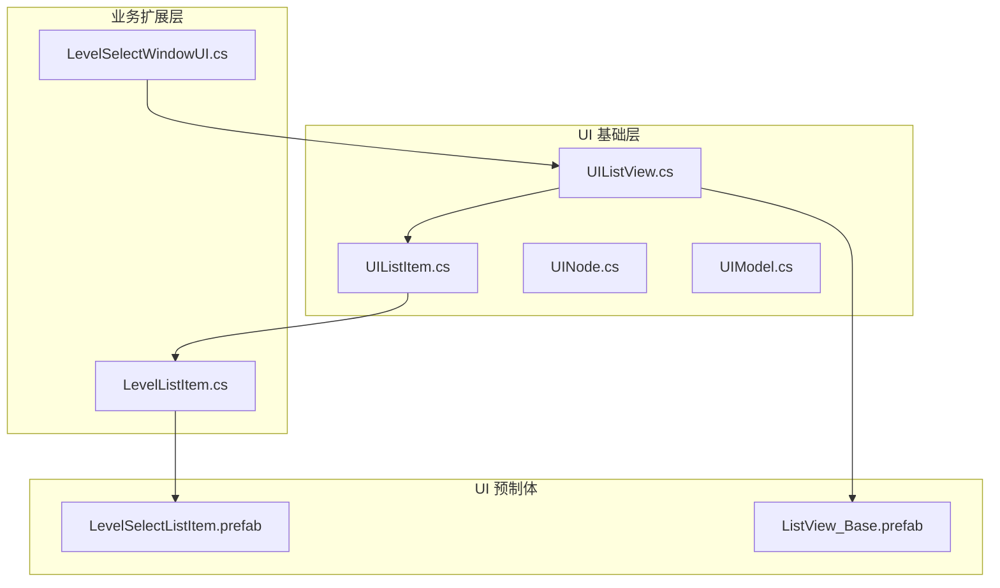
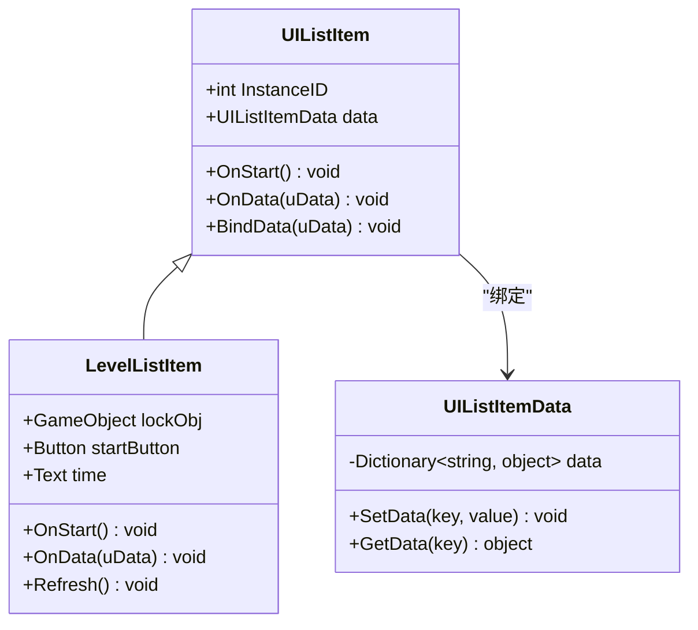
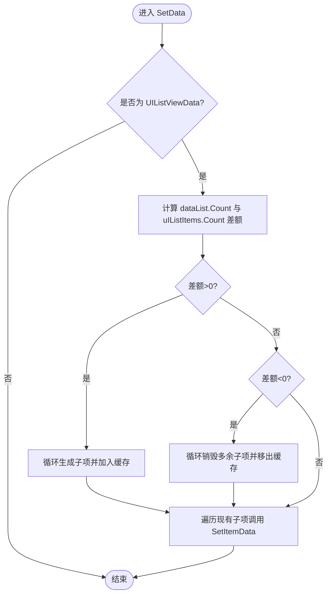
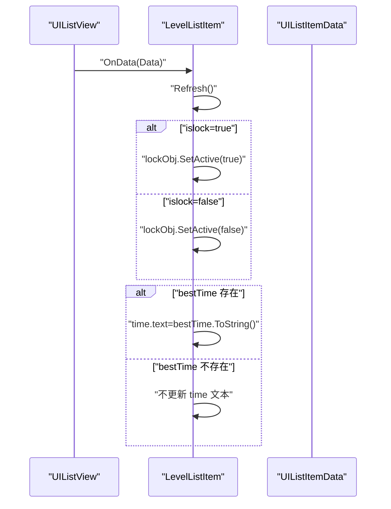
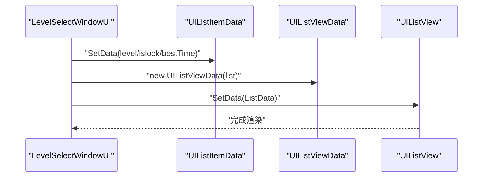
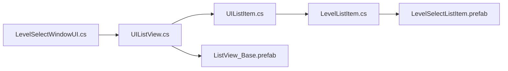

# 关卡列表项组件

<cite>
**本文档引用的文件**
- [UIListItem.cs](file://Assets/Scripts/UI/UIListItem.cs)
- [UIListView.cs](file://Assets/Scripts/UI/UIListView.cs)
- [LevelListItem.cs](file://Assets/Scripts/UI/Window/LevelListItem.cs)
- [LevelSelectWindowUI.cs](file://Assets/Scripts/UI/Window/LevelSelectWindowUI.cs)
- [UINode.cs](file://Assets/Scripts/UI/UINode.cs)
- [UIModel.cs](file://Assets/Scripts/UI/UIModel.cs)
- [LevelSelectListItem.prefab](file://Assets/Art/UI/Prefabs/WindowUI/LevelSelectWindow/LevelSelectListItem.prefab)
- [ListView_Base.prefab](file://Assets/Art/UI/Prefabs/WindowUI/Component/ListView_Base.prefab)
</cite>

## 目录
1. [简介](#简介)
2. [项目结构](#项目结构)
3. [核心组件](#核心组件)
4. [架构总览](#架构总览)
5. [详细组件分析](#详细组件分析)
6. [依赖关系分析](#依赖关系分析)
7. [性能考虑](#性能考虑)
8. [故障排除指南](#故障排除指南)
9. [结论](#结论)

## 简介
本文件针对 ProjectR 项目的关卡列表项组件进行深入技术文档化，重点覆盖以下方面：
- UIListItem 与 LevelListItem 的设计模式、复用机制与数据绑定原理
- 列表项模板系统、数据更新与事件响应机制
- 列表滚动优化、虚拟化技术与内存管理策略
- 列表项的自定义开发、样式配置与交互效果实现
- 性能优化指南、大数据量处理与用户体验改进方案

该组件体系采用“数据驱动 + 模板复用”的架构：UIListView 负责数据与视图的桥接，UIListItem 定义统一的数据绑定接口，具体业务（如关卡）通过继承 UIListItem 实现差异化渲染。

## 项目结构
与关卡列表项组件直接相关的文件组织如下：
- UI 基础层：UIListItem.cs、UIListView.cs、UINode.cs、UIModel.cs
- 业务扩展层：LevelListItem.cs（关卡列表项）、LevelSelectWindowUI.cs（窗口控制器）
- UI 预制体：LevelSelectListItem.prefab（列表项模板）、ListView_Base.prefab（基础容器）

**图表来源**
- [UIListItem.cs:6-24](file://Assets/Scripts/UI/UIListItem.cs#L6-L24)
- [UIListView.cs:8-68](file://Assets/Scripts/UI/UIListView.cs#L8-L68)
- [LevelListItem.cs:6-28](file://Assets/Scripts/UI/Window/LevelListItem.cs#L6-L28)
- [LevelSelectWindowUI.cs:7-46](file://Assets/Scripts/UI/Window/LevelSelectWindowUI.cs#L7-L46)
- [LevelSelectListItem.prefab:749-792](file://Assets/Art/UI/Prefabs/WindowUI/LevelSelectWindow/LevelSelectListItem.prefab#L749-L792)
- [ListView_Base.prefab:128-173](file://Assets/Art/UI/Prefabs/WindowUI/Component/ListView_Base.prefab#L128-L173)

**章节来源**
- [UIListItem.cs:1-50](file://Assets/Scripts/UI/UIListItem.cs#L1-L50)
- [UIListView.cs:1-101](file://Assets/Scripts/UI/UIListView.cs#L1-L101)
- [LevelListItem.cs:1-31](file://Assets/Scripts/UI/Window/LevelListItem.cs#L1-L31)
- [LevelSelectWindowUI.cs:1-50](file://Assets/Scripts/UI/Window/LevelSelectWindowUI.cs#L1-L50)
- [LevelSelectListItem.prefab:749-792](file://Assets/Art/UI/Prefabs/WindowUI/LevelSelectWindow/LevelSelectListItem.prefab#L749-L792)
- [ListView_Base.prefab:128-173](file://Assets/Art/UI/Prefabs/WindowUI/Component/ListView_Base.prefab#L128-L173)

## 核心组件
- UIListItem：定义列表项的统一接口，负责接收数据并触发刷新逻辑；提供实例 ID 与数据绑定能力。
- UIListItemData：轻量级键值对数据容器，支持安全写入与读取。
- UIListView：负责根据数据源动态生成/销毁子项、绑定数据、索引查询。
- LevelListItem：业务扩展，基于 UIListItem 实现关卡项的锁定状态、最佳时间等展示逻辑。
- LevelSelectWindowUI：窗口控制器，组装测试数据并通过 UIListView 渲染。
- UINode/UIModel：UI 架构基类与资源加载模型，支撑窗口生命周期与资源装配。

关键职责与关系：
- UIListView 维护 UIListItem 列表，按需实例化或销毁，确保内存占用与渲染数量匹配。
- UIListItem 提供 OnData/OnStart 生命周期钩子，子类可重写以实现差异化渲染。
- LevelListItem 通过数据字典键访问（如 islock、bestTime）完成 UI 更新。

**章节来源**
- [UIListItem.cs:6-24](file://Assets/Scripts/UI/UIListItem.cs#L6-L24)
- [UIListItem.cs:25-47](file://Assets/Scripts/UI/UIListItem.cs#L25-L47)
- [UIListView.cs:8-68](file://Assets/Scripts/UI/UIListView.cs#L8-L68)
- [LevelListItem.cs:6-28](file://Assets/Scripts/UI/Window/LevelListItem.cs#L6-L28)
- [LevelSelectWindowUI.cs:7-46](file://Assets/Scripts/UI/Window/LevelSelectWindowUI.cs#L7-L46)
- [UINode.cs:9-57](file://Assets/Scripts/UI/UINode.cs#L9-L57)
- [UIModel.cs:9-61](file://Assets/Scripts/UI/UIModel.cs#L9-L61)

## 架构总览
下图展示了从窗口到列表再到具体列表项的数据流与控制流：

```mermaid
sequenceDiagram
participant Window as "LevelSelectWindowUI"
participant List as "UIListView"
participant Item as "LevelListItem"
participant Data as "UIListItemData"
Window->>List : "SetData(UIListViewData)"
List->>List : "计算差额并生成/销毁子项"
loop "遍历数据"
List->>Item : "OnData(Data)"
Item->>Item : "Refresh()"
Item-->>List : "完成渲染"
end
Note over Window,List : "数据驱动渲染，子项通过模板复用"
```

**图表来源**
- [LevelSelectWindowUI.cs:28-46](file://Assets/Scripts/UI/Window/LevelSelectWindowUI.cs#L28-L46)
- [UIListView.cs:18-45](file://Assets/Scripts/UI/UIListView.cs#L18-L45)
- [LevelListItem.cs:14-26](file://Assets/Scripts/UI/Window/LevelListItem.cs#L14-L26)

## 详细组件分析

### UIListItem 设计与数据绑定
- 设计模式：模板方法 + 数据驱动
  - OnStart/OnData 作为生命周期钩子，子类可重写以实现初始化与数据更新。
  - BindData 将数据注入到 UIListItem.data，供子类通过 GetData 访问。
- 数据绑定原理：
  - UIListItemData 使用字典存储键值，避免强类型耦合，便于扩展。
  - 写入时进行重复键检查，防止覆盖；读取时返回 null 表示不存在。
- 复用机制：
  - UIListView 通过 itemPrefab 与 Content 动态实例化 UIListItem 子类。
  - 通过 uIListItems 缓存已生成的子项，减少频繁查找。

**图表来源**
- [UIListItem.cs:6-24](file://Assets/Scripts/UI/UIListItem.cs#L6-L24)
- [UIListItem.cs:25-47](file://Assets/Scripts/UI/UIListItem.cs#L25-L47)
- [LevelListItem.cs:6-28](file://Assets/Scripts/UI/Window/LevelListItem.cs#L6-L28)

**章节来源**
- [UIListItem.cs:6-24](file://Assets/Scripts/UI/UIListItem.cs#L6-L24)
- [UIListItem.cs:25-47](file://Assets/Scripts/UI/UIListItem.cs#L25-L47)
- [LevelListItem.cs:6-28](file://Assets/Scripts/UI/Window/LevelListItem.cs#L6-L28)

### UIListView 模板系统与数据更新
- 模板系统：
  - itemPrefab 作为列表项模板，Content 作为父容器。
  - GenItem 通过 Instantiate 创建子项并挂载到 Content 下。
- 数据更新流程：
  - SetData 接收 UIListViewData，比较当前子项数量与数据条目数：
    - 若数据更多：循环生成新子项并加入缓存。
    - 若数据更少：销毁尾部多余子项并从缓存移除。
  - 最后对现有子项逐一调用 SetItemData，触发 OnData。
- 索引查询：
  - GetItemIndex 支持根据 UIListItem 获取其在列表中的索引。

**图表来源**
- [UIListView.cs:18-45](file://Assets/Scripts/UI/UIListView.cs#L18-L45)
- [UIListView.cs:50-67](file://Assets/Scripts/UI/UIListView.cs#L50-L67)

**章节来源**
- [UIListView.cs:8-68](file://Assets/Scripts/UI/UIListView.cs#L8-L68)

### LevelListItem 业务渲染与交互
- 业务字段：
  - lockObj：用于显示/隐藏锁定状态
  - startButton：开始按钮（可绑定点击事件）
  - time：最佳时间文本
- 渲染逻辑：
  - OnData 调用基类绑定后触发 Refresh
  - Refresh 根据 islock 控制 lockObj 显示；若存在 bestTime，则格式化显示

**图表来源**
- [LevelListItem.cs:14-26](file://Assets/Scripts/UI/Window/LevelListItem.cs#L14-L26)

**章节来源**
- [LevelListItem.cs:6-28](file://Assets/Scripts/UI/Window/LevelListItem.cs#L6-L28)

### LevelSelectWindowUI 数据组装与事件绑定
- 数据组装：
  - 构造多个 UIListItemData，填充 level、islock、bestTime 等键值
  - 包装为 UIListViewData 并调用 listView.SetData
- 事件绑定：
  - 全屏关闭按钮 onClick 绑定 Close 回调

**图表来源**
- [LevelSelectWindowUI.cs:28-46](file://Assets/Scripts/UI/Window/LevelSelectWindowUI.cs#L28-L46)
- [UIListView.cs:18-45](file://Assets/Scripts/UI/UIListView.cs#L18-L45)

**章节来源**
- [LevelSelectWindowUI.cs:7-46](file://Assets/Scripts/UI/Window/LevelSelectWindowUI.cs#L7-L46)

## 依赖关系分析
- 组件耦合：
  - UIListView 依赖 UIListItem 模板接口，通过反射式 TryGetComponent 获取子项组件，降低编译期耦合。
  - LevelListItem 依赖 UIListItemData 键值约定，渲染逻辑与数据解耦。
- 外部依赖：
  - Sirenix OdinInspector 用于编辑器可视化（如 itemPrefab 字段标签）
  - Unity UI 组件（Button、Text、RectTransform 等）用于渲染与布局

**图表来源**
- [UIListView.cs:8-17](file://Assets/Scripts/UI/UIListView.cs#L8-L17)
- [UIListItem.cs:6-9](file://Assets/Scripts/UI/UIListItem.cs#L6-L9)
- [LevelListItem.cs:6-10](file://Assets/Scripts/UI/Window/LevelListItem.cs#L6-L10)
- [LevelSelectWindowUI.cs:10-14](file://Assets/Scripts/UI/Window/LevelSelectWindowUI.cs#L10-L14)
- [LevelSelectListItem.prefab:749-792](file://Assets/Art/UI/Prefabs/WindowUI/LevelSelectWindow/LevelSelectListItem.prefab#L749-L792)
- [ListView_Base.prefab:128-173](file://Assets/Art/UI/Prefabs/WindowUI/Component/ListView_Base.prefab#L128-L173)

**章节来源**
- [UIListView.cs:8-17](file://Assets/Scripts/UI/UIListView.cs#L8-L17)
- [UIListItem.cs:6-9](file://Assets/Scripts/UI/UIListItem.cs#L6-L9)
- [LevelListItem.cs:6-10](file://Assets/Scripts/UI/Window/LevelListItem.cs#L6-L10)
- [LevelSelectWindowUI.cs:10-14](file://Assets/Scripts/UI/Window/LevelSelectWindowUI.cs#L10-L14)

## 性能考虑
- 列表滚动优化与虚拟化
  - 当前实现为“按需生成/销毁”，适合中等规模数据集；对于超大数据量，建议引入虚拟化（仅渲染可视区域内的子项，并复用子项变换位置），以减少 Instantiate/Destroy 次数与 GC 压力。
- 内存管理策略
  - 通过 UIListView 缓存 uIListItems，避免频繁查找；销毁时及时 RemoveAt，防止列表碎片化。
  - 子项销毁时注意解除事件订阅，避免内存泄漏。
- 数据更新与渲染
  - SetData 中先扩容再缩容，最后统一绑定数据，减少多次 UI 变更带来的布局抖动。
  - 子项 Refresh 仅在必要时更新可见 UI 元素（如 lockObj、time），避免无谓的 UI 组件操作。
- 大数据量处理建议
  - 分页加载：将 UIListViewData.dataList 分批传入，逐步 SetData。
  - 延迟渲染：首次只渲染可视区域，滚动时动态补充。
  - 对象池：对 UIListItem 进行对象池管理，减少 Instantiate/Destroy。
- 用户体验改进
  - 在数据切换时提供过渡动画（淡入/位移动画）提升感知流畅度。
  - 锁定状态与解锁状态使用不同视觉层级（颜色/图标）增强可读性。

[本节为通用性能指导，无需特定文件引用]

## 故障排除指南
- 常见问题与定位
  - 子项未显示或显示异常：检查 itemPrefab 是否挂载了 LevelListItem 组件，以及 Content 是否正确赋值。
  - 数据覆盖错误：确认 UIListItemData.SetData 未重复写入相同键；否则会记录错误日志。
  - 销毁后仍响应事件：确保在 OnDestroy 或 UIListView 销毁子项时解除按钮等事件订阅。
- 调试建议
  - 在 UIListItem.OnStart/OnData 中添加日志，观察生命周期触发顺序。
  - 在 LevelSelectWindowUI.TestDeal 中打印 dataList 长度与内容，验证数据组装正确性。
- 相关实现参考
  - UIListItemData 写入重复键时的日志输出
  - UIListView 的 GenItem 与 Destroy 流程
  - LevelListItem.Refresh 的条件渲染逻辑

**章节来源**
- [UIListItem.cs:30-37](file://Assets/Scripts/UI/UIListItem.cs#L30-L37)
- [UIListView.cs:50-67](file://Assets/Scripts/UI/UIListView.cs#L50-L67)
- [LevelListItem.cs:19-26](file://Assets/Scripts/UI/Window/LevelListItem.cs#L19-L26)

## 结论
关卡列表项组件通过“模板 + 数据驱动”的方式实现了高内聚、低耦合的 UI 架构。UIListItem 提供统一的数据绑定接口，UIListView 负责模板复用与生命周期管理，LevelListItem 则专注于业务渲染。配合 UINode/UIModel 的窗口与资源体系，整体具备良好的可扩展性与可维护性。针对大规模数据与复杂交互，建议引入虚拟化与对象池等优化手段，持续提升性能与用户体验。