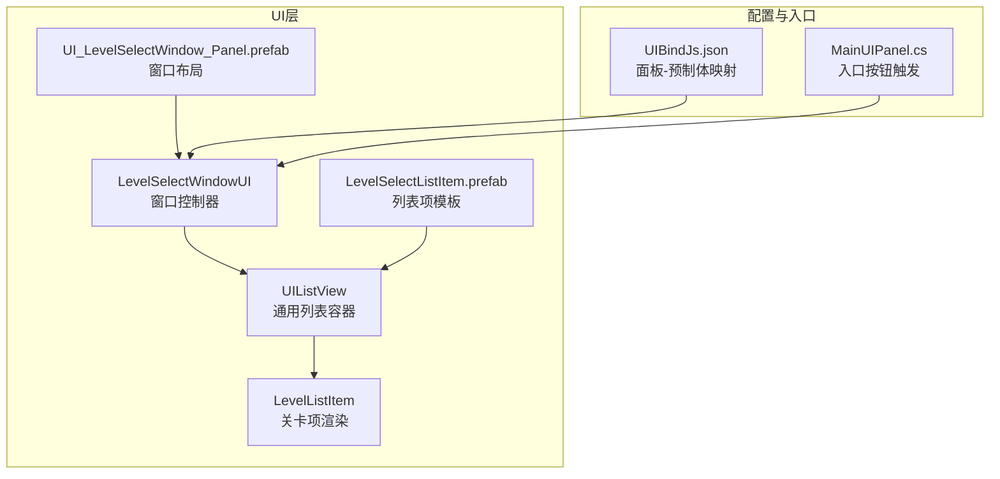
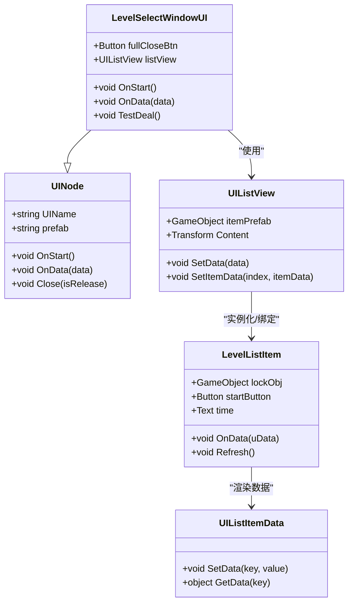
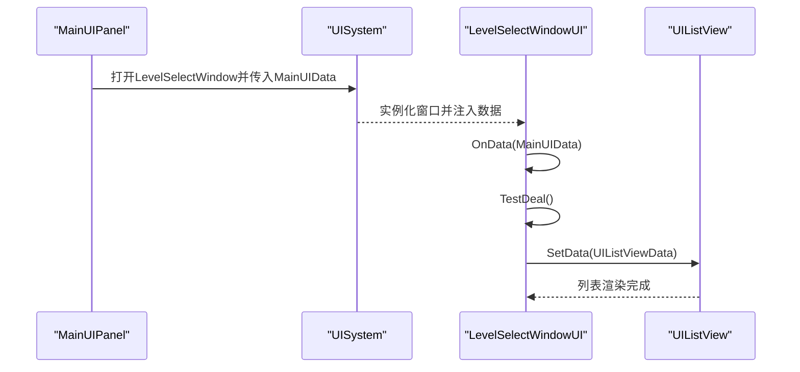
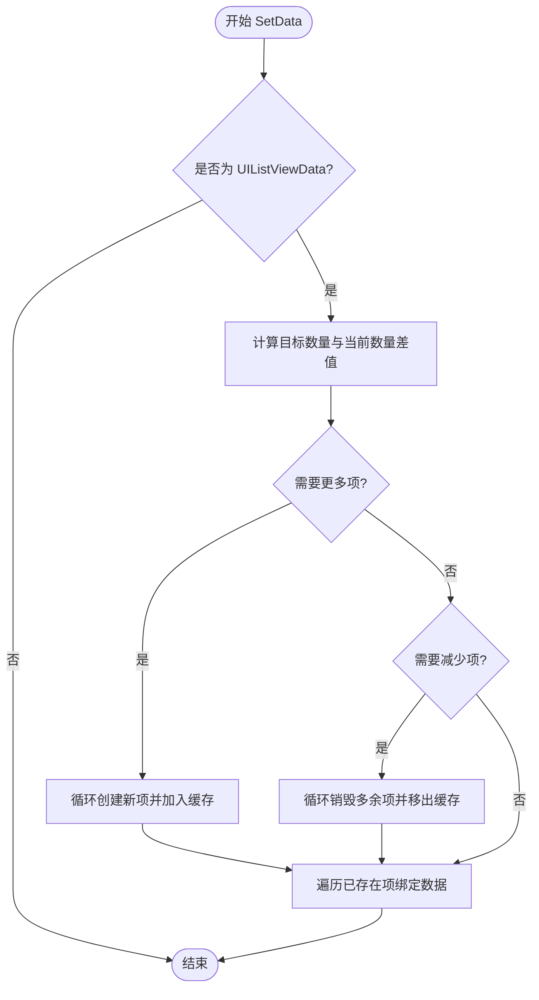
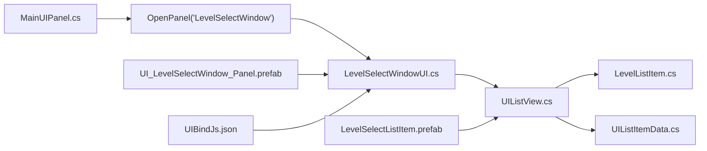

# 关卡选择窗口

<cite>
**本文档引用的文件**
- [LevelSelectWindowUI.cs](file://Assets/Scripts/UI/Window/LevelSelectWindowUI.cs)
- [LevelListItem.cs](file://Assets/Scripts/UI/Window/LevelListItem.cs)
- [UI_LevelSelectWindow_Panel.prefab](file://Assets/Art/UI/Prefabs/WindowUI/LevelSelectWindow/UI_LevelSelectWindow_Panel.prefab)
- [LevelSelectListItem.prefab](file://Assets/Art/UI/Prefabs/WindowUI/LevelSelectWindow/LevelSelectListItem.prefab)
- [UIBindJs.json](file://Assets/Scripts/UI/UIBindJs.json)
- [UINode.cs](file://Assets/Scripts/UI/UINode.cs)
- [UIListView.cs](file://Assets/Scripts/UI/UIListView.cs)
- [UIListItem.cs](file://Assets/Scripts/UI/UIListItem.cs)
- [UIModel.cs](file://Assets/Scripts/UI/UIModel.cs)
- [MainUIPanel.cs](file://Assets/Scripts/UI/MainUI/MainUIPanel.cs)
</cite>

## 目录
1. [简介](#简介)
2. [项目结构](#项目结构)
3. [核心组件](#核心组件)
4. [架构总览](#架构总览)
5. [详细组件分析](#详细组件分析)
6. [依赖关系分析](#依赖关系分析)
7. [性能考虑](#性能考虑)
8. [故障排除指南](#故障排除指南)
9. [结论](#结论)
10. [附录](#附录)

## 简介
本文件面向ProjectR项目的关卡选择窗口（LevelSelectWindow）进行系统化技术文档整理，重点覆盖以下方面：
- LevelSelectWindowUI组件的架构设计、功能特性与导航逻辑
- 关卡列表的生成、筛选与排序机制
- 关卡解锁条件、难度标识与进度显示的实现方式
- 关卡预览、选择确认与场景切换的完整流程
- 关卡选择窗口的自定义开发指南、图标配置与动画效果
- 性能优化、数据缓存与用户体验设计最佳实践

## 项目结构
关卡选择窗口由UI层脚本与预制体共同构成，采用“节点-列表-项”的分层结构：
- LevelSelectWindowUI：窗口控制器，负责打开关闭、接收数据、构建列表数据并绑定到UI列表
- UIListView：通用列表容器，负责动态实例化与复用UIListItem
- LevelListItem：单个关卡项，负责渲染解锁状态、最佳时间等信息
- 预制体：UI_LevelSelectWindow_Panel.prefab承载窗口布局与交互控件；LevelSelectListItem.prefab承载列表项模板
- 绑定配置：UIBindJs.json将面板名称映射到对应预制体路径
- 上层入口：MainUIPanel.cs通过UISystem打开LevelSelectWindow并传递数据

**图表来源**
- [LevelSelectWindowUI.cs:1-50](file://Assets/Scripts/UI/Window/LevelSelectWindowUI.cs#L1-L50)
- [UIListView.cs:1-101](file://Assets/Scripts/UI/UIListView.cs#L1-L101)
- [LevelListItem.cs:1-31](file://Assets/Scripts/UI/Window/LevelListItem.cs#L1-L31)
- [UI_LevelSelectWindow_Panel.prefab:289-374](file://Assets/Art/UI/Prefabs/WindowUI/LevelSelectWindow/UI_LevelSelectWindow_Panel.prefab#L289-L374)
- [LevelSelectListItem.prefab:749-792](file://Assets/Art/UI/Prefabs/WindowUI/LevelSelectWindow/LevelSelectListItem.prefab#L749-L792)
- [UIBindJs.json:19-22](file://Assets/Scripts/UI/UIBindJs.json#L19-L22)
- [MainUIPanel.cs:17-21](file://Assets/Scripts/UI/MainUI/MainUIPanel.cs#L17-L21)

**章节来源**
- [LevelSelectWindowUI.cs:1-50](file://Assets/Scripts/UI/Window/LevelSelectWindowUI.cs#L1-L50)
- [UI_LevelSelectWindow_Panel.prefab:289-374](file://Assets/Art/UI/Prefabs/WindowUI/LevelSelectWindow/UI_LevelSelectWindow_Panel.prefab#L289-L374)
- [UIBindJs.json:19-22](file://Assets/Scripts/UI/UIBindJs.json#L19-L22)
- [MainUIPanel.cs:17-21](file://Assets/Scripts/UI/MainUI/MainUIPanel.cs#L17-L21)

## 核心组件
- LevelSelectWindowUI：继承UINode，负责窗口生命周期、事件绑定与数据初始化
- UIListView：通用列表容器，支持动态增删改查与复用
- LevelListItem：继承UIListItem，负责单项渲染（解锁状态、最佳时间）
- UINode：UI节点基类，提供统一的打开/关闭/数据传递接口
- UIListItem/UIListItemData：列表项数据容器，键值对存储
- UIModel：用于异步加载并实例化3D模型作为预览（可选）
- MainUIPanel：主界面入口，触发打开关卡选择窗口

**章节来源**
- [LevelSelectWindowUI.cs:7-47](file://Assets/Scripts/UI/Window/LevelSelectWindowUI.cs#L7-L47)
- [UIListView.cs:8-68](file://Assets/Scripts/UI/UIListView.cs#L8-L68)
- [LevelListItem.cs:6-28](file://Assets/Scripts/UI/Window/LevelListItem.cs#L6-L28)
- [UINode.cs:9-57](file://Assets/Scripts/UI/UINode.cs#L9-L57)
- [UIListItem.cs:6-47](file://Assets/Scripts/UI/UIListItem.cs#L6-L47)
- [UIModel.cs:9-60](file://Assets/Scripts/UI/UIModel.cs#L9-L60)
- [MainUIPanel.cs:8-30](file://Assets/Scripts/UI/MainUI/MainUIPanel.cs#L8-L30)

## 架构总览
关卡选择窗口遵循“控制器-视图-数据”三层分离：
- 控制器：LevelSelectWindowUI在OnStart中注册关闭按钮事件，在OnData中接收数据并调用测试数据填充
- 视图：UI_LevelSelectWindow_Panel.prefab定义窗口布局；UIListView承载滚动列表；LevelSelectListItem.prefab定义列表项
- 数据：UIListItemData封装键值对数据（如level、islock、bestTime），UIListViewData封装列表数据集合

**图表来源**
- [UINode.cs:9-57](file://Assets/Scripts/UI/UINode.cs#L9-L57)
- [LevelSelectWindowUI.cs:7-47](file://Assets/Scripts/UI/Window/LevelSelectWindowUI.cs#L7-L47)
- [UIListView.cs:8-68](file://Assets/Scripts/UI/UIListView.cs#L8-L68)
- [LevelListItem.cs:6-28](file://Assets/Scripts/UI/Window/LevelListItem.cs#L6-L28)
- [UIListItem.cs:25-47](file://Assets/Scripts/UI/UIListItem.cs#L25-L47)

## 详细组件分析

### LevelSelectWindowUI：窗口控制器
- 职责
  - 注册关闭按钮事件，调用Close方法
  - 接收上层传入的数据（如MainUIData），打印日志
  - 构造测试数据（level、islock、bestTime），封装为UIListViewData并设置到listView
- 数据流
  - 上层MainUIPanel通过UISystem.OpenPanel传递MainUIData
  - LevelSelectWindowUI.OnData接收数据后调用TestDeal
  - TestDeal构造UIListItemData列表，创建UIListViewData并调用listView.SetData

**图表来源**
- [MainUIPanel.cs:17-21](file://Assets/Scripts/UI/MainUI/MainUIPanel.cs#L17-L21)
- [LevelSelectWindowUI.cs:15-46](file://Assets/Scripts/UI/Window/LevelSelectWindowUI.cs#L15-L46)
- [UIListView.cs:18-44](file://Assets/Scripts/UI/UIListView.cs#L18-L44)

**章节来源**
- [LevelSelectWindowUI.cs:11-46](file://Assets/Scripts/UI/Window/LevelSelectWindowUI.cs#L11-L46)
- [MainUIPanel.cs:17-21](file://Assets/Scripts/UI/MainUI/MainUIPanel.cs#L17-L21)

### UIListView：列表容器与数据绑定
- 动态管理列表项
  - 根据UIListViewData中的数据数量动态创建或销毁UIListItem
  - 支持按索引设置单项数据，触发UIListItem.OnData
- 复用策略
  - 通过uIListItems缓存已实例化的列表项，避免频繁Instantiate
- 数据结构
  - UIListViewData封装List<UIListItemData>，提供增删改查接口

**图表来源**
- [UIListView.cs:18-68](file://Assets/Scripts/UI/UIListView.cs#L18-L68)

**章节来源**
- [UIListView.cs:18-68](file://Assets/Scripts/UI/UIListView.cs#L18-L68)

### LevelListItem：关卡项渲染
- 渲染内容
  - lockObj：根据islock控制显示隐藏
  - time：根据bestTime更新文本
  - startButton：可扩展为启动关卡的交互入口
- 生命周期
  - OnData接收UIListItemData后调用Refresh刷新显示

**章节来源**
- [LevelListItem.cs:14-26](file://Assets/Scripts/UI/Window/LevelListItem.cs#L14-L26)

### 预制体与绑定配置
- UI_LevelSelectWindow_Panel.prefab
  - 定义窗口根节点UINode组件，包含fullCloseBtn与listView字段
  - 包含List View子节点，挂载UIListView组件并关联itemPrefab
- LevelSelectListItem.prefab
  - 列表项模板，包含lockObj、startButton、time等子元素
- UIBindJs.json
  - 将"LevelSelectWindow"映射到"UI_LevelSelectWindow_Panel.prefab"

**章节来源**
- [UI_LevelSelectWindow_Panel.prefab:289-374](file://Assets/Art/UI/Prefabs/WindowUI/LevelSelectWindow/UI_LevelSelectWindow_Panel.prefab#L289-L374)
- [LevelSelectListItem.prefab:749-792](file://Assets/Art/UI/Prefabs/WindowUI/LevelSelectWindow/LevelSelectListItem.prefab#L749-L792)
- [UIBindJs.json:19-22](file://Assets/Scripts/UI/UIBindJs.json#L19-L22)

### 关卡列表生成、筛选与排序机制
- 生成机制
  - LevelSelectWindowUI.TestDeal构造UIListItemData列表，封装为UIListViewData后SetData
- 筛选机制
  - 当前实现未体现筛选逻辑，可在UIListItemData中增加筛选字段并在UIListViewData中实现过滤
- 排序机制
  - UIListViewData提供Sort接口占位，当前未实现具体排序算法，可在SetData前对dataList进行排序

**章节来源**
- [LevelSelectWindowUI.cs:28-46](file://Assets/Scripts/UI/Window/LevelSelectWindowUI.cs#L28-L46)
- [UIListView.cs:69-97](file://Assets/Scripts/UI/UIListView.cs#L69-L97)

### 关卡解锁条件、难度标识与进度显示
- 解锁条件
  - islock布尔值控制lockObj显示，true时锁定，false时可选
- 难度标识
  - 可在UIListItemData中新增difficulty字段，通过LevelListItem渲染不同样式或图标
- 进度显示
  - bestTime以浮点数形式存储，LevelListItem将其格式化显示

**章节来源**
- [LevelListItem.cs:21-25](file://Assets/Scripts/UI/Window/LevelListItem.cs#L21-L25)
- [LevelSelectWindowUI.cs:30-39](file://Assets/Scripts/UI/Window/LevelSelectWindowUI.cs#L30-L39)

### 关卡预览、选择确认与场景切换
- 预览
  - UIModel组件支持异步加载并实例化3D模型作为预览（可选）
- 选择确认
  - startButton为可扩展入口，建议在点击时触发关卡加载流程
- 场景切换
  - 建议在确认选择后调用场景管理器加载对应关卡场景

**章节来源**
- [UIModel.cs:20-59](file://Assets/Scripts/UI/UIModel.cs#L20-L59)
- [LevelListItem.cs:8-10](file://Assets/Scripts/UI/Window/LevelListItem.cs#L8-L10)

## 依赖关系分析
- 组件耦合
  - LevelSelectWindowUI依赖UIListView与UIListItemData
  - UIListView依赖UIListItem与UIListItemData
  - LevelListItem依赖UIListItemData
- 外部依赖
  - UIBindJs.json提供面板与预制体的解耦绑定
  - MainUIPanel通过UISystem间接依赖LevelSelectWindowUI

**图表来源**
- [MainUIPanel.cs:17-21](file://Assets/Scripts/UI/MainUI/MainUIPanel.cs#L17-L21)
- [LevelSelectWindowUI.cs:15-46](file://Assets/Scripts/UI/Window/LevelSelectWindowUI.cs#L15-L46)
- [UIListView.cs:18-68](file://Assets/Scripts/UI/UIListView.cs#L18-L68)
- [LevelListItem.cs:14-26](file://Assets/Scripts/UI/Window/LevelListItem.cs#L14-L26)
- [UI_LevelSelectWindow_Panel.prefab:289-374](file://Assets/Art/UI/Prefabs/WindowUI/LevelSelectWindow/UI_LevelSelectWindow_Panel.prefab#L289-L374)
- [LevelSelectListItem.prefab:749-792](file://Assets/Art/UI/Prefabs/WindowUI/LevelSelectWindow/LevelSelectListItem.prefab#L749-L792)
- [UIBindJs.json:19-22](file://Assets/Scripts/UI/UIBindJs.json#L19-L22)

**章节来源**
- [MainUIPanel.cs:17-21](file://Assets/Scripts/UI/MainUI/MainUIPanel.cs#L17-L21)
- [LevelSelectWindowUI.cs:15-46](file://Assets/Scripts/UI/Window/LevelSelectWindowUI.cs#L15-L46)
- [UIListView.cs:18-68](file://Assets/Scripts/UI/UIListView.cs#L18-L68)
- [LevelListItem.cs:14-26](file://Assets/Scripts/UI/Window/LevelListItem.cs#L14-L26)
- [UI_LevelSelectWindow_Panel.prefab:289-374](file://Assets/Art/UI/Prefabs/WindowUI/LevelSelectWindow/UI_LevelSelectWindow_Panel.prefab#L289-L374)
- [LevelSelectListItem.prefab:749-792](file://Assets/Art/UI/Prefabs/WindowUI/LevelSelectWindow/LevelSelectListItem.prefab#L749-L792)
- [UIBindJs.json:19-22](file://Assets/Scripts/UI/UIBindJs.json#L19-L22)

## 性能考虑
- 列表项复用
  - UIListView通过uIListItems缓存已实例化项，减少Instantiate调用
- 动态增删
  - 仅在数量变化时创建/销毁，避免全量重建
- 数据绑定
  - 使用UIListItemData键值对存储，便于快速读写与序列化
- 异步加载
  - UIModel通过协程异步加载资源，避免阻塞主线程

**章节来源**
- [UIListView.cs:18-68](file://Assets/Scripts/UI/UIListView.cs#L18-L68)
- [UIModel.cs:20-59](file://Assets/Scripts/UI/UIModel.cs#L20-L59)

## 故障排除指南
- 列表不显示或显示异常
  - 检查UIListView.itemPrefab是否正确挂载
  - 确认UIListItemData键名一致（如level、islock、bestTime）
- 锁定图标不显示
  - 确认LevelListItem.lockObj在预制体中存在且未被禁用
- 最佳时间不更新
  - 确认LevelListItem.time在预制体中存在，并检查Refresh逻辑
- 打不开窗口
  - 检查UIBindJs.json中"LevelSelectWindow"映射是否正确
  - 确认MainUIPanel按钮事件已绑定并调用OpenPanel

**章节来源**
- [LevelListItem.cs:19-26](file://Assets/Scripts/UI/Window/LevelListItem.cs#L19-L26)
- [UI_LevelSelectWindow_Panel.prefab:289-374](file://Assets/Art/UI/Prefabs/WindowUI/LevelSelectWindow/UI_LevelSelectWindow_Panel.prefab#L289-L374)
- [UIBindJs.json:19-22](file://Assets/Scripts/UI/UIBindJs.json#L19-L22)
- [MainUIPanel.cs:17-21](file://Assets/Scripts/UI/MainUI/MainUIPanel.cs#L17-L21)

## 结论
关卡选择窗口采用清晰的分层架构，具备良好的扩展性与可维护性。当前实现完成了基础的列表渲染与交互入口，后续可在以下方面进一步完善：
- 增强筛选与排序能力
- 完善解锁条件与难度标识
- 补充预览与确认流程
- 优化性能与用户体验

## 附录

### 自定义开发指南
- 新增关卡项字段
  - 在UIListItemData中添加键值对（如difficulty、starCount）
  - 在LevelListItem中读取并渲染
- 修改列表项模板
  - 在LevelSelectListItem.prefab中调整布局与控件
  - 确保UIListView.itemPrefab指向新的模板
- 图标配置
  - 在UI_LevelSelectWindow_Panel.prefab中替换背景或装饰图片
  - 使用UIBindJs.json确保面板名称与预制体一致
- 动画效果
  - 在LevelSelectListItem.prefab中为关键控件添加CanvasGroup与动画组件
  - 在LevelSelectWindowUI中触发进入/退出动画

**章节来源**
- [LevelListItem.cs:19-26](file://Assets/Scripts/UI/Window/LevelListItem.cs#L19-L26)
- [UI_LevelSelectWindow_Panel.prefab:289-374](file://Assets/Art/UI/Prefabs/WindowUI/LevelSelectWindow/UI_LevelSelectWindow_Panel.prefab#L289-L374)
- [UIBindJs.json:19-22](file://Assets/Scripts/UI/UIBindJs.json#L19-L22)