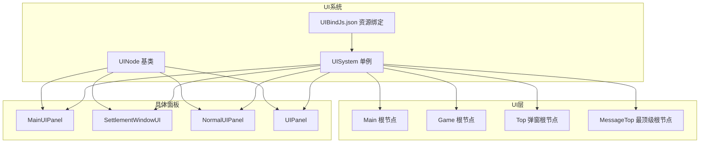
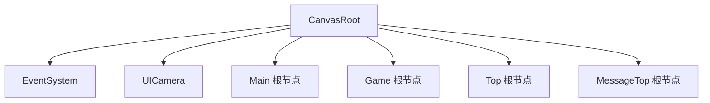
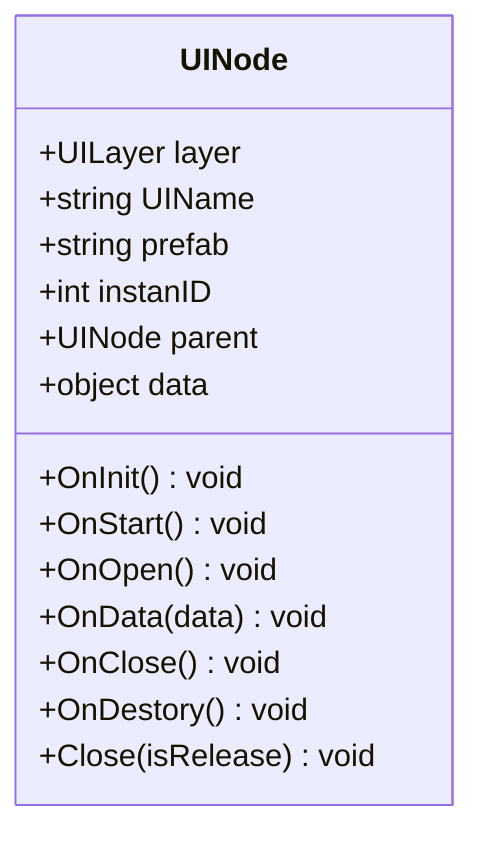
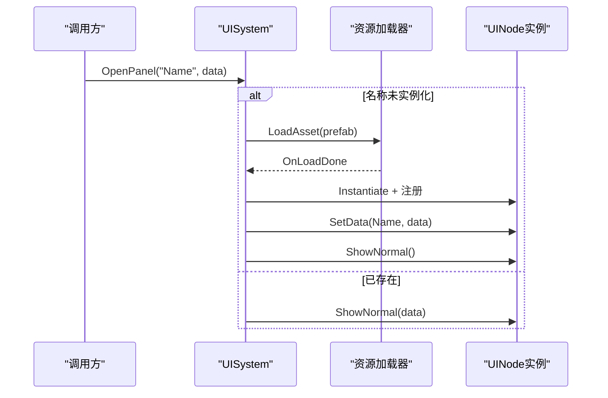
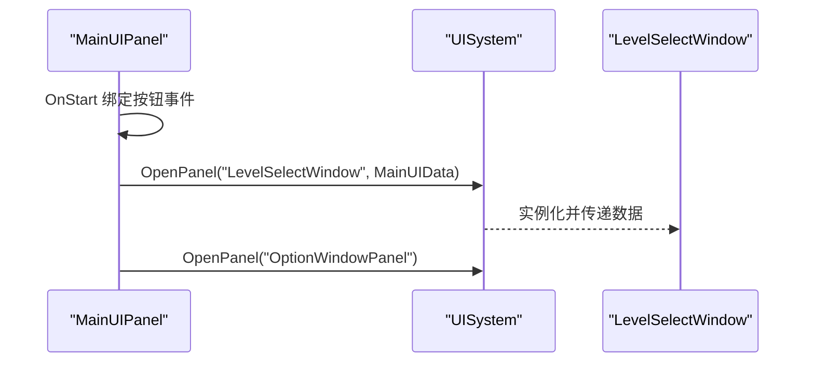
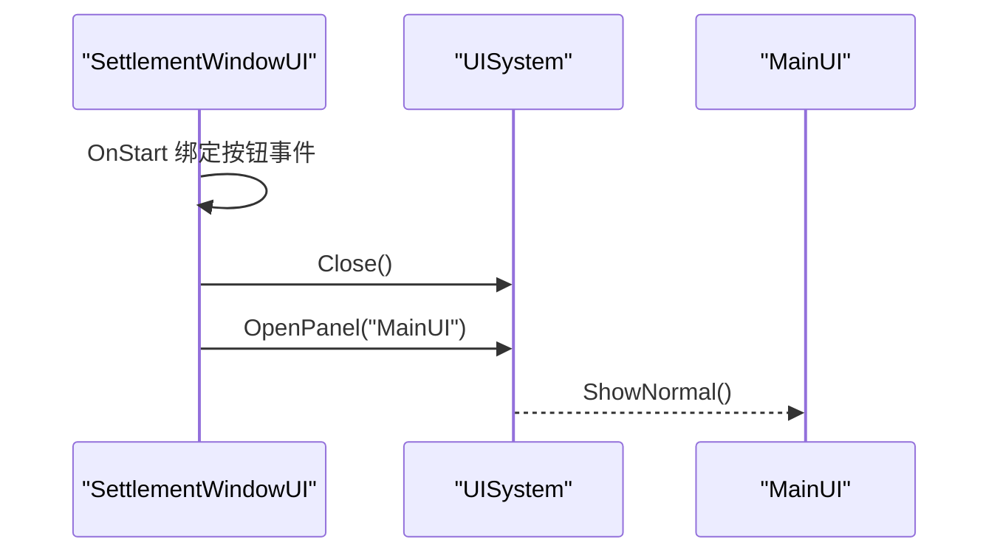
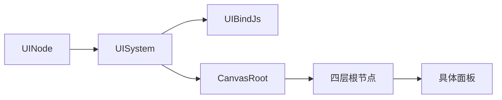

# 窗口界面系统

<cite>
**本文引用的文件**
- [UINode.cs](file://Assets/Scripts/UI/UINode.cs)
- [UISystem.cs](file://Assets/Scripts/Systems/Implement/UISystem/UISystem.cs)
- [MainUIPanel.cs](file://Assets/Scripts/UI/MainUI/MainUIPanel.cs)
- [SettlementWindowUI.cs](file://Assets/Scripts/UI/Window/SettlementWindowUI.cs)
- [NormalUIPanel.cs](file://Assets/Scripts/UI/NormalUIPanel.cs)
- [UIPanel.cs](file://Assets/Scripts/UI/UIPanel.cs)
- [UIBindJs.json](file://Assets/Scripts/UI/UIBindJs.json)
- [UI_SettlementWindow_Panel.prefab](file://Assets/Art/UI/Prefabs/WindowUI/SettlementWindow/UI_SettlementWindow_Panel.prefab)
</cite>

## 目录
1. [简介](#简介)
2. [项目结构](#项目结构)
3. [核心组件](#核心组件)
4. [架构总览](#架构总览)
5. [详细组件分析](#详细组件分析)
6. [依赖关系分析](#依赖关系分析)
7. [性能考虑](#性能考虑)
8. [故障排查指南](#故障排查指南)
9. [结论](#结论)
10. [附录](#附录)

## 简介
本文件面向ProjectR项目的窗口界面系统，系统性阐述窗口设计模式、实现机制与使用场景，重点覆盖OptionWindowUI、SettlementWindowUI等窗口组件的功能特性与交互逻辑；解释窗口层级管理、模态显示与事件冒泡处理；涵盖窗口的动态加载、内存管理与生命周期控制；并提供窗口自定义开发指南、样式配置与动画效果实现建议，以及性能优化、资源管理与调试方法。

## 项目结构
ProjectR的UI体系采用“节点化”窗口模型，以UINode为基类，通过UISystem进行统一管理。UI资源通过UIBindJs.json进行命名绑定，运行时由UISystem动态加载预制体并实例化为UINode子类对象，挂载到不同层级的Canvas根节点下。

图表来源
- [UISystem.cs:38-114](file://Assets/Scripts/Systems/Implement/UISystem/UISystem.cs#L38-L114)
- [UINode.cs:9-57](file://Assets/Scripts/UI/UINode.cs#L9-L57)
- [UIBindJs.json:1-32](file://Assets/Scripts/UI/UIBindJs.json#L1-L32)

章节来源
- [UISystem.cs:38-114](file://Assets/Scripts/Systems/Implement/UISystem/UISystem.cs#L38-L114)
- [UINode.cs:9-57](file://Assets/Scripts/UI/UINode.cs#L9-L57)
- [UIBindJs.json:1-32](file://Assets/Scripts/UI/UIBindJs.json#L1-L32)

## 核心组件
- UINode：所有UI窗口的基类，负责生命周期回调（OnInit/OnStart/OnOpen/OnData/OnClose/OnDestory）、关闭行为委托给UISystem、父子关系与数据传递。
- UISystem：UI系统单例，负责Canvas根节点生成、事件系统与UI摄像机初始化、UI资源动态加载、窗口打开/关闭、层级管理与数据分发。
- 具体窗口：如MainUIPanel、SettlementWindowUI、NormalUIPanel等，继承UINode并实现各自业务逻辑与交互。

章节来源
- [UINode.cs:9-57](file://Assets/Scripts/UI/UINode.cs#L9-L57)
- [UISystem.cs:21-48](file://Assets/Scripts/Systems/Implement/UISystem/UISystem.cs#L21-L48)
- [MainUIPanel.cs:8-31](file://Assets/Scripts/UI/MainUI/MainUIPanel.cs#L8-L31)
- [SettlementWindowUI.cs:6-21](file://Assets/Scripts/UI/Window/SettlementWindowUI.cs#L6-L21)
- [NormalUIPanel.cs:6-31](file://Assets/Scripts/UI/NormalUIPanel.cs#L6-L31)

## 架构总览
UI系统采用分层渲染与事件系统分离的设计：CanvasRoot承载四层根节点（Main/Game/Top/MessageTop），每层对应不同的Z轴深度，确保层级正确叠加；EventSystem统一处理输入事件；UICamera负责UI渲染；UISystem负责资源加载、实例化、挂载与生命周期管理。

图表来源
- [UISystem.cs:49-92](file://Assets/Scripts/Systems/Implement/UISystem/UISystem.cs#L49-L92)

章节来源
- [UISystem.cs:49-92](file://Assets/Scripts/Systems/Implement/UISystem/UISystem.cs#L49-L92)

## 详细组件分析

### UINode 基类
- 关键职责
  - 生命周期：OnInit（初始化实例ID）、OnStart（默认将RectTransform归零）、OnOpen/OnData/OnClose/OnDestory（空实现，供子类覆写）。
  - 关闭策略：Close委托给UISystem，支持释放或隐藏两种模式。
  - 数据与父子：OnData可接收父节点或任意数据对象；data字段用于跨窗口传递。
- 设计要点
  - 通过UIName保证命名唯一性，便于UISystem按名索引。
  - 通过layer决定挂载到哪一层根节点，影响渲染顺序与遮挡关系。

图表来源
- [UINode.cs:9-57](file://Assets/Scripts/UI/UINode.cs#L9-L57)

章节来源
- [UINode.cs:9-57](file://Assets/Scripts/UI/UINode.cs#L9-L57)

### UISystem 系统
- 初始化流程
  - 加载UI资源绑定字典（UIBindJs.json）。
  - 创建CanvasRoot与四层根节点（Main/Game/Top/MessageTop），设置Z轴深度与尺寸。
  - 初始化EventSystem与UICamera。
  - 启动入口打开MainPanel。
- 打开窗口
  - OpenPanel根据名称查找绑定路径，若未实例化则异步加载预制体，完成后实例化并注册到对应层。
  - 若已存在，则调用ShowNormal仅激活并置顶。
- 关闭窗口
  - Close支持两种模式：隐藏（isRelease=false）与释放（isRelease=true，销毁GameObject并从字典移除）。
- 数据分发
  - SetData根据目标窗口名将数据注入对应UINode的OnData回调。

图表来源
- [UISystem.cs:161-246](file://Assets/Scripts/Systems/Implement/UISystem/UISystem.cs#L161-L246)

章节来源
- [UISystem.cs:38-114](file://Assets/Scripts/Systems/Implement/UISystem/UISystem.cs#L38-L114)
- [UISystem.cs:161-246](file://Assets/Scripts/Systems/Implement/UISystem/UISystem.cs#L161-L246)

### MainUIPanel 主界面
- 功能特性
  - 提供开始、选项、退出按钮，点击后通过UISystem打开其他窗口。
  - 使用MainUIData作为数据载体，向下一窗口传递消息与关卡列表。
- 交互逻辑
  - 开始按钮：构造MainUIData并通过OpenPanel("LevelSelectWindow", data)传递。
  - 选项按钮：直接打开OptionWindowPanel。
  - UIModel加载完成回调用于调试输出。

图表来源
- [MainUIPanel.cs:14-30](file://Assets/Scripts/UI/MainUI/MainUIPanel.cs#L14-L30)

章节来源
- [MainUIPanel.cs:8-31](file://Assets/Scripts/UI/MainUI/MainUIPanel.cs#L8-L31)

### SettlementWindowUI 结算窗口
- 功能特性
  - 包含关闭、返回、下一步等按钮，以及时间、评价、最佳记录等文本/图像控件。
- 交互逻辑
  - 关闭按钮：调用Close，默认隐藏。
  - 返回按钮：打开MainUI。
- 数据绑定
  - 预制体中声明了各控件引用，实际赋值在Inspector中完成。

图表来源
- [SettlementWindowUI.cs:16-21](file://Assets/Scripts/UI/Window/SettlementWindowUI.cs#L16-L21)
- [UI_SettlementWindow_Panel.prefab:420-433](file://Assets/Art/UI/Prefabs/WindowUI/SettlementWindow/UI_SettlementWindow_Panel.prefab#L420-L433)

章节来源
- [SettlementWindowUI.cs:6-21](file://Assets/Scripts/UI/Window/SettlementWindowUI.cs#L6-L21)
- [UI_SettlementWindow_Panel.prefab:420-433](file://Assets/Art/UI/Prefabs/WindowUI/SettlementWindow/UI_SettlementWindow_Panel.prefab#L420-L433)

### NormalUIPanel 通用面板
- 功能特性
  - 提供通用关闭按钮，点击后调用Close(true)释放资源。
  - OnData支持字符串与UINodeData类型，用于日志输出与数据透传。
- 使用场景
  - 适合作为轻量窗口模板，快速实现关闭与数据展示。

章节来源
- [NormalUIPanel.cs:6-31](file://Assets/Scripts/UI/NormalUIPanel.cs#L6-L31)

### UIPanel 抽象面板
- 作用
  - 作为UINode的派生基类，用于标识普通面板类型，便于分类管理与扩展。

章节来源
- [UIPanel.cs:3-6](file://Assets/Scripts/UI/UIPanel.cs#L3-L6)

## 依赖关系分析
- 组件耦合
  - UINode与UISystem：窗口关闭通过UINode委托UISystem执行，形成单向依赖。
  - UISystem与UI资源：通过UIBindJs.json进行解耦，避免硬编码路径。
  - 窗口间通信：通过UISystem.SetData与UINode.OnData实现松耦合数据传递。
- 层级与遮挡
  - 四层根节点按深度排列，Top层在Main之上，MessageTop最顶层，确保弹窗与提示的可见性。
- 事件系统
  - EventSystem统一处理输入事件，UICamera仅渲染UI层，避免与场景相机冲突。

图表来源
- [UISystem.cs:161-246](file://Assets/Scripts/Systems/Implement/UISystem/UISystem.cs#L161-L246)
- [UIBindJs.json:1-32](file://Assets/Scripts/UI/UIBindJs.json#L1-L32)

章节来源
- [UISystem.cs:161-246](file://Assets/Scripts/Systems/Implement/UISystem/UISystem.cs#L161-L246)
- [UIBindJs.json:1-32](file://Assets/Scripts/UI/UIBindJs.json#L1-L32)

## 性能考虑
- 动态加载与实例池
  - 建议对常用窗口启用实例池，减少Instantiate与Destroy开销；仅在极端情况下释放窗口。
- 层级管理
  - 合理使用Top与MessageTop层，避免过多弹窗同时激活导致的渲染压力。
- 事件系统
  - 保持EventSystem常驻，避免频繁创建销毁；按钮事件尽量在OnStart中一次性绑定。
- 资源管理
  - UI资源通过UIBindJs.json集中管理，避免重复加载；必要时使用Addressable或YooAsset进行热更新。
- 渲染优化
  - 控制每帧激活的UI数量，避免大量UI同时参与布局与渲染；使用GraphicRaycaster按需启用。

## 故障排查指南
- 打不开指定窗口
  - 检查UIBindJs.json中是否存在该名称的条目；确认prefab路径正确且资源存在。
- 窗口不显示或层级异常
  - 确认UINode.layer与CanvasRoot下对应根节点一致；检查Z轴深度与屏幕尺寸设置。
- 点击无响应
  - 确认按钮事件在OnStart中绑定；检查GraphicRaycaster是否启用；确认UI处于激活状态。
- 数据未到达
  - 确认SetData的目标名称与UIName一致；检查UINode.OnData是否被正确覆写。
- 内存泄漏
  - 确保不再使用的窗口调用Close并传入释放参数；检查是否仍有引用未释放。

章节来源
- [UISystem.cs:161-264](file://Assets/Scripts/Systems/Implement/UISystem/UISystem.cs#L161-L264)
- [UINode.cs:33-39](file://Assets/Scripts/UI/UINode.cs#L33-L39)

## 结论
ProjectR的窗口界面系统以UINode为核心，通过UISystem实现统一的资源加载、层级管理与生命周期控制。该架构具备良好的扩展性与可维护性，适合在多层级UI场景中稳定运行。建议在实际开发中遵循资源绑定规范、事件一次性绑定原则与合理的窗口释放策略，以获得更佳的性能与体验。

## 附录

### 窗口自定义开发指南
- 新建窗口步骤
  - 在UIBindJs.json中新增条目，填写唯一名称与预制体路径。
  - 编写UINode子类，实现OnStart/OnOpen/OnData等回调。
  - 在Inspector中为窗口预制体设置UIName、layer与prefab，并绑定控件引用。
- 样式配置
  - 使用CanvasScaler与Anchor适配不同分辨率；通过RectTransform控制尺寸与位置。
  - 通过UINode.layer调整层级，确保遮挡关系符合预期。
- 动画效果
  - 可在OnOpen中添加淡入/缩放等动画；在OnClose中播放收起动画后再隐藏或释放。
- 事件冒泡
  - 使用EventSystem统一处理点击事件；如需阻止冒泡，可在按钮回调中调用EventSystem.SetSelected或直接消费事件。

章节来源
- [UIBindJs.json:1-32](file://Assets/Scripts/UI/UIBindJs.json#L1-L32)
- [UINode.cs:9-57](file://Assets/Scripts/UI/UINode.cs#L9-L57)
- [UISystem.cs:161-246](file://Assets/Scripts/Systems/Implement/UISystem/UISystem.cs#L161-L246)