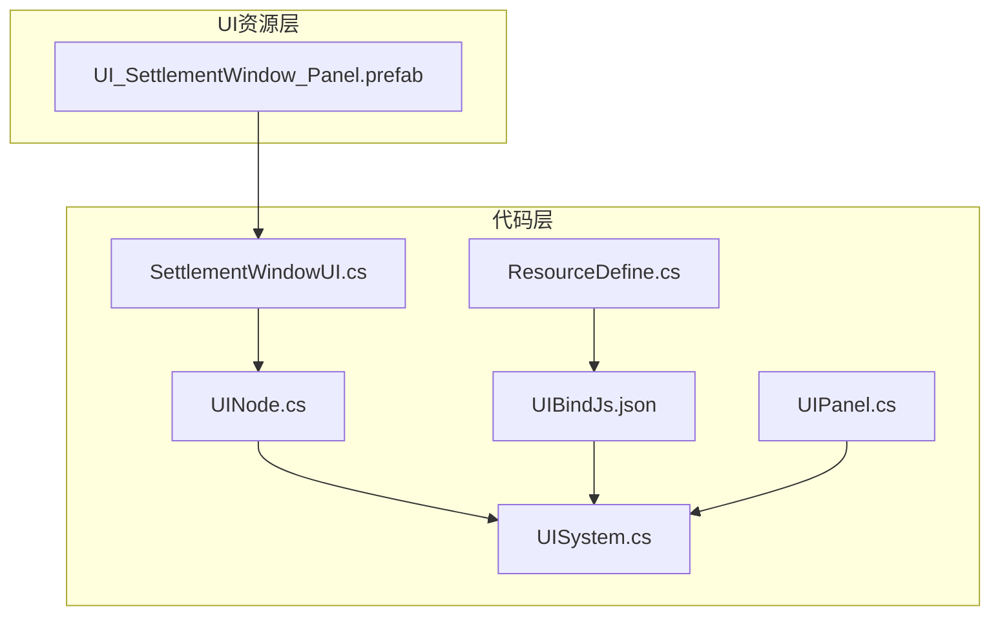
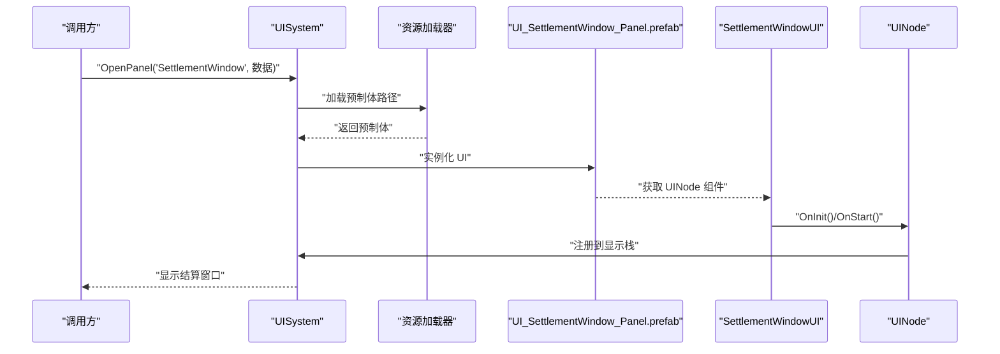
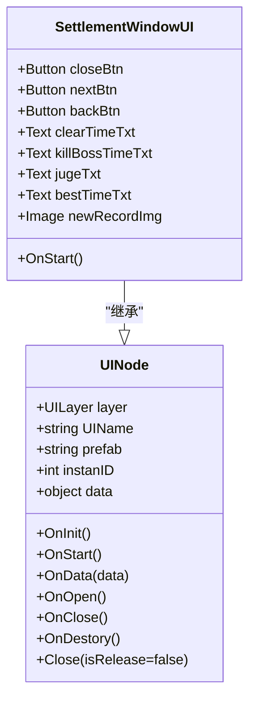
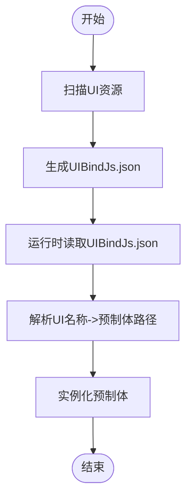
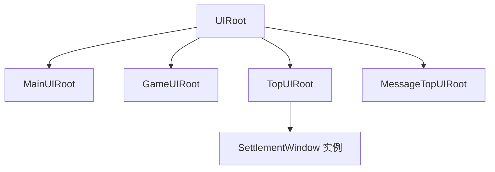
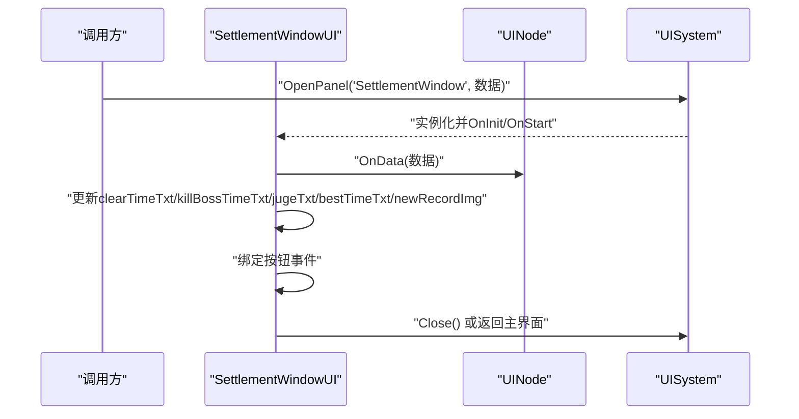
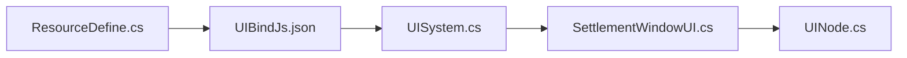

# 结算窗口

<cite>
**本文引用的文件**
- [SettlementWindowUI.cs](file://Assets/Scripts/UI/Window/SettlementWindowUI.cs)
- [UI_SettlementWindow_Panel.prefab](file://Assets/Art/UI/Prefabs/WindowUI/SettlementWindow/UI_SettlementWindow_Panel.prefab)
- [UIBindJs.json](file://Assets/Scripts/UI/UIBindJs.json)
- [UINode.cs](file://Assets/Scripts/UI/UINode.cs)
- [UIPanel.cs](file://Assets/Scripts/UI/UIPanel.cs)
- [UISystem.cs](file://Assets/Scripts/Systems/Implement/UISystem/UISystem.cs)
- [MainUIPanel.cs](file://Assets/Scripts/UI/MainUI/MainUIPanel.cs)
- [ResourceDefine.cs](file://Assets/Scripts/Config/Resource/ResourceDefine.cs)
</cite>

## 目录
1. [简介](#简介)
2. [项目结构](#项目结构)
3. [核心组件](#核心组件)
4. [架构总览](#架构总览)
5. [组件详细分析](#组件详细分析)
6. [依赖关系分析](#依赖关系分析)
7. [性能考量](#性能考量)
8. [故障排查指南](#故障排查指南)
9. [结论](#结论)
10. [附录](#附录)

## 简介
本文件围绕 ProjectR 的结算窗口（SettlementWindow）进行系统化技术文档整理，目标是帮助开发者快速理解并扩展结算界面的功能与实现。内容覆盖设计理念、实现机制、业务逻辑、状态管理、动画与交互流程、数据展示与统计、奖励分配、数据计算与存储、界面适配与本地化、性能优化与安全建议等。

## 项目结构
结算窗口在工程中的位置与职责划分如下：
- UI 资源层：Assets/Art/UI/Prefabs/WindowUI/SettlementWindow 下存放结算窗口的预制体与美术资源。
- 代码层：
  - UI 基类与节点：UINode.cs、UIPanel.cs 提供统一的 UI 生命周期与容器抽象。
  - UI 系统：UISystem.cs 负责 UI 的加载、实例化、层级管理、事件系统与相机配置。
  - 结算窗口脚本：SettlementWindowUI.cs 实现结算面板的交互入口与按钮绑定。
  - UI 绑定配置：UIBindJs.json 定义 UI 名称到预制体的映射。
  - 资源导出：ResourceDefine.cs 在构建时生成 UI 绑定配置文件。

**图表来源**
- [SettlementWindowUI.cs:1-24](file://Assets/Scripts/UI/Window/SettlementWindowUI.cs#L1-L24)
- [UI_SettlementWindow_Panel.prefab:327-457](file://Assets/Art/UI/Prefabs/WindowUI/SettlementWindow/UI_SettlementWindow_Panel.prefab#L327-L457)
- [UIBindJs.json:27-30](file://Assets/Scripts/UI/UIBindJs.json#L27-L30)
- [UINode.cs:1-59](file://Assets/Scripts/UI/UINode.cs#L1-L59)
- [UISystem.cs:161-178](file://Assets/Scripts/Systems/Implement/UISystem/UISystem.cs#L161-L178)
- [ResourceDefine.cs:58-86](file://Assets/Scripts/Config/Resource/ResourceDefine.cs#L58-L86)

**章节来源**
- [SettlementWindowUI.cs:1-24](file://Assets/Scripts/UI/Window/SettlementWindowUI.cs#L1-L24)
- [UI_SettlementWindow_Panel.prefab:327-457](file://Assets/Art/UI/Prefabs/WindowUI/SettlementWindow/UI_SettlementWindow_Panel.prefab#L327-L457)
- [UIBindJs.json:27-30](file://Assets/Scripts/UI/UIBindJs.json#L27-L30)
- [UINode.cs:1-59](file://Assets/Scripts/UI/UINode.cs#L1-L59)
- [UISystem.cs:161-178](file://Assets/Scripts/Systems/Implement/UISystem/UISystem.cs#L161-L178)
- [ResourceDefine.cs:58-86](file://Assets/Scripts/Config/Resource/ResourceDefine.cs#L58-L86)

## 核心组件
- SettlementWindowUI：结算窗口 UI 脚本，负责按钮事件绑定与基础生命周期回调。
- UINode：所有 UI 面板的基类，提供初始化、打开、关闭、销毁、数据传递等统一接口。
- UISystem：UI 系统核心，负责 Canvas、EventSystem、UICamera 初始化，UI 层级与显示栈管理，以及通过资源系统加载 UI 预制体。
- UI_SettlementWindow_Panel.prefab：结算窗口的 UI 预制体，包含文本、图片等控件，并声明 UI 名称为 SettlementWindow。
- UIBindJs.json：UI 名称到预制体路径的绑定表，由 UISystem 在运行时读取以定位并加载对应 UI。
- ResourceDefine.cs：在构建阶段扫描 UI 资源并生成 UIBindJs.json，确保运行时可正确加载。

**章节来源**
- [SettlementWindowUI.cs:6-21](file://Assets/Scripts/UI/Window/SettlementWindowUI.cs#L6-L21)
- [UINode.cs:9-57](file://Assets/Scripts/UI/UINode.cs#L9-L57)
- [UISystem.cs:21-48](file://Assets/Scripts/Systems/Implement/UISystem/UISystem.cs#L21-L48)
- [UI_SettlementWindow_Panel.prefab:417-432](file://Assets/Art/UI/Prefabs/WindowUI/SettlementWindow/UI_SettlementWindow_Panel.prefab#L417-L432)
- [UIBindJs.json:27-30](file://Assets/Scripts/UI/UIBindJs.json#L27-L30)
- [ResourceDefine.cs:58-86](file://Assets/Scripts/Config/Resource/ResourceDefine.cs#L58-L86)

## 架构总览
结算窗口的调用链路与系统交互如下：

**图表来源**
- [UISystem.cs:161-178](file://Assets/Scripts/Systems/Implement/UISystem/UISystem.cs#L161-L178)
- [UISystem.cs:197-246](file://Assets/Scripts/Systems/Implement/UISystem/UISystem.cs#L197-L246)
- [SettlementWindowUI.cs:16-21](file://Assets/Scripts/UI/Window/SettlementWindowUI.cs#L16-L21)
- [UINode.cs:25-32](file://Assets/Scripts/UI/UINode.cs#L25-L32)

## 组件详细分析

### SettlementWindowUI 组件
- 角色定位：作为结算窗口的脚本载体，继承自 UINode，负责按钮事件绑定与基础生命周期处理。
- 关键字段与职责：
  - closeBtn/backBtn：用于关闭当前窗口或返回主界面。
  - clearTimeTxt/killBossTimeTxt/jugeTxt/bestTimeTxt/newRecordImg：用于展示时间、评价、最佳记录等结算信息。
- 生命周期与交互：
  - OnStart 中绑定按钮点击事件，分别触发 Close 或切换到主界面。
  - 通过 UISystem.OpenPanel("SettlementWindow", 数据) 打开窗口，并将结算数据通过 OnData 传递给该节点。

**图表来源**
- [UINode.cs:9-57](file://Assets/Scripts/UI/UINode.cs#L9-L57)
- [SettlementWindowUI.cs:6-21](file://Assets/Scripts/UI/Window/SettlementWindowUI.cs#L6-L21)

**章节来源**
- [SettlementWindowUI.cs:6-21](file://Assets/Scripts/UI/Window/SettlementWindowUI.cs#L6-L21)
- [UINode.cs:9-57](file://Assets/Scripts/UI/UINode.cs#L9-L57)

### UI 预制体与绑定
- 预制体声明：UI_SettlementWindow_Panel.prefab 中声明 UI 名称为 SettlementWindow，并包含若干 UI 控件（如 jugeTxt、bestTimeTxt 等）。
- 运行时加载：UISystem 通过 UIBindJs.json 查找名为 SettlementWindow 的条目，解析其 prefab 字段并加载对应资源。
- 构建期生成：ResourceDefine.cs 在构建时扫描 UI 资源，生成 UIBindJs.json，避免运行时遗漏或错误。

**图表来源**
- [ResourceDefine.cs:58-86](file://Assets/Scripts/Config/Resource/ResourceDefine.cs#L58-L86)
- [UIBindJs.json:27-30](file://Assets/Scripts/UI/UIBindJs.json#L27-L30)
- [UISystem.cs:197-246](file://Assets/Scripts/Systems/Implement/UISystem/UISystem.cs#L197-L246)

**章节来源**
- [UI_SettlementWindow_Panel.prefab:417-432](file://Assets/Art/UI/Prefabs/WindowUI/SettlementWindow/UI_SettlementWindow_Panel.prefab#L417-L432)
- [UIBindJs.json:27-30](file://Assets/Scripts/UI/UIBindJs.json#L27-L30)
- [UISystem.cs:197-246](file://Assets/Scripts/Systems/Implement/UISystem/UISystem.cs#L197-L246)
- [ResourceDefine.cs:58-86](file://Assets/Scripts/Config/Resource/ResourceDefine.cs#L58-L86)

### UI 系统与层级管理
- 层级结构：UISystem 创建 Main、Game、Top、MessageTop 四层根节点，用于控制 UI 的前后顺序与遮挡关系。
- 显示栈：同一层仅允许一个节点处于激活状态；ShowNormal 会隐藏其他节点并激活目标节点。
- 关闭策略：Close 支持释放对象或仅隐藏，配合 OnClose/OnDestory 生命周期清理资源。

**图表来源**
- [UISystem.cs:49-63](file://Assets/Scripts/Systems/Implement/UISystem/UISystem.cs#L49-L63)
- [UISystem.cs:115-143](file://Assets/Scripts/Systems/Implement/UISystem/UISystem.cs#L115-L143)
- [UISystem.cs:145-160](file://Assets/Scripts/Systems/Implement/UISystem/UISystem.cs#L145-L160)

**章节来源**
- [UISystem.cs:49-63](file://Assets/Scripts/Systems/Implement/UISystem/UISystem.cs#L49-L63)
- [UISystem.cs:115-143](file://Assets/Scripts/Systems/Implement/UISystem/UISystem.cs#L115-L143)
- [UISystem.cs:145-160](file://Assets/Scripts/Systems/Implement/UISystem/UISystem.cs#L145-L160)

### 数据流与业务逻辑
- 打开流程：调用方通过 UISystem.OpenPanel("SettlementWindow", 数据) 传入结算数据。
- 生命周期：SettlementWindowUI.OnStart 中绑定按钮事件；UINode.OnData 接收数据后，SettlementWindowUI 可更新 UI 文本与图片。
- 关闭流程：closeBtn 触发 Close，UISystem 根据参数决定释放或隐藏。

**图表来源**
- [SettlementWindowUI.cs:16-21](file://Assets/Scripts/UI/Window/SettlementWindowUI.cs#L16-L21)
- [UINode.cs:33-39](file://Assets/Scripts/UI/UINode.cs#L33-L39)
- [UISystem.cs:161-178](file://Assets/Scripts/Systems/Implement/UISystem/UISystem.cs#L161-L178)

**章节来源**
- [SettlementWindowUI.cs:16-21](file://Assets/Scripts/UI/Window/SettlementWindowUI.cs#L16-L21)
- [UINode.cs:33-39](file://Assets/Scripts/UI/UINode.cs#L33-L39)
- [UISystem.cs:161-178](file://Assets/Scripts/Systems/Implement/UISystem/UISystem.cs#L161-L178)

### 动画效果与用户交互
- 当前实现：SettlementWindowUI 仅绑定按钮事件，未见具体动画脚本或补间逻辑。
- 建议扩展：可在 OnOpen/OnClose 中接入淡入淡出、缩放或位移动画，结合 CanvasGroup 与 DOTween/Playables 提升体验。

[本节为概念性建议，不直接分析具体文件，故无“章节来源”]

### 结算数据的计算、存储与展示格式
- 计算逻辑：当前仓库未包含结算数据的计算实现，通常应由关卡管理或结算控制器在进入结算窗口前完成。
- 存储机制：可通过 UINode.data 传递给 SettlementWindowUI；若需持久化，建议在结算完成后写入存档系统。
- 展示格式：clearTimeTxt/killBossTimeTxt/jugeTxt/bestTimeTxt/newRecordImg 用于呈现时间、击杀 Boss 时间、评价与最佳记录等信息。

**章节来源**
- [SettlementWindowUI.cs:11-15](file://Assets/Scripts/UI/Window/SettlementWindowUI.cs#L11-L15)
- [UINode.cs:20](file://Assets/Scripts/UI/UINode.cs#L20)

### 自定义开发指南
- 新增结算项：在 UI_SettlementWindow_Panel.prefab 中添加新的 Text/Image 控件，并在 SettlementWindowUI.cs 中声明对应字段，随后在 OnData 中赋值。
- 切换场景：backBtn 已绑定返回主界面，nextBtn 可按业务需求绑定下一关或主菜单。
- 多语言支持：建议将文本内容通过本地化系统注入，避免硬编码字符串。

**章节来源**
- [SettlementWindowUI.cs:8-15](file://Assets/Scripts/UI/Window/SettlementWindowUI.cs#L8-L15)
- [UI_SettlementWindow_Panel.prefab:417-432](file://Assets/Art/UI/Prefabs/WindowUI/SettlementWindow/UI_SettlementWindow_Panel.prefab#L417-L432)

### 界面适配与本地化
- 适配策略：使用 CanvasScaler 与锚点布局，保证不同分辨率下 UI 正确缩放与对齐。
- 本地化：将 UI 文本统一从本地化资源加载，避免直接写死文案。

**章节来源**
- [UISystem.cs:49-63](file://Assets/Scripts/Systems/Implement/UISystem/UISystem.cs#L49-L63)

## 依赖关系分析
- SettlementWindowUI 依赖 UINode 提供的生命周期与数据通道。
- UISystem 依赖 UIBindJs.json 完成 UI 预制体的定位与加载。
- ResourceDefine.cs 依赖工程中的 UI 资源，生成 UIBindJs.json 以供运行时使用。

**图表来源**
- [ResourceDefine.cs:58-86](file://Assets/Scripts/Config/Resource/ResourceDefine.cs#L58-L86)
- [UIBindJs.json:27-30](file://Assets/Scripts/UI/UIBindJs.json#L27-L30)
- [UISystem.cs:161-178](file://Assets/Scripts/Systems/Implement/UISystem/UISystem.cs#L161-L178)
- [SettlementWindowUI.cs:6-21](file://Assets/Scripts/UI/Window/SettlementWindowUI.cs#L6-L21)
- [UINode.cs:9-57](file://Assets/Scripts/UI/UINode.cs#L9-L57)

**章节来源**
- [ResourceDefine.cs:58-86](file://Assets/Scripts/Config/Resource/ResourceDefine.cs#L58-L86)
- [UIBindJs.json:27-30](file://Assets/Scripts/UI/UIBindJs.json#L27-L30)
- [UISystem.cs:161-178](file://Assets/Scripts/Systems/Implement/UISystem/UISystem.cs#L161-L178)
- [SettlementWindowUI.cs:6-21](file://Assets/Scripts/UI/Window/SettlementWindowUI.cs#L6-L21)
- [UINode.cs:9-57](file://Assets/Scripts/UI/UINode.cs#L9-L57)

## 性能考量
- 资源加载：使用异步加载与对象池减少卡顿；避免在 OnStart 中做重型计算。
- UI 层级：合理使用层级与显示栈，避免同时渲染过多 UI。
- 文本与图集：合并字体与图集，减少 DrawCall；对动态文本使用缓存策略。
- 事件系统：及时移除事件监听，防止内存泄漏。

[本节为通用建议，不直接分析具体文件，故无“章节来源”]

## 故障排查指南
- UI 无法打开：检查 UIBindJs.json 是否包含 SettlementWindow 条目，以及路径是否正确。
- 控件为空：确认 prefab 中已挂载 SettlementWindowUI，并且字段已正确赋值。
- 事件无效：确认 OnStart 中按钮事件已绑定，且未被重复移除。

**章节来源**
- [UIBindJs.json:27-30](file://Assets/Scripts/UI/UIBindJs.json#L27-L30)
- [UI_SettlementWindow_Panel.prefab:417-432](file://Assets/Art/UI/Prefabs/WindowUI/SettlementWindow/UI_SettlementWindow_Panel.prefab#L417-L432)
- [SettlementWindowUI.cs:16-21](file://Assets/Scripts/UI/Window/SettlementWindowUI.cs#L16-L21)

## 结论
结算窗口基于 UINode 与 UISystem 的统一架构实现，具备清晰的生命周期与数据通道。当前实现聚焦于按钮交互与 UI 绑定，结算数据的计算、存储与奖励分配可在现有框架上扩展。通过规范化的资源导出、层级管理与事件处理，可进一步提升性能与可维护性。

## 附录
- 相关文件路径与用途概览：
  - SettlementWindowUI.cs：结算窗口脚本，负责按钮事件与生命周期。
  - UI_SettlementWindow_Panel.prefab：结算窗口 UI 预制体，声明 UI 名称与控件。
  - UIBindJs.json：UI 名称到预制体路径的绑定表。
  - UINode.cs：UI 基类，提供统一生命周期与数据接口。
  - UISystem.cs：UI 系统核心，负责加载、实例化与层级管理。
  - ResourceDefine.cs：构建期生成 UI 绑定配置。

**章节来源**
- [SettlementWindowUI.cs:1-24](file://Assets/Scripts/UI/Window/SettlementWindowUI.cs#L1-L24)
- [UI_SettlementWindow_Panel.prefab:327-457](file://Assets/Art/UI/Prefabs/WindowUI/SettlementWindow/UI_SettlementWindow_Panel.prefab#L327-L457)
- [UIBindJs.json:1-32](file://Assets/Scripts/UI/UIBindJs.json#L1-L32)
- [UINode.cs:1-59](file://Assets/Scripts/UI/UINode.cs#L1-L59)
- [UISystem.cs:1-280](file://Assets/Scripts/Systems/Implement/UISystem/UISystem.cs#L1-L280)
- [ResourceDefine.cs:58-86](file://Assets/Scripts/Config/Resource/ResourceDefine.cs#L58-L86)