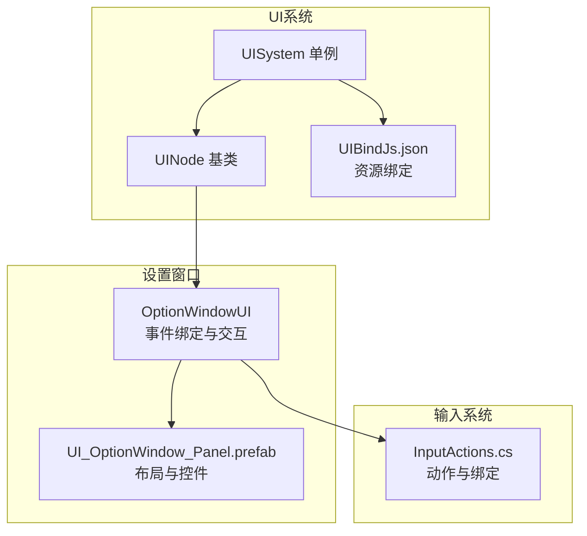
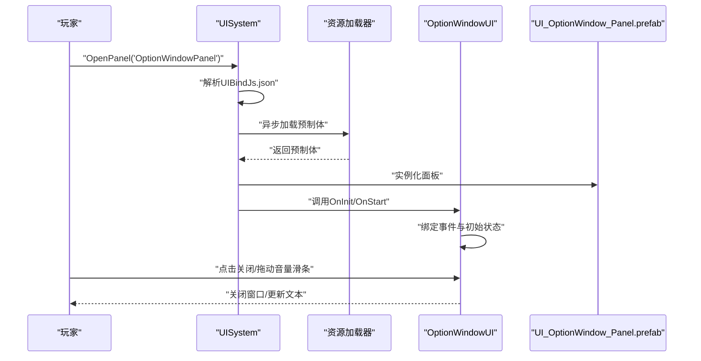
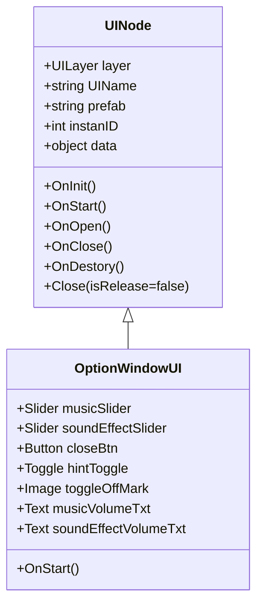
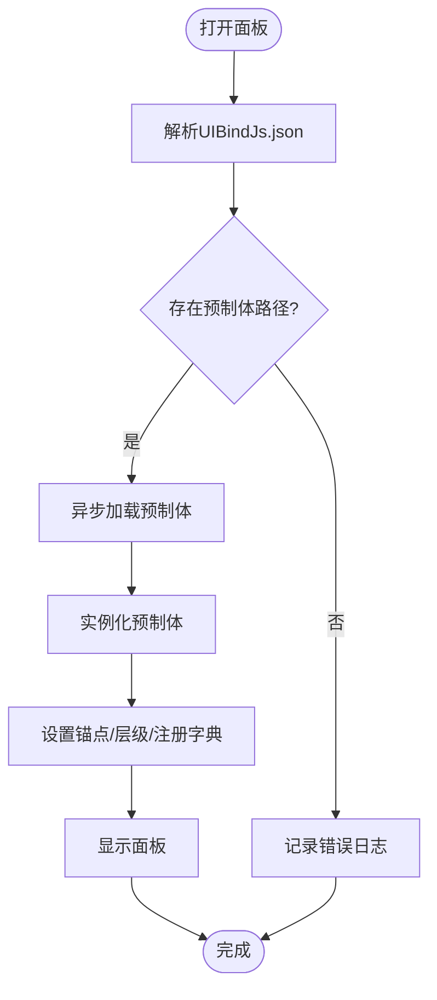
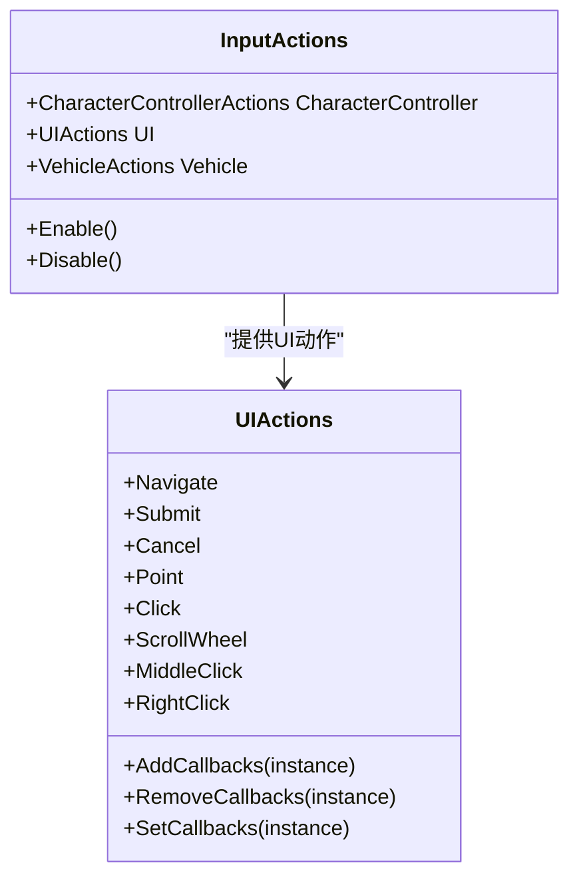
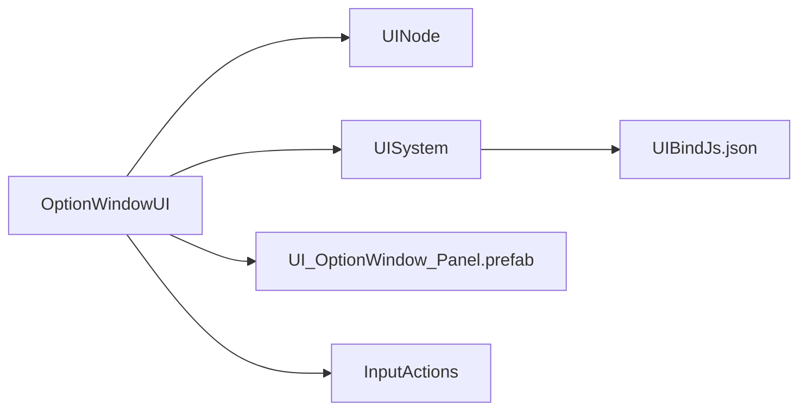

# 设置窗口

<cite>
**本文引用的文件**
- [OptionWindowUI.cs](file://Assets/Scripts/UI/Window/OptionWindowUI.cs)
- [UINode.cs](file://Assets/Scripts/UI/UINode.cs)
- [UISystem.cs](file://Assets/Scripts/Systems/Implement/UISystem/UISystem.cs)
- [UIBindJs.json](file://Assets/Scripts/UI/UIBindJs.json)
- [UI_OptionWindow_Panel.prefab](file://Assets/Art/UI/Prefabs/WindowUI/OptionWindow/UI_OptionWindow_Panel.prefab)
- [InputActions.cs](file://Assets/Common/InputActions.cs)
</cite>

## 目录
1. [简介](#简介)
2. [项目结构](#项目结构)
3. [核心组件](#核心组件)
4. [架构总览](#架构总览)
5. [详细组件分析](#详细组件分析)
6. [依赖分析](#依赖分析)
7. [性能考虑](#性能考虑)
8. [故障排查指南](#故障排查指南)
9. [结论](#结论)
10. [附录](#附录)

## 简介
本文件面向ProjectR项目的“设置窗口”（OptionWindow）功能，围绕OptionWindowUI组件展开，系统性阐述其界面布局、控件配置、事件处理机制与用户交互逻辑；并结合UI系统架构，说明音量调节、画质设置、按键绑定等核心功能的实现路径与扩展方法。同时给出数据持久化、配置读取与应用更新流程的建议，以及自定义开发指南、样式修改与动画效果实现思路，并提供性能优化与内存管理的实践建议。

## 项目结构
设置窗口属于UI系统的一部分，采用“节点化UI + 资源绑定 + 单例系统”的组织方式：
- OptionWindowUI：具体设置面板的脚本，负责事件绑定与UI交互。
- UINode：所有UI面板的基类，统一生命周期与关闭策略。
- UISystem：UI系统单例，负责Canvas、EventSystem、UICamera的创建与管理，以及面板的加载、显示、关闭与数据传递。
- UIBindJs.json：UI资源绑定表，将面板名称映射到预制体路径。
- UI_OptionWindow_Panel.prefab：设置窗口的UI布局与控件挂载点。
- InputActions.cs：输入系统动作与绑定定义，用于按键绑定等场景。

**图表来源**
- [OptionWindowUI.cs:1-29](file://Assets/Scripts/UI/Window/OptionWindowUI.cs#L1-L29)
- [UINode.cs:1-107](file://Assets/Scripts/UI/UINode.cs#L1-L107)
- [UISystem.cs:1-280](file://Assets/Scripts/Systems/Implement/UISystem/UISystem.cs#L1-L280)
- [UIBindJs.json:1-32](file://Assets/Scripts/UI/UIBindJs.json#L1-L32)
- [UI_OptionWindow_Panel.prefab:416-456](file://Assets/Art/UI/Prefabs/WindowUI/OptionWindow/UI_OptionWindow_Panel.prefab#L416-L456)
- [InputActions.cs:1-1192](file://Assets/Common/InputActions.cs#L1-L1192)

**章节来源**
- [OptionWindowUI.cs:1-29](file://Assets/Scripts/UI/Window/OptionWindowUI.cs#L1-L29)
- [UINode.cs:1-107](file://Assets/Scripts/UI/UINode.cs#L1-L107)
- [UISystem.cs:1-280](file://Assets/Scripts/Systems/Implement/UISystem/UISystem.cs#L1-L280)
- [UIBindJs.json:1-32](file://Assets/Scripts/UI/UIBindJs.json#L1-L32)
- [UI_OptionWindow_Panel.prefab:416-456](file://Assets/Art/UI/Prefabs/WindowUI/OptionWindow/UI_OptionWindow_Panel.prefab#L416-L456)
- [InputActions.cs:1-1192](file://Assets/Common/InputActions.cs#L1-L1192)

## 核心组件
- OptionWindowUI：继承UINode，负责设置窗口的事件绑定与交互逻辑，包括关闭按钮、音量滑条、提示开关与文本显示。
- UINode：提供统一的生命周期回调（OnInit/OnStart/OnOpen/OnClose/OnDestory），以及统一的Close接口，委托给UISystem进行面板关闭与释放。
- UISystem：负责Canvas、EventSystem、UICamera的初始化；通过UIBindJs.json加载面板预制体；管理面板的显示、隐藏与销毁；支持按名称传递数据。
- InputActions：提供角色控制、UI导航、鼠标点击等输入动作，可用于按键绑定功能的扩展。

**章节来源**
- [OptionWindowUI.cs:5-26](file://Assets/Scripts/UI/Window/OptionWindowUI.cs#L5-L26)
- [UINode.cs:9-57](file://Assets/Scripts/UI/UINode.cs#L9-L57)
- [UISystem.cs:21-265](file://Assets/Scripts/Systems/Implement/UISystem/UISystem.cs#L21-L265)
- [InputActions.cs:18-840](file://Assets/Common/InputActions.cs#L18-L840)

## 架构总览
设置窗口的打开与交互遵循以下流程：
- 通过UISystem.OpenPanel按名称打开面板。
- UISystem从UIBindJs.json解析出预制体路径并异步加载。
- 实例化预制体，设置层级与锚点，注册到系统字典中。
- OptionWindowUI在OnStart中完成事件绑定与初始状态设置。
- 用户交互触发事件，OptionWindowUI执行对应逻辑（如关闭、更新音量文本）。

**图表来源**
- [UISystem.cs:161-246](file://Assets/Scripts/Systems/Implement/UISystem/UISystem.cs#L161-L246)
- [OptionWindowUI.cs:14-24](file://Assets/Scripts/UI/Window/OptionWindowUI.cs#L14-L24)
- [UIBindJs.json:23-26](file://Assets/Scripts/UI/UIBindJs.json#L23-L26)
- [UI_OptionWindow_Panel.prefab:416-456](file://Assets/Art/UI/Prefabs/WindowUI/OptionWindow/UI_OptionWindow_Panel.prefab#L416-L456)

**章节来源**
- [UISystem.cs:161-246](file://Assets/Scripts/Systems/Implement/UISystem/UISystem.cs#L161-L246)
- [OptionWindowUI.cs:14-24](file://Assets/Scripts/UI/Window/OptionWindowUI.cs#L14-L24)
- [UIBindJs.json:23-26](file://Assets/Scripts/UI/UIBindJs.json#L23-L26)
- [UI_OptionWindow_Panel.prefab:416-456](file://Assets/Art/UI/Prefabs/WindowUI/OptionWindow/UI_OptionWindow_Panel.prefab#L416-L456)

## 详细组件分析

### OptionWindowUI 组件分析
- 继承关系：OptionWindowUI -> UINode，复用统一生命周期与关闭机制。
- 控件与事件：
  - 关闭按钮：点击后调用Close，委托UISystem进行关闭或释放。
  - 提示开关：切换时动态控制“关闭标记”图标的显隐。
  - 音量滑条：实时更新对应的文本显示，便于用户感知当前值。
- 初始状态：在OnStart中完成事件绑定与初始文本赋值。

**图表来源**
- [UINode.cs:9-57](file://Assets/Scripts/UI/UINode.cs#L9-L57)
- [OptionWindowUI.cs:5-26](file://Assets/Scripts/UI/Window/OptionWindowUI.cs#L5-L26)

**章节来源**
- [OptionWindowUI.cs:5-26](file://Assets/Scripts/UI/Window/OptionWindowUI.cs#L5-L26)
- [UINode.cs:9-57](file://Assets/Scripts/UI/UINode.cs#L9-L57)

### UISystem 与资源绑定
- 资源绑定：UIBindJs.json将面板名称映射到预制体路径，UISystem在打开面板时读取该表。
- 面板加载：通过资源系统异步加载预制体，实例化后设置锚点与层级，并注册到系统字典。
- 面板显示/关闭：ShowNormal激活并置顶，Close支持释放对象或仅隐藏。

**图表来源**
- [UISystem.cs:161-246](file://Assets/Scripts/Systems/Implement/UISystem/UISystem.cs#L161-L246)
- [UIBindJs.json:23-26](file://Assets/Scripts/UI/UIBindJs.json#L23-L26)

**章节来源**
- [UISystem.cs:161-246](file://Assets/Scripts/Systems/Implement/UISystem/UISystem.cs#L161-L246)
- [UIBindJs.json:23-26](file://Assets/Scripts/UI/UIBindJs.json#L23-L26)

### 输入系统与按键绑定
- InputActions提供多套动作映射（角色控制、UI导航、鼠标/键盘/手柄），可用于扩展设置窗口中的“按键绑定”功能。
- 可通过InputActions的回调接口订阅对应动作，将玩家输入映射到设置项（例如键位重映射）。

**图表来源**
- [InputActions.cs:816-1068](file://Assets/Common/InputActions.cs#L816-L1068)

**章节来源**
- [InputActions.cs:816-1068](file://Assets/Common/InputActions.cs#L816-L1068)

## 依赖分析
- OptionWindowUI依赖UINode提供的生命周期与关闭机制。
- OptionWindowUI通过UISystem进行面板打开与关闭，依赖UIBindJs.json的资源绑定。
- OptionWindowUI与UI_OptionWindow_Panel.prefab之间通过字段引用建立运行时连接。
- 输入系统通过InputActions为按键绑定等功能提供基础能力。

**图表来源**
- [OptionWindowUI.cs:5-26](file://Assets/Scripts/UI/Window/OptionWindowUI.cs#L5-L26)
- [UINode.cs:9-57](file://Assets/Scripts/UI/UINode.cs#L9-L57)
- [UISystem.cs:161-246](file://Assets/Scripts/Systems/Implement/UISystem/UISystem.cs#L161-L246)
- [UIBindJs.json:23-26](file://Assets/Scripts/UI/UIBindJs.json#L23-L26)
- [UI_OptionWindow_Panel.prefab:416-456](file://Assets/Art/UI/Prefabs/WindowUI/OptionWindow/UI_OptionWindow_Panel.prefab#L416-L456)
- [InputActions.cs:816-1068](file://Assets/Common/InputActions.cs#L816-L1068)

**章节来源**
- [OptionWindowUI.cs:5-26](file://Assets/Scripts/UI/Window/OptionWindowUI.cs#L5-L26)
- [UINode.cs:9-57](file://Assets/Scripts/UI/UINode.cs#L9-L57)
- [UISystem.cs:161-246](file://Assets/Scripts/Systems/Implement/UISystem/UISystem.cs#L161-L246)
- [UIBindJs.json:23-26](file://Assets/Scripts/UI/UIBindJs.json#L23-L26)
- [UI_OptionWindow_Panel.prefab:416-456](file://Assets/Art/UI/Prefabs/WindowUI/OptionWindow/UI_OptionWindow_Panel.prefab#L416-L456)
- [InputActions.cs:816-1068](file://Assets/Common/InputActions.cs#L816-L1068)

## 性能考虑
- 面板加载与实例化：使用异步加载避免主线程阻塞；仅在需要时实例化，减少常驻内存占用。
- 事件绑定：在OnStart中一次性绑定，避免重复绑定导致的性能损耗与内存泄漏。
- 文本更新：滑条值变化时仅更新对应文本，避免频繁GC；可考虑节流或延迟更新策略。
- Canvas与相机：UISystem集中管理Canvas与UICamera，确保渲染效率与层级正确性。
- 数据传递：通过UISystem.SetData按名称传递，避免跨面板直接引用造成耦合与额外开销。

[本节为通用性能建议，不直接分析具体文件，故无“章节来源”]

## 故障排查指南
- 打开面板失败：检查UIBindJs.json中是否存在目标面板名称；确认预制体路径有效且可被资源系统加载。
- 面板无法关闭：确认OptionWindowUI中关闭按钮事件已绑定；检查Close调用是否正确委托给UISystem。
- 事件不生效：检查OptionWindowUI的OnStart是否执行；确认控件引用是否在预制体中正确挂载。
- 文本不同步：确认滑条的onValueChanged事件已绑定到文本更新逻辑；检查初始值赋值顺序。

**章节来源**
- [UISystem.cs:161-246](file://Assets/Scripts/Systems/Implement/UISystem/UISystem.cs#L161-L246)
- [OptionWindowUI.cs:14-24](file://Assets/Scripts/UI/Window/OptionWindowUI.cs#L14-L24)
- [UIBindJs.json:23-26](file://Assets/Scripts/UI/UIBindJs.json#L23-L26)
- [UI_OptionWindow_Panel.prefab:416-456](file://Assets/Art/UI/Prefabs/WindowUI/OptionWindow/UI_OptionWindow_Panel.prefab#L416-L456)

## 结论
设置窗口OptionWindowUI基于UINode与UISystem构建，具备清晰的生命周期与事件绑定机制。当前实现聚焦于关闭按钮、提示开关与音量滑条的交互；通过InputActions可进一步扩展按键绑定功能。建议在后续迭代中完善音量调节与画质设置的持久化与应用流程，并提供样式与动画的扩展接口，以提升用户体验与可维护性。

[本节为总结性内容，不直接分析具体文件，故无“章节来源”]

## 附录

### 设置窗口功能实现要点
- 音量调节
  - 使用Slider组件绑定音乐与音效滑条，实时更新文本显示。
  - 建议在滑条值变化时触发保存与应用逻辑（例如写入配置并调用音频系统生效）。
- 画质设置
  - 可新增画质下拉框或切换按钮，结合QualitySettings或渲染管线参数进行调整。
  - 建议提供预设列表与自定义选项，并在应用后提示重启或刷新。
- 按键绑定
  - 基于InputActions的UI动作（Navigate/Submit/Cancel/Click等）扩展键位映射。
  - 可增加监听模式，等待玩家输入并更新绑定映射。

**章节来源**
- [OptionWindowUI.cs:7-13](file://Assets/Scripts/UI/Window/OptionWindowUI.cs#L7-L13)
- [InputActions.cs:968-1068](file://Assets/Common/InputActions.cs#L968-L1068)

### 数据持久化与配置读取
- 配置读取：可通过JSON或PlayerPrefs读取用户设置（音量、画质、按键绑定等）。
- 应用更新：在OnStart或OnOpen阶段应用配置；对音量与画质变更即时生效。
- 写入时机：在用户确认或离开设置窗口时写入持久化存储。

[本节为通用实现建议，不直接分析具体文件，故无“章节来源”]

### 自定义开发指南
- 新增面板：在UIBindJs.json中添加新面板名称与预制体路径；在UISystem中按名称打开。
- 样式修改：通过UI_OptionWindow_Panel.prefab调整控件位置、尺寸与视觉风格；必要时引入UI Toolkit或TextMeshPro以增强表现。
- 动画效果：可在面板进入/退出时添加淡入淡出或缩放动画，提升交互体验。

**章节来源**
- [UIBindJs.json:23-26](file://Assets/Scripts/UI/UIBindJs.json#L23-L26)
- [UI_OptionWindow_Panel.prefab:416-456](file://Assets/Art/UI/Prefabs/WindowUI/OptionWindow/UI_OptionWindow_Panel.prefab#L416-L456)