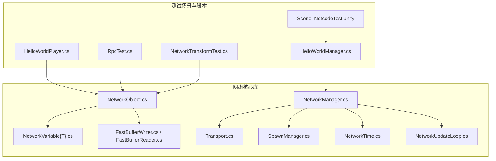
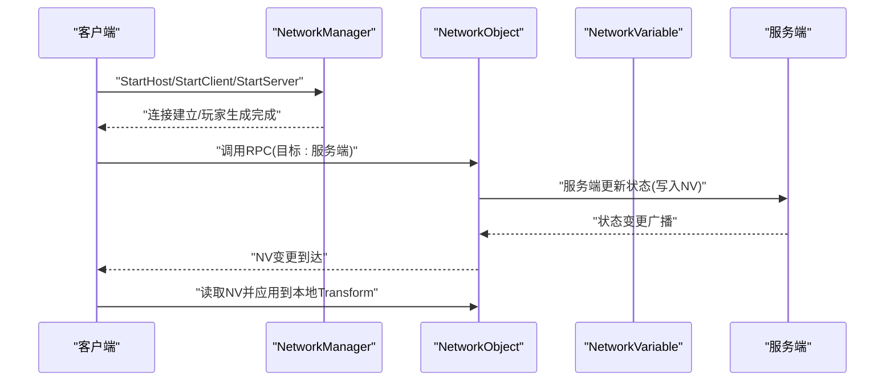
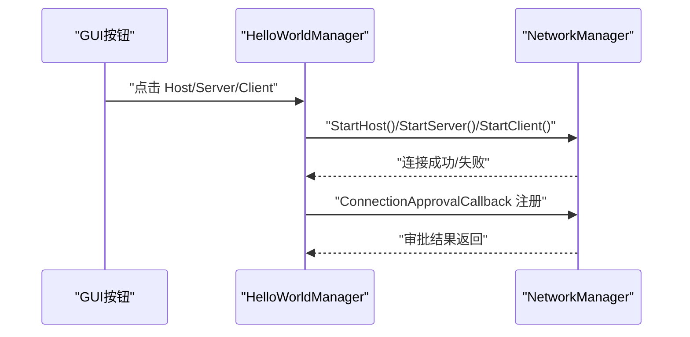
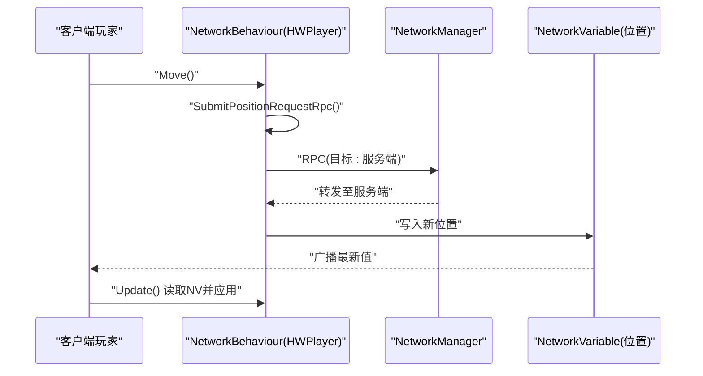
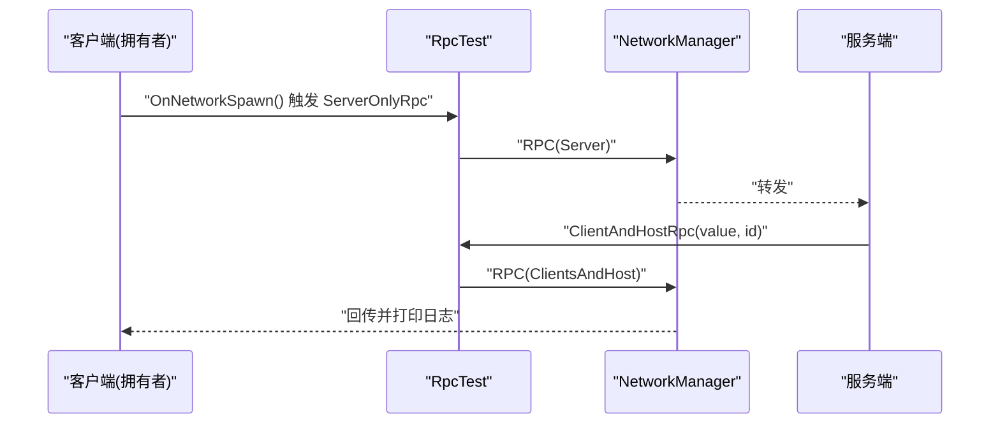
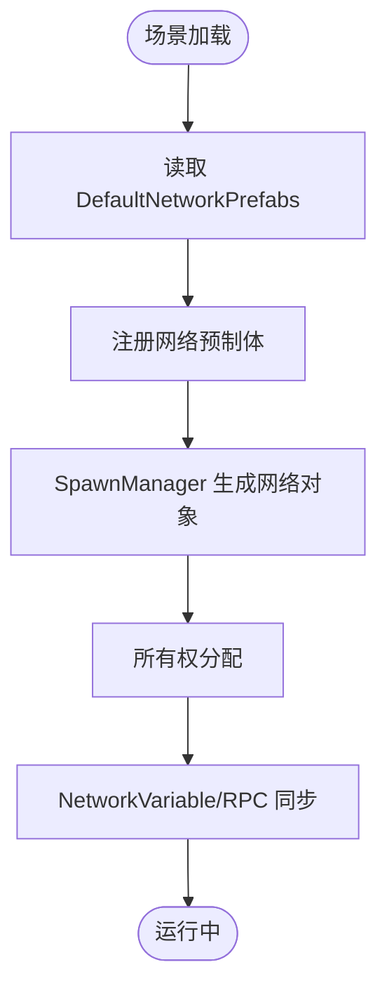
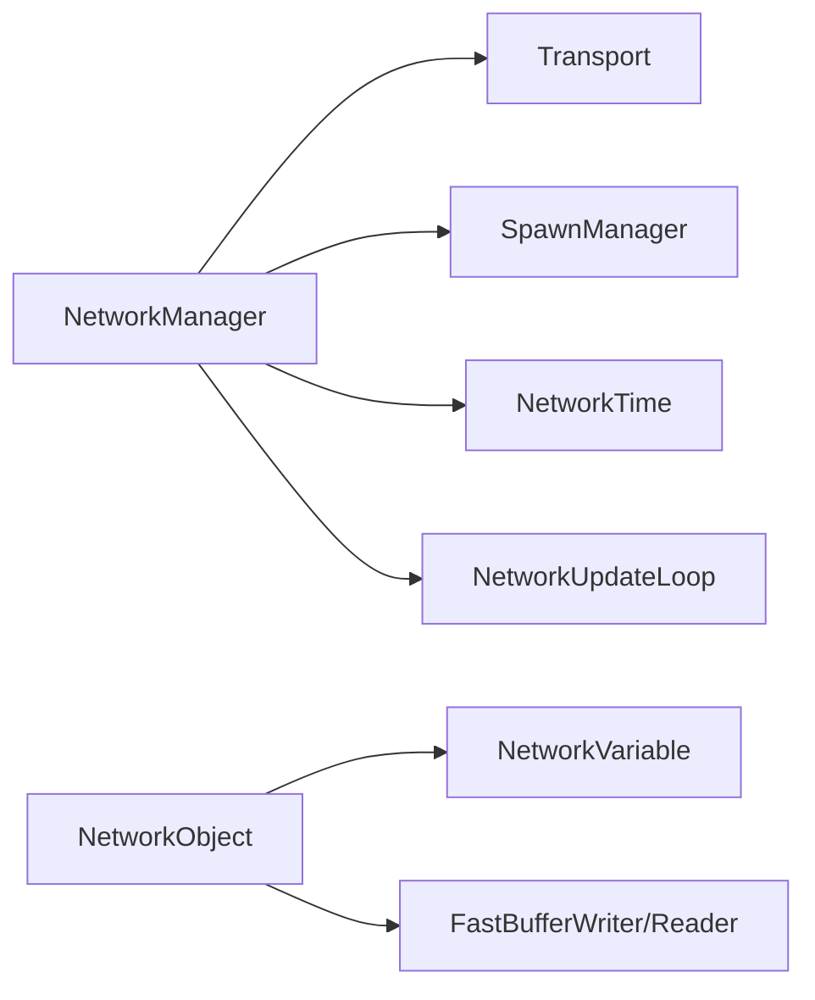

# 网络同步系统

<cite>
**本文引用的文件**
- [Assets/DefaultNetworkPrefabs.asset](file://Assets/DefaultNetworkPrefabs.asset)
- [Assets/Dev/NetcodeTest/Scene_NetcodeTest.unity](file://Assets/Dev/NetcodeTest/Scene_NetcodeTest.unity)
- [Assets/Dev/NetcodeTest/Scripts/HelloWorldManager.cs](file://Assets/Dev/NetcodeTest/Scripts/HelloWorldManager.cs)
- [Assets/Dev/NetcodeTest/Scripts/HelloWorldPlayer.cs](file://Assets/Dev/NetcodeTest/Scripts/HelloWorldPlayer.cs)
- [Assets/Dev/NetcodeTest/Scripts/NetworkTransformTest.cs](file://Assets/Dev/NetcodeTest/Scripts/NetworkTransformTest.cs)
- [Assets/Dev/NetcodeTest/Scripts/RpcTest.cs](file://Assets/Dev/NetcodeTest/Scripts/RpcTest.cs)
- [LocalPackages/com.unity.netcode.gameobjects@1.14.1/Runtime/Core/NetworkManager.cs](file://LocalPackages/com.unity.netcode.gameobjects@1.14.1/Runtime/Core/NetworkManager.cs)
- [LocalPackages/com.unity.netcode.gameobjects@1.14.1/Runtime/Core/NetworkObject.cs](file://LocalPackages/com.unity.netcode.gameobjects@1.14.1/Runtime/Core/NetworkObject.cs)
- [LocalPackages/com.unity.netcode.gameobjects@1.14.1/Runtime/Messaging/NetworkManagerHooks.cs](file://LocalPackages/com.unity.netcode.gameobjects@1.14.1/Runtime/Messaging/NetworkManagerHooks.cs)
- [LocalPackages/com.unity.netcode.gameobjects@1.14.1/Runtime/NetworkVariable/NetworkVariable.cs](file://LocalPackages/com.unity.netcode.gameobjects@1.14.1/Runtime/NetworkVariable/NetworkVariable.cs)
- [LocalPackages/com.unity.netcode.gameobjects@1.14.1/Runtime/Serialization/FastBufferWriter.cs](file://LocalPackages/com.unity.netcode.gameobjects@1.14.1/Runtime/Serialization/FastBufferWriter.cs)
- [LocalPackages/com.unity.netcode.gameobjects@1.14.1/Runtime/Serialization/FastBufferReader.cs](file://LocalPackages/com.unity.netcode.gameobjects@1.14.1/Runtime/Serialization/FastBufferReader.cs)
- [LocalPackages/com.unity.netcode.gameobjects@1.14.1/Runtime/Transports/Transport.cs](file://LocalPackages/com.unity.netcode.gameobjects@1.14.1/Runtime/Transports/Transport.cs)
- [LocalPackages/com.unity.netcode.gameobjects@1.14.1/Runtime/Spawning/SpawnManager.cs](file://LocalPackages/com.unity.netcode.gameobjects@1.14.1/Runtime/Spawning/SpawnManager.cs)
- [LocalPackages/com.unity.netcode.gameobjects@1.14.1/Runtime/Timing/NetworkTime.cs](file://LocalPackages/com.unity.netcode.gameobjects@1.14.1/Runtime/Timing/NetworkTime.cs)
- [LocalPackages/com.unity.netcode.gameobjects@1.14.1/Runtime/NetworkVariable/NetworkVariable{T}.cs](file://LocalPackages/com.unity.netcode.gameobjects@1.14.1/Runtime/NetworkVariable/NetworkVariable{T}.cs)
- [LocalPackages/com.unity.netcode.gameobjects@1.14.1/Runtime/Core/NetworkUpdateLoop.cs](file://LocalPackages/com.unity.netcode.gameobjects@1.14.1/Runtime/Core/NetworkUpdateLoop.cs)
- [LocalPackages/com.unity.netcode.gameobjects@1.14.1/Documentation~/learn/rpcvnetvar.md](file://LocalPackages/com.unity.netcode.gameobjects@1.14.1/Documentation~/learn/rpcvnetvar.md)
- [LocalPackages/com.unity.netcode.gameobjects@1.14.1/Documentation~/samples/bossroom/optimizing-bossroom.md](file://LocalPackages/com.unity.netcode.gameobjects@1.14.1/Documentation~/samples/bossroom/optimizing-bossroom.md)
- [Library/PackageCache/com.unity.multiplayer.tools@1.1.1/NetworkProfiler/Runtime/NetworkProfiler.cs](file://Library/PackageCache/com.unity.multiplayer.tools@1.1.1/NetworkProfiler/Runtime/NetworkProfiler.cs)
- [Library/PackageCache/com.unity.multiplayer.tools@1.1.1/NetworkSimulator/Runtime/NetworkSimulator.cs](file://Library/PackageCache/com.unity.multiplayer.tools@1.1.1/NetworkSimulator/Runtime/NetworkSimulator.cs)
</cite>

## 目录
1. [简介](#简介)
2. [项目结构](#项目结构)
3. [核心组件](#核心组件)
4. [架构总览](#架构总览)
5. [详细组件分析](#详细组件分析)
6. [依赖关系分析](#依赖关系分析)
7. [性能考量](#性能考量)
8. [故障排查指南](#故障排查指南)
9. [结论](#结论)
10. [附录](#附录)

## 简介
本文件面向ProjectR项目的网络同步系统，围绕Unity Netcode（Netcode for GameObjects）构建的多人游戏架构进行系统化说明。内容覆盖客户端-服务器通信协议、状态同步机制、消息传输策略，以及网络变量、RPC调用、网络对象管理的具体实现。同时提供性能优化、延迟处理、断线重连的解决方案，以及网络调试工具的使用方法与常见问题排查技巧，并记录网络配置参数、带宽要求与连接限制，最后给出扩展与定制化的开发指导。

## 项目结构
ProjectR在Assets/Dev/NetcodeTest中提供了基础的网络测试场景与脚本，用于演示NetworkManager启动流程、玩家对象的生成与控制、RPC调用与网络变量同步等核心能力；同时通过DefaultNetworkPrefabs.asset定义默认网络预制体列表，确保网络对象在运行时可被正确识别与同步。

**图表来源**
- [Assets/Dev/NetcodeTest/Scene_NetcodeTest.unity:487-552](file://Assets/Dev/NetcodeTest/Scene_NetcodeTest.unity#L487-L552)
- [Assets/Dev/NetcodeTest/Scripts/HelloWorldManager.cs:1-133](file://Assets/Dev/NetcodeTest/Scripts/HelloWorldManager.cs#L1-L133)
- [Assets/Dev/NetcodeTest/Scripts/HelloWorldPlayer.cs:1-41](file://Assets/Dev/NetcodeTest/Scripts/HelloWorldPlayer.cs#L1-L41)
- [Assets/Dev/NetcodeTest/Scripts/RpcTest.cs:1-35](file://Assets/Dev/NetcodeTest/Scripts/RpcTest.cs#L1-L35)
- [Assets/Dev/NetcodeTest/Scripts/NetworkTransformTest.cs:1-16](file://Assets/Dev/NetcodeTest/Scripts/NetworkTransformTest.cs#L1-L16)
- [LocalPackages/com.unity.netcode.gameobjects@1.14.1/Runtime/Core/NetworkManager.cs](file://LocalPackages/com.unity.netcode.gameobjects@1.14.1/Runtime/Core/NetworkManager.cs)
- [LocalPackages/com.unity.netcode.gameobjects@1.14.1/Runtime/Core/NetworkObject.cs](file://LocalPackages/com.unity.netcode.gameobjects@1.14.1/Runtime/Core/NetworkObject.cs)
- [LocalPackages/com.unity.netcode.gameobjects@1.14.1/Runtime/NetworkVariable/NetworkVariable{T}.cs](file://LocalPackages/com.unity.netcode.gameobjects@1.14.1/Runtime/NetworkVariable/NetworkVariable{T}.cs)
- [LocalPackages/com.unity.netcode.gameobjects@1.14.1/Runtime/Serialization/FastBufferWriter.cs](file://LocalPackages/com.unity.netcode.gameobjects@1.14.1/Runtime/Serialization/FastBufferWriter.cs)
- [LocalPackages/com.unity.netcode.gameobjects@1.14.1/Runtime/Serialization/FastBufferReader.cs](file://LocalPackages/com.unity.netcode.gameobjects@1.14.1/Runtime/Serialization/FastBufferReader.cs)
- [LocalPackages/com.unity.netcode.gameobjects@1.14.1/Runtime/Transports/Transport.cs](file://LocalPackages/com.unity.netcode.gameobjects@1.14.1/Runtime/Transports/Transport.cs)
- [LocalPackages/com.unity.netcode.gameobjects@1.14.1/Runtime/Spawning/SpawnManager.cs](file://LocalPackages/com.unity.netcode.gameobjects@1.14.1/Runtime/Spawning/SpawnManager.cs)
- [LocalPackages/com.unity.netcode.gameobjects@1.14.1/Runtime/Timing/NetworkTime.cs](file://LocalPackages/com.unity.netcode.gameobjects@1.14.1/Runtime/Timing/NetworkTime.cs)
- [LocalPackages/com.unity.netcode.gameobjects@1.14.1/Runtime/Core/NetworkUpdateLoop.cs](file://LocalPackages/com.unity.netcode.gameobjects@1.14.1/Runtime/Core/NetworkUpdateLoop.cs)

**章节来源**
- [Assets/Dev/NetcodeTest/Scene_NetcodeTest.unity:487-552](file://Assets/Dev/NetcodeTest/Scene_NetcodeTest.unity#L487-L552)
- [Assets/DefaultNetworkPrefabs.asset:1-22](file://Assets/DefaultNetworkPrefabs.asset#L1-L22)

## 核心组件
- NetworkManager：网络会话的入口与中枢，负责启动模式（主机、服务端、客户端）、连接审批、传输层配置、玩家生成与管理、事件钩子注册等。
- NetworkObject：网络对象基类，承载所有权、可见性、同步策略等属性，是所有可被网络复制的实体载体。
- NetworkVariable：网络变量，用于跨网络广播状态变更，保证最新值在各客户端尽快一致。
- RPC（远程过程调用）：用于发送瞬态事件或请求，支持向服务端、客户端或全网广播。
- Transport：传输层抽象，封装底层网络协议（如KCP/UDP），提供可靠与不可靠消息通道。
- SpawnManager：负责网络对象的生成、销毁与所有权分配。
- NetworkTime：网络时间基准，用于对齐更新节奏与计算延迟。
- NetworkUpdateLoop：网络更新循环，将网络逻辑按阶段注入Unity PlayerLoop。

**章节来源**
- [LocalPackages/com.unity.netcode.gameobjects@1.14.1/Runtime/Core/NetworkManager.cs](file://LocalPackages/com.unity.netcode.gameobjects@1.14.1/Runtime/Core/NetworkManager.cs)
- [LocalPackages/com.unity.netcode.gameobjects@1.14.1/Runtime/Core/NetworkObject.cs](file://LocalPackages/com.unity.netcode.gameobjects@1.14.1/Runtime/Core/NetworkObject.cs)
- [LocalPackages/com.unity.netcode.gameobjects@1.14.1/Runtime/NetworkVariable/NetworkVariable{T}.cs](file://LocalPackages/com.unity.netcode.gameobjects@1.14.1/Runtime/NetworkVariable/NetworkVariable{T}.cs)
- [LocalPackages/com.unity.netcode.gameobjects@1.14.1/Runtime/Transports/Transport.cs](file://LocalPackages/com.unity.netcode.gameobjects@1.14.1/Runtime/Transports/Transport.cs)
- [LocalPackages/com.unity.netcode.gameobjects@1.14.1/Runtime/Spawning/SpawnManager.cs](file://LocalPackages/com.unity.netcode.gameobjects@1.14.1/Runtime/Spawning/SpawnManager.cs)
- [LocalPackages/com.unity.netcode.gameobjects@1.14.1/Runtime/Timing/NetworkTime.cs](file://LocalPackages/com.unity.netcode.gameobjects@1.14.1/Runtime/Timing/NetworkTime.cs)
- [LocalPackages/com.unity.netcode.gameobjects@1.14.1/Runtime/Core/NetworkUpdateLoop.cs](file://LocalPackages/com.unity.netcode.gameobjects@1.14.1/Runtime/Core/NetworkUpdateLoop.cs)

## 架构总览
下图展示了客户端-服务器模式下的典型交互路径：客户端发起请求（RPC或输入），服务端验证并广播状态（NetworkVariable），客户端接收后应用到本地对象。

**图表来源**
- [Assets/Dev/NetcodeTest/Scripts/HelloWorldManager.cs:45-114](file://Assets/Dev/NetcodeTest/Scripts/HelloWorldManager.cs#L45-L114)
- [Assets/Dev/NetcodeTest/Scripts/HelloWorldPlayer.cs:18-39](file://Assets/Dev/NetcodeTest/Scripts/HelloWorldPlayer.cs#L18-L39)
- [LocalPackages/com.unity.netcode.gameobjects@1.14.1/Runtime/Core/NetworkManager.cs](file://LocalPackages/com.unity.netcode.gameobjects@1.14.1/Runtime/Core/NetworkManager.cs)
- [LocalPackages/com.unity.netcode.gameobjects@1.14.1/Runtime/NetworkVariable/NetworkVariable{T}.cs](file://LocalPackages/com.unity.netcode.gameobjects@1.14.1/Runtime/NetworkVariable/NetworkVariable{T}.cs)

## 详细组件分析

### 组件A：HelloWorldManager（网络启动与连接）
- 职责：提供Host/Server/Client三种启动方式，注册连接审批回调，显示当前模式与传输类型，触发移动请求，支持断开连接。
- 关键点：连接审批回调允许自定义接入规则；通过SpawnManager获取本地玩家对象并驱动其行为。

**图表来源**
- [Assets/Dev/NetcodeTest/Scripts/HelloWorldManager.cs:45-114](file://Assets/Dev/NetcodeTest/Scripts/HelloWorldManager.cs#L45-L114)
- [LocalPackages/com.unity.netcode.gameobjects@1.14.1/Runtime/Core/NetworkManager.cs](file://LocalPackages/com.unity.netcode.gameobjects@1.14.1/Runtime/Core/NetworkManager.cs)

**章节来源**
- [Assets/Dev/NetcodeTest/Scripts/HelloWorldManager.cs:1-133](file://Assets/Dev/NetcodeTest/Scripts/HelloWorldManager.cs#L1-L133)

### 组件B：HelloWorldPlayer（网络变量与RPC）
- 职责：作为玩家对象的NetworkBehaviour，持有位置的NetworkVariable；在拥有者身份下主动移动；通过RPC提交位置请求，服务端写入NetworkVariable并广播。
- 同步机制：客户端本地读取NetworkVariable更新Transform，实现平滑跟随。

**图表来源**
- [Assets/Dev/NetcodeTest/Scripts/HelloWorldPlayer.cs:18-39](file://Assets/Dev/NetcodeTest/Scripts/HelloWorldPlayer.cs#L18-L39)
- [LocalPackages/com.unity.netcode.gameobjects@1.14.1/Runtime/NetworkVariable/NetworkVariable{T}.cs](file://LocalPackages/com.unity.netcode.gameobjects@1.14.1/Runtime/NetworkVariable/NetworkVariable{T}.cs)

**章节来源**
- [Assets/Dev/NetcodeTest/Scripts/HelloWorldPlayer.cs:1-41](file://Assets/Dev/NetcodeTest/Scripts/HelloWorldPlayer.cs#L1-L41)

### 组件C：RpcTest（双向RPC链路）
- 职责：演示从客户端到服务端再到客户端的RPC往返，验证SendTo选项（ClientsAndHost/Server）的行为差异。
- 关键点：仅拥有者客户端向服务端发送RPC；服务端再回发给拥有者，形成闭环日志链路。

**图表来源**
- [Assets/Dev/NetcodeTest/Scripts/RpcTest.cs:8-32](file://Assets/Dev/NetcodeTest/Scripts/RpcTest.cs#L8-L32)
- [LocalPackages/com.unity.netcode.gameobjects@1.14.1/Runtime/Core/NetworkManager.cs](file://LocalPackages/com.unity.netcode.gameobjects@1.14.1/Runtime/Core/NetworkManager.cs)

**章节来源**
- [Assets/Dev/NetcodeTest/Scripts/RpcTest.cs:1-35](file://Assets/Dev/NetcodeTest/Scripts/RpcTest.cs#L1-L35)

### 组件D：NetworkTransformTest（示例性运动）
- 职责：服务端每帧更新一个周期性轨迹，展示服务端权威与客户端跟随的基本思路。
- 适用场景：适合理解服务端权威与客户端插值之间的关系。

**章节来源**
- [Assets/Dev/NetcodeTest/Scripts/NetworkTransformTest.cs:1-16](file://Assets/Dev/NetcodeTest/Scripts/NetworkTransformTest.cs#L1-L16)

### 组件E：网络对象与默认预制体
- DefaultNetworkPrefabs.asset：声明默认网络预制体列表，确保网络对象在运行时可被识别与同步。
- NetworkObject：网络对象的生命周期、所有权与可见性由该类统一管理。

**图表来源**
- [Assets/DefaultNetworkPrefabs.asset:1-22](file://Assets/DefaultNetworkPrefabs.asset#L1-L22)
- [LocalPackages/com.unity.netcode.gameobjects@1.14.1/Runtime/Core/NetworkObject.cs](file://LocalPackages/com.unity.netcode.gameobjects@1.14.1/Runtime/Core/NetworkObject.cs)
- [LocalPackages/com.unity.netcode.gameobjects@1.14.1/Runtime/Spawning/SpawnManager.cs](file://LocalPackages/com.unity.netcode.gameobjects@1.14.1/Runtime/Spawning/SpawnManager.cs)

**章节来源**
- [Assets/DefaultNetworkPrefabs.asset:1-22](file://Assets/DefaultNetworkPrefabs.asset#L1-L22)
- [LocalPackages/com.unity.netcode.gameobjects@1.14.1/Runtime/Core/NetworkObject.cs](file://LocalPackages/com.unity.netcode.gameobjects@1.14.1/Runtime/Core/NetworkObject.cs)

## 依赖关系分析
- NetworkManager依赖Transport进行消息收发，依赖SpawnManager进行对象生命周期管理，依赖NetworkTime对齐更新节奏。
- NetworkObject依赖NetworkVariable进行状态同步，依赖FastBufferWriter/FastBufferReader进行序列化。
- NetworkUpdateLoop将网络阶段注入Unity PlayerLoop，确保网络逻辑与渲染/物理等阶段协调。

**图表来源**
- [LocalPackages/com.unity.netcode.gameobjects@1.14.1/Runtime/Core/NetworkManager.cs](file://LocalPackages/com.unity.netcode.gameobjects@1.14.1/Runtime/Core/NetworkManager.cs)
- [LocalPackages/com.unity.netcode.gameobjects@1.14.1/Runtime/Transports/Transport.cs](file://LocalPackages/com.unity.netcode.gameobjects@1.14.1/Runtime/Transports/Transport.cs)
- [LocalPackages/com.unity.netcode.gameobjects@1.14.1/Runtime/Spawning/SpawnManager.cs](file://LocalPackages/com.unity.netcode.gameobjects@1.14.1/Runtime/Spawning/SpawnManager.cs)
- [LocalPackages/com.unity.netcode.gameobjects@1.14.1/Runtime/Timing/NetworkTime.cs](file://LocalPackages/com.unity.netcode.gameobjects@1.14.1/Runtime/Timing/NetworkTime.cs)
- [LocalPackages/com.unity.netcode.gameobjects@1.14.1/Runtime/Core/NetworkObject.cs](file://LocalPackages/com.unity.netcode.gameobjects@1.14.1/Runtime/Core/NetworkObject.cs)
- [LocalPackages/com.unity.netcode.gameobjects@1.14.1/Runtime/NetworkVariable/NetworkVariable.cs](file://LocalPackages/com.unity.netcode.gameobjects@1.14.1/Runtime/NetworkVariable/NetworkVariable.cs)
- [LocalPackages/com.unity.netcode.gameobjects@1.14.1/Runtime/Serialization/FastBufferWriter.cs](file://LocalPackages/com.unity.netcode.gameobjects@1.14.1/Runtime/Serialization/FastBufferWriter.cs)
- [LocalPackages/com.unity.netcode.gameobjects@1.14.1/Runtime/Serialization/FastBufferReader.cs](file://LocalPackages/com.unity.netcode.gameobjects@1.14.1/Runtime/Serialization/FastBufferReader.cs)
- [LocalPackages/com.unity.netcode.gameobjects@1.14.1/Runtime/Core/NetworkUpdateLoop.cs](file://LocalPackages/com.unity.netcode.gameobjects@1.14.1/Runtime/Core/NetworkUpdateLoop.cs)

**章节来源**
- [LocalPackages/com.unity.netcode.gameobjects@1.14.1/Runtime/Core/NetworkManager.cs](file://LocalPackages/com.unity.netcode.gameobjects@1.14.1/Runtime/Core/NetworkManager.cs)
- [LocalPackages/com.unity.netcode.gameobjects@1.14.1/Runtime/Core/NetworkObject.cs](file://LocalPackages/com.unity.netcode.gameobjects@1.14.1/Runtime/Core/NetworkObject.cs)
- [LocalPackages/com.unity.netcode.gameobjects@1.14.1/Runtime/Core/NetworkUpdateLoop.cs](file://LocalPackages/com.unity.netcode.gameobjects@1.14.1/Runtime/Core/NetworkUpdateLoop.cs)

## 性能考量
- RPC与NetworkVariable的选择
  - 瞬态事件优先使用RPC，持久状态使用NetworkVariable，以降低带宽占用。
  - 需要同时更新多个变量时，建议通过单次RPC打包发送，避免不同变量在同Tick内到达时间不一致。
- 带宽与更新频率
  - 合理设置NetworkVariable的更新频率与压缩策略，减少冗余数据。
  - 对高频状态采用增量更新或差分编码，结合FastBufferWriter进行高效序列化。
- 延迟与丢包
  - 使用NetworkTime对齐更新，配合插值/外推策略提升视觉平滑度。
  - 在弱网环境下启用可靠的传输通道或增加重传策略。
- 连接限制
  - 受限于Transport与平台能力，合理设置最大连接数与每帧消息上限，避免拥塞。

**章节来源**
- [LocalPackages/com.unity.netcode.gameobjects@1.14.1/Documentation~/learn/rpcvnetvar.md:45-87](file://LocalPackages/com.unity.netcode.gameobjects@1.14.1/Documentation~/learn/rpcvnetvar.md#L45-L87)
- [LocalPackages/com.unity.netcode.gameobjects@1.14.1/Documentation~/samples/bossroom/optimizing-bossroom.md:21-32](file://LocalPackages/com.unity.netcode.gameobjects@1.14.1/Documentation~/samples/bossroom/optimizing-bossroom.md#L21-L32)
- [LocalPackages/com.unity.netcode.gameobjects@1.14.1/Runtime/Serialization/FastBufferWriter.cs](file://LocalPackages/com.unity.netcode.gameobjects@1.14.1/Runtime/Serialization/FastBufferWriter.cs)
- [LocalPackages/com.unity.netcode.gameobjects@1.14.1/Runtime/Timing/NetworkTime.cs](file://LocalPackages/com.unity.netcode.gameobjects@1.14.1/Runtime/Timing/NetworkTime.cs)

## 故障排查指南
- 连接与认证
  - 检查ConnectionApprovalCallback是否正确返回审批结果；确认NetworkConfig与Transport配置一致。
- 对象生成与所有权
  - 确认DefaultNetworkPrefabs已包含所需预制体；检查SpawnManager生成流程与拥有者分配逻辑。
- 同步异常
  - 若出现状态不同步，优先核对NetworkVariable的写入时机与广播范围；对于需要强一致性的多变量更新，考虑合并为一次RPC。
- 日志与诊断
  - 使用NetworkProfiler与NetworkSimulator评估延迟、丢包与带宽；关注RPC调用次数与NetworkVariable增量大小。
- 断线与重连
  - 结合官方“中途重连”主题，设计合理的重连策略（如状态快照、事件回放）与容错处理。

**章节来源**
- [Assets/Dev/NetcodeTest/Scripts/HelloWorldManager.cs:61-77](file://Assets/Dev/NetcodeTest/Scripts/HelloWorldManager.cs#L61-L77)
- [Assets/DefaultNetworkPrefabs.asset:1-22](file://Assets/DefaultNetworkPrefabs.asset#L1-L22)
- [Library/PackageCache/com.unity.multiplayer.tools@1.1.1/NetworkProfiler/Runtime/NetworkProfiler.cs](file://Library/PackageCache/com.unity.multiplayer.tools@1.1.1/NetworkProfiler/Runtime/NetworkProfiler.cs)
- [Library/PackageCache/com.unity.multiplayer.tools@1.1.1/NetworkSimulator/Runtime/NetworkSimulator.cs](file://Library/PackageCache/com.unity.multiplayer.tools@1.1.1/NetworkSimulator/Runtime/NetworkSimulator.cs)

## 结论
ProjectR基于Unity Netcode的网络同步体系以NetworkManager为核心，结合NetworkObject、NetworkVariable与RPC实现了清晰的服务端权威与客户端同步模型。通过DefaultNetworkPrefabs与SpawnManager保障对象生命周期管理，借助NetworkUpdateLoop与NetworkTime对齐更新节奏。在性能方面，应根据数据特性选择RPC或NetworkVariable，并利用序列化与时间对齐策略优化带宽与体验。配合NetworkProfiler与NetworkSimulator等工具，可有效定位与解决网络问题，持续迭代出稳定高效的多人游戏体验。

## 附录
- 网络配置参数（示例要点）
  - 最大玩家数：受Transport与平台限制，需在NetworkConfig中配置。
  - 传输层：选择合适的Transport实现（如KCP/UDP），并设置可靠/不可靠通道。
  - 更新频率：合理设置NetworkVariable更新节拍与NetworkUpdateLoop阶段。
- 带宽估算与限制
  - 基于对象数量、状态字段大小与更新频率进行粗略估算；在弱网环境下预留冗余与重传。
- 扩展与定制化
  - 自定义NetworkVariable类型与序列化策略，满足特定业务需求。
  - 将自定义消息通过NetworkManager的自定义消息管理器进行扩展。
  - 设计断线重连与状态恢复流程，确保新玩家无缝加入。

**章节来源**
- [LocalPackages/com.unity.netcode.gameobjects@1.14.1/Runtime/Core/NetworkManager.cs](file://LocalPackages/com.unity.netcode.gameobjects@1.14.1/Runtime/Core/NetworkManager.cs)
- [LocalPackages/com.unity.netcode.gameobjects@1.14.1/Runtime/Transports/Transport.cs](file://LocalPackages/com.unity.netcode.gameobjects@1.14.1/Runtime/Transports/Transport.cs)
- [LocalPackages/com.unity.netcode.gameobjects@1.14.1/Runtime/NetworkVariable/NetworkVariable.cs](file://LocalPackages/com.unity.netcode.gameobjects@1.14.1/Runtime/NetworkVariable/NetworkVariable.cs)
- [LocalPackages/com.unity.netcode.gameobjects@1.14.1/Runtime/Messaging/NetworkManagerHooks.cs](file://LocalPackages/com.unity.netcode.gameobjects@1.14.1/Runtime/Messaging/NetworkManagerHooks.cs)