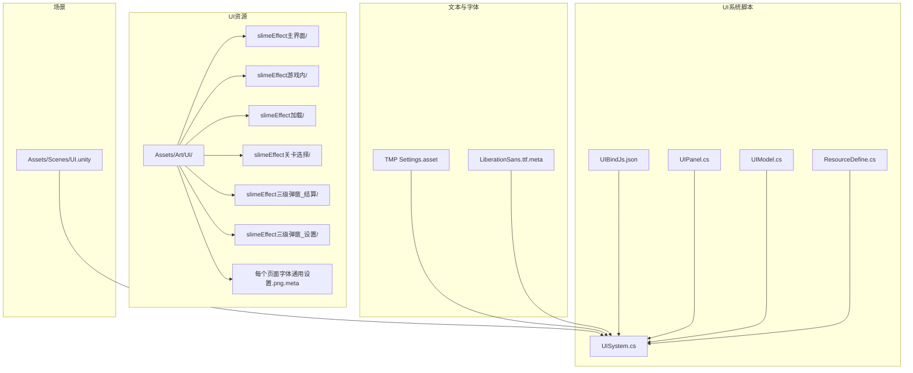
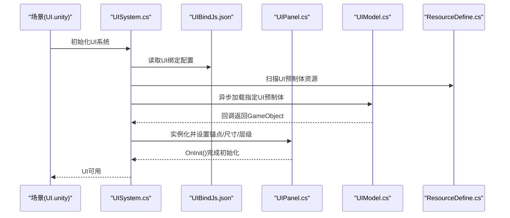
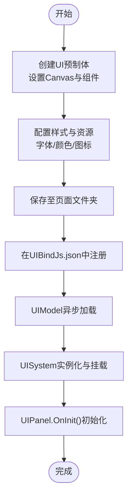
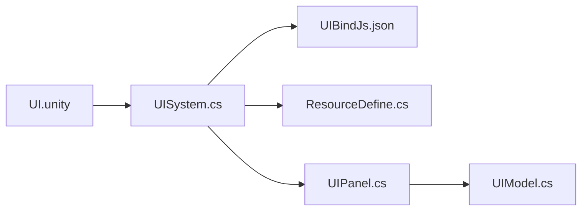

# UI资源

<cite>
**本文引用的文件**
- [UIBindJs.json](file://Assets/Scripts/UI/UIBindJs.json)
- [UIPanel.cs](file://Assets/Scripts/UI/UIPanel.cs)
- [UIModel.cs](file://Assets/Scripts/UI/UIModel.cs)
- [UISystem.cs](file://Assets/Scripts/Systems/Implement/UISystem/UISystem.cs)
- [ResourceDefine.cs](file://Assets/Scripts/Config/Resource/ResourceDefine.cs)
- [UI.unity](file://Assets/Scenes/UI.unity)
- [每个页面字体通用设置.png.meta](file://Assets/Art/UI/每个页面字体通用设置.png.meta)
- [slimeEffect主界面](file://Assets/Art/UI/slimeEffect主界面/)
- [slimeEffect游戏内](file://Assets/Art/UI/slimeEffect游戏内/)
- [slimeEffect加载](file://Assets/Art/UI/slimeEffect加载/)
- [slimeEffect关卡选择](file://Assets/Art/UI/slimeEffect关卡选择/)
- [slimeEffect三级弹窗_结算](file://Assets/Art/UI/slimeEffect三级弹窗_结算/)
- [slimeEffect三级弹窗_设置](file://Assets/Art/UI/slimeEffect三级弹窗_设置/)
- [TMP Settings.asset](file://Assets/TextMesh Pro/Resources/TMP Settings.asset)
- [LiberationSans.ttf.meta](file://Assets/TextMesh Pro/Fonts/LiberationSans.ttf.meta)
</cite>

## 目录
1. [简介](#简介)
2. [项目结构](#项目结构)
3. [核心组件](#核心组件)
4. [架构总览](#架构总览)
5. [详细组件分析](#详细组件分析)
6. [依赖关系分析](#依赖关系分析)
7. [性能考虑](#性能考虑)
8. [故障排查指南](#故障排查指南)
9. [结论](#结论)
10. [附录](#附录)

## 简介
本文件面向ProjectR项目的UI资源与系统，系统性梳理UI资源的分类体系（界面背景、按钮图标、文字素材、动画效果）、史莱姆效果系列的视觉规范（主界面、游戏内界面、加载界面、关卡选择界面、三级弹窗），并给出分辨率适配、像素对齐与高清屏优化策略。同时覆盖UI预制体(Prefabs)的创建流程、组件配置与动态加载机制，以及字体管理、颜色配置与动画序列的标准制作流程，并总结性能优化、内存管理与跨平台兼容的最佳实践。

## 项目结构
UI资源主要位于以下路径：
- 资源根：Assets/Art/UI/
  - 史莱姆效果系列UI资源按页面划分：主界面、游戏内、加载、关卡选择、三级弹窗（结算、设置）
  - 字体通用设置图片：Assets/Art/UI/每个页面字体通用设置.png.meta
- 场景：Assets/Scenes/UI.unity
- 文本与字体：Assets/TextMesh Pro/Resources/TMP Settings.asset、Assets/TextMesh Pro/Fonts/LiberationSans.ttf.meta
- UI绑定与系统：Assets/Scripts/UI/UIBindJs.json、Assets/Scripts/UI/UIPanel.cs、Assets/Scripts/UI/UIModel.cs、Assets/Scripts/Systems/Implement/UISystem/UISystem.cs、Assets/Scripts/Config/Resource/ResourceDefine.cs

图表来源
- [UI.unity](file://Assets/Scenes/UI.unity)
- [TMP Settings.asset](file://Assets/TextMesh Pro/Resources/TMP Settings.asset)
- [LiberationSans.ttf.meta](file://Assets/TextMesh Pro/Fonts/LiberationSans.ttf.meta)
- [UIBindJs.json](file://Assets/Scripts/UI/UIBindJs.json)
- [UIPanel.cs](file://Assets/Scripts/UI/UIPanel.cs)
- [UIModel.cs](file://Assets/Scripts/UI/UIModel.cs)
- [UISystem.cs](file://Assets/Scripts/Systems/Implement/UISystem/UISystem.cs)
- [ResourceDefine.cs](file://Assets/Scripts/Config/Resource/ResourceDefine.cs)

章节来源
- [UI.unity](file://Assets/Scenes/UI.unity)
- [每个页面字体通用设置.png.meta](file://Assets/Art/UI/每个页面字体通用设置.png.meta)

## 核心组件
- UI绑定配置：通过UIBindJs.json集中声明UI名称到预制体的映射，便于系统统一加载与管理。
- UI节点基类：UIPanel.cs定义UI面板的基础类型，作为所有UI面板的继承基类。
- 动态加载模型：UIModel.cs封装UI预制体的异步加载流程，支持回调通知与错误日志。
- UI系统：UISystem.cs负责UI实例化、层级挂载、屏幕适配与生命周期初始化。
- 资源扫描：ResourceDefine.cs用于在编辑器中扫描UI预制体并生成资源清单，确保运行时可定位。

章节来源
- [UIBindJs.json:1-32](file://Assets/Scripts/UI/UIBindJs.json#L1-L32)
- [UIPanel.cs:1-8](file://Assets/Scripts/UI/UIPanel.cs#L1-L8)
- [UIModel.cs:1-45](file://Assets/Scripts/UI/UIModel.cs#L1-L45)
- [UISystem.cs:203-235](file://Assets/Scripts/Systems/Implement/UISystem/UISystem.cs#L203-L235)
- [ResourceDefine.cs:35-59](file://Assets/Scripts/Config/Resource/ResourceDefine.cs#L35-L59)

## 架构总览
下图展示从场景到UI系统的调用链路与数据流：

图表来源
- [UI.unity](file://Assets/Scenes/UI.unity)
- [UIBindJs.json:1-32](file://Assets/Scripts/UI/UIBindJs.json#L1-L32)
- [UIPanel.cs:1-8](file://Assets/Scripts/UI/UIPanel.cs#L1-L8)
- [UIModel.cs:1-45](file://Assets/Scripts/UI/UIModel.cs#L1-L45)
- [UISystem.cs:203-235](file://Assets/Scripts/Systems/Implement/UISystem/UISystem.cs#L203-L235)
- [ResourceDefine.cs:35-59](file://Assets/Scripts/Config/Resource/ResourceDefine.cs#L35-L59)

## 详细组件分析

### UI资源分类体系
- 界面背景：按页面分层存放于slimeEffect系列文件夹中，便于按界面维度管理与替换。
- 按钮图标：与背景同属同一页面资源，遵循统一的像素风格与命名规范。
- 文字素材：使用TextMeshPro字体系统，配合“每个页面字体通用设置”进行统一字号与字重控制。
- 动画效果：以Sprite Sheet或序列帧形式存在，配合UI动画组件实现流畅播放。

章节来源
- [slimeEffect主界面](file://Assets/Art/UI/slimeEffect主界面/)
- [slimeEffect游戏内](file://Assets/Art/UI/slimeEffect游戏内/)
- [slimeEffect加载](file://Assets/Art/UI/slimeEffect加载/)
- [slimeEffect关卡选择](file://Assets/Art/UI/slimeEffect关卡选择/)
- [slimeEffect三级弹窗_结算](file://Assets/Art/UI/slimeEffect三级弹窗_结算/)
- [slimeEffect三级弹窗_设置](file://Assets/Art/UI/slimeEffect三级弹窗_设置/)
- [每个页面字体通用设置.png.meta](file://Assets/Art/UI/每个页面字体通用设置.png.meta)
- [TMP Settings.asset](file://Assets/TextMesh Pro/Resources/TMP Settings.asset)
- [LiberationSans.ttf.meta](file://Assets/TextMesh Pro/Fonts/LiberationSans.ttf.meta)

### 史莱姆效果系列UI设计规范
- 主界面：强调主菜单与导航元素，背景与图标需保持一致的像素风格与色彩饱和度；文字采用统一字号与行高。
- 游戏内界面：HUD与提示信息需在不同分辨率下保持清晰与可读性，优先使用矢量字体与可缩放背景。
- 加载界面：背景与进度条应简洁明了，避免过多细节导致在低性能设备上渲染压力过大。
- 关卡选择界面：网格布局与图标间距需严格对齐，保证在不同屏幕密度下的像素对齐。
- 三级弹窗（结算/设置）：弹窗边框与阴影需与整体UI风格一致，按钮状态（悬停/按下）有明确反馈。

章节来源
- [slimeEffect主界面](file://Assets/Art/UI/slimeEffect主界面/)
- [slimeEffect游戏内](file://Assets/Art/UI/slimeEffect游戏内/)
- [slimeEffect加载](file://Assets/Art/UI/slimeEffect加载/)
- [slimeEffect关卡选择](file://Assets/Art/UI/slimeEffect关卡选择/)
- [slimeEffect三级弹窗_结算](file://Assets/Art/UI/slimeEffect三级弹窗_结算/)
- [slimeEffect三级弹窗_设置](file://Assets/Art/UI/slimeEffect三级弹窗_设置/)

### 分辨率适配、像素对齐与高清屏优化
- 锚点与尺寸：实例化后将UI锚点设置为撑满父容器，并根据屏幕宽度/高度设置尺寸，确保全屏铺满。
- 像素对齐：在高DPI屏下，建议使用整数像素位置与尺寸，避免亚像素插值导致的模糊。
- 字体与图标：优先使用矢量字体与可缩放位图；图标采用固定像素网格，保证缩放后仍保持锐利。
- 性能优化：减少Draw Call与Overdraw，合并材质与纹理，使用图集降低切换频率。

章节来源
- [UISystem.cs:203-235](file://Assets/Scripts/Systems/Implement/UISystem/UISystem.cs#L203-L235)

### UI预制体(Prefabs)创建流程、组件配置与动态加载机制
- 创建流程：在对应页面文件夹下创建Canvas与必要的UI组件（Image/Text/Button等），设置合适的锚点、轴心与尺寸。
- 组件配置：统一字体、字号、颜色与边距；按钮状态（正常/悬停/按下/禁用）使用同一套样式资源。
- 动态加载：通过UIModel的异步加载接口加载预制体，完成后回调通知；UISystem负责实例化、挂载与初始化。

图表来源
- [UIBindJs.json:1-32](file://Assets/Scripts/UI/UIBindJs.json#L1-L32)
- [UIModel.cs:1-45](file://Assets/Scripts/UI/UIModel.cs#L1-L45)
- [UISystem.cs:203-235](file://Assets/Scripts/Systems/Implement/UISystem/UISystem.cs#L203-L235)
- [UIPanel.cs:1-8](file://Assets/Scripts/UI/UIPanel.cs#L1-L8)

章节来源
- [UIBindJs.json:1-32](file://Assets/Scripts/UI/UIBindJs.json#L1-L32)
- [UIPanel.cs:1-8](file://Assets/Scripts/UI/UIPanel.cs#L1-L8)
- [UIModel.cs:1-45](file://Assets/Scripts/UI/UIModel.cs#L1-L45)
- [UISystem.cs:203-235](file://Assets/Scripts/Systems/Implement/UISystem/UISystem.cs#L203-L235)

### 字体管理、颜色配置与动画序列的标准制作流程
- 字体管理：使用TMP Settings统一配置字体参数；LiberationSans作为默认字体资源，确保跨平台一致性。
- 颜色配置：建立全局颜色表，UI中仅引用预定义色值，避免硬编码。
- 动画序列：Sprite序列帧或Animator驱动，关键帧对齐像素网格，帧率与缓存策略统一规划。

章节来源
- [TMP Settings.asset](file://Assets/TextMesh Pro/Resources/TMP Settings.asset)
- [LiberationSans.ttf.meta](file://Assets/TextMesh Pro/Fonts/LiberationSans.ttf.meta)

## 依赖关系分析
- UI系统依赖场景与资源：场景负责启动UI系统，资源由ResourceDefine扫描并供UISystem使用。
- UI绑定依赖配置：UIBindJs.json提供UI名称到预制体的映射，是动态加载的关键。
- UI节点与模型：UIPanel作为基类，UIModel负责加载，二者共同构成UI的生命周期管理。

图表来源
- [UI.unity](file://Assets/Scenes/UI.unity)
- [UISystem.cs:203-235](file://Assets/Scripts/Systems/Implement/UISystem/UISystem.cs#L203-L235)
- [UIBindJs.json:1-32](file://Assets/Scripts/UI/UIBindJs.json#L1-L32)
- [ResourceDefine.cs:35-59](file://Assets/Scripts/Config/Resource/ResourceDefine.cs#L35-L59)
- [UIPanel.cs:1-8](file://Assets/Scripts/UI/UIPanel.cs#L1-L8)
- [UIModel.cs:1-45](file://Assets/Scripts/UI/UIModel.cs#L1-L45)

章节来源
- [UI.unity](file://Assets/Scenes/UI.unity)
- [UISystem.cs:203-235](file://Assets/Scripts/Systems/Implement/UISystem/UISystem.cs#L203-L235)
- [UIBindJs.json:1-32](file://Assets/Scripts/UI/UIBindJs.json#L1-L32)
- [ResourceDefine.cs:35-59](file://Assets/Scripts/Config/Resource/ResourceDefine.cs#L35-L59)
- [UIPanel.cs:1-8](file://Assets/Scripts/UI/UIPanel.cs#L1-L8)
- [UIModel.cs:1-45](file://Assets/Scripts/UI/UIModel.cs#L1-L45)

## 性能考虑
- 资源打包与懒加载：UI资源按页面拆分，运行时按需加载，减少首屏内存占用。
- 材质与纹理：合并图集，减少材质切换；使用压缩纹理格式适配不同平台。
- UI渲染：避免过度遮挡与透明度混合；合理使用Mask与Clipping区域。
- 内存管理：及时释放不再使用的UI对象，使用对象池复用频繁创建的UI元素。
- 跨平台兼容：针对移动端与桌面端分别制定分辨率与纹理质量策略，确保在低端设备上的流畅运行。

## 故障排查指南
- UI未显示或为空：检查UISystem实例化流程与UINode是否存在；确认prefab路径正确。
- 字体显示异常：核对TMP Settings与字体资源是否匹配；检查字体包是否包含所需字符集。
- 动态加载失败：查看UIModel回调日志，确认资源名与路径一致；检查ResourceSystem加载器是否可用。
- 屏幕适配问题：检查锚点与尺寸设置；确保在高DPI屏下进行像素对齐。

章节来源
- [UISystem.cs:203-235](file://Assets/Scripts/Systems/Implement/UISystem/UISystem.cs#L203-L235)
- [UIModel.cs:1-45](file://Assets/Scripts/UI/UIModel.cs#L1-L45)
- [TMP Settings.asset](file://Assets/TextMesh Pro/Resources/TMP Settings.asset)

## 结论
ProjectR的UI体系以“页面化资源+统一绑定+动态加载”为核心，结合TMP字体系统与像素风格设计，形成可维护、可扩展且具备跨平台能力的UI方案。通过规范化的资源组织、严格的像素对齐与高清屏优化策略，以及完善的性能与内存管理机制，能够有效支撑多界面、多弹窗的复杂交互需求。

## 附录
- 参考场景：Assets/Scenes/UI.unity
- 参考字体：Assets/TextMesh Pro/Resources/TMP Settings.asset、Assets/TextMesh Pro/Fonts/LiberationSans.ttf.meta
- 参考资源清单：Assets/Scripts/Config/Resource/ResourceDefine.cs