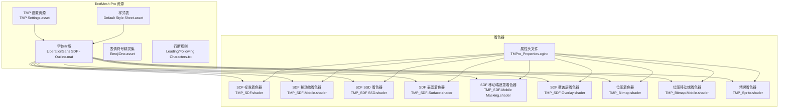
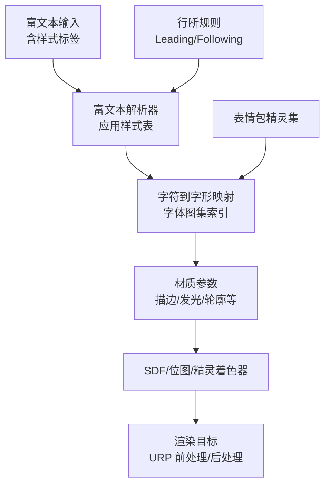
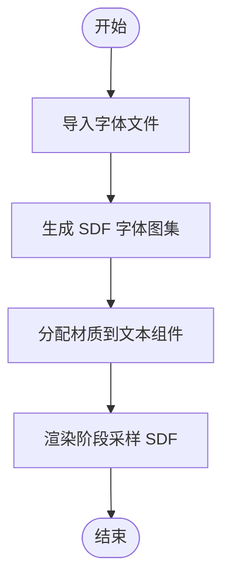
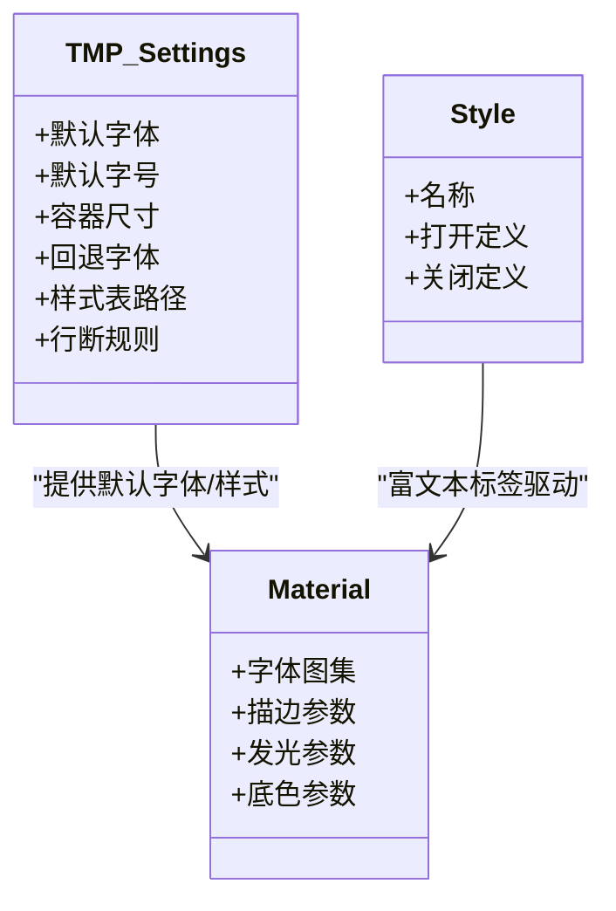
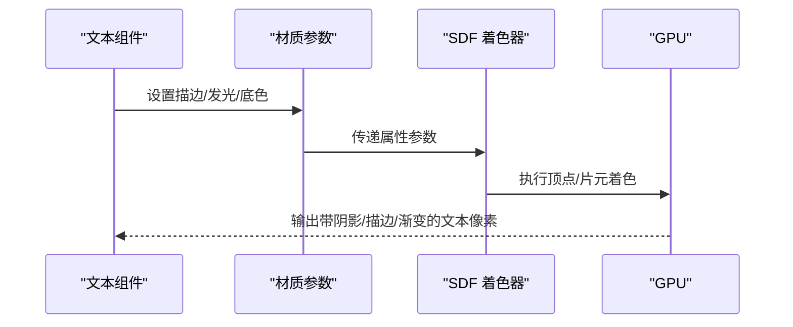
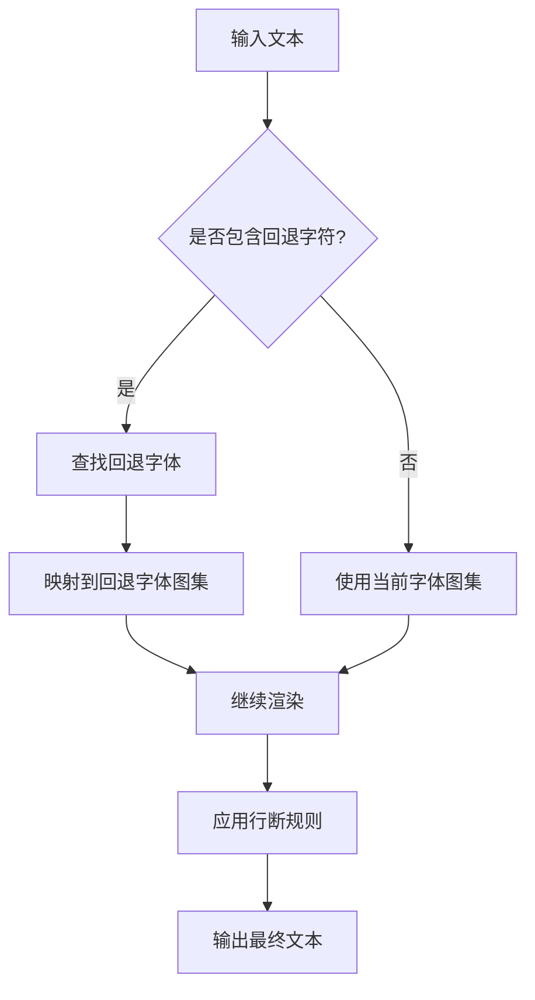
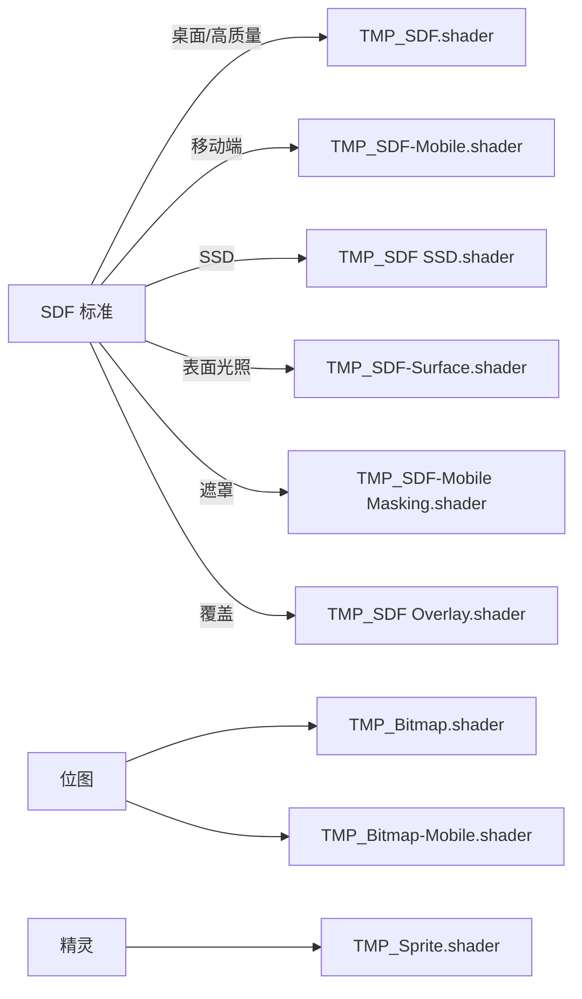
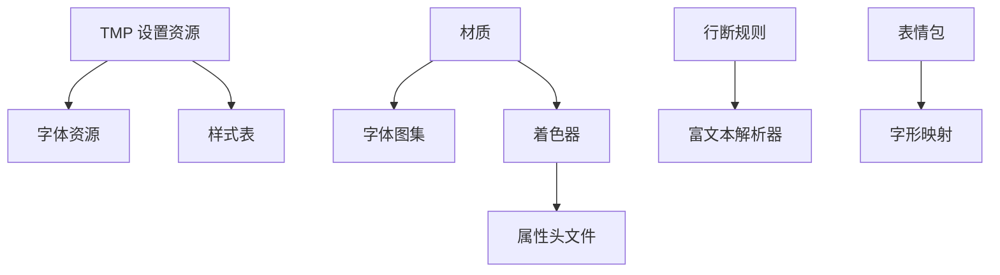

# 文本渲染系统

<cite>
**本文引用的文件**
- [TMP 设置资源](file://Assets/TextMesh Pro/Resources/TMP Settings.asset)
- [默认样式表](file://Assets/TextMesh Pro/Resources/Style Sheets/Default Style Sheet.asset)
- [LiberationSans SDF 轮廓材质](file://Assets/TextMesh Pro/Resources/Fonts & Materials/LiberationSans SDF - Outline.mat)
- [SDF 着色器](file://Assets/TextMesh Pro/Shaders/TMP_SDF.shader)
- [SDF 移动端着色器](file://Assets/TextMesh Pro/Shaders/TMP_SDF-Mobile.shader)
- [SDF SSD 着色器](file://Assets/TextMesh Pro/Shaders/TMP_SDF SSD.shader)
- [SDF 表面着色器](file://Assets/TextMesh Pro/Shaders/TMP_SDF-Surface.shader)
- [SDF 移动端遮罩着色器](file://Assets/TextMesh Pro/Shaders/TMP_SDF-Mobile Masking.shader)
- [SDF 覆盖层着色器](file://Assets/TextMesh Pro/Shaders/TMP_SDF Overlay.shader)
- [位图着色器](file://Assets/TextMesh Pro/Shaders/TMP_Bitmap.shader)
- [位图移动端着色器](file://Assets/TextMesh Pro/Shaders/TMP_Bitmap-Mobile.shader)
- [精灵着色器](file://Assets/TextMesh Pro/Shaders/TMP_Sprite.shader)
- [TMPro 属性头文件](file://Assets/TextMesh Pro/Shaders/TMPro_Properties.cginc)
- [行尾跟随字符列表](file://Assets/TextMesh Pro/Resources/LineBreaking Following Characters.txt)
- [行首跟随字符列表](file://Assets/TextMesh Pro/Resources/LineBreaking Leading Characters.txt)
- [EmojiOne 字体精灵集](file://Assets/TextMesh Pro/Resources/Sprite Assets/EmojiOne.asset)
</cite>

## 目录
1. [简介](#简介)
2. [项目结构](#项目结构)
3. [核心组件](#核心组件)
4. [架构总览](#架构总览)
5. [详细组件分析](#详细组件分析)
6. [依赖关系分析](#依赖关系分析)
7. [性能考量](#性能考量)
8. [故障排查指南](#故障排查指南)
9. [结论](#结论)
10. [附录](#附录)

## 简介
本文件面向 ProjectR 项目的 TextMesh Pro 文本渲染系统，系统性梳理安装配置、字体与材质管理、SDF 字体制作流程、材质球创建与样式表配置、渲染性能优化策略（字体纹理打包、字符缓存、渲染批次）、多语言与字体回退、动态字体加载、文本效果（阴影、描边、渐变）的着色器配置，以及内存管理、GPU 性能监控与跨平台字体适配等实践要点。文档以仓库现有资源为依据，结合 Unity URP 渲染管线与 TextMesh Pro 的标准实现，提供可操作的工程化指导。

## 项目结构
TextMesh Pro 在本项目中的关键位置如下：
- 资源与设置：Assets/TextMesh Pro/Resources 下包含默认字体、材质、样式表、行断规则与精灵集等
- 着色器：Assets/TextMesh Pro/Shaders 下包含 SDF、位图、精灵及属性头文件
- 示例与模板：包含默认设置、样式表、材质与着色器，便于快速上手

**图表来源**
- [TMP 设置资源:1-47](file://Assets/TextMesh Pro/Resources/TMP Settings.asset#L1-L47)
- [默认样式表:1-69](file://Assets/TextMesh Pro/Resources/Style Sheets/Default Style Sheet.asset#L1-L69)
- [LiberationSans SDF 轮廓材质:1-105](file://Assets/TextMesh Pro/Resources/Fonts & Materials/LiberationSans SDF - Outline.mat#L1-L105)
- [SDF 着色器:1-318](file://Assets/TextMesh Pro/Shaders/TMP_SDF.shader#L1-L318)
- [SDF 移动端着色器:1-36](file://Assets/TextMesh Pro/Shaders/TMP_SDF-Mobile.shader#L1-L36)
- [SDF SSD 着色器:54-83](file://Assets/TextMesh Pro/Shaders/TMP_SDF SSD.shader#L54-L83)
- [SDF 表面着色器:30-128](file://Assets/TextMesh Pro/Shaders/TMP_SDF-Surface.shader#L30-L128)
- [SDF 移动端遮罩着色器:1-127](file://Assets/TextMesh Pro/Shaders/TMP_SDF-Mobile Masking.shader#L1-L127)
- [SDF 覆盖层着色器:106-156](file://Assets/TextMesh Pro/Shaders/TMP_SDF Overlay.shader#L106-L156)
- [位图着色器:1-55](file://Assets/TextMesh Pro/Shaders/TMP_Bitmap.shader#L1-L55)
- [位图移动端着色器:1-53](file://Assets/TextMesh Pro/Shaders/TMP_Bitmap-Mobile.shader#L1-L53)
- [精灵着色器:1-59](file://Assets/TextMesh Pro/Shaders/TMP_Sprite.shader#L1-L59)
- [TMPro 属性头文件:34-85](file://Assets/TextMesh Pro/Shaders/TMPro_Properties.cginc#L34-L85)
- [行尾跟随字符列表:1-1](file://Assets/TextMesh Pro/Resources/LineBreaking Following Characters.txt#L1-L1)
- [行首跟随字符列表:1-1](file://Assets/TextMesh Pro/Resources/LineBreaking Leading Characters.txt#L1-L1)
- [EmojiOne 字体精灵集:153-451](file://Assets/TextMesh Pro/Resources/Sprite Assets/EmojiOne.asset#L153-L451)

**章节来源**
- [TMP 设置资源:1-47](file://Assets/TextMesh Pro/Resources/TMP Settings.asset#L1-L47)
- [默认样式表:1-69](file://Assets/TextMesh Pro/Resources/Style Sheets/Default Style Sheet.asset#L1-L69)
- [LiberationSans SDF 轮廓材质:1-105](file://Assets/TextMesh Pro/Resources/Fonts & Materials/LiberationSans SDF - Outline.mat#L1-L105)
- [SDF 着色器:1-318](file://Assets/TextMesh Pro/Shaders/TMP_SDF.shader#L1-L318)
- [TMPro 属性头文件:34-85](file://Assets/TextMesh Pro/Shaders/TMPro_Properties.cginc#L34-L85)
- [行尾跟随字符列表:1-1](file://Assets/TextMesh Pro/Resources/LineBreaking Following Characters.txt#L1-L1)
- [行首跟随字符列表:1-1](file://Assets/TextMesh Pro/Resources/LineBreaking Leading Characters.txt#L1-L1)
- [EmojiOne 字体精灵集:153-451](file://Assets/TextMesh Pro/Resources/Sprite Assets/EmojiOne.asset#L153-L451)

## 核心组件
- 默认设置资源：定义全局默认字体、字号、容器尺寸、回退字体、样式表路径、行断规则等
- 样式表：预置常用标签样式（标题、引用、链接、强调等），便于在富文本中复用
- 字体材质：绑定字体字形图集与着色器参数，控制描边、轮廓、发光、底色等外观
- 着色器族：SDF/位图/精灵三类，覆盖桌面与移动端、不同光照与遮罩需求
- 行断规则与表情包：支撑多语言排版与符号显示

**章节来源**
- [TMP 设置资源:15-47](file://Assets/TextMesh Pro/Resources/TMP Settings.asset#L15-L47)
- [默认样式表:14-69](file://Assets/TextMesh Pro/Resources/Style Sheets/Default Style Sheet.asset#L14-L69)
- [LiberationSans SDF 轮廓材质:11-105](file://Assets/TextMesh Pro/Resources/Fonts & Materials/LiberationSans SDF - Outline.mat#L11-L105)
- [SDF 着色器:3-85](file://Assets/TextMesh Pro/Shaders/TMP_SDF.shader#L3-L85)
- [行尾跟随字符列表:1-1](file://Assets/TextMesh Pro/Resources/LineBreaking Following Characters.txt#L1-L1)
- [行首跟随字符列表:1-1](file://Assets/TextMesh Pro/Resources/LineBreaking Leading Characters.txt#L1-L1)
- [EmojiOne 字体精灵集:153-451](file://Assets/TextMesh Pro/Resources/Sprite Assets/EmojiOne.asset#L153-L451)

## 架构总览
TextMesh Pro 在 URP 下的渲染路径概览：
- 文本输入经由 TMP 组件解析富文本与样式表
- 字符映射到字体图集，结合材质参数与着色器进行像素级采样
- SDF 着色器通过距离场采样实现高质量缩放与边缘平滑
- 不同着色器针对不同场景（移动、遮罩、覆盖、SSD）优化性能与视觉质量
- 行断规则与表情包提升国际化与符号兼容性

**图表来源**
- [TMP 设置资源:15-47](file://Assets/TextMesh Pro/Resources/TMP Settings.asset#L15-L47)
- [默认样式表:14-69](file://Assets/TextMesh Pro/Resources/Style Sheets/Default Style Sheet.asset#L14-L69)
- [LiberationSans SDF 轮廓材质:19-105](file://Assets/TextMesh Pro/Resources/Fonts & Materials/LiberationSans SDF - Outline.mat#L19-L105)
- [SDF 着色器:113-312](file://Assets/TextMesh Pro/Shaders/TMP_SDF.shader#L113-L312)
- [行尾跟随字符列表:1-1](file://Assets/TextMesh Pro/Resources/LineBreaking Following Characters.txt#L1-L1)
- [行首跟随字符列表:1-1](file://Assets/TextMesh Pro/Resources/LineBreaking Leading Characters.txt#L1-L1)
- [EmojiOne 字体精灵集:153-451](file://Assets/TextMesh Pro/Resources/Sprite Assets/EmojiOne.asset#L153-L451)

## 详细组件分析

### 安装与配置
- 安装：通过包管理器引入 TextMesh Pro 后，项目会包含 Assets/TextMesh Pro/* 资源与着色器
- 初始设置：TMP Settings 资源定义默认字体、字号、容器尺寸、回退字体、样式表路径、行断规则等
- 全局匹配材质：启用“匹配材质预设”可自动为 UI 文本匹配合适的材质

**章节来源**
- [TMP 设置资源:15-47](file://Assets/TextMesh Pro/Resources/TMP Settings.asset#L15-L47)

### 字体管理与 SDF 生成
- 字体导入：将 TrueType/OpenType 字体导入 Unity，生成字体 Atlas（SDF）
- 字体图集：材质绑定的 MainTex 即为字形图集，包含字符的 SDF 数据
- 字体回退：TMP Settings 中的回退字体数组用于缺失字符的替代
- 多语言支持：行断规则文件定义中日韩等语言的换行边界，配合 EmojiOne 提升符号显示

**图表来源**
- [TMP 设置资源:32-32](file://Assets/TextMesh Pro/Resources/TMP Settings.asset#L32-L32)
- [LiberationSans SDF 轮廓材质:34-36](file://Assets/TextMesh Pro/Resources/Fonts & Materials/LiberationSans SDF - Outline.mat#L34-L36)
- [行尾跟随字符列表:1-1](file://Assets/TextMesh Pro/Resources/LineBreaking Following Characters.txt#L1-L1)
- [行首跟随字符列表:1-1](file://Assets/TextMesh Pro/Resources/LineBreaking Leading Characters.txt#L1-L1)
- [EmojiOne 字体精灵集:153-451](file://Assets/TextMesh Pro/Resources/Sprite Assets/EmojiOne.asset#L153-L451)

**章节来源**
- [TMP 设置资源:32-32](file://Assets/TextMesh Pro/Resources/TMP Settings.asset#L32-L32)
- [LiberationSans SDF 轮廓材质:34-36](file://Assets/TextMesh Pro/Resources/Fonts & Materials/LiberationSans SDF - Outline.mat#L34-L36)
- [行尾跟随字符列表:1-1](file://Assets/TextMesh Pro/Resources/LineBreaking Following Characters.txt#L1-L1)
- [行首跟随字符列表:1-1](file://Assets/TextMesh Pro/Resources/LineBreaking Leading Characters.txt#L1-L1)
- [EmojiOne 字体精灵集:153-451](file://Assets/TextMesh Pro/Resources/Sprite Assets/EmojiOne.asset#L153-L451)

### 材质系统与样式表
- 材质创建：基于 SDF 着色器创建材质，设置字体图集与参数（轮廓宽度、发光、底色等）
- 样式表：Default Style Sheet 定义常用标签（标题、引用、链接、强调等），可在富文本中直接使用
- 颜色渐变：TMP Settings 指定颜色渐变预设路径，配合着色器参数实现渐变色彩

**图表来源**
- [TMP 设置资源:24-46](file://Assets/TextMesh Pro/Resources/TMP Settings.asset#L24-L46)
- [默认样式表:14-69](file://Assets/TextMesh Pro/Resources/Style Sheets/Default Style Sheet.asset#L14-L69)
- [LiberationSans SDF 轮廓材质:19-105](file://Assets/TextMesh Pro/Resources/Fonts & Materials/LiberationSans SDF - Outline.mat#L19-L105)

**章节来源**
- [TMP 设置资源:24-46](file://Assets/TextMesh Pro/Resources/TMP Settings.asset#L24-L46)
- [默认样式表:14-69](file://Assets/TextMesh Pro/Resources/Style Sheets/Default Style Sheet.asset#L14-L69)
- [LiberationSans SDF 轮廓材质:19-105](file://Assets/TextMesh Pro/Resources/Fonts & Materials/LiberationSans SDF - Outline.mat#L19-L105)

### 文本效果：阴影、描边、渐变
- 描边与轮廓：通过材质参数控制轮廓宽度、软硬度、颜色；着色器根据 SDF 采样计算边缘
- 发光效果：启用发光参数并设置发光颜色与衰减，着色器在像素阶段合成
- 底色/覆盖：底色参数用于文字背景，覆盖层着色器可实现叠加渲染
- 渐变色彩：结合颜色渐变预设与着色器参数，实现多色过渡

**图表来源**
- [LiberationSans SDF 轮廓材质:43-105](file://Assets/TextMesh Pro/Resources/Fonts & Materials/LiberationSans SDF - Outline.mat#L43-L105)
- [SDF 着色器:113-312](file://Assets/TextMesh Pro/Shaders/TMP_SDF.shader#L113-L312)
- [TMPro 属性头文件:34-85](file://Assets/TextMesh Pro/Shaders/TMPro_Properties.cginc#L34-L85)

**章节来源**
- [LiberationSans SDF 轮廓材质:43-105](file://Assets/TextMesh Pro/Resources/Fonts & Materials/LiberationSans SDF - Outline.mat#L43-L105)
- [SDF 着色器:113-312](file://Assets/TextMesh Pro/Shaders/TMP_SDF.shader#L113-L312)
- [TMPro 属性头文件:34-85](file://Assets/TextMesh Pro/Shaders/TMPro_Properties.cginc#L34-L85)

### 多语言支持与字体回退
- 回退字体：TMP Settings 的回退字体数组用于缺失字符的替换，确保多语言内容完整显示
- 行断规则：Leading/Following Characters 文件定义不同语言的换行边界，避免单词或字符被错误截断
- 表情包：EmojiOne 精灵集提供广泛的表情与符号，增强国际化表达

**图表来源**
- [TMP 设置资源:32-32](file://Assets/TextMesh Pro/Resources/TMP Settings.asset#L32-L32)
- [行尾跟随字符列表:1-1](file://Assets/TextMesh Pro/Resources/LineBreaking Following Characters.txt#L1-L1)
- [行首跟随字符列表:1-1](file://Assets/TextMesh Pro/Resources/LineBreaking Leading Characters.txt#L1-L1)
- [EmojiOne 字体精灵集:153-451](file://Assets/TextMesh Pro/Resources/Sprite Assets/EmojiOne.asset#L153-L451)

**章节来源**
- [TMP 设置资源:32-32](file://Assets/TextMesh Pro/Resources/TMP Settings.asset#L32-L32)
- [行尾跟随字符列表:1-1](file://Assets/TextMesh Pro/Resources/LineBreaking Following Characters.txt#L1-L1)
- [行首跟随字符列表:1-1](file://Assets/TextMesh Pro/Resources/LineBreaking Leading Characters.txt#L1-L1)
- [EmojiOne 字体精灵集:153-451](file://Assets/TextMesh Pro/Resources/Sprite Assets/EmojiOne.asset#L153-L451)

### 动态字体加载与运行时切换
- 运行时切换字体：通过代码更新 TMP 组件的 Font Asset，实现动态字体切换
- 字体图集热更新：在支持的平台上可按需加载新字体图集，减少初始包体
- 回退链管理：维护合理的回退字体链，优先使用本地字体，再降级到系统或内置字体

[本节为通用实践建议，不直接分析具体文件]

### 着色器族与渲染路径
- SDF 标准：支持描边、发光、底色、遮罩、剪裁等高级效果
- SDF 移动端：简化版本，降低移动端开销
- SDF SSD：支持自阴影/深度，适合特定光照场景
- 位图/位图移动端：适用于低分辨率或特殊风格
- 精灵：用于图标与表情包

**图表来源**
- [SDF 着色器:1-318](file://Assets/TextMesh Pro/Shaders/TMP_SDF.shader#L1-L318)
- [SDF 移动端着色器:1-36](file://Assets/TextMesh Pro/Shaders/TMP_SDF-Mobile.shader#L1-L36)
- [SDF SSD 着色器:81-310](file://Assets/TextMesh Pro/Shaders/TMP_SDF SSD.shader#L81-L310)
- [SDF 表面着色器:68-128](file://Assets/TextMesh Pro/Shaders/TMP_SDF-Surface.shader#L68-L128)
- [SDF 移动端遮罩着色器:76-127](file://Assets/TextMesh Pro/Shaders/TMP_SDF-Mobile Masking.shader#L76-L127)
- [SDF 覆盖层着色器:106-156](file://Assets/TextMesh Pro/Shaders/TMP_SDF Overlay.shader#L106-L156)
- [位图着色器:1-55](file://Assets/TextMesh Pro/Shaders/TMP_Bitmap.shader#L1-L55)
- [位图移动端着色器:1-53](file://Assets/TextMesh Pro/Shaders/TMP_Bitmap-Mobile.shader#L1-L53)
- [精灵着色器:1-59](file://Assets/TextMesh Pro/Shaders/TMP_Sprite.shader#L1-L59)

**章节来源**
- [SDF 着色器:1-318](file://Assets/TextMesh Pro/Shaders/TMP_SDF.shader#L1-L318)
- [SDF 移动端着色器:1-36](file://Assets/TextMesh Pro/Shaders/TMP_SDF-Mobile.shader#L1-L36)
- [SDF SSD 着色器:81-310](file://Assets/TextMesh Pro/Shaders/TMP_SDF SSD.shader#L81-L310)
- [SDF 表面着色器:68-128](file://Assets/TextMesh Pro/Shaders/TMP_SDF-Surface.shader#L68-L128)
- [SDF 移动端遮罩着色器:76-127](file://Assets/TextMesh Pro/Shaders/TMP_SDF-Mobile Masking.shader#L76-L127)
- [SDF 覆盖层着色器:106-156](file://Assets/TextMesh Pro/Shaders/TMP_SDF Overlay.shader#L106-L156)
- [位图着色器:1-55](file://Assets/TextMesh Pro/Shaders/TMP_Bitmap.shader#L1-L55)
- [位图移动端着色器:1-53](file://Assets/TextMesh Pro/Shaders/TMP_Bitmap-Mobile.shader#L1-L53)
- [精灵着色器:1-59](file://Assets/TextMesh Pro/Shaders/TMP_Sprite.shader#L1-L59)

## 依赖关系分析
- 设置资源依赖字体与样式表：默认字体与样式表路径决定首次加载行为
- 材质依赖字体图集与着色器：材质参数驱动着色器渲染效果
- 着色器依赖属性头文件：统一的属性声明与采样逻辑
- 行断规则与表情包影响字符映射与渲染稳定性

**图表来源**
- [TMP 设置资源:24-46](file://Assets/TextMesh Pro/Resources/TMP Settings.asset#L24-L46)
- [默认样式表:14-69](file://Assets/TextMesh Pro/Resources/Style Sheets/Default Style Sheet.asset#L14-L69)
- [LiberationSans SDF 轮廓材质:34-36](file://Assets/TextMesh Pro/Resources/Fonts & Materials/LiberationSans SDF - Outline.mat#L34-L36)
- [SDF 着色器:113-312](file://Assets/TextMesh Pro/Shaders/TMP_SDF.shader#L113-L312)
- [TMPro 属性头文件:34-85](file://Assets/TextMesh Pro/Shaders/TMPro_Properties.cginc#L34-L85)
- [行尾跟随字符列表:1-1](file://Assets/TextMesh Pro/Resources/LineBreaking Following Characters.txt#L1-L1)
- [行首跟随字符列表:1-1](file://Assets/TextMesh Pro/Resources/LineBreaking Leading Characters.txt#L1-L1)
- [EmojiOne 字体精灵集:153-451](file://Assets/TextMesh Pro/Resources/Sprite Assets/EmojiOne.asset#L153-L451)

**章节来源**
- [TMP 设置资源:24-46](file://Assets/TextMesh Pro/Resources/TMP Settings.asset#L24-L46)
- [默认样式表:14-69](file://Assets/TextMesh Pro/Resources/Style Sheets/Default Style Sheet.asset#L14-L69)
- [LiberationSans SDF 轮廓材质:34-36](file://Assets/TextMesh Pro/Resources/Fonts & Materials/LiberationSans SDF - Outline.mat#L34-L36)
- [SDF 着色器:113-312](file://Assets/TextMesh Pro/Shaders/TMP_SDF.shader#L113-L312)
- [TMPro 属性头文件:34-85](file://Assets/TextMesh Pro/Shaders/TMPro_Properties.cginc#L34-L85)
- [行尾跟随字符列表:1-1](file://Assets/TextMesh Pro/Resources/LineBreaking Following Characters.txt#L1-L1)
- [行首跟随字符列表:1-1](file://Assets/TextMesh Pro/Resources/LineBreaking Leading Characters.txt#L1-L1)
- [EmojiOne 字体精灵集:153-451](file://Assets/TextMesh Pro/Resources/Sprite Assets/EmojiOne.asset#L153-L451)

## 性能考量
- 字体纹理打包：合并字体图集，减少纹理切换；合理设置图集尺寸与分辨率
- 字符缓存：利用 TMP 的字符缓存与实例化策略，避免重复构建几何
- 渲染批次：尽量使用相同材质与着色器，减少 DrawCall；对 UI 文本优先使用 URP 的批处理
- 移动端优化：优先使用 SDF 移动端着色器，禁用昂贵效果（如复杂发光、阴影）
- 行断与表情包：合理配置行断规则与表情包图集，避免过多小图导致批次抖动

[本节提供通用性能建议，不直接分析具体文件]

## 故障排查指南
- 缺失字符显示异常：检查回退字体链与字体图集完整性
- 富文本样式不生效：确认样式表路径与标签定义正确
- 移动端性能骤降：检查是否启用了高成本着色器特性（发光、阴影、SSD）
- 行断异常：核对行断规则文件与目标语言的边界字符
- 表情包不显示：确认表情包精灵集已导入且图集有效

**章节来源**
- [TMP 设置资源:32-32](file://Assets/TextMesh Pro/Resources/TMP Settings.asset#L32-L32)
- [默认样式表:14-69](file://Assets/TextMesh Pro/Resources/Style Sheets/Default Style Sheet.asset#L14-L69)
- [行尾跟随字符列表:1-1](file://Assets/TextMesh Pro/Resources/LineBreaking Following Characters.txt#L1-L1)
- [行首跟随字符列表:1-1](file://Assets/TextMesh Pro/Resources/LineBreaking Leading Characters.txt#L1-L1)
- [EmojiOne 字体精灵集:153-451](file://Assets/TextMesh Pro/Resources/Sprite Assets/EmojiOne.asset#L153-L451)

## 结论
ProjectR 的 TextMesh Pro 文本渲染体系以 TMP Settings 为核心配置，结合样式表与材质参数，通过 SDF 着色器族实现高质量、跨平台的文本渲染。通过合理的字体图集打包、字符缓存与渲染批次优化，以及多语言与回退机制，可在保证视觉质量的同时兼顾性能与可维护性。建议在开发中遵循统一的字体与材质规范，并持续监控 GPU 性能与内存占用，以获得稳定的用户体验。

## 附录
- 参考路径
  - [TMP 设置资源](file://Assets/TextMesh Pro/Resources/TMP Settings.asset)
  - [默认样式表](file://Assets/TextMesh Pro/Resources/Style Sheets/Default Style Sheet.asset)
  - [LiberationSans SDF 轮廓材质](file://Assets/TextMesh Pro/Resources/Fonts & Materials/LiberationSans SDF - Outline.mat)
  - [SDF 着色器](file://Assets/TextMesh Pro/Shaders/TMP_SDF.shader)
  - [TMPro 属性头文件](file://Assets/TextMesh Pro/Shaders/TMPro_Properties.cginc)
  - [行尾跟随字符列表](file://Assets/TextMesh Pro/Resources/LineBreaking Following Characters.txt)
  - [行首跟随字符列表](file://Assets/TextMesh Pro/Resources/LineBreaking Leading Characters.txt)
  - [EmojiOne 字体精灵集](file://Assets/TextMesh Pro/Resources/Sprite Assets/EmojiOne.asset)