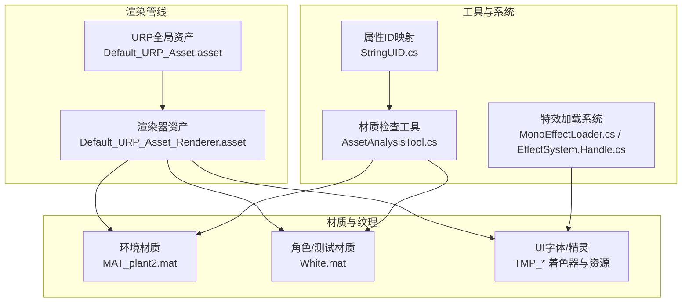
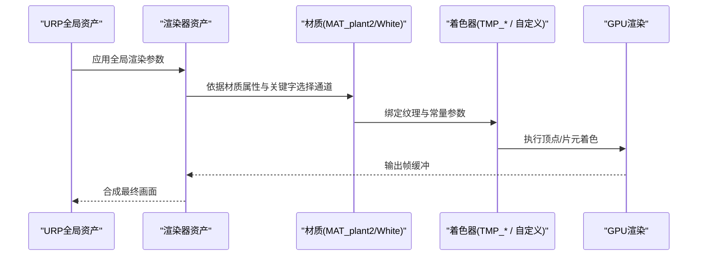
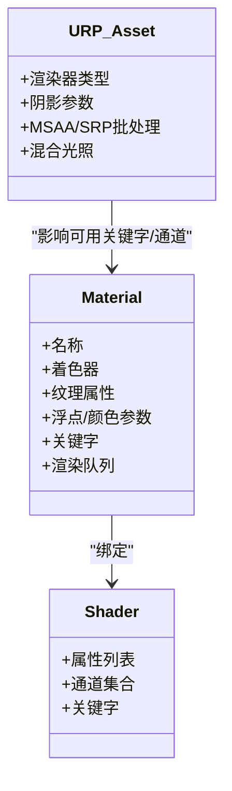
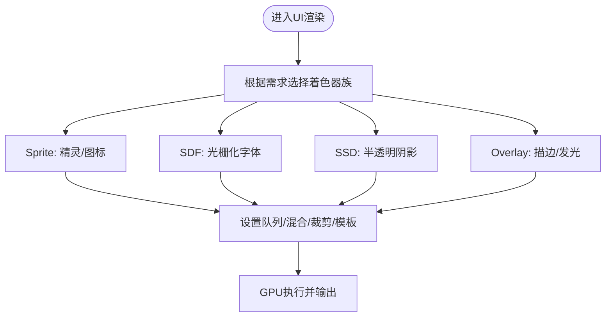
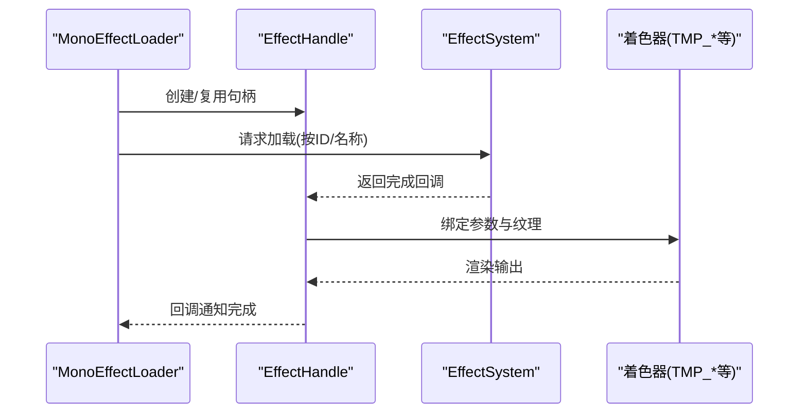
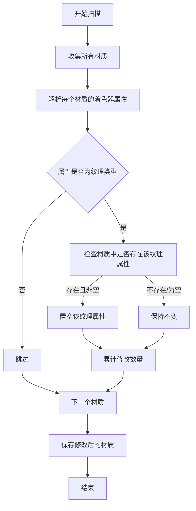
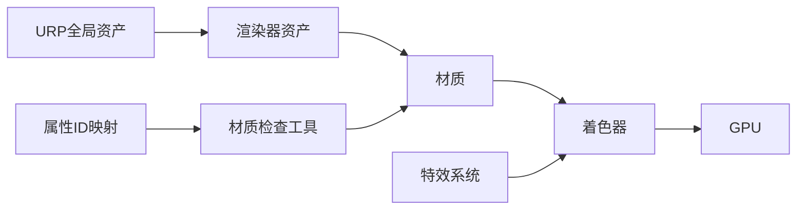

# 材质与纹理

<cite>
**本文引用的文件**   
- [Default_URP_Asset.asset](file://Assets/Art/RenderingAsset/Default_URP_Asset.asset)
- [Default_URP_Asset_Renderer.asset](file://Assets/Art/RenderingAsset/Default_URP_Asset_Renderer.asset)
- [MAT_plant2.mat](file://Assets/Art/Env/TestGround/MAT_plant2.mat)
- [White.mat](file://Assets/Art/Avatar/KCCTester/Materials/White.mat)
- [TMP_Sprite.shader](file://Assets/TextMesh Pro/Shaders/TMP_Sprite.shader)
- [TMP_SDF SSD.shader](file://Assets/TextMesh Pro/Shaders/TMP_SDF SSD.shader)
- [TMP_SDF Overlay.shader](file://Assets/TextMesh Pro/Shaders/TMP_SDF Overlay.shader)
- [TMP_SDF.shader](file://Assets/TextMesh Pro/Shaders/TMP_SDF.shader)
- [TMPro_Surface.cginc](file://Assets/TextMesh Pro/Shaders/TMPro_Surface.cginc)
- [AssetAnalysisTool.cs](file://Assets/Scripts/Editor/AssetAnalysisTools/AssetAnalysisTool.cs)
- [MonoEffectLoader.cs](file://Assets/Scripts/Systems/Implement/ResourceSystem/Mono/MonoEffectLoader.cs)
- [EffectSystem.Handle.cs](file://Assets/Scripts/Systems/Implement/EffectSystem/EffectSystem.Handle.cs)
- [StringUID.cs](file://Assets/Scripts/Core/StringUID.cs)
- [EmojiOne.asset](file://Assets/TextMesh Pro/Resources/Sprite Assets/EmojiOne.asset)
</cite>

## 目录
1. [简介](#简介)
2. [项目结构](#项目结构)
3. [核心组件](#核心组件)
4. [架构总览](#架构总览)
5. [详细组件分析](#详细组件分析)
6. [依赖关系分析](#依赖关系分析)
7. [性能考量](#性能考量)
8. [故障排查指南](#故障排查指南)
9. [结论](#结论)
10. [附录](#附录)

## 简介
本文件面向ProjectR项目的材质与纹理系统，围绕以下目标展开：  
- 全面介绍基于URP（通用渲染管线）的材质配置与着色器参数设置；  
- 说明纹理资源的格式选择、压缩与mipmap策略；  
- 给出角色皮肤、环境地面、UI界面、特效材质的制作规范；  
- 覆盖材质性能分析、GPU占用监控与渲染效率优化；  
- 提供纹理分辨率管理、内存占用控制与加载性能优化最佳实践；  
- 规划材质版本控制、批量处理与自动化生成工作流。

## 项目结构
与材质/纹理相关的关键位置如下：  
- 渲染资产：URP全局管线与渲染器配置位于“Art/RenderingAsset”。  
- 场景材质：环境与角色示例材质位于“Art/Env”和“Art/Avatar/KCCTester/Materials”。  
- UI与字体：TextMeshPro着色器与资源位于“TextMesh Pro”。  
- 工具与系统：编辑器材质检查工具、特效加载系统、字符串属性ID映射等位于“Scripts”。

**图示来源**
- [Default_URP_Asset.asset:1-111](file://Assets/Art/RenderingAsset/Default_URP_Asset.asset#L1-L111)
- [Default_URP_Asset_Renderer.asset:1-58](file://Assets/Art/RenderingAsset/Default_URP_Asset_Renderer.asset#L1-L58)
- [MAT_plant2.mat:1-140](file://Assets/Art/Env/TestGround/MAT_plant2.mat#L1-L140)
- [White.mat:1-136](file://Assets/Art/Avatar/KCCTester/Materials/White.mat#L1-L136)
- [TMP_Sprite.shader:1-59](file://Assets/TextMesh Pro/Shaders/TMP_Sprite.shader#L1-L59)
- [AssetAnalysisTool.cs:174-396](file://Assets/Scripts/Editor/AssetAnalysisTools/AssetAnalysisTool.cs#L174-L396)
- [MonoEffectLoader.cs:44-86](file://Assets/Scripts/Systems/Implement/ResourceSystem/Mono/MonoEffectLoader.cs#L44-L86)
- [EffectSystem.Handle.cs:159-205](file://Assets/Scripts/Systems/Implement/EffectSystem/EffectSystem.Handle.cs#L159-L205)
- [StringUID.cs:1-30](file://Assets/Scripts/Core/StringUID.cs#L1-L30)

**章节来源**
- [Default_URP_Asset.asset:1-111](file://Assets/Art/RenderingAsset/Default_URP_Asset.asset#L1-L111)
- [Default_URP_Asset_Renderer.asset:1-58](file://Assets/Art/RenderingAsset/Default_URP_Asset_Renderer.asset#L1-L58)

## 核心组件
- URP全局资产：定义渲染器类型、阴影、MSAA、SRP批处理、混合光照、色调映射等全局参数。  
- 渲染器资产：定义渲染器特性、后处理、遮挡剔除、透明层掩码、中间缓冲模式等。  
- 材质：包含着色器引用、纹理属性、浮点/颜色参数、关键字与渲染队列等。  
- UI与字体：TextMeshPro着色器族支持精灵、SDF、SSD、Overlay等渲染路径，适配UI透明与轮廓效果。  
- 工具与系统：材质检查工具用于清理无效纹理属性；特效系统负责动态加载与生命周期管理；字符串属性ID映射用于统一属性名到ID的访问。

**章节来源**
- [Default_URP_Asset.asset:1-111](file://Assets/Art/RenderingAsset/Default_URP_Asset.asset#L1-L111)
- [Default_URP_Asset_Renderer.asset:1-58](file://Assets/Art/RenderingAsset/Default_URP_Asset_Renderer.asset#L1-L58)
- [AssetAnalysisTool.cs:174-396](file://Assets/Scripts/Editor/AssetAnalysisTools/AssetAnalysisTool.cs#L174-L396)
- [MonoEffectLoader.cs:44-86](file://Assets/Scripts/Systems/Implement/ResourceSystem/Mono/MonoEffectLoader.cs#L44-L86)
- [EffectSystem.Handle.cs:159-205](file://Assets/Scripts/Systems/Implement/EffectSystem/EffectSystem.Handle.cs#L159-L205)
- [StringUID.cs:1-30](file://Assets/Scripts/Core/StringUID.cs#L1-L30)

## 架构总览
下图展示从URP到材质再到渲染输出的整体链路，以及UI与特效在该链路上的集成方式。

**图示来源**
- [Default_URP_Asset.asset:1-111](file://Assets/Art/RenderingAsset/Default_URP_Asset.asset#L1-L111)
- [Default_URP_Asset_Renderer.asset:1-58](file://Assets/Art/RenderingAsset/Default_URP_Asset_Renderer.asset#L1-L58)
- [MAT_plant2.mat:1-140](file://Assets/Art/Env/TestGround/MAT_plant2.mat#L1-L140)
- [White.mat:1-136](file://Assets/Art/Avatar/KCCTester/Materials/White.mat#L1-L136)
- [TMP_Sprite.shader:1-59](file://Assets/TextMesh Pro/Shaders/TMP_Sprite.shader#L1-L59)

## 详细组件分析

### URP全局资产与渲染器资产
- 关键点：渲染器类型、阴影层级与分辨率、MSAA、SRP批处理、混合光照、色调映射、深度模板与透明层掩码、中间缓冲模式等。  
- 影响：决定全局渲染质量、性能取舍与兼容性。例如启用SRP批处理可显著降低Draw Call；阴影分辨率影响角色与场景细节表现。

**章节来源**
- [Default_URP_Asset.asset:1-111](file://Assets/Art/RenderingAsset/Default_URP_Asset.asset#L1-L111)
- [Default_URP_Asset_Renderer.asset:1-58](file://Assets/Art/RenderingAsset/Default_URP_Asset_Renderer.asset#L1-L58)

### 材质与着色器参数（以环境与角色为例）
- 环境材质（植物）：使用自定义着色器，包含风效关键字、透明/不透明参数、UV偏移与缩放、多通道纹理占位等。  
- 角色/测试材质：使用URP内置PBR着色器，包含基础/高光反射、金属度/光滑度、法线、遮挡等属性，适合角色皮肤与静态物体。

**图示来源**
- [MAT_plant2.mat:1-140](file://Assets/Art/Env/TestGround/MAT_plant2.mat#L1-L140)
- [White.mat:1-136](file://Assets/Art/Avatar/KCCTester/Materials/White.mat#L1-L136)
- [Default_URP_Asset.asset:1-111](file://Assets/Art/RenderingAsset/Default_URP_Asset.asset#L1-L111)

**章节来源**
- [MAT_plant2.mat:1-140](file://Assets/Art/Env/TestGround/MAT_plant2.mat#L1-L140)
- [White.mat:1-136](file://Assets/Art/Avatar/KCCTester/Materials/White.mat#L1-L136)

### UI与字体材质（TextMeshPro）
- 着色器族：Sprite、SDF、SSD、Overlay等，分别针对精灵绘制、轮廓描边、阴影叠加与抗锯齿。  
- 关键参数：队列、剔除、混合、模板测试、裁剪矩形、Alpha Clip开关等。  
- 资源：Sprite字形集与着色器配合，实现UI文本与图标渲染。

**图示来源**
- [TMP_Sprite.shader:1-59](file://Assets/TextMesh Pro/Shaders/TMP_Sprite.shader#L1-L59)
- [TMP_SDF SSD.shader:198-232](file://Assets/TextMesh Pro/Shaders/TMP_SDF SSD.shader#L198-L232)
- [TMP_SDF Overlay.shader:106-156](file://Assets/TextMesh Pro/Shaders/TMP_SDF Overlay.shader#L106-L156)
- [TMP_SDF.shader:106-156](file://Assets/TextMesh Pro/Shaders/TMP_SDF.shader#L106-L156)
- [TMPro_Surface.cginc:68-101](file://Assets/TextMesh Pro/Shaders/TMPro_Surface.cginc#L68-L101)
- [EmojiOne.asset:643-659](file://Assets/TextMesh Pro/Resources/Sprite Assets/EmojiOne.asset#L643-L659)

**章节来源**
- [TMP_Sprite.shader:1-59](file://Assets/TextMesh Pro/Shaders/TMP_Sprite.shader#L1-L59)
- [TMP_SDF SSD.shader:198-232](file://Assets/TextMesh Pro/Shaders/TMP_SDF SSD.shader#L198-L232)
- [TMP_SDF Overlay.shader:106-156](file://Assets/TextMesh Pro/Shaders/TMP_SDF Overlay.shader#L106-L156)
- [TMP_SDF.shader:106-156](file://Assets/TextMesh Pro/Shaders/TMP_SDF.shader#L106-L156)
- [TMPro_Surface.cginc:68-101](file://Assets/TextMesh Pro/Shaders/TMPro_Surface.cginc#L68-L101)
- [EmojiOne.asset:643-659](file://Assets/TextMesh Pro/Resources/Sprite Assets/EmojiOne.asset#L643-L659)

### 特效材质与加载系统
- 特效加载：通过系统句柄异步加载，支持父子关系与变换空间设置，完成后回调通知。  
- 材质关联：特效通常依赖UI或SDF类着色器以实现半透明与轮廓效果；需确保纹理与参数正确绑定。

**图示来源**
- [MonoEffectLoader.cs:44-86](file://Assets/Scripts/Systems/Implement/ResourceSystem/Mono/MonoEffectLoader.cs#L44-L86)
- [EffectSystem.Handle.cs:159-205](file://Assets/Scripts/Systems/Implement/EffectSystem/EffectSystem.Handle.cs#L159-L205)

**章节来源**
- [MonoEffectLoader.cs:44-86](file://Assets/Scripts/Systems/Implement/ResourceSystem/Mono/MonoEffectLoader.cs#L44-L86)
- [EffectSystem.Handle.cs:159-205](file://Assets/Scripts/Systems/Implement/EffectSystem/EffectSystem.Handle.cs#L159-L205)

### 材质检查与属性清理（编辑器工具）
- 功能：扫描材质纹理属性，自动清理与着色器无关的纹理字段，减少冗余与潜在错误。  
- 流程：遍历所有材质，查询着色器属性类型，对比材质已设置纹理，清空无效项并保存。

**图示来源**
- [AssetAnalysisTool.cs:174-396](file://Assets/Scripts/Editor/AssetAnalysisTools/AssetAnalysisTool.cs#L174-L396)

**章节来源**
- [AssetAnalysisTool.cs:174-396](file://Assets/Scripts/Editor/AssetAnalysisTools/AssetAnalysisTool.cs#L174-L396)

## 依赖关系分析
- URP全局资产与渲染器资产共同决定材质可用的关键字与通道选择。  
- 材质依赖着色器暴露的属性列表，属性缺失或冗余会导致渲染异常或性能浪费。  
- UI与特效依赖TextMeshPro着色器族，需保证纹理与参数一致。  
- 工具与系统通过统一的属性ID映射提升跨模块一致性。

**图示来源**
- [Default_URP_Asset.asset:1-111](file://Assets/Art/RenderingAsset/Default_URP_Asset.asset#L1-L111)
- [Default_URP_Asset_Renderer.asset:1-58](file://Assets/Art/RenderingAsset/Default_URP_Asset_Renderer.asset#L1-L58)
- [AssetAnalysisTool.cs:174-396](file://Assets/Scripts/Editor/AssetAnalysisTools/AssetAnalysisTool.cs#L174-L396)
- [MonoEffectLoader.cs:44-86](file://Assets/Scripts/Systems/Implement/ResourceSystem/Mono/MonoEffectLoader.cs#L44-L86)
- [StringUID.cs:1-30](file://Assets/Scripts/Core/StringUID.cs#L1-L30)

**章节来源**
- [Default_URP_Asset.asset:1-111](file://Assets/Art/RenderingAsset/Default_URP_Asset.asset#L1-L111)
- [Default_URP_Asset_Renderer.asset:1-58](file://Assets/Art/RenderingAsset/Default_URP_Asset_Renderer.asset#L1-L58)
- [AssetAnalysisTool.cs:174-396](file://Assets/Scripts/Editor/AssetAnalysisTools/AssetAnalysisTool.cs#L174-L396)
- [MonoEffectLoader.cs:44-86](file://Assets/Scripts/Systems/Implement/ResourceSystem/Mono/MonoEffectLoader.cs#L44-L86)
- [StringUID.cs:1-30](file://Assets/Scripts/Core/StringUID.cs#L1-L30)

## 性能考量
- 渲染管线参数：优先启用SRP批处理；合理设置阴影分辨率与级联数；MSAA适度开启以平衡质量与性能。  
- 材质与纹理：  
  - 使用合适的纹理格式与压缩（如ASTC/ETC2于移动平台），避免超分辨率贴图；  
  - 为UI与半透明特效启用适当的混合与模板测试；  
  - 控制纹理单元数量，避免材质冗余属性导致的额外采样与带宽消耗。  
- 运行时优化：  
  - 尽量合并材质与纹理，减少Draw Call；  
  - 对频繁切换的参数使用Shader Property To ID统一访问；  
  - 利用工具定期清理无效纹理属性，防止资源泄漏与渲染异常。

**章节来源**
- [Default_URP_Asset.asset:1-111](file://Assets/Art/RenderingAsset/Default_URP_Asset.asset#L1-L111)
- [Default_URP_Asset_Renderer.asset:1-58](file://Assets/Art/RenderingAsset/Default_URP_Asset_Renderer.asset#L1-L58)
- [AssetAnalysisTool.cs:174-396](file://Assets/Scripts/Editor/AssetAnalysisTools/AssetAnalysisTool.cs#L174-L396)
- [StringUID.cs:1-30](file://Assets/Scripts/Core/StringUID.cs#L1-L30)

## 故障排查指南
- 材质纹理异常：  
  - 症状：材质显示异常或出现黑块；  
  - 排查：使用材质检查工具清理无效纹理属性；核对着色器属性列表与材质设置是否匹配。  
- UI渲染问题：  
  - 症状：文字或图标错位、裁剪异常；  
  - 排查：确认着色器队列、模板测试与裁剪矩形设置；检查字形集与着色器是否匹配。  
- 特效加载失败：  
  - 症状：特效不显示或延迟；  
  - 排查：检查句柄状态与完成回调；确认特效配置与着色器参数一致。

**章节来源**
- [AssetAnalysisTool.cs:174-396](file://Assets/Scripts/Editor/AssetAnalysisTools/AssetAnalysisTool.cs#L174-L396)
- [TMP_Sprite.shader:1-59](file://Assets/TextMesh Pro/Shaders/TMP_Sprite.shader#L1-L59)
- [MonoEffectLoader.cs:44-86](file://Assets/Scripts/Systems/Implement/ResourceSystem/Mono/MonoEffectLoader.cs#L44-L86)
- [EffectSystem.Handle.cs:159-205](file://Assets/Scripts/Systems/Implement/EffectSystem/EffectSystem.Handle.cs#L159-L205)

## 结论
ProjectR的材质与纹理体系以URP为核心，结合材质、着色器与编辑器工具形成完整的开发与优化闭环。通过规范化的材质制作流程、纹理格式与压缩策略、以及运行时的性能监控与优化手段，可在保证视觉质量的同时获得稳定的渲染性能。建议持续使用材质检查工具与属性ID映射机制，确保材质一致性与可维护性，并将UI与特效的着色器族选择纳入标准化流程。

## 附录
- 制作规范要点（概要）：  
  - 角色皮肤：使用PBR材质，控制金属度/光滑度与法线贴图；避免过度高光；  
  - 环境地面：根据光照与阴影需求选择合适着色器与纹理分辨率；  
  - UI界面：优先SDF/Sprite着色器，注意混合与裁剪设置；  
  - 特效材质：关注半透明与模板测试，减少带宽与采样开销。  
- 版本控制与自动化：  
  - 建议将材质与着色器参数纳入版本控制；  
  - 使用脚本批量校验材质属性与纹理绑定；  
  - 在CI中加入材质检查步骤，确保团队交付质量。