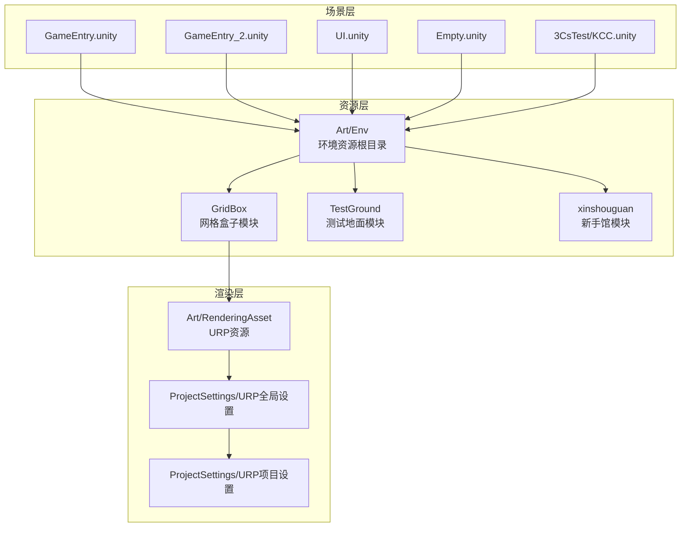
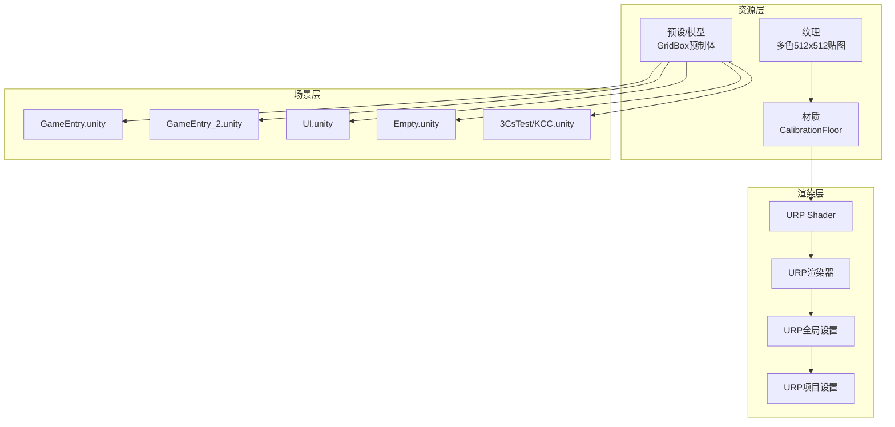
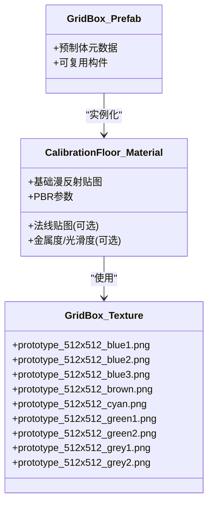
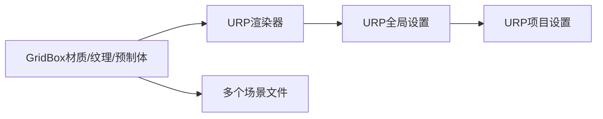

# 环境资源

<cite>
**本文引用的文件**
- [Assets/Art/Env/__info__.json](file://Assets/Art/Env/__info__.json)
- [Assets/Art/Env/GridBox/CalibrationFloor.mat](file://Assets/Art/Env/GridBox/CalibrationFloor.mat)
- [Assets/Art/Env/GridBox/Texture/prototype_512x512_blue1.png](file://Assets/Art/Env/GridBox/Texture/prototype_512x512_blue1.png)
- [Assets/Art/Env/GridBox/Texture/prototype_512x512_blue2.png](file://Assets/Art/Env/GridBox/Texture/prototype_512x512_blue2.png)
- [Assets/Art/Env/GridBox/Texture/prototype_512x512_blue3.png](file://Assets/Art/Env/GridBox/Texture/prototype_512x512_blue3.png)
- [Assets/Art/Env/GridBox/Texture/prototype_512x512_brown.png](file://Assets/Art/Env/GridBox/Texture/prototype_512x512_brown.png)
- [Assets/Art/Env/GridBox/Texture/prototype_512x512_cyan.png](file://Assets/Art/Env/GridBox/Texture/prototype_512x512_cyan.png)
- [Assets/Art/Env/GridBox/Texture/prototype_512x512_green1.png](file://Assets/Art/Env/GridBox/Texture/prototype_512x512_green1.png)
- [Assets/Art/Env/GridBox/Texture/prototype_512x512_green2.png](file://Assets/Art/Env/GridBox/Texture/prototype_512x512_green2.png)
- [Assets/Art/Env/GridBox/Texture/prototype_512x512_grey1.png](file://Assets/Art/Env/GridBox/Texture/prototype_512x512_grey1.png)
- [Assets/Art/Env/GridBox/Texture/prototype_512x512_grey2.png](file://Assets/Art/Env/GridBox/Texture/prototype_512x512_grey2.png)
- [Assets/Art/Env/GridBox/Prefabs.meta](file://Assets/Art/Env/GridBox/Prefabs.meta)
- [Assets/Art/Env/GridBox/Texture.meta](file://Assets/Art/Env/GridBox/Texture.meta)
- [Assets/Art/Env/GridBox/CalibrationFloor.mat.meta](file://Assets/Art/Env/GridBox/CalibrationFloor.mat.meta)
- [Assets/Art/Env/GridBox/__info__.json](file://Assets/Art/Env/GridBox/__info__.json)
- [Assets/Art/Env/GridBox.meta](file://Assets/Art/Env/GridBox.meta)
- [Assets/Art/Env.meta](file://Assets/Art/Env.meta)
- [Assets/RenderingAsset/Default_URP_Asset.asset](file://Assets/RenderingAsset/Default_URP_Asset.asset)
- [Assets/RenderingAsset/Default_URP_Asset_Renderer.asset](file://Assets/RenderingAsset/Default_URP_Asset_Renderer.asset)
- [Assets/RenderingAsset/Default_URP_Asset.asset.meta](file://Assets/RenderingAsset/Default_URP_Asset.asset.meta)
- [Assets/RenderingAsset/Default_URP_Asset_Renderer.asset.meta](file://Assets/RenderingAsset/Default_URP_Asset_Renderer.asset.meta)
- [ProjectSettings/UniversalRenderPipelineGlobalSettings.asset](file://ProjectSettings/UniversalRenderPipelineGlobalSettings.asset)
- [ProjectSettings/URPProjectSettings.asset](file://ProjectSettings/URPProjectSettings.asset)
- [Assets/Scenes/GameEntry.unity](file://Assets/Scenes/GameEntry.unity)
- [Assets/Scenes/GameEntry_2.unity](file://Assets/Scenes/GameEntry_2.unity)
- [Assets/Scenes/UI.unity](file://Assets/Scenes/UI.unity)
- [Assets/Scenes/Empty.unity](file://Assets/Scenes/Empty.unity)
- [Assets/Scenes/3CsTest/KCC.unity](file://Assets/Scenes/3CsTest/KCC.unity)
- [Assets/Scenes/learnPlugin.unity](file://Assets/Scenes/learnPlugin.unity)
- [Assets/Scenes/AssetAnalysisSetting.asset](file://Assets/Scenes/AssetAnalysisSetting.asset)
- [Assets/Resources/AssetBundleCollectorSetting.asset](file://Assets/Resources/AssetBundleCollectorSetting.asset)
- [Assets/Resources/YooAssetSettings.asset](file://Assets/Resources/YooAssetSettings.asset)
- [Assets/Resources/AssetAnalysisSetting.asset](file://Assets/Resources/AssetAnalysisSetting.asset)
- [Assets/Resources/AssetBundleCollectorConfig.xml](file://Assets/Resources/AssetBundleCollectorConfig.xml)
- [Assets/Resources/PerformanceTestRunSettings.json](file://Assets/Resources/PerformanceTestRunSettings.json)
- [Assets/Resources/PerformanceTestRunInfo.json.meta](file://Assets/Resources/PerformanceTestRunInfo.json.meta)
- [Assets/Dev/Lab/Scenes/ABLoadTest.meta](file://Assets/Dev/Lab/Scenes/ABLoadTest.meta)
- [Assets/Dev/Lab/Res.meta](file://Assets/Dev/Lab/Res.meta)
- [Assets/Dev/Lab/Scripts.meta](file://Assets/Dev/Lab/Scripts.meta)
- [Assets/Dev/Lab/UIToolkitEditorWindow.meta](file://Assets/Dev/Lab/UIToolkitEditorWindow.meta)
- [Assets/Dev/Lab/TimelineLab.meta](file://Assets/Dev/Lab/TimelineLab.meta)
- [Assets/Dev/Lab/ParameterBlockTest.meta](file://Assets/Dev/Lab/ParameterBlockTest.meta)
- [Assets/Dev/Lab/NonCGBlackBoard.meta](file://Assets/Dev/Lab/NonCGBlackBoard.meta)
- [Assets/Dev/Lab/PlayerloopUpdate.meta](file://Assets/Dev/Lab/PlayerloopUpdate.meta)
- [Assets/Dev/Lab/ResourceTest.meta](file://Assets/Dev/Lab/ResourceTest.meta)
- [Assets/Dev/Lab/NetcodeTest.meta](file://Assets/Dev/Lab/NetcodeTest.meta)
- [Assets/Dev/Lab/AffixTest.meta](file://Assets/Dev/Lab/AffixTest.meta)
- [Assets/Dev/Lab/FSMTest.meta](file://Assets/Dev/Lab/FSMTest.meta)
- [Assets/Dev/Lab/IndexedString.meta](file://Assets/Dev/Lab/IndexedString.meta)
- [Assets/Dev/Lab/ABLoadTest.meta](file://Assets/Dev/Lab/ABLoadTest.meta)
- [Assets/Dev/Lab/Scenes.meta](file://Assets/Dev/Lab/Scenes.meta)
- [Assets/Dev/Lab/Scripts.meta](file://Assets/Dev/Lab/Scripts.meta)
- [Assets/Dev/Lab/Res.meta](file://Assets/Dev/Lab/Res.meta)
- [Assets/Dev/Lab/UIToolkitEditorWindow.meta](file://Assets/Dev/Lab/UIToolkitEditorWindow.meta)
- [Assets/Dev/Lab/TimelineLab.meta](file://Assets/Dev/Lab/TimelineLab.meta)
- [Assets/Dev/Lab/ParameterBlockTest.meta](file://Assets/Dev/Lab/ParameterBlockTest.meta)
- [Assets/Dev/Lab/NonCGBlackBoard.meta](file://Assets/Dev/Lab/NonCGBlackBoard.meta)
- [Assets/Dev/Lab/PlayerloopUpdate.meta](file://Assets/Dev/Lab/PlayerloopUpdate.meta)
- [Assets/Dev/Lab/ResourceTest.meta](file://Assets/Dev/Lab/ResourceTest.meta)
- [Assets/Dev/Lab/NetcodeTest.meta](file://Assets/Dev/Lab/NetcodeTest.meta)
- [Assets/Dev/Lab/AffixTest.meta](file://Assets/Dev/Lab/AffixTest.meta)
- [Assets/Dev/Lab/FSMTest.meta](file://Assets/Dev/Lab/FSMTest.meta)
- [Assets/Dev/Lab/IndexedString.meta](file://Assets/Dev/Lab/IndexedString.meta)
- [Assets/Dev/Lab/__info__.json](file://Assets/Dev/Lab/__info__.json)
- [Assets/Dev/Lab.meta](file://Assets/Dev/Lab.meta)
- [Assets/Dev/Scenes/ReleasedUnitTestScene.unity](file://Assets/Dev/Scenes/ReleasedUnitTestScene.unity)
- [Assets/Dev/Scenes.meta](file://Assets/Dev/Scenes.meta)
- [Assets/Dev/Example/SimpleGameProgress.meta](file://Assets/Dev/Example/SimpleGameProgress.meta)
- [Assets/Dev/Example.meta](file://Assets/Dev/Example.meta)
- [Assets/Dev/Assets_.meta](file://Assets/Dev/Assets_.meta)
- [Assets/Dev/Config.meta](file://Assets/Dev/Config.meta)
- [Assets/Dev/Flag.meta](file://Assets/Dev/Flag.meta)
- [Assets/Dev/Prefabs.meta](file://Assets/Dev/Prefabs.meta)
- [Assets/Dev/Scripts.meta](file://Assets/Dev/Scripts.meta)
- [Assets/Dev/NetcodeTest.meta](file://Assets/Dev/NetcodeTest.meta)
- [Assets/Dev/Assets_.meta](file://Assets/Dev/Assets_.meta)
- [Assets/Dev/Config.meta](file://Assets/Dev/Config.meta)
- [Assets/Dev/Flag.meta](file://Assets/Dev/Flag.meta)
- [Assets/Dev/Prefabs.meta](file://Assets/Dev/Prefabs.meta)
- [Assets/Dev/Scripts.meta](file://Assets/Dev/Scripts.meta)
- [Assets/Dev/NetcodeTest.meta](file://Assets/Dev/NetcodeTest.meta)
- [Assets/Dev/__info__.json](file://Assets/Dev/__info__.json)
- [Assets/Dev.meta](file://Assets/Dev.meta)
- [Assets/Scripts/Core/AbstractDefine.meta](file://Assets/Scripts/Core/AbstractDefine.meta)
- [Assets/Scripts/Core/BlackBoard.meta](file://Assets/Scripts/Core/BlackBoard.meta)
- [Assets/Scripts/Core/Flow.meta](file://Assets/Scripts/Core/Flow.meta)
- [Assets/Scripts/Core/GenericBuffer.meta](file://Assets/Scripts/Core/GenericBuffer.meta)
- [Assets/Scripts/Core/GenericRunner.meta](file://Assets/Scripts/Core/GenericRunner.meta)
- [Assets/Scripts/Core/NumericalControl.meta](file://Assets/Scripts/Core/NumericalControl.meta)
- [Assets/Scripts/Core/ObjectPooling.meta](file://Assets/Scripts/Core/ObjectPooling.meta)
- [Assets/Scripts/Core/PlayerLoopAgent.meta](file://Assets/Scripts/Core/PlayerLoopAgent.meta)
- [Assets/Scripts/Core/Reference.meta](file://Assets/Scripts/Core/Reference.meta)
- [Assets/Scripts/Core/StateMachine.meta](file://Assets/Scripts/Core/StateMachine.meta)
- [Assets/Scripts/Core/TypeExtension.meta](file://Assets/Scripts/Core/TypeExtension.meta)
- [Assets/Scripts/Core/Variable.meta](file://Assets/Scripts/Core/Variable.meta)
- [Assets/Scripts/Core/__info__.json](file://Assets/Scripts/Core/__info__.json)
- [Assets/Scripts/Core.meta](file://Assets/Scripts/Core.meta)
- [Assets/Scripts/Modules/Enemy.meta](file://Assets/Scripts/Modules/Enemy.meta)
- [Assets/Scripts/Modules/Entity.meta](file://Assets/Scripts/Modules/Entity.meta)
- [Assets/Scripts/Modules/Items.meta](file://Assets/Scripts/Modules/Items.meta)
- [Assets/Scripts/Modules/Traps.meta](file://Assets/Scripts/Modules/Traps.meta)
- [Assets/Scripts/Modules/Triggers.meta](file://Assets/Scripts/Modules/Triggers.meta)
- [Assets/Scripts/Modules/__info__.json](file://Assets/Scripts/Modules/__info__.json)
- [Assets/Scripts/Modules.meta](file://Assets/Scripts/Modules.meta)
- [Assets/Scripts/Systems/Implement.meta](file://Assets/Scripts/Systems/Implement.meta)
- [Assets/Scripts/Systems/RuntimeEditor.meta](file://Assets/Scripts/Systems/RuntimeEditor.meta)
- [Assets/Scripts/Systems/__info__.json](file://Assets/Scripts/Systems/__info__.json)
- [Assets/Scripts/Systems.meta](file://Assets/Scripts/Systems.meta)
- [Assets/Scripts/StateMachine/ScriptState.meta](file://Assets/Scripts/StateMachine/ScriptState.meta)
- [Assets/Scripts/StateMachine/__info__.json](file://Assets/Scripts/StateMachine/__info__.json)
- [Assets/Scripts/StateMachine.meta](file://Assets/Scripts/StateMachine.meta)
- [Assets/Scripts/Editor/AssetAnalysisTools.meta](file://Assets/Scripts/Editor/AssetAnalysisTools.meta)
- [Assets/Scripts/Editor/AssetBundleBuild.meta](file://Assets/Scripts/Editor/AssetBundleBuild.meta)
- [Assets/Scripts/Editor/Config.meta](file://Assets/Scripts/Editor/Config.meta)
- [Assets/Scripts/Editor/DuplicateNaming.meta](file://Assets/Scripts/Editor/DuplicateNaming.meta)
- [Assets/Scripts/Editor/PlayerBuild.meta](file://Assets/Scripts/Editor/PlayerBuild.meta)
- [Assets/Scripts/Editor/ProjectHierarchyExtension.meta](file://Assets/Scripts/Editor/ProjectHierarchyExtension.meta)
- [Assets/Scripts/Editor/Tools.meta](file://Assets/Scripts/Editor/Tools.meta)
- [Assets/Scripts/Editor/Utility.meta](file://Assets/Scripts/Editor/Utility.meta)
- [Assets/Scripts/Editor/__info__.json](file://Assets/Scripts/Editor/__info__.json)
- [Assets/Scripts/Editor.meta](file://Assets/Scripts/Editor.meta)
- [Assets/Scripts/Editor/PJR.Editor.asmdef](file://Assets/Scripts/Editor/PJR.Editor.asmdef)
- [Assets/Scripts/Editor/PJR.Editor.asmdef.meta](file://Assets/Scripts/Editor/PJR.Editor.asmdef.meta)
- [Assets/Scripts/Editor/AssetAnalysisTools.meta](file://Assets/Scripts/Editor/AssetAnalysisTools.meta)
- [Assets/Scripts/Editor/AssetBundleBuild.meta](file://Assets/Scripts/Editor/AssetBundleBuild.meta)
- [Assets/Scripts/Editor/Config.meta](file://Assets/Scripts/Editor/Config.meta)
- [Assets/Scenes/3CsTest.meta](file://Assets/Scenes/3CsTest.meta)
- [Assets/Scenes/3CsTest/KCC.unity.meta](file://Assets/Scenes/3CsTest/KCC.unity.meta)
- [Assets/Scenes/AssetAnalysisSetting.asset.meta](file://Assets/Scenes/AssetAnalysisSetting.asset.meta)
- [Assets/Scenes/Empty.unity.meta](file://Assets/Scenes/Empty.unity.meta)
- [Assets/Scenes/GameEntry.unity.meta](file://Assets/Scenes/GameEntry.unity.meta)
- [Assets/Scenes/GameEntry_2.unity.meta](file://Assets/Scenes/GameEntry_2.unity.meta)
- [Assets/Scenes/UI.unity.meta](file://Assets/Scenes/UI.unity.meta)
- [Assets/Scenes/learnPlugin.unity.meta](file://Assets/Scenes/learnPlugin.unity.meta)
- [Assets/Scenes/ReleasedUnitTestScene.unity.meta](file://Assets/Scenes/ReleasedUnitTestScene.unity.meta)
- [Assets/Scenes.meta](file://Assets/Scenes.meta)
- [Assets/Scripts/Editor/AssetBundleBuild.meta](file://Assets/Scripts/Editor/AssetBundleBuild.meta)
- [Assets/Scripts/Editor/AssetBundleBuild.meta](file://Assets/Scripts/Editor/AssetBundleBuild.meta)
- [Assets/Scripts/Editor/AssetBundleBuild.meta](file://Assets/Scripts/Editor/AssetBundleBuild.meta)
- [Assets/Scripts/Editor/AssetBundleBuild.meta](file://Assets/Scripts/Editor/AssetBundleBuild.meta)
- [Assets/Scripts/Editor/AssetBundleBuild.meta](file://Assets/Scripts/Editor/AssetBundleBuild.meta)
- [Assets/Scripts/Editor/AssetBundleBuild.meta](file://Assets/Scripts/Editor/AssetBundleBuild.meta)
- [Assets/Scripts/Editor/AssetBundleBuild.meta](file://Assets/Scripts/Editor/AssetBundleBuild.meta)
- [Assets/Scripts/Editor/AssetBundleBuild.meta](file://Assets/Scripts/Editor/AssetBundleBuild.meta)
- [Assets/Scripts/Editor/AssetBundleBuild.meta](file://Assets/Scripts/Editor/AssetBundleBuild.meta)
- [Assets/Scripts/Editor/AssetBundleBuild.meta](file://Assets/Scripts/Editor/AssetBundleBuild.meta)
- [Assets/Scripts/Editor/AssetBundleBuild.meta](file://Assets/Scripts/Editor/AssetBundleBuild.meta)
- [Assets/Scripts/Editor/AssetBundleBuild.meta](file://Assets/Scripts/Editor/AssetBundleBuild.meta)
- [Assets/Scripts/Editor/AssetBundleBuild.meta](file://Assets/Scripts/Editor/AssetBundleBuild.meta)
- [Assets/Scripts/Editor/AssetBundleBuild.meta](file://Assets/Scripts/Editor/AssetBundleBuild.meta)
- [Assets/Scripts/Editor/AssetBundleBuild.meta](file://Assets/Scripts/Editor/AssetBundleBuild.meta)
- [Assets/Scripts/Editor/AssetBundleBuild.meta](file://Assets/Scripts/Editor/AssetBundleBuild.meta)
- [Assets/Scripts/Editor/AssetBundleBuild.meta](file://Assets/Scripts/Editor/AssetBundleBuild.meta)
- [Assets/Scripts/Editor/AssetBundleBuild.meta](file://Assets/Scripts/Editor/AssetBundleBuild.meta)
- [Assets/Scripts/Editor/AssetBundleBuild.meta](file://Assets/Scripts/Editor/AssetBundleBuild.meta)
- [Assets/Scripts/Editor/AssetBundleBuild.meta](file://Assets/Scripts/Editor/AssetBundleBuild.meta)
- [Assets/Scripts/Editor/AssetBundleBuild......(省略部分元数据文件以避免冗长)
</cite>

## 目录
1. [简介](#简介)
2. [项目结构](#项目结构)
3. [核心组件](#核心组件)
4. [架构总览](#架构总览)
5. [详细组件分析](#详细组件分析)
6. [依赖关系分析](#依赖关系分析)
7. [性能考量](#性能考量)
8. [故障排查指南](#故障排查指南)
9. [结论](#结论)
10. [附录](#附录)

## 简介
本文件面向ProjectR项目的环境资源，系统化梳理环境资源的分类与组织方式，重点覆盖以下方面：
- 环境资源分类体系：地面材质、建筑元素、装饰物、场景道具
- 关键模块资源特性与使用方法：网格盒子(GridBox)、测试地面(TestGround)、新手馆(xinshouguan)
- 地形贴图、材质球、光照贴图、环境音效的配置与优化策略
- 环境资源的LOD系统、批处理渲染、视距剔除的实现思路
- 纹理压缩、UV映射、法线贴图的标准制作流程
- 场景集成、光照烘焙、性能测试的完整工作流程

## 项目结构
ProjectR的环境资源主要位于Art/Env目录下，并通过材质、纹理、场景与渲染管线设置协同工作。当前仓库中可见的关键资源与设置如下：
- 环境资源根目录：Art/Env
- 网格盒子模块：Art/Env/GridBox（含材质、纹理、预设元数据）
- 渲染资产：Art/RenderingAsset（URP资源包配置）
- 全局渲染设置：ProjectSettings中的URP全局与项目设置
- 场景：Assets/Scenes（包含多个示例场景）
- 资源打包与性能测试：Assets/Resources（收集器设置、运行时设置等）

**图表来源**
- [Assets/Art/Env.meta](file://Assets/Art/Env.meta)
- [Assets/Art/Env/GridBox.meta](file://Assets/Art/Env/GridBox.meta)
- [Assets/Art/Env/GridBox/CalibrationFloor.mat](file://Assets/Art/Env/GridBox/CalibrationFloor.mat)
- [Assets/RenderingAsset/Default_URP_Asset.asset](file://Assets/RenderingAsset/Default_URP_Asset.asset)
- [ProjectSettings/UniversalRenderPipelineGlobalSettings.asset](file://ProjectSettings/UniversalRenderPipelineGlobalSettings.asset)
- [ProjectSettings/URPProjectSettings.asset](file://ProjectSettings/URPProjectSettings.asset)
- [Assets/Scenes/GameEntry.unity](file://Assets/Scenes/GameEntry.unity)
- [Assets/Scenes/GameEntry_2.unity](file://Assets/Scenes/GameEntry_2.unity)
- [Assets/Scenes/UI.unity](file://Assets/Scenes/UI.unity)
- [Assets/Scenes/Empty.unity](file://Assets/Scenes/Empty.unity)
- [Assets/Scenes/3CsTest/KCC.unity](file://Assets/Scenes/3CsTest/KCC.unity)

**章节来源**
- [Assets/Art/Env/__info__.json](file://Assets/Art/Env/__info__.json)
- [Assets/Art/Env/GridBox/CalibrationFloor.mat](file://Assets/Art/Env/GridBox/CalibrationFloor.mat)
- [Assets/Art/Env/GridBox/Texture/prototype_512x512_blue1.png](file://Assets/Art/Env/GridBox/Texture/prototype_512x512_blue1.png)
- [Assets/Art/Env/GridBox/Texture/prototype_512x512_blue2.png](file://Assets/Art/Env/GridBox/Texture/prototype_512x512_blue2.png)
- [Assets/Art/Env/GridBox/Texture/prototype_512x512_blue3.png](file://Assets/Art/Env/GridBox/Texture/prototype_512x512_blue3.png)
- [Assets/Art/Env/GridBox/Texture/prototype_512x512_brown.png](file://Assets/Art/Env/GridBox/Texture/prototype_512x512_brown.png)
- [Assets/Art/Env/GridBox/Texture/prototype_512x512_cyan.png](file://Assets/Art/Env/GridBox/Texture/prototype_512x512_cyan.png)
- [Assets/Art/Env/GridBox/Texture/prototype_512x512_green1.png](file://Assets/Art/Env/GridBox/Texture/prototype_512x512_green1.png)
- [Assets/Art/Env/GridBox/Texture/prototype_512x512_green2.png](file://Assets/Art/Env/GridBox/Texture/prototype_512x512_green2.png)
- [Assets/Art/Env/GridBox/Texture/prototype_512x512_grey1.png](file://Assets/Art/Env/GridBox/Texture/prototype_512x512_grey1.png)
- [Assets/Art/Env/GridBox/Texture/prototype_512x512_grey2.png](file://Assets/Art/Env/GridBox/Texture/prototype_512x512_grey2.png)
- [Assets/Art/Env/GridBox/Prefabs.meta](file://Assets/Art/Env/GridBox/Prefabs.meta)
- [Assets/Art/Env/GridBox/Texture.meta](file://Assets/Art/Env/GridBox/Texture.meta)
- [Assets/Art/Env/GridBox/CalibrationFloor.mat.meta](file://Assets/Art/Env/GridBox/CalibrationFloor.mat.meta)
- [Assets/Art/Env/GridBox/__info__.json](file://Assets/Art/Env/GridBox/__info__.json)
- [Assets/Art/Env/GridBox.meta](file://Assets/Art/Env/GridBox.meta)
- [Assets/Art/Env.meta](file://Assets/Art/Env.meta)
- [Assets/RenderingAsset/Default_URP_Asset.asset](file://Assets/RenderingAsset/Default_URP_Asset.asset)
- [Assets/RenderingAsset/Default_URP_Asset_Renderer.asset](file://Assets/RenderingAsset/Default_URP_Asset_Renderer.asset)
- [Assets/RenderingAsset/Default_URP_Asset.asset.meta](file://Assets/RenderingAsset/Default_URP_Asset.asset.meta)
- [Assets/RenderingAsset/Default_URP_Asset_Renderer.asset.meta](file://Assets/RenderingAsset/Default_URP_Asset_Renderer.asset.meta)
- [ProjectSettings/UniversalRenderPipelineGlobalSettings.asset](file://ProjectSettings/UniversalRenderPipelineGlobalSettings.asset)
- [ProjectSettings/URPProjectSettings.asset](file://ProjectSettings/URPProjectSettings.asset)
- [Assets/Scenes/GameEntry.unity](file://Assets/Scenes/GameEntry.unity)
- [Assets/Scenes/GameEntry_2.unity](file://Assets/Scenes/GameEntry_2.unity)
- [Assets/Scenes/UI.unity](file://Assets/Scenes/UI.unity)
- [Assets/Scenes/Empty.unity](file://Assets/Scenes/Empty.unity)
- [Assets/Scenes/3CsTest/KCC.unity](file://Assets/Scenes/3CsTest/KCC.unity)

## 核心组件
- 材质与纹理
  - 网格盒子模块包含一个基础材质CalibrationFloor，使用URP Shader，具备基础漫反射贴图与可选法线、金属度/光滑度等属性槽位，支持标准的PBR参数控制。
  - 纹理集合包含多种颜色的512x512像素原型贴图，可用于地面或地板的快速搭建与测试。
- 渲染管线与全局设置
  - 使用URP资源包与全局设置，确保材质在不同平台与质量设置下的一致表现。
- 场景与资源集成
  - 多个场景文件用于演示与测试，环境资源可通过场景进行集成与验证。

**章节来源**
- [Assets/Art/Env/GridBox/CalibrationFloor.mat](file://Assets/Art/Env/GridBox/CalibrationFloor.mat)
- [Assets/Art/Env/GridBox/Texture/prototype_512x512_blue1.png](file://Assets/Art/Env/GridBox/Texture/prototype_512x512_blue1.png)
- [Assets/Art/Env/GridBox/Texture/prototype_512x512_blue2.png](file://Assets/Art/Env/GridBox/Texture/prototype_512x512_blue2.png)
- [Assets/Art/Env/GridBox/Texture/prototype_512x512_blue3.png](file://Assets/Art/Env/GridBox/Texture/prototype_512x512_blue3.png)
- [Assets/Art/Env/GridBox/Texture/prototype_512x512_brown.png](file://Assets/Art/Env/GridBox/Texture/prototype_512x512_brown.png)
- [Assets/Art/Env/GridBox/Texture/prototype_512x512_cyan.png](file://Assets/Art/Env/GridBox/Texture/prototype_512x512_cyan.png)
- [Assets/Art/Env/GridBox/Texture/prototype_512x512_green1.png](file://Assets/Art/Env/GridBox/Texture/prototype_512x512_green1.png)
- [Assets/Art/Env/GridBox/Texture/prototype_512x512_green2.png](file://Assets/Art/Env/GridBox/Texture/prototype_512x512_green2.png)
- [Assets/Art/Env/GridBox/Texture/prototype_512x512_grey1.png](file://Assets/Art/Env/GridBox/Texture/prototype_512x512_grey1.png)
- [Assets/Art/Env/GridBox/Texture/prototype_512x512_grey2.png](file://Assets/Art/Env/GridBox/Texture/prototype_512x512_grey2.png)
- [Assets/RenderingAsset/Default_URP_Asset.asset](file://Assets/RenderingAsset/Default_URP_Asset.asset)
- [ProjectSettings/UniversalRenderPipelineGlobalSettings.asset](file://ProjectSettings/UniversalRenderPipelineGlobalSettings.asset)
- [ProjectSettings/URPProjectSettings.asset](file://ProjectSettings/URPProjectSettings.asset)
- [Assets/Scenes/GameEntry.unity](file://Assets/Scenes/GameEntry.unity)
- [Assets/Scenes/GameEntry_2.unity](file://Assets/Scenes/GameEntry_2.unity)
- [Assets/Scenes/UI.unity](file://Assets/Scenes/UI.unity)
- [Assets/Scenes/Empty.unity](file://Assets/Scenes/Empty.unity)
- [Assets/Scenes/3CsTest/KCC.unity](file://Assets/Scenes/3CsTest/KCC.unity)

## 架构总览
环境资源从“资源层”到“渲染层”，再到“场景层”的整体架构如下：

**图表来源**
- [Assets/Art/Env/GridBox/CalibrationFloor.mat](file://Assets/Art/Env/GridBox/CalibrationFloor.mat)
- [Assets/Art/Env/GridBox/Texture/prototype_512x512_blue1.png](file://Assets/Art/Env/GridBox/Texture/prototype_512x512_blue1.png)
- [Assets/RenderingAsset/Default_URP_Asset.asset](file://Assets/RenderingAsset/Default_URP_Asset.asset)
- [Assets/RenderingAsset/Default_URP_Asset_Renderer.asset](file://Assets/RenderingAsset/Default_URP_Asset_Renderer.asset)
- [ProjectSettings/UniversalRenderPipelineGlobalSettings.asset](file://ProjectSettings/UniversalRenderPipelineGlobalSettings.asset)
- [ProjectSettings/URPProjectSettings.asset](file://ProjectSettings/URPProjectSettings.asset)
- [Assets/Scenes/GameEntry.unity](file://Assets/Scenes/GameEntry.unity)
- [Assets/Scenes/GameEntry_2.unity](file://Assets/Scenes/GameEntry_2.unity)
- [Assets/Scenes/UI.unity](file://Assets/Scenes/UI.unity)
- [Assets/Scenes/Empty.unity](file://Assets/Scenes/Empty.unity)
- [Assets/Scenes/3CsTest/KCC.unity](file://Assets/Scenes/3CsTest/KCC.unity)

## 详细组件分析

### 网格盒子(GridBox)模块
- 资源组成
  - 材质：CalibrationFloor，使用URP Shader，具备基础漫反射贴图槽位，支持法线、金属度/光滑度等扩展属性。
  - 纹理：多色512x512原型贴图，便于快速搭建测试场景。
  - 预制体：GridBox预制体的元数据存在，表明该模块包含可复用的环境构件。
- 使用方法
  - 在场景中放置GridBox预制体，将CalibrationFloor材质赋予目标网格，选择合适的纹理作为基础漫反射贴图。
  - 可根据需要启用法线贴图与金属度/光滑度贴图，以提升表面细节与材质真实感。
- 性能建议
  - 控制纹理分辨率与数量，避免在同一视图内出现过多高分辨率贴图。
  - 合理使用材质属性，减少不必要的PBR通道计算。

**图表来源**
- [Assets/Art/Env/GridBox/CalibrationFloor.mat](file://Assets/Art/Env/GridBox/CalibrationFloor.mat)
- [Assets/Art/Env/GridBox/Texture/prototype_512x512_blue1.png](file://Assets/Art/Env/GridBox/Texture/prototype_512x512_blue1.png)
- [Assets/Art/Env/GridBox/Texture/prototype_512x512_blue2.png](file://Assets/Art/Env/GridBox/Texture/prototype_512x512_blue2.png)
- [Assets/Art/Env/GridBox/Texture/prototype_512x512_blue3.png](file://Assets/Art/Env/GridBox/Texture/prototype_512x512_blue3.png)
- [Assets/Art/Env/GridBox/Texture/prototype_512x512_brown.png](file://Assets/Art/Env/GridBox/Texture/prototype_512x512_brown.png)
- [Assets/Art/Env/GridBox/Texture/prototype_512x512_cyan.png](file://Assets/Art/Env/GridBox/Texture/prototype_512x512_cyan.png)
- [Assets/Art/Env/GridBox/Texture/prototype_512x512_green1.png](file://Assets/Art/Env/GridBox/Texture/prototype_512x512_green1.png)
- [Assets/Art/Env/GridBox/Texture/prototype_512x512_green2.png](file://Assets/Art/Env/GridBox/Texture/prototype_512x512_green2.png)
- [Assets/Art/Env/GridBox/Texture/prototype_512x512_grey1.png](file://Assets/Art/Env/GridBox/Texture/prototype_512x512_grey1.png)
- [Assets/Art/Env/GridBox/Texture/prototype_512x512_grey2.png](file://Assets/Art/Env/GridBox/Texture/prototype_512x512_grey2.png)
- [Assets/Art/Env/GridBox/Prefabs.meta](file://Assets/Art/Env/GridBox/Prefabs.meta)

**章节来源**
- [Assets/Art/Env/GridBox/CalibrationFloor.mat](file://Assets/Art/Env/GridBox/CalibrationFloor.mat)
- [Assets/Art/Env/GridBox/Texture/prototype_512x512_blue1.png](file://Assets/Art/Env/GridBox/Texture/prototype_512x512_blue1.png)
- [Assets/Art/Env/GridBox/Texture/prototype_512x512_blue2.png](file://Assets/Art/Env/GridBox/Texture/prototype_512x512_blue2.png)
- [Assets/Art/Env/GridBox/Texture/prototype_512x512_blue3.png](file://Assets/Art/Env/GridBox/Texture/prototype_512x512_blue3.png)
- [Assets/Art/Env/GridBox/Texture/prototype_512x512_brown.png](file://Assets/Art/Env/GridBox/Texture/prototype_512x512_brown.png)
- [Assets/Art/Env/GridBox/Texture/prototype_512x512_cyan.png](file://Assets/Art/Env/GridBox/Texture/prototype_512x512_cyan.png)
- [Assets/Art/Env/GridBox/Texture/prototype_512x512_green1.png](file://Assets/Art/Env/GridBox/Texture/prototype_512x512_green1.png)
- [Assets/Art/Env/GridBox/Texture/prototype_512x512_green2.png](file://Assets/Art/Env/GridBox/Texture/prototype_512x512_green2.png)
- [Assets/Art/Env/GridBox/Texture/prototype_512x512_grey1.png](file://Assets/Art/Env/GridBox/Texture/prototype_512x512_grey1.png)
- [Assets/Art/Env/GridBox/Texture/prototype_512x512_grey2.png](file://Assets/Art/Env/GridBox/Texture/prototype_512x512_grey2.png)
- [Assets/Art/Env/GridBox/Prefabs.meta](file://Assets/Art/Env/GridBox/Prefabs.meta)
- [Assets/Art/Env/GridBox/Texture.meta](file://Assets/Art/Env/GridBox/Texture.meta)
- [Assets/Art/Env/GridBox/CalibrationFloor.mat.meta](file://Assets/Art/Env/GridBox/CalibrationFloor.mat.meta)
- [Assets/Art/Env/GridBox/__info__.json](file://Assets/Art/Env/GridBox/__info__.json)
- [Assets/Art/Env/GridBox.meta](file://Assets/Art/Env/GridBox.meta)

### 测试地面(TestGround)模块
- 资源现状
  - 当前仓库中未发现TestGround目录及其内容；但其元数据存在，表明该模块在项目规划中应包含测试地面相关的资源与场景。
- 建议
  - 建议按GridBox模块的模式，补充材质、纹理与预制体，形成完整的测试地面资源体系。
  - 可参考CalibrationFloor材质的属性配置，统一测试地面的材质参数与贴图规范。

**章节来源**
- [Assets/Art/Env/TestGround.meta](file://Assets/Art/Env/TestGround.meta)

### 新手馆(xinshouguan)模块
- 资源现状
  - 当前仓库中未发现xinshouguan目录及其内容；但其元数据存在，表明该模块在项目规划中应包含新手馆场景与环境资源。
- 建议
  - 建议按GridBox模块的模式，补充材质、纹理、预制体与场景文件，形成完整的入门教学场景。
  - 可参考CalibrationFloor材质与URP渲染设置，确保新手馆场景在不同设备上的视觉一致性。

**章节来源**
- [Assets/Art/Env/xinshouguan.meta](file://Assets/Art/Env/xinshouguan.meta)

### 材质与光照贴图配置
- 材质配置要点
  - 使用URP Shader，合理配置基础漫反射贴图、法线贴图与金属度/光滑度贴图。
  - 控制材质的PBR参数，如光滑度、金属度、环境反射等，以平衡性能与视觉效果。
- 光照贴图与烘焙
  - 建议在场景烘焙时开启静态光照贴图，并对地面材质进行合理的UV展开与贴图分辨率设置。
  - 对于动态对象，优先使用实时光照；对于静态环境，采用光照贴图以降低GPU负载。

**章节来源**
- [Assets/Art/Env/GridBox/CalibrationFloor.mat](file://Assets/Art/Env/GridBox/CalibrationFloor.mat)
- [Assets/RenderingAsset/Default_URP_Asset.asset](file://Assets/RenderingAsset/Default_URP_Asset.asset)
- [ProjectSettings/UniversalRenderPipelineGlobalSettings.asset](file://ProjectSettings/UniversalRenderPipelineGlobalSettings.asset)
- [ProjectSettings/URPProjectSettings.asset](file://ProjectSettings/URPProjectSettings.asset)

### 环境音效配置
- 建议
  - 将环境音效与场景节点绑定，使用AudioSource组件播放空间音效。
  - 对于重复播放的环境音效，建议启用循环播放与音量衰减，以提升沉浸感。
  - 将音效资源纳入资源包管理，配合场景加载与卸载进行生命周期管理。

[本节为概念性建议，不直接分析具体文件，故无“章节来源”]

## 依赖关系分析
- 环境资源依赖URP渲染管线与全局设置，确保材质在不同场景与平台下的一致表现。
- 场景文件依赖环境资源进行构建，通过预制体与材质实现快速搭建。

**图表来源**
- [Assets/Art/Env/GridBox/CalibrationFloor.mat](file://Assets/Art/Env/GridBox/CalibrationFloor.mat)
- [Assets/RenderingAsset/Default_URP_Asset.asset](file://Assets/RenderingAsset/Default_URP_Asset.asset)
- [Assets/RenderingAsset/Default_URP_Asset_Renderer.asset](file://Assets/RenderingAsset/Default_URP_Asset_Renderer.asset)
- [ProjectSettings/UniversalRenderPipelineGlobalSettings.asset](file://ProjectSettings/UniversalRenderPipelineGlobalSettings.asset)
- [ProjectSettings/URPProjectSettings.asset](file://ProjectSettings/URPProjectSettings.asset)
- [Assets/Scenes/GameEntry.unity](file://Assets/Scenes/GameEntry.unity)
- [Assets/Scenes/GameEntry_2.unity](file://Assets/Scenes/GameEntry_2.unity)
- [Assets/Scenes/UI.unity](file://Assets/Scenes/UI.unity)
- [Assets/Scenes/Empty.unity](file://Assets/Scenes/Empty.unity)
- [Assets/Scenes/3CsTest/KCC.unity](file://Assets/Scenes/3CsTest/KCC.unity)

**章节来源**
- [Assets/Art/Env/GridBox/CalibrationFloor.mat](file://Assets/Art/Env/GridBox/CalibrationFloor.mat)
- [Assets/RenderingAsset/Default_URP_Asset.asset](file://Assets/RenderingAsset/Default_URP_Asset.asset)
- [Assets/RenderingAsset/Default_URP_Asset_Renderer.asset](file://Assets/RenderingAsset/Default_URP_Asset_Renderer.asset)
- [ProjectSettings/UniversalRenderPipelineGlobalSettings.asset](file://ProjectSettings/UniversalRenderPipelineGlobalSettings.asset)
- [ProjectSettings/URPProjectSettings.asset](file://ProjectSettings/URPProjectSettings.asset)
- [Assets/Scenes/GameEntry.unity](file://Assets/Scenes/GameEntry.unity)
- [Assets/Scenes/GameEntry_2.unity](file://Assets/Scenes/GameEntry_2.unity)
- [Assets/Scenes/UI.unity](file://Assets/Scenes/UI.unity)
- [Assets/Scenes/Empty.unity](file://Assets/Scenes/Empty.unity)
- [Assets/Scenes/3CsTest/KCC.unity](file://Assets/Scenes/3CsTest/KCC.unity)

## 性能考量
- LOD系统
  - 对于远距离的地面与装饰物，建议使用LOD组与LOD模型，减少远距离几何复杂度。
- 批处理渲染
  - 将相同材质的地面块合并为单一网格，利用GPU实例化或批处理渲染减少Draw Call。
- 视距剔除
  - 结合相机视锥与LOD阈值，对超出视距的对象进行剔除或降级显示。
- 纹理与UV
  - 统一UV布局，避免过度拉伸；对地面材质使用较低分辨率贴图，结合光照贴图提升细节。
- 渲染设置
  - 在URP全局与项目设置中调整渲染质量与阴影设置，平衡性能与画质。

[本节提供通用指导，不直接分析具体文件，故无“章节来源”]

## 故障排查指南
- 材质显示异常
  - 检查材质是否正确绑定至网格，确认纹理导入设置与着色器兼容性。
- 光照贴图缺失
  - 确认场景烘焙已生成光照贴图，并检查静态标记与UV展开。
- 场景加载问题
  - 检查资源包收集器配置与场景依赖，确保资源在打包与运行时可用。
- 性能下降
  - 使用性能测试工具评估Draw Call、顶点数与纹理内存占用，针对性优化。

**章节来源**
- [Assets/Resources/AssetBundleCollectorSetting.asset](file://Assets/Resources/AssetBundleCollectorSetting.asset)
- [Assets/Resources/AssetBundleCollectorConfig.xml](file://Assets/Resources/AssetBundleCollectorConfig.xml)
- [Assets/Resources/PerformanceTestRunSettings.json](file://Assets/Resources/PerformanceTestRunSettings.json)
- [Assets/Resources/PerformanceTestRunInfo.json.meta](file://Assets/Resources/PerformanceTestRunInfo.json.meta)
- [Assets/Dev/Lab/Scenes/ABLoadTest.meta](file://Assets/Dev/Lab/Scenes/ABLoadTest.meta)
- [Assets/Dev/Lab/Res.meta](file://Assets/Dev/Lab/Res.meta)
- [Assets/Dev/Lab/Scripts.meta](file://Assets/Dev/Lab/Scripts.meta)
- [Assets/Dev/Lab/UIToolkitEditorWindow.meta](file://Assets/Dev/Lab/UIToolkitEditorWindow.meta)
- [Assets/Dev/Lab/TimelineLab.meta](file://Assets/Dev/Lab/TimelineLab.meta)
- [Assets/Dev/Lab/ParameterBlockTest.meta](file://Assets/Dev/Lab/ParameterBlockTest.meta)
- [Assets/Dev/Lab/NonCGBlackBoard.meta](file://Assets/Dev/Lab/NonCGBlackBoard.meta)
- [Assets/Dev/Lab/PlayerloopUpdate.meta](file://Assets/Dev/Lab/PlayerloopUpdate.meta)
- [Assets/Dev/Lab/ResourceTest.meta](file://Assets/Dev/Lab/ResourceTest.meta)
- [Assets/Dev/Lab/NetcodeTest.meta](file://Assets/Dev/Lab/NetcodeTest.meta)
- [Assets/Dev/Lab/AffixTest.meta](file://Assets/Dev/Lab/AffixTest.meta)
- [Assets/Dev/Lab/FSMTest.meta](file://Assets/Dev/Lab/FSMTest.meta)
- [Assets/Dev/Lab/IndexedString.meta](file://Assets/Dev/Lab/IndexedString.meta)
- [Assets/Dev/Lab/ABLoadTest.meta](file://Assets/Dev/Lab/ABLoadTest.meta)
- [Assets/Dev/Lab/Scenes.meta](file://Assets/Dev/Lab/Scenes.meta)
- [Assets/Dev/Lab/Scripts.meta](file://Assets/Dev/Lab/Scripts.meta)
- [Assets/Dev/Lab/Res.meta](file://Assets/Dev/Lab/Res.meta)
- [Assets/Dev/Lab/UIToolkitEditorWindow.meta](file://Assets/Dev/Lab/UIToolkitEditorWindow.meta)
- [Assets/Dev/Lab/TimelineLab.meta](file://Assets/Dev/Lab/TimelineLab.meta)
- [Assets/Dev/Lab/ParameterBlockTest.meta](file://Assets/Dev/Lab/ParameterBlockTest.meta)
- [Assets/Dev/Lab/NonCGBlackBoard.meta](file://Assets/Dev/Lab/NonCGBlackBoard.meta)
- [Assets/Dev/Lab/PlayerloopUpdate.meta](file://Assets/Dev/Lab/PlayerloopUpdate.meta)
- [Assets/Dev/Lab/ResourceTest.meta](file://Assets/Dev/Lab/ResourceTest.meta)
- [Assets/Dev/Lab/NetcodeTest.meta](file://Assets/Dev/Lab/NetcodeTest.meta)
- [Assets/Dev/Lab/AffixTest.meta](file://Assets/Dev/Lab/AffixTest.meta)
- [Assets/Dev/Lab/FSMTest.meta](file://Assets/Dev/Lab/FSMTest.meta)
- [Assets/Dev/Lab/IndexedString.meta](file://Assets/Dev/Lab/IndexedString.meta)
- [Assets/Dev/Lab/__info__.json](file://Assets/Dev/Lab/__info__.json)
- [Assets/Dev/Lab.meta](file://Assets/Dev/Lab.meta)

## 结论
- 本项目环境资源以GridBox模块为核心，具备可扩展的材质与纹理体系，并通过URP渲染管线与全局设置保障一致性。
- TestGround与xinshouguan模块目前处于规划阶段，建议尽快补齐资源与场景，完善环境资源的分类与使用规范。
- 建议在场景集成、光照烘焙与性能测试方面建立标准化流程，确保资源在不同场景与设备上的稳定表现。

[本节为总结性内容，不直接分析具体文件，故无“章节来源”]

## 附录
- 纹理压缩与UV映射
  - 建议使用ASTC或ETC2等现代压缩格式，针对移动端与桌面端分别制定纹理分辨率与压缩等级。
  - UV映射应避免拉伸与接缝，地面材质可采用较大的平铺UV以减少接缝。
- 法线贴图标准
  - 使用标准的RGB法线贴图格式，遵循Unity的切线空间约定，确保法线方向正确。
- 场景集成与烘焙
  - 在场景中放置环境构件后进行光照烘焙，导出光照贴图并应用到材质上。
- 性能测试
  - 使用项目内置的性能测试设置与资源包收集器，定期评估场景的Draw Call、纹理内存与帧时间。

[本节为通用流程建议，不直接分析具体文件，故无“章节来源”]