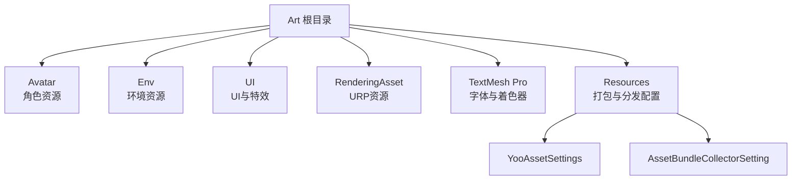
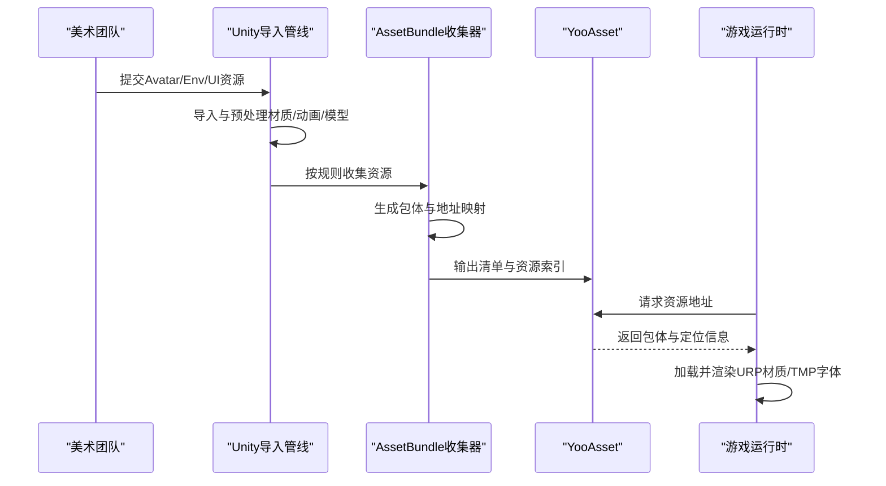
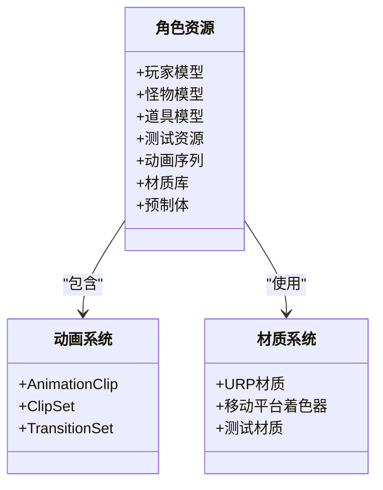
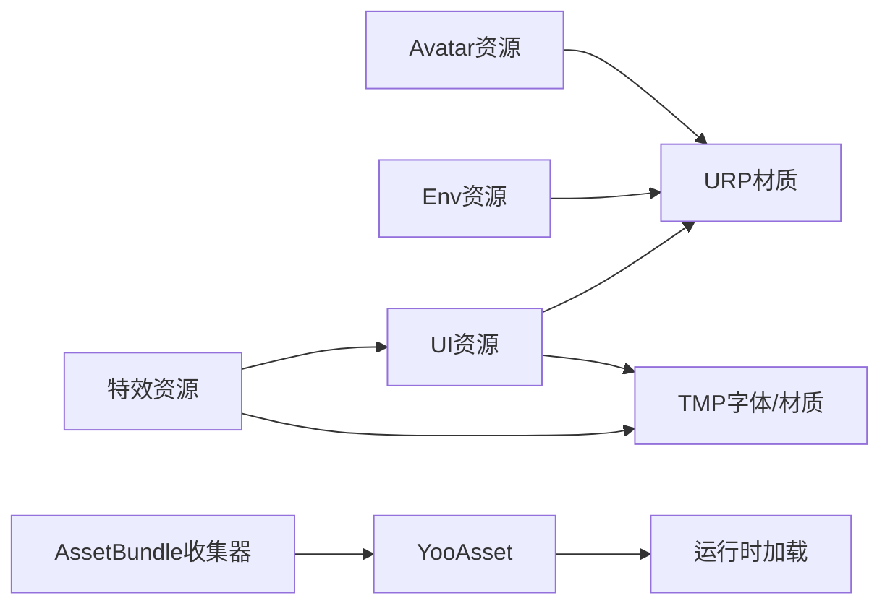

# 艺术资源管理

<cite>
**本文引用的文件**
- [Assets/Art/__info__.json](file://Assets/Art/__info__.json)
- [Assets/Art/Avatar/__info__.json](file://Assets/Art/Avatar/__info__.json)
- [Assets/Art/Env/__info__.json](file://Assets/Art/Env/__info__.json)
- [Assets/Resources/AssetBundleCollectorSetting.asset](file://Assets/Resources/AssetBundleCollectorSetting.asset)
- [Assets/Resources/YooAssetSettings.asset](file://Assets/Resources/YooAssetSettings.asset)
- [Assets/TextMesh Pro/Resources/TMP Settings.asset](file://Assets/TextMesh Pro/Resources/TMP Settings.asset)
- [Assets/TextMesh Pro/Resources/Fonts & Materials/LiberationSans SDF.asset](file://Assets/TextMesh Pro/Resources/Fonts & Materials/LiberationSans SDF.asset)
- [Assets/TextMesh Pro/Resources/Sprite Assets/EmojiOne.asset](file://Assets/TextMesh Pro/Resources/Sprite Assets/EmojiOne.asset)
- [Assets/TextMesh Pro/Shaders/TMP_SDF-Mobile.shader](file://Assets/TextMesh Pro/Shaders/TMP_SDF-Mobile.shader)
- [Assets/TextMesh Pro/Shaders/TMP_Bitmap-Mobile.shader](file://Assets/TextMesh Pro/Shaders/TMP_Bitmap-Mobile.shader)
- [Assets/TextMesh Pro/Shaders/TMP_SDF.shader](file://Assets/TextMesh Pro/Shaders/TMP_SDF.shader)
- [Assets/TextMesh Pro/Shaders/TMP_Bitmap.shader](file://Assets/TextMesh Pro/Shaders/TMP_Bitmap.shader)
- [Assets/Art/Avatar/KCCTester/Materials/White.mat](file://Assets/Art/Avatar/KCCTester/Materials/White.mat)
- [Assets/Art/Avatar/Player/GlazyRunner/Animations/Idle_Wait_A.anim](file://Assets/Art/Avatar/Player/GlazyRunner/Animations/Idle_Wait_A.anim)
- [Assets/Art/Avatar/Player/GlazyRunner/Animations/AnimatiomClipSet.asset](file://Assets/Art/Avatar/Player/GlazyRunner/Animations/AnimatiomClipSet.asset)
- [Assets/Art/Avatar/Player/GlazyRunner/Animations/AnimatiomClipTransitionSet.asset](file://Assets/Art/Avatar/Player/GlazyRunner/Animations/AnimatiomClipTransitionSet.asset)
- [Assets/Art/Avatar/Item/Prefabs/Avater_Test_Item.prefab](file://Assets/Art/Avatar/Item/Prefabs/Avater_Test_Item.prefab)
- [Assets/Art/Avatar/KCCTester/Prefabs/Avater_KCCTester.prefab](file://Assets/Art/Avatar/KCCTester/Prefabs/Avater_KCCTester.prefab)
- [Assets/Art/craftpix-net-424234-free-slime-sprite-sheets-pixel-art/Blue_Slime/...](file://Assets/Art/craftpix-net-424234-free-slime-sprite-sheets-pixel-art/Blue_Slime/)
- [Assets/Art/craftpix-net-424234-free-slime-sprite-sheets-pixel-art/Red_Slime/...](file://Assets/Art/craftpix-net-424234-free-slime-spritesheet-pixel-art/Red_Slime/)
- [Assets/Art/craftpix-net-424234-free-slime-sprite-sheets-pixel-art/Green_Slime/...](file://Assets/Art/craftpix-net-424234-free-slime-sprite-sheets-pixel-art/Green_Slime/)
- [Assets/Art/craftpix-net-424234-free-slime-sprite-sheets-pixel-art/PSD/...](file://Assets/Art/craftpix-net-424234-free-slime-sprite-sheets-pixel-art/PSD/)
- [Assets/Art/craftpix-net-424234-free-slime-sprite-sheets-pixel-art/Font.txt](file://Assets/Art/craftpix-net-424234-free-slime-sprite-sheets-pixel-art/Font.txt)
- [Assets/Art/craftpix-net-424234-free-slime-sprite-sheets-pixel-art/COUPON.png](file://Assets/Art/craftpix-net-424234-free-slime-sprite-sheets-pixel-art/COUPON.png)
- [Assets/Art/craftpix-net-424234-free-slime-sprite-sheets-pixel-art/Free Assets Craftpix!.url](file://Assets/Art/craftpix-net-424234-free-slime-sprite-sheets-pixel-art/Free Assets Craftpix!.url)
- [Assets/Art/craftpix-net-424234-free-slime-sprite-sheets-pixel-art/Licens.txt](file://Assets/Art/craftpix-net-424234-free-slime-sprite-sheets-pixel-art/Licens.txt)
- [Assets/Art/Env/TestGround/...](file://Assets/Art/Env/TestGround/)
- [Assets/Art/Env/xinshouguan/...](file://Assets/Art/Env/xinshouguan/)
- [Assets/Art/Env/GridBox/...](file://Assets/Art/Env/GridBox/)
- [Assets/Art/UI/slimeEffect主界面/...](file://Assets/Art/UI/slimeEffect主界面/)
- [Assets/Art/UI/slimeEffect加载/...](file://Assets/Art/UI/slimeEffect加载/)
- [Assets/Art/UI/slimeEffect游戏内/...](file://Assets/Art/UI/slimeEffect游戏内/)
- [Assets/Art/UI/slimeEffect关卡选择/...](file://Assets/Art/UI/slimeEffect关卡选择/)
- [Assets/Art/UI/slimeEffect三级弹窗_设置/...](file://Assets/Art/UI/slimeEffect三级弹窗_设置/)
- [Assets/Art/UI/slimeEffect三级弹窗_结算/...](file://Assets/Art/UI/slimeEffect三级弹窗_结算/)
- [Assets/Art/UI/Prefabs/...](file://Assets/Art/UI/Prefabs/)
- [Assets/Art/UI/每个页面字体通用设置.png](file://Assets/Art/UI/每个页面字体通用设置.png)
- [Assets/Art/RenderingAsset/Default_URP_Asset.asset](file://Assets/Art/RenderingAsset/Default_URP_Asset.asset)
- [Assets/Art/RenderingAsset/Default_URP_Asset_Renderer.asset](file://Assets/Art/RenderingAsset/Default_URP_Asset_Renderer.asset)
- [Assets/UniversalRenderPipelineGlobalSettings.asset](file://Assets/UniversalRenderPipelineGlobalSettings.asset)
- [Assets/Scenes/GameEntry.unity](file://Assets/Scenes/GameEntry.unity)
- [Assets/Scenes/UI.unity](file://Assets/Scenes/UI.unity)
- [Assets/Scenes/Empty.unity](file://Assets/Scenes/Empty.unity)
- [Assets/Scenes/learnPlugin.unity](file://Assets/Scenes/learnPlugin.unity)
- [Assets/Scenes/3CsTest/KCC.unity](file://Assets/Scenes/3CsTest/KCC.unity)
</cite>

## 目录
1. [引言](#引言)
2. [项目结构](#项目结构)
3. [核心组件](#核心组件)
4. [架构总览](#架构总览)
5. [详细组件分析](#详细组件分析)
6. [依赖关系分析](#依赖关系分析)
7. [性能考虑](#性能考虑)
8. [故障排查指南](#故障排查指南)
9. [结论](#结论)
10. [附录](#附录)

## 引言
本文件面向ProjectR项目的艺术资源管理工作，系统化梳理美术资源的分类、组织与管理策略，覆盖角色（Avatar）、环境（Env）、UI与特效资源的制作规范与导入流程；明确材质、纹理、动画与模型的优化标准与性能考量；给出TextMesh Pro的使用方法、字体与文本渲染优化建议；总结资源版本控制、命名规范与文件组织的最佳实践；并提供资源打包、压缩与平台适配的技术指导，以及资源质量检查、性能测试与兼容性验证的方法。

## 项目结构
项目采用“按功能域分层+按资源类型分组”的组织方式：
- 艺术资源根目录：Assets/Art
  - 角色资源：Avatar（含Item、Player、Slime、SlimeBoss、Trap、Wolf等）
  - 环境资源：Env（含GridBox、TestGround、xinshouguan等）
  - UI与特效：UI（含多套slimeEffect系列）及大量预制体与素材
  - 渲染资产：RenderingAsset（URP资源）
- 资源打包与分发：Resources下包含YooAsset与AssetBundle收集器配置
- 文本渲染：TextMesh Pro（TMP）资源与着色器
- 场景：Scenes中包含多个入口与测试场景

图表来源
- [Assets/Art/__info__.json:1-3](file://Assets/Art/__info__.json#L1-L3)
- [Assets/Art/Avatar/__info__.json:1-3](file://Assets/Art/Avatar/__info__.json#L1-L3)
- [Assets/Art/Env/__info__.json:1-3](file://Assets/Art/Env/__info__.json#L1-L3)
- [Assets/Resources/AssetBundleCollectorSetting.asset:18-62](file://Assets/Resources/AssetBundleCollectorSetting.asset#L18-L62)
- [Assets/Resources/YooAssetSettings.asset:15-17](file://Assets/Resources/YooAssetSettings.asset#L15-L17)
- [Assets/TextMesh Pro/Resources/TMP Settings.asset:24-46](file://Assets/TextMesh Pro/Resources/TMP Settings.asset#L24-L46)
- [Assets/Art/RenderingAsset/Default_URP_Asset.asset](file://Assets/Art/RenderingAsset/Default_URP_Asset.asset)

章节来源
- [Assets/Art/__info__.json:1-3](file://Assets/Art/__info__.json#L1-L3)
- [Assets/Art/Avatar/__info__.json:1-3](file://Assets/Art/Avatar/__info__.json#L1-L3)
- [Assets/Art/Env/__info__.json:1-3](file://Assets/Art/Env/__info__.json#L1-L3)

## 核心组件
- 资源分组与打包
  - 使用AssetBundle收集器对Avatar、Env、UI与DevResource进行分组与打包规则配置，支持按文件名、目录层级与过滤规则生成包体与地址映射。
  - YooAsset设置定义清单文件名与默认资源目录名，便于运行时资源加载与热更新管理。
- 渲染管线与材质
  - URP全局设置与URP资源资产用于统一渲染参数；角色与测试资源中包含基础材质示例。
- 文本渲染（TMP）
  - TMP设置集中管理默认字体、字号、行高、回退资源与样式表路径；着色器包含SDF与位图两类移动端与桌面端适配方案。
- 场景与入口
  - 多个场景用于不同阶段的开发与测试，包括游戏主入口、UI场景与插件学习场景等。

章节来源
- [Assets/Resources/AssetBundleCollectorSetting.asset:18-62](file://Assets/Resources/AssetBundleCollectorSetting.asset#L18-L62)
- [Assets/Resources/YooAssetSettings.asset:15-17](file://Assets/Resources/YooAssetSettings.asset#L15-L17)
- [Assets/Art/RenderingAsset/Default_URP_Asset.asset](file://Assets/Art/RenderingAsset/Default_URP_Asset.asset)
- [Assets/UniversalRenderPipelineGlobalSettings.asset](file://Assets/UniversalRenderPipelineGlobalSettings.asset)
- [Assets/TextMesh Pro/Resources/TMP Settings.asset:24-46](file://Assets/TextMesh Pro/Resources/TMP Settings.asset#L24-L46)

## 架构总览
资源从美术产出到运行时加载的整体流程如下：
- 美术资源入库：按Avatar/Env/UI分类存放，遵循命名与目录规范
- 导入与预处理：Unity自动导入或通过脚本工具批量处理（如模型导入工具）
- 打包与分发：AssetBundle收集器根据规则生成包体，YooAsset负责清单与地址映射
- 运行时加载：根据地址或包名动态加载资源，结合URP材质与TMP字体完成最终渲染

图表来源
- [Assets/Resources/AssetBundleCollectorSetting.asset:26-62](file://Assets/Resources/AssetBundleCollectorSetting.asset#L26-L62)
- [Assets/Resources/YooAssetSettings.asset:15-17](file://Assets/Resources/YooAssetSettings.asset#L15-L17)
- [Assets/Art/RenderingAsset/Default_URP_Asset.asset](file://Assets/Art/RenderingAsset/Default_URP_Asset.asset)
- [Assets/TextMesh Pro/Resources/TMP Settings.asset:24-46](file://Assets/TextMesh Pro/Resources/TMP Settings.asset#L24-L46)

## 详细组件分析

### 角色资源（Avatar）管理
- 分类与组织
  - 包含Player、Item、Slime、SlimeBoss、Trap、Wolf等子目录，便于按角色与物品维度管理
  - 支持测试与演示用途的KCCTester，包含材质与预制体
- 制作规范与导入流程
  - 模型与动画：统一命名约定，使用AnimationClip与ClipSet/TransitionSet组织动作序列
  - 材质：使用URP兼容材质，确保在不同平台一致表现
  - 预制体：以角色或物品命名，避免重复与歧义
- 典型文件路径
  - 动画：Assets/Art/Avatar/Player/GlazyRunner/Animations/
  - 材质：Assets/Art/Avatar/KCCTester/Materials/
  - 预制体：Assets/Art/Avatar/Item/Prefabs/、Assets/Art/Avatar/KCCTester/Prefabs/

图表来源
- [Assets/Art/Avatar/Player/GlazyRunner/Animations/Idle_Wait_A.anim](file://Assets/Art/Avatar/Player/GlazyRunner/Animations/Idle_Wait_A.anim)
- [Assets/Art/Avatar/Player/GlazyRunner/Animations/AnimatiomClipSet.asset](file://Assets/Art/Avatar/Player/GlazyRunner/Animations/AnimatiomClipSet.asset)
- [Assets/Art/Avatar/Player/GlazyRunner/Animations/AnimatiomClipTransitionSet.asset](file://Assets/Art/Avatar/Player/GlazyRunner/Animations/AnimatiomClipTransitionSet.asset)
- [Assets/Art/Avatar/KCCTester/Materials/White.mat](file://Assets/Art/Avatar/KCCTester/Materials/White.mat)

章节来源
- [Assets/Art/Avatar/Player/GlazyRunner/Animations/Idle_Wait_A.anim](file://Assets/Art/Avatar/Player/GlazyRunner/Animations/Idle_Wait_A.anim)
- [Assets/Art/Avatar/Player/GlazyRunner/Animations/AnimatiomClipSet.asset](file://Assets/Art/Avatar/Player/GlazyRunner/Animations/AnimatiomClipSet.asset)
- [Assets/Art/Avatar/Player/GlazyRunner/Animations/AnimatiomClipTransitionSet.asset](file://Assets/Art/Avatar/Player/GlazyRunner/Animations/AnimatiomClipTransitionSet.asset)
- [Assets/Art/Avatar/KCCTester/Materials/White.mat](file://Assets/Art/Avatar/KCCTester/Materials/White.mat)
- [Assets/Art/Avatar/Item/Prefabs/Avater_Test_Item.prefab](file://Assets/Art/Avatar/Item/Prefabs/Avater_Test_Item.prefab)
- [Assets/Art/Avatar/KCCTester/Prefabs/Avater_KCCTester.prefab](file://Assets/Art/Avatar/KCCTester/Prefabs/Avater_KCCTester.prefab)

### 环境资源（Env）管理
- 分类与组织
  - 包含GridBox、TestGround、xinshouguan等，便于场景搭建与测试
- 制作规范与导入流程
  - 地形与网格：统一网格尺寸与贴图规格，减少UV拉伸
  - 材质：按区域划分材质球，避免过度实例化
  - 预制体：场景元素尽量使用预制体，便于复用与替换
- 典型文件路径
  - 测试地面：Assets/Art/Env/TestGround/
  - 新手关卡：Assets/Art/Env/xinshouguan/
  - 网格箱：Assets/Art/Env/GridBox/

章节来源
- [Assets/Art/Env/TestGround/...](file://Assets/Art/Env/TestGround/)
- [Assets/Art/Env/xinshouguan/...](file://Assets/Art/Env/xinshouguan/)
- [Assets/Art/Env/GridBox/...](file://Assets/Art/Env/GridBox/)

### UI与特效资源（UI）管理
- 分类与组织
  - 多套slimeEffect系列（主界面、加载、游戏内、关卡选择、三级弹窗_设置/结算），每套包含若干帧动画与UI元素
  - UI预制体集中于Assets/Art/UI/Prefabs/
  - 字体通用设置图片Assets/Art/UI/每个页面字体通用设置.png
- 制作规范与导入流程
  - 帧动画：统一帧率与分辨率，避免超大纹理
  - UI元素：按页面维度组织，命名清晰，避免同名冲突
  - 字体：使用TMP字体与材质，确保多语言与表情符号支持
- 典型文件路径
  - 主界面特效：Assets/Art/UI/slimeEffect主界面/
  - 加载特效：Assets/Art/UI/slimeEffect加载/
  - 游戏内特效：Assets/Art/UI/slimeEffect游戏内/
  - 关卡选择特效：Assets/Art/UI/slimeEffect关卡选择/
  - 三级弹窗特效：Assets/Art/UI/slimeEffect三级弹窗_设置/、Assets/Art/UI/slimeEffect三级弹窗_结算/
  - 预制体：Assets/Art/UI/Prefabs/
  - 字体设置：Assets/Art/UI/每个页面字体通用设置.png

章节来源
- [Assets/Art/UI/slimeEffect主界面/...](file://Assets/Art/UI/slimeEffect主界面/)
- [Assets/Art/UI/slimeEffect加载/...](file://Assets/Art/UI/slimeEffect加载/)
- [Assets/Art/UI/slimeEffect游戏内/...](file://Assets/Art/UI/slimeEffect游戏内/)
- [Assets/Art/UI/slimeEffect关卡选择/...](file://Assets/Art/UI/slimeEffect关卡选择/)
- [Assets/Art/UI/slimeEffect三级弹窗_设置/...](file://Assets/Art/UI/slimeEffect三级弹窗_设置/)
- [Assets/Art/UI/slimeEffect三级弹窗_结算/...](file://Assets/Art/UI/slimeEffect三级弹窗_结算/)
- [Assets/Art/UI/Prefabs/...](file://Assets/Art/UI/Prefabs/)
- [Assets/Art/UI/每个页面字体通用设置.png](file://Assets/Art/UI/每个页面字体通用设置.png)

### 特效与素材（Craftpix）管理
- 来源与内容
  - craftpix-net-424234-free-slime-sprite-sheets-pixel-art 包含蓝/红/绿史莱姆精灵图集与PSD源文件
  - 字体说明与许可证文件，便于合规使用
- 制作规范与导入流程
  - 图集：统一像素风格，保持图集尺寸为2的幂次方，避免浪费
  - 源文件：保留PSD以便后续修改与扩展
  - 字体：遵循许可协议，仅在项目内使用
- 典型文件路径
  - 蓝史莱姆：Assets/Art/craftpix-net-424234-free-slime-sprite-sheets-pixel-art/Blue_Slime/
  - 红史莱姆：Assets/Art/craftpix-net-424234-free-slime-sprite-sheets-pixel-art/Red_Slime/
  - 绿史莱姆：Assets/Art/craftpix-net-424234-free-slime-sprite-sheets-pixel-art/Green_Slime/
  - PSD源文件：Assets/Art/craftpix-net-424234-free-slime-sprite-sheets-pixel-art/PSD/
  - 字体说明：Assets/Art/craftpix-net-424234-free-slime-sprite-sheets-pixel-art/Font.txt
  - 许可证：Assets/Art/craftpix-net-424234-free-slime-sprite-sheets-pixel-art/Licens.txt
  - 免费资源链接：Assets/Art/craftpix-net-424234-free-slime-sprite-sheets-pixel-art/Free Assets Craftpix!.url
  - 优惠券素材：Assets/Art/craftpix-net-424234-free-slime-sprite-sheets-pixel-art/COUPON.png

章节来源
- [Assets/Art/craftpix-net-424234-free-slime-sprite-sheets-pixel-art/Blue_Slime/...](file://Assets/Art/craftpix-net-424234-free-slime-sprite-sheets-pixel-art/Blue_Slime/)
- [Assets/Art/craftpix-net-424234-free-slime-sprite-sheets-pixel-art/Red_Slime/...](file://Assets/Art/craftpix-net-424234-free-slime-sprite-sheets-pixel-art/Red_Slime/)
- [Assets/Art/craftpix-net-424234-free-slime-sprite-sheets-pixel-art/Green_Slime/...](file://Assets/Art/craftpix-net-424234-free-slime-sprite-sheets-pixel-art/Green_Slime/)
- [Assets/Art/craftpix-net-424234-free-slime-sprite-sheets-pixel-art/PSD/...](file://Assets/Art/craftpix-net-424234-free-slime-sprite-sheets-pixel-art/PSD/)
- [Assets/Art/craftpix-net-424234-free-slime-sprite-sheets-pixel-art/Font.txt](file://Assets/Art/craftpix-net-424234-free-slime-sprite-sheets-pixel-art/Font.txt)
- [Assets/Art/craftpix-net-424234-free-slime-sprite-sheets-pixel-art/Licens.txt](file://Assets/Art/craftpix-net-424234-free-slime-sprite-sheets-pixel-art/Licens.txt)
- [Assets/Art/craftpix-net-424234-free-slime-sprite-sheets-pixel-art/Free Assets Craftpix!.url](file://Assets/Art/craftpix-net-424234-free-slime-sprite-sheets-pixel-art/Free Assets Craftpix!.url)
- [Assets/Art/craftpix-net-424234-free-slime-sprite-sheets-pixel-art/COUPON.png](file://Assets/Art/craftpix-net-424234-free-slime-sprite-sheets-pixel-art/COUPON.png)

### 材质、纹理、动画与模型优化
- 材质
  - 使用URP材质，确保在移动与桌面端一致表现；测试材质用于验证管线兼容性
- 纹理
  - 统一尺寸与格式，优先使用压缩纹理；避免过大的单张纹理
- 动画
  - 合理拆分动作序列，使用ClipSet/TransitionSet组织，降低切换开销
- 模型
  - 控制面数与UV密度，避免冗余顶点与法线；使用合适的LOD策略

章节来源
- [Assets/Art/Avatar/KCCTester/Materials/White.mat](file://Assets/Art/Avatar/KCCTester/Materials/White.mat)
- [Assets/Art/Avatar/Player/GlazyRunner/Animations/AnimatiomClipSet.asset](file://Assets/Art/Avatar/Player/GlazyRunner/Animations/AnimatiomClipSet.asset)
- [Assets/Art/Avatar/Player/GlazyRunner/Animations/AnimatiomClipTransitionSet.asset](file://Assets/Art/Avatar/Player/GlazyRunner/Animations/AnimatiomClipTransitionSet.asset)

### TextMesh Pro使用与字体管理
- 默认设置
  - 默认字体、字号、行高、回退资源与样式表路径在TMP设置中集中配置
  - 支持表情符号与现代韩语文本断行规则
- 字体与材质
  - LiberationSans SDF作为默认字体资源，适用于大多数场景
  - EmojiOne表情包资源可用于多语言与特殊字符显示
- 着色器
  - 提供SDF与位图两类着色器，分别针对矢量与位图渲染路径，移动端与桌面端可按需选择
- 使用建议
  - UI文本统一使用TMP，避免使用非TMP字体导致的渲染不一致
  - 对长文本启用自动换行与字距调整，提升可读性

章节来源
- [Assets/TextMesh Pro/Resources/TMP Settings.asset:15-46](file://Assets/TextMesh Pro/Resources/TMP Settings.asset#L15-L46)
- [Assets/TextMesh Pro/Resources/Fonts & Materials/LiberationSans SDF.asset](file://Assets/TextMesh Pro/Resources/Fonts & Materials/LiberationSans SDF.asset)
- [Assets/TextMesh Pro/Resources/Sprite Assets/EmojiOne.asset](file://Assets/TextMesh Pro/Resources/Sprite Assets/EmojiOne.asset)
- [Assets/TextMesh Pro/Shaders/TMP_SDF-Mobile.shader](file://Assets/TextMesh Pro/Shaders/TMP_SDF-Mobile.shader)
- [Assets/TextMesh Pro/Shaders/TMP_Bitmap-Mobile.shader](file://Assets/TextMesh Pro/Shaders/TMP_Bitmap-Mobile.shader)
- [Assets/TextMesh Pro/Shaders/TMP_SDF.shader](file://Assets/TextMesh Pro/Shaders/TMP_SDF.shader)
- [Assets/TextMesh Pro/Shaders/TMP_Bitmap.shader](file://Assets/TextMesh Pro/Shaders/TMP_Bitmap.shader)

### 资源打包、压缩与平台适配
- 打包策略
  - Avatar/Env/UI/DevResource四组资源分别收集，支持按文件名与目录层级打包
  - 自动收集着色器，保证渲染资源完整性
- 平台适配
  - 移动端优先使用SDF与移动版着色器，降低带宽与内存占用
  - 桌面端可使用更高分辨率与更丰富的材质特性
- 压缩与优化
  - 纹理压缩与尺寸控制，避免超大资源；动画帧率与数量平衡
  - 使用YooAsset清单与地址映射，实现按需加载与热更新

章节来源
- [Assets/Resources/AssetBundleCollectorSetting.asset:26-62](file://Assets/Resources/AssetBundleCollectorSetting.asset#L26-L62)
- [Assets/Resources/YooAssetSettings.asset:15-17](file://Assets/Resources/YooAssetSettings.asset#L15-L17)
- [Assets/TextMesh Pro/Shaders/TMP_SDF-Mobile.shader](file://Assets/TextMesh Pro/Shaders/TMP_SDF-Mobile.shader)
- [Assets/TextMesh Pro/Shaders/TMP_Bitmap-Mobile.shader](file://Assets/TextMesh Pro/Shaders/TMP_Bitmap-Mobile.shader)

### 资源质量检查、性能测试与兼容性验证
- 质量检查
  - 纹理分辨率与格式一致性检查；动画帧率与序列完整性检查；模型面数与UV合理性检查
- 性能测试
  - 在目标设备上进行帧率、内存与GPU占用测试；关注UI文本渲染与特效帧率
- 兼容性验证
  - 在不同平台（移动/桌面）验证渲染一致性；TMP字体与表情符号显示一致性

（本节为通用指导，无需特定文件引用）

## 依赖关系分析
- 资源依赖
  - Avatar/Env/UI资源依赖URP材质与TMP字体；特效依赖对应UI包
- 打包依赖
  - AssetBundle收集器依赖资源路径与过滤规则；YooAsset依赖清单与地址映射
- 渲染依赖
  - URP全局设置与URP资源资产影响所有材质与着色器表现

图表来源
- [Assets/Resources/AssetBundleCollectorSetting.asset:26-62](file://Assets/Resources/AssetBundleCollectorSetting.asset#L26-L62)
- [Assets/Resources/YooAssetSettings.asset:15-17](file://Assets/Resources/YooAssetSettings.asset#L15-L17)
- [Assets/Art/RenderingAsset/Default_URP_Asset.asset](file://Assets/Art/RenderingAsset/Default_URP_Asset.asset)
- [Assets/TextMesh Pro/Resources/TMP Settings.asset:24-46](file://Assets/TextMesh Pro/Resources/TMP Settings.asset#L24-L46)

章节来源
- [Assets/Resources/AssetBundleCollectorSetting.asset:26-62](file://Assets/Resources/AssetBundleCollectorSetting.asset#L26-L62)
- [Assets/Resources/YooAssetSettings.asset:15-17](file://Assets/Resources/YooAssetSettings.asset#L15-L17)
- [Assets/Art/RenderingAsset/Default_URP_Asset.asset](file://Assets/Art/RenderingAsset/Default_URP_Asset.asset)
- [Assets/TextMesh Pro/Resources/TMP Settings.asset:24-46](file://Assets/TextMesh Pro/Resources/TMP Settings.asset#L24-L46)

## 性能考虑
- 纹理与内存
  - 控制纹理尺寸与格式，优先使用压缩纹理；避免同时加载过多大纹理
- 动画与CPU/GPU
  - 合理拆分动画序列，减少切换与重叠；使用合适的动画采样频率
- 渲染与管线
  - URP材质与着色器在不同平台的差异，优先使用移动优化方案
- 文本渲染
  - 使用TMP字体与SDF着色器，避免位图字体带来的额外内存压力

（本节为通用指导，无需特定文件引用）

## 故障排查指南
- 资源加载失败
  - 检查AssetBundle收集器配置与包体生成；确认YooAsset清单与地址映射正确
- 渲染异常
  - 检查URP全局设置与材质兼容性；确认着色器与平台匹配
- 文本显示问题
  - 检查TMP设置中的默认字体与回退资源；确认表情符号资源可用

章节来源
- [Assets/Resources/AssetBundleCollectorSetting.asset:26-62](file://Assets/Resources/AssetBundleCollectorSetting.asset#L26-L62)
- [Assets/Resources/YooAssetSettings.asset:15-17](file://Assets/Resources/YooAssetSettings.asset#L15-L17)
- [Assets/TextMesh Pro/Resources/TMP Settings.asset:24-46](file://Assets/TextMesh Pro/Resources/TMP Settings.asset#L24-L46)

## 结论
本文件基于现有仓库结构与配置，给出了ProjectR项目艺术资源的分类、组织与管理策略，并明确了角色、环境、UI与特效资源的制作规范与导入流程，以及材质、纹理、动画与模型的优化标准与性能考量。同时提供了TextMesh Pro的使用方法、字体管理与文本渲染优化建议，以及资源打包、压缩与平台适配的技术指导和质量检查、性能测试与兼容性验证的方法。建议在后续迭代中持续完善命名规范与版本控制流程，确保资源管理的长期可维护性与团队协作效率。

## 附录
- 场景与入口
  - 游戏主入口：Assets/Scenes/GameEntry.unity
  - UI场景：Assets/Scenes/UI.unity
  - 空场景：Assets/Scenes/Empty.unity
  - 插件学习场景：Assets/Scenes/learnPlugin.unity
  - KCC测试场景：Assets/Scenes/3CsTest/KCC.unity

章节来源
- [Assets/Scenes/GameEntry.unity](file://Assets/Scenes/GameEntry.unity)
- [Assets/Scenes/UI.unity](file://Assets/Scenes/UI.unity)
- [Assets/Scenes/Empty.unity](file://Assets/Scenes/Empty.unity)
- [Assets/Scenes/learnPlugin.unity](file://Assets/Scenes/learnPlugin.unity)
- [Assets/Scenes/3CsTest/KCC.unity](file://Assets/Scenes/3CsTest/KCC.unity)