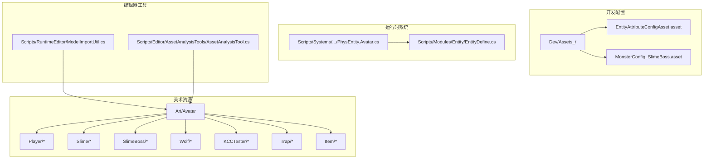
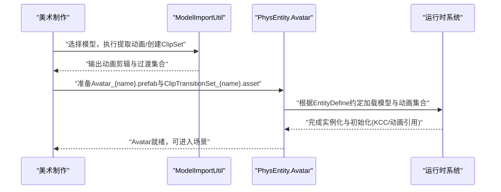
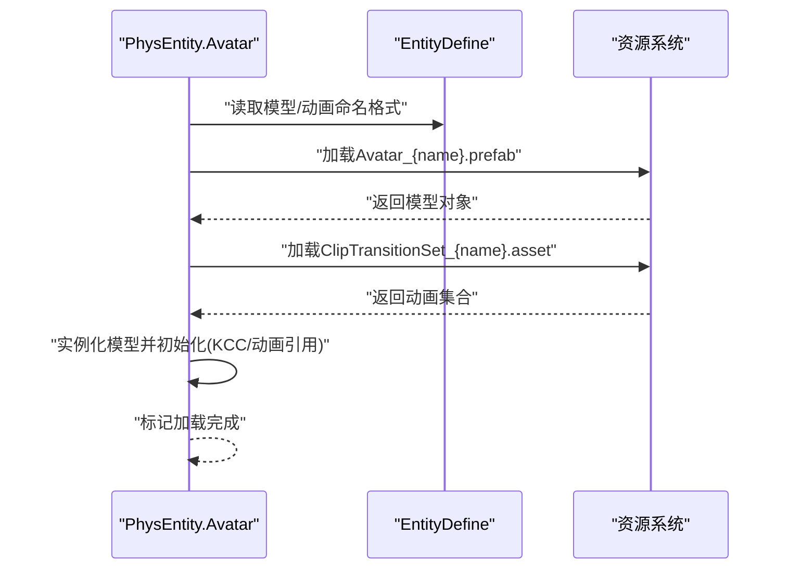
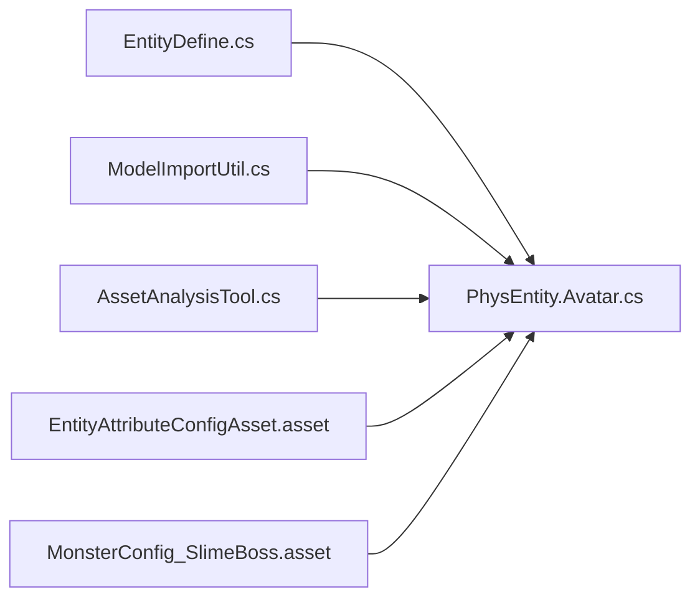

# 角色资源

<cite>
**本文引用的文件**
- [Assets/Art/Avatar/__info__.json](file://Assets/Art/Avatar/__info__.json)
- [Assets/Scripts/RuntimeEditor/ModelImportUtil.cs](file://Assets/Scripts/RuntimeEditor/ModelImportUtil.cs)
- [Assets/Dev/Assets_/EntityAttributeConfigAsset.asset](file://Assets/Dev/Assets_/EntityAttributeConfigAsset.asset)
- [Assets/Dev/Assets_/MonsterConfig_SlimeBoss.asset](file://Assets/Dev/Assets_/MonsterConfig_SlimeBoss.asset)
- [Assets/Scripts/Modules/Entity/EntityDefine.cs](file://Assets/Scripts/Modules/Entity/EntityDefine.cs)
- [Assets/Scripts/Systems/Implement/EntitySystem/PhysEntity/PhysEntity.Avatar.cs](file://Assets/Scripts/Systems/Implement/EntitySystem/PhysEntity/PhysEntity.Avatar.cs)
- [Assets/Scripts/Editor/AssetAnalysisTools/AssetAnalysisTool.cs](file://Assets/Scripts/Editor/AssetAnalysisTools/AssetAnalysisTool.cs)
- [Assets/Scripts/Game/Manager/TinyGameUtility.cs](file://Assets/Scripts/Game/Manager/TinyGameUtility.cs)
</cite>

## 目录
1. [简介](#简介)
2. [项目结构](#项目结构)
3. [核心组件](#核心组件)
4. [架构总览](#架构总览)
5. [详细组件分析](#详细组件分析)
6. [依赖关系分析](#依赖关系分析)
7. [性能考虑](#性能考虑)
8. [故障排查指南](#故障排查指南)
9. [结论](#结论)
10. [附录](#附录)

## 简介
本文件面向ProjectR项目中的“角色资源”主题，系统化梳理角色资源的分类与组织方式（玩家角色、怪物角色、NPC角色、道具物品），并给出模型、动画、材质与贴图的标准制作流程与规范；同时结合项目现有工具链与配置资产，解释KCC测试器、史莱姆、史莱姆Boss、狼等不同角色类型的资源特点与优化策略，并覆盖导入设置、骨骼绑定、动画序列与材质参数配置要点。最后提供质量检查标准、性能优化建议、跨平台适配方案以及版本管理、命名规范与批量处理工作流。

## 项目结构
ProjectR在美术资源层面采用按“类型+用途”的分层组织：角色资源主要位于美术资源根目录下的Avatar文件夹，其中按角色类型进一步细分（如Player、Slime、SlimeBoss、Wolf、KCCTester、Trap、Item等）。每个角色类型下通常包含模型、动画、材质与贴图等子资源。项目还提供了运行时与编辑器侧的资源加载与导入辅助工具，确保资源在导入阶段即满足运行时需求。

图表来源
- [Assets/Art/Avatar/__info__.json:1-3](file://Assets/Art/Avatar/__info__.json#L1-L3)
- [Assets/Scripts/Modules/Entity/EntityDefine.cs:1-64](file://Assets/Scripts/Modules/Entity/EntityDefine.cs#L1-L64)
- [Assets/Scripts/RuntimeEditor/ModelImportUtil.cs:1-179](file://Assets/Scripts/RuntimeEditor/ModelImportUtil.cs#L1-L179)
- [Assets/Scripts/Editor/AssetAnalysisTools/AssetAnalysisTool.cs:393-439](file://Assets/Scripts/Editor/AssetAnalysisTools/AssetAnalysisTool.cs#L393-L439)
- [Assets/Dev/Assets_/EntityAttributeConfigAsset.asset:1-31](file://Assets/Dev/Assets_/EntityAttributeConfigAsset.asset#L1-L31)
- [Assets/Dev/Assets_/MonsterConfig_SlimeBoss.asset:1-17](file://Assets/Dev/Assets_/MonsterConfig_SlimeBoss.asset#L1-L17)
- [Assets/Scripts/Systems/Implement/EntitySystem/PhysEntity/PhysEntity.Avatar.cs:70-232](file://Assets/Scripts/Systems/Implement/EntitySystem/PhysEntity/PhysEntity.Avatar.cs#L70-L232)

章节来源
- [Assets/Art/Avatar/__info__.json:1-3](file://Assets/Art/Avatar/__info__.json#L1-L3)
- [Assets/Scripts/Modules/Entity/EntityDefine.cs:1-64](file://Assets/Scripts/Modules/Entity/EntityDefine.cs#L1-L64)

## 核心组件
- 角色资源命名与格式规范
  - 模型命名前缀与格式：Avatar_{角色名}.prefab
  - 动画集合命名前缀与格式：ClipTransitionSet_{角色名}.asset
  - 运行时通过EntityDefine统一约定模型根节点名称与场景根节点分组标签，保证加载与层级一致性
- 配置资产
  - 实体属性配置：EntityAttributeConfigAsset.asset用于承载通用实体属性（如攻击、击退、眩晕等时间参数）
  - 怪物配置：MonsterConfig_SlimeBoss.asset用于定义怪物是否使用物理、血量等属性
- 导入与批处理工具
  - ModelImportUtil：提供从模型中提取动画剪辑、创建动画过渡集合等批量处理能力
  - AssetAnalysisTool：提供材质与资源依赖的分析与批量修改入口

章节来源
- [Assets/Scripts/Modules/Entity/EntityDefine.cs:1-64](file://Assets/Scripts/Modules/Entity/EntityDefine.cs#L1-L64)
- [Assets/Dev/Assets_/EntityAttributeConfigAsset.asset:1-31](file://Assets/Dev/Assets_/EntityAttributeConfigAsset.asset#L1-L31)
- [Assets/Dev/Assets_/MonsterConfig_SlimeBoss.asset:1-17](file://Assets/Dev/Assets_/MonsterConfig_SlimeBoss.asset#L1-L17)
- [Assets/Scripts/RuntimeEditor/ModelImportUtil.cs:1-179](file://Assets/Scripts/RuntimeEditor/ModelImportUtil.cs#L1-L179)
- [Assets/Scripts/Editor/AssetAnalysisTools/AssetAnalysisTool.cs:393-439](file://Assets/Scripts/Editor/AssetAnalysisTools/AssetAnalysisTool.cs#L393-L439)

## 架构总览
角色资源在项目中的生命周期可概括为：美术制作 → 导入与批处理 → 运行时加载与装配 → 渲染与动画驱动。EntityDefine定义了资源命名与层级约定，PhysEntity.Avatar负责运行时加载与初始化，ModelImportUtil与AssetAnalysisTool在编辑器侧提供导入与质量控制支持。

图表来源
- [Assets/Scripts/RuntimeEditor/ModelImportUtil.cs:13-118](file://Assets/Scripts/RuntimeEditor/ModelImportUtil.cs#L13-L118)
- [Assets/Scripts/Systems/Implement/EntitySystem/PhysEntity/PhysEntity.Avatar.cs:126-232](file://Assets/Scripts/Systems/Implement/EntitySystem/PhysEntity/PhysEntity.Avatar.cs#L126-L232)
- [Assets/Scripts/Modules/Entity/EntityDefine.cs:1-64](file://Assets/Scripts/Modules/Entity/EntityDefine.cs#L1-L64)

## 详细组件分析

### 角色资源分类与组织
- 分类体系
  - 玩家角色：Player
  - 怪物角色：Slime、SlimeBoss、Wolf
  - NPC角色：未在当前结构中发现独立NPC目录，通常可复用玩家或怪物资源
  - 道具物品：Item、Trap
- 组织结构
  - 每个角色类型下包含模型、动画、材质与贴图等子资源
  - 建议以“角色名/模型/动画/材质/贴图”等子目录组织，便于导入与批处理

章节来源
- [Assets/Art/Avatar/__info__.json:1-3](file://Assets/Art/Avatar/__info__.json#L1-L3)

### 标准制作流程与规范
- 模型与骨骼
  - 使用统一的骨骼命名与层级，确保动画与模型匹配
  - 模型导入时启用必要的法线与UV通道，避免运行时额外计算
- 动画
  - 使用ModelImportUtil提取动画剪辑，统一命名并生成动画过渡集合
  - 动画命名需与EntityDefine中约定的关键字一致（如跳跃、移动、攻击等状态机哈希）
- 材质与贴图
  - 使用AssetAnalysisTool进行材质依赖与参数一致性检查
  - 贴图遵循项目统一的分辨率与压缩格式规范（如移动端PVRTC/ETC2，桌面ASTC/BC）

章节来源
- [Assets/Scripts/RuntimeEditor/ModelImportUtil.cs:13-118](file://Assets/Scripts/RuntimeEditor/ModelImportUtil.cs#L13-L118)
- [Assets/Scripts/Editor/AssetAnalysisTools/AssetAnalysisTool.cs:393-439](file://Assets/Scripts/Editor/AssetAnalysisTools/AssetAnalysisTool.cs#L393-L439)
- [Assets/Scripts/Modules/Entity/EntityDefine.cs:44-63](file://Assets/Scripts/Modules/Entity/EntityDefine.cs#L44-L63)

### 不同类型角色的资源特点与优化策略
- KCC测试器
  - 作为交互与测试用途，优先保证模型与动画的可读性与调试友好性
  - 动画集合应覆盖基础移动与交互动作，便于快速验证
- 史莱姆
  - 体积较小，优先采用低面数与简化碰撞体
  - 动画帧率可适当降低，贴图分辨率下调一级
- 史莱姆Boss
  - 体量较大，模型细节与贴图质量提升，但需控制多边形数量与材质层数
  - 动画序列需覆盖特殊技能与受击反馈
- 狼
  - 行为复杂度较高，需完善奔跑、跳跃、攻击等完整动作序列
  - 材质与贴图在近景清晰度上优先保障

章节来源
- [Assets/Dev/Assets_/MonsterConfig_SlimeBoss.asset:1-17](file://Assets/Dev/Assets_/MonsterConfig_SlimeBoss.asset#L1-L17)

### 导入设置、骨骼绑定与动画序列
- 导入设置
  - 启用动画导入与骨骼信息读取，确保动画剪辑可被正确识别
  - 对于Sprite资源，使用合适的纹理类型与压缩格式
- 骨骼绑定
  - 骨骼层级与命名需与动画序列一致，避免运行时播放异常
- 动画序列
  - 使用ModelImportUtil批量导出动画剪辑，生成ClipSet以供状态机使用
  - 关键动作命名需与EntityDefine中的哈希值保持一致，避免运行时状态机不匹配

章节来源
- [Assets/Scripts/RuntimeEditor/ModelImportUtil.cs:13-118](file://Assets/Scripts/RuntimeEditor/ModelImportUtil.cs#L13-L118)
- [Assets/Scripts/Modules/Entity/EntityDefine.cs:44-63](file://Assets/Scripts/Modules/Entity/EntityDefine.cs#L44-L63)

### 材质参数配置
- 参数一致性
  - 使用AssetAnalysisTool对材质进行批量检查，确保参数与贴图配置一致
- 跨平台适配
  - 根据目标平台调整压缩格式与分辨率上限，减少内存占用
- 运行时优化
  - 减少材质变体数量，合并相似材质，降低DrawCall

章节来源
- [Assets/Scripts/Editor/AssetAnalysisTools/AssetAnalysisTool.cs:393-439](file://Assets/Scripts/Editor/AssetAnalysisTools/AssetAnalysisTool.cs#L393-L439)

### 运行时加载与装配
- 加载流程
  - PhysEntity.Avatar根据EntityDefine约定的命名格式加载Avatar与动画集合
  - 完成实例化后初始化模型集合、动画引用与KCC组件
- 错误处理
  - 若资源加载失败，系统会记录错误日志并中断后续初始化

图表来源
- [Assets/Scripts/Systems/Implement/EntitySystem/PhysEntity/PhysEntity.Avatar.cs:126-232](file://Assets/Scripts/Systems/Implement/EntitySystem/PhysEntity/PhysEntity.Avatar.cs#L126-L232)
- [Assets/Scripts/Modules/Entity/EntityDefine.cs:22-26](file://Assets/Scripts/Modules/Entity/EntityDefine.cs#L22-L26)

章节来源
- [Assets/Scripts/Systems/Implement/EntitySystem/PhysEntity/PhysEntity.Avatar.cs:70-232](file://Assets/Scripts/Systems/Implement/EntitySystem/PhysEntity/PhysEntity.Avatar.cs#L70-L232)
- [Assets/Scripts/Modules/Entity/EntityDefine.cs:1-64](file://Assets/Scripts/Modules/Entity/EntityDefine.cs#L1-L64)

### 资源质量检查与性能优化
- 质量检查
  - 使用AssetAnalysisTool进行材质依赖与资源引用检查，修复缺失或不一致项
  - 对动画剪辑进行命名与过渡集合校验，确保状态机可用
- 性能优化
  - 控制模型多边形数量与材质层数，优先使用平台推荐的压缩格式
  - 合理拆分动画序列，避免单Clip过大导致内存峰值
  - 利用批处理与共享材质减少DrawCall

章节来源
- [Assets/Scripts/Editor/AssetAnalysisTools/AssetAnalysisTool.cs:393-439](file://Assets/Scripts/Editor/AssetAnalysisTools/AssetAnalysisTool.cs#L393-L439)
- [Assets/Scripts/RuntimeEditor/ModelImportUtil.cs:13-118](file://Assets/Scripts/RuntimeEditor/ModelImportUtil.cs#L13-L118)

### 跨平台适配方案
- 平台差异
  - 移动端优先考虑带宽与内存限制，降低贴图分辨率与材质变体
  - 桌面端可适度提升细节，但仍需控制整体资源体积
- 工具支持
  - 通过AssetAnalysisTool与导入工具链实现平台差异化配置的批量应用

章节来源
- [Assets/Scripts/Editor/AssetAnalysisTools/AssetAnalysisTool.cs:393-439](file://Assets/Scripts/Editor/AssetAnalysisTools/AssetAnalysisTool.cs#L393-L439)

### 版本管理、命名规范与批量处理工作流
- 版本管理
  - 建议在美术资源目录中引入版本号与变更日志，配合Git进行追踪
- 命名规范
  - 模型：Avatar_{角色名}.prefab
  - 动画集合：ClipTransitionSet_{角色名}.asset
  - 动画剪辑：{角色名}_{动作名}.anim
- 批量处理
  - 使用ModelImportUtil一键提取动画与生成ClipSet，减少重复劳动
  - 使用AssetAnalysisTool进行材质与依赖的批量修正

章节来源
- [Assets/Scripts/Modules/Entity/EntityDefine.cs:22-26](file://Assets/Scripts/Modules/Entity/EntityDefine.cs#L22-L26)
- [Assets/Scripts/RuntimeEditor/ModelImportUtil.cs:13-118](file://Assets/Scripts/RuntimeEditor/ModelImportUtil.cs#L13-L118)
- [Assets/Scripts/Editor/AssetAnalysisTools/AssetAnalysisTool.cs:393-439](file://Assets/Scripts/Editor/AssetAnalysisTools/AssetAnalysisTool.cs#L393-L439)

## 依赖关系分析
- 运行时依赖
  - PhysEntity.Avatar依赖EntityDefine的命名与层级约定，确保资源加载与初始化的一致性
- 编辑器依赖
  - ModelImportUtil与AssetAnalysisTool依赖Unity编辑器API，提供导入与质量控制能力
- 配置依赖
  - 配置资产（EntityAttributeConfigAsset、MonsterConfig_SlimeBoss）为运行时逻辑提供参数依据

图表来源
- [Assets/Scripts/Modules/Entity/EntityDefine.cs:1-64](file://Assets/Scripts/Modules/Entity/EntityDefine.cs#L1-L64)
- [Assets/Scripts/Systems/Implement/EntitySystem/PhysEntity/PhysEntity.Avatar.cs:70-232](file://Assets/Scripts/Systems/Implement/EntitySystem/PhysEntity/PhysEntity.Avatar.cs#L70-L232)
- [Assets/Scripts/RuntimeEditor/ModelImportUtil.cs:1-179](file://Assets/Scripts/RuntimeEditor/ModelImportUtil.cs#L1-L179)
- [Assets/Scripts/Editor/AssetAnalysisTools/AssetAnalysisTool.cs:393-439](file://Assets/Scripts/Editor/AssetAnalysisTools/AssetAnalysisTool.cs#L393-L439)
- [Assets/Dev/Assets_/EntityAttributeConfigAsset.asset:1-31](file://Assets/Dev/Assets_/EntityAttributeConfigAsset.asset#L1-L31)
- [Assets/Dev/Assets_/MonsterConfig_SlimeBoss.asset:1-17](file://Assets/Dev/Assets_/MonsterConfig_SlimeBoss.asset#L1-L17)

章节来源
- [Assets/Scripts/Modules/Entity/EntityDefine.cs:1-64](file://Assets/Scripts/Modules/Entity/EntityDefine.cs#L1-L64)
- [Assets/Scripts/Systems/Implement/EntitySystem/PhysEntity/PhysEntity.Avatar.cs:70-232](file://Assets/Scripts/Systems/Implement/EntitySystem/PhysEntity/PhysEntity.Avatar.cs#L70-L232)
- [Assets/Scripts/RuntimeEditor/ModelImportUtil.cs:1-179](file://Assets/Scripts/RuntimeEditor/ModelImportUtil.cs#L1-L179)
- [Assets/Scripts/Editor/AssetAnalysisTools/AssetAnalysisTool.cs:393-439](file://Assets/Scripts/Editor/AssetAnalysisTools/AssetAnalysisTool.cs#L393-L439)
- [Assets/Dev/Assets_/EntityAttributeConfigAsset.asset:1-31](file://Assets/Dev/Assets_/EntityAttributeConfigAsset.asset#L1-L31)
- [Assets/Dev/Assets_/MonsterConfig_SlimeBoss.asset:1-17](file://Assets/Dev/Assets_/MonsterConfig_SlimeBoss.asset#L1-L17)

## 性能考虑
- 模型与动画
  - 控制多边形数量与骨骼层级，避免过高的顶点与权重计算
  - 合理拆分动画序列，减少单Clip的数据量
- 材质与贴图
  - 使用平台推荐的压缩格式，避免高分辨率贴图在低端设备上造成内存压力
  - 合并相似材质，减少材质切换与DrawCall
- 运行时装配
  - 通过EntityDefine统一命名与层级，减少运行时查找与拼接成本

## 故障排查指南
- 资源加载失败
  - 检查模型与动画集合的命名是否符合EntityDefine约定
  - 确认资源路径与导入设置正确，必要时重新导入
- 动画播放异常
  - 使用ModelImportUtil重新提取动画剪辑并生成ClipSet
  - 校验动画命名与状态机哈希是否一致
- 材质问题
  - 使用AssetAnalysisTool检查材质依赖与参数一致性，修复缺失贴图或参数不一致问题

章节来源
- [Assets/Scripts/Modules/Entity/EntityDefine.cs:22-26](file://Assets/Scripts/Modules/Entity/EntityDefine.cs#L22-L26)
- [Assets/Scripts/Systems/Implement/EntitySystem/PhysEntity/PhysEntity.Avatar.cs:126-232](file://Assets/Scripts/Systems/Implement/EntitySystem/PhysEntity/PhysEntity.Avatar.cs#L126-L232)
- [Assets/Scripts/RuntimeEditor/ModelImportUtil.cs:13-118](file://Assets/Scripts/RuntimeEditor/ModelImportUtil.cs#L13-L118)
- [Assets/Scripts/Editor/AssetAnalysisTools/AssetAnalysisTool.cs:393-439](file://Assets/Scripts/Editor/AssetAnalysisTools/AssetAnalysisTool.cs#L393-L439)

## 结论
ProjectR的角色资源体系以EntityDefine为命名与层级约定核心，辅以ModelImportUtil与AssetAnalysisTool在编辑器侧提供导入与质量控制能力，运行时由PhysEntity.Avatar完成资源加载与初始化。通过规范化的制作流程、严格的命名与批量处理工作流，以及针对不同角色类型的优化策略，可在保证表现力的同时兼顾性能与跨平台适配。

## 附录
- 相关实现参考路径
  - 命名与层级约定：[EntityDefine.cs:1-64](file://Assets/Scripts/Modules/Entity/EntityDefine.cs#L1-L64)
  - 运行时加载与初始化：[PhysEntity.Avatar.cs:70-232](file://Assets/Scripts/Systems/Implement/EntitySystem/PhysEntity/PhysEntity.Avatar.cs#L70-L232)
  - 动画提取与ClipSet生成：[ModelImportUtil.cs:13-118](file://Assets/Scripts/RuntimeEditor/ModelImportUtil.cs#L13-L118)
  - 材质分析与批量修复：[AssetAnalysisTool.cs:393-439](file://Assets/Scripts/Editor/AssetAnalysisTools/AssetAnalysisTool.cs#L393-L439)
  - 配置资产示例：[EntityAttributeConfigAsset.asset:1-31](file://Assets/Dev/Assets_/EntityAttributeConfigAsset.asset#L1-L31)、[MonsterConfig_SlimeBoss.asset:1-17](file://Assets/Dev/Assets_/MonsterConfig_SlimeBoss.asset#L1-L17)
  - 运行时动画加载参考：[TinyGameUtility.cs:113-143](file://Assets/Scripts/Game/Manager/TinyGameUtility.cs#L113-L143)