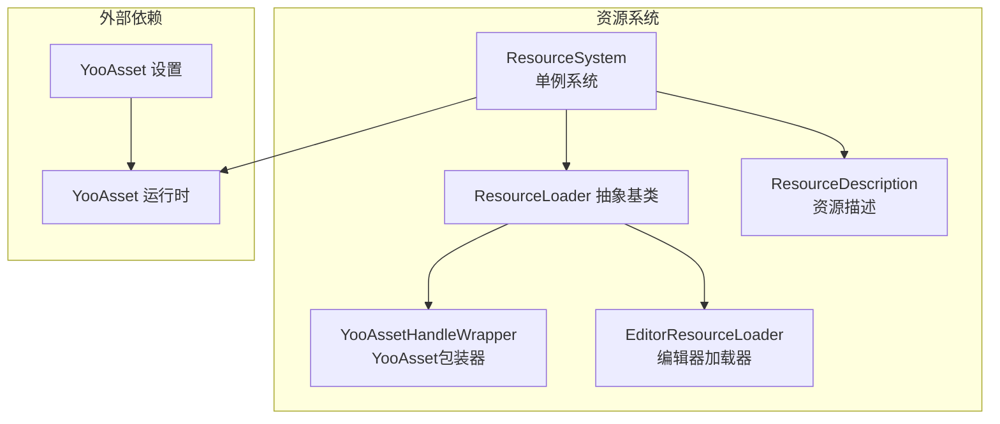
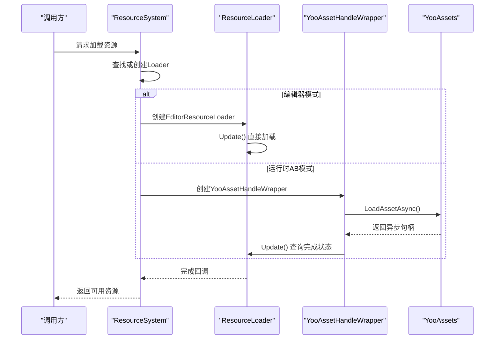
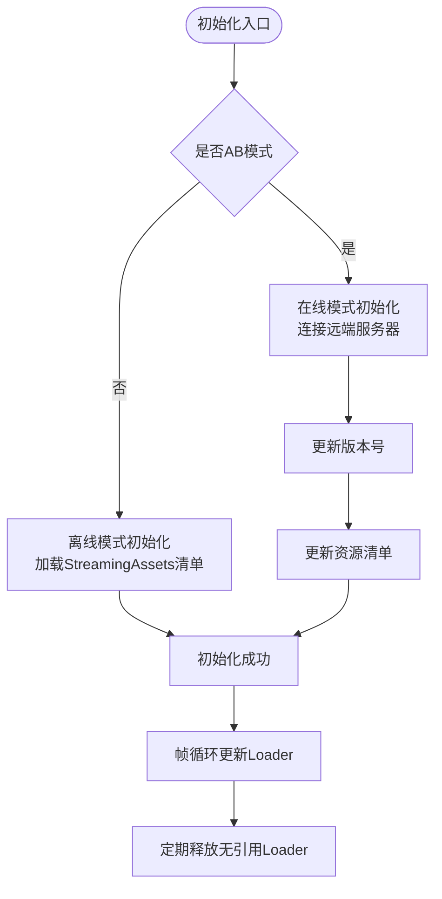
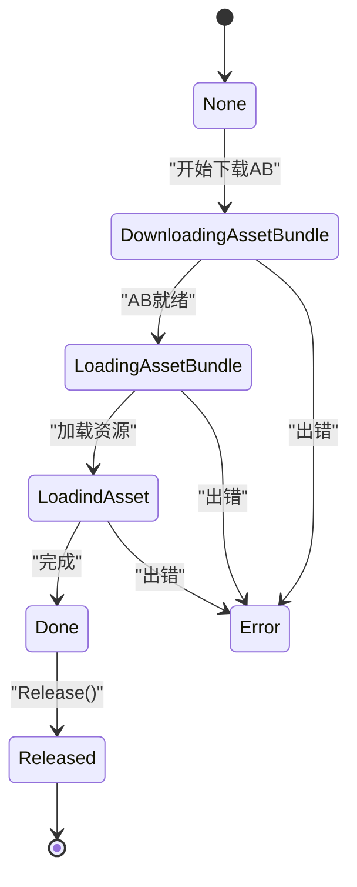
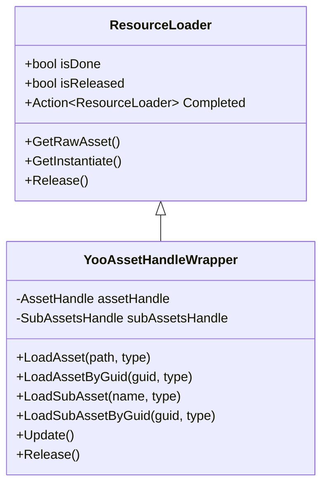
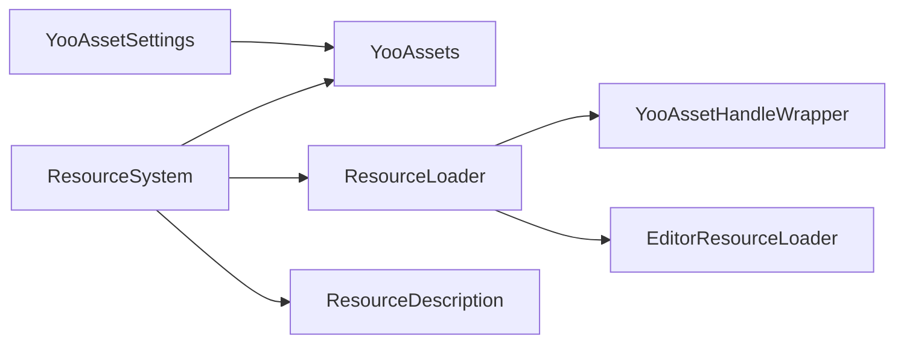

# 资源管理系统

<cite>
**本文档引用的文件**
- [ResourceSystem.cs](file://Assets/Scripts/Systems/Implement/ResourceSystem/ResourceSystem.cs)
- [ResourceSystem.Func.cs](file://Assets/Scripts/Systems/Implement/ResourceSystem/ResourceSystem.Func.cs)
- [ResourceSystem.Update.cs](file://Assets/Scripts/Systems/Implement/ResourceSystem/ResourceSystem.Update.cs)
- [YooAssetHandleWrapper.cs](file://Assets/Scripts/Systems/Implement/ResourceSystem/YooAssetHandleWrapper.cs)
- [ResourceLoader.cs](file://Assets/Scripts/Systems/Implement/ResourceSystem/ResourceLoader.cs)
- [EditorResourceLoader.cs](file://Assets/Scripts/Systems/Implement/ResourceSystem/EditorResourceLoader.cs)
- [ResourceDescription.cs](file://Assets/Scripts/Systems/Implement/ResourceSystem/ResourceDescription.cs)
- [ABLoadTest.cs](file://Assets/Dev/Lab/Scripts/ABLoadTest.cs)
- [YooAssetSettings.asset](file://Assets/Resources/YooAssetSettings.asset)
</cite>

## 目录
1. [简介](#简介)
2. [项目结构](#项目结构)
3. [核心组件](#核心组件)
4. [架构总览](#架构总览)
5. [详细组件分析](#详细组件分析)
6. [依赖关系分析](#依赖关系分析)
7. [性能考量](#性能考量)
8. [故障排查指南](#故障排查指南)
9. [结论](#结论)
10. [附录](#附录)

## 简介
本文件面向ProjectR项目的资源管理系统，系统基于YooAsset实现，覆盖资源加载、缓存、管理与卸载全流程。文档重点说明以下方面：
- 加载策略：同步/异步、编辑器模拟模式与运行时AB模式切换
- 缓存与管理：全局Loader字典、按名称与完整路径索引、更新队列与释放策略
- 卸载与内存管理：实例化对象跟踪、无引用自动释放、帧级清理
- 不同类型资源：纹理、模型、音频、配置文件等的统一加载接口
- 打包与热更新：清单与版本更新、远端服务器配置、回退策略
- 性能指标与优化：初始化耗时、更新耗时、内存占用控制
- 开发、测试与发布工作流：资源描述配置、构建与AB生成、运行时更新

## 项目结构
资源系统位于Scripts/Systems/Implement/ResourceSystem目录，围绕ResourceSystem单例展开，配合YooAsset进行AB包管理与加载。

**图表来源**
- [ResourceSystem.cs:14-485](file://Assets/Scripts/Systems/Implement/ResourceSystem/ResourceSystem.cs#L14-L485)
- [ResourceLoader.cs:19-108](file://Assets/Scripts/Systems/Implement/ResourceSystem/ResourceLoader.cs#L19-L108)
- [YooAssetHandleWrapper.cs:11-98](file://Assets/Scripts/Systems/Implement/ResourceSystem/YooAssetHandleWrapper.cs#L11-L98)
- [EditorResourceLoader.cs:11-41](file://Assets/Scripts/Systems/Implement/ResourceSystem/EditorResourceLoader.cs#L11-L41)
- [ResourceDescription.cs:12-78](file://Assets/Scripts/Systems/Implement/ResourceSystem/ResourceDescription.cs#L12-L78)
- [YooAssetSettings.asset:1-17](file://Assets/Resources/YooAssetSettings.asset#L1-L17)

**章节来源**
- [ResourceSystem.cs:14-485](file://Assets/Scripts/Systems/Implement/ResourceSystem/ResourceSystem.cs#L14-L485)
- [ResourceLoader.cs:19-108](file://Assets/Scripts/Systems/Implement/ResourceSystem/ResourceLoader.cs#L19-L108)

## 核心组件
- ResourceSystem：资源系统单例，负责包初始化、版本与清单更新、加载器生命周期管理、帧更新与释放。
- ResourceLoader：抽象加载器基类，定义状态机、完成回调、实例化与释放接口。
- YooAssetHandleWrapper：YooAsset加载器包装，支持按路径与GUID加载资源与子资源。
- EditorResourceLoader：编辑器模式下的资源加载器，直接从磁盘加载资源。
- ResourceDescription：资源描述配置，包含远端地址、渠道、平台与是否需要更新等字段。
- YooAssetSettings：YooAsset运行时设置，如清单文件名与默认Yoo文件夹名。

**章节来源**
- [ResourceSystem.cs:14-485](file://Assets/Scripts/Systems/Implement/ResourceSystem/ResourceSystem.cs#L14-L485)
- [ResourceLoader.cs:19-108](file://Assets/Scripts/Systems/Implement/ResourceSystem/ResourceLoader.cs#L19-L108)
- [YooAssetHandleWrapper.cs:11-98](file://Assets/Scripts/Systems/Implement/ResourceSystem/YooAssetHandleWrapper.cs#L11-L98)
- [EditorResourceLoader.cs:11-41](file://Assets/Scripts/Systems/Implement/ResourceSystem/EditorResourceLoader.cs#L11-L41)
- [ResourceDescription.cs:12-78](file://Assets/Scripts/Systems/Implement/ResourceSystem/ResourceDescription.cs#L12-L78)
- [YooAssetSettings.asset:1-17](file://Assets/Resources/YooAssetSettings.asset#L1-L17)

## 架构总览
系统采用“单例系统 + 加载器抽象 + 包管理”的分层架构。ResourceSystem作为入口，根据运行环境（编辑器/运行时）与AB模式选择不同加载路径；YooAssetHandleWrapper封装YooAsset的异步加载；EditorResourceLoader在编辑器非播放状态下直接加载资源；ResourceLoader统一管理状态与生命周期。

**图表来源**
- [ResourceSystem.Func.cs:125-164](file://Assets/Scripts/Systems/Implement/ResourceSystem/ResourceSystem.Func.cs#L125-L164)
- [YooAssetHandleWrapper.cs:21-71](file://Assets/Scripts/Systems/Implement/ResourceSystem/YooAssetHandleWrapper.cs#L21-L71)
- [EditorResourceLoader.cs:17-29](file://Assets/Scripts/Systems/Implement/ResourceSystem/EditorResourceLoader.cs#L17-L29)

## 详细组件分析

### ResourceSystem：系统入口与生命周期
- 初始化与包管理
  - 支持同步与异步两种初始化流程，依据InABMode决定使用离线模式或主机模式参数。
  - 在离线模式下可使用StreamingAssets中的模拟清单；在需要更新时连接远端服务器并配置回退地址。
- 版本与清单更新
  - 提供同步与异步更新版本号与清单的方法，并记录耗时。
- 加载器管理
  - 维护按完整路径与文件名的双索引字典，以及更新队列与所有Loader列表。
  - 帧更新中遍历更新队列，触发完成回调；定期清理无引用的Loader。
- 全局开关
  - InABMode用于控制是否启用AB模式，编辑器下可通过调试菜单切换。

**图表来源**
- [ResourceSystem.cs:146-309](file://Assets/Scripts/Systems/Implement/ResourceSystem/ResourceSystem.cs#L146-L309)
- [ResourceSystem.cs:408-445](file://Assets/Scripts/Systems/Implement/ResourceSystem/ResourceSystem.cs#L408-L445)

**章节来源**
- [ResourceSystem.cs:77-96](file://Assets/Scripts/Systems/Implement/ResourceSystem/ResourceSystem.cs#L77-L96)
- [ResourceSystem.cs:146-309](file://Assets/Scripts/Systems/Implement/ResourceSystem/ResourceSystem.cs#L146-L309)
- [ResourceSystem.cs:408-445](file://Assets/Scripts/Systems/Implement/ResourceSystem/ResourceSystem.cs#L408-L445)

### ResourceLoader：加载器抽象与生命周期
- 状态机
  - 定义None、DownloadingAssetBundle、LoadingAssetBundle、LoadindAsset、Error、Done、Released等状态。
- 实例化与引用
  - 记录实例化对象列表，提供Releasable判断是否可释放。
- 回调与错误
  - Completed事件在完成时触发；error属性保存错误信息。
- 释放
  - Release仅标记状态为Released，由系统在合适时机移除Loader。

**图表来源**
- [ResourceLoader.cs:29-42](file://Assets/Scripts/Systems/Implement/ResourceSystem/ResourceLoader.cs#L29-L42)

**章节来源**
- [ResourceLoader.cs:19-108](file://Assets/Scripts/Systems/Implement/ResourceSystem/ResourceLoader.cs#L19-L108)

### YooAssetHandleWrapper：YooAsset加载器包装
- 路径与GUID加载
  - 支持按资源路径与GUID加载主资源与子资源。
- 异步更新
  - 通过assetHandle.IsDone轮询完成状态；若出现错误则进入Error状态。
- 资源释放
  - 调用assetHandle.Release()释放底层资源。

**图表来源**
- [YooAssetHandleWrapper.cs:11-98](file://Assets/Scripts/Systems/Implement/ResourceSystem/YooAssetHandleWrapper.cs#L11-L98)
- [ResourceLoader.cs:19-108](file://Assets/Scripts/Systems/Implement/ResourceSystem/ResourceLoader.cs#L19-L108)

**章节来源**
- [YooAssetHandleWrapper.cs:21-88](file://Assets/Scripts/Systems/Implement/ResourceSystem/YooAssetHandleWrapper.cs#L21-L88)

### EditorResourceLoader：编辑器加载器
- 编辑器非播放模式下直接从磁盘加载资源，绕过AB流程。
- Update阶段同步完成，完成后设置状态为Done。

**章节来源**
- [EditorResourceLoader.cs:17-29](file://Assets/Scripts/Systems/Implement/ResourceSystem/EditorResourceLoader.cs#L17-L29)

### ResourceDescription：资源描述配置
- 字段
  - RemoteUrls：远端资源地址数组，[0]为主地址，[1]为备用地址。
  - Channel：渠道标识。
  - Platform：目标平台字符串。
  - RequireUpdate：是否需要检查并更新资源。
- 编辑器工具
  - 提供创建默认描述文件、选择平台等便捷功能。

**章节来源**
- [ResourceDescription.cs:12-78](file://Assets/Scripts/Systems/Implement/ResourceSystem/ResourceDescription.cs#L12-L78)

### YooAssetSettings：YooAsset运行时设置
- ManifestFileName：清单文件名，默认为PackageManifest。
- DefaultYooFolderName：默认Yoo文件夹名，默认为res。

**章节来源**
- [YooAssetSettings.asset:15-16](file://Assets/Resources/YooAssetSettings.asset#L15-L16)

### ABLoadTest：AB加载示例
- 展示了如何初始化Art包、配置远端服务器与回退地址、异步初始化并加载资源。
- 提供日志回调注册与销毁逻辑。

**章节来源**
- [ABLoadTest.cs:102-131](file://Assets/Dev/Lab/Scripts/ABLoadTest.cs#L102-L131)

## 依赖关系分析
- ResourceSystem依赖YooAsset进行包初始化、版本更新与资源加载。
- ResourceLoader为抽象层，具体实现分为YooAssetHandleWrapper与EditorResourceLoader。
- ResourceDescription与YooAssetSettings为配置层，前者决定远端地址与平台，后者决定清单与文件夹命名。
- ResourceSystem.Update.cs中的帧更新与释放逻辑依赖于ResourceLoader的状态与实例化列表。

**图表来源**
- [ResourceSystem.cs:34-35](file://Assets/Scripts/Systems/Implement/ResourceSystem/ResourceSystem.cs#L34-L35)
- [ResourceLoader.cs:19-108](file://Assets/Scripts/Systems/Implement/ResourceSystem/ResourceLoader.cs#L19-L108)
- [YooAssetHandleWrapper.cs:11-98](file://Assets/Scripts/Systems/Implement/ResourceSystem/YooAssetHandleWrapper.cs#L11-L98)
- [EditorResourceLoader.cs:11-41](file://Assets/Scripts/Systems/Implement/ResourceSystem/EditorResourceLoader.cs#L11-L41)
- [ResourceDescription.cs:12-78](file://Assets/Scripts/Systems/Implement/ResourceSystem/ResourceDescription.cs#L12-L78)
- [YooAssetSettings.asset:15-16](file://Assets/Resources/YooAssetSettings.asset#L15-L16)

**章节来源**
- [ResourceSystem.cs:14-485](file://Assets/Scripts/Systems/Implement/ResourceSystem/ResourceSystem.cs#L14-L485)
- [ResourceSystem.Update.cs:10-108](file://Assets/Scripts/Systems/Implement/ResourceSystem/ResourceSystem.Update.cs#L10-L108)

## 性能考量
- 初始化与更新耗时
  - 使用Stopwatch记录初始化与更新过程耗时，便于监控与优化。
  - 同步初始化与更新设置了超时阈值，避免长时间阻塞。
- 异步加载与批处理
  - 通过ResourceSystem.Update逐帧更新加载器，避免单帧大量IO。
  - 加载器完成即触发回调，减少等待时间。
- 内存管理
  - 帧级清理无引用Loader，降低长期运行内存压力。
  - 实例化对象列表支持空引用清理，防止泄漏。
- 编辑器模式
  - 编辑器非播放模式下直接加载，避免AB开销，提升迭代效率。

**章节来源**
- [ResourceSystem.cs:52-60](file://Assets/Scripts/Systems/Implement/ResourceSystem/ResourceSystem.cs#L52-L60)
- [ResourceSystem.cs:146-309](file://Assets/Scripts/Systems/Implement/ResourceSystem/ResourceSystem.cs#L146-L309)
- [ResourceSystem.Update.cs:57-73](file://Assets/Scripts/Systems/Implement/ResourceSystem/ResourceSystem.Update.cs#L57-L73)
- [ResourceLoader.cs:69-87](file://Assets/Scripts/Systems/Implement/ResourceSystem/ResourceLoader.cs#L69-L87)

## 故障排查指南
- 初始化失败
  - 检查ResourceDescription中的RemoteUrls与Channel/Platform配置。
  - 确认YooAssetSettings的ManifestFileName与DefaultYooFolderName正确。
- 加载错误
  - 查看ResourceLoader.error与YooAssetHandleWrapper的LastError。
  - 确认资源路径或GUID格式正确，必要时使用GetGuidInfo解析。
- 释放问题
  - 若实例化对象未销毁导致无法释放，检查_getInstantiate调用与生命周期管理。
  - 定期调用ReleaseNonReferedLoader或等待帧级清理。

**章节来源**
- [YooAssetHandleWrapper.cs:58-67](file://Assets/Scripts/Systems/Implement/ResourceSystem/YooAssetHandleWrapper.cs#L58-L67)
- [ResourceLoader.cs:49-57](file://Assets/Scripts/Systems/Implement/ResourceSystem/ResourceLoader.cs#L49-L57)
- [ResourceSystem.Update.cs:57-73](file://Assets/Scripts/Systems/Implement/ResourceSystem/ResourceSystem.Update.cs#L57-L73)

## 结论
ProjectR资源系统以YooAsset为核心，结合抽象加载器与单例系统，实现了跨编辑器与运行时的统一资源加载体验。通过配置化的资源描述与运行时设置，系统支持离线与在线模式、版本与清单更新、以及帧级内存管理。建议在实际项目中：
- 明确资源描述配置，确保远端地址与平台匹配。
- 利用异步加载与回调机制，避免主线程阻塞。
- 关注实例化对象生命周期，及时释放无引用Loader。
- 在发布前验证AB打包与清单生成流程，确保热更新可用。

## 附录
- 开发与测试
  - 使用ABLoadTest验证包初始化与资源加载。
  - 在编辑器中切换InABMode进行不同模式测试。
- 发布流程
  - 生成AB包与清单，上传至远端服务器。
  - 配置ResourceDescription的RemoteUrls与RequireUpdate，确保运行时可更新。

**章节来源**
- [ABLoadTest.cs:102-131](file://Assets/Dev/Lab/Scripts/ABLoadTest.cs#L102-L131)
- [ResourceSystem.cs:61-71](file://Assets/Scripts/Systems/Implement/ResourceSystem/ResourceSystem.cs#L61-L71)
- [ResourceDescription.cs:12-78](file://Assets/Scripts/Systems/Implement/ResourceSystem/ResourceDescription.cs#L12-L78)