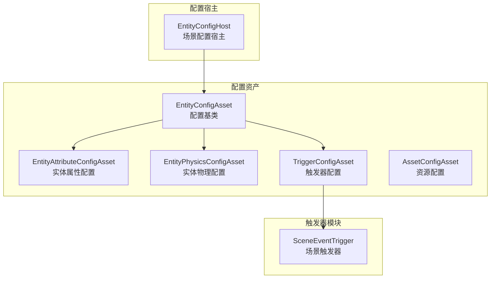
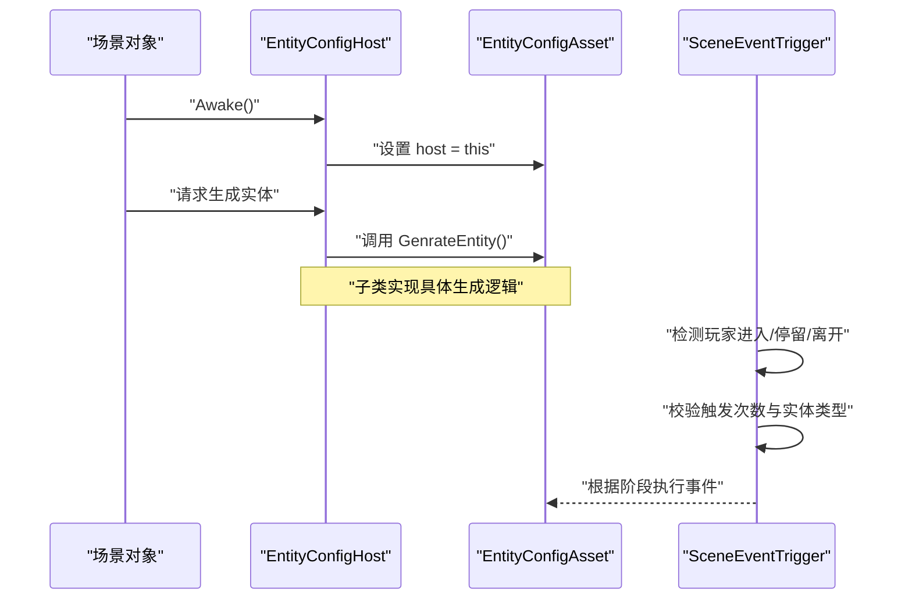
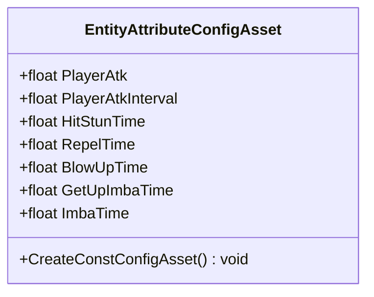
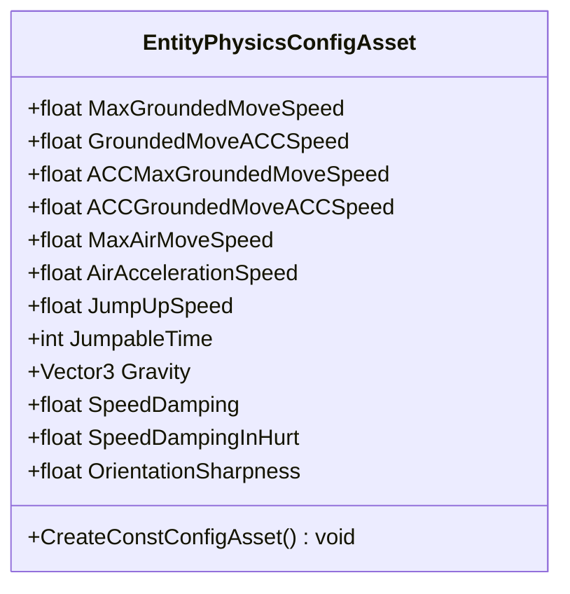
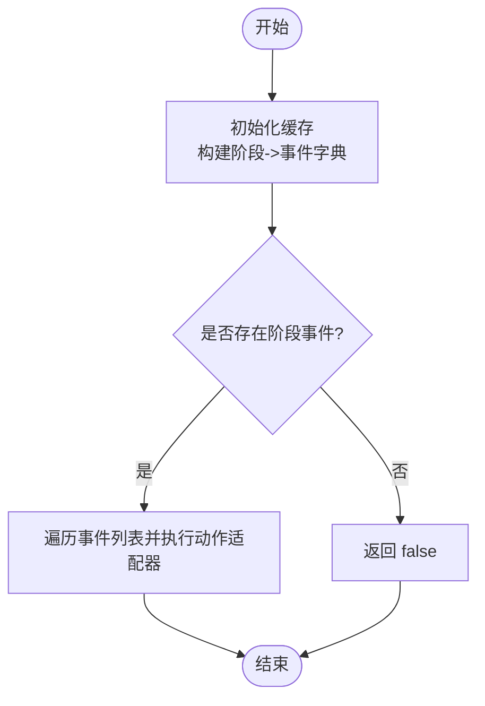
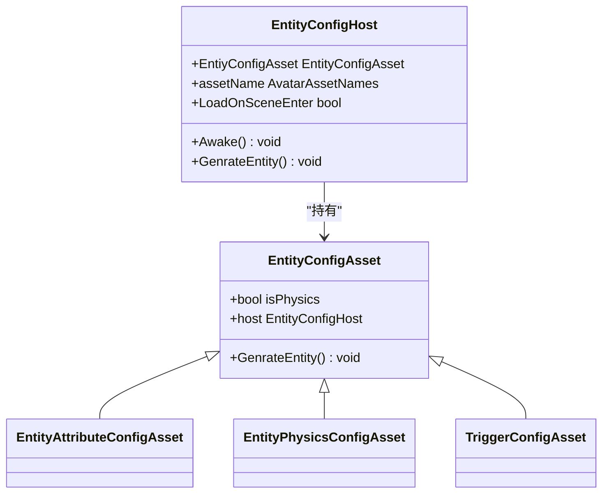
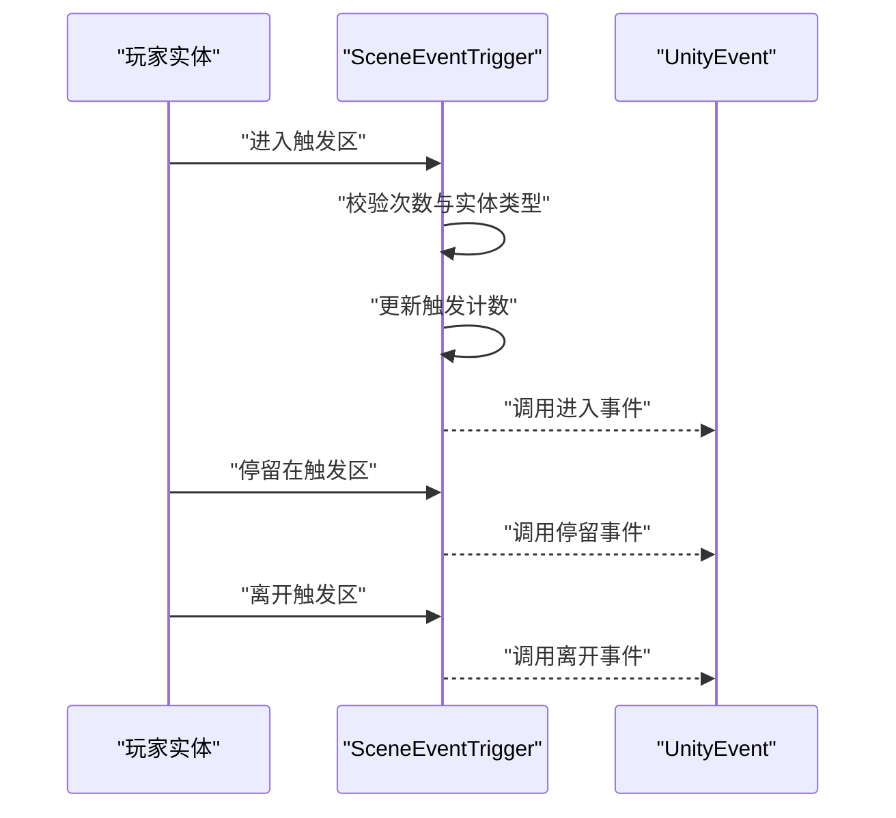
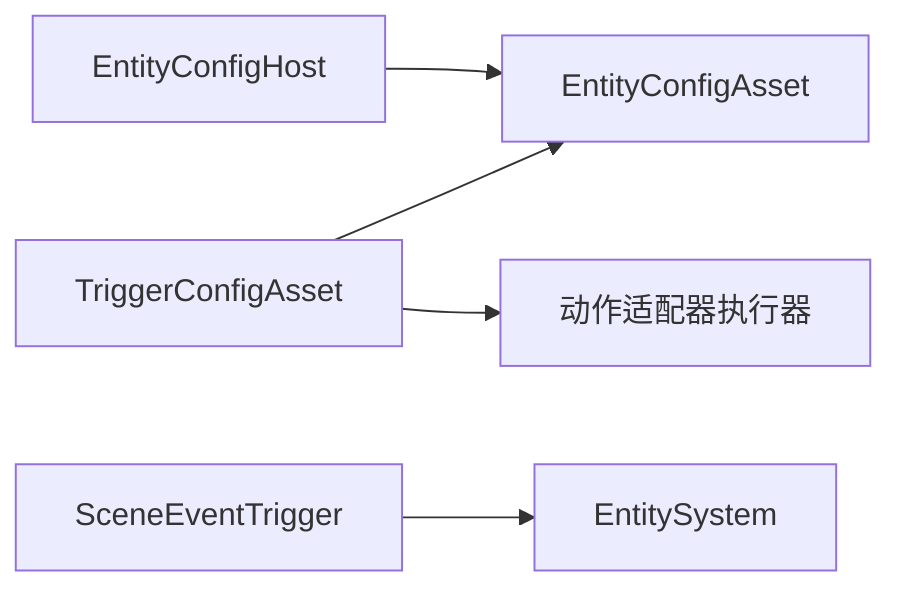

# 实体配置系统

<cite>
**本文引用的文件**
- [EntityAttributeConfigAsset.cs](file://Assets/Scripts/Config/Entity/EntityAttributeConfigAsset.cs)
- [EntityPhysicsConfigAsset.cs](file://Assets/Scripts/Config/Entity/EntityPhysicsConfigAsset.cs)
- [TriggerConfigAsset.cs](file://Assets/Scripts/Config/Entity/TriggerConfigAsset.cs)
- [EntityConfigAsset.cs](file://Assets/Scripts/Config/Entity/EntityConfigAsset.cs)
- [EntityAttributeDefine.cs](file://Assets/Scripts/Game/Define/EntityAttributeDefine.cs)
- [EntityConfigHost.cs](file://Assets/Scripts/Modules/Entity/Scene/EntityConfigHost.cs)
- [SceneEventTrigger.cs](file://Assets/Scripts/Modules/Triggers/SceneEventTrigger.cs)
- [AssetConfigAsset.cs](file://Assets/Scripts/Config/Entity/AssetConfigAsset.cs)
</cite>

## 目录
1. [简介](#简介)
2. [项目结构](#项目结构)
3. [核心组件](#核心组件)
4. [架构总览](#架构总览)
5. [详细组件分析](#详细组件分析)
6. [依赖分析](#依赖分析)
7. [性能考虑](#性能考虑)
8. [故障排查指南](#故障排查指南)
9. [结论](#结论)
10. [附录](#附录)

## 简介
本文件面向ProjectR项目的实体配置系统，系统性阐述实体属性配置、物理配置与触发器配置的设计与实现。重点覆盖以下方面：
- 实体属性配置：通过EntityAttributeConfigAsset定义基础战斗与受身参数，支持在编辑器中快速创建配置资源。
- 物理配置：通过EntityPhysicsConfigAsset定义地面/空中移动、跳跃、重力、速度衰减与转向等物理参数。
- 触发器配置：通过TriggerConfigAsset抽象触发区域与事件响应，支持按实体阶段（如进入、停留、离开）绑定动作事件。
- 继承关系与默认值：以EntityConfigAsset为基类，派生出具体配置类型；默认值在字段声明处设定，便于快速上手。
- 参数验证与错误处理：在运行时对空引用进行日志记录与安全返回，避免崩溃。
- 创建模板、批量编辑与迁移：提供编辑器菜单项作为创建模板入口；通过统一的配置宿主与系统接口实现批量应用与迁移。

## 项目结构
实体配置系统主要由“配置资产”“配置宿主”“触发器模块”三部分组成：
- 配置资产：存放于Assets/Scripts/Config/Entity目录，包含实体属性、物理与触发器配置的ScriptableObject类型。
- 配置宿主：位于Assets/Scripts/Modules/Entity/Scene，负责挂载场景并驱动配置生成实体。
- 触发器模块：位于Assets/Scripts/Modules/Triggers，提供场景触发器与事件响应逻辑。

图表来源
- [EntityAttributeConfigAsset.cs:1-34](file://Assets/Scripts/Config/Entity/EntityAttributeConfigAsset.cs#L1-L34)
- [EntityPhysicsConfigAsset.cs:1-42](file://Assets/Scripts/Config/Entity/EntityPhysicsConfigAsset.cs#L1-L42)
- [TriggerConfigAsset.cs:1-70](file://Assets/Scripts/Config/Entity/TriggerConfigAsset.cs#L1-L70)
- [EntityConfigAsset.cs:1-19](file://Assets/Scripts/Config/Entity/EntityConfigAsset.cs#L1-L19)
- [AssetConfigAsset.cs:1-12](file://Assets/Scripts/Config/Entity/AssetConfigAsset.cs#L1-L12)
- [EntityConfigHost.cs:1-33](file://Assets/Scripts/Modules/Entity/Scene/EntityConfigHost.cs#L1-L33)
- [SceneEventTrigger.cs:1-141](file://Assets/Scripts/Modules/Triggers/SceneEventTrigger.cs#L1-L141)

章节来源
- [EntityAttributeConfigAsset.cs:1-34](file://Assets/Scripts/Config/Entity/EntityAttributeConfigAsset.cs#L1-L34)
- [EntityPhysicsConfigAsset.cs:1-42](file://Assets/Scripts/Config/Entity/EntityPhysicsConfigAsset.cs#L1-L42)
- [TriggerConfigAsset.cs:1-70](file://Assets/Scripts/Config/Entity/TriggerConfigAsset.cs#L1-L70)
- [EntityConfigAsset.cs:1-19](file://Assets/Scripts/Config/Entity/EntityConfigAsset.cs#L1-L19)
- [AssetConfigAsset.cs:1-12](file://Assets/Scripts/Config/Entity/AssetConfigAsset.cs#L1-L12)
- [EntityConfigHost.cs:1-33](file://Assets/Scripts/Modules/Entity/Scene/EntityConfigHost.cs#L1-L33)
- [SceneEventTrigger.cs:1-141](file://Assets/Scripts/Modules/Triggers/SceneEventTrigger.cs#L1-L141)

## 核心组件
- 实体属性配置（EntityAttributeConfigAsset）
  - 定义角色攻击、攻击间隔、受身（硬直、击退、被击飞、起身无敌、普通无敌）等参数。
  - 提供编辑器菜单项用于快速创建该类型的配置资源。
- 实体物理配置（EntityPhysicsConfigAsset）
  - 定义地面移动（最大速度、加速度、加速时参数）、空中移动（最大速度、加速度）、跳跃（上升速度、可跳次数）、重力、速度衰减、转向系数等。
  - 字段具备合理默认值，便于快速上手。
- 触发器配置（TriggerConfigAsset）
  - 抽象触发区域与事件响应，维护实体阶段到事件列表的映射，支持按阶段查询与执行。
  - 提供缓存初始化逻辑，避免重复构建字典。
- 配置基类（EntityConfigAsset）
  - 所有实体配置的抽象基类，提供是否启用物理标记与生成实体的虚方法。
- 资源配置（AssetConfigAsset）
  - 封装Avatar资源名称集合，便于统一管理模型/动画等资源。
- 场景配置宿主（EntityConfigHost）
  - 场景对象挂载此组件后，可将自身与配置资产关联，并触发生成实体流程。
- 场景触发器（SceneEventTrigger）
  - 基于BoxCollider的触发器，限制仅玩家实体触发，支持可触发次数控制与事件回调。

章节来源
- [EntityAttributeConfigAsset.cs:10-34](file://Assets/Scripts/Config/Entity/EntityAttributeConfigAsset.cs#L10-L34)
- [EntityPhysicsConfigAsset.cs:10-42](file://Assets/Scripts/Config/Entity/EntityPhysicsConfigAsset.cs#L10-L42)
- [TriggerConfigAsset.cs:8-70](file://Assets/Scripts/Config/Entity/TriggerConfigAsset.cs#L8-L70)
- [EntityConfigAsset.cs:7-19](file://Assets/Scripts/Config/Entity/EntityConfigAsset.cs#L7-L19)
- [AssetConfigAsset.cs:6-12](file://Assets/Scripts/Config/Entity/AssetConfigAsset.cs#L6-L12)
- [EntityConfigHost.cs:6-33](file://Assets/Scripts/Modules/Entity/Scene/EntityConfigHost.cs#L6-L33)
- [SceneEventTrigger.cs:12-141](file://Assets/Scripts/Modules/Triggers/SceneEventTrigger.cs#L12-L141)

## 架构总览
实体配置系统的运行链路如下：
- 场景中挂载EntityConfigHost，持有某个EntityConfigAsset。
- EntityConfigHost在Awake时将自身赋给配置资产的host字段。
- 当需要生成实体时，调用配置资产的GenrateEntity方法（由子类实现）。
- 对于触发器配置，SceneEventTrigger检测玩家实体进入/停留/离开触发区，按配置执行对应阶段的动作事件。

图表来源
- [EntityConfigHost.cs:14-30](file://Assets/Scripts/Modules/Entity/Scene/EntityConfigHost.cs#L14-L30)
- [EntityConfigAsset.cs:15-18](file://Assets/Scripts/Config/Entity/EntityConfigAsset.cs#L15-L18)
- [SceneEventTrigger.cs:67-114](file://Assets/Scripts/Modules/Triggers/SceneEventTrigger.cs#L67-L114)
- [TriggerConfigAsset.cs:41-67](file://Assets/Scripts/Config/Entity/TriggerConfigAsset.cs#L41-L67)

## 详细组件分析

### 实体属性配置（EntityAttributeConfigAsset）
- 设计要点
  - 使用Odin Inspector进行可视化分组与标签显示，提升编辑体验。
  - 支持编辑器菜单项一键创建配置资源。
- 参数说明
  - 攻击相关：攻击伤害、攻击间隔。
  - 受身相关：硬直时间、击退时间、被击飞时间、起身无敌时间、普通无敌时间。
- 默认值与验证
  - 字段在声明时赋予初始值，便于快速使用。
  - 编辑器入口确保资源创建便捷，减少手写样板代码。

图表来源
- [EntityAttributeConfigAsset.cs:10-34](file://Assets/Scripts/Config/Entity/EntityAttributeConfigAsset.cs#L10-L34)

章节来源
- [EntityAttributeConfigAsset.cs:10-34](file://Assets/Scripts/Config/Entity/EntityAttributeConfigAsset.cs#L10-L34)

### 实体物理配置（EntityPhysicsConfigAsset）
- 设计要点
  - 分组展示地面/空中移动、跳跃、其他参数，便于查阅与调整。
  - 合理默认值覆盖常见需求，降低调参门槛。
- 参数说明
  - 地面移动：最大速度、加速度、加速时参数。
  - 空中移动：最大速度、加速度。
  - 跳跃：上升速度、可跳次数。
  - 其他：重力向量、速度衰减、加速时衰减、转向系数。
- 默认值与验证
  - 字段在声明时赋予默认值，编辑器入口提供创建模板。

图表来源
- [EntityPhysicsConfigAsset.cs:10-42](file://Assets/Scripts/Config/Entity/EntityPhysicsConfigAsset.cs#L10-L42)

章节来源
- [EntityPhysicsConfigAsset.cs:10-42](file://Assets/Scripts/Config/Entity/EntityPhysicsConfigAsset.cs#L10-L42)

### 触发器配置（TriggerConfigAsset）
- 设计要点
  - 继承自EntityConfigAsset，扩展实体阶段事件列表与缓存机制。
  - 提供阶段事件查询、获取与执行方法，支持按阶段触发。
- 数据结构与复杂度
  - 初始化时将List<EntityPhaseEvent>转换为字典<PhyEntityPhase, EntityPhaseEvent>，查询为O(1)。
  - 执行阶段事件时遍历事件列表，时间复杂度为O(N)（N为该阶段事件数量）。
- 错误处理
  - 对空事件或空动作适配器进行日志记录并跳过，保证稳定性。

图表来源
- [TriggerConfigAsset.cs:22-67](file://Assets/Scripts/Config/Entity/TriggerConfigAsset.cs#L22-L67)

章节来源
- [TriggerConfigAsset.cs:8-70](file://Assets/Scripts/Config/Entity/TriggerConfigAsset.cs#L8-L70)

### 配置基类与宿主（EntityConfigAsset 与 EntityConfigHost）
- 继承关系
  - EntityConfigAsset为所有实体配置的抽象基类，提供isPhysics标记与GenrateEntity虚方法。
  - EntityConfigHost在场景中挂载，负责将自身赋给配置资产的host字段，并调用其生成逻辑。
- 默认值与参数
  - isPhysics默认false，可在具体配置中覆盖。
  - GenrateEntity为空实现，由子类覆盖以完成实际生成。

图表来源
- [EntityConfigAsset.cs:7-19](file://Assets/Scripts/Config/Entity/EntityConfigAsset.cs#L7-L19)
- [EntityConfigHost.cs:6-33](file://Assets/Scripts/Modules/Entity/Scene/EntityConfigHost.cs#L6-L33)
- [EntityAttributeConfigAsset.cs:10](file://Assets/Scripts/Config/Entity/EntityAttributeConfigAsset.cs#L10)
- [EntityPhysicsConfigAsset.cs:10](file://Assets/Scripts/Config/Entity/EntityPhysicsConfigAsset.cs#L10)
- [TriggerConfigAsset.cs:9](file://Assets/Scripts/Config/Entity/TriggerConfigAsset.cs#L9)

章节来源
- [EntityConfigAsset.cs:7-19](file://Assets/Scripts/Config/Entity/EntityConfigAsset.cs#L7-L19)
- [EntityConfigHost.cs:6-33](file://Assets/Scripts/Modules/Entity/Scene/EntityConfigHost.cs#L6-L33)

### 场景触发器（SceneEventTrigger）
- 设计要点
  - 基于BoxCollider，isTrigger=true，渲染器禁用以便调试。
  - 限制仅玩家实体触发，支持可触发次数控制（小于0表示无限）。
  - 提供进入、停留、离开三种事件回调。
- 运行流程
  - 校验触发次数与实体类型，更新计数并调用对应UnityEvent。

图表来源
- [SceneEventTrigger.cs:32-114](file://Assets/Scripts/Modules/Triggers/SceneEventTrigger.cs#L32-L114)

章节来源
- [SceneEventTrigger.cs:12-141](file://Assets/Scripts/Modules/Triggers/SceneEventTrigger.cs#L12-L141)

### 资源配置（AssetConfigAsset）
- 作用
  - 封装Avatar资源名称集合，便于统一管理模型/动画等资源。
- 适用场景
  - 与实体配置配合，为生成的实体提供资源绑定。

章节来源
- [AssetConfigAsset.cs:6-12](file://Assets/Scripts/Config/Entity/AssetConfigAsset.cs#L6-L12)

## 依赖分析
- 组件耦合
  - TriggerConfigAsset依赖EntityConfigAsset与系统事件执行器（通过动作适配器执行事件）。
  - SceneEventTrigger依赖EntitySystem以获取物理实体，并通过UnityEvent触发外部逻辑。
  - EntityConfigHost依赖EntityConfigAsset以完成实体生成。
- 外部依赖
  - OdinInspector用于编辑器可视化与菜单项。
  - UnityEvent用于触发器事件回调。
  - 日志系统用于错误记录与调试。

图表来源
- [TriggerConfigAsset.cs:3,50](file://Assets/Scripts/Config/Entity/TriggerConfigAsset.cs#L3,L50)
- [SceneEventTrigger.cs:60,74-81](file://Assets/Scripts/Modules/Triggers/SceneEventTrigger.cs#L60,L74-L81)
- [EntityConfigHost.cs:16,29](file://Assets/Scripts/Modules/Entity/Scene/EntityConfigHost.cs#L16,L29)

章节来源
- [TriggerConfigAsset.cs:3,50](file://Assets/Scripts/Config/Entity/TriggerConfigAsset.cs#L3,L50)
- [SceneEventTrigger.cs:60,74-81](file://Assets/Scripts/Modules/Triggers/SceneEventTrigger.cs#L60,L74-L81)
- [EntityConfigHost.cs:16,29](file://Assets/Scripts/Modules/Entity/Scene/EntityConfigHost.cs#L16,L29)

## 性能考虑
- 查询优化
  - 触发器配置在首次访问时构建阶段到事件的字典缓存，后续查询为O(1)，避免重复遍历。
- 循环与开销
  - 执行阶段事件时遍历事件列表，建议控制单阶段事件数量，避免过多动作导致帧时间抖动。
- 内存管理
  - 字典缓存仅在首次使用时创建，生命周期随配置资产；避免在热路径频繁分配新对象。
  - 触发器计数器与字典键值均为轻量结构，整体内存占用较低。
- 建议
  - 对高频触发区域（如循环路径）适当合并触发器或减少事件数量。
  - 在编辑器中预设默认值，减少运行时动态计算。

[本节为通用指导，不直接分析具体文件]

## 故障排查指南
- 配置未生效
  - 确认场景中的EntityConfigHost已挂载且EntiyConfigAsset非空。
  - 检查配置资产的isPhysics标记与生成逻辑是否正确。
- 触发器无效
  - 确认BoxCollider isTrigger=true，且仅玩家实体触发。
  - 检查CanTriggerTimes是否为负数或大于当前计数。
- 事件未执行
  - 检查TriggerConfigAsset中是否存在目标阶段事件。
  - 若事件或动作适配器为空，系统会记录错误日志并跳过执行。
- 日志定位
  - 触发器内部使用日志系统记录异常，便于定位回调中的问题。

章节来源
- [EntityConfigHost.cs:24-29](file://Assets/Scripts/Modules/Entity/Scene/EntityConfigHost.cs#L24-L29)
- [SceneEventTrigger.cs:67-114](file://Assets/Scripts/Modules/Triggers/SceneEventTrigger.cs#L67-L114)
- [TriggerConfigAsset.cs:50-67](file://Assets/Scripts/Config/Entity/TriggerConfigAsset.cs#L50-L67)

## 结论
实体配置系统通过清晰的继承层次与默认值设计，提供了易于扩展与维护的实体参数管理方案。结合场景宿主与触发器模块，实现了从配置到运行时行为的完整闭环。建议在实际项目中：
- 使用编辑器菜单项快速创建配置模板，统一命名与字段规范。
- 对高频触发区域进行事件数量与执行逻辑优化。
- 利用默认值与分组标签提升参数可读性与可维护性。

[本节为总结性内容，不直接分析具体文件]

## 附录

### 创建模板与批量编辑
- 创建模板
  - 实体属性配置：通过编辑器菜单项创建EntityAttributeConfigAsset资源。
  - 实体物理配置：通过编辑器菜单项创建EntityPhysicsConfigAsset资源。
- 批量编辑
  - 在编辑器中打开配置资源，利用Odin Inspector提供的可视化控件进行批量修改。
  - 对多个相同类型的配置进行复制粘贴，快速生成变体。

章节来源
- [EntityAttributeConfigAsset.cs:26-30](file://Assets/Scripts/Config/Entity/EntityAttributeConfigAsset.cs#L26-L30)
- [EntityPhysicsConfigAsset.cs:35-39](file://Assets/Scripts/Config/Entity/EntityPhysicsConfigAsset.cs#L35-L39)

### 配置迁移方案
- 字段迁移
  - 若未来字段名变更，可通过脚本扫描配置资源并替换字段值，保持兼容。
- 默认值演进
  - 新增字段时提供合理默认值，旧配置自动继承默认值，避免破坏既有平衡。
- 触发器阶段扩展
  - 新增实体阶段时，先在TriggerConfigAsset中扩展枚举与事件映射，再逐步填充事件列表。

[本节为通用指导，不直接分析具体文件]