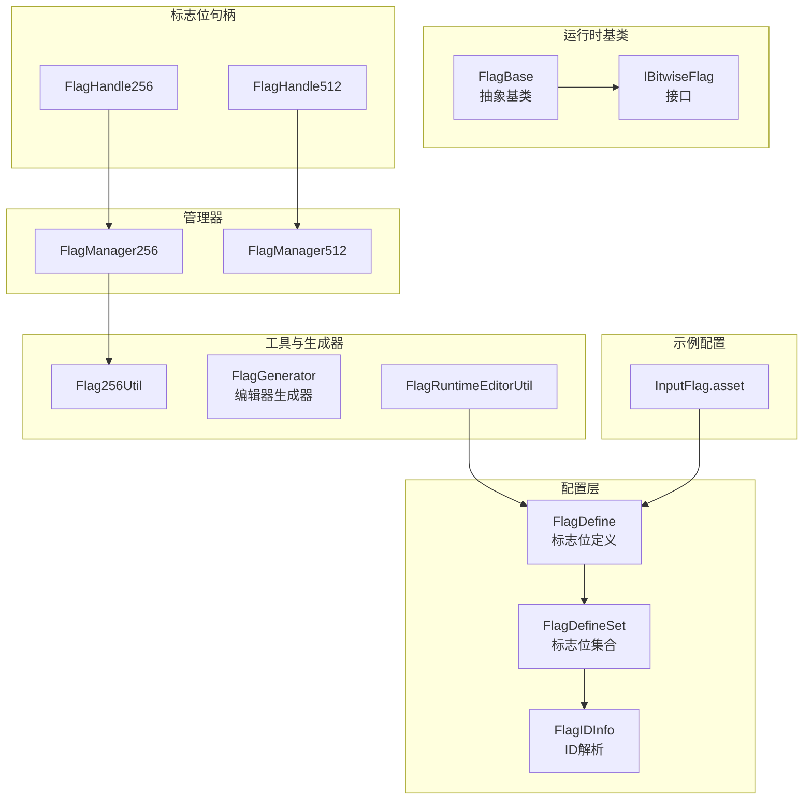
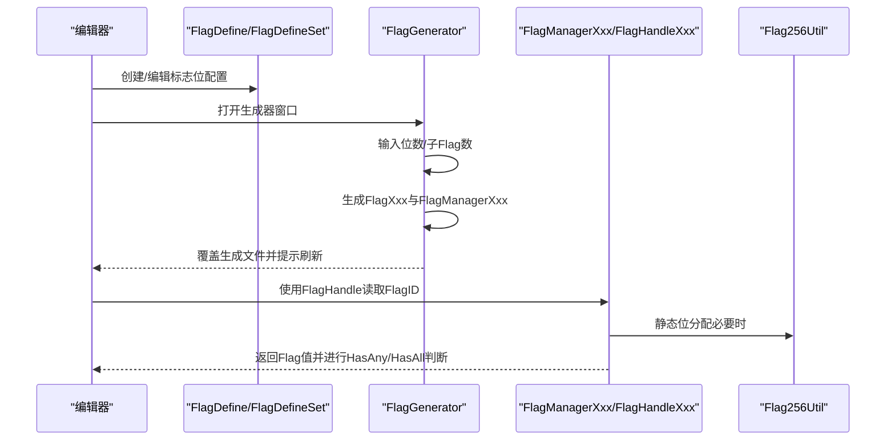
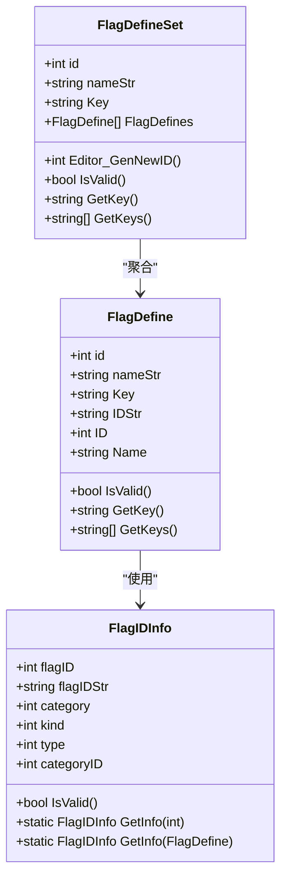
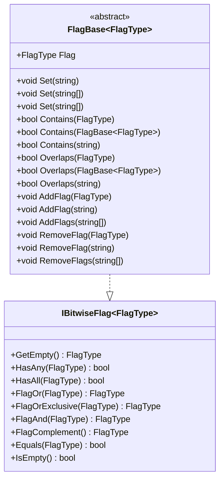
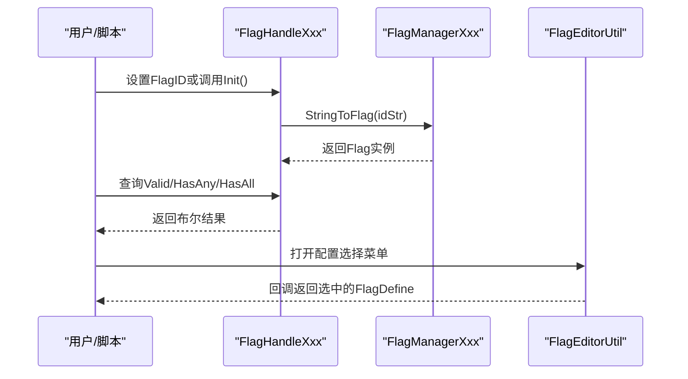
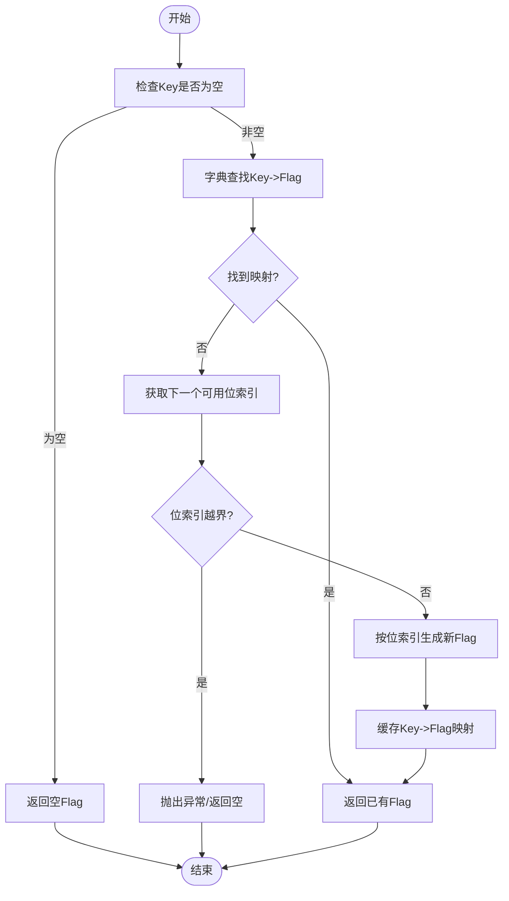
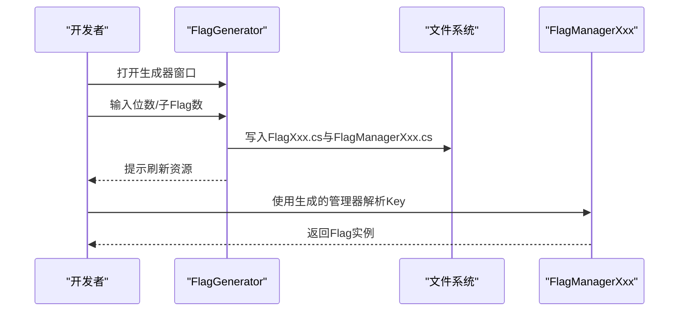
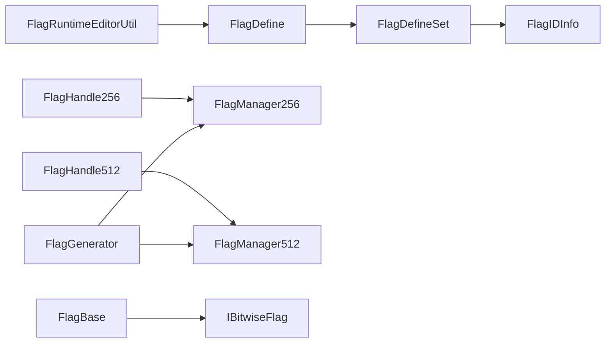

# 标志位配置系统

<cite>
**本文档引用的文件**
- [FlagDefine.cs](file://Assets/Plugins/PJR/BitwiseFlags/FlagDefine.cs)
- [FlagDefine.Static.cs](file://Assets/Plugins/PJR/BitwiseFlags/FlagDefine.Static.cs)
- [FlagDefineSet.cs](file://Assets/Plugins/PJR/BitwiseFlags/FlagDefineSet.cs)
- [FlagBase.cs](file://Assets/Plugins/PJR/BitwiseFlags/FlagBase.cs)
- [FlagHandle.cs](file://Assets/Plugins/PJR/BitwiseFlags/FlagHandle.cs)
- [FlagManager256.cs](file://Assets/Plugins/PJR/BitwiseFlags/Gen/FlagManager256.cs)
- [FlagManager512.cs](file://Assets/Plugins/PJR/BitwiseFlags/Gen/FlagManager512.cs)
- [Flag256Util.cs](file://Assets/Plugins/PJR/BitwiseFlags/Flag256Util.cs)
- [FlagIDInfo.cs](file://Assets/Plugins/PJR/BitwiseFlags/FlagIDInfo.cs)
- [FlagGenerator.cs](file://Assets/Plugins/PJR/BitwiseFlags/Editor/FlagGenerator.cs)
- [FlagRuntimeEditorUtil.cs](file://Assets/Plugins/PJR/BitwiseFlags/FlagRuntimeEditorUtil.cs)
- [InputFlag.asset](file://Assets/Dev/Flag/InputFlag.asset)
</cite>

## 目录
1. [简介](#简介)
2. [项目结构](#项目结构)
3. [核心组件](#核心组件)
4. [架构总览](#架构总览)
5. [详细组件分析](#详细组件分析)
6. [依赖关系分析](#依赖关系分析)
7. [性能考虑](#性能考虑)
8. [故障排查指南](#故障排查指南)
9. [结论](#结论)
10. [附录](#附录)

## 简介
本文件面向ProjectR项目的“标志位配置系统”，系统性阐述FlagConfig的设计理念、实现原理与使用场景，涵盖：
- 布尔状态标记、游戏进度控制与功能开关管理
- 标志位的定义方式、命名规范与作用域管理
- 在游戏流程中的应用（关卡解锁、成就达成、选项设置）
- 标志位配置的创建方法、批量操作工具与状态查询接口
- 标志位系统的持久化存储、跨场景共享与冲突处理机制

该系统通过位掩码（Bitwise）高效表达多维布尔状态，结合编辑器工具链与运行时管理器，形成从配置到使用的完整闭环。

## 项目结构
标志位配置系统主要由以下模块构成：
- 配置层：FlagDefine、FlagDefineSet、FlagIDInfo
- 运行时基类：FlagBase、IBitwiseFlag
- 标志位句柄：FlagHandle256、FlagHandle512
- 管理器：FlagManager256、FlagManager512
- 工具与生成器：Flag256Util、FlagGenerator、FlagRuntimeEditorUtil
- 示例配置：InputFlag.asset

**图表来源**
- [FlagDefine.cs:10-114](file://Assets/Plugins/PJR/BitwiseFlags/FlagDefine.cs#L10-L114)
- [FlagDefineSet.cs:11-136](file://Assets/Plugins/PJR/BitwiseFlags/FlagDefineSet.cs#L11-L136)
- [FlagIDInfo.cs:1-80](file://Assets/Plugins/PJR/BitwiseFlags/FlagIDInfo.cs#L1-L80)
- [FlagBase.cs:6-120](file://Assets/Plugins/PJR/BitwiseFlags/FlagBase.cs#L6-L120)
- [FlagHandle.cs:12-420](file://Assets/Plugins/PJR/BitwiseFlags/FlagHandle.cs#L12-L420)
- [FlagManager256.cs:2-115](file://Assets/Plugins/PJR/BitwiseFlags/Gen/FlagManager256.cs#L2-L115)
- [FlagManager512.cs:2-129](file://Assets/Plugins/PJR/BitwiseFlags/Gen/FlagManager512.cs#L2-L129)
- [Flag256Util.cs:5-54](file://Assets/Plugins/PJR/BitwiseFlags/Flag256Util.cs#L5-L54)
- [FlagGenerator.cs:8-620](file://Assets/Plugins/PJR/BitwiseFlags/Editor/FlagGenerator.cs#L8-L620)
- [FlagRuntimeEditorUtil.cs:10-63](file://Assets/Plugins/PJR/BitwiseFlags/FlagRuntimeEditorUtil.cs#L10-L63)
- [InputFlag.asset:1-31](file://Assets/Dev/Flag/InputFlag.asset#L1-L31)

**章节来源**
- [FlagDefine.cs:10-114](file://Assets/Plugins/PJR/BitwiseFlags/FlagDefine.cs#L10-L114)
- [FlagDefineSet.cs:11-136](file://Assets/Plugins/PJR/BitwiseFlags/FlagDefineSet.cs#L11-L136)
- [FlagIDInfo.cs:1-80](file://Assets/Plugins/PJR/BitwiseFlags/FlagIDInfo.cs#L1-L80)
- [FlagBase.cs:6-120](file://Assets/Plugins/PJR/BitwiseFlags/FlagBase.cs#L6-L120)
- [FlagHandle.cs:12-420](file://Assets/Plugins/PJR/BitwiseFlags/FlagHandle.cs#L12-L420)
- [FlagManager256.cs:2-115](file://Assets/Plugins/PJR/BitwiseFlags/Gen/FlagManager256.cs#L2-L115)
- [FlagManager512.cs:2-129](file://Assets/Plugins/PJR/BitwiseFlags/Gen/FlagManager512.cs#L2-L129)
- [Flag256Util.cs:5-54](file://Assets/Plugins/PJR/BitwiseFlags/Flag256Util.cs#L5-L54)
- [FlagGenerator.cs:8-620](file://Assets/Plugins/PJR/BitwiseFlags/Editor/FlagGenerator.cs#L8-L620)
- [FlagRuntimeEditorUtil.cs:10-63](file://Assets/Plugins/PJR/BitwiseFlags/FlagRuntimeEditorUtil.cs#L10-L63)
- [InputFlag.asset:1-31](file://Assets/Dev/Flag/InputFlag.asset#L1-L31)

## 核心组件
- 标志位定义（FlagDefine）：承载单个标志位的ID、名称与Key，提供编辑器可视化与验证。
- 标志位集合（FlagDefineSet）：用于批量维护一组FlagDefine，并提供编辑器增删改查与ID自动生成。
- 标志位ID信息（FlagIDInfo）：解析整型ID为大类/小类/类型三段式分层结构，支持categoryID计算。
- 抽象基类（FlagBase<T>）：封装标志位的设置、包含判断、并/交/补运算等通用逻辑。
- 标志位句柄（FlagHandle256/FlagHandle512）：运行时持有FlagID并按需解析为具体Flag值，提供编辑器可视化与选择器。
- 管理器（FlagManager256/FlagManager512）：将字符串Key映射为唯一位索引，生成对应的Flag实例，支持按分类缓存。
- 工具与生成器（Flag256Util、FlagGenerator、FlagRuntimeEditorUtil）：提供静态位分配、编辑器生成脚本与运行时菜单选择辅助。
- 示例配置（InputFlag.asset）：演示如何创建一个最小可用的FlagDefineSet配置资产。

**章节来源**
- [FlagDefine.cs:10-114](file://Assets/Plugins/PJR/BitwiseFlags/FlagDefine.cs#L10-L114)
- [FlagDefineSet.cs:11-136](file://Assets/Plugins/PJR/BitwiseFlags/FlagDefineSet.cs#L11-L136)
- [FlagIDInfo.cs:1-80](file://Assets/Plugins/PJR/BitwiseFlags/FlagIDInfo.cs#L1-L80)
- [FlagBase.cs:6-120](file://Assets/Plugins/PJR/BitwiseFlags/FlagBase.cs#L6-L120)
- [FlagHandle.cs:12-420](file://Assets/Plugins/PJR/BitwiseFlags/FlagHandle.cs#L12-L420)
- [FlagManager256.cs:2-115](file://Assets/Plugins/PJR/BitwiseFlags/Gen/FlagManager256.cs#L2-L115)
- [FlagManager512.cs:2-129](file://Assets/Plugins/PJR/BitwiseFlags/Gen/FlagManager512.cs#L2-L129)
- [Flag256Util.cs:5-54](file://Assets/Plugins/PJR/BitwiseFlags/Flag256Util.cs#L5-L54)
- [FlagGenerator.cs:8-620](file://Assets/Plugins/PJR/BitwiseFlags/Editor/FlagGenerator.cs#L8-L620)
- [FlagRuntimeEditorUtil.cs:10-63](file://Assets/Plugins/PJR/BitwiseFlags/FlagRuntimeEditorUtil.cs#L10-L63)
- [InputFlag.asset:1-31](file://Assets/Dev/Flag/InputFlag.asset#L1-L31)

## 架构总览
系统采用“配置-生成-运行时”的三层架构：
- 配置层：通过FlagDefine/FlagDefineSet在编辑器中定义标志位，支持菜单名称与Key的规范化。
- 生成层：FlagGenerator根据位宽或子Flag数量生成FlagXxx与FlagManagerXxx代码，确保编译期类型安全。
- 运行时层：FlagHandle持有FlagID，通过FlagManager解析为具体Flag值；FlagBase提供统一的状态操作接口。

**图表来源**
- [FlagGenerator.cs:10-264](file://Assets/Plugins/PJR/BitwiseFlags/Editor/FlagGenerator.cs#L10-L264)
- [FlagManager256.cs:15-95](file://Assets/Plugins/PJR/BitwiseFlags/Gen/FlagManager256.cs#L15-L95)
- [FlagManager512.cs:15-101](file://Assets/Plugins/PJR/BitwiseFlags/Gen/FlagManager512.cs#L15-L101)
- [Flag256Util.cs:13-30](file://Assets/Plugins/PJR/BitwiseFlags/Flag256Util.cs#L13-L30)
- [FlagHandle.cs:48-73](file://Assets/Plugins/PJR/BitwiseFlags/FlagHandle.cs#L48-L73)

## 详细组件分析

### 标志位定义与集合
- FlagDefine：包含id/nameStr/Key，提供编辑器GUI与验证逻辑；Key用于运行时映射。
- FlagDefineSet：聚合多个FlagDefine，提供列表增删、ID自动生成与校验提示。
- FlagIDInfo：解析整型ID为category/kind/type三段式，支持categoryID计算，便于分类管理。

**图表来源**
- [FlagDefine.cs:10-114](file://Assets/Plugins/PJR/BitwiseFlags/FlagDefine.cs#L10-L114)
- [FlagDefineSet.cs:11-136](file://Assets/Plugins/PJR/BitwiseFlags/FlagDefineSet.cs#L11-L136)
- [FlagIDInfo.cs:1-80](file://Assets/Plugins/PJR/BitwiseFlags/FlagIDInfo.cs#L1-L80)

**章节来源**
- [FlagDefine.cs:10-114](file://Assets/Plugins/PJR/BitwiseFlags/FlagDefine.cs#L10-L114)
- [FlagDefineSet.cs:11-136](file://Assets/Plugins/PJR/BitwiseFlags/FlagDefineSet.cs#L11-L136)
- [FlagIDInfo.cs:1-80](file://Assets/Plugins/PJR/BitwiseFlags/FlagIDInfo.cs#L1-L80)

### 抽象基类与接口
- IBitwiseFlag<T>：定义位运算接口（或/与/非/异或、包含判断、空判断等）。
- FlagBase<T>：封装设置、包含/重叠判断、添加/移除标志等通用逻辑，支持从字符串Key批量设置。

**图表来源**
- [FlagBase.cs:109-120](file://Assets/Plugins/PJR/BitwiseFlags/FlagBase.cs#L109-L120)
- [FlagBase.cs:6-107](file://Assets/Plugins/PJR/BitwiseFlags/FlagBase.cs#L6-L107)

**章节来源**
- [FlagBase.cs:6-120](file://Assets/Plugins/PJR/BitwiseFlags/FlagBase.cs#L6-L120)

### 标志位句柄与运行时解析
- FlagHandle256/FlagHandle512：持有FlagID，在初始化时解析为具体Flag值；提供Valid检查、编辑器可视化与选择器。
- FlagRuntimeEditorUtil：反射调用标记了特定特性的配置类，提供编辑器菜单展示与选择回调。

**图表来源**
- [FlagHandle.cs:48-144](file://Assets/Plugins/PJR/BitwiseFlags/FlagHandle.cs#L48-L144)
- [FlagHandle.cs:177-418](file://Assets/Plugins/PJR/BitwiseFlags/FlagHandle.cs#L177-L418)
- [FlagRuntimeEditorUtil.cs:22-61](file://Assets/Plugins/PJR/BitwiseFlags/FlagRuntimeEditorUtil.cs#L22-L61)
- [FlagManager256.cs:15-95](file://Assets/Plugins/PJR/BitwiseFlags/Gen/FlagManager256.cs#L15-L95)
- [FlagManager512.cs:15-101](file://Assets/Plugins/PJR/BitwiseFlags/Gen/FlagManager512.cs#L15-L101)

**章节来源**
- [FlagHandle.cs:12-420](file://Assets/Plugins/PJR/BitwiseFlags/FlagHandle.cs#L12-L420)
- [FlagRuntimeEditorUtil.cs:10-63](file://Assets/Plugins/PJR/BitwiseFlags/FlagRuntimeEditorUtil.cs#L10-L63)
- [FlagManager256.cs:2-115](file://Assets/Plugins/PJR/BitwiseFlags/Gen/FlagManager256.cs#L2-L115)
- [FlagManager512.cs:2-129](file://Assets/Plugins/PJR/BitwiseFlags/Gen/FlagManager512.cs#L2-L129)

### 管理器与位分配
- FlagManager256/FlagManager512：按分类缓存字符串Key到Flag的映射，按首次出现顺序分配唯一位索引，避免冲突。
- Flag256Util：提供静态位分配能力，当需要直接使用位索引时使用。

**图表来源**
- [FlagManager256.cs:70-113](file://Assets/Plugins/PJR/BitwiseFlags/Gen/FlagManager256.cs#L70-L113)
- [FlagManager512.cs:76-127](file://Assets/Plugins/PJR/BitwiseFlags/Gen/FlagManager512.cs#L76-L127)
- [Flag256Util.cs:13-53](file://Assets/Plugins/PJR/BitwiseFlags/Flag256Util.cs#L13-L53)

**章节来源**
- [FlagManager256.cs:2-115](file://Assets/Plugins/PJR/BitwiseFlags/Gen/FlagManager256.cs#L2-L115)
- [FlagManager512.cs:2-129](file://Assets/Plugins/PJR/BitwiseFlags/Gen/FlagManager512.cs#L2-L129)
- [Flag256Util.cs:5-54](file://Assets/Plugins/PJR/BitwiseFlags/Flag256Util.cs#L5-L54)

### 编辑器生成器与工具
- FlagGenerator：在编辑器中根据位宽或子Flag数量生成FlagXxx与FlagManagerXxx代码，支持覆盖与刷新。
- FlagRuntimeEditorUtil：通过特性反射定位配置类，提供编辑器菜单展示与选择回调。

**图表来源**
- [FlagGenerator.cs:103-264](file://Assets/Plugins/PJR/BitwiseFlags/Editor/FlagGenerator.cs#L103-L264)
- [FlagManager256.cs:15-95](file://Assets/Plugins/PJR/BitwiseFlags/Gen/FlagManager256.cs#L15-L95)
- [FlagManager512.cs:15-101](file://Assets/Plugins/PJR/BitwiseFlags/Gen/FlagManager512.cs#L15-L101)

**章节来源**
- [FlagGenerator.cs:8-620](file://Assets/Plugins/PJR/BitwiseFlags/Editor/FlagGenerator.cs#L8-L620)
- [FlagRuntimeEditorUtil.cs:10-63](file://Assets/Plugins/PJR/BitwiseFlags/FlagRuntimeEditorUtil.cs#L10-L63)

## 依赖关系分析
- 配置层依赖FlagIDInfo进行ID解析，FlagDefineSet聚合FlagDefine并提供编辑器体验。
- 运行时层通过FlagHandle持有FlagID，借助FlagManager解析为Flag实例；FlagBase提供统一操作接口。
- FlagGenerator生成FlagManagerXxx，确保Key到Flag的映射稳定且不冲突。
- FlagRuntimeEditorUtil通过反射调用配置类，实现编辑器菜单选择与名称解析。

**图表来源**
- [FlagDefine.cs:10-114](file://Assets/Plugins/PJR/BitwiseFlags/FlagDefine.cs#L10-L114)
- [FlagDefineSet.cs:11-136](file://Assets/Plugins/PJR/BitwiseFlags/FlagDefineSet.cs#L11-L136)
- [FlagIDInfo.cs:1-80](file://Assets/Plugins/PJR/BitwiseFlags/FlagIDInfo.cs#L1-L80)
- [FlagHandle.cs:12-420](file://Assets/Plugins/PJR/BitwiseFlags/FlagHandle.cs#L12-L420)
- [FlagManager256.cs:2-115](file://Assets/Plugins/PJR/BitwiseFlags/Gen/FlagManager256.cs#L2-L115)
- [FlagManager512.cs:2-129](file://Assets/Plugins/PJR/BitwiseFlags/Gen/FlagManager512.cs#L2-L129)
- [FlagBase.cs:6-120](file://Assets/Plugins/PJR/BitwiseFlags/FlagBase.cs#L6-L120)
- [FlagRuntimeEditorUtil.cs:10-63](file://Assets/Plugins/PJR/BitwiseFlags/FlagRuntimeEditorUtil.cs#L10-L63)
- [FlagGenerator.cs:265-398](file://Assets/Plugins/PJR/BitwiseFlags/Editor/FlagGenerator.cs#L265-L398)

**章节来源**
- [FlagDefine.cs:10-114](file://Assets/Plugins/PJR/BitwiseFlags/FlagDefine.cs#L10-L114)
- [FlagDefineSet.cs:11-136](file://Assets/Plugins/PJR/BitwiseFlags/FlagDefineSet.cs#L11-L136)
- [FlagIDInfo.cs:1-80](file://Assets/Plugins/PJR/BitwiseFlags/FlagIDInfo.cs#L1-L80)
- [FlagHandle.cs:12-420](file://Assets/Plugins/PJR/BitwiseFlags/FlagHandle.cs#L12-L420)
- [FlagManager256.cs:2-115](file://Assets/Plugins/PJR/BitwiseFlags/Gen/FlagManager256.cs#L2-L115)
- [FlagManager512.cs:2-129](file://Assets/Plugins/PJR/BitwiseFlags/Gen/FlagManager512.cs#L2-L129)
- [FlagBase.cs:6-120](file://Assets/Plugins/PJR/BitwiseFlags/FlagBase.cs#L6-L120)
- [FlagRuntimeEditorUtil.cs:10-63](file://Assets/Plugins/PJR/BitwiseFlags/FlagRuntimeEditorUtil.cs#L10-L63)
- [FlagGenerator.cs:265-398](file://Assets/Plugins/PJR/BitwiseFlags/Editor/FlagGenerator.cs#L265-L398)

## 性能考虑
- 位运算效率高：Flag基于uint数组的位运算，HasAny/HasAll/FlagOr等操作均为O(k)（k为子Flag数量），适合高频判断。
- 字典缓存：FlagManager按分类缓存Key->Flag映射，避免重复解析，提升运行时性能。
- 生成器一次性生成：通过FlagGenerator生成固定代码，减少运行时反射与动态计算成本。
- 内存占用：每种Flag类型占用常量大小的uint数组，内存开销与位宽线性相关。

[本节为通用性能讨论，无需列出具体文件来源]

## 故障排查指南
- 标志位不可用（Valid=false）：检查FlagID是否大于0、Flag是否为空、是否已完成初始化。
- Key无效：确认FlagDefine的Key非空且唯一；若Key为空，管理器无法建立映射。
- 位溢出：当分配的标志位超过总位数（如256/512）时会返回空或抛错，请检查生成器位宽配置。
- 编辑器菜单无响应：确认存在标记了特定特性的配置类，且FlagRuntimeEditorUtil能正确反射调用。
- 资源未刷新：生成器覆盖文件后请执行资源刷新，确保编辑器识别最新生成代码。

**章节来源**
- [FlagHandle.cs:26-38](file://Assets/Plugins/PJR/BitwiseFlags/FlagHandle.cs#L26-L38)
- [FlagManager256.cs:70-95](file://Assets/Plugins/PJR/BitwiseFlags/Gen/FlagManager256.cs#L70-L95)
- [FlagManager512.cs:76-101](file://Assets/Plugins/PJR/BitwiseFlags/Gen/FlagManager512.cs#L76-L101)
- [Flag256Util.cs:13-30](file://Assets/Plugins/PJR/BitwiseFlags/Flag256Util.cs#L13-L30)
- [FlagRuntimeEditorUtil.cs:22-61](file://Assets/Plugins/PJR/BitwiseFlags/FlagRuntimeEditorUtil.cs#L22-L61)

## 结论
ProjectR的标志位配置系统以“配置-生成-运行时”为核心设计，通过FlagDefine/FlagDefineSet进行声明式配置，利用FlagGenerator生成稳定的运行时代码，配合FlagManager实现高效的Key到Flag映射。系统具备良好的扩展性与性能表现，适用于游戏进度控制、功能开关与复杂布尔状态管理等场景。

[本节为总结性内容，无需列出具体文件来源]

## 附录

### 标志位定义与命名规范
- ID：采用category/kind/type三段式整型ID，便于分类与作用域管理。
- 名称：建议使用层级菜单风格（如Category/SubCategory/Name），便于编辑器选择。
- Key：建议使用稳定、唯一的字符串标识，用于运行时映射与序列化。

**章节来源**
- [FlagDefine.cs:14-21](file://Assets/Plugins/PJR/BitwiseFlags/FlagDefine.cs#L14-L21)
- [FlagDefineSet.cs:18-47](file://Assets/Plugins/PJR/BitwiseFlags/FlagDefineSet.cs#L18-L47)
- [FlagIDInfo.cs:37-78](file://Assets/Plugins/PJR/BitwiseFlags/FlagIDInfo.cs#L37-L78)

### 创建标志位配置的方法
- 在编辑器中通过菜单创建FlagDefineSet或FlagDefineSetGroup，填写ID、名称与Key。
- 使用FlagGenerator生成FlagManager与Flag类型，确保位宽满足需求。
- 在脚本中通过FlagHandle持有FlagID，或直接使用FlagManager解析Key。

**章节来源**
- [FlagDefine.Static.cs:11-32](file://Assets/Plugins/PJR/BitwiseFlags/FlagDefine.Static.cs#L11-L32)
- [FlagGenerator.cs:103-264](file://Assets/Plugins/PJR/BitwiseFlags/Editor/FlagGenerator.cs#L103-L264)
- [FlagHandle.cs:48-73](file://Assets/Plugins/PJR/BitwiseFlags/FlagHandle.cs#L48-L73)

### 批量操作与状态查询接口
- 批量设置：FlagBase提供Set(List<string>)与Set(string[])，支持一次设置多个标志位。
- 状态查询：Contains/Overlaps用于判断包含关系；HasAny/HasAll用于快速判定。
- 添加/移除：AddFlag/RemoveFlag支持增量修改。

**章节来源**
- [FlagBase.cs:30-106](file://Assets/Plugins/PJR/BitwiseFlags/FlagBase.cs#L30-L106)
- [FlagManager256.cs:62-95](file://Assets/Plugins/PJR/BitwiseFlags/Gen/FlagManager256.cs#L62-L95)
- [FlagManager512.cs:68-101](file://Assets/Plugins/PJR/BitwiseFlags/Gen/FlagManager512.cs#L68-L101)

### 持久化存储、跨场景共享与冲突处理
- 持久化存储：FlagDefine/FlagDefineSet保存为Unity资源资产，随场景打包与版本管理。
- 跨场景共享：通过FlagManager按分类缓存，不同场景可复用同一Key映射。
- 冲突处理：Key唯一性由管理器保证；ID三段式结构避免同分类下冲突；位溢出时抛错或返回空，防止隐式覆盖。

**章节来源**
- [FlagDefineSet.cs:76-88](file://Assets/Plugins/PJR/BitwiseFlags/FlagDefineSet.cs#L76-L88)
- [FlagManager256.cs:88-113](file://Assets/Plugins/PJR/BitwiseFlags/Gen/FlagManager256.cs#L88-L113)
- [FlagManager512.cs:94-127](file://Assets/Plugins/PJR/BitwiseFlags/Gen/FlagManager512.cs#L94-L127)
- [Flag256Util.cs:13-30](file://Assets/Plugins/PJR/BitwiseFlags/Flag256Util.cs#L13-L30)