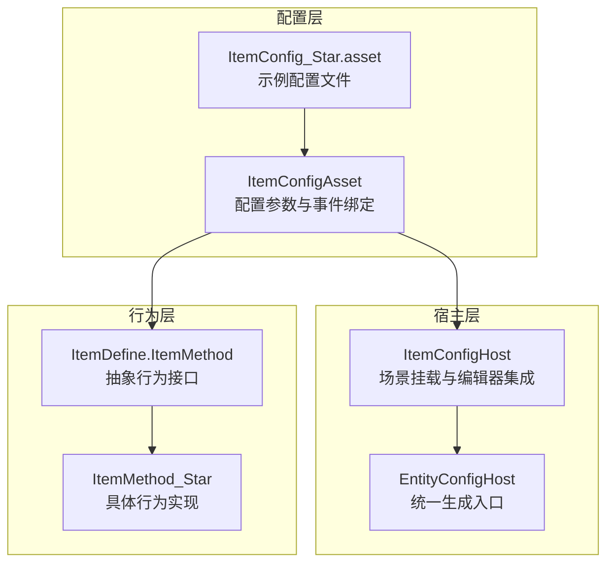
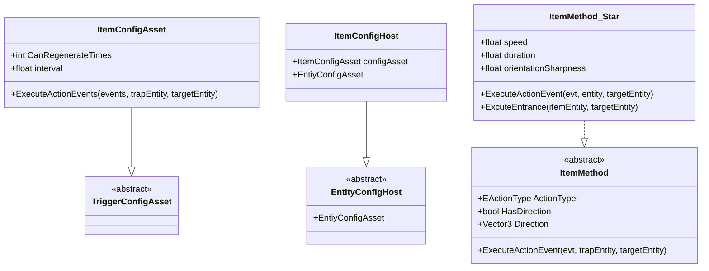
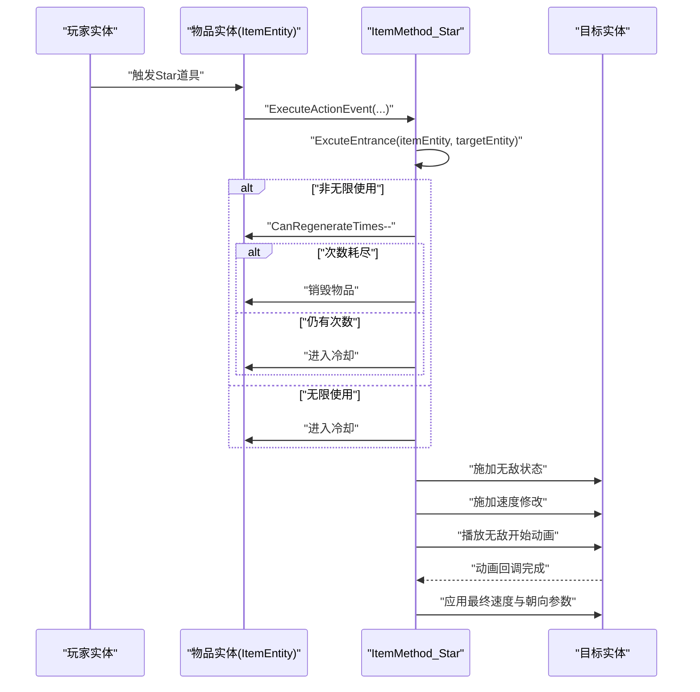
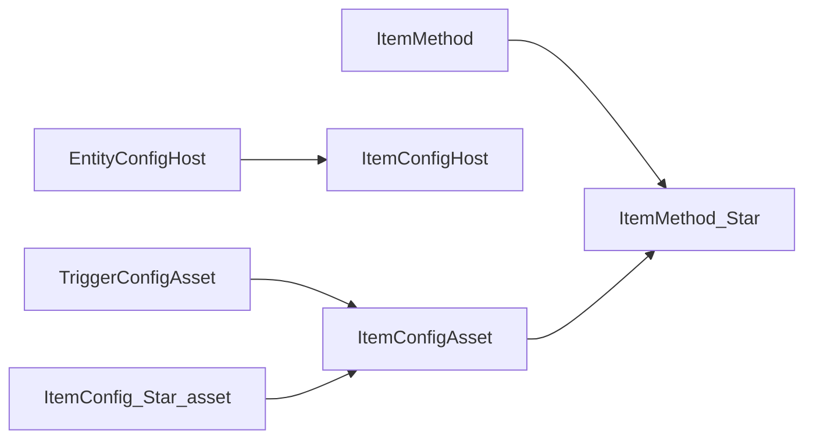

# 物品配置系统

<cite>
**本文引用的文件**
- [ItemConfigAsset.cs](file://Assets/Scripts/Modules/Items/ItemConfigAsset.cs)
- [ItemConfigHost.cs](file://Assets/Scripts/Modules/Items/ItemConfigHost.cs)
- [ItemDefine.cs](file://Assets/Scripts/Modules/Items/ItemDefine.cs)
- [ItemMethodImp.cs](file://Assets/Scripts/Modules/Items/ItemMethodImp.cs)
- [ItemConfig_Star.asset](file://Assets/Dev/Assets_/ItemConfig_Star.asset)
- [TriggerConfigAsset.cs](file://Assets/Scripts/Config/Entity/TriggerConfigAsset.cs)
- [EntityConfigHost.cs](file://Assets/Scripts/Modules/Entity/Scene/EntityConfigHost.cs)
</cite>

## 目录
1. [简介](#简介)
2. [项目结构](#项目结构)
3. [核心组件](#核心组件)
4. [架构总览](#架构总览)
5. [详细组件分析](#详细组件分析)
6. [依赖分析](#依赖分析)
7. [性能考虑](#性能考虑)
8. [故障排查指南](#故障排查指南)
9. [结论](#结论)
10. [附录](#附录)

## 简介
本文件面向ProjectR项目的“物品配置系统”，系统性阐述物品配置的数据结构与实现原理，覆盖以下主题：
- ItemConfigAsset的配置参数与用途
- ItemConfigHost的管理机制与场景挂载方式
- ItemDefine的定义规范与扩展点
- 不同类型物品（以Star道具为例）的配置差异、获取规则、使用效果与数量限制
- 配置继承关系、属性映射与数据验证机制
- 创建流程、批量导入工具与配置检查方法
- 扩展接口、自定义物品类型的开发指导与配置热更新策略

## 项目结构
物品配置系统位于模块化结构中的“Items”模块，围绕配置资产、宿主组件与运行时实体展开。核心文件组织如下：
- 配置资产：ItemConfigAsset（继承自TriggerConfigAsset）
- 宿主组件：ItemConfigHost（继承自EntityConfigHost）
- 运行时行为：ItemDefine.ItemMethod抽象类与具体实现ItemMethod_Star
- 场景挂载：EntityConfigHost基类负责统一的生成与管理入口
- 示例配置：ItemConfig_Star.asset展示完整配置与引用关系

**图表来源**
- [ItemConfigAsset.cs:12-31](file://Assets/Scripts/Modules/Items/ItemConfigAsset.cs#L12-L31)
- [ItemConfigHost.cs:5-11](file://Assets/Scripts/Modules/Items/ItemConfigHost.cs#L5-L11)
- [EntityConfigHost.cs](file://Assets/Scripts/Modules/Entity/Scene/EntityConfigHost.cs)
- [ItemDefine.cs:8-18](file://Assets/Scripts/Modules/Items/ItemDefine.cs#L8-L18)
- [ItemMethodImp.cs:6-31](file://Assets/Scripts/Modules/Items/ItemMethodImp.cs#L6-L31)
- [ItemConfig_Star.asset:15-30](file://Assets/Dev/Assets_/ItemConfig_Star.asset#L15-L30)

**章节来源**
- [ItemConfigAsset.cs:12-31](file://Assets/Scripts/Modules/Items/ItemConfigAsset.cs#L12-L31)
- [ItemConfigHost.cs:5-11](file://Assets/Scripts/Modules/Items/ItemConfigHost.cs#L5-L11)
- [EntityConfigHost.cs](file://Assets/Scripts/Modules/Entity/Scene/EntityConfigHost.cs)
- [ItemDefine.cs:8-18](file://Assets/Scripts/Modules/Items/ItemDefine.cs#L8-L18)
- [ItemMethodImp.cs:6-31](file://Assets/Scripts/Modules/Items/ItemMethodImp.cs#L6-L31)
- [ItemConfig_Star.asset:15-30](file://Assets/Dev/Assets_/ItemConfig_Star.asset#L15-L30)

## 核心组件
- ItemConfigAsset：定义物品的可再生次数、再生间隔等通用属性，并提供编辑器菜单用于快速创建配置资产。
- ItemConfigHost：在场景中挂载物品配置资产，作为可视化编辑与调试的入口。
- ItemDefine.ItemMethod：抽象出物品行为接口，规定动作类型、方向信息与执行方法。
- ItemMethod_Star：具体实现Star类物品的行为，包括无敌状态、速度修改与动画联动。

**章节来源**
- [ItemConfigAsset.cs:12-31](file://Assets/Scripts/Modules/Items/ItemConfigAsset.cs#L12-L31)
- [ItemConfigHost.cs:5-11](file://Assets/Scripts/Modules/Items/ItemConfigHost.cs#L5-L11)
- [ItemDefine.cs:8-18](file://Assets/Scripts/Modules/Items/ItemDefine.cs#L8-L18)
- [ItemMethodImp.cs:6-31](file://Assets/Scripts/Modules/Items/ItemMethodImp.cs#L6-L31)

## 架构总览
物品配置系统采用“配置资产 + 宿主组件 + 行为实现”的分层设计：
- 配置资产（ItemConfigAsset）承载静态配置与事件引用
- 宿主组件（ItemConfigHost）负责在场景中挂载与可视化编辑
- 行为实现（ItemMethod_Star）在触发时对目标实体施加状态与效果
- 继承链路：ItemConfigAsset → TriggerConfigAsset；ItemConfigHost → EntityConfigHost；ItemMethod_Star → ItemApproach（通过引用关系体现）

**图表来源**
- [ItemConfigAsset.cs:12-31](file://Assets/Scripts/Modules/Items/ItemConfigAsset.cs#L12-L31)
- [TriggerConfigAsset.cs](file://Assets/Scripts/Config/Entity/TriggerConfigAsset.cs)
- [ItemConfigHost.cs:5-11](file://Assets/Scripts/Modules/Items/ItemConfigHost.cs#L5-L11)
- [EntityConfigHost.cs](file://Assets/Scripts/Modules/Entity/Scene/EntityConfigHost.cs)
- [ItemDefine.cs:8-18](file://Assets/Scripts/Modules/Items/ItemDefine.cs#L8-L18)
- [ItemMethodImp.cs:6-31](file://Assets/Scripts/Modules/Items/ItemMethodImp.cs#L6-L31)

## 详细组件分析

### ItemConfigAsset：配置参数与事件绑定
- 关键参数
  - 可再生次数：支持无限次或有限次数，决定物品使用后是否销毁或进入冷却
  - 再生间隔：控制物品冷却时间
- 编辑器集成
  - 提供菜单项用于快速创建新的ItemConfigAsset
- 事件执行
  - 覆盖基类的事件执行逻辑，用于在触发时调用绑定的行为

**章节来源**
- [ItemConfigAsset.cs:14-18](file://Assets/Scripts/Modules/Items/ItemConfigAsset.cs#L14-L18)
- [ItemConfigAsset.cs:27-30](file://Assets/Scripts/Modules/Items/ItemConfigAsset.cs#L27-L30)

### ItemConfigHost：场景挂载与管理
- 作用
  - 将ItemConfigAsset以场景组件形式挂载，便于在编辑器中直接查看与调整
  - 通过InlineEditor特性提供内联编辑体验
- 继承关系
  - 继承EntityConfigHost，复用统一的生成与管理入口

**章节来源**
- [ItemConfigHost.cs:5-11](file://Assets/Scripts/Modules/Items/ItemConfigHost.cs#L5-L11)

### ItemDefine.ItemMethod：行为接口规范
- 规范
  - 动作类型：由具体实现声明
  - 方向信息：是否需要方向以及方向值
  - 执行方法：接收事件与实体参数，完成行为逻辑
- 设计意义
  - 通过抽象接口约束不同物品行为的一致性与可扩展性

**章节来源**
- [ItemDefine.cs:8-18](file://Assets/Scripts/Modules/Items/ItemDefine.cs#L8-L18)

### ItemMethod_Star：Star道具行为实现
- 行为要点
  - 对目标实体施加无敌状态与速度修改
  - 与动画系统联动，在特定动画节点后更新状态
  - 根据CanRegenerateTimes与isMugen决定使用后处理（销毁或进入冷却）
- 使用流程
  - 触发时先执行入口逻辑（ExcuteEntrance），再根据条件进行冷却或销毁
  - 冷却期间隐藏模型并在冷却结束后重新激活

**图表来源**
- [ItemMethodImp.cs:14-31](file://Assets/Scripts/Modules/Items/ItemMethodImp.cs#L14-L31)
- [ItemMethodImp.cs:33-51](file://Assets/Scripts/Modules/Items/ItemMethodImp.cs#L33-L51)

**章节来源**
- [ItemMethodImp.cs:6-31](file://Assets/Scripts/Modules/Items/ItemMethodImp.cs#L6-L31)
- [ItemMethodImp.cs:33-51](file://Assets/Scripts/Modules/Items/ItemMethodImp.cs#L33-L51)

### 示例配置：ItemConfig_Star.asset
- 结构要点
  - 绑定实体阶段与事件（如阶段3触发）
  - 引用具体行为实现（ItemMethod_Star）
  - 行为参数（速度、持续时间、转向系数）
- 数据映射
  - YAML中通过RefIds与type信息将配置资产与行为实现关联
  - entityPhaseEvents与references共同构成事件到行为的映射

**章节来源**
- [ItemConfig_Star.asset:15-30](file://Assets/Dev/Assets_/ItemConfig_Star.asset#L15-L30)

## 依赖分析
- 继承关系
  - ItemConfigAsset → TriggerConfigAsset：复用触发器配置能力
  - ItemConfigHost → EntityConfigHost：共享场景挂载与生成逻辑
  - ItemMethod_Star → ItemApproach（通过引用体现）：行为实现遵循抽象接口
- 外部依赖
  - Sirenix OdinInspector：提供编辑器增强与可视化属性
  - Unity编辑器菜单：通过MenuItem提供一键创建配置资产的能力

**图表来源**
- [ItemConfigAsset.cs:12-31](file://Assets/Scripts/Modules/Items/ItemConfigAsset.cs#L12-L31)
- [TriggerConfigAsset.cs](file://Assets/Scripts/Config/Entity/TriggerConfigAsset.cs)
- [ItemConfigHost.cs:5-11](file://Assets/Scripts/Modules/Items/ItemConfigHost.cs#L5-L11)
- [EntityConfigHost.cs](file://Assets/Scripts/Modules/Entity/Scene/EntityConfigHost.cs)
- [ItemDefine.cs:8-18](file://Assets/Scripts/Modules/Items/ItemDefine.cs#L8-L18)
- [ItemMethodImp.cs:6-31](file://Assets/Scripts/Modules/Items/ItemMethodImp.cs#L6-L31)
- [ItemConfig_Star.asset:22-30](file://Assets/Dev/Assets_/ItemConfig_Star.asset#L22-L30)

**章节来源**
- [ItemConfigAsset.cs:12-31](file://Assets/Scripts/Modules/Items/ItemConfigAsset.cs#L12-L31)
- [ItemConfigHost.cs:5-11](file://Assets/Scripts/Modules/Items/ItemConfigHost.cs#L5-L11)
- [ItemDefine.cs:8-18](file://Assets/Scripts/Modules/Items/ItemDefine.cs#L8-L18)
- [ItemMethodImp.cs:6-31](file://Assets/Scripts/Modules/Items/ItemMethodImp.cs#L6-L31)
- [ItemConfig_Star.asset:22-30](file://Assets/Dev/Assets_/ItemConfig_Star.asset#L22-L30)

## 性能考虑
- 冷却与销毁逻辑
  - 在非无限使用模式下，使用次数递减与冷却切换会触发对象生命周期管理，建议避免频繁创建/销毁带来的GC抖动
- 动画与状态叠加
  - 无敌与速度修改的状态叠加应控制时长与刷新频率，避免状态过多导致的计算开销
- 编辑器菜单与资源创建
  - 一键创建配置资产仅在编辑器可用，运行时不会产生额外负担

## 故障排查指南
- 配置未生效
  - 检查ItemConfigHost是否正确挂载ItemConfigAsset
  - 确认ItemConfigAsset的entityPhaseEvents与阶段编号匹配
- 行为未执行
  - 核对ItemConfigAsset的references中是否正确引用ItemMethod_Star
  - 确保ItemMethod_Star的参数（速度、持续时间、转向系数）合理
- 使用次数异常
  - 若CanRegenerateTimes为0表示无限使用；若>0则按次数递减；若<0则按业务逻辑处理
- 冷却不生效
  - 检查CountDownToDo流程是否被调用，以及avatar的显隐逻辑是否正常

**章节来源**
- [ItemConfigHost.cs:5-11](file://Assets/Scripts/Modules/Items/ItemConfigHost.cs#L5-L11)
- [ItemConfigAsset.cs:14-18](file://Assets/Scripts/Modules/Items/ItemConfigAsset.cs#L14-L18)
- [ItemMethodImp.cs:33-51](file://Assets/Scripts/Modules/Items/ItemMethodImp.cs#L33-L51)

## 结论
物品配置系统通过清晰的分层设计实现了配置、宿主与行为的解耦：配置资产承载静态参数与事件映射，宿主组件提供场景级挂载与编辑体验，行为实现封装具体逻辑并与动画、状态系统协作。Star道具作为典型示例展示了可再生次数、再生间隔与行为参数的综合运用。该体系具备良好的扩展性与可维护性，适合进一步拓展更多自定义物品类型。

## 附录

### 创建流程与批量导入
- 创建流程
  - 通过编辑器菜单项创建ItemConfigAsset
  - 在场景中添加ItemConfigHost并挂载新建的配置资产
  - 在配置资产中绑定事件与行为引用
- 批量导入
  - 建议基于现有ItemConfig_Star.asset模板复制与批量重命名，统一修改references中的行为参数
- 配置检查
  - 校验entityPhaseEvents与阶段编号一致性
  - 校验references中行为类型与参数范围合理性

**章节来源**
- [ItemConfigAsset.cs:21-25](file://Assets/Scripts/Modules/Items/ItemConfigAsset.cs#L21-L25)
- [ItemConfig_Star.asset:15-30](file://Assets/Dev/Assets_/ItemConfig_Star.asset#L15-L30)

### 自定义物品类型开发指导
- 新增行为实现
  - 继承ItemMethod或其派生类，实现动作类型、方向与执行方法
  - 在配置资产中通过references引用新行为
- 参数设计
  - 明确参数含义与默认值，确保编辑器可视化友好
- 测试与验证
  - 在场景中挂载ItemConfigHost进行交互测试
  - 验证冷却、销毁与状态叠加逻辑

**章节来源**
- [ItemDefine.cs:8-18](file://Assets/Scripts/Modules/Items/ItemDefine.cs#L8-L18)
- [ItemMethodImp.cs:6-31](file://Assets/Scripts/Modules/Items/ItemMethodImp.cs#L6-L31)

### 配置热更新策略
- 资产层面
  - 通过YAML配置文件保存参数，支持版本化管理与回滚
- 运行时策略
  - 建议在场景切换或关卡加载时重新读取配置，避免运行中频繁替换导致的不稳定
- 编辑器辅助
  - 利用编辑器菜单与可视化属性减少手工修改错误

**章节来源**
- [ItemConfig_Star.asset:15-30](file://Assets/Dev/Assets_/ItemConfig_Star.asset#L15-L30)
- [ItemConfigAsset.cs:21-25](file://Assets/Scripts/Modules/Items/ItemConfigAsset.cs#L21-L25)