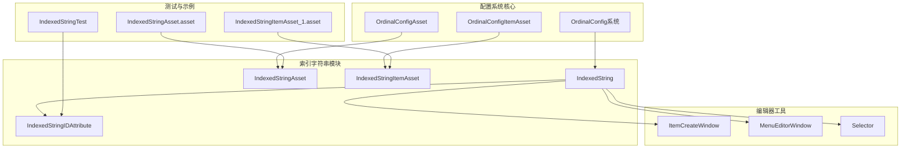
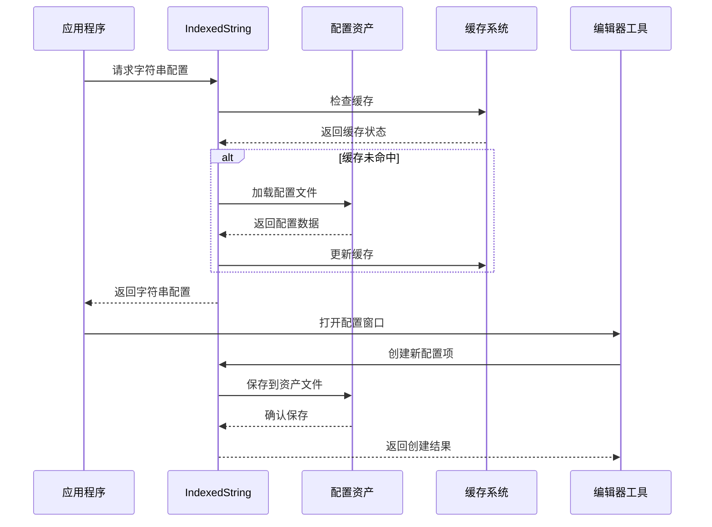
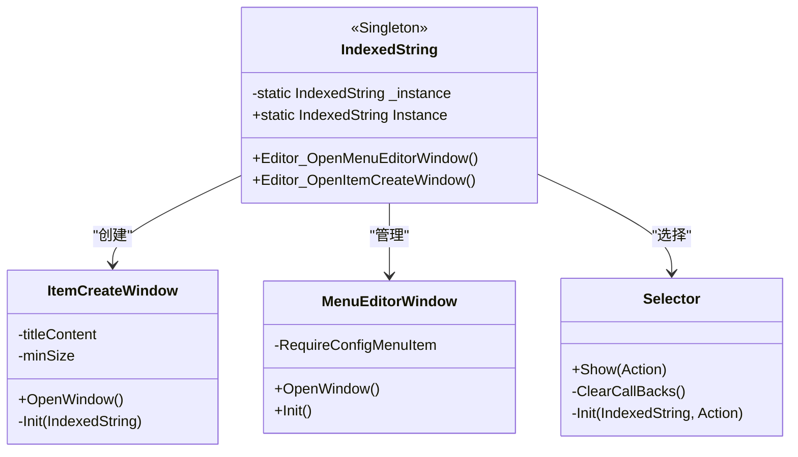
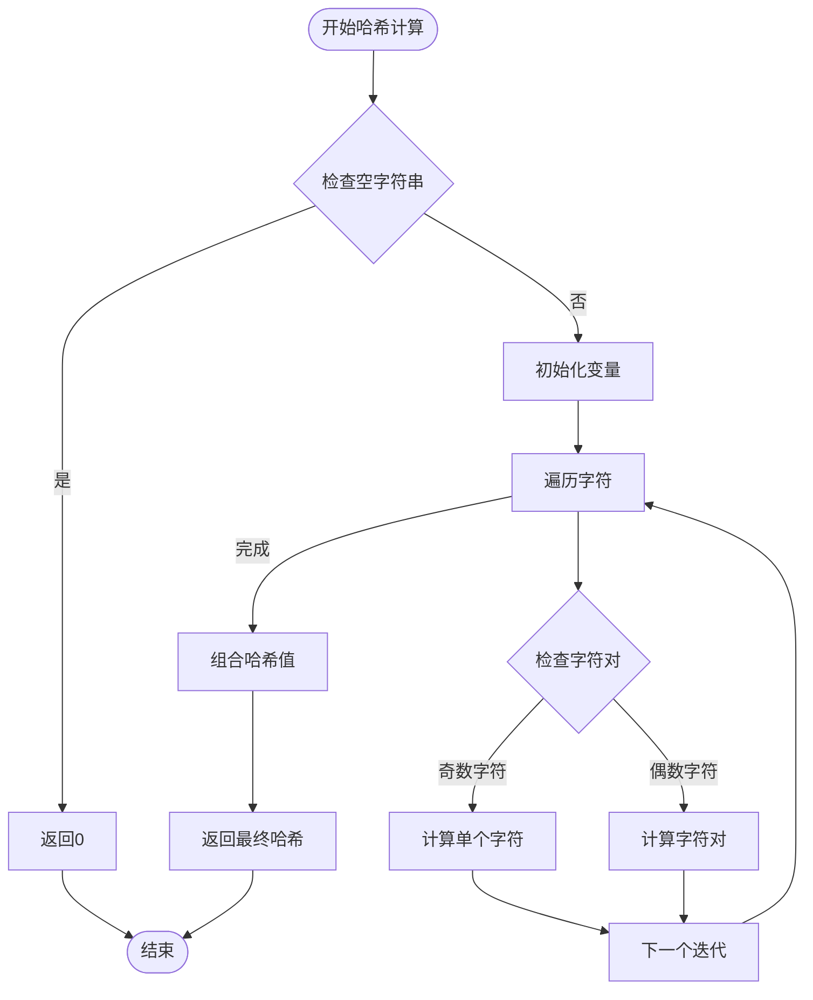
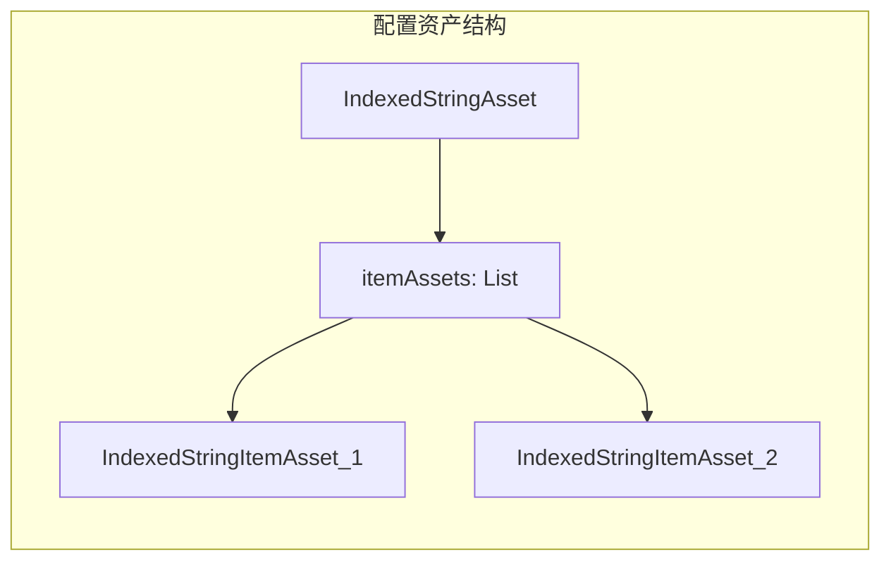
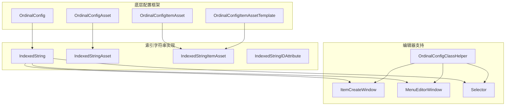

# 索引字符串配置系统

<cite>
**本文档引用的文件**
- [IndexedString.cs](file://Assets/Scripts/Config/IndexedString/IndexedString.cs)
- [IndexedStringAsset.cs](file://Assets/Scripts/Config/IndexedString/IndexedStringAsset.cs)
- [IndexedStringItemAsset.cs](file://Assets/Scripts/Config/IndexedString/IndexedStringItemAsset.cs)
- [IndexedStringIDAttribute.cs](file://Assets/Scripts/Config/IndexedString/IndexedStringIDAttribute.cs)
- [IndexedStringTest.cs](file://Assets/Dev/Lab/IndexedString/IndexedStringTest.cs)
- [IndexedStringAsset.asset](file://Assets/Dev/Config/IndexedString/IndexedStringAsset.asset)
- [IndexedStringItemAsset_1.asset](file://Assets/Dev/Config/IndexedString/IndexedStringItemAsset_1.asset)
- [OrdinalConfig.cs](file://Assets/Scripts/Systems/Implement/ConfigSystem/OrdinalConfig/OrdinalConfig.cs)
- [OrdinalConfigAsset.cs](file://Assets/Scripts/Systems/Implement/ConfigSystem/OrdinalConfig/OrdinalConfigAsset.cs)
- [OrdinalConfigItemAsset.cs](file://Assets/Scripts/Systems/Implement/ConfigSystem/OrdinalConfig/OrdinalConfigItemAsset.cs)
- [OrdinalConfigClassHelper.cs](file://Assets/Scripts/Editor/Config/OrdinalConfigClassHelper.cs)
</cite>

## 目录
1. [简介](#简介)
2. [项目结构](#项目结构)
3. [核心组件](#核心组件)
4. [架构概览](#架构概览)
5. [详细组件分析](#详细组件分析)
6. [依赖关系分析](#依赖关系分析)
7. [性能考虑](#性能考虑)
8. [故障排除指南](#故障排除指南)
9. [结论](#结论)

## 简介

ProjectR项目的索引字符串配置系统是一个基于顺序表配置模式的国际化字符串管理系统。该系统通过IndexedString类提供统一的字符串索引和访问接口，支持多语言字符串的组织、索引管理和动态加载。

系统的核心特性包括：
- 基于有序列表的配置存储机制
- 国际化字符串的索引管理
- 动态字符串加载和缓存策略
- 编辑器友好的配置工具链
- 哈希值验证和数据完整性保证

## 项目结构

索引字符串配置系统在项目中的组织结构如下：



**图表来源**
- [IndexedString.cs:1-58](file://Assets/Scripts/Config/IndexedString/IndexedString.cs#L1-L58)
- [IndexedStringAsset.cs:1-9](file://Assets/Scripts/Config/IndexedString/IndexedStringAsset.cs#L1-L9)
- [IndexedStringItemAsset.cs:1-71](file://Assets/Scripts/Config/IndexedString/IndexedStringItemAsset.cs#L1-L71)

**章节来源**
- [IndexedString.cs:1-58](file://Assets/Scripts/Config/IndexedString/IndexedString.cs#L1-L58)
- [IndexedStringAsset.cs:1-9](file://Assets/Scripts/Config/IndexedString/IndexedStringAsset.cs#L1-L9)
- [IndexedStringItemAsset.cs:1-71](file://Assets/Scripts/Config/IndexedString/IndexedStringItemAsset.cs#L1-L71)

## 核心组件

### IndexedString类
IndexedString是索引字符串配置系统的核心控制器，继承自OrdinalConfig泛型基类，提供了完整的配置管理功能。

主要功能特性：
- 单例模式实现确保全局唯一性
- 编辑器集成的配置窗口系统
- 字符串项的创建、编辑和选择工具
- 配置验证和错误处理机制

### IndexedStringAsset类
IndexedStringAsset作为配置资产容器，继承自OrdinalConfigAsset基类，负责管理所有IndexedStringItemAsset实例的集合。

关键属性：
- itemAssets: 存储所有字符串配置项的列表
- 支持动态添加和移除配置项
- 编辑器模式下的自定义添加功能

### IndexedStringItemAsset类
IndexedStringItemAsset是具体的字符串配置项实现，继承自OrdinalConfigItemAssetTemplate基类。

核心字段：
- _stringValue: 实际的字符串值（支持多语言）
- _hashCode: 基于字符串内容的确定性哈希值
- 自动化的哈希值计算和验证

**章节来源**
- [IndexedString.cs:6-56](file://Assets/Scripts/Config/IndexedString/IndexedString.cs#L6-L56)
- [IndexedStringAsset.cs:4-7](file://Assets/Scripts/Config/IndexedString/IndexedStringAsset.cs#L4-L7)
- [IndexedStringItemAsset.cs:7-44](file://Assets/Scripts/Config/IndexedString/IndexedStringItemAsset.cs#L7-L44)

## 架构概览

索引字符串配置系统采用分层架构设计，结合了配置系统的基础框架和特定的字符串管理需求：

```mermaid
graph TD
subgraph "应用层"
APP[应用程序代码]
TEST[IndexedStringTest]
end
subgraph "配置管理层"
IS[IndexedString]
CACHE[配置缓存]
VALID[验证器]
end
subgraph "数据层"
ASSET[IndexedStringAsset]
ITEMS[IndexedStringItemAsset[]]
HASH[哈希映射]
end
subgraph "编辑器层"
CREATE[创建窗口]
EDIT[编辑窗口]
SELECT[选择器]
end
APP --> IS
TEST --> IS
IS --> CACHE
IS --> VALID
IS --> ASSET
ASSET --> ITEMS
ITEMS --> HASH
IS --> CREATE
IS --> EDIT
IS --> SELECT
```

**图表来源**
- [IndexedString.cs:8-56](file://Assets/Scripts/Config/IndexedString/IndexedString.cs#L8-L56)
- [OrdinalConfig.cs:22-68](file://Assets/Scripts/Systems/Implement/ConfigSystem/OrdinalConfig/OrdinalConfig.cs#L22-L68)

系统的工作流程：



**图表来源**
- [IndexedString.cs:15-54](file://Assets/Scripts/Config/IndexedString/IndexedString.cs#L15-L54)
- [OrdinalConfig.cs:75-97](file://Assets/Scripts/Systems/Implement/ConfigSystem/OrdinalConfig/OrdinalConfig.cs#L75-L97)

## 详细组件分析

### IndexedString类详细分析

IndexedString类实现了完整的配置管理生命周期：



**图表来源**
- [IndexedString.cs:25-54](file://Assets/Scripts/Config/IndexedString/IndexedString.cs#L25-L54)

#### 编辑器窗口系统
系统提供了三个主要的编辑器窗口：

1. **菜单编辑器窗口(MenuEditorWindow)**: 提供配置项的集中管理界面
2. **项目创建窗口(ItemCreateWindow)**: 专门用于创建新的字符串配置项
3. **选择器(Selector)**: 提供配置项的选择和回调机制

### IndexedStringItemAsset配置格式

IndexedStringItemAsset采用了标准化的配置格式：

```mermaid
erDiagram
IndexedStringItemAsset {
int _id PK
string _name
string _stringValue
int _hashCode
bool Valid
string Name
}
HashUtility {
int GetDeterministicHashCode(string str)
}
IndexedStringItemAsset ||--|| HashUtility : "使用"
```

**图表来源**
- [IndexedStringItemAsset.cs:7-44](file://Assets/Scripts/Config/IndexedString/IndexedStringItemAsset.cs#L7-L44)
- [IndexedStringItemAsset.cs:46-69](file://Assets/Scripts/Config/IndexedString/IndexedStringItemAsset.cs#L46-L69)

配置项的关键属性：
- **ID**: 唯一标识符，必须大于0
- **Name**: 显示名称，通常与StringValue相同
- **StringValue**: 实际的字符串内容，支持多语言
- **hashCode**: 基于字符串内容的哈希值，用于快速查找和验证

### 哈希系统实现

系统使用了自定义的确定性哈希算法：



**图表来源**
- [IndexedStringItemAsset.cs:48-69](file://Assets/Scripts/Config/IndexedString/IndexedStringItemAsset.cs#L48-L69)

**章节来源**
- [IndexedStringItemAsset.cs:17-43](file://Assets/Scripts/Config/IndexedString/IndexedStringItemAsset.cs#L17-L43)
- [IndexedStringItemAsset.cs:48-69](file://Assets/Scripts/Config/IndexedString/IndexedStringItemAsset.cs#L48-L69)

### 配置资产管理

配置资产文件采用了标准的Unity资源格式：



**图表来源**
- [IndexedStringAsset.asset:24-25](file://Assets/Dev/Config/IndexedString/IndexedStringAsset.asset#L24-L25)
- [IndexedStringItemAsset_1.asset:24-27](file://Assets/Dev/Config/IndexedString/IndexedStringItemAsset_1.asset#L24-L27)

**章节来源**
- [IndexedStringAsset.asset:1-26](file://Assets/Dev/Config/IndexedString/IndexedStringAsset.asset#L1-L26)
- [IndexedStringItemAsset_1.asset:1-28](file://Assets/Dev/Config/IndexedString/IndexedStringItemAsset_1.asset#L1-L28)

## 依赖关系分析

索引字符串配置系统与底层配置框架的依赖关系：



**图表来源**
- [IndexedString.cs:6-56](file://Assets/Scripts/Config/IndexedString/IndexedString.cs#L6-L56)
- [OrdinalConfig.cs:17-21](file://Assets/Scripts/Systems/Implement/ConfigSystem/OrdinalConfig/OrdinalConfig.cs#L17-L21)

### 关键依赖关系

1. **继承关系**: IndexedString → OrdinalConfig
2. **聚合关系**: IndexedStringAsset → List<IndexedStringItemAsset>
3. **组合关系**: IndexedStringItemAsset → OrdinalConfigItemAssetTemplate
4. **编辑器依赖**: 窗口类 → OrdinalConfig窗口基类

**章节来源**
- [OrdinalConfig.cs:17-21](file://Assets/Scripts/Systems/Implement/ConfigSystem/OrdinalConfig/OrdinalConfig.cs#L17-L21)
- [OrdinalConfigAsset.cs:7-11](file://Assets/Scripts/Systems/Implement/ConfigSystem/OrdinalConfig/OrdinalConfigAsset.cs#L7-L11)
- [OrdinalConfigItemAsset.cs:7-17](file://Assets/Scripts/Systems/Implement/ConfigSystem/OrdinalConfig/OrdinalConfigItemAsset.cs#L7-L17)

## 性能考虑

### 缓存策略

系统采用了两级缓存机制来优化性能：

1. **内存缓存**: 使用Dictionary<int, TItem>进行O(1)的ID到对象映射
2. **配置缓存**: OrdinalConfig基类提供的配置加载缓存

### 内存管理最佳实践

1. **懒加载**: 配置项按需加载，避免启动时的大量内存占用
2. **字典查找**: 使用哈希表实现快速的配置项检索
3. **资源释放**: 提供Reset方法清理缓存和引用

### 性能优化建议

1. **批量操作**: 对于大量配置项的操作，考虑使用批量处理减少内存分配
2. **延迟初始化**: 避免在构造函数中进行复杂的初始化操作
3. **对象池**: 对频繁创建销毁的对象考虑使用对象池模式

## 故障排除指南

### 常见问题及解决方案

#### 配置项验证失败
**问题**: IndexedStringItemAsset的Valid属性返回false
**原因**: 字符串值为空或哈希值无效
**解决**: 检查字符串内容并重新计算哈希值

#### ID重复错误
**问题**: 控制台出现重复ID的错误日志
**解决**: 检查配置项的ID分配，确保每个ID的唯一性

#### 编辑器窗口无法打开
**问题**: 菜单项不可用或窗口无法显示
**解决**: 确保IndexedString类正确继承OrdinalConfig基类

### 调试工具

系统提供了多种调试和验证工具：

1. **哈希值重新计算**: 通过Editor_RecalculateHash方法更新哈希值
2. **配置验证**: 通过Valid属性检查配置项的有效性
3. **编辑器日志**: 利用Debug.Log输出详细的配置信息

**章节来源**
- [IndexedStringItemAsset.cs:20-30](file://Assets/Scripts/Config/IndexedString/IndexedStringItemAsset.cs#L20-L30)
- [OrdinalConfig.cs:49-56](file://Assets/Scripts/Systems/Implement/ConfigSystem/OrdinalConfig/OrdinalConfig.cs#L49-L56)

## 结论

ProjectR项目的索引字符串配置系统通过精心设计的架构实现了高效的多语言字符串管理。系统的主要优势包括：

1. **模块化设计**: 清晰的层次结构便于维护和扩展
2. **性能优化**: 采用缓存和哈希映射确保快速访问
3. **编辑器集成**: 完善的编辑器工具提升开发效率
4. **数据完整性**: 哈希值验证和配置验证确保数据质量

该系统为ProjectR项目提供了可靠的字符串配置基础，支持未来的国际化扩展和性能优化需求。通过遵循本文档的最佳实践，开发者可以有效地使用和维护这个配置系统。