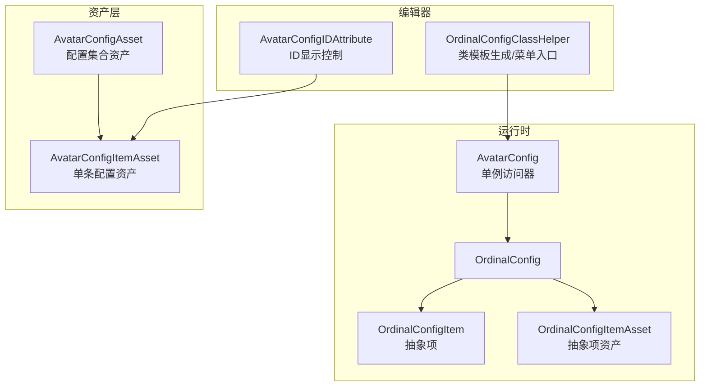
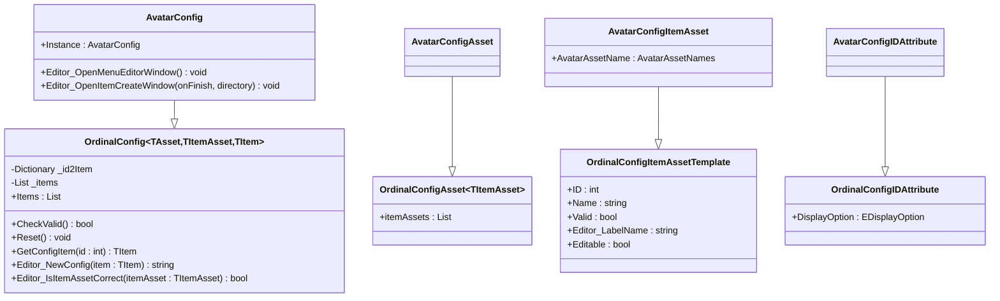
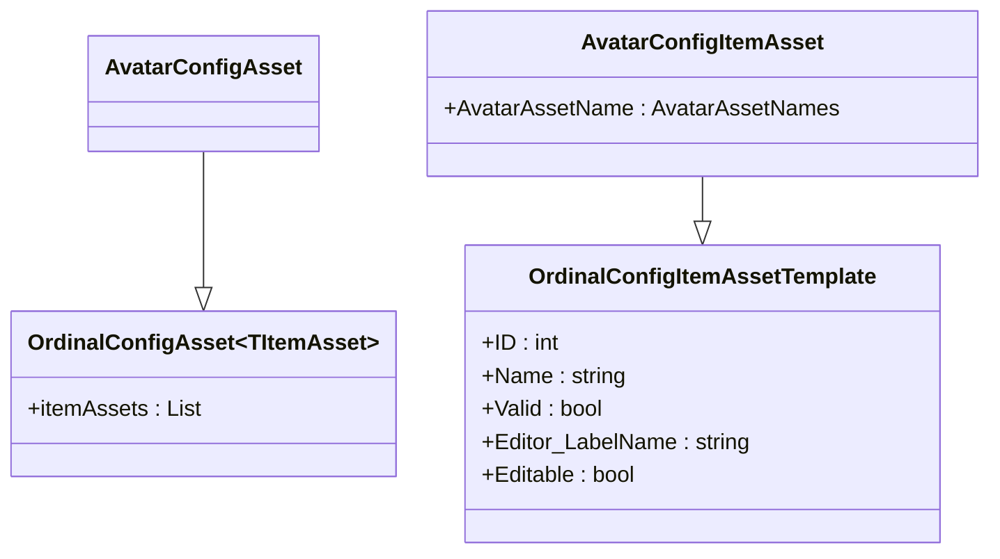
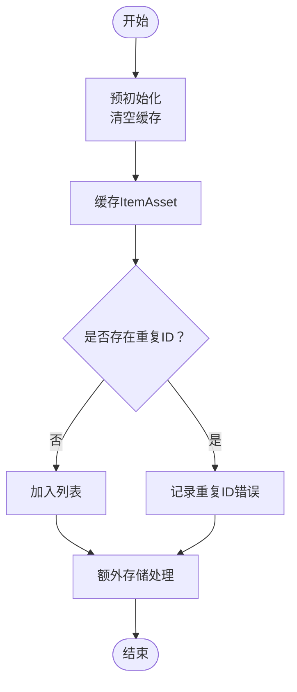
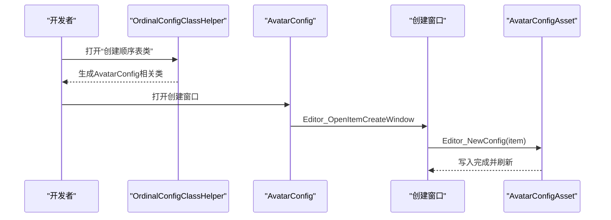
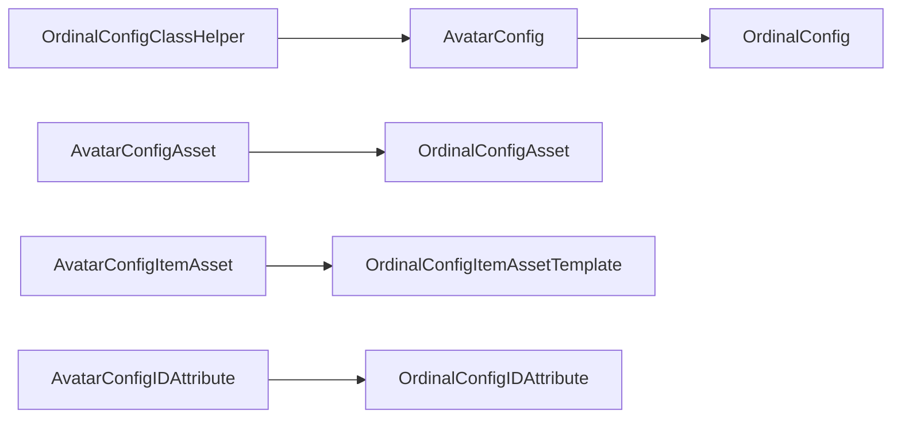

# 角色配置系统

<cite>
**本文引用的文件**
- [AvatarConfig.cs](file://Assets/Scripts/Config/AvatarConfig/AvatarConfig.cs)
- [AvatarConfigAsset.cs](file://Assets/Scripts/Config/AvatarConfig/AvatarConfigAsset.cs)
- [AvatarConfigItemAsset.cs](file://Assets/Scripts/Config/AvatarConfig/AvatarConfigItemAsset.cs)
- [AvatarConfigIDAttribute.cs](file://Assets/Scripts/Config/AvatarConfig/AvatarConfigIDAttribute.cs)
- [OrdinalConfig.cs](file://Assets/Scripts/Systems/Implement/ConfigSystem/OrdinalConfig/OrdinalConfig.cs)
- [OrdinalConfigItemAsset.cs](file://Assets/Scripts/Systems/Implement/ConfigSystem/OrdinalConfig/OrdinalConfigItemAsset.cs)
- [OrdinalConfigItem.cs](file://Assets/Scripts/Systems/Implement/ConfigSystem/OrdinalConfig/OrdinalConfigItem.cs)
- [OrdinalConfigIDAttribute.cs](file://Assets/Scripts/Systems/Implement/ConfigSystem/OrdinalConfig/OrdinalConfigIDAttribute.cs)
- [OrdinalConfigClassHelper.cs](file://Assets/Scripts/Editor/Config/OrdinalConfigClassHelper.cs)
- [AvatarConfigAsset.asset](file://Assets/Dev/Config/AvatarConfig/AvatarConfigAsset.asset)
- [AvatarConfigItemAsset_20250911_112549_406.asset](file://Assets/Dev/Config/AvatarConfig/AvatarConfigItemAsset_20250911_112549_406.asset)
- [__OrdinalConfig.cs](file://Assets/Resources/OrdinalConfigTemplate/__OrdinalConfig.cs)
- [__OrdinalConfigAsset.cs](file://Assets/Resources/OrdinalConfigTemplate/__OrdinalConfigAsset.cs)
- [__OrdinalConfigItemAsset.cs](file://Assets/Resources/OrdinalConfigTemplate/__OrdinalConfigItemAsset.cs)
- [__OrdinalConfigIDAttribute.cs](file://Assets/Resources/OrdinalConfigTemplate/__OrdinalConfigIDAttribute.cs)
</cite>

## 目录
1. [简介](#简介)
2. [项目结构](#项目结构)
3. [核心组件](#核心组件)
4. [架构总览](#架构总览)
5. [详细组件分析](#详细组件分析)
6. [依赖关系分析](#依赖关系分析)
7. [性能考虑](#性能考虑)
8. [故障排查指南](#故障排查指南)
9. [结论](#结论)
10. [附录](#附录)

## 简介
本文件面向ProjectR项目的角色配置系统，聚焦AvatarConfig的实现原理与使用方法，涵盖角色属性定义、配置数据结构、加载机制、ID管理、属性映射与数据校验规则，并提供创建流程、编辑工具使用方法与最佳实践。同时给出动态修改、热更新与版本兼容性处理建议，以及配置系统的API接口、参数规范与错误处理机制。

## 项目结构
AvatarConfig位于配置系统“顺序表配置”框架之上，采用分层设计：
- 配置资产层：AvatarConfigAsset（配置集合）、AvatarConfigItemAsset（单条配置）
- 运行时层：AvatarConfig（单例运行时访问器），继承自通用顺序表配置基类OrdinalConfig
- 编辑器工具：通过OrdinalConfigClassHelper生成模板类，提供菜单入口与创建窗口
- 资源文件：Dev/Config/AvatarConfig目录下存放AvatarConfigAsset与若干AvatarConfigItemAsset资源



**图表来源**
- [AvatarConfig.cs:1-49](file://Assets/Scripts/Config/AvatarConfig/AvatarConfig.cs#L1-L49)
- [OrdinalConfig.cs:17-126](file://Assets/Scripts/Systems/Implement/ConfigSystem/OrdinalConfig/OrdinalConfig.cs#L17-L126)
- [OrdinalConfigItem.cs:1-36](file://Assets/Scripts/Systems/Implement/ConfigSystem/OrdinalConfig/OrdinalConfigItem.cs#L1-L36)
- [OrdinalConfigItemAsset.cs:1-56](file://Assets/Scripts/Systems/Implement/ConfigSystem/OrdinalConfig/OrdinalConfigItemAsset.cs#L1-L56)
- [AvatarConfigAsset.cs:1-8](file://Assets/Scripts/Config/AvatarConfig/AvatarConfigAsset.cs#L1-L8)
- [AvatarConfigItemAsset.cs:1-12](file://Assets/Scripts/Config/AvatarConfig/AvatarConfigItemAsset.cs#L1-L12)
- [OrdinalConfigClassHelper.cs:1-240](file://Assets/Scripts/Editor/Config/OrdinalConfigClassHelper.cs#L1-L240)
- [AvatarConfigIDAttribute.cs:1-13](file://Assets/Scripts/Config/AvatarConfig/AvatarConfigIDAttribute.cs#L1-L13)

**章节来源**
- [AvatarConfig.cs:1-49](file://Assets/Scripts/Config/AvatarConfig/AvatarConfig.cs#L1-L49)
- [AvatarConfigAsset.cs:1-8](file://Assets/Scripts/Config/AvatarConfig/AvatarConfigAsset.cs#L1-L8)
- [AvatarConfigItemAsset.cs:1-12](file://Assets/Scripts/Config/AvatarConfig/AvatarConfigItemAsset.cs#L1-L12)
- [OrdinalConfig.cs:17-126](file://Assets/Scripts/Systems/Implement/ConfigSystem/OrdinalConfig/OrdinalConfig.cs#L17-L126)
- [OrdinalConfigItemAsset.cs:1-56](file://Assets/Scripts/Systems/Implement/ConfigSystem/OrdinalConfig/OrdinalConfigItemAsset.cs#L1-L56)
- [OrdinalConfigItem.cs:1-36](file://Assets/Scripts/Systems/Implement/ConfigSystem/OrdinalConfig/OrdinalConfigItem.cs#L1-L36)
- [OrdinalConfigClassHelper.cs:1-240](file://Assets/Scripts/Editor/Config/OrdinalConfigClassHelper.cs#L1-L240)
- [AvatarConfigAsset.asset](file://Assets/Dev/Config/AvatarConfig/AvatarConfigAsset.asset)
- [AvatarConfigItemAsset_20250911_112549_406.asset](file://Assets/Dev/Config/AvatarConfig/AvatarConfigItemAsset_20250911_112549_406.asset)

## 核心组件
- AvatarConfig：继承自OrdinalConfig，提供AvatarConfigAsset与AvatarConfigItemAsset的类型化访问，内置编辑器窗口入口（菜单、创建、选择器）。
- AvatarConfigAsset：继承自OrdinalConfigAsset<TItemAsset>，作为配置集合资产容器。
- AvatarConfigItemAsset：继承自OrdinalConfigItemAssetTemplate，封装具体角色配置项（如AvatarAssetName等字段）。
- AvatarConfigIDAttribute：继承自OrdinalConfigIDAttribute，用于在编辑器中控制ID字段的显示与交互行为。
- OrdinalConfig<TAsset,TItemAsset,TItem>：泛型顺序表配置基类，负责ID到项的映射、缓存、校验与编辑器操作。
- OrdinalConfigItem/OrdinalConfigItemAsset：抽象项与抽象项资产，统一ID、名称、有效性与编辑状态。

关键职责与特性
- ID管理：通过OrdinalConfig基类维护字典与列表，确保唯一性并支持按ID快速查询。
- 属性映射：AvatarConfigItemAsset暴露AvatarAssetName等角色属性，供运行时使用。
- 数据校验：基类提供Valid检查与重复ID日志输出；ItemAsset层提供Valid与Editable控制。
- 编辑器集成：提供菜单项、创建窗口、选择器窗口，支持一键生成配置项资产。

**章节来源**
- [AvatarConfig.cs:6-49](file://Assets/Scripts/Config/AvatarConfig/AvatarConfig.cs#L6-L49)
- [AvatarConfigAsset.cs:3-7](file://Assets/Scripts/Config/AvatarConfig/AvatarConfigAsset.cs#L3-L7)
- [AvatarConfigItemAsset.cs:5-12](file://Assets/Scripts/Config/AvatarConfig/AvatarConfigItemAsset.cs#L5-L12)
- [AvatarConfigIDAttribute.cs:5-12](file://Assets/Scripts/Config/AvatarConfig/AvatarConfigIDAttribute.cs#L5-L12)
- [OrdinalConfig.cs:22-68](file://Assets/Scripts/Systems/Implement/ConfigSystem/OrdinalConfig/OrdinalConfig.cs#L22-L68)
- [OrdinalConfigItemAsset.cs:30-56](file://Assets/Scripts/Systems/Implement/ConfigSystem/OrdinalConfig/OrdinalConfigItemAsset.cs#L30-L56)
- [OrdinalConfigItem.cs:7-36](file://Assets/Scripts/Systems/Implement/ConfigSystem/OrdinalConfig/OrdinalConfigItem.cs#L7-L36)

## 架构总览
AvatarConfig基于“顺序表配置”通用框架，形成“资产-项-运行时”的三层结构。运行时通过AvatarConfig单例访问配置集合，编辑器通过菜单与窗口生成与管理配置资产。



**图表来源**
- [OrdinalConfig.cs:17-126](file://Assets/Scripts/Systems/Implement/ConfigSystem/OrdinalConfig/OrdinalConfig.cs#L17-L126)
- [AvatarConfig.cs:6-49](file://Assets/Scripts/Config/AvatarConfig/AvatarConfig.cs#L6-L49)
- [AvatarConfigAsset.cs:3-7](file://Assets/Scripts/Config/AvatarConfig/AvatarConfigAsset.cs#L3-L7)
- [AvatarConfigItemAsset.cs:5-12](file://Assets/Scripts/Config/AvatarConfig/AvatarConfigItemAsset.cs#L5-L12)
- [OrdinalConfigItemAsset.cs:19-56](file://Assets/Scripts/Systems/Implement/ConfigSystem/OrdinalConfig/OrdinalConfigItemAsset.cs#L19-L56)
- [AvatarConfigIDAttribute.cs:5-12](file://Assets/Scripts/Config/AvatarConfig/AvatarConfigIDAttribute.cs#L5-L12)
- [OrdinalConfigIDAttribute.cs:6-30](file://Assets/Scripts/Systems/Implement/ConfigSystem/OrdinalConfig/OrdinalConfigIDAttribute.cs#L6-L30)

## 详细组件分析

### AvatarConfig：运行时访问与编辑器集成
- 单例模式：通过静态Instance提供全局访问。
- 编辑器窗口：
  - 打开菜单配置窗口：Editor_OpenMenuEditorWindow()
  - 打开创建窗口：Editor_OpenItemCreateWindow(onFinish, directory)
  - 提供Selector选择器窗口，便于在编辑器中选择配置项。
- 继承自OrdinalConfig，复用其ID映射、缓存与校验逻辑。

```mermaid
sequenceDiagram
participant Dev as "开发者"
participant AC as "AvatarConfig"
participant Menu as "菜单窗口"
participant Create as "创建窗口"
participant Asset as "AvatarConfigAsset"
Dev->>AC : 调用 Editor_OpenMenuEditorWindow()
AC->>Menu : 打开菜单窗口
Dev->>AC : 调用 Editor_OpenItemCreateWindow(onFinish, dir)
AC->>Create : 打开创建窗口
Create->>Asset : 生成AvatarConfigItemAsset并写入集合
Asset-->>Create : 刷新配置
```

**图表来源**
- [AvatarConfig.cs:12-36](file://Assets/Scripts/Config/AvatarConfig/AvatarConfig.cs#L12-L36)
- [OrdinalConfig.cs:75-97](file://Assets/Scripts/Systems/Implement/ConfigSystem/OrdinalConfig/OrdinalConfig.cs#L75-L97)

**章节来源**
- [AvatarConfig.cs:8-49](file://Assets/Scripts/Config/AvatarConfig/AvatarConfig.cs#L8-L49)

### AvatarConfigAsset 与 AvatarConfigItemAsset：数据结构与差异
- AvatarConfigAsset
  - 类型：OrdinalConfigAsset<AvatarConfigItemAsset>
  - 作用：承载AvatarConfigItemAsset集合，作为配置集合的容器。
- AvatarConfigItemAsset
  - 类型：OrdinalConfigItemAssetTemplate
  - 字段：包含AvatarAssetName等角色属性，提供只读访问器。
  - 基类能力：ID、Name、Valid、Editor_LabelName、Editable等统一管理。



**图表来源**
- [AvatarConfigAsset.cs:3-7](file://Assets/Scripts/Config/AvatarConfig/AvatarConfigAsset.cs#L3-L7)
- [AvatarConfigItemAsset.cs:5-12](file://Assets/Scripts/Config/AvatarConfig/AvatarConfigItemAsset.cs#L5-L12)
- [OrdinalConfigItemAsset.cs:19-56](file://Assets/Scripts/Systems/Implement/ConfigSystem/OrdinalConfig/OrdinalConfigItemAsset.cs#L19-L56)

**章节来源**
- [AvatarConfigAsset.cs:3-7](file://Assets/Scripts/Config/AvatarConfig/AvatarConfigAsset.cs#L3-L7)
- [AvatarConfigItemAsset.cs:5-12](file://Assets/Scripts/Config/AvatarConfig/AvatarConfigItemAsset.cs#L5-L12)
- [OrdinalConfigItemAsset.cs:19-56](file://Assets/Scripts/Systems/Implement/ConfigSystem/OrdinalConfig/OrdinalConfigItemAsset.cs#L19-L56)

### ID管理、属性映射与数据验证
- ID管理
  - OrdinalConfig在缓存阶段对重复ID进行检测并输出错误日志。
  - 支持按ID快速查询配置项。
- 属性映射
  - AvatarConfigItemAsset暴露AvatarAssetName等角色属性，供运行时使用。
  - 基类提供ID/Name/Valid/Editable等统一字段，便于编辑器与运行时一致处理。
- 数据验证
  - Item层Valid默认要求ID>0；Asset层Valid由item.Valid决定。
  - 编辑器侧Editor_IsItemAssetCorrect校验item是否为空。



**图表来源**
- [OrdinalConfig.cs:25-46](file://Assets/Scripts/Systems/Implement/ConfigSystem/OrdinalConfig/OrdinalConfig.cs#L25-L46)

**章节来源**
- [OrdinalConfig.cs:34-46](file://Assets/Scripts/Systems/Implement/ConfigSystem/OrdinalConfig/OrdinalConfig.cs#L34-L46)
- [OrdinalConfigItemAsset.cs:30-42](file://Assets/Scripts/Systems/Implement/ConfigSystem/OrdinalConfig/OrdinalConfigItemAsset.cs#L30-L42)
- [OrdinalConfigItem.cs:17-25](file://Assets/Scripts/Systems/Implement/ConfigSystem/OrdinalConfig/OrdinalConfigItem.cs#L17-L25)

### 编辑器工具与创建流程
- 类模板生成
  - 通过OrdinalConfigClassHelper提供的“创建顺序表类”菜单，基于模板生成AvatarConfig所需类文件。
- 创建配置项
  - AvatarConfig提供Editor_OpenItemCreateWindow，打开创建窗口，调用Editor_NewConfig生成AvatarConfigItemAsset并写入集合。
- 菜单入口
  - 提供“配置窗口/AvatarConfig”菜单项，打开菜单编辑窗口。
- 选择器
  - Selector窗口用于在编辑器中选择配置项，回调onChanged。



**图表来源**
- [OrdinalConfigClassHelper.cs:201-216](file://Assets/Scripts/Editor/Config/OrdinalConfigClassHelper.cs#L201-L216)
- [AvatarConfig.cs:14-26](file://Assets/Scripts/Config/AvatarConfig/AvatarConfig.cs#L14-L26)
- [OrdinalConfig.cs:75-97](file://Assets/Scripts/Systems/Implement/ConfigSystem/OrdinalConfig/OrdinalConfig.cs#L75-L97)

**章节来源**
- [OrdinalConfigClassHelper.cs:13-240](file://Assets/Scripts/Editor/Config/OrdinalConfigClassHelper.cs#L13-L240)
- [AvatarConfig.cs:12-36](file://Assets/Scripts/Config/AvatarConfig/AvatarConfig.cs#L12-L36)
- [OrdinalConfig.cs:75-125](file://Assets/Scripts/Systems/Implement/ConfigSystem/OrdinalConfig/OrdinalConfig.cs#L75-L125)

### API接口、参数规范与错误处理
- AvatarConfig
  - Editor_OpenMenuEditorWindow()：打开菜单配置窗口
  - Editor_OpenItemCreateWindow(onFinish, directory)：打开创建窗口
  - GetConfigItem(id)：按ID获取配置项（运行时）
  - CheckValid()：校验配置是否有效
  - Reset()：重置内部缓存
- AvatarConfigItemAsset
  - ID/Name/Valid/Editor_LabelName/Editable：统一字段
  - AvatarAssetName：角色资产名称（只读）
- 错误处理
  - 重复ID：记录错误日志
  - ItemAsset无效：Editor_IsItemAssetCorrect返回false并提示
  - 创建失败：Editor_NewConfig返回错误码或抛出异常（可选）

**章节来源**
- [AvatarConfig.cs:6-49](file://Assets/Scripts/Config/AvatarConfig/AvatarConfig.cs#L6-L49)
- [OrdinalConfig.cs:49-68](file://Assets/Scripts/Systems/Implement/ConfigSystem/OrdinalConfig/OrdinalConfig.cs#L49-L68)
- [OrdinalConfig.cs:112-123](file://Assets/Scripts/Systems/Implement/ConfigSystem/OrdinalConfig/OrdinalConfig.cs#L112-L123)
- [OrdinalConfigItemAsset.cs:30-42](file://Assets/Scripts/Systems/Implement/ConfigSystem/OrdinalConfig/OrdinalConfigItemAsset.cs#L30-L42)

## 依赖关系分析
- AvatarConfig依赖OrdinalConfig泛型基类，获得ID映射、缓存与编辑器能力。
- AvatarConfigAsset与AvatarConfigItemAsset分别继承自OrdinalConfigAsset与OrdinalConfigItemAssetTemplate，形成强类型绑定。
- AvatarConfigIDAttribute继承自OrdinalConfigIDAttribute，用于控制编辑器中ID字段的显示与交互。
- 编辑器工具OrdinalConfigClassHelper提供模板生成与菜单入口，降低配置系统使用门槛。



**图表来源**
- [AvatarConfig.cs:6-49](file://Assets/Scripts/Config/AvatarConfig/AvatarConfig.cs#L6-L49)
- [AvatarConfigAsset.cs:3-7](file://Assets/Scripts/Config/AvatarConfig/AvatarConfigAsset.cs#L3-L7)
- [AvatarConfigItemAsset.cs:5-12](file://Assets/Scripts/Config/AvatarConfig/AvatarConfigItemAsset.cs#L5-L12)
- [AvatarConfigIDAttribute.cs:5-12](file://Assets/Scripts/Config/AvatarConfig/AvatarConfigIDAttribute.cs#L5-L12)
- [OrdinalConfigClassHelper.cs:201-216](file://Assets/Scripts/Editor/Config/OrdinalConfigClassHelper.cs#L201-L216)

**章节来源**
- [AvatarConfig.cs:6-49](file://Assets/Scripts/Config/AvatarConfig/AvatarConfig.cs#L6-L49)
- [OrdinalConfigClassHelper.cs:201-216](file://Assets/Scripts/Editor/Config/OrdinalConfigClassHelper.cs#L201-L216)

## 性能考虑
- 查询复杂度：按ID查询为O(1)，适合频繁访问场景。
- 缓存策略：OrdinalConfig在预初始化阶段清空缓存，避免脏数据；初始化后复用字典与列表。
- 资产数量：建议控制配置项数量，避免过多ItemAsset导致加载与序列化成本上升。
- 编辑器刷新：批量创建或修改后，注意触发刷新以减少多次AssetDatabase操作带来的开销。

[本节为通用指导，无需特定文件引用]

## 故障排查指南
- 重复ID问题
  - 现象：日志出现重复ID警告
  - 处理：修正ID或迁移冲突项
- ItemAsset为空
  - 现象：Editor_IsItemAssetCorrect返回false
  - 处理：检查ItemAsset.item是否正确赋值
- 创建失败
  - 现象：Editor_NewConfig返回错误码
  - 处理：根据错误码定位问题（如命名冲突、路径非法等）
- 配置无效
  - 现象：CheckValid返回false
  - 处理：确认配置已初始化且无空引用

**章节来源**
- [OrdinalConfig.cs:38-42](file://Assets/Scripts/Systems/Implement/ConfigSystem/OrdinalConfig/OrdinalConfig.cs#L38-L42)
- [OrdinalConfig.cs:112-123](file://Assets/Scripts/Systems/Implement/ConfigSystem/OrdinalConfig/OrdinalConfig.cs#L112-L123)
- [OrdinalConfig.cs:49-56](file://Assets/Scripts/Systems/Implement/ConfigSystem/OrdinalConfig/OrdinalConfig.cs#L49-L56)

## 结论
AvatarConfig依托“顺序表配置”框架，提供了清晰的角色配置数据结构与强大的编辑器支持。通过严格的ID管理、统一的属性映射与完善的校验机制，确保了配置系统的稳定性与可维护性。配合模板生成与菜单入口，降低了使用门槛，适合在多人协作与持续迭代的项目中推广使用。

[本节为总结性内容，无需特定文件引用]

## 附录

### 最佳实践
- 使用AvatarConfigIDAttribute控制编辑器中的ID显示与交互，提升可读性与一致性。
- 在创建配置项前先检查可用ID范围，避免冲突。
- 对于大型配置集合，建议拆分为多个Asset以优化加载性能。
- 定期清理无效或废弃的配置项，保持配置库整洁。

[本节为通用指导，无需特定文件引用]

### 版本兼容性与热更新建议
- 版本控制：为配置资产添加版本号字段，运行时进行兼容性校验。
- 渐进式更新：新增字段时保留默认值，旧版本读取时忽略未知字段。
- 热更新流程：在进入关卡或场景切换时，重新加载配置资产并重建ID映射，确保一致性。

[本节为通用指导，无需特定文件引用]