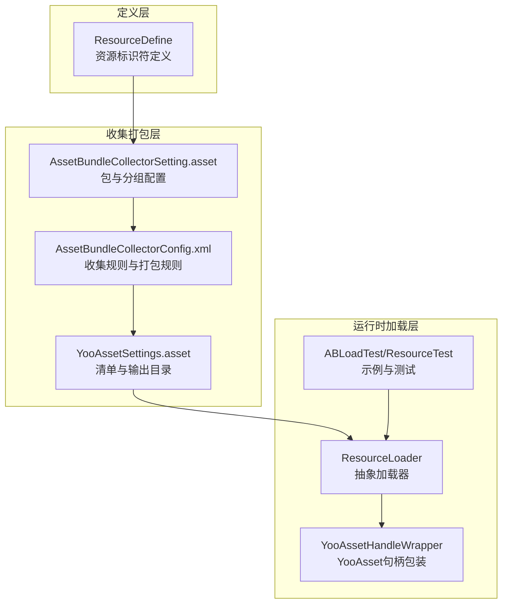
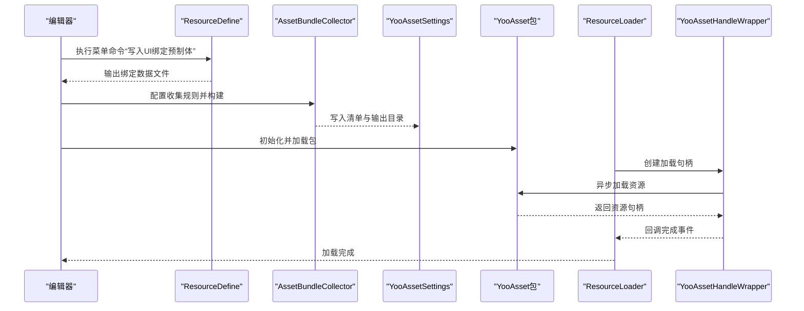
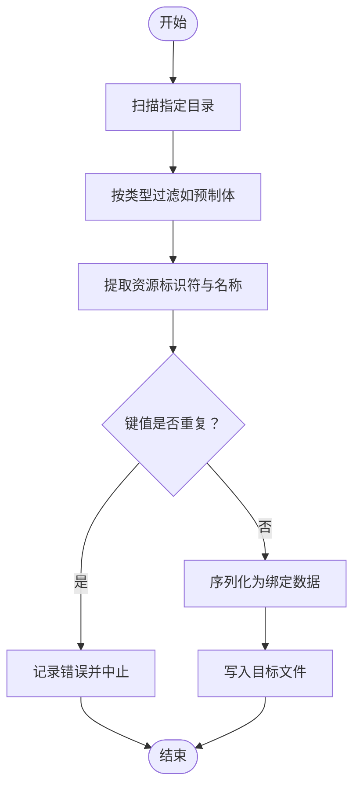
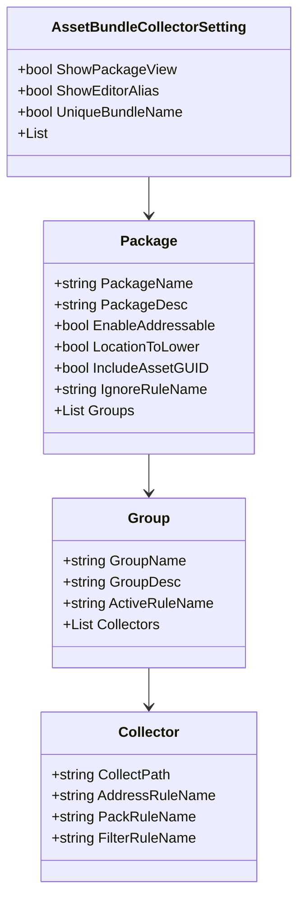
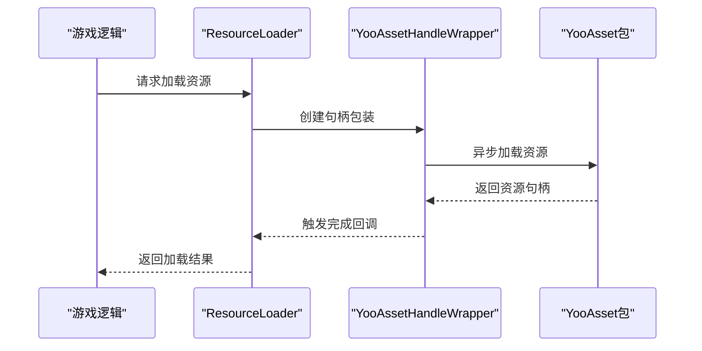
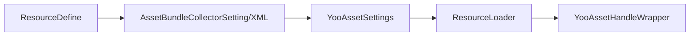

# 资源配置系统

<cite>
**本文引用的文件**
- [ResourceDefine.cs](file://Assets/Scripts/Config/Resource/ResourceDefine.cs)
- [AssetBundleCollectorSetting.asset](file://Assets/Resources/AssetBundleCollectorSetting.asset)
- [AssetBundleCollectorConfig.xml](file://Assets/Resources/AssetBundleCollectorConfig.xml)
- [YooAssetSettings.asset](file://Assets/Resources/YooAssetSettings.asset)
- [ResourceLoader.cs](file://Assets/Scripts/Systems/Implement/ResourceSystem/ResourceLoader.cs)
- [YooAssetHandleWrapper.cs](file://Assets/Scripts/Systems/Implement/ResourceSystem/YooAssetHandleWrapper.cs)
- [ABLoadTest.cs](file://Assets/Dev/Lab/Scripts/ABLoadTest.cs)
- [ResourceTest.cs](file://Assets/Dev/Lab/ResourceTest/ResourceTest.cs)
- [ResourceReference.cs](file://Assets/Dev/Lab/Scenes/ResourceReference.cs)
</cite>

## 目录
1. [简介](#简介)
2. [项目结构](#项目结构)
3. [核心组件](#核心组件)
4. [架构总览](#架构总览)
5. [详细组件分析](#详细组件分析)
6. [依赖关系分析](#依赖关系分析)
7. [性能考虑](#性能考虑)
8. [故障排查指南](#故障排查指南)
9. [结论](#结论)
10. [附录](#附录)

## 简介
本文件面向ProjectR项目的资源配置系统，聚焦以下目标：
- 深入解析ResourceDefine的资源标识符定义与命名规范（资源路径映射、类型分类、加载优先级）
- 说明资源配置的组织结构、依赖关系与版本管理策略
- 解释资源配置在YooAsset/AssetBundle系统中的作用（打包规则、加载策略、缓存机制）
- 提供资源配置的创建模板、自动扫描工具与依赖分析方法
- 给出资源系统的性能优化、内存管理与热更新支持方案

## 项目结构
资源配置系统由“定义层”“收集打包层”“运行时加载层”三部分组成：
- 定义层：通过ResourceDefine集中声明资源标识符与命名规范，提供编辑器脚本进行批量扫描与生成
- 收集打包层：通过AssetBundleCollectorSetting与AssetBundleCollectorConfig.xml定义包体分组、打包规则与过滤规则
- 运行时加载层：基于YooAsset的包与句柄封装，实现异步加载、缓存与生命周期管理

图表来源
- [ResourceDefine.cs:14-87](file://Assets/Scripts/Config/Resource/ResourceDefine.cs#L14-L87)
- [AssetBundleCollectorSetting.asset:18-62](file://Assets/Resources/AssetBundleCollectorSetting.asset#L18-L62)
- [AssetBundleCollectorConfig.xml:4-13](file://Assets/Resources/AssetBundleCollectorConfig.xml#L4-L13)
- [YooAssetSettings.asset:15-16](file://Assets/Resources/YooAssetSettings.asset#L15-L16)
- [ResourceLoader.cs:19-42](file://Assets/Scripts/Systems/Implement/ResourceSystem/ResourceLoader.cs#L19-L42)
- [YooAssetHandleWrapper.cs:11-33](file://Assets/Scripts/Systems/Implement/ResourceSystem/YooAssetHandleWrapper.cs#L11-L33)
- [ABLoadTest.cs:102-107](file://Assets/Dev/Lab/Scripts/ABLoadTest.cs#L102-L107)

章节来源
- [ResourceDefine.cs:14-87](file://Assets/Scripts/Config/Resource/ResourceDefine.cs#L14-L87)
- [AssetBundleCollectorSetting.asset:18-62](file://Assets/Resources/AssetBundleCollectorSetting.asset#L18-L62)
- [AssetBundleCollectorConfig.xml:4-13](file://Assets/Resources/AssetBundleCollectorConfig.xml#L4-L13)
- [YooAssetSettings.asset:15-16](file://Assets/Resources/YooAssetSettings.asset#L15-L16)
- [ResourceLoader.cs:19-42](file://Assets/Scripts/Systems/Implement/ResourceSystem/ResourceLoader.cs#L19-L42)
- [YooAssetHandleWrapper.cs:11-33](file://Assets/Scripts/Systems/Implement/ResourceSystem/YooAssetHandleWrapper.cs#L11-L33)
- [ABLoadTest.cs:102-107](file://Assets/Dev/Lab/Scripts/ABLoadTest.cs#L102-L107)

## 核心组件
- ResourceDefine：定义资源标识符、命名规范与编辑器扫描逻辑，支持从指定目录批量提取并生成绑定数据
- AssetBundleCollectorSetting与AssetBundleCollectorConfig.xml：定义包体分组、打包规则、地址规则与过滤规则
- YooAssetSettings：定义清单文件名与默认资源目录，影响打包产物与运行时定位
- ResourceLoader与YooAssetHandleWrapper：封装异步加载流程、状态机与句柄管理，对接YooAsset包与资源

章节来源
- [ResourceDefine.cs:14-87](file://Assets/Scripts/Config/Resource/ResourceDefine.cs#L14-L87)
- [AssetBundleCollectorSetting.asset:18-62](file://Assets/Resources/AssetBundleCollectorSetting.asset#L18-L62)
- [AssetBundleCollectorConfig.xml:4-13](file://Assets/Resources/AssetBundleCollectorConfig.xml#L4-L13)
- [YooAssetSettings.asset:15-16](file://Assets/Resources/YooAssetSettings.asset#L15-L16)
- [ResourceLoader.cs:19-42](file://Assets/Scripts/Systems/Implement/ResourceSystem/ResourceLoader.cs#L19-L42)
- [YooAssetHandleWrapper.cs:11-33](file://Assets/Scripts/Systems/Implement/ResourceSystem/YooAssetHandleWrapper.cs#L11-L33)

## 架构总览
资源配置系统以“定义—收集—加载”为主线，形成闭环：
- 定义阶段：通过ResourceDefine的菜单命令扫描指定目录，生成资源绑定信息
- 收集打包阶段：根据AssetBundleCollectorSetting与XML配置，按分组与规则生成包体
- 运行时加载阶段：通过YooAssetSettings定位包，ResourceLoader与YooAssetHandleWrapper执行异步加载与缓存

图表来源
- [ResourceDefine.cs:16-83](file://Assets/Scripts/Config/Resource/ResourceDefine.cs#L16-L83)
- [AssetBundleCollectorSetting.asset:18-62](file://Assets/Resources/AssetBundleCollectorSetting.asset#L18-L62)
- [AssetBundleCollectorConfig.xml:4-13](file://Assets/Resources/AssetBundleCollectorConfig.xml#L4-L13)
- [YooAssetSettings.asset:15-16](file://Assets/Resources/YooAssetSettings.asset#L15-L16)
- [ResourceLoader.cs:19-42](file://Assets/Scripts/Systems/Implement/ResourceSystem/ResourceLoader.cs#L19-L42)
- [YooAssetHandleWrapper.cs:21-33](file://Assets/Scripts/Systems/Implement/ResourceSystem/YooAssetHandleWrapper.cs#L21-L33)

## 详细组件分析

### ResourceDefine：资源标识符定义与命名规范
- 功能要点
  - 编辑器菜单入口：提供“写入UI绑定预制体”菜单项，用于扫描指定目录并生成绑定数据
  - 路径映射：限定扫描范围为特定目录，确保资源路径可追踪与可维护
  - 类型分类：通过组件/UINode等标识资源类型，便于后续过滤与分组
  - 命名规范：结合AddressRuleName等规则，统一资源地址命名风格
- 使用建议
  - 在新增资源前先明确所属分组与命名规则
  - 对重复键值进行校验与日志提示，避免冲突
  - 将生成的绑定数据纳入版本控制，便于回溯

图表来源
- [ResourceDefine.cs:16-83](file://Assets/Scripts/Config/Resource/ResourceDefine.cs#L16-L83)

章节来源
- [ResourceDefine.cs:14-87](file://Assets/Scripts/Config/Resource/ResourceDefine.cs#L14-L87)

### 收集打包配置：包体分组、打包规则与过滤规则
- 包体分组（Packages/Groups）
  - Avatar/Env/UI/DevResource等分组，每组可启用/禁用，定义描述与活动规则
  - 分组下包含多个Collector，每个Collector定义收集路径、过滤规则与打包规则
- 打包规则（PackRuleName）
  - 示例：按顶层目录打包（PackTopDirectory），便于按模块解耦
- 地址规则（AddressRuleName）
  - 示例：按文件名带扩展名（AddressByFileNameWithExt），保证唯一性与可读性
- 过滤规则（FilterRuleName）
  - 示例：仅收集预制体（CollectPrefab）或全部资源（CollectAll）

图表来源
- [AssetBundleCollectorSetting.asset:18-62](file://Assets/Resources/AssetBundleCollectorSetting.asset#L18-L62)
- [AssetBundleCollectorConfig.xml:4-13](file://Assets/Resources/AssetBundleCollectorConfig.xml#L4-L13)

章节来源
- [AssetBundleCollectorSetting.asset:18-62](file://Assets/Resources/AssetBundleCollectorSetting.asset#L18-L62)
- [AssetBundleCollectorConfig.xml:4-13](file://Assets/Resources/AssetBundleCollectorConfig.xml#L4-L13)

### 运行时加载：YooAsset集成与缓存机制
- 初始化与包加载
  - 通过YooAssets初始化并获取指定包，示例代码展示了包名与生命周期管理
- 句柄封装
  - YooAssetHandleWrapper对AssetHandle/SubAssetsHandle进行封装，提供统一的加载接口
- 加载状态机
  - ResourceLoader定义了下载、加载包、加载资源、错误、完成、释放等状态，便于流程控制与调试

图表来源
- [ABLoadTest.cs:102-107](file://Assets/Dev/Lab/Scripts/ABLoadTest.cs#L102-L107)
- [YooAssetHandleWrapper.cs:21-33](file://Assets/Scripts/Systems/Implement/ResourceSystem/YooAssetHandleWrapper.cs#L21-L33)
- [ResourceLoader.cs:29-42](file://Assets/Scripts/Systems/Implement/ResourceSystem/ResourceLoader.cs#L29-L42)

章节来源
- [ABLoadTest.cs:102-107](file://Assets/Dev/Lab/Scripts/ABLoadTest.cs#L102-L107)
- [YooAssetHandleWrapper.cs:11-33](file://Assets/Scripts/Systems/Implement/ResourceSystem/YooAssetHandleWrapper.cs#L11-L33)
- [ResourceLoader.cs:19-42](file://Assets/Scripts/Systems/Implement/ResourceSystem/ResourceLoader.cs#L19-L42)

### 版本管理与清单
- 清单文件名与输出目录
  - YooAssetSettings定义了清单文件名与默认资源目录，影响打包产物与运行时定位
- 建议
  - 在多版本并行开发时，为不同版本配置独立的包名与清单文件名，避免冲突
  - 将清单文件纳入版本控制，确保构建一致性

章节来源
- [YooAssetSettings.asset:15-16](file://Assets/Resources/YooAssetSettings.asset#L15-L16)

## 依赖关系分析
- 定义层对收集打包层的依赖
  - ResourceDefine生成的数据需与Collector的过滤规则匹配，否则无法被正确收集
- 收集打包层对运行时加载层的依赖
  - 包体分组与地址规则决定运行时加载路径与资源定位
- 运行时加载层对YooAsset的依赖
  - ResourceLoader与YooAssetHandleWrapper直接依赖YooAsset的包与句柄体系

图表来源
- [ResourceDefine.cs:16-83](file://Assets/Scripts/Config/Resource/ResourceDefine.cs#L16-L83)
- [AssetBundleCollectorSetting.asset:18-62](file://Assets/Resources/AssetBundleCollectorSetting.asset#L18-L62)
- [AssetBundleCollectorConfig.xml:4-13](file://Assets/Resources/AssetBundleCollectorConfig.xml#L4-L13)
- [YooAssetSettings.asset:15-16](file://Assets/Resources/YooAssetSettings.asset#L15-L16)
- [ResourceLoader.cs:19-42](file://Assets/Scripts/Systems/Implement/ResourceSystem/ResourceLoader.cs#L19-L42)
- [YooAssetHandleWrapper.cs:11-33](file://Assets/Scripts/Systems/Implement/ResourceSystem/YooAssetHandleWrapper.cs#L11-L33)

章节来源
- [ResourceDefine.cs:14-87](file://Assets/Scripts/Config/Resource/ResourceDefine.cs#L14-L87)
- [AssetBundleCollectorSetting.asset:18-62](file://Assets/Resources/AssetBundleCollectorSetting.asset#L18-L62)
- [AssetBundleCollectorConfig.xml:4-13](file://Assets/Resources/AssetBundleCollectorConfig.xml#L4-L13)
- [YooAssetSettings.asset:15-16](file://Assets/Resources/YooAssetSettings.asset#L15-L16)
- [ResourceLoader.cs:19-42](file://Assets/Scripts/Systems/Implement/ResourceSystem/ResourceLoader.cs#L19-L42)
- [YooAssetHandleWrapper.cs:11-33](file://Assets/Scripts/Systems/Implement/ResourceSystem/YooAssetHandleWrapper.cs#L11-L33)

## 性能考虑
- 打包粒度与缓存命中
  - 合理使用“按顶层目录打包”，减少跨包依赖，提升缓存命中率
  - 对高频资源（如UI、Avatar）单独成包，降低首屏加载压力
- 异步加载与并发控制
  - 使用ResourceLoader的状态机与YooAssetHandleWrapper的句柄复用，避免重复加载
  - 控制并发加载数量，防止内存抖动
- 内存管理
  - 在不需要时及时释放资源句柄与对象实例，配合GC与卸载未使用资源
  - 对大资源（模型、纹理）采用延迟加载与池化策略
- 热更新支持
  - 通过YooAsset的清单与包名管理，实现资源增量更新
  - 对关键资源增加版本号与校验，确保热更一致性

## 故障排查指南
- 加载失败
  - 检查资源地址是否与Collector的地址规则一致
  - 确认包名与YooAssetSettings中的包名匹配
- 重复键值
  - ResourceDefine在生成绑定数据时会对重复键值进行告警，需修正后重试
- 构建异常
  - 核对AssetBundleCollectorSetting与XML中的分组与Collector配置是否完整
  - 确保过滤规则与实际资源类型匹配

章节来源
- [ResourceDefine.cs:58-62](file://Assets/Scripts/Config/Resource/ResourceDefine.cs#L58-L62)
- [ABLoadTest.cs:102-107](file://Assets/Dev/Lab/Scripts/ABLoadTest.cs#L102-L107)

## 结论
ProjectR的资源配置系统通过“定义—收集—加载”的清晰分层，实现了资源标识符的规范化、打包规则的可配置化与运行时加载的高效化。结合YooAsset的包与句柄体系，系统具备良好的扩展性与可维护性。建议在团队协作中严格执行命名规范与版本管理策略，持续优化打包粒度与加载策略，以获得更佳的性能与稳定性。

## 附录

### 创建模板与最佳实践
- 资源标识符模板
  - 在ResourceDefine中新增资源时，遵循统一的命名空间与键值规范
  - 使用编辑器菜单命令生成绑定数据，避免手工维护
- 打包规则模板
  - 按功能模块划分分组，使用“按顶层目录打包”策略
  - 对UI、Avatar等高频模块单独成包，提高缓存命中率
- 加载优先级设置
  - 通过分组与包名区分加载优先级，关键资源优先加载
  - 使用ResourceLoader的状态机进行流程控制与错误处理

### 自动扫描工具与依赖分析
- 自动扫描
  - 使用ResourceDefine提供的菜单命令，自动扫描指定目录并生成绑定数据
- 依赖分析
  - 结合Collector的过滤规则与分组，分析资源依赖关系
  - 在构建前进行依赖检查，避免遗漏与冲突