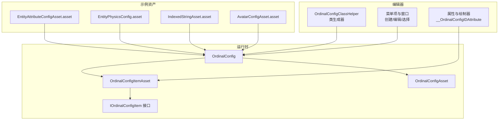
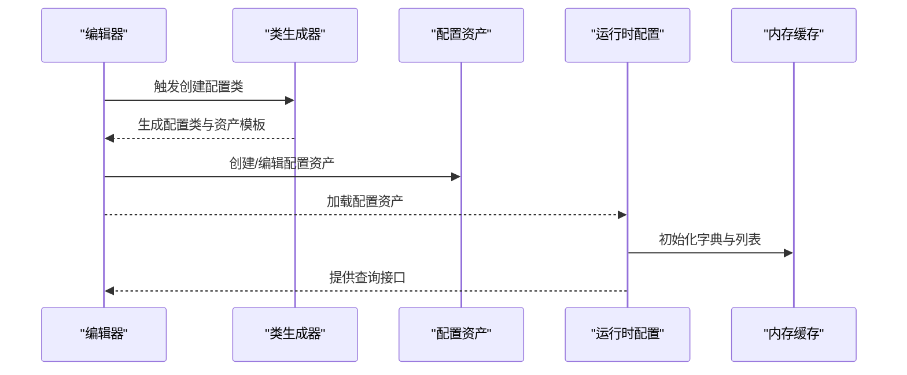
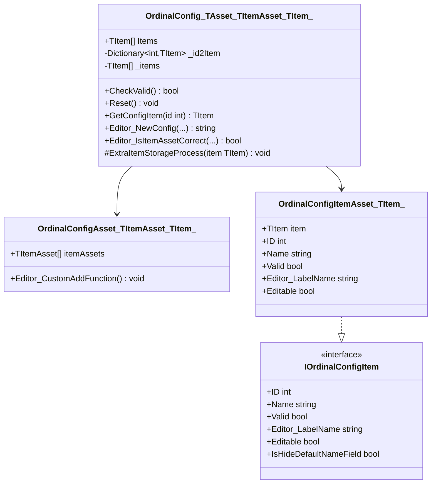
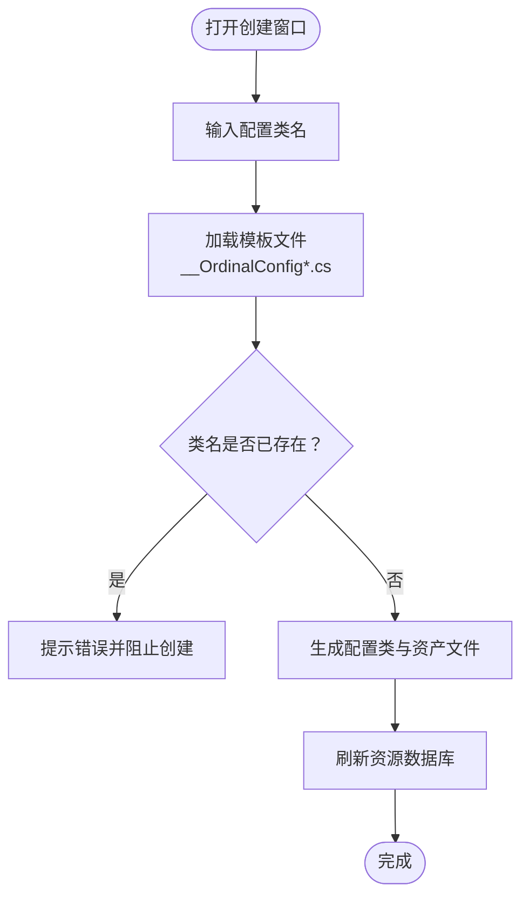
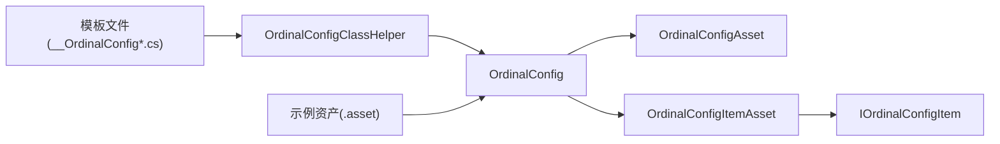

# 配置管理系统

<cite>
**本文引用的文件**
- [OrdinalConfig.cs](file://Assets/Scripts/Systems/Implement/ConfigSystem/OrdinalConfig/OrdinalConfig.cs)
- [OrdinalConfigAsset.cs](file://Assets/Scripts/Systems/Implement/ConfigSystem/OrdinalConfig/OrdinalConfigAsset.cs)
- [OrdinalConfigItemAsset.cs](file://Assets/Scripts/Systems/Implement/ConfigSystem/OrdinalConfig/OrdinalConfigItemAsset.cs)
- [OrdinalConfigClassHelper.cs](file://Assets/Scripts/Editor/Config/OrdinalConfigClassHelper.cs)
- [OrdinalConfigTest.cs](file://Assets/Dev/Lab/Scripts/OrdinalConfigTest.cs)
- [__OrdinalConfig.cs](file://Assets/Resources/OrdinalConfigTemplate/__OrdinalConfig.cs)
- [__OrdinalConfigAsset.cs](file://Assets/Resources/OrdinalConfigTemplate/__OrdinalConfigAsset.cs)
- [__OrdinalConfigItemAsset.cs](file://Assets/Resources/OrdinalConfigTemplate/__OrdinalConfigItemAsset.cs)
- [__OrdinalConfigIDAttribute.cs](file://Assets/Resources/OrdinalConfigTemplate/__OrdinalConfigIDAttribute.cs)
- [__OrdinalConfigIDAttributeDrawer.cs](file://Assets/Resources/OrdinalConfigTemplate/__OrdinalConfigIDAttributeDrawer.cs)
- [EntityAttributeConfigAsset.asset](file://Assets/Dev/Assets_/EntityAttributeConfigAsset.asset)
- [EntityPhysicsConfig.asset](file://Assets/Dev/Assets_/EntityPhysicsConfig.asset)
- [ItemConfig_Star.asset](file://Assets/Dev/Assets_/ItemConfig_Star.asset)
- [MonsterConfig_SlimeBoss.asset](file://Assets/Dev/Assets_/MonsterConfig_SlimeBoss.asset)
- [TrapConfig_Hurdle.asset](file://Assets/Dev/Assets_/TrapConfig_Hurdle.asset)
- [TrapConfig_RollingStone.asset](file://Assets/Dev/Assets_/TrapConfig_RollingStone.asset)
- [TrapConfig_RollingStoneTrigger.asset](file://Assets/Dev/Assets_/TrapConfig_RollingStoneTrigger.asset)
- [TrapConfig_RollingStoneTrigger2.asset](file://Assets/Dev/Assets_/TrapConfig_RollingStoneTrigger2.asset)
- [TrapConfig_SpeedUp.asset](file://Assets/Dev/Assets_/TrapConfig_SpeedUp.asset)
- [TrapConfig_Test.asset](file://Assets/Dev/Assets_/TrapConfig_Test.asset)
- [AvatarConfigAsset.asset](file://Assets/Dev/Config/AvatarConfig/AvatarConfigAsset.asset)
- [AvatarConfigItemAsset_20250911_112549_406.asset](file://Assets/Dev/Config/AvatarConfig/AvatarConfigItemAsset_20250911_112549_406.asset)
- [IndexedStringAsset.asset](file://Assets/Dev/Config/IndexedString/IndexedStringAsset.asset)
- [IndexedStringItemAsset_1.asset](file://Assets/Dev/Config/IndexedString/IndexedStringItemAsset_1.asset)
</cite>

## 目录
1. [简介](#简介)
2. [项目结构](#项目结构)
3. [核心组件](#核心组件)
4. [架构总览](#架构总览)
5. [详细组件分析](#详细组件分析)
6. [依赖关系分析](#依赖关系分析)
7. [性能考虑](#性能考虑)
8. [故障排除指南](#故障排除指南)
9. [结论](#结论)
10. [附录](#附录)

## 简介
本文件系统性阐述 ProjectR 项目的配置管理系统，重点围绕“基于资源的配置数据管理机制”展开，覆盖以下方面：
- 配置类型的定义方式与层次结构
- 配置资源的加载流程与运行时使用方法
- 配置资产的创建、编辑与版本管理策略
- 扩展机制与自定义配置类型的开发指导
- 配置数据的验证规则、默认值设置与错误处理
- 性能优化与内存管理最佳实践
- 配置系统的 API 接口、参数规范与返回值说明

## 项目结构
配置系统主要由三部分构成：
- 运行时配置基类与接口：位于运行时代码中，负责配置的加载、缓存与查询
- 编辑器辅助工具：提供类生成器、菜单项、属性绘制器等，提升配置资产的创建与维护效率
- 示例与测试资产：位于 Dev/Assets_ 与 Dev/Config 目录，展示不同配置类型的典型用法

图表来源
- [OrdinalConfig.cs:1-128](file://Assets/Scripts/Systems/Implement/ConfigSystem/OrdinalConfig/OrdinalConfig.cs#L1-L128)
- [OrdinalConfigAsset.cs:1-25](file://Assets/Scripts/Systems/Implement/ConfigSystem/OrdinalConfig/OrdinalConfigAsset.cs#L1-L25)
- [OrdinalConfigItemAsset.cs:1-57](file://Assets/Scripts/Systems/Implement/ConfigSystem/OrdinalConfig/OrdinalConfigItemAsset.cs#L1-L57)
- [OrdinalConfigClassHelper.cs:1-240](file://Assets/Scripts/Editor/Config/OrdinalConfigClassHelper.cs#L1-L240)
- [__OrdinalConfig.cs:1-61](file://Assets/Resources/OrdinalConfigTemplate/__OrdinalConfig.cs#L1-L61)
- [__OrdinalConfigIDAttribute.cs:1-16](file://Assets/Resources/OrdinalConfigTemplate/__OrdinalConfigIDAttribute.cs#L1-L16)

章节来源
- [OrdinalConfig.cs:1-128](file://Assets/Scripts/Systems/Implement/ConfigSystem/OrdinalConfig/OrdinalConfig.cs#L1-L128)
- [OrdinalConfigAsset.cs:1-25](file://Assets/Scripts/Systems/Implement/ConfigSystem/OrdinalConfig/OrdinalConfigAsset.cs#L1-L25)
- [OrdinalConfigItemAsset.cs:1-57](file://Assets/Scripts/Systems/Implement/ConfigSystem/OrdinalConfig/OrdinalConfigItemAsset.cs#L1-L57)
- [OrdinalConfigClassHelper.cs:1-240](file://Assets/Scripts/Editor/Config/OrdinalConfigClassHelper.cs#L1-L240)
- [__OrdinalConfig.cs:1-61](file://Assets/Resources/OrdinalConfigTemplate/__OrdinalConfig.cs#L1-L61)
- [__OrdinalConfigAsset.cs:1-9](file://Assets/Resources/OrdinalConfigTemplate/__OrdinalConfigAsset.cs#L1-L9)
- [__OrdinalConfigItemAsset.cs:1-8](file://Assets/Resources/OrdinalConfigTemplate/__OrdinalConfigItemAsset.cs#L1-L8)
- [__OrdinalConfigIDAttribute.cs:1-16](file://Assets/Resources/OrdinalConfigTemplate/__OrdinalConfigIDAttribute.cs#L1-L16)

## 核心组件
本节深入解析配置系统的核心类与接口，阐明其职责、数据结构与关键算法。

- OrdinalConfig<TAsset, TItemAsset, TItem>
  - 职责：以列表形式存储配置项，提供按 ID 查询、初始化与缓存管理
  - 关键字段：字典 _id2Item（ID 到项的映射），列表 _items（有序配置集合）
  - 关键方法：GetConfigItem(int id)、CheckValid()、Reset()、Editor_NewConfig(...)
  - 复杂度：查询为 O(1)，初始化为 O(n)
  - 错误处理：检测重复 ID 并输出错误日志；校验初始化状态

- OrdinalConfigAsset<TItemAsset, TItem>
  - 职责：承载配置项资产列表，提供编辑器自定义添加入口
  - 关键字段：List<TItemAsset> itemAssets
  - 关键方法：Editor_CustomAddFunction()

- OrdinalConfigItemAsset<TItem>
  - 职责：单个配置项的资产包装，桥接运行时项与 Unity 资产
  - 关键字段：TItem item；基础模板包含 _id、_name
  - 关键接口：IOrdinalConfigItem（ID、Name、Valid、Editor_LabelName、Editable、IsHideDefaultNameField）

- IOrdinalConfigItem
  - 职责：统一配置项的最小契约，支持比较排序与编辑器显示

章节来源
- [OrdinalConfig.cs:1-128](file://Assets/Scripts/Systems/Implement/ConfigSystem/OrdinalConfig/OrdinalConfig.cs#L1-L128)
- [OrdinalConfigAsset.cs:1-25](file://Assets/Scripts/Systems/Implement/ConfigSystem/OrdinalConfig/OrdinalConfigAsset.cs#L1-L25)
- [OrdinalConfigItemAsset.cs:1-57](file://Assets/Scripts/Systems/Implement/ConfigSystem/OrdinalConfig/OrdinalConfigItemAsset.cs#L1-L57)

## 架构总览
配置系统采用“资产驱动 + 运行时缓存”的架构模式：
- 编辑器阶段：通过类生成器与菜单项创建配置类与资产，使用属性绘制器增强编辑体验
- 运行时阶段：加载配置资产，遍历资产中的项，构建内存中的字典与列表，提供快速查询

图表来源
- [OrdinalConfigClassHelper.cs:1-240](file://Assets/Scripts/Editor/Config/OrdinalConfigClassHelper.cs#L1-L240)
- [OrdinalConfig.cs:1-128](file://Assets/Scripts/Systems/Implement/ConfigSystem/OrdinalConfig/OrdinalConfig.cs#L1-L128)

## 详细组件分析

### 组件一：顺序表配置核心（OrdinalConfig）
该组件是配置系统的核心，负责从资产加载配置并建立索引。

图表来源
- [OrdinalConfig.cs:1-128](file://Assets/Scripts/Systems/Implement/ConfigSystem/OrdinalConfig/OrdinalConfig.cs#L1-L128)
- [OrdinalConfigAsset.cs:1-25](file://Assets/Scripts/Systems/Implement/ConfigSystem/OrdinalConfig/OrdinalConfigAsset.cs#L1-L25)
- [OrdinalConfigItemAsset.cs:1-57](file://Assets/Scripts/Systems/Implement/ConfigSystem/OrdinalConfig/OrdinalConfigItemAsset.cs#L1-L57)

章节来源
- [OrdinalConfig.cs:1-128](file://Assets/Scripts/Systems/Implement/ConfigSystem/OrdinalConfig/OrdinalConfig.cs#L1-L128)
- [OrdinalConfigAsset.cs:1-25](file://Assets/Scripts/Systems/Implement/ConfigSystem/OrdinalConfig/OrdinalConfigAsset.cs#L1-L25)
- [OrdinalConfigItemAsset.cs:1-57](file://Assets/Scripts/Systems/Implement/ConfigSystem/OrdinalConfig/OrdinalConfigItemAsset.cs#L1-L57)

### 组件二：编辑器类生成器（OrdinalConfigClassHelper）
该组件提供一键生成配置类与资产模板的能力，并在编辑器中注册菜单项。

图表来源
- [OrdinalConfigClassHelper.cs:1-240](file://Assets/Scripts/Editor/Config/OrdinalConfigClassHelper.cs#L1-L240)
- [__OrdinalConfig.cs:1-61](file://Assets/Resources/OrdinalConfigTemplate/__OrdinalConfig.cs#L1-L61)
- [__OrdinalConfigAsset.cs:1-9](file://Assets/Resources/OrdinalConfigTemplate/__OrdinalConfigAsset.cs#L1-L9)
- [__OrdinalConfigItemAsset.cs:1-8](file://Assets/Resources/OrdinalConfigTemplate/__OrdinalConfigItemAsset.cs#L1-L8)
- [__OrdinalConfigIDAttribute.cs:1-16](file://Assets/Resources/OrdinalConfigTemplate/__OrdinalConfigIDAttribute.cs#L1-L16)

章节来源
- [OrdinalConfigClassHelper.cs:1-240](file://Assets/Scripts/Editor/Config/OrdinalConfigClassHelper.cs#L1-L240)

### 组件三：示例配置资产与使用
仓库中提供了多种示例资产，展示不同配置类型的典型用法：
- 实体属性与物理配置：EntityAttributeConfigAsset、EntityPhysicsConfig
- 物品与怪物配置：ItemConfig_Star、MonsterConfig_SlimeBoss
- 陷阱配置：TrapConfig_Hurdle、TrapConfig_RollingStone、TrapConfig_RollingStoneTrigger、TrapConfig_RollingStoneTrigger2、TrapConfig_SpeedUp、TrapConfig_Test
- 角色与索引字符串配置：AvatarConfigAsset、AvatarConfigItemAsset、IndexedStringAsset、IndexedStringItemAsset

这些资产可直接被对应的配置类加载并使用。

章节来源
- [EntityAttributeConfigAsset.asset](file://Assets/Dev/Assets_/EntityAttributeConfigAsset.asset)
- [EntityPhysicsConfig.asset](file://Assets/Dev/Assets_/EntityPhysicsConfig.asset)
- [ItemConfig_Star.asset](file://Assets/Dev/Assets_/ItemConfig_Star.asset)
- [MonsterConfig_SlimeBoss.asset](file://Assets/Dev/Assets_/MonsterConfig_SlimeBoss.asset)
- [TrapConfig_Hurdle.asset](file://Assets/Dev/Assets_/TrapConfig_Hurdle.asset)
- [TrapConfig_RollingStone.asset](file://Assets/Dev/Assets_/TrapConfig_RollingStone.asset)
- [TrapConfig_RollingStoneTrigger.asset](file://Assets/Dev/Assets_/TrapConfig_RollingStoneTrigger.asset)
- [TrapConfig_RollingStoneTrigger2.asset](file://Assets/Dev/Assets_/TrapConfig_RollingStoneTrigger2.asset)
- [TrapConfig_SpeedUp.asset](file://Assets/Dev/Assets_/TrapConfig_SpeedUp.asset)
- [TrapConfig_Test.asset](file://Assets/Dev/Assets_/TrapConfig_Test.asset)
- [AvatarConfigAsset.asset](file://Assets/Dev/Config/AvatarConfig/AvatarConfigAsset.asset)
- [AvatarConfigItemAsset_20250911_112549_406.asset](file://Assets/Dev/Config/AvatarConfig/AvatarConfigItemAsset_20250911_112549_406.asset)
- [IndexedStringAsset.asset](file://Assets/Dev/Config/IndexedString/IndexedStringAsset.asset)
- [IndexedStringItemAsset_1.asset](file://Assets/Dev/Config/IndexedString/IndexedStringItemAsset_1.asset)

## 依赖关系分析
配置系统的关键依赖关系如下：
- 运行时配置类依赖资产类与项资产类
- 项资产类实现统一接口，便于运行时统一处理
- 编辑器类生成器依赖模板文件，生成配置类与资产
- 示例资产与运行时配置类一一对应，形成闭环

图表来源
- [OrdinalConfig.cs:1-128](file://Assets/Scripts/Systems/Implement/ConfigSystem/OrdinalConfig/OrdinalConfig.cs#L1-L128)
- [OrdinalConfigAsset.cs:1-25](file://Assets/Scripts/Systems/Implement/ConfigSystem/OrdinalConfig/OrdinalConfigAsset.cs#L1-L25)
- [OrdinalConfigItemAsset.cs:1-57](file://Assets/Scripts/Systems/Implement/ConfigSystem/OrdinalConfig/OrdinalConfigItemAsset.cs#L1-L57)
- [OrdinalConfigClassHelper.cs:1-240](file://Assets/Scripts/Editor/Config/OrdinalConfigClassHelper.cs#L1-L240)
- [__OrdinalConfig.cs:1-61](file://Assets/Resources/OrdinalConfigTemplate/__OrdinalConfig.cs#L1-L61)

章节来源
- [OrdinalConfig.cs:1-128](file://Assets/Scripts/Systems/Implement/ConfigSystem/OrdinalConfig/OrdinalConfig.cs#L1-L128)
- [OrdinalConfigAsset.cs:1-25](file://Assets/Scripts/Systems/Implement/ConfigSystem/OrdinalConfig/OrdinalConfigAsset.cs#L1-L25)
- [OrdinalConfigItemAsset.cs:1-57](file://Assets/Scripts/Systems/Implement/ConfigSystem/OrdinalConfig/OrdinalConfigItemAsset.cs#L1-L57)
- [OrdinalConfigClassHelper.cs:1-240](file://Assets/Scripts/Editor/Config/OrdinalConfigClassHelper.cs#L1-L240)

## 性能考虑
- 查询性能
  - 使用字典 _id2Item 实现 O(1) 的按 ID 查询
  - 列表 _items 支持顺序遍历与范围查询
- 内存管理
  - 初始化前清空容器，避免重复累积
  - 提供 Reset() 方法释放引用，便于垃圾回收
- 加载流程
  - 在预初始化阶段准备容器，减少首次查询开销
  - 对重复 ID 进行检测并记录错误，避免脏数据污染缓存
- 编辑器优化
  - 延迟刷新与延迟调用，降低频繁刷新带来的性能损耗

章节来源
- [OrdinalConfig.cs:1-128](file://Assets/Scripts/Systems/Implement/ConfigSystem/OrdinalConfig/OrdinalConfig.cs#L1-L128)

## 故障排除指南
- 重复 ID 导致的冲突
  - 现象：控制台输出重复 ID 的错误日志
  - 处理：修正配置项 ID 或删除重复项
- 资产内容为空或缺失
  - 现象：Editor_IsItemAssetCorrect 返回 false
  - 处理：检查资产中 item 字段是否正确赋值
- 类生成失败
  - 现象：模板文件缺失导致异常
  - 处理：确认模板路径存在且可访问
- 反射与程序集问题
  - 现象：无法定位配置类
  - 处理：检查程序集名称与命名空间一致性

章节来源
- [OrdinalConfig.cs:1-128](file://Assets/Scripts/Systems/Implement/ConfigSystem/OrdinalConfig/OrdinalConfig.cs#L1-L128)
- [OrdinalConfigClassHelper.cs:1-240](file://Assets/Scripts/Editor/Config/OrdinalConfigClassHelper.cs#L1-L240)
- [OrdinalConfigTest.cs:1-58](file://Assets/Dev/Lab/Scripts/OrdinalConfigTest.cs#L1-L58)

## 结论
ProjectR 的配置管理系统以“资产驱动 + 运行时缓存”为核心，通过清晰的层次结构与完善的编辑器工具，实现了高可用、易扩展的配置管理能力。运行时提供高效的查询与稳定的生命周期管理，编辑器侧提供便捷的类生成与资产维护工具，示例资产展示了多种配置类型的典型用法。遵循本文的开发与使用规范，可确保配置系统的稳定性与可维护性。

## 附录

### API 接口与参数规范
- OrdinalConfig<TAsset, TItemAsset, TItem>
  - GetConfigItem(id: int): TItem
    - 功能：按 ID 查询配置项
    - 参数：id（正整数）
    - 返回：配置项实例或空
  - CheckValid(): bool
    - 功能：校验配置系统是否有效
    - 返回：布尔值
  - Reset(): void
    - 功能：重置内部状态与缓存
  - Editor_NewConfig(item: TItem, ...): string
    - 功能：在指定目录创建新的配置项资产
    - 参数：item（配置项）、directory（目标目录，可选）、throwError（是否抛出异常，可选）
    - 返回：错误信息或空字符串

- OrdinalConfigAsset<TItemAsset, TItem>
  - itemAssets: List<TItemAsset>
    - 功能：承载配置项资产列表
  - Editor_CustomAddFunction(): void
    - 功能：编辑器自定义添加逻辑（需在具体资产类中实现）

- OrdinalConfigItemAsset<TItem>
  - ID: int
  - Name: string
  - Valid: bool
  - Editor_LabelName: string
  - Editable: bool
  - IsHideDefaultNameField: bool

- IOrdinalConfigItem
  - ID: int
  - Name: string
  - Valid: bool
  - Editor_LabelName: string
  - Editable: bool
  - IsHideDefaultNameField: bool

章节来源
- [OrdinalConfig.cs:1-128](file://Assets/Scripts/Systems/Implement/ConfigSystem/OrdinalConfig/OrdinalConfig.cs#L1-L128)
- [OrdinalConfigAsset.cs:1-25](file://Assets/Scripts/Systems/Implement/ConfigSystem/OrdinalConfig/OrdinalConfigAsset.cs#L1-L25)
- [OrdinalConfigItemAsset.cs:1-57](file://Assets/Scripts/Systems/Implement/ConfigSystem/OrdinalConfig/OrdinalConfigItemAsset.cs#L1-L57)

### 自定义配置类型开发指导
- 步骤
  1) 在编辑器中打开“Tools/创建顺序表类”，输入配置类名
  2) 系统生成配置类与资产模板文件到 Assets/Scripts/Config/<类名>/
  3) 在生成的资产类中实现 Editor_CustomAddFunction()
  4) 在生成的项资产类中定义具体的配置项字段
  5) 在运行时配置类中实现必要的 ExtraItemStorageProcess()
  6) 在场景或模块中加载对应资产并使用 GetConfigItem 查询

- 最佳实践
  - 保持 ID 唯一且连续，必要时启用强制自增
  - 使用 Valid 字段进行数据有效性校验
  - 在 Editor_LabelName 中提供友好的编辑器显示
  - 对于复杂配置，拆分为多个资产类以降低耦合

章节来源
- [OrdinalConfigClassHelper.cs:1-240](file://Assets/Scripts/Editor/Config/OrdinalConfigClassHelper.cs#L1-L240)
- [__OrdinalConfig.cs:1-61](file://Assets/Resources/OrdinalConfigTemplate/__OrdinalConfig.cs#L1-L61)
- [__OrdinalConfigAsset.cs:1-9](file://Assets/Resources/OrdinalConfigTemplate/__OrdinalConfigAsset.cs#L1-L9)
- [__OrdinalConfigItemAsset.cs:1-8](file://Assets/Resources/OrdinalConfigTemplate/__OrdinalConfigItemAsset.cs#L1-L8)
- [__OrdinalConfigIDAttribute.cs:1-16](file://Assets/Resources/OrdinalConfigTemplate/__OrdinalConfigIDAttribute.cs#L1-L16)