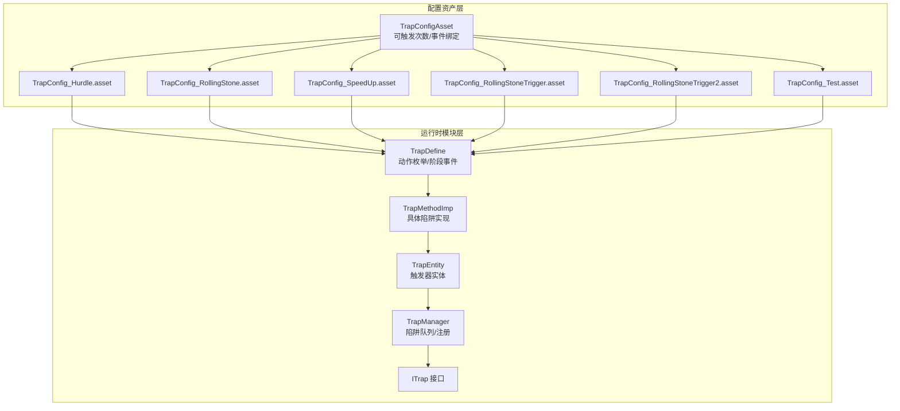
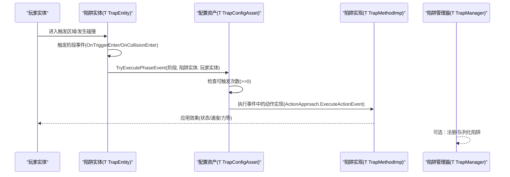
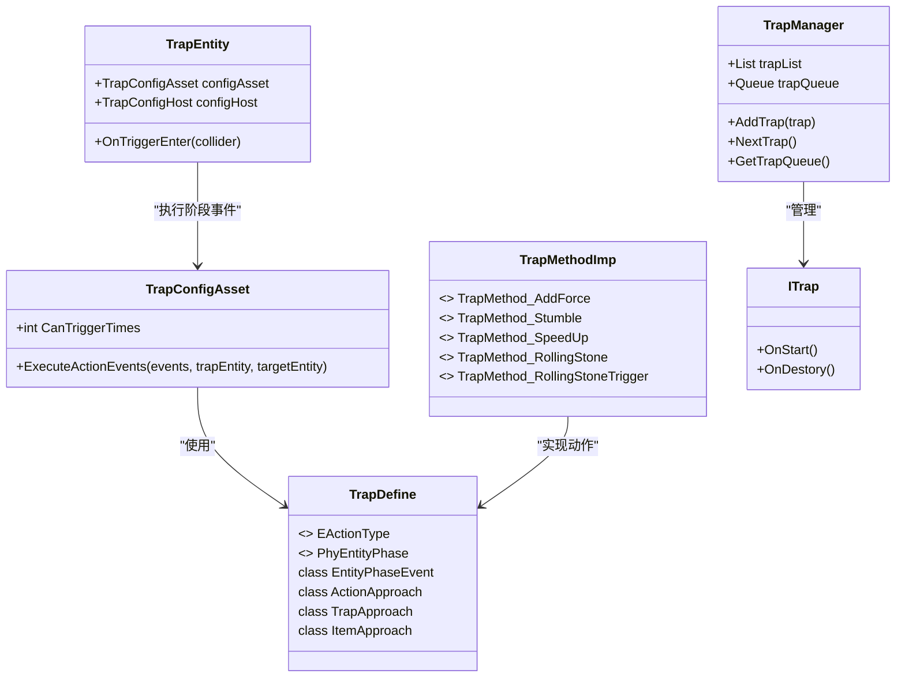
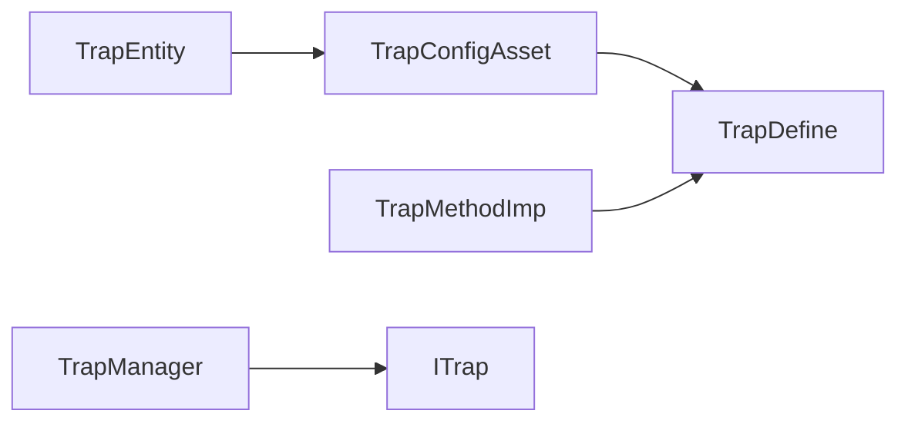

# 陷阱配置系统

<cite>
**本文引用的文件**
- [Assets/Dev/Assets_/TrapConfig_Hurdle.asset](file://Assets/Dev/Assets_/TrapConfig_Hurdle.asset)
- [Assets/Dev/Assets_/TrapConfig_RollingStone.asset](file://Assets/Dev/Assets_/TrapConfig_RollingStone.asset)
- [Assets/Dev/Assets_/TrapConfig_SpeedUp.asset](file://Assets/Dev/Assets_/TrapConfig_SpeedUp.asset)
- [Assets/Dev/Assets_/TrapConfig_RollingStoneTrigger.asset](file://Assets/Dev/Assets_/TrapConfig_RollingStoneTrigger.asset)
- [Assets/Dev/Assets_/TrapConfig_RollingStoneTrigger2.asset](file://Assets/Dev/Assets_/TrapConfig_RollingStoneTrigger2.asset)
- [Assets/Dev/Assets_/TrapConfig_Test.asset](file://Assets/Dev/Assets_/TrapConfig_Test.asset)
- [Assets/Scripts/Config/Entity/Trap/TrapConfigAsset.cs](file://Assets/Scripts/Config/Entity/Trap/TrapConfigAsset.cs)
- [Assets/Scripts/Modules/Traps/TrapDefine.cs](file://Assets/Scripts/Modules/Traps/TrapDefine.cs)
- [Assets/Scripts/Modules/Traps/TrapMethodImp.cs](file://Assets/Scripts/Modules/Traps/TrapMethodImp.cs)
- [Assets/Scripts/Modules/Traps/TrapEntity.cs](file://Assets/Scripts/Modules/Traps/TrapEntity.cs)
- [Assets/Scripts/Modules/Traps/TrapManager.cs](file://Assets/Scripts/Modules/Traps/TrapManager.cs)
- [Assets/Scripts/Modules/Traps/ITrap.cs](file://Assets/Scripts/Modules/Traps/ITrap.cs)
</cite>

## 目录
1. [简介](#简介)
2. [项目结构](#项目结构)
3. [核心组件](#核心组件)
4. [架构总览](#架构总览)
5. [详细组件分析](#详细组件分析)
6. [依赖关系分析](#依赖关系分析)
7. [性能考虑](#性能考虑)
8. [故障排查指南](#故障排查指南)
9. [结论](#结论)
10. [附录](#附录)

## 简介
本文件系统化梳理 ProjectR 的陷阱配置与实现体系，覆盖以下内容：
- 陷阱类型与配置参数：Hurdle 跳跃障碍、RollingStone 滚动石块、SpeedUp 加速陷阱等
- 触发条件、效果参数、持续时间与冷却/触发次数
- 配置继承体系、参数验证与默认值策略
- 创建向导、预览与调试方法
- 平衡性调整、性能优化与兼容性处理

## 项目结构
陷阱系统由“配置资产”和“运行时执行模块”两部分组成：
- 配置资产层：以 ScriptableObject 形式定义陷阱行为与触发条件
- 运行时模块层：负责陷阱实体生命周期、触发检测、效果执行与状态管理

图表来源
- [Assets/Scripts/Config/Entity/Trap/TrapConfigAsset.cs:13-39](file://Assets/Scripts/Config/Entity/Trap/TrapConfigAsset.cs#L13-L39)
- [Assets/Scripts/Modules/Traps/TrapDefine.cs:10-83](file://Assets/Scripts/Modules/Traps/TrapDefine.cs#L10-L83)
- [Assets/Scripts/Modules/Traps/TrapMethodImp.cs:9-148](file://Assets/Scripts/Modules/Traps/TrapMethodImp.cs#L9-L148)
- [Assets/Scripts/Modules/Traps/TrapEntity.cs:6-41](file://Assets/Scripts/Modules/Traps/TrapEntity.cs#L6-L41)
- [Assets/Scripts/Modules/Traps/TrapManager.cs:4-42](file://Assets/Scripts/Modules/Traps/TrapManager.cs#L4-L42)
- [Assets/Scripts/Modules/Traps/ITrap.cs:1-6](file://Assets/Scripts/Modules/Traps/ITrap.cs#L1-L6)

章节来源
- [Assets/Scripts/Config/Entity/Trap/TrapConfigAsset.cs:13-39](file://Assets/Scripts/Config/Entity/Trap/TrapConfigAsset.cs#L13-L39)
- [Assets/Scripts/Modules/Traps/TrapDefine.cs:10-83](file://Assets/Scripts/Modules/Traps/TrapDefine.cs#L10-L83)
- [Assets/Scripts/Modules/Traps/TrapMethodImp.cs:9-148](file://Assets/Scripts/Modules/Traps/TrapMethodImp.cs#L9-L148)
- [Assets/Scripts/Modules/Traps/TrapEntity.cs:6-41](file://Assets/Scripts/Modules/Traps/TrapEntity.cs#L6-L41)
- [Assets/Scripts/Modules/Traps/TrapManager.cs:4-42](file://Assets/Scripts/Modules/Traps/TrapManager.cs#L4-L42)
- [Assets/Scripts/Modules/Traps/ITrap.cs:1-6](file://Assets/Scripts/Modules/Traps/ITrap.cs#L1-L6)

## 核心组件
- 配置资产基类：提供可触发次数、事件执行入口与触发计数逻辑
- 动作与阶段：定义陷阱动作类型、实体触发阶段与事件绑定结构
- 具体陷阱实现：针对不同陷阱类型的具体效果与参数
- 陷阱实体：承载触发器的实体对象，负责碰撞/进入检测并调用配置
- 陷阱管理器：维护陷阱队列与注册，支持扩展

章节来源
- [Assets/Scripts/Config/Entity/Trap/TrapConfigAsset.cs:13-39](file://Assets/Scripts/Config/Entity/Trap/TrapConfigAsset.cs#L13-L39)
- [Assets/Scripts/Modules/Traps/TrapDefine.cs:10-83](file://Assets/Scripts/Modules/Traps/TrapDefine.cs#L10-L83)
- [Assets/Scripts/Modules/Traps/TrapMethodImp.cs:9-148](file://Assets/Scripts/Modules/Traps/TrapMethodImp.cs#L9-L148)
- [Assets/Scripts/Modules/Traps/TrapEntity.cs:6-41](file://Assets/Scripts/Modules/Traps/TrapEntity.cs#L6-L41)
- [Assets/Scripts/Modules/Traps/TrapManager.cs:4-42](file://Assets/Scripts/Modules/Traps/TrapManager.cs#L4-L42)

## 架构总览
陷阱从配置资产到运行时执行的关键流程如下：

图表来源
- [Assets/Scripts/Modules/Traps/TrapEntity.cs:26-31](file://Assets/Scripts/Modules/Traps/TrapEntity.cs#L26-L31)
- [Assets/Scripts/Config/Entity/Trap/TrapConfigAsset.cs:31-38](file://Assets/Scripts/Config/Entity/Trap/TrapConfigAsset.cs#L31-L38)
- [Assets/Scripts/Modules/Traps/TrapMethodImp.cs:23-39](file://Assets/Scripts/Modules/Traps/TrapMethodImp.cs#L23-L39)
- [Assets/Scripts/Modules/Traps/TrapManager.cs:20-37](file://Assets/Scripts/Modules/Traps/TrapManager.cs#L20-L37)

## 详细组件分析

### 配置资产与触发计数
- 可触发次数：整型字段，负值表示无限次；每次成功触发后增加计数
- 执行入口：在阶段事件中统一调用，先检查次数再执行动作
- 默认值：未显式赋值时遵循字段默认

章节来源
- [Assets/Scripts/Config/Entity/Trap/TrapConfigAsset.cs:15-17](file://Assets/Scripts/Config/Entity/Trap/TrapConfigAsset.cs#L15-L17)
- [Assets/Scripts/Config/Entity/Trap/TrapConfigAsset.cs:31-38](file://Assets/Scripts/Config/Entity/Trap/TrapConfigAsset.cs#L31-L38)

### 动作与阶段定义
- 动作类型：AddForce(施力)、Stumble(绊倒)、SpeedUp(加速)、RegisteredEvent、DispatchEvent
- 实体阶段：OnTriggerEnter、OnCollisionEnter 等，用于绑定不同触发条件
- 事件结构：EntityPhaseEvent 绑定阶段与事件列表，事件项通过 SerializeReference 指向具体实现

章节来源
- [Assets/Scripts/Modules/Traps/TrapDefine.cs:11-33](file://Assets/Scripts/Modules/Traps/TrapDefine.cs#L11-L33)
- [Assets/Scripts/Modules/Traps/TrapDefine.cs:36-82](file://Assets/Scripts/Modules/Traps/TrapDefine.cs#L36-L82)

### 陷阱实体与触发检测
- 陷阱实体继承自 LogicEntity，创建时绑定物理组件与触发回调
- 在 OnTriggerEnter 中根据阶段事件调用配置资产执行
- 支持绘制 Gizmos 辅助调试

章节来源
- [Assets/Scripts/Modules/Traps/TrapEntity.cs:6-41](file://Assets/Scripts/Modules/Traps/TrapEntity.cs#L6-L41)

### 陷阱管理器
- 提供队列与列表，支持按需注册与取出
- 当前仅作为占位，便于后续扩展

章节来源
- [Assets/Scripts/Modules/Traps/TrapManager.cs:4-42](file://Assets/Scripts/Modules/Traps/TrapManager.cs#L4-L42)
- [Assets/Scripts/Modules/Traps/ITrap.cs:1-6](file://Assets/Scripts/Modules/Traps/ITrap.cs#L1-L6)

### 具体陷阱实现与参数

#### Hurdle 跳跃障碍
- 动作类型：绊倒
- 行为特征：播放动作动画、使目标进入特定状态、移除速度修饰
- 触发次数：有限制（示例资产中为 1）
- 物理标记：isPhysics=0

章节来源
- [Assets/Dev/Assets_/TrapConfig_Hurdle.asset:15-21](file://Assets/Dev/Assets_/TrapConfig_Hurdle.asset#L15-L21)
- [Assets/Scripts/Modules/Traps/TrapMethodImp.cs:45-60](file://Assets/Scripts/Modules/Traps/TrapMethodImp.cs#L45-L60)

#### RollingStone 滚动石块
- 动作类型：绊倒
- 行为特征：改变可见材质颜色、使目标进入特定状态
- 触发次数：无限制（示例资产中为 -1）
- 物理标记：isPhysics=1（用于强调物理参与）

章节来源
- [Assets/Dev/Assets_/TrapConfig_RollingStone.asset:15-21](file://Assets/Dev/Assets_/TrapConfig_RollingStone.asset#L15-L21)
- [Assets/Dev/Assets_/TrapConfig_RollingStone.asset:29-31](file://Assets/Dev/Assets_/TrapConfig_RollingStone.asset#L29-L31)
- [Assets/Scripts/Modules/Traps/TrapMethodImp.cs:96-108](file://Assets/Scripts/Modules/Traps/TrapMethodImp.cs#L96-L108)

#### SpeedUp 加速陷阱
- 动作类型：实体加速
- 参数：
  - 速度增量：speed
  - 持续时间：duration
  - 转向系数：orientationSharpness
- 行为特征：添加速度修饰与最近非零输入方向，维持移动朝向平滑

章节来源
- [Assets/Dev/Assets_/TrapConfig_SpeedUp.asset:15-21](file://Assets/Dev/Assets_/TrapConfig_SpeedUp.asset#L15-L21)
- [Assets/Dev/Assets_/TrapConfig_SpeedUp.asset:27-31](file://Assets/Dev/Assets_/TrapConfig_SpeedUp.asset#L27-L31)
- [Assets/Scripts/Modules/Traps/TrapMethodImp.cs:77-92](file://Assets/Scripts/Modules/Traps/TrapMethodImp.cs#L77-L92)

#### RollingStoneTrigger 滚石触发器
- 动作类型：绊倒
- 行为特征：根据 ManualGroup 分组查找并生成对应陷阱实体
- 参数：group（字符串分组标识）

章节来源
- [Assets/Dev/Assets_/TrapConfig_RollingStoneTrigger.asset:15-21](file://Assets/Dev/Assets_/TrapConfig_RollingStoneTrigger.asset#L15-L21)
- [Assets/Dev/Assets_/TrapConfig_RollingStoneTrigger.asset:27-29](file://Assets/Dev/Assets_/TrapConfig_RollingStoneTrigger.asset#L27-L29)
- [Assets/Scripts/Modules/Traps/TrapMethodImp.cs:113-147](file://Assets/Scripts/Modules/Traps/TrapMethodImp.cs#L113-L147)

#### RollingStoneTrigger2 滚石触发器（变体）
- 结构与行为同上，用于多组触发场景
- 参数：group（字符串分组标识）

章节来源
- [Assets/Dev/Assets_/TrapConfig_RollingStoneTrigger2.asset:15-21](file://Assets/Dev/Assets_/TrapConfig_RollingStoneTrigger2.asset#L15-L21)
- [Assets/Dev/Assets_/TrapConfig_RollingStoneTrigger2.asset:27-29](file://Assets/Dev/Assets_/TrapConfig_RollingStoneTrigger2.asset#L27-L29)
- [Assets/Scripts/Modules/Traps/TrapMethodImp.cs:113-147](file://Assets/Scripts/Modules/Traps/TrapMethodImp.cs#L113-L147)

#### 测试配置（示例）
- 用途：快速验证配置资产创建与事件绑定
- 建议：使用编辑器菜单创建新资产进行测试

章节来源
- [Assets/Dev/Assets_/TrapConfig_Test.asset](file://Assets/Dev/Assets_/TrapConfig_Test.asset)

### 类关系图（代码级）

图表来源
- [Assets/Scripts/Config/Entity/Trap/TrapConfigAsset.cs:13-39](file://Assets/Scripts/Config/Entity/Trap/TrapConfigAsset.cs#L13-L39)
- [Assets/Scripts/Modules/Traps/TrapDefine.cs:10-83](file://Assets/Scripts/Modules/Traps/TrapDefine.cs#L10-L83)
- [Assets/Scripts/Modules/Traps/TrapMethodImp.cs:9-148](file://Assets/Scripts/Modules/Traps/TrapMethodImp.cs#L9-L148)
- [Assets/Scripts/Modules/Traps/TrapEntity.cs:6-41](file://Assets/Scripts/Modules/Traps/TrapEntity.cs#L6-L41)
- [Assets/Scripts/Modules/Traps/TrapManager.cs:4-42](file://Assets/Scripts/Modules/Traps/TrapManager.cs#L4-L42)
- [Assets/Scripts/Modules/Traps/ITrap.cs:1-6](file://Assets/Scripts/Modules/Traps/ITrap.cs#L1-L6)

## 依赖关系分析
- 配置资产依赖于动作与阶段定义，通过事件列表绑定具体实现
- 陷阱实体依赖配置资产执行阶段事件
- 陷阱实现依赖系统接口（如状态机、实体上下文）应用效果
- 陷阱管理器与接口解耦，便于扩展

图表来源
- [Assets/Scripts/Config/Entity/Trap/TrapConfigAsset.cs:31-38](file://Assets/Scripts/Config/Entity/Trap/TrapConfigAsset.cs#L31-L38)
- [Assets/Scripts/Modules/Traps/TrapDefine.cs:45-58](file://Assets/Scripts/Modules/Traps/TrapDefine.cs#L45-L58)
- [Assets/Scripts/Modules/Traps/TrapEntity.cs:26-31](file://Assets/Scripts/Modules/Traps/TrapEntity.cs#L26-L31)
- [Assets/Scripts/Modules/Traps/TrapManager.cs:20-37](file://Assets/Scripts/Modules/Traps/TrapManager.cs#L20-L37)
- [Assets/Scripts/Modules/Traps/ITrap.cs:1-6](file://Assets/Scripts/Modules/Traps/ITrap.cs#L1-L6)

## 性能考虑
- 触发检测：尽量使用合适的 Collider 形状与层级，减少不必要的触发回调
- 效果持续：合理设置持续时间与更新频率，避免每帧高开销计算
- 对象池：对于频繁生成销毁的陷阱实体，建议结合对象池减少 GC 抖动
- 物理参与：isPhysics 标记为真时会引入物理计算成本，应按需启用
- 状态切换：避免在同一帧内对同一实体反复切换状态

## 故障排查指南
- 触发无效
  - 检查实体阶段是否匹配（如 OnTriggerEnter）
  - 检查配置资产的事件列表是否正确绑定
  - 检查可触发次数是否已达上限
- 效果异常
  - 校验参数范围（如速度、持续时间、转向系数）
  - 确认目标实体未处于不可控状态（如无敌）
- 调试建议
  - 使用 Gizmos 绘制陷阱体积
  - 在陷阱实体中打印触发日志
  - 使用编辑器菜单创建测试配置快速验证

章节来源
- [Assets/Scripts/Modules/Traps/TrapEntity.cs:33-39](file://Assets/Scripts/Modules/Traps/TrapEntity.cs#L33-L39)
- [Assets/Scripts/Config/Entity/Trap/TrapConfigAsset.cs:31-38](file://Assets/Scripts/Config/Entity/Trap/TrapConfigAsset.cs#L31-L38)

## 结论
陷阱配置系统通过“配置资产 + 运行时实现”的分层设计，实现了灵活且可扩展的行为定义。不同陷阱类型在统一的动作与阶段框架下，通过参数化配置实现差异化效果。建议在实际关卡设计中结合平衡性与性能需求，合理设置触发次数、持续时间与参数阈值。

## 附录

### 配置参数对照表
- Hurdle（跳跃障碍）
  - 触发次数：有限（示例为 1）
  - 效果：绊倒、移除速度修饰
  - 物理标记：否
- RollingStone（滚动石块）
  - 触发次数：无限（示例为 -1）
  - 效果：绊倒、视觉提示
  - 物理标记：是
- SpeedUp（加速陷阱）
  - 触发次数：无限（示例为 -1）
  - 参数：速度、持续时间、转向系数
- RollingStoneTrigger（滚石触发器）
  - 触发次数：有限（示例为 1）
  - 参数：分组标识（字符串）

章节来源
- [Assets/Dev/Assets_/TrapConfig_Hurdle.asset:15-21](file://Assets/Dev/Assets_/TrapConfig_Hurdle.asset#L15-L21)
- [Assets/Dev/Assets_/TrapConfig_RollingStone.asset:15-21](file://Assets/Dev/Assets_/TrapConfig_RollingStone.asset#L15-L21)
- [Assets/Dev/Assets_/TrapConfig_SpeedUp.asset:15-21](file://Assets/Dev/Assets_/TrapConfig_SpeedUp.asset#L15-L21)
- [Assets/Dev/Assets_/TrapConfig_RollingStoneTrigger.asset:15-21](file://Assets/Dev/Assets_/TrapConfig_RollingStoneTrigger.asset#L15-L21)
- [Assets/Dev/Assets_/TrapConfig_RollingStoneTrigger2.asset:15-21](file://Assets/Dev/Assets_/TrapConfig_RollingStoneTrigger2.asset#L15-L21)

### 创建向导与工具
- 创建配置资产
  - 使用编辑器菜单：Assets → PJR → 创建配置 → 机关陷阱 → 机关陷阱配置
- 预览与调试
  - 在场景中放置陷阱实体，观察触发区域与效果
  - 使用 Gizmos 查看碰撞体积
  - 通过测试配置快速验证事件链路

章节来源
- [Assets/Scripts/Config/Entity/Trap/TrapConfigAsset.cs:19-25](file://Assets/Scripts/Config/Entity/Trap/TrapConfigAsset.cs#L19-L25)
- [Assets/Scripts/Modules/Traps/TrapEntity.cs:33-39](file://Assets/Scripts/Modules/Traps/TrapEntity.cs#L33-L39)