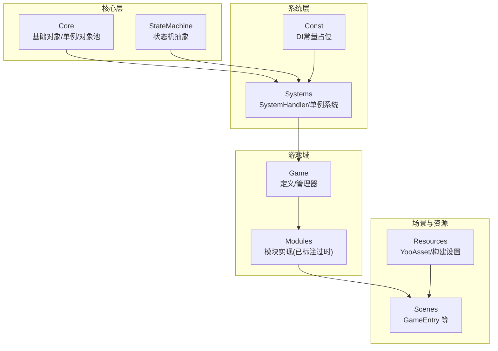
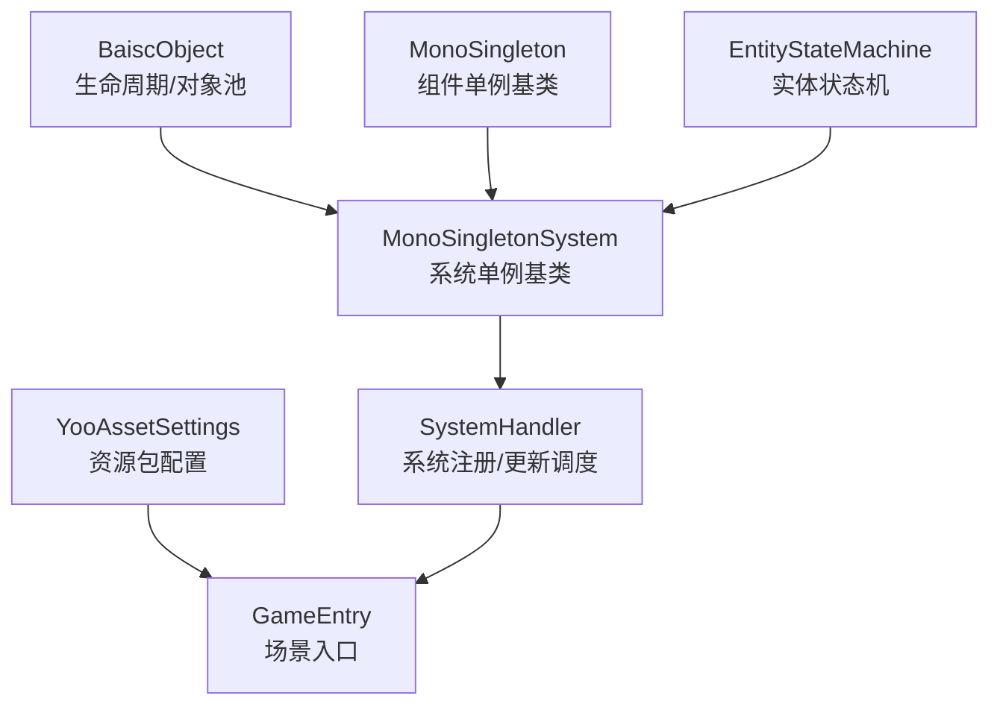
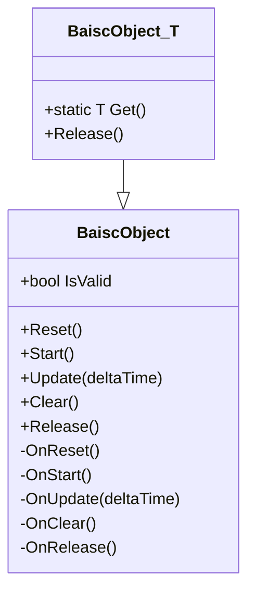
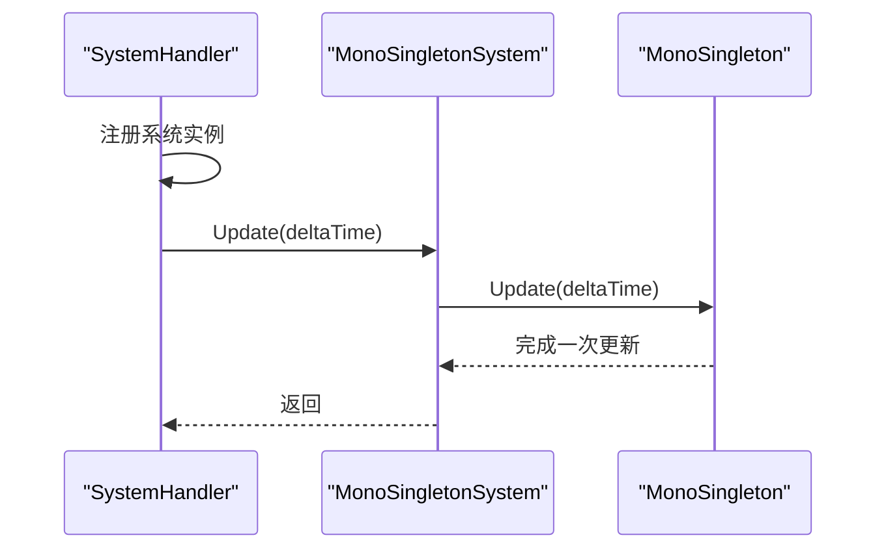
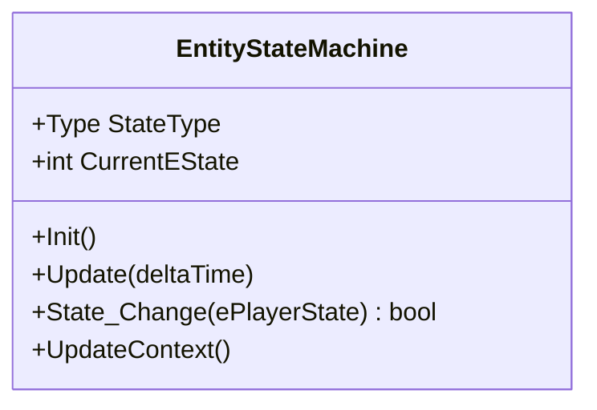
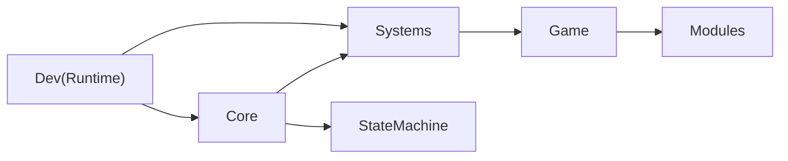

# 项目概述

<cite>
**本文引用的文件**
- [Assets/Scripts/Core/BaiscObject.cs](file://Assets/Scripts/Core/BaiscObject.cs)
- [Assets/Scripts/Core/MonoSingleton.cs](file://Assets/Scripts/Core/MonoSingleton.cs)
- [Assets/Scripts/Systems/SystemHandler.cs](file://Assets/Scripts/Systems/SystemHandler.cs)
- [Assets/Scripts/Systems/MonoSingletonSystem.cs](file://Assets/Scripts/Systems/MonoSingletonSystem.cs)
- [Assets/Scripts/StateMachine/EntityStateMachine.cs](file://Assets/Scripts/StateMachine/EntityStateMachine.cs)
- [Assets/Resources/YooAssetSettings.asset](file://Assets/Resources/YooAssetSettings.asset)
- [Assets/Scenes/GameEntry.unity](file://Assets/Scenes/GameEntry.unity)
- [Assets/Scripts/Const/DIConst.cs](file://Assets/Scripts/Const/DIConst.cs)
- [Assets/Dev/Scripts/Runtime/PJR.Dev.Runtime.asmdef](file://Assets/Dev/Scripts/Runtime/PJR.Dev.Runtime.asmdef)
- [Assets/Scripts/Core/__info__.json](file://Assets/Scripts/Core/__info__.json)
- [Assets/Dev/__info__.json](file://Assets/Dev/__info__.json)
- [Assets/Scripts/Game/__info__.json](file://Assets/Scripts/Game/__info__.json)
- [Assets/Scripts/Modules/__info__.json](file://Assets/Scripts/Modules/__info__.json)
- [Assets/Scripts/Systems/__info__.json](file://Assets/Scripts/Systems/__info__.json)
</cite>

## 目录
1. [引言](#引言)
2. [项目结构](#项目结构)
3. [核心组件](#核心组件)
4. [架构总览](#架构总览)
5. [详细组件分析](#详细组件分析)
6. [依赖分析](#依赖分析)
7. [性能考虑](#性能考虑)
8. [故障排查指南](#故障排查指南)
9. [结论](#结论)
10. [附录](#附录)

## 引言
ProjectR 是一个基于 Unity 的游戏引擎项目，定位为“可复用、模块化、可扩展”的通用游戏基础设施与示例工程。项目旨在通过统一的系统框架、对象生命周期管理、资源加载策略与状态机机制，支撑从原型到正式产品的快速迭代。它既适合初学者理解 Unity 游戏开发中的常见模式（如单例系统、对象池、状态机、资源包管理），也为有经验的开发者提供了可扩展的架构基座。

项目在游戏开发领域的典型应用场景包括但不限于：
- 快节奏平台跳跃/动作类游戏
- 关卡驱动型 RPG 或塔防
- 多人联机或单机剧情驱动游戏（结合网络同步组件）
- 需要复杂实体行为与交互的休闲/策略类游戏

## 项目结构
项目采用“分层+模块化”组织方式，核心目录与职责概览如下：
- Assets/Scripts/Core：通用基础能力（对象生命周期、单例基类、对象池等）
- Assets/Scripts/Systems：系统层（系统注册、更新调度、单例系统基类）
- Assets/Scripts/StateMachine：状态机抽象与实体状态机
- Assets/Scripts/Game：游戏域定义（定义、管理器等）
- Assets/Scripts/Modules：模块实现（当前标记为过时，建议迁移至 Dev 或 Core/Game）
- Assets/Scenes：场景入口与测试场景（GameEntry 等）
- Assets/Resources：运行时资源配置（如资源包收集器设置、YooAsset 设置）
- Assets/Dev：开发期工具、示例与实验性代码（示例工程、实验室代码）

**图表来源**
- [Assets/Scripts/Core/BaiscObject.cs:1-167](file://Assets/Scripts/Core/BaiscObject.cs#L1-L167)
- [Assets/Scripts/Systems/SystemHandler.cs:1-71](file://Assets/Scripts/Systems/SystemHandler.cs#L1-L71)
- [Assets/Scripts/StateMachine/EntityStateMachine.cs:1-15](file://Assets/Scripts/StateMachine/EntityStateMachine.cs#L1-L15)
- [Assets/Scenes/GameEntry.unity:1-800](file://Assets/Scenes/GameEntry.unity#L1-L800)
- [Assets/Resources/YooAssetSettings.asset:1-17](file://Assets/Resources/YooAssetSettings.asset#L1-L17)

**章节来源**
- [Assets/Scripts/Core/__info__.json:1-3](file://Assets/Scripts/Core/__info__.json#L1-L3)
- [Assets/Dev/__info__.json:1-3](file://Assets/Dev/__info__.json#L1-L3)
- [Assets/Scripts/Game/__info__.json:1-3](file://Assets/Scripts/Game/__info__.json#L1-L3)
- [Assets/Scripts/Modules/__info__.json:1-4](file://Assets/Scripts/Modules/__info__.json#L1-L4)
- [Assets/Scripts/Systems/__info__.json:1-3](file://Assets/Scripts/Systems/__info__.json#L1-L3)

## 核心组件
本节聚焦于项目的关键构件及其职责边界，帮助读者快速把握系统骨架。

- 基础对象与生命周期
  - BaiscObject 抽象了“重置-启动-更新-清理-释放”的完整生命周期，并内置对象池封装，便于减少 GC 压力与提升对象复用效率。
  - 提供泛型 Pool<T> 与派生类 BaiscObject<T>，简化获取与释放流程。

- 单例与系统调度
  - MonoSingleton 提供 Unity 组件生命周期下的单例基类，支持延迟实例化与初始化协程。
  - MonoSingletonSystem 为系统型单例提供统一挂载点与注册逻辑，自动接入 SystemHandler 的统一 Update 循环。
  - SystemHandler 负责系统实例的注册、父子关系维护与每帧更新调度，支持编辑器采样统计。

- 状态机
  - EntityStateMachine 定义实体状态机的统一接口（状态类型、当前状态、切换、上下文更新等），便于扩展具体实体的状态机实现。

- 资源与构建
  - YooAssetSettings 提供资源包清单与默认资源目录命名约定，配合 AssetBundle 收集器配置，形成稳定的资源加载管线。

**章节来源**
- [Assets/Scripts/Core/BaiscObject.cs:1-167](file://Assets/Scripts/Core/BaiscObject.cs#L1-L167)
- [Assets/Scripts/Core/MonoSingleton.cs:1-70](file://Assets/Scripts/Core/MonoSingleton.cs#L1-L70)
- [Assets/Scripts/Systems/MonoSingletonSystem.cs:1-37](file://Assets/Scripts/Systems/MonoSingletonSystem.cs#L1-L37)
- [Assets/Scripts/Systems/SystemHandler.cs:1-71](file://Assets/Scripts/Systems/SystemHandler.cs#L1-L71)
- [Assets/Scripts/StateMachine/EntityStateMachine.cs:1-15](file://Assets/Scripts/StateMachine/EntityStateMachine.cs#L1-L15)
- [Assets/Resources/YooAssetSettings.asset:1-17](file://Assets/Resources/YooAssetSettings.asset#L1-L17)

## 架构总览
ProjectR 的总体架构围绕“系统驱动 + 生命周期管理 + 资源管线”展开。系统通过 SystemHandler 统一调度，实体与模块通过 BaiscObject 生命周期与 MonoSingleton 基类进行管理；状态机为实体行为提供可组合的控制结构；资源层以 YooAsset 为核心，确保运行时资源加载的稳定与可维护性。

**图表来源**
- [Assets/Scripts/Systems/SystemHandler.cs:1-71](file://Assets/Scripts/Systems/SystemHandler.cs#L1-L71)
- [Assets/Scripts/Systems/MonoSingletonSystem.cs:1-37](file://Assets/Scripts/Systems/MonoSingletonSystem.cs#L1-L37)
- [Assets/Scripts/Core/MonoSingleton.cs:1-70](file://Assets/Scripts/Core/MonoSingleton.cs#L1-L70)
- [Assets/Scripts/Core/BaiscObject.cs:1-167](file://Assets/Scripts/Core/BaiscObject.cs#L1-L167)
- [Assets/Scripts/StateMachine/EntityStateMachine.cs:1-15](file://Assets/Scripts/StateMachine/EntityStateMachine.cs#L1-L15)
- [Assets/Resources/YooAssetSettings.asset:1-17](file://Assets/Resources/YooAssetSettings.asset#L1-L17)
- [Assets/Scenes/GameEntry.unity:1-800](file://Assets/Scenes/GameEntry.unity#L1-L800)

## 详细组件分析

### 生命周期与对象池（BaiscObject）
- 设计要点
  - 明确的生命周期：Reset → Start → Update → Clear → Release，保证资源可控回收。
  - 内置状态机（None/Running/Released）防止重复释放与非法调用。
  - 对象池封装 Pool<T>，统一 Get/Release 流程，降低 GC 压力。
- 使用建议
  - 所有需要复用的对象优先继承 BaiscObject<T>，并在 Clear 中释放引用，避免内存泄漏。
  - 在高频创建销毁的场景（如弹幕、特效）优先使用对象池。

**图表来源**
- [Assets/Scripts/Core/BaiscObject.cs:1-167](file://Assets/Scripts/Core/BaiscObject.cs#L1-L167)

**章节来源**
- [Assets/Scripts/Core/BaiscObject.cs:1-167](file://Assets/Scripts/Core/BaiscObject.cs#L1-L167)

### 系统调度与单例（SystemHandler / MonoSingletonSystem）
- 设计要点
  - MonoSingletonSystem 将系统实例自动注册到 SystemHandler，并在场景中以 GameObject 形式存在，便于调试与层级管理。
  - SystemHandler 在每帧遍历并调用各系统 Update，支持编辑器 Profiler 采样，便于性能分析。
- 使用建议
  - 新增系统时继承 MonoSingletonSystem<T>，在 Initialize 中完成异步初始化，避免阻塞主线程。
  - 将系统按功能拆分（输入、渲染、AI、网络等），保持低耦合高内聚。

**图表来源**
- [Assets/Scripts/Systems/SystemHandler.cs:1-71](file://Assets/Scripts/Systems/SystemHandler.cs#L1-L71)
- [Assets/Scripts/Systems/MonoSingletonSystem.cs:1-37](file://Assets/Scripts/Systems/MonoSingletonSystem.cs#L1-L37)
- [Assets/Scripts/Core/MonoSingleton.cs:1-70](file://Assets/Scripts/Core/MonoSingleton.cs#L1-L70)

**章节来源**
- [Assets/Scripts/Systems/SystemHandler.cs:1-71](file://Assets/Scripts/Systems/SystemHandler.cs#L1-L71)
- [Assets/Scripts/Systems/MonoSingletonSystem.cs:1-37](file://Assets/Scripts/Systems/MonoSingletonSystem.cs#L1-L37)
- [Assets/Scripts/Core/MonoSingleton.cs:1-70](file://Assets/Scripts/Core/MonoSingleton.cs#L1-L70)

### 实体状态机（EntityStateMachine）
- 设计要点
  - 抽象出状态类型、当前状态、状态切换与上下文更新接口，便于不同实体（敌人、NPC、陷阱）复用。
  - 可与 MonoSingletonSystem 结合，将状态机作为系统的一部分进行统一调度。
- 使用建议
  - 将复杂行为拆分为多个状态，使用状态切换函数集中处理转换条件。
  - 在 UpdateContext 中维护状态机所需的数据上下文，避免状态机内部持有过多外部引用。

**图表来源**
- [Assets/Scripts/StateMachine/EntityStateMachine.cs:1-15](file://Assets/Scripts/StateMachine/EntityStateMachine.cs#L1-L15)

**章节来源**
- [Assets/Scripts/StateMachine/EntityStateMachine.cs:1-15](file://Assets/Scripts/StateMachine/EntityStateMachine.cs#L1-L15)

### 场景入口与运行时环境（GameEntry）
- 设计要点
  - GameEntry 作为场景入口，承载相机、资源加载、系统初始化等初始逻辑。
  - 可在此处触发资源包加载、系统 Initialize、UI 初始化等步骤。
- 使用建议
  - 将初始化流程拆分为多个阶段（资源准备、系统注册、UI 显示），便于调试与热重载。

**章节来源**
- [Assets/Scenes/GameEntry.unity:1-800](file://Assets/Scenes/GameEntry.unity#L1-L800)

### 资源与构建（YooAssetSettings）
- 设计要点
  - YooAssetSettings 指定清单文件名与默认资源目录，配合 AssetBundle 收集器配置，形成稳定的资源加载与更新机制。
- 使用建议
  - 在构建前校验清单与资源映射，确保运行时加载路径正确。
  - 将资源按模块划分，避免跨模块耦合。

**章节来源**
- [Assets/Resources/YooAssetSettings.asset:1-17](file://Assets/Resources/YooAssetSettings.asset#L1-L17)

## 依赖分析
- 组件内聚与耦合
  - Core 层提供通用能力，Systems 依赖 Core 并向上提供系统抽象；Game 与 Modules 依赖 Systems 与 Core。
  - SystemHandler 作为调度中枢，对各系统强依赖；系统间通过接口解耦。
- 外部依赖与集成点
  - 项目包含 Unity Netcode for GameObjects（LocalPackages/com.unity.netcode.gameobjects...），可用于多人联机场景。
  - 示例工程与开发工具位于 Dev 目录，建议在独立程序集（asmdef）中管理，避免污染核心库。

**图表来源**
- [Assets/Dev/Scripts/Runtime/PJR.Dev.Runtime.asmdef:1-18](file://Assets/Dev/Scripts/Runtime/PJR.Dev.Runtime.asmdef#L1-L18)

**章节来源**
- [Assets/Dev/Scripts/Runtime/PJR.Dev.Runtime.asmdef:1-18](file://Assets/Dev/Scripts/Runtime/PJR.Dev.Runtime.asmdef#L1-L18)

## 性能考虑
- 对象池与生命周期
  - 使用 BaiscObject<T>.Pool<T> 与对象池减少频繁分配，降低 GC 峰值。
- 系统更新调度
  - SystemHandler 每帧顺序遍历系统 Update，建议将耗时操作拆分到多帧或使用协程异步化。
- 资源加载
  - 通过 YooAsset 分包加载与缓存，避免首屏卡顿；在场景切换时及时卸载不再使用的资源。
- 状态机
  - 将状态切换与昂贵计算拆分，避免在 Update 中执行重型逻辑。

## 故障排查指南
- 系统未注册或未更新
  - 检查系统是否继承 MonoSingletonSystem<T> 并在 OnInstantiated 中被 SystemHandler 注册。
  - 确认场景中存在 SystemHandler 实例且未被销毁。
- 对象池异常
  - 若出现重复释放或空引用错误，检查 BaiscObject 的状态机流转是否符合生命周期约束。
- 资源加载失败
  - 校验 YooAssetSettings 的清单与目录配置，确认资源包构建与打包路径一致。
- 性能瓶颈
  - 使用 SystemHandler 的 Profiler 采样定位热点系统，必要时拆分系统或优化 Update 逻辑。

**章节来源**
- [Assets/Scripts/Systems/SystemHandler.cs:1-71](file://Assets/Scripts/Systems/SystemHandler.cs#L1-L71)
- [Assets/Scripts/Core/BaiscObject.cs:1-167](file://Assets/Scripts/Core/BaiscObject.cs#L1-L167)
- [Assets/Resources/YooAssetSettings.asset:1-17](file://Assets/Resources/YooAssetSettings.asset#L1-L17)

## 结论
ProjectR 通过“系统驱动 + 生命周期管理 + 状态机 + 资源管线”的架构，为 Unity 游戏开发提供了清晰、可扩展的基础设施。它既满足初学者的学习曲线需求，也具备足够深度以支撑复杂项目的演进。建议在实际项目中遵循模块化与低耦合原则，充分利用对象池与系统调度机制，持续优化资源加载与运行时性能。

## 附录
- 术语说明
  - 系统：由 MonoSingletonSystem<T> 表达的可注册、可更新的运行时模块。
  - 生命周期：Reset → Start → Update → Clear → Release 的完整流程。
  - 状态机：EntityStateMachine 抽象的实体行为控制结构。
  - 资源包：YooAsset 管理的可热更新资源集合。
- 使用场景示例
  - 创建一个新系统：继承 MonoSingletonSystem<T>，在 Initialize 中完成异步初始化，SystemHandler 将自动调度其 Update。
  - 复用对象：通过 BaiscObject<T>.Pool<T>.Get() 获取对象，使用完毕后调用 Release，交还给对象池。
  - 实体行为：为角色实现一个实体状态机，定义 Idle/Walk/Attack 等状态，通过 State_Change 进行切换。